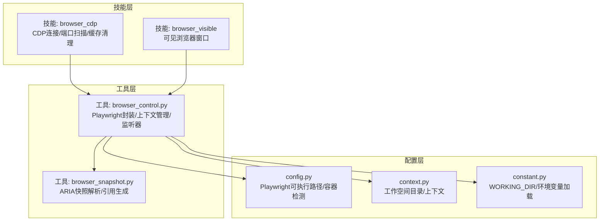
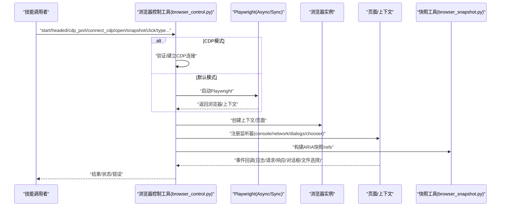
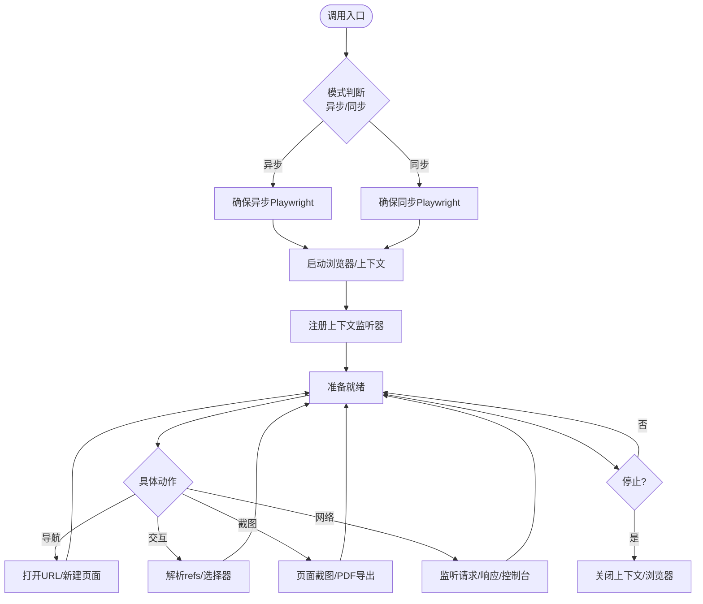
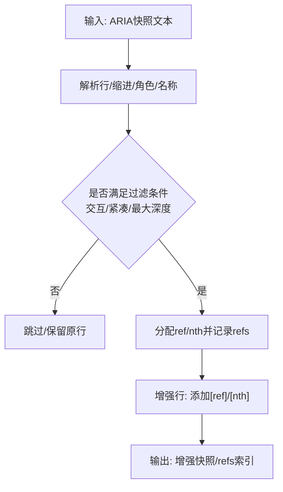
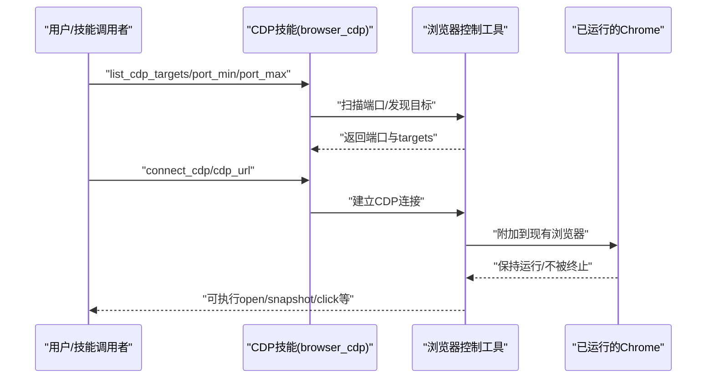
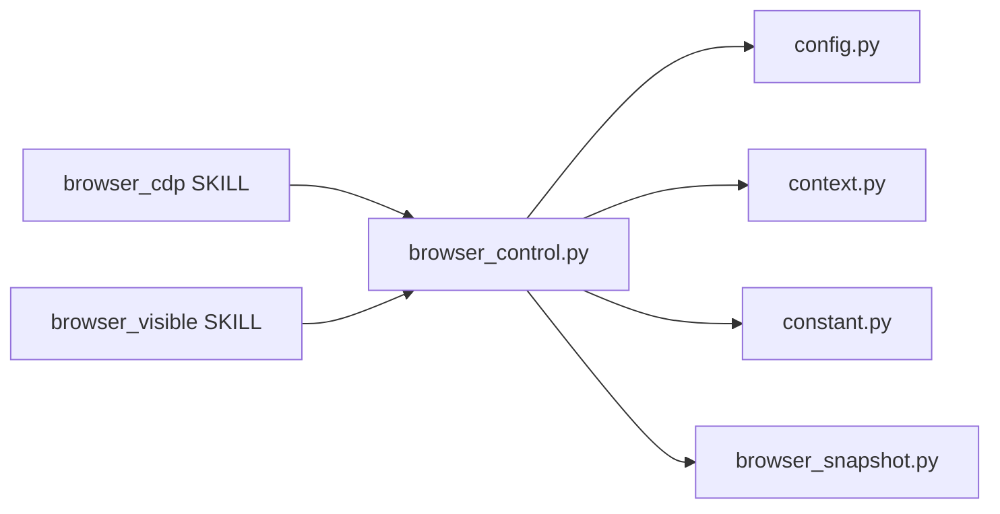

# CDP浏览器自动化

<cite>
**本文档引用的文件**
- [browser_control.py](file://src/qwenpaw/agents/tools/browser_control.py)
- [browser_snapshot.py](file://src/qwenpaw/agents/tools/browser_snapshot.py)
- [SKILL.md（browser_cdp）](file://src/qwenpaw/agents/skills/browser_cdp/SKILL.md)
- [SKILL.md（browser_visible）](file://src/qwenpaw/agents/skills/browser_visible/SKILL.md)
- [config.py](file://src/qwenpaw/config/config.py)
- [context.py](file://src/qwenpaw/config/context.py)
- [constant.py](file://src/qwenpaw/constant.py)
</cite>

## 目录
1. [简介](#简介)
2. [项目结构](#项目结构)
3. [核心组件](#核心组件)
4. [架构总览](#架构总览)
5. [详细组件分析](#详细组件分析)
6. [依赖分析](#依赖分析)
7. [性能考虑](#性能考虑)
8. [故障排除指南](#故障排除指南)
9. [结论](#结论)
10. [附录](#附录)

## 简介
本技术文档面向QwenPaw的CDP（Chrome DevTools Protocol）浏览器自动化能力，系统阐述基于Playwright的无头/可见浏览器自动化实现原理与实践方法。文档覆盖CDP连接与端口扫描、页面导航与元素交互、截图与快照、网络请求拦截与监控、JavaScript执行、性能与资源监控、反爬虫应对策略、浏览器兼容性处理，以及现代Web应用（AJAX、SPA、WebAssembly/WebGL）的复杂交互适配。

## 项目结构
与CDP浏览器自动化直接相关的代码主要位于以下模块：
- 工具层：浏览器控制与快照构建
- 技能层：CDP与可见浏览器技能说明
- 配置层：浏览器启动参数、工作空间路径与环境变量

**图表来源**
- [browser_control.py:1-120](file://src/qwenpaw/agents/tools/browser_control.py#L1-L120)
- [browser_snapshot.py:1-66](file://src/qwenpaw/agents/tools/browser_snapshot.py#L1-L66)
- [SKILL.md（browser_cdp）:1-46](file://src/qwenpaw/agents/skills/browser_cdp/SKILL.md#L1-L46)
- [SKILL.md（browser_visible）:1-20](file://src/qwenpaw/agents/skills/browser_visible/SKILL.md#L1-L20)
- [config.py](file://src/qwenpaw/config/config.py)
- [context.py](file://src/qwenpaw/config/context.py)
- [constant.py](file://src/qwenpaw/constant.py)

**章节来源**
- [browser_control.py:1-120](file://src/qwenpaw/agents/tools/browser_control.py#L1-L120)
- [browser_snapshot.py:1-66](file://src/qwenpaw/agents/tools/browser_snapshot.py#L1-L66)
- [SKILL.md（browser_cdp）:1-46](file://src/qwenpaw/agents/skills/browser_cdp/SKILL.md#L1-L46)
- [SKILL.md（browser_visible）:1-20](file://src/qwenpaw/agents/skills/browser_visible/SKILL.md#L1-L20)

## 核心组件
- 浏览器控制工具（browser_control.py）
  - 支持异步/同步Playwright模式，按平台与容器环境选择启动策略
  - 统一的浏览器生命周期管理（启动/停止/空闲回收）
  - 页面上下文与监听器注册（控制台日志、网络请求、对话框、文件选择器）
  - 引用（refs）体系与帧级定位，支持基于ARIA的角色定位
  - CDP连接模式（扫描端口、连接已有浏览器、暴露CDP端口）
- 快照构建工具（browser_snapshot.py）
  - 解析Playwright ARIA快照，提取交互元素并生成ref索引
  - 支持紧凑树输出、最大深度过滤、仅交互元素过滤
- 技能说明（browser_cdp / browser_visible）
  - 明确CDP模式的隐私风险与单实例限制
  - 规范可见浏览器的使用场景与行为差异

**章节来源**
- [browser_control.py:492-795](file://src/qwenpaw/agents/tools/browser_control.py#L492-L795)
- [browser_snapshot.py:185-249](file://src/qwenpaw/agents/tools/browser_snapshot.py#L185-L249)
- [SKILL.md（browser_cdp）:19-46](file://src/qwenpaw/agents/skills/browser_cdp/SKILL.md#L19-L46)
- [SKILL.md（browser_visible）:13-20](file://src/qwenpaw/agents/skills/browser_visible/SKILL.md#L13-L20)

## 架构总览
下图展示了从技能调用到浏览器控制、再到Playwright执行的整体流程，以及CDP模式下的特殊路径。

**图表来源**
- [browser_control.py:492-795](file://src/qwenpaw/agents/tools/browser_control.py#L492-L795)
- [browser_control.py:422-461](file://src/qwenpaw/agents/tools/browser_control.py#L422-L461)
- [browser_snapshot.py:185-249](file://src/qwenpaw/agents/tools/browser_snapshot.py#L185-L249)

## 详细组件分析

### 组件A：浏览器控制与上下文管理
- 功能要点
  - 模式选择：Windows/Uvicorn热重载场景采用同步Playwright线程池；其他平台优先异步模式提升吞吐
  - 启动策略：优先使用系统默认浏览器（Chrome/Safari），否则回退至Playwright内置Chromium；容器环境自动添加安全参数
  - 生命周期：统一状态字典管理，含页面映射、refs、控制台日志、网络请求、待处理对话框与文件选择器
  - 空闲回收：后台任务定期检查空闲超时并自动停止，避免渲染进程泄漏
  - CDP模式：支持扫描端口、连接已有浏览器、启动暴露CDP端口的浏览器，并在断连时给出明确提示
- 关键流程
  - 启动：根据环境与参数选择引擎与可执行路径，创建上下文并注册页面事件监听
  - 导航：创建页面并打开URL，支持多标签页自动跟踪
  - 交互：基于refs或选择器定位元素，执行点击、输入、拖拽、悬停、选择选项等
  - 截图/PDF：支持页面截图与PDF导出，输出路径统一解析到工作空间目录
  - 停止：区分CDP连接与Playwright启动两种停止逻辑，确保资源正确释放

**图表来源**
- [browser_control.py:492-795](file://src/qwenpaw/agents/tools/browser_control.py#L492-L795)
- [browser_control.py:930-960](file://src/qwenpaw/agents/tools/browser_control.py#L930-L960)

**章节来源**
- [browser_control.py:48-80](file://src/qwenpaw/agents/tools/browser_control.py#L48-L80)
- [browser_control.py:235-252](file://src/qwenpaw/agents/tools/browser_control.py#L235-L252)
- [browser_control.py:492-795](file://src/qwenpaw/agents/tools/browser_control.py#L492-L795)
- [browser_control.py:930-960](file://src/qwenpaw/agents/tools/browser_control.py#L930-L960)

### 组件B：快照与元素定位
- 功能要点
  - 将Playwright ARIA快照转换为可读的层级树，标注ref与nth序号
  - 仅交互元素或紧凑树模式输出，便于后续基于角色的定位
  - 重复名称去重与序号优化，减少歧义
- 使用场景
  - 与浏览器控制工具配合，通过refs进行点击、输入、选择等操作
  - 在复杂嵌套iframe中，结合frame_selector进行定位

**图表来源**
- [browser_snapshot.py:135-183](file://src/qwenpaw/agents/tools/browser_snapshot.py#L135-L183)
- [browser_snapshot.py:185-249](file://src/qwenpaw/agents/tools/browser_snapshot.py#L185-L249)

**章节来源**
- [browser_snapshot.py:7-66](file://src/qwenpaw/agents/tools/browser_snapshot.py#L7-L66)
- [browser_snapshot.py:185-249](file://src/qwenpaw/agents/tools/browser_snapshot.py#L185-L249)

### 组件C：CDP连接与端口管理
- 功能要点
  - 扫描本地端口范围（默认9000–10000），并发探测，快速发现可连接的Chrome实例
  - 连接已有Chrome（connect_cdp），不中断其运行；断连时提示重新连接
  - 启动带CDP端口的浏览器（start + cdp_port），暴露给外部工具共享使用
  - 明确隐私风险与单实例限制，避免多agent同时占用同一工作区
- 实施建议
  - 在受控本地网络中使用，避免将CDP端口暴露到公网
  - 切换模式时先stop，再执行新的start/connect_cdp

**图表来源**
- [SKILL.md（browser_cdp）:49-96](file://src/qwenpaw/agents/skills/browser_cdp/SKILL.md#L49-L96)
- [SKILL.md（browser_cdp）:98-120](file://src/qwenpaw/agents/skills/browser_cdp/SKILL.md#L98-L120)

**章节来源**
- [SKILL.md（browser_cdp）:19-46](file://src/qwenpaw/agents/skills/browser_cdp/SKILL.md#L19-L46)
- [SKILL.md（browser_cdp）:49-96](file://src/qwenpaw/agents/skills/browser_cdp/SKILL.md#L49-L96)
- [SKILL.md（browser_cdp）:98-120](file://src/qwenpaw/agents/skills/browser_cdp/SKILL.md#L98-L120)

### 组件D：可见浏览器与调试
- 功能要点
  - 通过headed参数启动真实窗口，便于演示、调试与人工参与（如验证码）
  - 与默认无头模式共用API，仅启动方式不同
  - 在服务器或无图形环境需谨慎使用

**章节来源**
- [SKILL.md（browser_visible）:13-20](file://src/qwenpaw/agents/skills/browser_visible/SKILL.md#L13-L20)
- [SKILL.md（browser_visible）:21-38](file://src/qwenpaw/agents/skills/browser_visible/SKILL.md#L21-L38)

## 依赖分析
- 组件耦合
  - 浏览器控制工具依赖配置层（可执行路径、容器/平台检测、工作空间目录）
  - 快照工具与浏览器控制工具解耦，通过ARIA快照输入进行协作
  - 技能层提供使用边界与隐私约束，指导工具层正确调用
- 外部依赖
  - Playwright（async/sync）：浏览器引擎与API封装
  - Python标准库：进程、线程、JSON、路径、日志、时间等

**图表来源**
- [browser_control.py:26-32](file://src/qwenpaw/agents/tools/browser_control.py#L26-L32)
- [browser_snapshot.py:1-6](file://src/qwenpaw/agents/tools/browser_snapshot.py#L1-L6)
- [SKILL.md（browser_cdp）:1-9](file://src/qwenpaw/agents/skills/browser_cdp/SKILL.md#L1-L9)
- [SKILL.md（browser_visible）:1-9](file://src/qwenpaw/agents/skills/browser_visible/SKILL.md#L1-L9)

**章节来源**
- [browser_control.py:26-32](file://src/qwenpaw/agents/tools/browser_control.py#L26-L32)
- [browser_snapshot.py:1-6](file://src/qwenpaw/agents/tools/browser_snapshot.py#L1-L6)

## 性能考虑
- 异步优先：在非Windows/Uvicorn热重载环境下使用异步Playwright，提高并发与吞吐
- 启动参数：容器/Windows平台自动添加安全参数，避免不必要的沙箱与共享内存问题
- 空闲回收：默认10分钟空闲超时，自动停止浏览器释放资源
- 快照优化：紧凑树与最大深度过滤减少无关节点，降低后续定位成本
- I/O路径：截图/PDF输出统一解析到工作空间子目录，便于归档与清理

[本节为通用性能建议，不直接分析特定文件]

## 故障排除指南
- Playwright未安装
  - 现象：导入失败并提示安装命令
  - 处理：使用与QwenPaw相同的Python环境安装Playwright并执行初始化
  - 参考路径：[browser_control.py:262-290](file://src/qwenpaw/agents/tools/browser_control.py#L262-L290)
- CDP连接丢失
  - 现象：操作返回“CDP连接丢失”，需重新connect_cdp
  - 处理：确认端口可用且Chrome以--remote-debugging-port启动；先stop再重新连接
  - 参考路径：[browser_control.py:497-508](file://src/qwenpaw/agents/tools/browser_control.py#L497-L508)，[SKILL.md（browser_cdp）:175-181](file://src/qwenpaw/agents/skills/browser_cdp/SKILL.md#L175-L181)
- 端口冲突
  - 现象：启动CDP端口时报端口已被占用
  - 处理：更换端口或停止占用进程
  - 参考路径：[browser_control.py:695-714](file://src/qwenpaw/agents/tools/browser_control.py#L695-L714)
- 可见浏览器无法弹窗
  - 现象：headed模式无窗口
  - 处理：确认运行环境具备图形界面；必要时先stop再以headed重新start
  - 参考路径：[SKILL.md（browser_visible）:46-49](file://src/qwenpaw/agents/skills/browser_visible/SKILL.md#L46-L49)

**章节来源**
- [browser_control.py:262-290](file://src/qwenpaw/agents/tools/browser_control.py#L262-L290)
- [browser_control.py:497-508](file://src/qwenpaw/agents/tools/browser_control.py#L497-L508)
- [browser_control.py:695-714](file://src/qwenpaw/agents/tools/browser_control.py#L695-L714)
- [SKILL.md（browser_cdp）:175-181](file://src/qwenpaw/agents/skills/browser_cdp/SKILL.md#L175-L181)
- [SKILL.md（browser_visible）:46-49](file://src/qwenpaw/agents/skills/browser_visible/SKILL.md#L46-L49)

## 结论
QwenPaw的CDP浏览器自动化以Playwright为核心，结合统一的上下文管理、事件监听与快照定位，实现了从无头到可见、从本地到CDP共享的全场景覆盖。通过严格的隐私提示、单实例限制与空闲回收机制，系统在易用性与安全性之间取得平衡。对于现代Web应用的复杂交互，建议优先使用ARIA快照与refs体系进行稳定定位，并结合CDP模式在受控环境中实现多agent共享与调试。

[本节为总结性内容，不直接分析特定文件]

## 附录

### A. 常用动作与参数速查
- 启动/停止
  - start：headed（布尔）、cdp_port（整数，可选）
  - stop：无参
- 导航与交互
  - open：url（字符串）
  - snapshot：interactive（布尔，可选）、compact（布尔，可选）、maxDepth（整数，可选）
  - click/type/eval/evaluate/drag/hover/select_option/tabs/wait_for/pdf/close等
- CDP相关
  - list_cdp_targets：port/port_min/port_max（整数，可选）
  - connect_cdp：cdp_url（字符串）

**章节来源**
- [SKILL.md（browser_cdp）:49-120](file://src/qwenpaw/agents/skills/browser_cdp/SKILL.md#L49-L120)
- [SKILL.md（browser_visible）:21-38](file://src/qwenpaw/agents/skills/browser_visible/SKILL.md#L21-L38)

### B. 配置与环境变量
- Playwright可执行路径：优先系统默认浏览器，否则使用内置Chromium
- 容器/平台检测：自动添加安全启动参数
- 工作空间目录：用于存放浏览器用户数据与输出文件

**章节来源**
- [config.py](file://src/qwenpaw/config/config.py)
- [context.py](file://src/qwenpaw/config/context.py)
- [constant.py](file://src/qwenpaw/constant.py)