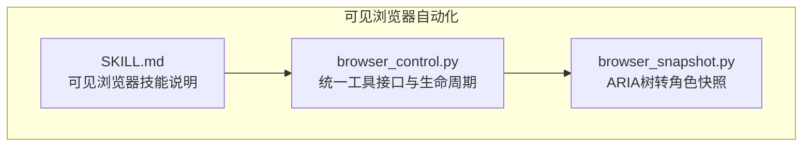
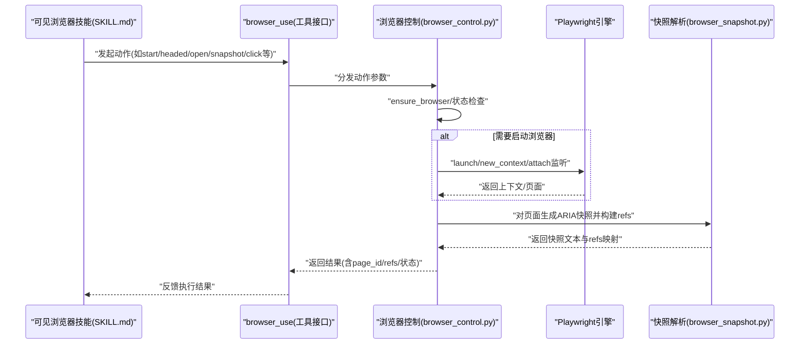
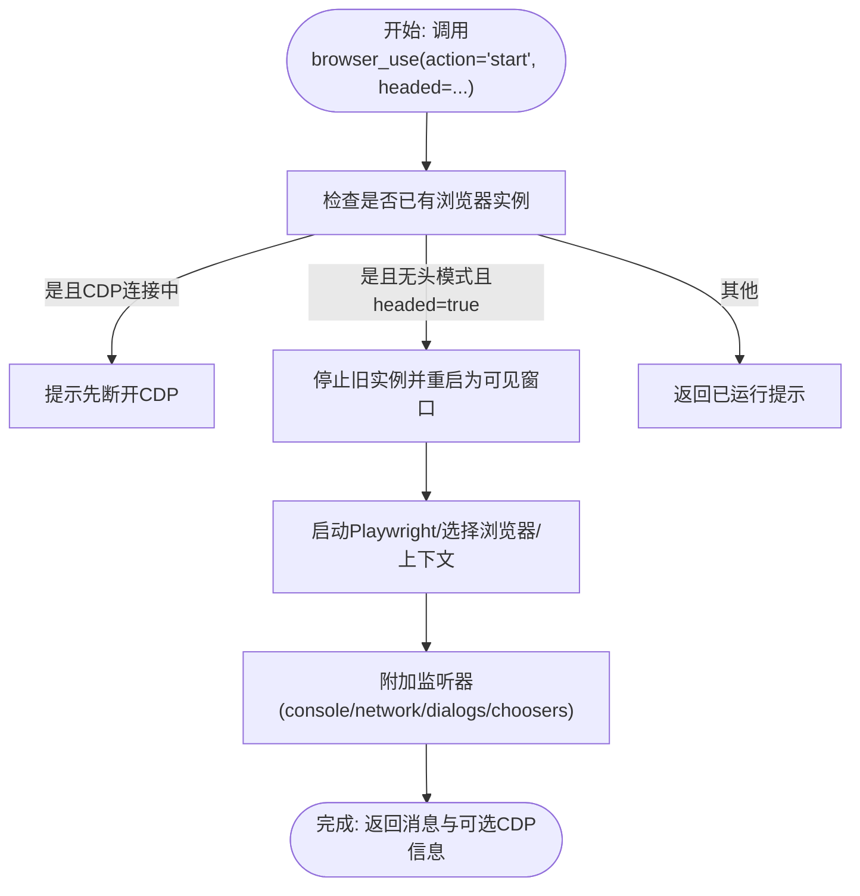
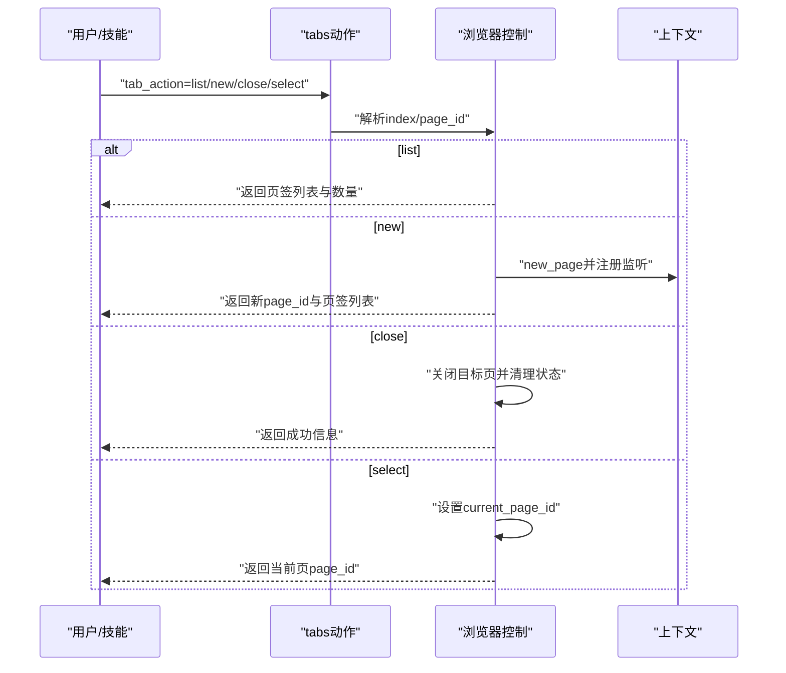
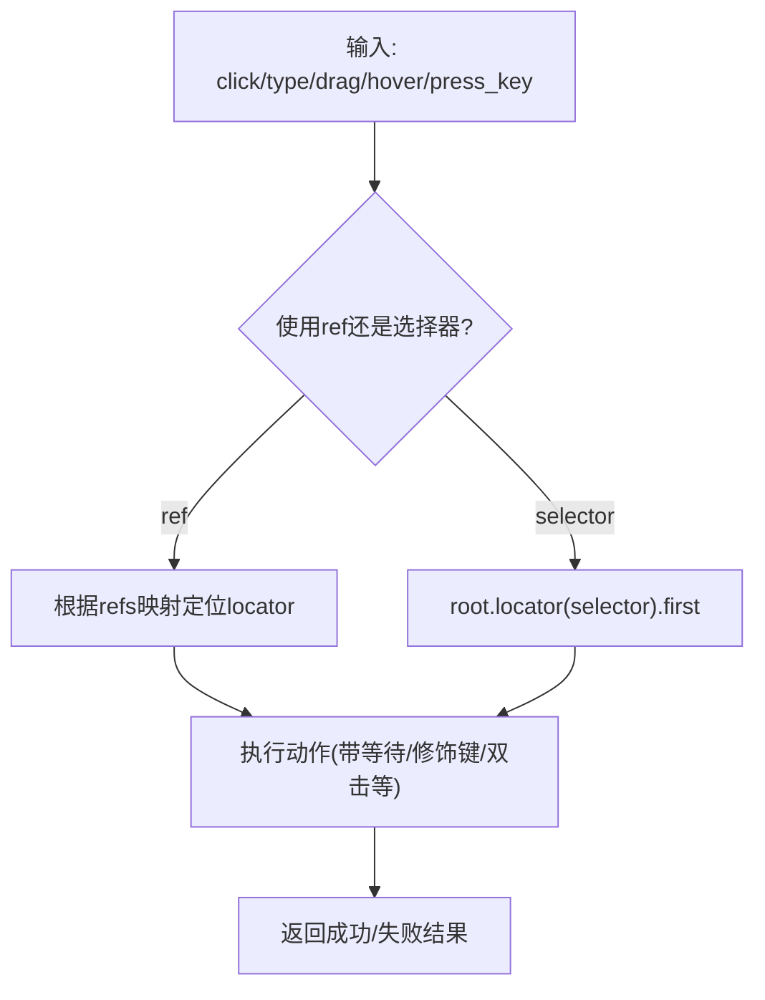
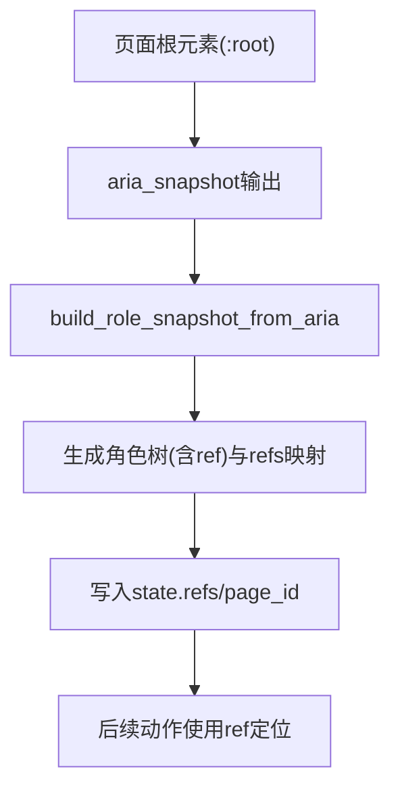
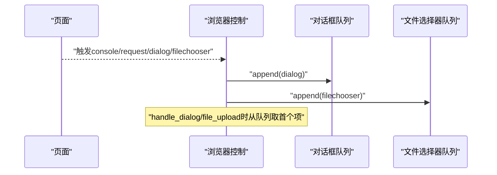
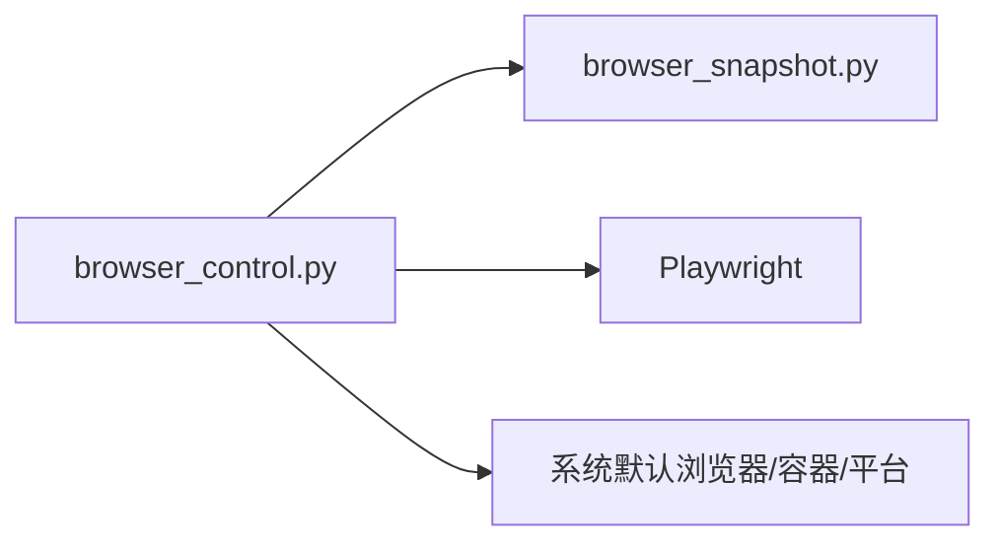

# 可见浏览器自动化

<cite>
**本文引用的文件**
- [browser_control.py](file://src/qwenpaw/agents/tools/browser_control.py)
- [browser_snapshot.py](file://src/qwenpaw/agents/tools/browser_snapshot.py)
- [SKILL.md](file://src/qwenpaw/agents/skills/browser_visible/SKILL.md)
</cite>

## 目录
1. [简介](#简介)
2. [项目结构](#项目结构)
3. [核心组件](#核心组件)
4. [架构总览](#架构总览)
5. [详细组件分析](#详细组件分析)
6. [依赖分析](#依赖分析)
7. [性能考虑](#性能考虑)
8. [故障排查指南](#故障排查指南)
9. [结论](#结论)
10. [附录](#附录)

## 简介
本文件面向“可见浏览器自动化”能力，系统化阐述基于 Playwright 的浏览器人机交互模拟技术与实践，覆盖真实窗口创建与管理、鼠标点击/移动、键盘输入、拖拽、窗口尺寸调整、标签页切换、对话框与文件上传处理、网络请求与控制台日志采集、缓存清理、CDP 连接等关键主题。文档同时给出常见业务场景（网页浏览、内容搜索、链接点击、按钮操作）的自动化实现思路，并讨论兼容性、多窗口管理与会话保持等高级特性。

## 项目结构
可见浏览器自动化由以下模块协同完成：
- 工具层：browser_control.py 提供统一的浏览器控制 API，封装 Playwright 生命周期、页面与上下文管理、事件监听、动作执行与错误处理。
- 快照解析：browser_snapshot.py 将 ARIA 树转换为带 ref 的角色快照，支撑稳定定位与交互。
- 技能说明：browser_visible/SKILL.md 定义可见浏览器技能的使用场景与参数约定，指导用户正确启动与操作真实窗口。

图表来源
- [browser_control.py:1-120](file://src/qwenpaw/agents/tools/browser_control.py#L1-L120)
- [browser_snapshot.py:1-66](file://src/qwenpaw/agents/tools/browser_snapshot.py#L1-L66)
- [SKILL.md:1-50](file://src/qwenpaw/agents/skills/browser_visible/SKILL.md#L1-L50)

章节来源
- [browser_control.py:1-120](file://src/qwenpaw/agents/tools/browser_control.py#L1-L120)
- [browser_snapshot.py:1-66](file://src/qwenpaw/agents/tools/browser_snapshot.py#L1-L66)
- [SKILL.md:1-50](file://src/qwenpaw/agents/skills/browser_visible/SKILL.md#L1-L50)

## 核心组件
- 统一工具接口：browser_use 动作式 API，支持 start/stop/open/navigate/screenshot/snapshot/click/type/eval/evaluate/resize/console_messages/handle_dialog/file_upload/fill_form/press_key/network_requests/run_code/drag/hover/select_option/tabs/wait_for/pdf/close 等。
- 生命周期管理：自动检测与启动浏览器，支持持久化上下文、容器与平台差异适配、空闲回收、CDP 连接与断连。
- 页面与上下文：单工作区多页面管理，新标签页自动注册，当前页切换与关闭。
- 事件与状态：控制台日志、网络请求、弹窗与文件选择器队列，配合快照 refs 实现稳定定位。
- 平台与容器适配：Windows/Uvicorn 热重载混合模式、容器沙箱参数、系统默认浏览器优先策略、macOS WebKit 回退。

章节来源
- [browser_control.py:2978-3311](file://src/qwenpaw/agents/tools/browser_control.py#L2978-L3311)
- [browser_control.py:493-616](file://src/qwenpaw/agents/tools/browser_control.py#L493-L616)
- [browser_control.py:470-490](file://src/qwenpaw/agents/tools/browser_control.py#L470-L490)
- [browser_control.py:174-172](file://src/qwenpaw/agents/tools/browser_control.py#L174-L172)

## 架构总览
下图展示可见浏览器自动化从技能触发到浏览器执行的关键流程与模块交互：

图表来源
- [SKILL.md:21-37](file://src/qwenpaw/agents/skills/browser_visible/SKILL.md#L21-L37)
- [browser_control.py:2978-3311](file://src/qwenpaw/agents/tools/browser_control.py#L2978-L3311)
- [browser_snapshot.py:185-249](file://src/qwenpaw/agents/tools/browser_snapshot.py#L185-L249)

## 详细组件分析

### 1) 可见窗口启动与切换
- headed 参数决定是否以真实窗口启动；若已存在且为无头模式，需先 stop 再以 headed:true 重启。
- 支持 CDP 端口校验与连接，避免端口冲突。
- 自动注入监听器，记录控制台日志、网络请求、弹窗与文件选择器。

图表来源
- [browser_control.py:642-821](file://src/qwenpaw/agents/tools/browser_control.py#L642-L821)
- [browser_control.py:422-461](file://src/qwenpaw/agents/tools/browser_control.py#L422-L461)

章节来源
- [SKILL.md:36-49](file://src/qwenpaw/agents/skills/browser_visible/SKILL.md#L36-L49)
- [browser_control.py:642-821](file://src/qwenpaw/agents/tools/browser_control.py#L642-L821)

### 2) 页面与标签页管理
- 多标签页：通过 page_id 区分不同页面；新标签页自动注册并设为当前页。
- 列表/新建/关闭/选择：支持列出所有页签、新建、关闭指定索引或选择当前页。
- 当前页切换：更新 current_page_id，后续动作作用于该页。

图表来源
- [browser_control.py:2522-2636](file://src/qwenpaw/agents/tools/browser_control.py#L2522-L2636)

章节来源
- [browser_control.py:2522-2636](file://src/qwenpaw/agents/tools/browser_control.py#L2522-L2636)

### 3) 交互动作：点击、输入、拖拽、悬停、按键
- 点击/双击/修饰键：支持 ref 与 CSS 选择器两种定位；可设置等待时间与鼠标按键。
- 输入：支持 ref/选择器定位，支持逐字符输入与提交（Enter）。
- 拖拽：起止点可为 ref 或选择器，自动定位并执行 drag_to。
- 悬停：hover 到元素。
- 按键：keyboard.press 发送组合键或单键。

图表来源
- [browser_control.py:1178-1312](file://src/qwenpaw/agents/tools/browser_control.py#L1178-L1312)
- [browser_control.py:1315-1427](file://src/qwenpaw/agents/tools/browser_control.py#L1315-L1427)
- [browser_control.py:2289-2374](file://src/qwenpaw/agents/tools/browser_control.py#L2289-L2374)
- [browser_control.py:2377-2442](file://src/qwenpaw/agents/tools/browser_control.py#L2377-L2442)
- [browser_control.py:2135-2177](file://src/qwenpaw/agents/tools/browser_control.py#L2135-L2177)

章节来源
- [browser_control.py:1178-1312](file://src/qwenpaw/agents/tools/browser_control.py#L1178-L1312)
- [browser_control.py:1315-1427](file://src/qwenpaw/agents/tools/browser_control.py#L1315-L1427)
- [browser_control.py:2289-2374](file://src/qwenpaw/agents/tools/browser_control.py#L2289-L2374)
- [browser_control.py:2377-2442](file://src/qwenpaw/agents/tools/browser_control.py#L2377-L2442)
- [browser_control.py:2135-2177](file://src/qwenpaw/agents/tools/browser_control.py#L2135-L2177)

### 4) 快照与稳定定位
- ARIA 快照：对页面根元素生成 aria_snapshot，再经 build_role_snapshot_from_aria 转换为带 ref 的角色树，便于后续 click/type 等操作。
- refs 去重与 nth 优化：同角色同名称元素自动编号，仅在重复时保留 nth，提升稳定性。

图表来源
- [browser_control.py:1565-1626](file://src/qwenpaw/agents/tools/browser_control.py#L1565-L1626)
- [browser_snapshot.py:185-249](file://src/qwenpaw/agents/tools/browser_snapshot.py#L185-L249)

章节来源
- [browser_control.py:1565-1626](file://src/qwenpaw/agents/tools/browser_control.py#L1565-L1626)
- [browser_snapshot.py:185-249](file://src/qwenpaw/agents/tools/browser_snapshot.py#L185-L249)

### 5) 对话框与文件上传
- 对话框：捕获 alert/confirm/prompt，支持 accept/dismiss 或带输入文本的 prompt。
- 文件上传：等待页面触发 filechooser，再 set_files 设置本地路径数组，或 set_files([]) 取消。

图表来源
- [browser_control.py:422-461](file://src/qwenpaw/agents/tools/browser_control.py#L422-L461)
- [browser_control.py:1847-1903](file://src/qwenpaw/agents/tools/browser_control.py#L1847-L1903)
- [browser_control.py:1906-1967](file://src/qwenpaw/agents/tools/browser_control.py#L1906-L1967)

章节来源
- [browser_control.py:422-461](file://src/qwenpaw/agents/tools/browser_control.py#L422-L461)
- [browser_control.py:1847-1903](file://src/qwenpaw/agents/tools/browser_control.py#L1847-L1903)
- [browser_control.py:1906-1967](file://src/qwenpaw/agents/tools/browser_control.py#L1906-L1967)

### 6) 窗口尺寸与视口控制
- resize：设置 viewport 尺寸，确保页面布局与截图符合预期。
- 截图：支持全页/局部/元素级截图，自动解析相对路径至工作区目录。

章节来源
- [browser_control.py:1749-1794](file://src/qwenpaw/agents/tools/browser_control.py#L1749-L1794)
- [browser_control.py:1056-1175](file://src/qwenpaw/agents/tools/browser_control.py#L1056-L1175)

### 7) 表单填充与选项选择
- fill_form：基于 refs 映射批量填充字段，支持 checkbox/radio/combobox/slider/textbox 等类型。
- select_option：按值/标签选择下拉选项。

章节来源
- [browser_control.py:1970-2057](file://src/qwenpaw/agents/tools/browser_control.py#L1970-L2057)
- [browser_control.py:2445-2519](file://src/qwenpaw/agents/tools/browser_control.py#L2445-L2519)

### 8) 网络与控制台日志
- network_requests：收集请求/响应元数据，可过滤静态资源。
- console_messages：按级别筛选并导出日志。

章节来源
- [browser_control.py:2180-2225](file://src/qwenpaw/agents/tools/browser_control.py#L2180-L2225)
- [browser_control.py:1797-1844](file://src/qwenpaw/agents/tools/browser_control.py#L1797-L1844)

### 9) 缓存清理与CDP连接
- clear_browser_cache：运行中使用 CDP 清理 HTTP 缓存；停止状态下清理 user_data_dir 下缓存目录。
- connect_cdp/list_cdp_targets：扫描本地端口发现 Chrome CDP，建立连接后接管上下文与页面。

章节来源
- [browser_control.py:2715-2812](file://src/qwenpaw/agents/tools/browser_control.py#L2715-L2812)
- [browser_control.py:2828-2884](file://src/qwenpaw/agents/tools/browser_control.py#L2828-L2884)
- [browser_control.py:2887-2975](file://src/qwenpaw/agents/tools/browser_control.py#L2887-L2975)

### 10) 常见场景自动化方案
- 网页浏览：start(headed=true) -> open(url) -> snapshot -> click/type -> screenshot/pdf
- 内容搜索：snapshot -> click 搜索框 -> type -> click 搜索按钮 -> wait_for 结果出现
- 链接点击：snapshot -> click 具体链接 ref -> tabs/select 切换到新页
- 表单填写：snapshot -> fill_form(fields_json) -> submit
- 文件上传：click 上传按钮 -> file_upload(paths_json) -> 确认提交
- 弹窗处理：handle_dialog(accept/prompt_text) 或 dismiss

章节来源
- [SKILL.md:21-37](file://src/qwenpaw/agents/skills/browser_visible/SKILL.md#L21-L37)
- [browser_control.py:1906-1967](file://src/qwenpaw/agents/tools/browser_control.py#L1906-L1967)
- [browser_control.py:1847-1903](file://src/qwenpaw/agents/tools/browser_control.py#L1847-L1903)

## 依赖分析
- 组件内聚与耦合
  - browser_control.py 内部高度内聚，围绕 state 统一管理浏览器、上下文、页面、refs、监听器与空闲看门狗。
  - 与 browser_snapshot.py 解耦：快照生成独立模块，通过字符串与字典传递结果。
- 外部依赖
  - Playwright 异步/同步 API、CDP、容器与平台差异处理。
  - 系统默认浏览器探测与回退策略（macOS WebKit）。

图表来源
- [browser_control.py:262-290](file://src/qwenpaw/agents/tools/browser_control.py#L262-L290)
- [browser_snapshot.py:1-66](file://src/qwenpaw/agents/tools/browser_snapshot.py#L1-L66)

章节来源
- [browser_control.py:262-290](file://src/qwenpaw/agents/tools/browser_control.py#L262-L290)
- [browser_snapshot.py:1-66](file://src/qwenpaw/agents/tools/browser_snapshot.py#L1-L66)

## 性能考虑
- 异步优先：标准模式使用异步 Playwright，提升并发与吞吐。
- 混合模式：Windows+Uvicorn 热重载场景采用线程池执行同步调用，避免跨进程异常。
- 空闲回收：10 分钟无活动自动停止浏览器，释放渲染进程与内存。
- 视口与截图：合理设置 viewport 与全屏截图，减少不必要的重绘与 IO。
- 缓存清理：运行中使用 CDP 清理缓存，避免磁盘膨胀与请求延迟。

章节来源
- [browser_control.py:48-80](file://src/qwenpaw/agents/tools/browser_control.py#L48-L80)
- [browser_control.py:174-172](file://src/qwenpaw/agents/tools/browser_control.py#L174-L172)
- [browser_control.py:2715-2812](file://src/qwenpaw/agents/tools/browser_control.py#L2715-L2812)

## 故障排查指南
- 启动失败
  - 检查 Playwright 是否安装与驱动是否安装；必要时执行安装命令。
  - 容器/Windows 需要沙箱参数与 GPU 禁用参数。
- 端口冲突
  - CDP 端口被占用时需更换端口或先停止占用进程。
- 已连接外部浏览器
  - CDP 连接中不可直接 start，需先 stop 断开。
- 无头与可见切换
  - 已运行无头时，headed:true 需先 stop 再重启。
- 对话框/文件选择器
  - 未触发对应事件则队列为空，需先触发页面行为再调用处理动作。
- 空闲回收
  - 长时间无操作导致浏览器停止，需重新 start。

章节来源
- [browser_control.py:262-290](file://src/qwenpaw/agents/tools/browser_control.py#L262-L290)
- [browser_control.py:695-713](file://src/qwenpaw/agents/tools/browser_control.py#L695-L713)
- [browser_control.py:497-508](file://src/qwenpaw/agents/tools/browser_control.py#L497-L508)
- [browser_control.py:660-691](file://src/qwenpaw/agents/tools/browser_control.py#L660-L691)
- [browser_control.py:422-461](file://src/qwenpaw/agents/tools/browser_control.py#L422-L461)
- [browser_control.py:174-172](file://src/qwenpaw/agents/tools/browser_control.py#L174-L172)

## 结论
可见浏览器自动化以统一工具接口为核心，结合快照定位与事件监听，实现了从真实窗口创建、页面交互到高级特性的完整闭环。通过合理的生命周期管理、平台与容器适配、空闲回收与 CDP 连接，既能满足演示与调试需求，也能在生产环境中高效稳定地执行各类网页自动化任务。建议在复杂场景中优先使用 ref 定位与快照，配合 tabs/select 管理多页签，并利用网络与控制台日志进行可观测性增强。

## 附录
- 可见浏览器技能使用要点
  - 以 headed=true 启动真实窗口，随后 open/snapshot/click 等。
  - 若已有浏览器运行，需先 stop 再以 headed:true 重启。
- 输出路径规范
  - 相对路径自动解析到工作区下的 browser 子目录，便于统一管理截图与报告。

章节来源
- [SKILL.md:21-49](file://src/qwenpaw/agents/skills/browser_visible/SKILL.md#L21-L49)
- [browser_control.py:39-45](file://src/qwenpaw/agents/tools/browser_control.py#L39-L45)