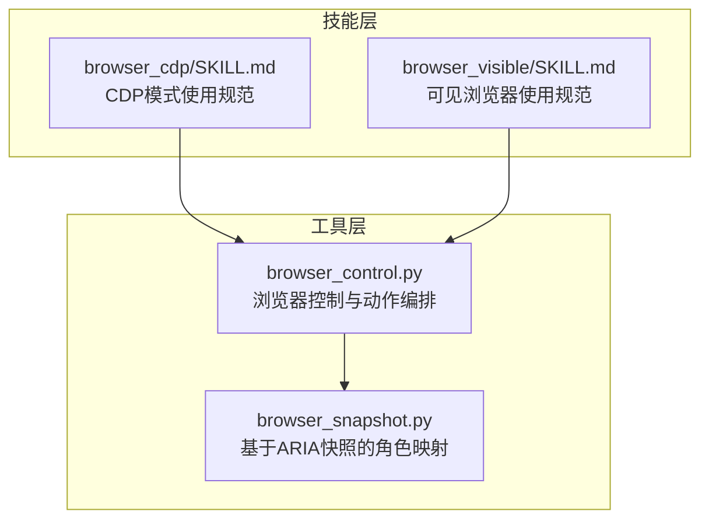
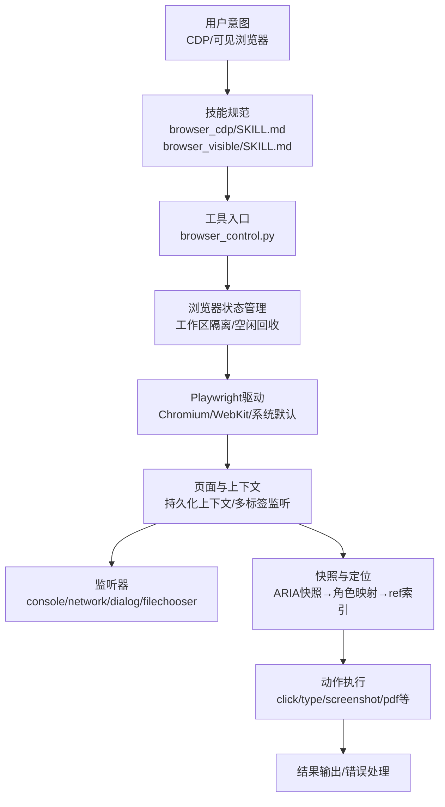
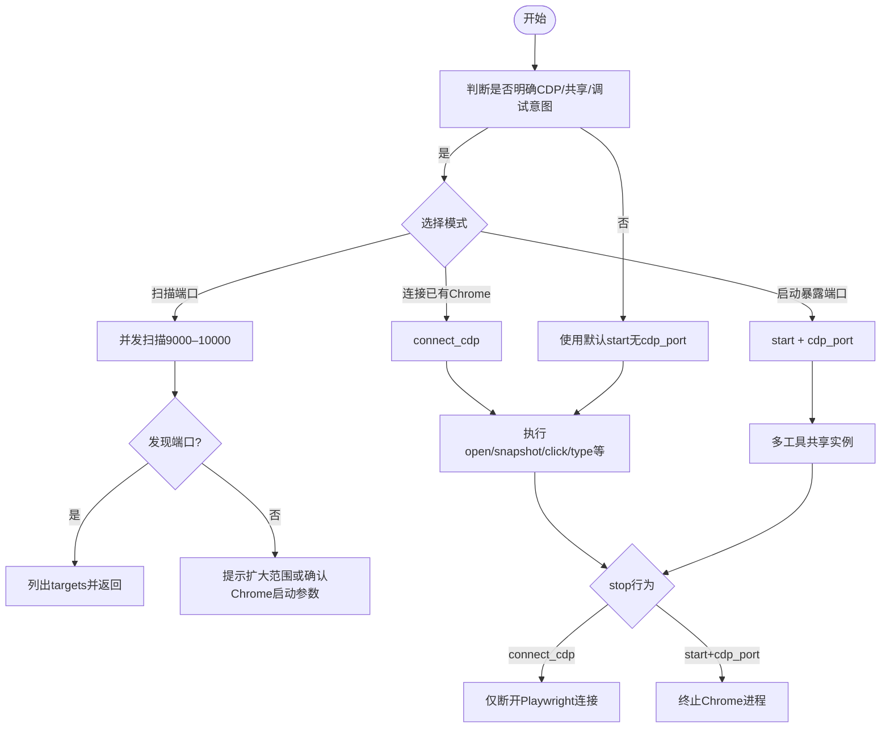
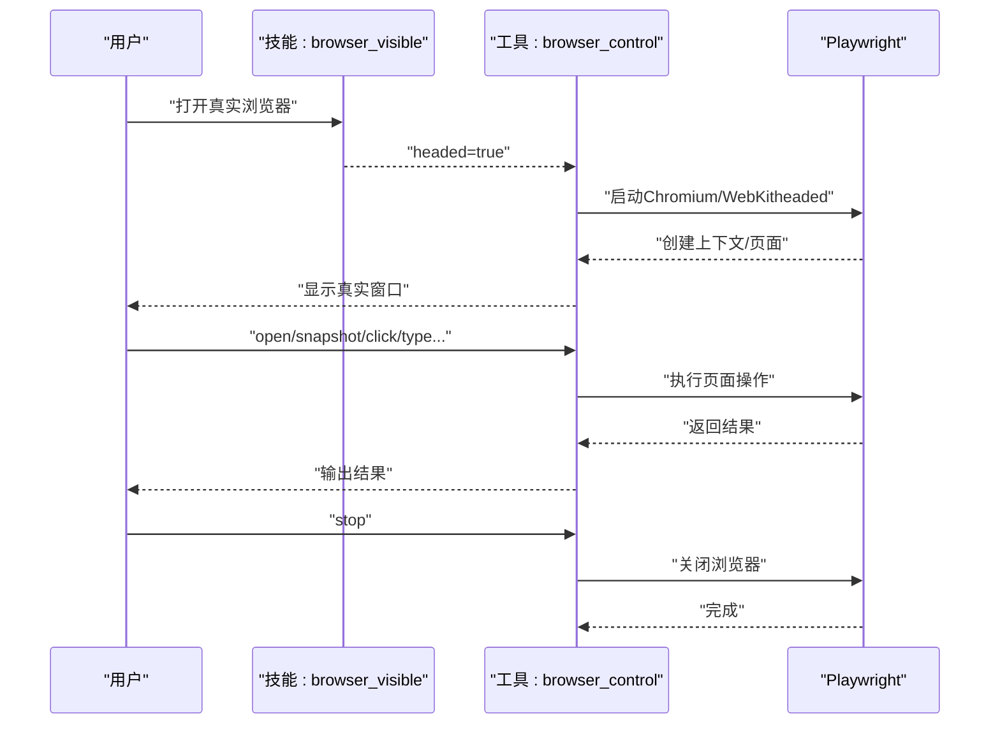
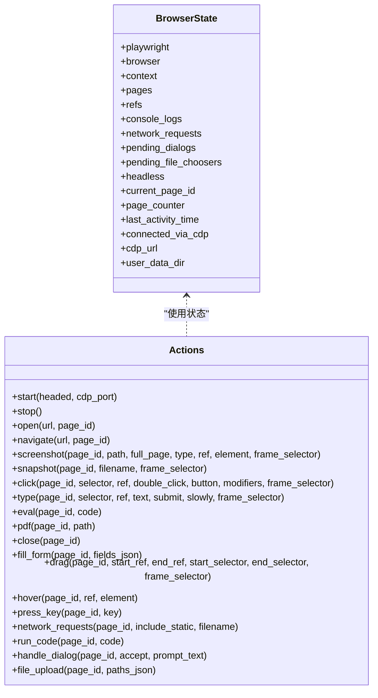
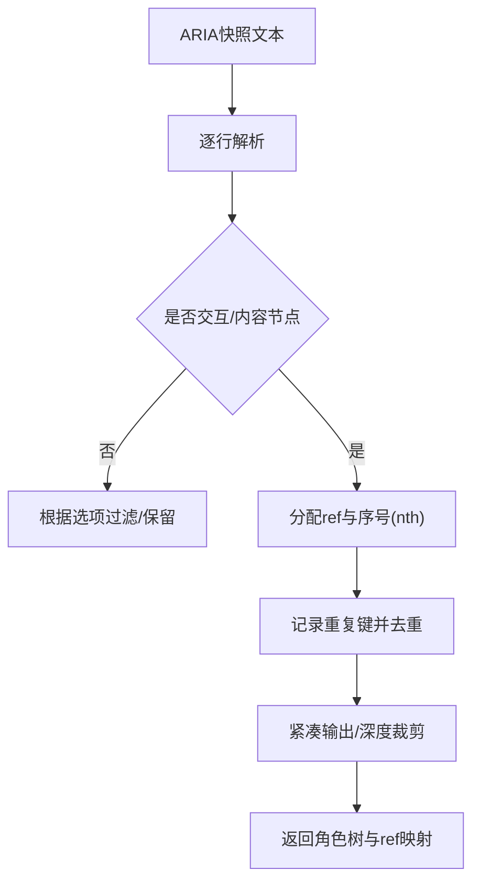
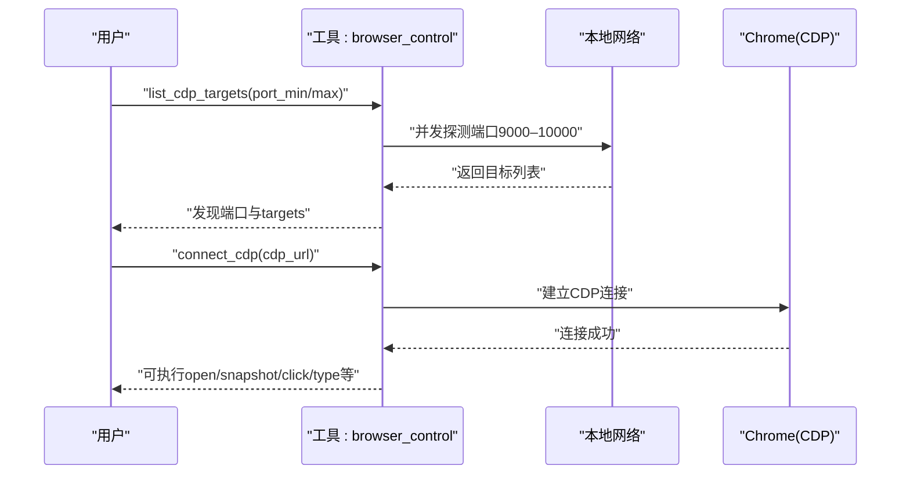
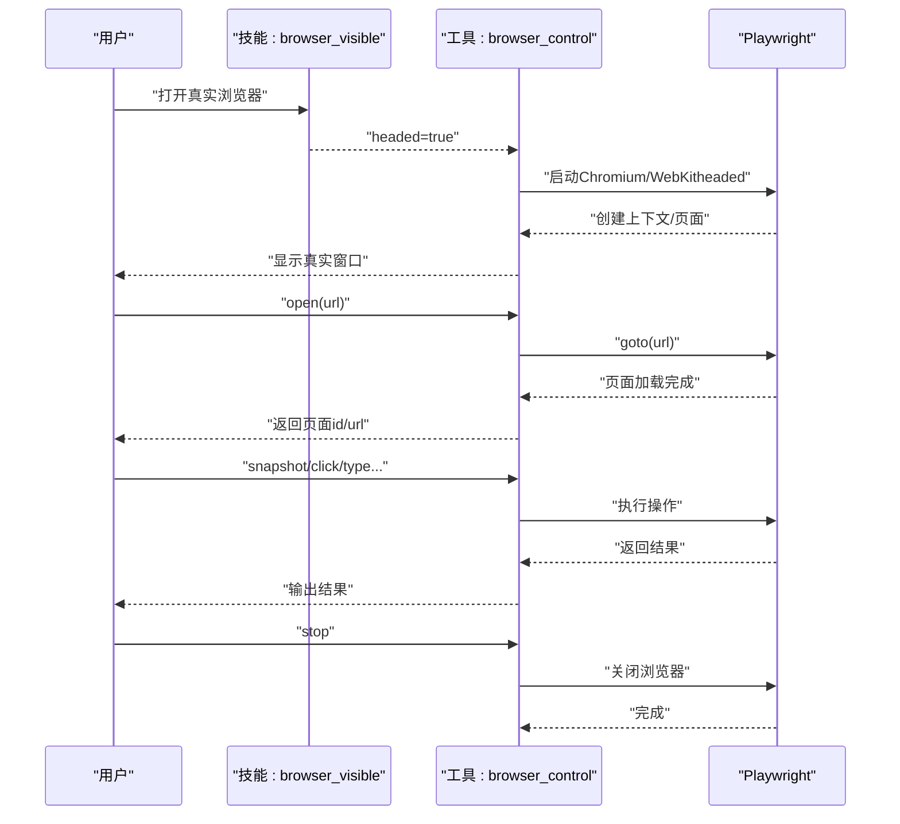
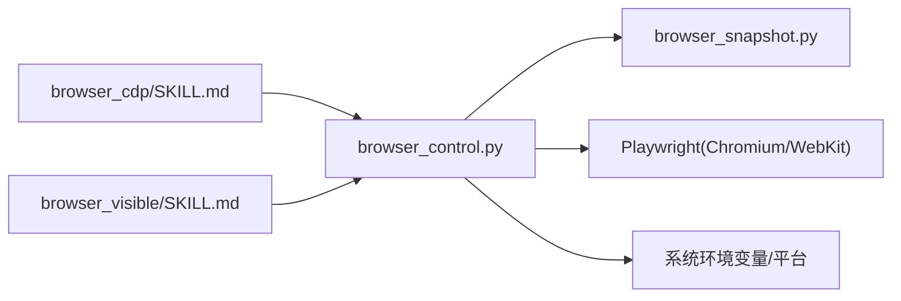

# 浏览器自动化技能

<cite>
**本文引用的文件**   
- [browser_cdp/SKILL.md](file://src/qwenpaw/agents/skills/browser_cdp/SKILL.md)
- [browser_visible/SKILL.md](file://src/qwenpaw/agents/skills/browser_visible/SKILL.md)
- [browser_control.py](file://src/qwenpaw/agents/tools/browser_control.py)
- [browser_snapshot.py](file://src/qwenpaw/agents/tools/browser_snapshot.py)
</cite>

## 目录
1. [简介](#简介)
2. [项目结构](#项目结构)
3. [核心组件](#核心组件)
4. [架构总览](#架构总览)
5. [详细组件分析](#详细组件分析)
6. [依赖分析](#依赖分析)
7. [性能考虑](#性能考虑)
8. [故障排查指南](#故障排查指南)
9. [结论](#结论)
10. [附录](#附录)

## 简介
本技术文档面向QwenPaw的浏览器自动化技能，系统阐述两类核心能力：
- CDP（Chrome DevTools Protocol）模式：无头浏览器自动化与远程调试，支持扫描本地CDP端口、连接已有Chrome、以暴露CDP端口的方式启动浏览器，并提供网络监控、性能分析、截图录制等高级特性。
- 可见浏览器模式：真实窗口的人机交互模拟，支持鼠标点击、键盘输入、拖拽、窗口管理等，适用于演示、调试与需要人工参与的场景。

文档将从系统架构、组件关系、数据流、处理逻辑、集成点、错误处理与性能特征等方面进行深入解析，并提供实用场景的实现方案与最佳实践。

## 项目结构
浏览器自动化技能位于QwenPaw的“技能”与“工具”层：
- 技能层（skills）：提供用户意图识别与参数约束，确保在合适场景下启用相应能力。
- 工具层（tools）：封装Playwright驱动的浏览器生命周期、页面操作、元素定位、快照生成、网络与日志采集等。

图表来源
- [browser_cdp/SKILL.md:1-182](file://src/qwenpaw/agents/skills/browser_cdp/SKILL.md#L1-L182)
- [browser_visible/SKILL.md:1-50](file://src/qwenpaw/agents/skills/browser_visible/SKILL.md#L1-L50)
- [browser_control.py:1-120](file://src/qwenpaw/agents/tools/browser_control.py#L1-L120)
- [browser_snapshot.py:1-66](file://src/qwenpaw/agents/tools/browser_snapshot.py#L1-L66)

章节来源
- [browser_cdp/SKILL.md:1-182](file://src/qwenpaw/agents/skills/browser_cdp/SKILL.md#L1-L182)
- [browser_visible/SKILL.md:1-50](file://src/qwenpaw/agents/skills/browser_visible/SKILL.md#L1-L50)
- [browser_control.py:1-120](file://src/qwenpaw/agents/tools/browser_control.py#L1-L120)
- [browser_snapshot.py:1-66](file://src/qwenpaw/agents/tools/browser_snapshot.py#L1-L66)

## 核心组件
- CDP技能规范：定义何时使用CDP模式、隐私与安全注意事项、单实例限制、cookies与数据持久化策略、stop行为差异、缓存清理等。
- 可见浏览器技能规范：定义何时使用可见模式、与默认无头模式的区别、注意事项与使用流程。
- 浏览器控制工具：统一的动作接口（start/stop/open/navigate/screenshot/snapshot/click/type/eval/pdf/close等），支持同步/异步Playwright、容器与平台适配、持久化上下文、CDP连接管理、空闲回收、监听器注册（console/network/dialog/filechooser）。
- 角色快照工具：将Playwright ARIA快照转换为可交互元素树，生成ref索引与去重规则，支持紧凑输出与深度裁剪。

章节来源
- [browser_cdp/SKILL.md:1-182](file://src/qwenpaw/agents/skills/browser_cdp/SKILL.md#L1-L182)
- [browser_visible/SKILL.md:1-50](file://src/qwenpaw/agents/skills/browser_visible/SKILL.md#L1-L50)
- [browser_control.py:492-617](file://src/qwenpaw/agents/tools/browser_control.py#L492-L617)
- [browser_snapshot.py:185-249](file://src/qwenpaw/agents/tools/browser_snapshot.py#L185-L249)

## 架构总览
整体架构围绕“技能意图识别—工具动作编排—Playwright驱动—监听与快照”的闭环展开。CDP模式与可见模式在启动阶段即决定后续行为差异（连接/终止、持久化/非持久化、可见/不可见）。

图表来源
- [browser_cdp/SKILL.md:1-182](file://src/qwenpaw/agents/skills/browser_cdp/SKILL.md#L1-L182)
- [browser_visible/SKILL.md:1-50](file://src/qwenpaw/agents/skills/browser_visible/SKILL.md#L1-L50)
- [browser_control.py:492-617](file://src/qwenpaw/agents/tools/browser_control.py#L492-L617)
- [browser_snapshot.py:185-249](file://src/qwenpaw/agents/tools/browser_snapshot.py#L185-L249)

## 详细组件分析

### CDP模式组件分析
- 场景覆盖
  - 扫描本地CDP端口：支持单端口、范围扫描与并发探测，默认范围9000–10000。
  - 连接已有Chrome：在扫描到端口后建立CDP连接，不接管进程，断开时仅解除Playwright连接。
  - 启动暴露CDP端口的浏览器：通过指定cdp_port启动，便于多工具共享同一浏览器实例。
- 隐私与安全
  - 默认模式下浏览器由Playwright私有管理，历史、Cookies、登录态不暴露。
  - CDP模式下任何可访问端口的程序均可读取完整历史、Cookies、页面内容，需用户知情同意。
- 单实例限制
  - 同一工作区同一时刻仅允许一个浏览器运行或连接，切换需先stop。
- 数据持久化
  - 三种启动方式复用同一工作区user_data_dir，cookies可复用；CDP模式下对外可访问。
- stop行为
  - connect_cdp：仅断开Playwright连接，Chrome进程继续运行。
  - start+cdp_port：终止Chrome进程，其他通过该端口连接的外部工具断线。
- 缓存清理
  - 运行中：通过CDP清除HTTP缓存，无需重启。
  - 已停止：删除磁盘缓存目录，Cookies与LocalStorage不受影响。

图表来源
- [browser_cdp/SKILL.md:1-182](file://src/qwenpaw/agents/skills/browser_cdp/SKILL.md#L1-L182)

章节来源
- [browser_cdp/SKILL.md:1-182](file://src/qwenpaw/agents/skills/browser_cdp/SKILL.md#L1-L182)

### 可见浏览器模式组件分析
- 使用时机
  - 用户明确希望打开真实窗口、看到页面加载与交互、演示或调试。
- 使用流程
  - 先以headed=true启动浏览器，再按需打开页面、截图、点击、输入等，最后stop关闭。
- 与默认模式区别
  - 默认：无头（后台）；可见：真实窗口。
- 注意事项
  - 若已有浏览器运行，需先stop再以headed:true重新start。
  - 可见模式需要图形环境，服务器或无图形环境可能无法使用。

图表来源
- [browser_visible/SKILL.md:1-50](file://src/qwenpaw/agents/skills/browser_visible/SKILL.md#L1-L50)
- [browser_control.py:642-821](file://src/qwenpaw/agents/tools/browser_control.py#L642-L821)

章节来源
- [browser_visible/SKILL.md:1-50](file://src/qwenpaw/agents/skills/browser_visible/SKILL.md#L1-L50)
- [browser_control.py:642-821](file://src/qwenpaw/agents/tools/browser_control.py#L642-L821)

### 浏览器控制工具（browser_control.py）
- 动作接口
  - 生命周期：start、stop
  - 导航与页面：open、navigate、close
  - 截图与PDF：screenshot、pdf
  - 快照与定位：snapshot（内部调用ARIA快照并生成ref）
  - 交互：click、type、eval、press_key、hover、drag、fill_form、file_upload、handle_dialog、network_requests、run_code
- 状态管理
  - 工作区隔离：每个workspace_id维护独立状态字典，含playwright/browser/context/pages/refs/console_logs/network_requests/pending_dialogs/pending_file_choosers/headless/current_page_id/page_counter/last_activity_time/_idle_task等。
  - 空闲回收：默认10分钟无活动自动停止，避免渲染进程泄漏。
  - CDP连接：标记connected_via_cdp与cdp_url，断连时返回错误提示。
- 平台与容器适配
  - 容器内：添加--no-sandbox、--disable-dev-shm-usage；Windows：添加--disable-gpu。
  - 优先使用系统默认浏览器（Chrome/Edge/Chromium/Safari），否则回退至Playwright自带Chromium或WebKit。
  - Windows+热重载模式：使用同步Playwright以避免某些平台限制。
- 监听器与数据采集
  - 页面级监听：console消息、网络请求/响应、对话框、文件选择器。
  - 支持多标签页：自动注册新标签并设为当前。
- 快照与定位
  - 通过ARIA快照构建角色树，生成ref索引，支持交互元素筛选、紧凑输出、最大深度控制、同名元素去重与nth优化。

图表来源
- [browser_control.py:82-172](file://src/qwenpaw/agents/tools/browser_control.py#L82-L172)
- [browser_control.py:492-617](file://src/qwenpaw/agents/tools/browser_control.py#L492-L617)
- [browser_control.py:1565-1599](file://src/qwenpaw/agents/tools/browser_control.py#L1565-L1599)

章节来源
- [browser_control.py:82-172](file://src/qwenpaw/agents/tools/browser_control.py#L82-L172)
- [browser_control.py:492-617](file://src/qwenpaw/agents/tools/browser_control.py#L492-L617)
- [browser_control.py:1565-1599](file://src/qwenpaw/agents/tools/browser_control.py#L1565-L1599)

### 角色快照工具（browser_snapshot.py）
- 功能概述
  - 将Playwright的aria_snapshot输出转换为结构化角色树，标注ref与nth，支持交互元素筛选、紧凑输出、最大深度限制。
- 关键角色集合
  - 交互角色：button、link、textbox、checkbox、radio、combobox、listbox、menuitem、option、searchbox、slider、spinbutton、switch、tab、treeitem等。
  - 内容角色：heading、cell、gridcell、columnheader、rowheader、listitem、article、region、main、navigation等。
  - 结构角色：generic、group、list、table、row、rowgroup、grid、treegrid、menu、menubar、toolbar、tablist、tree、directory、document、application、presentation、none等。
- 生成流程
  - 解析ARIA行，过滤非交互或结构化节点（可选），为交互元素分配唯一ref与序号（nth），去除重复名称下的冗余nth，支持紧凑输出与深度裁剪。

图表来源
- [browser_snapshot.py:185-249](file://src/qwenpaw/agents/tools/browser_snapshot.py#L185-L249)

章节来源
- [browser_snapshot.py:185-249](file://src/qwenpaw/agents/tools/browser_snapshot.py#L185-L249)

### 典型业务流程（序列图）

#### CDP扫描与连接流程

图表来源
- [browser_control.py:2828-2852](file://src/qwenpaw/agents/tools/browser_control.py#L2828-L2852)
- [browser_cdp/SKILL.md:49-95](file://src/qwenpaw/agents/skills/browser_cdp/SKILL.md#L49-L95)

#### 可见浏览器启动与页面操作流程

图表来源
- [browser_visible/SKILL.md:21-38](file://src/qwenpaw/agents/skills/browser_visible/SKILL.md#L21-L38)
- [browser_control.py:930-999](file://src/qwenpaw/agents/tools/browser_control.py#L930-L999)
- [browser_control.py:1178-1313](file://src/qwenpaw/agents/tools/browser_control.py#L1178-L1313)

## 依赖分析
- 技能与工具耦合
  - 技能规范负责约束参数与使用场景，工具负责具体实现；两者通过动作接口与状态管理解耦。
- 工具内部依赖
  - browser_control依赖browser_snapshot进行快照解析与ref生成。
  - 浏览器启动依赖Playwright（async/sync），并根据平台/容器/系统默认浏览器进行适配。
- 外部依赖
  - Playwright（Chromium/WebKit/Safari）。
  - Python标准库（urllib用于CDP端口探测）。
  - 系统环境变量（如QWENPAW_BROWSER_USE_DEFAULT、QWENPAW_RELOAD_MODE）。

图表来源
- [browser_cdp/SKILL.md:1-182](file://src/qwenpaw/agents/skills/browser_cdp/SKILL.md#L1-L182)
- [browser_visible/SKILL.md:1-50](file://src/qwenpaw/agents/skills/browser_visible/SKILL.md#L1-L50)
- [browser_control.py:262-290](file://src/qwenpaw/agents/tools/browser_control.py#L262-L290)
- [browser_snapshot.py:1-66](file://src/qwenpaw/agents/tools/browser_snapshot.py#L1-L66)

章节来源
- [browser_control.py:262-290](file://src/qwenpaw/agents/tools/browser_control.py#L262-L290)
- [browser_snapshot.py:1-66](file://src/qwenpaw/agents/tools/browser_snapshot.py#L1-L66)

## 性能考虑
- 异步与同步选择
  - 标准异步Playwright提升吞吐；Windows+热重载模式采用同步Playwright以规避平台限制。
- 容器与平台优化
  - 容器内启用--no-sandbox与--disable-dev-shm-usage；Windows强制--disable-gpu。
- 空闲回收
  - 默认10分钟无活动自动停止，释放渲染进程资源，避免内存泄漏。
- 并发探测CDP端口
  - 默认范围9000–10000并发探测，快速定位可用端口。
- 快照与定位
  - 交互元素快照与紧凑输出减少传输与处理开销；最大深度控制降低复杂DOM的解析成本。

章节来源
- [browser_control.py:48-80](file://src/qwenpaw/agents/tools/browser_control.py#L48-L80)
- [browser_control.py:235-246](file://src/qwenpaw/agents/tools/browser_control.py#L235-L246)
- [browser_control.py:134](file://src/qwenpaw/agents/tools/browser_control.py#L134)
- [browser_control.py:2828-2852](file://src/qwenpaw/agents/tools/browser_control.py#L2828-L2852)
- [browser_snapshot.py:185-249](file://src/qwenpaw/agents/tools/browser_snapshot.py#L185-L249)

## 故障排查指南
- CDP连接丢失
  - 现象：操作返回“CDP连接丢失”，提示重新connect_cdp。
  - 处理：按提示执行connect_cdp；检查端口占用与Chrome进程状态。
- 端口被占用
  - 现象：启动cdp_port失败，提示端口已被占用。
  - 处理：更换端口或先stop释放端口。
- Chrome无法暴露CDP端口
  - 现象：启动后无法扫描到CDP端口。
  - 处理：确保以独立进程+指定user-data-dir启动，避免被合并到已有进程。
- stop行为不符合预期
  - connect_cdp：仅断开Playwright连接，Chrome继续运行。
  - start+cdp_port：终止Chrome进程，其他CDP连接断线。
- 可见模式无法弹窗
  - 现象：服务器或无图形环境。
  - 处理：在具备图形环境的桌面系统使用headed模式。

章节来源
- [browser_cdp/SKILL.md:135-182](file://src/qwenpaw/agents/skills/browser_cdp/SKILL.md#L135-L182)
- [browser_control.py:695-714](file://src/qwenpaw/agents/tools/browser_control.py#L695-L714)
- [browser_control.py:837-867](file://src/qwenpaw/agents/tools/browser_control.py#L837-L867)
- [browser_control.py:869-927](file://src/qwenpaw/agents/tools/browser_control.py#L869-L927)

## 结论
QwenPaw的浏览器自动化技能通过“技能规范+工具实现”的分层设计，既满足CDP模式下的高级监控与远程调试需求，又支持可见浏览器的人机交互场景。工具层以Playwright为核心，结合快照与监听机制，提供了稳定、可扩展的自动化能力。遵循技能规范中的隐私与安全提示、单实例限制与端口管理策略，可在保证安全的前提下高效完成网页内容抓取、动态数据获取、表单自动填写、验证码识别等复杂任务。

## 附录
- 实用场景建议
  - 网页内容抓取：使用snapshot生成角色树，结合click/type进行交互，再用screenshot/pdf导出。
  - 动态数据获取：利用network_requests收集请求/响应，结合eval提取页面变量。
  - 表单自动填写：通过fill_form批量填充字段，支持checkbox/radio/combobox/slider等类型。
  - 验证码识别：可见模式下配合人工输入或OCR工具，CDP模式下通过截图与元素定位辅助识别。
- 反爬虫应对策略
  - 使用系统默认浏览器与持久化上下文维持登录态；合理设置User-Agent与请求头；控制请求频率与随机延时；必要时使用代理池。
- 浏览器兼容性
  - 优先使用系统Chrome/Edge/Chromium；macOS回退WebKit；Windows/Linux回退Playwright自带Chromium；容器内启用必要参数。
- 与Playwright、Selenium集成
  - 本实现基于Playwright；如需Selenium集成，可在工具层抽象统一接口，保持动作语义一致。