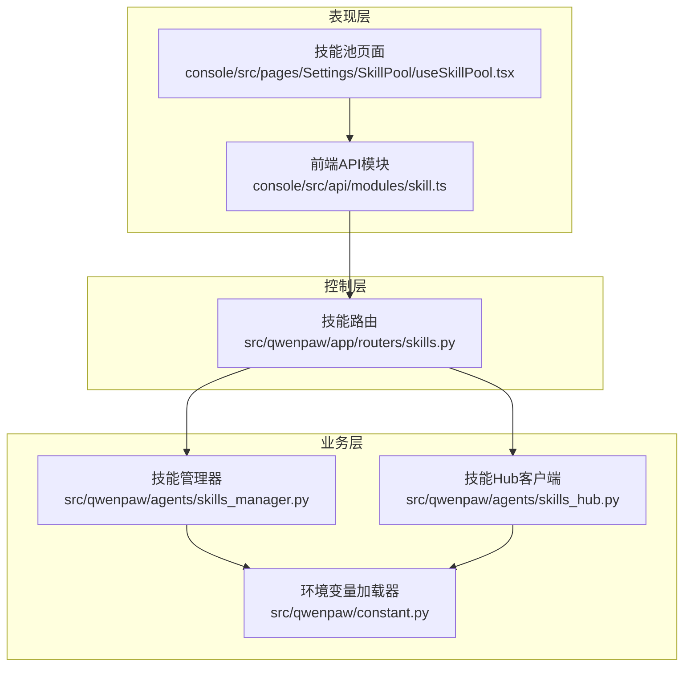
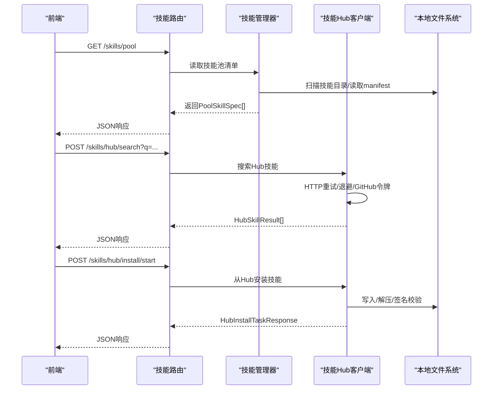
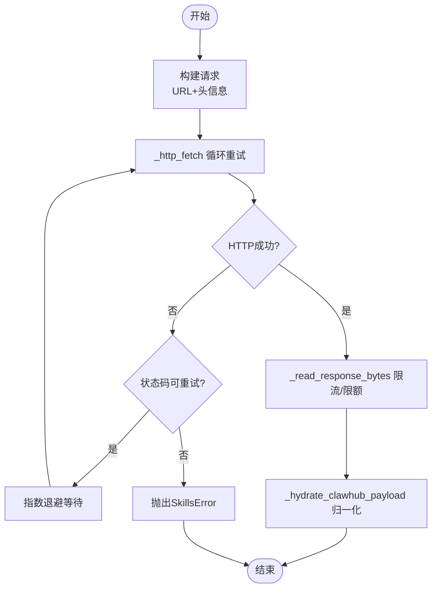
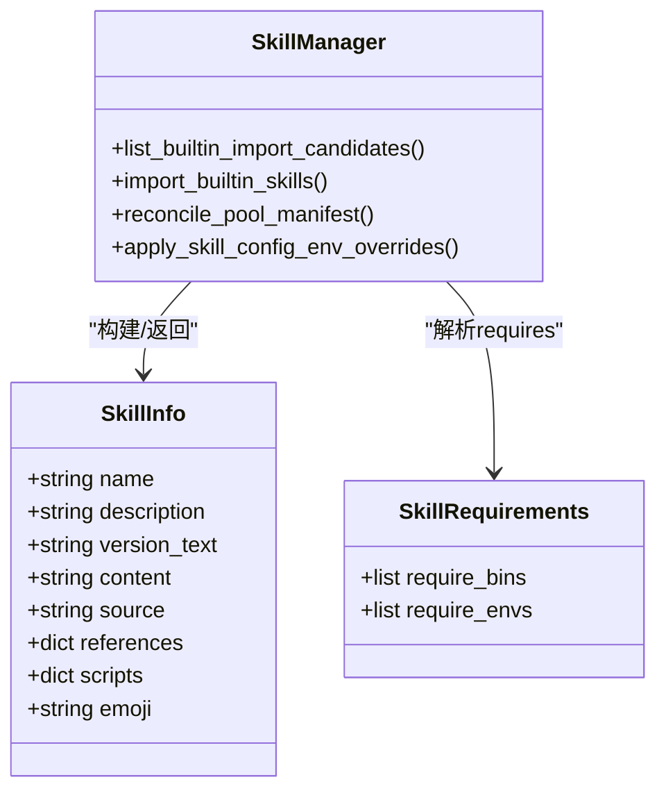
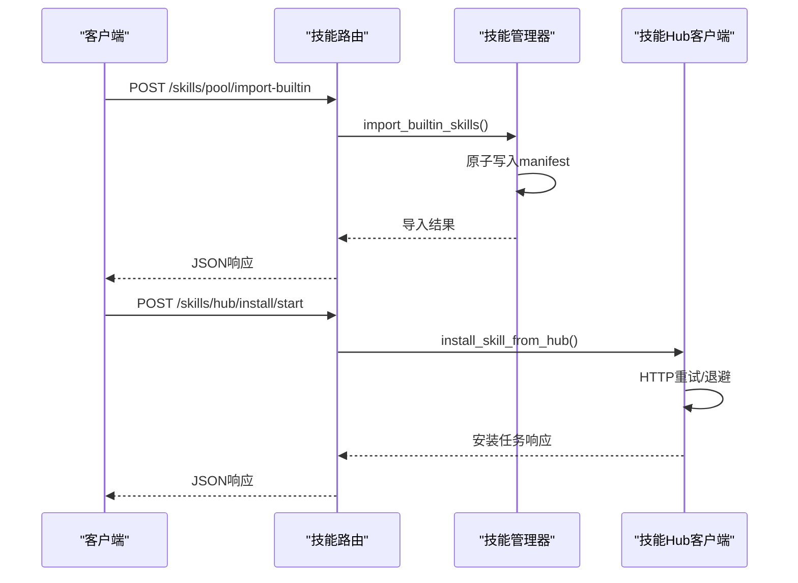
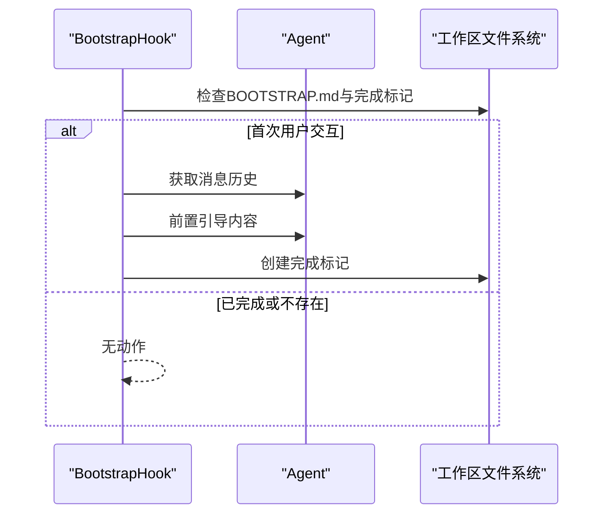
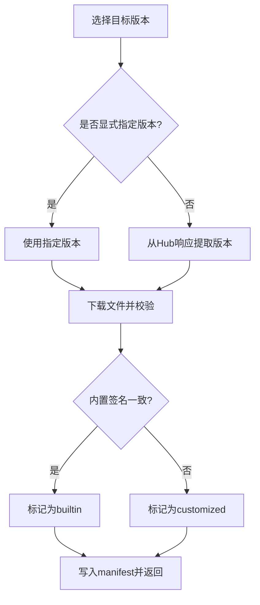
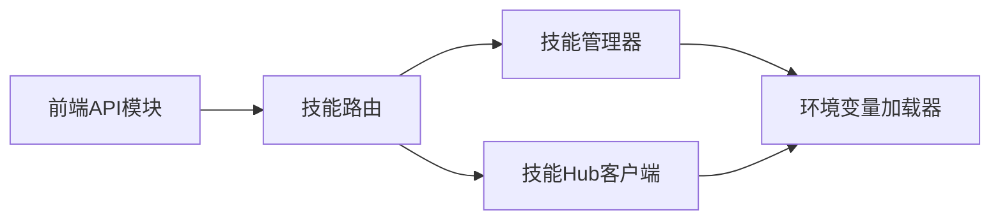

# 技能仓库架构

<cite>
**本文引用的文件**
- [skills_hub.py](file://src/qwenpaw/agents/skills_hub.py)
- [skills_manager.py](file://src/qwenpaw/agents/skills_manager.py)
- [skills.py](file://src/qwenpaw/app/routers/skills.py)
- [bootstrap.py](file://src/qwenpaw/agents/hooks/bootstrap.py)
- [constant.py](file://src/qwenpaw/constant.py)
- [skill.ts](file://console/src/api/modules/skill.ts)
- [useSkillPool.tsx](file://console/src/pages/Settings/SkillPool/useSkillPool.tsx)
- [error.ts](file://console/src/utils/error.ts)
- [retry_chat_model.py](file://src/qwenpaw/providers/retry_chat_model.py)
- [runner.py](file://src/qwenpaw/app/runner/runner.py)
</cite>

## 目录
1. [引言](#引言)
2. [项目结构](#项目结构)
3. [核心组件](#核心组件)
4. [架构总览](#架构总览)
5. [详细组件分析](#详细组件分析)
6. [依赖分析](#依赖分析)
7. [性能考虑](#性能考虑)
8. [故障处理与排障指南](#故障处理与排障指南)
9. [结论](#结论)
10. [附录](#附录)

## 引言
本文件面向QwenPaw技能仓库架构，系统化阐述其整体设计与实现细节，涵盖技能发现机制、远程Hub集成、本地缓存策略、初始化流程（含bootstrap钩子）、配置管理（环境变量、HTTP参数与重试）、版本管理（解析、兼容性与升级）、故障处理与恢复、性能优化与并发控制，以及与外部Hub服务的交互协议与数据格式。

## 项目结构
技能仓库由三层协同构成：
- 控制层（FastAPI路由）：对外暴露技能与技能池的REST接口，负责请求校验、调用业务层、返回标准化响应。
- 业务层（技能管理器与Hub客户端）：实现技能清单构建、导入导出、冲突检测、版本解析、安全扫描、Hub交互等核心逻辑。
- 表现层（Console前端）：提供技能列表、搜索、批量操作、缓存失效等用户交互能力。

图表来源
- [skills.py:62-200](file://src/qwenpaw/app/routers/skills.py#L62-L200)
- [skill.ts:1-177](file://console/src/api/modules/skill.ts#L1-L177)
- [useSkillPool.tsx:25-58](file://console/src/pages/Settings/SkillPool/useSkillPool.tsx#L25-L58)
- [skills_manager.py:1-120](file://src/qwenpaw/agents/skills_manager.py#L1-L120)
- [skills_hub.py:1-120](file://src/qwenpaw/agents/skills_hub.py#L1-L120)
- [constant.py:28-120](file://src/qwenpaw/constant.py#L28-L120)

章节来源
- [skills.py:62-200](file://src/qwenpaw/app/routers/skills.py#L62-L200)
- [skill.ts:1-177](file://console/src/api/modules/skill.ts#L1-L177)
- [useSkillPool.tsx:25-58](file://console/src/pages/Settings/SkillPool/useSkillPool.tsx#L25-L58)
- [skills_manager.py:1-120](file://src/qwenpaw/agents/skills_manager.py#L1-L120)
- [skills_hub.py:1-120](file://src/qwenpaw/agents/skills_hub.py#L1-L120)
- [constant.py:28-120](file://src/qwenpaw/constant.py#L28-L120)

## 核心组件
- 技能Hub客户端：封装Hub搜索、详情、版本、文件下载、重试与取消检查、速率限制处理、内容归一化与包体提取。
- 技能管理器：提供技能清单构建、工作区/技能池清单同步、内置技能签名比对、冲突建议、配置注入、文件锁与原子写入、安全扫描集成。
- 技能路由：定义技能与技能池的REST接口，统一异常转换与安全扫描错误响应。
- 环境变量加载器：集中读取与解析各类配置项（HTTP超时、重试、退避、Hub路径、GitHub缓存等），并提供历史兼容键。
- 前端API模块：提供技能池与工作区技能列表、刷新、搜索、安装任务启动、批量操作与缓存失效；内建30秒TTL内存缓存。

章节来源
- [skills_hub.py:1-200](file://src/qwenpaw/agents/skills_hub.py#L1-L200)
- [skills_manager.py:60-180](file://src/qwenpaw/agents/skills_manager.py#L60-L180)
- [skills.py:110-200](file://src/qwenpaw/app/routers/skills.py#L110-L200)
- [constant.py:28-120](file://src/qwenpaw/constant.py#L28-L120)
- [skill.ts:1-177](file://console/src/api/modules/skill.ts#L1-L177)

## 架构总览
技能仓库采用“路由-服务-存储”分层，结合Hub远端能力与本地文件系统，形成“工作区技能 + 共享技能池”的双态模型。初始化阶段通过bootstrap钩子引导首次交互，随后由路由触发技能池与工作区的清单重建与同步。

图表来源
- [skills.py:533-1104](file://src/qwenpaw/app/routers/skills.py#L533-L1104)
- [skills_hub.py:1539-1562](file://src/qwenpaw/agents/skills_hub.py#L1539-L1562)
- [skills_manager.py:883-961](file://src/qwenpaw/agents/skills_manager.py#L883-L961)

## 详细组件分析

### 技能Hub客户端（skills_hub.py）
- 远程Hub集成
  - 基础URL与路径：支持通过环境变量覆盖，默认指向ClawHub；支持GitHub API速率限制提示与GITHUB_TOKEN透传。
  - 搜索/详情/版本/文件：统一的HTTP请求封装，支持Accept类型、超时、最大字节数限制、取消检查。
  - 重试与退避：基于指数退避计算延迟，仅对可重试状态码进行重试；429/5xx提供用户友好提示。
  - GitHub缓存：针对特定请求的TTL缓存，受环境变量控制。
- Hub内容归一化
  - 将Hub返回的多形态数据（列表/字典/单对象）归一为标准结构，提取files与SKILL.md内容，构建可导入的技能包。
- 安全与体积限制
  - 对Zip包进行大小与路径合法性校验，拒绝危险路径与符号链接；限制响应体大小，避免内存溢出。

图表来源
- [skills_hub.py:291-403](file://src/qwenpaw/agents/skills_hub.py#L291-L403)
- [skills_hub.py:557-640](file://src/qwenpaw/agents/skills_hub.py#L557-L640)

章节来源
- [skills_hub.py:78-166](file://src/qwenpaw/agents/skills_hub.py#L78-L166)
- [skills_hub.py:291-403](file://src/qwenpaw/agents/skills_hub.py#L291-L403)
- [skills_hub.py:557-640](file://src/qwenpaw/agents/skills_hub.py#L557-L640)

### 技能管理器（skills_manager.py）
- 清单与同步
  - 工作区与技能池清单构建：扫描目录、读取frontmatter、生成规范化的SkillSpec/PoolSkillSpec。
  - 冲突检测与命名建议：基于签名与时间戳生成冲突建议，避免覆盖。
  - 内置技能同步：将内置技能复制到技能池，保持版本一致性；保留已有config。
- 配置注入与环境变量
  - 依据metadata.requires.env将配置键注入为环境变量，同时保留完整JSON至QWENPAW_SKILL_CONFIG_<NAME>。
  - 支持并发场景下的环境变量占用检测与释放，避免竞态。
- 文件与锁
  - 原子写入与文件锁：确保manifest变更的线程/进程安全；忽略常见系统垃圾文件。
- 版本与签名
  - 基于文件树内容计算签名，用于内置/自定义识别与差异判断；mtime用于最后更新时间。

图表来源
- [skills_manager.py:65-95](file://src/qwenpaw/agents/skills_manager.py#L65-L95)
- [skills_manager.py:543-572](file://src/qwenpaw/agents/skills_manager.py#L543-L572)
- [skills_manager.py:674-718](file://src/qwenpaw/agents/skills_manager.py#L674-L718)

章节来源
- [skills_manager.py:883-961](file://src/qwenpaw/agents/skills_manager.py#L883-L961)
- [skills_manager.py:590-718](file://src/qwenpaw/agents/skills_manager.py#L590-L718)
- [skills_manager.py:274-312](file://src/qwenpaw/agents/skills_manager.py#L274-L312)

### 技能路由（skills.py）
- 接口职责
  - 列表与刷新：工作区技能列表、技能池技能列表、刷新工作区/技能池。
  - 搜索与安装：Hub技能搜索、启动安装任务。
  - 配置与导入：导入内置技能、更新内置、删除/清空配置、批量删除。
- 错误处理
  - 将安全扫描异常转换为稳定的422响应结构；对Hub错误进行消息提取与用户提示。
- 并发与一致性
  - 使用文件锁保护manifest写入；对Hub请求设置超时与重试，避免阻塞。

图表来源
- [skills.py:1029-1058](file://src/qwenpaw/app/routers/skills.py#L1029-L1058)
- [skills.py:1061-1104](file://src/qwenpaw/app/routers/skills.py#L1061-L1104)
- [skills.py:533-1104](file://src/qwenpaw/app/routers/skills.py#L533-L1104)

章节来源
- [skills.py:68-109](file://src/qwenpaw/app/routers/skills.py#L68-L109)
- [skills.py:533-1104](file://src/qwenpaw/app/routers/skills.py#L533-L1104)

### 初始化与bootstrap钩子（bootstrap.py）
- 首次交互引导
  - 在首次用户消息前，检查BOOTSTRAP.md并将其内容前置到系统提示中，引导用户建立身份与偏好。
  - 仅在未完成标记存在时生效，避免重复触发。
- 与技能池的关系
  - 初始化完成后，技能池可按需导入内置技能，后续由路由与管理器维护清单一致性。

图表来源
- [bootstrap.py:42-104](file://src/qwenpaw/agents/hooks/bootstrap.py#L42-L104)

章节来源
- [bootstrap.py:20-104](file://src/qwenpaw/agents/hooks/bootstrap.py#L20-L104)

### 配置管理（环境变量、HTTP参数与重试）
- 环境变量
  - HTTP超时、重试次数、退避基值/上限、Hub基础URL/路径、GitHub缓存TTL、工作区目录、密钥目录等。
  - 提供历史兼容键（COPAW_*）自动回退，保证部署平滑迁移。
- HTTP请求参数
  - Accept类型、User-Agent、GitHub令牌透传、Content-Length校验、响应体大小限制。
- 重试与退避
  - 指数退避（base、cap），仅对408/409/425/429/500/502/503/504等状态码重试；429/5xx提供用户提示。
- 速率限制
  - GitHub API 403带“rate limit”时抛出明确错误；支持GITHUB_TOKEN提升配额。

章节来源
- [constant.py:28-120](file://src/qwenpaw/constant.py#L28-L120)
- [skills_hub.py:97-166](file://src/qwenpaw/agents/skills_hub.py#L97-L166)
- [skills_hub.py:291-403](file://src/qwenpaw/agents/skills_hub.py#L291-L403)

### 版本管理（解析、兼容性与升级）
- 版本解析
  - 优先从请求版本参数，其次从Hub响应中的latestVersion/tags.latest，最终回退为空字符串。
- 兼容性检查
  - 内置技能签名比对：若技能池与内置签名一致则视为builtin，否则视为customized。
  - 下载冲突判定：builtin与builtin之间若版本相同则跳过，不同则提示升级；与customized冲突则建议改名。
- 升级策略
  - 技能池内置同步：当内置版本变化时自动覆盖；工作区下载时保留config并提示升级。

图表来源
- [skills_hub.py:535-554](file://src/qwenpaw/agents/skills_hub.py#L535-L554)
- [skills_manager.py:418-447](file://src/qwenpaw/agents/skills_manager.py#L418-L447)
- [skills_manager.py:2480-2521](file://src/qwenpaw/agents/skills_manager.py#L2480-L2521)

章节来源
- [skills_hub.py:535-554](file://src/qwenpaw/agents/skills_hub.py#L535-L554)
- [skills_manager.py:418-447](file://src/qwenpaw/agents/skills_manager.py#L418-L447)
- [skills_manager.py:2480-2521](file://src/qwenpaw/agents/skills_manager.py#L2480-L2521)

### 前端缓存与交互（console/api/modules/skill.ts）
- 缓存策略
  - 内存Map缓存，30秒TTL；支持按路径前缀清理；提供刷新接口自动写入缓存。
- 操作接口
  - 列表/刷新工作区与技能池、搜索Hub、批量启用/删除、启动Hub安装任务。
- 错误解析
  - 统一解析后端错误详情，便于前端展示。

章节来源
- [skill.ts:16-32](file://console/src/api/modules/skill.ts#L16-L32)
- [skill.ts:135-172](file://console/src/api/modules/skill.ts#L135-L172)
- [error.ts:1-11](file://console/src/utils/error.ts#L1-L11)

## 依赖分析
- 路由依赖业务层：技能路由直接调用技能管理器与Hub客户端，保证接口与业务逻辑解耦。
- 业务层依赖常量：HTTP超时、重试、Hub路径、GitHub缓存等均来自EnvVarLoader。
- 前端依赖路由：前端API模块封装HTTP请求与缓存，路由负责数据一致性与安全扫描。

图表来源
- [skills.py:26-58](file://src/qwenpaw/app/routers/skills.py#L26-L58)
- [skills_manager.py:1-40](file://src/qwenpaw/agents/skills_manager.py#L1-L40)
- [skills_hub.py:33-34](file://src/qwenpaw/agents/skills_hub.py#L33-L34)
- [constant.py:28-87](file://src/qwenpaw/constant.py#L28-L87)

章节来源
- [skills.py:26-58](file://src/qwenpaw/app/routers/skills.py#L26-L58)
- [skills_manager.py:1-40](file://src/qwenpaw/agents/skills_manager.py#L1-L40)
- [skills_hub.py:33-34](file://src/qwenpaw/agents/skills_hub.py#L33-L34)
- [constant.py:28-87](file://src/qwenpaw/constant.py#L28-L87)

## 性能考虑
- 并发与锁
  - manifest写入使用文件锁，避免跨进程/线程竞态；必要时使用原子替换减少IO开销。
- I/O与网络
  - Hub请求采用分块读取与响应体大小限制，防止大响应导致内存压力；指数退避降低对远端的压力。
- 缓存
  - 前端30秒TTL缓存减少重复请求；Hub侧GitHub缓存可降低频繁查询成本。
- 配置注入
  - 环境变量注入仅在需要的键上进行，避免不必要的环境污染；并发场景下通过占用计数避免重复注入。

章节来源
- [skills_manager.py:318-336](file://src/qwenpaw/agents/skills_manager.py#L318-L336)
- [skills_hub.py:246-288](file://src/qwenpaw/agents/skills_hub.py#L246-L288)
- [skill.ts:16-32](file://console/src/api/modules/skill.ts#L16-L32)

## 故障处理与排障指南
- Hub错误
  - 429/5xx：根据重试次数与退避策略给出用户提示；必要时建议设置GITHUB_TOKEN。
  - GitHub速率限制：明确提示设置令牌；对403包含“rate limit”的情况直接抛错。
- 安全扫描
  - 将扫描异常转换为稳定422响应，包含严重级别与具体发现项，便于前端展示。
- 环境异常
  - 环境变量解析失败时使用默认值；对非法输入进行边界裁剪。
- 运行期错误
  - 路由层捕获异常并写入调试转储文件，便于定位问题。

章节来源
- [skills_hub.py:327-368](file://src/qwenpaw/agents/skills_hub.py#L327-L368)
- [skills.py:68-109](file://src/qwenpaw/app/routers/skills.py#L68-L109)
- [constant.py:41-87](file://src/qwenpaw/constant.py#L41-L87)
- [runner.py:559-594](file://src/qwenpaw/app/runner/runner.py#L559-L594)

## 结论
QwenPaw技能仓库通过清晰的分层与强健的错误处理，实现了“工作区技能 + 技能池”的双态管理，结合Hub远端能力与本地缓存，既保证了易用性也兼顾了性能与安全性。初始化阶段的bootstrap钩子与配置注入机制进一步提升了用户体验与可运维性。

## 附录
- 外部Hub交互协议要点
  - 基础URL与路径：可通过环境变量覆盖；默认使用ClawHub。
  - 搜索：GET /api/v1/search?q=...&limit=...
  - 详情：GET /api/v1/skills/{slug}
  - 版本：GET /api/v1/skills/{slug}/versions/{version}
  - 文件：GET /api/v1/skills/{slug}/file?path=...&version=...
  - 请求头：Accept、User-Agent；GitHub API自动附加Authorization: Bearer {token}。
  - 响应体大小限制与分块读取，避免内存溢出。
- 数据格式
  - HubSkillResult：slug/name/description/version/source_url
  - HubInstallTaskResponse：安装任务结果（字段随实现而定）
  - PoolSkillSpec：包含name/description/version_text/commit_text/sync_status/latest_version_text/tags/config/last_updated等

章节来源
- [skills_hub.py:191-224](file://src/qwenpaw/agents/skills_hub.py#L191-L224)
- [skills_hub.py:1539-1562](file://src/qwenpaw/agents/skills_hub.py#L1539-L1562)
- [skills.py:119-142](file://src/qwenpaw/app/routers/skills.py#L119-L142)