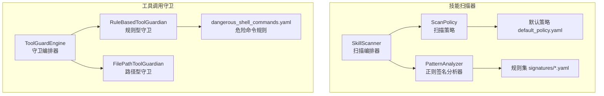
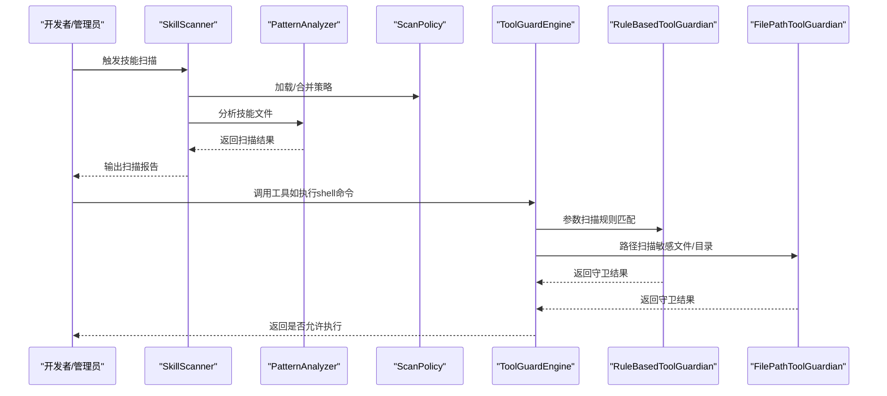
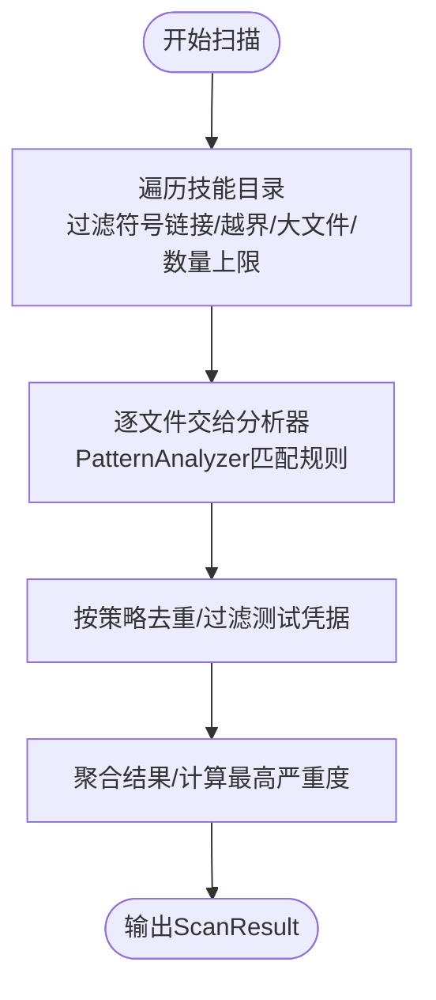
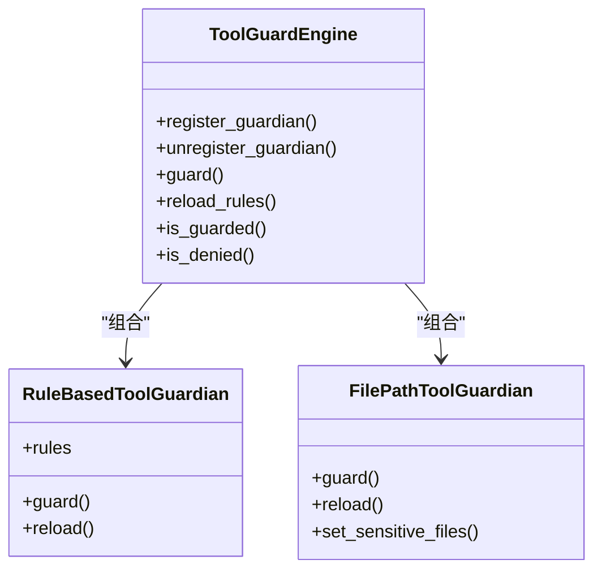
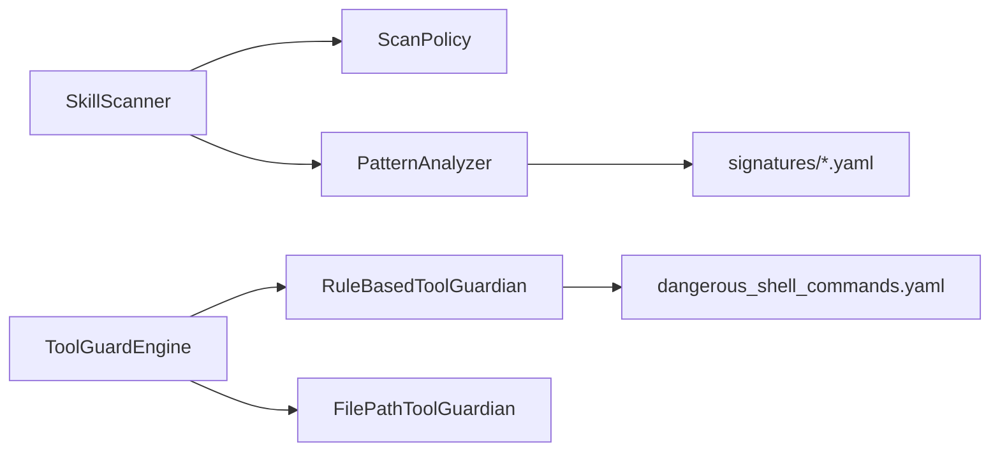
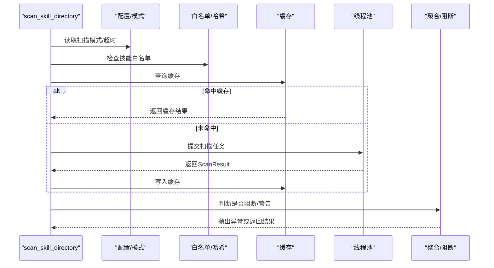

# 技能安全机制

<cite>
**本文档引用的文件**
- [security/__init__.py](file://src/qwenpaw/security/__init__.py)
- [security/skill_scanner/__init__.py](file://src/qwenpaw/security/skill_scanner/__init__.py)
- [security/skill_scanner/scanner.py](file://src/qwenpaw/security/skill_scanner/scanner.py)
- [security/skill_scanner/models.py](file://src/qwenpaw/security/skill_scanner/models.py)
- [security/skill_scanner/analyzers/pattern_analyzer.py](file://src/qwenpaw/security/skill_scanner/analyzers/pattern_analyzer.py)
- [security/skill_scanner/scan_policy.py](file://src/qwenpaw/security/skill_scanner/scan_policy.py)
- [security/skill_scanner/data/default_policy.yaml](file://src/qwenpaw/security/skill_scanner/data/default_policy.yaml)
- [security/skill_scanner/rules/signatures/command_injection.yaml](file://src/qwenpaw/security/skill_scanner/rules/signatures/command_injection.yaml)
- [security/skill_scanner/rules/signatures/data_exfiltration.yaml](file://src/qwenpaw/security/skill_scanner/rules/signatures/data_exfiltration.yaml)
- [security/tool_guard/__init__.py](file://src/qwenpaw/security/tool_guard/__init__.py)
- [security/tool_guard/engine.py](file://src/qwenpaw/security/tool_guard/engine.py)
- [security/tool_guard/guardians/rule_guardian.py](file://src/qwenpaw/security/tool_guard/guardians/rule_guardian.py)
- [security/tool_guard/guardians/file_guardian.py](file://src/qwenpaw/security/tool_guard/guardians/file_guardian.py)
- [security/tool_guard/models.py](file://src/qwenpaw/security/tool_guard/models.py)
- [security/tool_guard/rules/dangerous_shell_commands.yaml](file://src/qwenpaw/security/tool_guard/rules/dangerous_shell_commands.yaml)
</cite>

## 目录
1. [简介](#简介)
2. [项目结构](#项目结构)
3. [核心组件](#核心组件)
4. [架构总览](#架构总览)
5. [详细组件分析](#详细组件分析)
6. [依赖关系分析](#依赖关系分析)
7. [性能考虑](#性能考虑)
8. [故障排查指南](#故障排查指南)
9. [结论](#结论)
10. [附录](#附录)

## 简介
本文件面向QwenPaw技能安全系统，系统性阐述技能安全扫描机制的设计原理与实现细节，覆盖恶意代码检测、权限控制与沙箱隔离的边界设计、安全扫描器的工作流程（文件解析、规则匹配、风险评估）、默认安全策略配置与自定义规则编写方法、各类安全威胁检测（命令注入、数据泄露、社会工程攻击等）、扫描结果解读与处理、技能安装前的安全验证与风险提示机制、安全审计与合规检查、安全策略的动态更新与版本管理，以及安全事件响应与处理流程。

## 项目结构
安全子系统由两大部分组成：
- 技能扫描器（SkillScanner）：对技能包进行静态分析，发现潜在威胁并生成扫描结果。
- 工具调用守卫（ToolGuardEngine）：在工具执行前对参数进行预检，阻断高危模式。

图表来源
- [security/skill_scanner/scanner.py:76-319](file://src/qwenpaw/security/skill_scanner/scanner.py#L76-L319)
- [security/skill_scanner/analyzers/pattern_analyzer.py:236-393](file://src/qwenpaw/security/skill_scanner/analyzers/pattern_analyzer.py#L236-L393)
- [security/skill_scanner/scan_policy.py:156-476](file://src/qwenpaw/security/skill_scanner/scan_policy.py#L156-L476)
- [security/tool_guard/engine.py:53-238](file://src/qwenpaw/security/tool_guard/engine.py#L53-L238)
- [security/tool_guard/guardians/rule_guardian.py:559-758](file://src/qwenpaw/security/tool_guard/guardians/rule_guardian.py#L559-L758)
- [security/tool_guard/guardians/file_guardian.py:184-365](file://src/qwenpaw/security/tool_guard/guardians/file_guardian.py#L184-L365)

章节来源
- [security/__init__.py:1-21](file://src/qwenpaw/security/__init__.py#L1-L21)
- [security/skill_scanner/__init__.py:1-514](file://src/qwenpaw/security/skill_scanner/__init__.py#L1-L514)
- [security/tool_guard/__init__.py:1-59](file://src/qwenpaw/security/tool_guard/__init__.py#L1-L59)

## 核心组件
- 技能扫描器（SkillScanner）
  - 负责遍历技能目录、加载策略、注册分析器、聚合结果。
  - 默认使用PatternAnalyzer进行基于YAML正则签名的快速扫描。
- 扫描策略（ScanPolicy）
  - 组织级可定制策略，支持规则禁用、严重度覆盖、文件分类、阈值限制、去重等。
- 规则引擎（PatternAnalyzer + 规则集）
  - 基于YAML规则的正则匹配，支持行内匹配与跨行匹配，支持排除模式与文件类型过滤。
- 工具调用守卫（ToolGuardEngine）
  - 在工具执行前进行参数扫描，内置规则型守卫与路径型守卫，支持按工具/参数维度匹配。
- 守卫规则（dangerous_shell_commands.yaml）
  - 针对危险命令（如rm/mv、格式化/擦除设备、反向连接、提权、服务管理、进程终止等）的正则签名集合。

章节来源
- [security/skill_scanner/scanner.py:76-319](file://src/qwenpaw/security/skill_scanner/scanner.py#L76-L319)
- [security/skill_scanner/scan_policy.py:156-476](file://src/qwenpaw/security/skill_scanner/scan_policy.py#L156-L476)
- [security/skill_scanner/analyzers/pattern_analyzer.py:236-393](file://src/qwenpaw/security/skill_scanner/analyzers/pattern_analyzer.py#L236-L393)
- [security/tool_guard/engine.py:53-238](file://src/qwenpaw/security/tool_guard/engine.py#L53-L238)
- [security/tool_guard/guardians/rule_guardian.py:559-758](file://src/qwenpaw/security/tool_guard/guardians/rule_guardian.py#L559-L758)

## 架构总览
技能安全系统采用“静态扫描 + 动态守卫”的双层防护：
- 静态扫描：在技能安装/激活前，对技能包进行快速正则扫描，识别高危模式与敏感信息。
- 动态守卫：在工具调用前对参数进行实时扫描，阻断高危命令与越权访问。

图表来源
- [security/skill_scanner/scanner.py:148-242](file://src/qwenpaw/security/skill_scanner/scanner.py#L148-L242)
- [security/skill_scanner/analyzers/pattern_analyzer.py:265-347](file://src/qwenpaw/security/skill_scanner/analyzers/pattern_analyzer.py#L265-L347)
- [security/skill_scanner/scan_policy.py:261-304](file://src/qwenpaw/security/skill_scanner/scan_policy.py#L261-L304)
- [security/tool_guard/engine.py:169-226](file://src/qwenpaw/security/tool_guard/engine.py#L169-L226)
- [security/tool_guard/guardians/rule_guardian.py:608-757](file://src/qwenpaw/security/tool_guard/guardians/rule_guardian.py#L608-L757)
- [security/tool_guard/guardians/file_guardian.py:313-364](file://src/qwenpaw/security/tool_guard/guardians/file_guardian.py#L313-L364)

## 详细组件分析

### 技能扫描器（SkillScanner）
- 文件发现与过滤
  - 递归遍历技能目录，跳过符号链接与越界文件，按扩展名与大小限制过滤。
- 分析器编排
  - 支持注册多个分析器，默认启用PatternAnalyzer；捕获分析器异常并记录失败列表。
- 结果聚合
  - 去重、统计最高严重度、记录分析器使用情况与耗时。

图表来源
- [security/skill_scanner/scanner.py:248-299](file://src/qwenpaw/security/skill_scanner/scanner.py#L248-L299)
- [security/skill_scanner/analyzers/pattern_analyzer.py:265-347](file://src/qwenpaw/security/skill_scanner/analyzers/pattern_analyzer.py#L265-L347)

章节来源
- [security/skill_scanner/scanner.py:76-319](file://src/qwenpaw/security/skill_scanner/scanner.py#L76-L319)

### 扫描策略（ScanPolicy）
- 策略来源
  - 内置默认策略（default_policy.yaml），支持从组织策略文件叠加覆盖。
- 关键能力
  - 隐藏文件/目录白名单、规则作用域（仅脚本/仅代码/文档跳过）、凭证抑制、文件分类（惰性/结构化/归档/代码）、文件数量/大小/描述长度阈值、正则长度限制、规则严重度覆盖、禁用规则列表。
- 动态加载
  - 支持从YAML加载、深度合并、导出策略用于编辑。

章节来源
- [security/skill_scanner/scan_policy.py:156-476](file://src/qwenpaw/security/skill_scanner/scan_policy.py#L156-L476)
- [security/skill_scanner/data/default_policy.yaml:1-243](file://src/qwenpaw/security/skill_scanner/data/default_policy.yaml#L1-L243)

### 规则引擎（PatternAnalyzer）
- 规则加载
  - 从rules/signatures目录加载YAML规则，支持单文件或多文件；编译正则与排除正则。
- 匹配逻辑
  - 行内匹配优先，随后对含换行的模式进行全文匹配；支持文件类型过滤与策略控制。
- 结果构造
  - 生成Finding对象，包含规则ID、类别、严重度、标题、描述、文件路径、行号、片段、修复建议等。

章节来源
- [security/skill_scanner/analyzers/pattern_analyzer.py:38-393](file://src/qwenpaw/security/skill_scanner/analyzers/pattern_analyzer.py#L38-L393)

### 工具调用守卫（ToolGuardEngine）
- 守卫器编排
  - 默认包含规则型守卫与路径型守卫；支持按工具/参数维度匹配；失败记录到结果中。
- 启用控制
  - 受环境变量与配置控制，支持运行时重载规则与工具范围。
- 结果判定
  - 依据最高严重度决定是否阻断或需要人工审批。

图表来源
- [security/tool_guard/engine.py:53-238](file://src/qwenpaw/security/tool_guard/engine.py#L53-L238)
- [security/tool_guard/guardians/rule_guardian.py:559-758](file://src/qwenpaw/security/tool_guard/guardians/rule_guardian.py#L559-L758)
- [security/tool_guard/guardians/file_guardian.py:184-365](file://src/qwenpaw/security/tool_guard/guardians/file_guardian.py#L184-L365)

章节来源
- [security/tool_guard/engine.py:53-238](file://src/qwenpaw/security/tool_guard/engine.py#L53-L238)
- [security/tool_guard/models.py:103-185](file://src/qwenpaw/security/tool_guard/models.py#L103-L185)

### 危险命令规则（dangerous_shell_commands.yaml）
- 覆盖场景
  - 文件删除/移动、文件系统破坏、拒绝服务/炸弹程序、管道下载执行、反向连接/隧道、持久化/提权、权限变更、混淆/规避、系统重启/关机、服务管理、进程终止、特权提升。
- 严重度分级
  - 高危/严重：直接破坏系统或越权；中危：需用户确认；低/信息：提示性规则。

章节来源
- [security/tool_guard/rules/dangerous_shell_commands.yaml:1-187](file://src/qwenpaw/security/tool_guard/rules/dangerous_shell_commands.yaml#L1-L187)

### 敏感文件路径守卫（FilePathToolGuardian）
- 能力
  - 对已知文件工具参数与shell命令中的路径进行提取与校验，阻止访问敏感文件/目录。
- 路径解析
  - 支持环境变量展开、波浪号展开、相对路径转绝对路径、Windows/Unix兼容。
- 额外增强
  - rm命令的越界路径检测与多语言提示，辅助用户确认风险。

章节来源
- [security/tool_guard/guardians/file_guardian.py:184-365](file://src/qwenpaw/security/tool_guard/guardians/file_guardian.py#L184-L365)

## 依赖关系分析
- 技能扫描器依赖
  - ScanPolicy（策略）、PatternAnalyzer（分析器）、SkillFile（文件模型）、Finding/ScanResult（结果模型）。
- 工具守卫依赖
  - RuleBasedToolGuardian（规则匹配）、FilePathToolGuardian（路径匹配）、ToolGuardResult（结果模型）。
- 共享模型
  - 两类系统共享“严重度/威胁类别/查找项/结果”等概念模型，便于统一理解与呈现。

图表来源
- [security/skill_scanner/scanner.py:100-134](file://src/qwenpaw/security/skill_scanner/scanner.py#L100-L134)
- [security/skill_scanner/analyzers/pattern_analyzer.py:256-258](file://src/qwenpaw/security/skill_scanner/analyzers/pattern_analyzer.py#L256-L258)
- [security/tool_guard/engine.py:65-78](file://src/qwenpaw/security/tool_guard/engine.py#L65-L78)
- [security/tool_guard/guardians/rule_guardian.py:576-581](file://src/qwenpaw/security/tool_guard/guardians/rule_guardian.py#L576-L581)

章节来源
- [security/skill_scanner/models.py:16-235](file://src/qwenpaw/security/skill_scanner/models.py#L16-L235)
- [security/tool_guard/models.py:25-185](file://src/qwenpaw/security/tool_guard/models.py#L25-L185)

## 性能考虑
- 扫描器
  - 文件发现阶段限制最大文件数与单文件大小，避免超大包导致内存与IO压力。
  - 缓存最近扫描结果（基于目录修改时间），减少重复扫描开销。
- 规则引擎
  - 正则预编译与排除模式优先，减少无效匹配。
  - 多行模式仅在必要时启用，降低复杂度。
- 守卫器
  - 按工具/参数维度匹配，避免对无关参数扫描。
  - 路径提取采用分词与去重，减少重复检测。

章节来源
- [security/skill_scanner/scanner.py:116-127](file://src/qwenpaw/security/skill_scanner/scanner.py#L116-L127)
- [security/skill_scanner/__init__.py:356-389](file://src/qwenpaw/security/skill_scanner/__init__.py#L356-L389)
- [security/skill_scanner/analyzers/pattern_analyzer.py:67-83](file://src/qwenpaw/security/skill_scanner/analyzers/pattern_analyzer.py#L67-L83)
- [security/tool_guard/guardians/rule_guardian.py:432-510](file://src/qwenpaw/security/tool_guard/guardians/rule_guardian.py#L432-L510)

## 故障排查指南
- 扫描未生效
  - 检查扫描模式（block/warn/off）与超时设置；确认策略未将规则禁用或过度去重。
- 扫描结果异常
  - 查看失败的分析器列表；核对规则文件语法；确认排除模式是否误伤。
- 守卫误报
  - 调整规则或排除模式；检查工具范围与被拒绝工具集合；必要时临时关闭守卫。
- 路径越界风险
  - 校验敏感文件/目录列表；确保路径解析逻辑正确；关注rm命令的越界检测提示。

章节来源
- [security/skill_scanner/__init__.py:86-114](file://src/qwenpaw/security/skill_scanner/__init__.py#L86-L114)
- [security/skill_scanner/scanner.py:194-213](file://src/qwenpaw/security/skill_scanner/scanner.py#L194-L213)
- [security/tool_guard/engine.py:148-153](file://src/qwenpaw/security/tool_guard/engine.py#L148-L153)
- [security/tool_guard/guardians/file_guardian.py:313-364](file://src/qwenpaw/security/tool_guard/guardians/file_guardian.py#L313-L364)

## 结论
QwenPaw技能安全系统通过“静态扫描 + 动态守卫”的双层防护，结合可定制策略与规则集，实现了对命令注入、数据泄露、敏感文件访问、资源滥用等关键威胁的有效识别与阻断。系统具备良好的扩展性与可维护性，支持策略与规则的动态更新，并提供清晰的结果解读与处置指引，满足企业级安全与合规需求。

## 附录

### 安全扫描器工作流程详解
- 输入：技能目录路径、可选技能名称、阻断开关、超时。
- 流程：
  1) 读取配置与模式（block/warn/off）。
  2) 白名单检查（支持内容哈希匹配）。
  3) 缓存命中检查。
  4) 创建扫描器实例并提交扫描任务。
  5) 聚合结果，按模式决定阻断或警告。
  6) 记录阻断历史（JSON）。

图表来源
- [security/skill_scanner/__init__.py:424-514](file://src/qwenpaw/security/skill_scanner/__init__.py#L424-L514)
- [security/skill_scanner/__init__.py:142-168](file://src/qwenpaw/security/skill_scanner/__init__.py#L142-L168)
- [security/skill_scanner/__init__.py:356-389](file://src/qwenpaw/security/skill_scanner/__init__.py#L356-L389)

### 默认安全策略配置与自定义规则编写
- 默认策略
  - 位于default_policy.yaml，涵盖隐藏文件白名单、规则作用域、凭证抑制、文件分类、阈值与严重度覆盖等。
- 自定义策略
  - 使用ScanPolicy.from_yaml加载组织策略，自动与默认策略深度合并；通过ScanPolicy.to_yaml导出策略供编辑。
- 规则编写
  - 在rules/signatures下新增YAML规则文件，定义规则ID、类别、严重度、匹配模式、排除模式、适用文件类型、描述与修复建议。

章节来源
- [security/skill_scanner/data/default_policy.yaml:1-243](file://src/qwenpaw/security/skill_scanner/data/default_policy.yaml#L1-L243)
- [security/skill_scanner/scan_policy.py:261-304](file://src/qwenpaw/security/skill_scanner/scan_policy.py#L261-L304)
- [security/skill_scanner/analyzers/pattern_analyzer.py:163-229](file://src/qwenpaw/security/skill_scanner/analyzers/pattern_analyzer.py#L163-L229)

### 不同类型威胁检测要点
- 命令注入
  - 关注eval/exec/compile、os.system/subprocess.shell=True、字符串格式化拼接、find -exec、SVG/JS嵌入等。
- 数据泄露
  - 关注网络请求、socket连接、敏感文件读取、base64编码+网络传输等。
- 社会工程攻击
  - 通过规则库与策略联动，识别可疑提示与诱导性文本（结合文档路径指示与规则作用域）。

章节来源
- [security/skill_scanner/rules/signatures/command_injection.yaml:1-195](file://src/qwenpaw/security/skill_scanner/rules/signatures/command_injection.yaml#L1-L195)
- [security/skill_scanner/rules/signatures/data_exfiltration.yaml:1-142](file://src/qwenpaw/security/skill_scanner/rules/signatures/data_exfiltration.yaml#L1-L142)
- [security/skill_scanner/scan_policy.py:194-230](file://src/qwenpaw/security/skill_scanner/scan_policy.py#L194-L230)

### 安全扫描结果解读与处理
- 结果字段
  - is_safe、max_severity、findings数量、findings列表、分析器使用/失败、扫描耗时、时间戳。
- 处理建议
  - CRITICAL/HIGH：阻断安装/执行；修复后重新扫描。
  - MEDIUM：审阅并采取缓解措施。
  - INFO：记录并跟踪。

章节来源
- [security/skill_scanner/models.py:168-235](file://src/qwenpaw/security/skill_scanner/models.py#L168-L235)
- [security/tool_guard/models.py:103-185](file://src/qwenpaw/security/tool_guard/models.py#L103-L185)

### 技能安装前安全验证与风险提示
- 验证步骤
  - 模式检查（block/warn/off）、白名单检查、缓存命中、扫描执行、阻断历史记录。
- 风险提示
  - 阻断历史文件记录每次扫描的最高严重度、发现项与内容哈希，便于追溯与审计。

章节来源
- [security/skill_scanner/__init__.py:424-514](file://src/qwenpaw/security/skill_scanner/__init__.py#L424-L514)
- [security/skill_scanner/__init__.py:196-312](file://src/qwenpaw/security/skill_scanner/__init__.py#L196-L312)

### 安全审计与合规检查
- 审计要素
  - 扫描日志、阻断历史、策略变更记录、规则加载状态、工具守卫结果。
- 合规建议
  - 定期审查策略与规则；对高危规则进行专项评审；保留扫描与阻断证据链。

章节来源
- [security/skill_scanner/__init__.py:240-282](file://src/qwenpaw/security/skill_scanner/__init__.py#L240-L282)
- [security/tool_guard/engine.py:148-153](file://src/qwenpaw/security/tool_guard/engine.py#L148-L153)

### 安全策略动态更新与版本管理
- 更新方式
  - 通过ScanPolicy.from_yaml加载新策略；守卫器支持reload_rules动态重载规则。
- 版本管理
  - 策略文件包含policy_name与policy_version字段，便于追踪与回滚。

章节来源
- [security/skill_scanner/scan_policy.py:261-304](file://src/qwenpaw/security/skill_scanner/scan_policy.py#L261-L304)
- [security/tool_guard/guardians/rule_guardian.py:590-593](file://src/qwenpaw/security/tool_guard/guardians/rule_guardian.py#L590-L593)

### 安全事件响应与处理流程
- 响应流程
  - 发现阻断/告警 → 记录扫描结果与阻断历史 → 审核高危项 → 修复/降级/拒绝 → 重新扫描/放行。
- 处理要点
  - 保持策略与规则的最小化与可解释性；对误报进行排除模式优化；对漏报补充规则。

章节来源
- [security/skill_scanner/__init__.py:240-312](file://src/qwenpaw/security/skill_scanner/__init__.py#L240-L312)
- [security/tool_guard/engine.py:169-226](file://src/qwenpaw/security/tool_guard/engine.py#L169-L226)