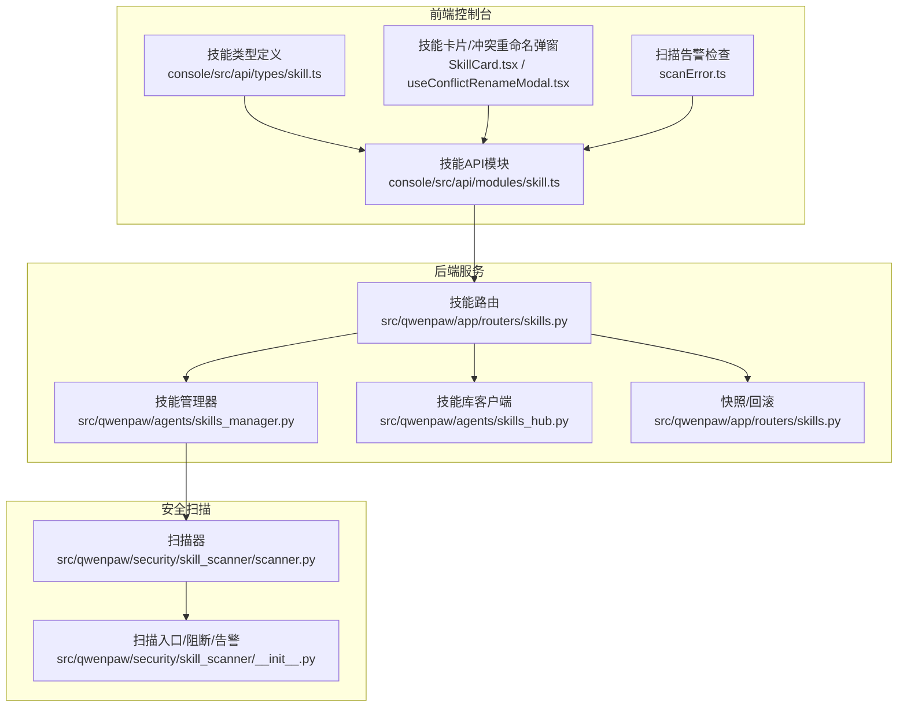
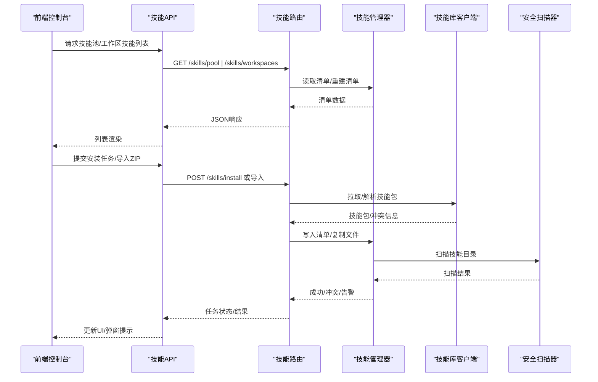
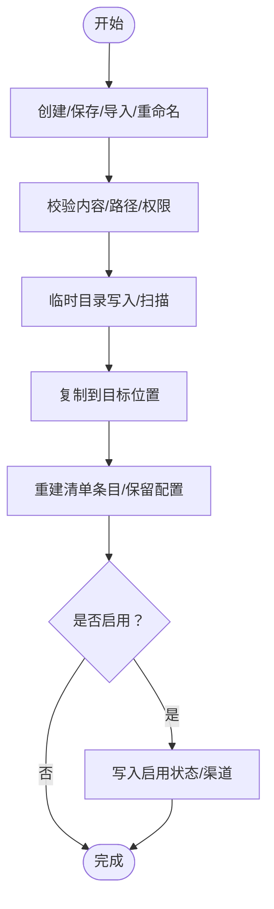
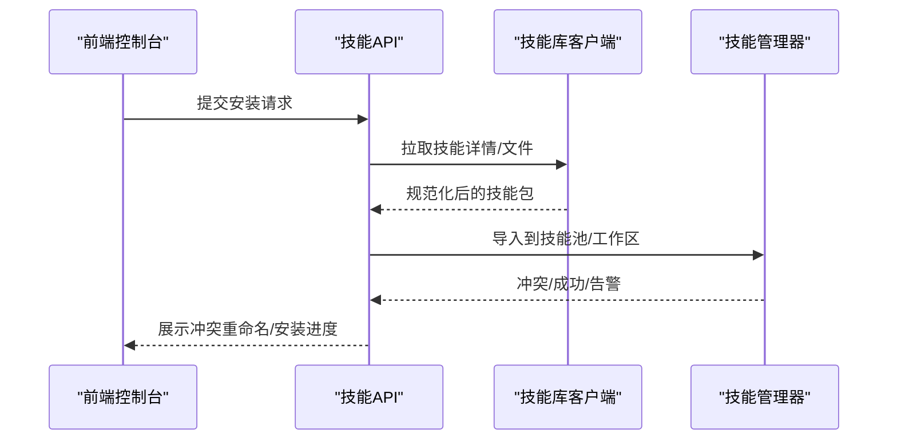
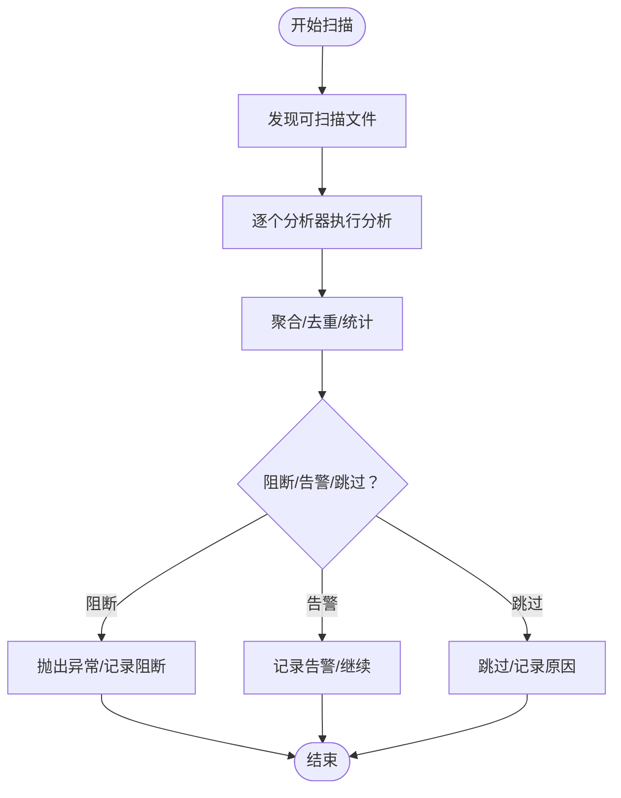
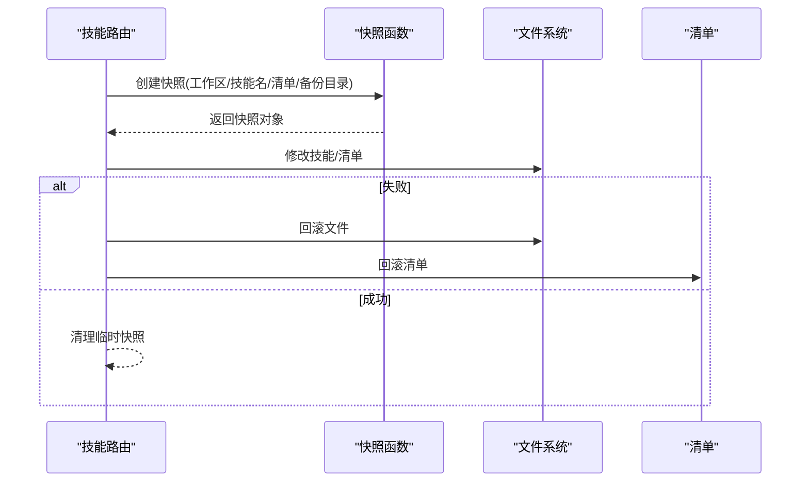
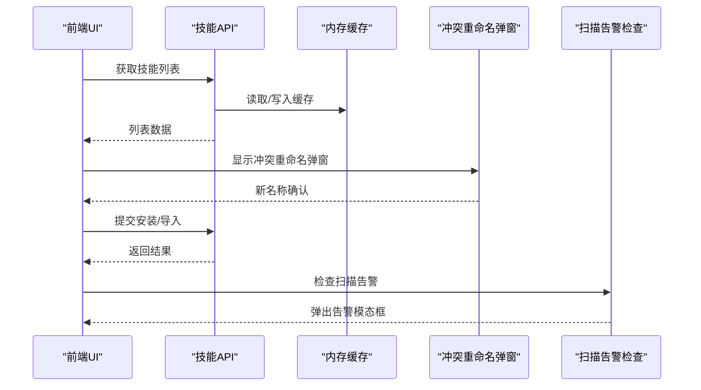
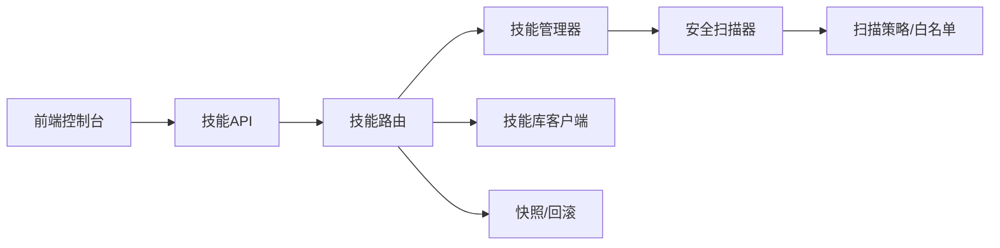

# 技能生命周期管理

<cite>
**本文引用的文件**
- [skills_manager.py](file://src/qwenpaw/agents/skills_manager.py)
- [skills_hub.py](file://src/qwenpaw/agents/skills_hub.py)
- [scanner.py](file://src/qwenpaw/security/skill_scanner/scanner.py)
- [__init__.py](file://src/qwenpaw/security/skill_scanner/__init__.py)
- [skill.ts](file://console/src/api/modules/skill.ts)
- [skill.ts](file://console/src/api/types/skill.ts)
- [skills.py](file://src/qwenpaw/app/routers/skills.py)
- [useConflictRenameModal.tsx](file://console/src/pages/Agent/Skills/components/useConflictRenameModal.tsx)
- [SkillCard.tsx](file://console/src/pages/Agent/Skills/components/SkillCard.tsx)
- [scanError.ts](file://console/src/utils/scanError.ts)
</cite>

## 目录
1. [简介](#简介)
2. [项目结构](#项目结构)
3. [核心组件](#核心组件)
4. [架构总览](#架构总览)
5. [详细组件分析](#详细组件分析)
6. [依赖分析](#依赖分析)
7. [性能考虑](#性能考虑)
8. [故障排查指南](#故障排查指南)
9. [结论](#结论)
10. [附录](#附录)

## 简介
本技术文档围绕 QwenPaw 的“技能生命周期管理”展开，系统阐述从技能创建、导入、启用、禁用、更新、下载、卸载到回滚与备份的全链路流程；解释状态管理（启用/禁用、渠道路由、配置持久化）、冲突检测与解决策略（名称、功能、资源）、依赖管理（前置技能、依赖解析、循环依赖检测）、安全扫描与白名单机制、性能监控与资源统计、版本管理与向后兼容、热更新与在线维护、以及故障诊断与恢复方法。

## 项目结构
QwenPaw 将技能生命周期分为三层：
- 后端服务层：负责技能清单、导入导出、启用/禁用、下载/上传、回滚与备份、安全扫描等核心逻辑。
- 前端控制台层：提供技能池与工作区技能列表、安装任务、冲突重命名弹窗、扫描告警提示等交互能力。
- 安全扫描层：对技能进行静态扫描，支持阻断或警告模式，并可配置白名单。

图示来源
- [skills_manager.py](file://src/qwenpaw/agents/skills_manager.py)
- [skills_hub.py](file://src/qwenpaw/agents/skills_hub.py)
- [scanner.py](file://src/qwenpaw/security/skill_scanner/scanner.py)
- [__init__.py](file://src/qwenpaw/security/skill_scanner/__init__.py)
- [skill.ts](file://console/src/api/modules/skill.ts)
- [skill.ts](file://console/src/api/types/skill.ts)
- [skills.py](file://src/qwenpaw/app/routers/skills.py)

章节来源
- [skills_manager.py](file://src/qwenpaw/agents/skills_manager.py)
- [skills_hub.py](file://src/qwenpaw/agents/skills_hub.py)
- [scanner.py](file://src/qwenpaw/security/skill_scanner/scanner.py)
- [__init__.py](file://src/qwenpaw/security/skill_scanner/__init__.py)
- [skill.ts](file://console/src/api/modules/skill.ts)
- [skill.ts](file://console/src/api/types/skill.ts)
- [skills.py](file://src/qwenpaw/app/routers/skills.py)

## 核心组件
- 技能管理器（SkillService/SkillPoolService）：负责工作区技能与共享技能池的创建、导入导出、启用/禁用、渠道路由、配置持久化、重命名与删除等。
- 技能库客户端（SkillHub）：提供从云端技能库搜索、拉取、安装、取消安装等能力，支持重试、超时、缓存与并发控制。
- 安全扫描器（SkillScanner）：对技能目录进行文件发现、规则匹配与结果聚合，支持阻断/告警模式与白名单。
- 路由与备份（Routers/Skills）：提供技能快照与回滚接口，保障热更新与在线维护期间的数据一致性。
- 前端 API 与类型：统一技能数据结构、安装任务状态、工作区与技能池列表、缓存与失效策略。

章节来源
- [skills_manager.py](file://src/qwenpaw/agents/skills_manager.py)
- [skills_hub.py](file://src/qwenpaw/agents/skills_hub.py)
- [scanner.py](file://src/qwenpaw/security/skill_scanner/scanner.py)
- [__init__.py](file://src/qwenpaw/security/skill_scanner/__init__.py)
- [skills.py](file://src/qwenpaw/app/routers/skills.py)
- [skill.ts](file://console/src/api/modules/skill.ts)
- [skill.ts](file://console/src/api/types/skill.ts)

## 架构总览
技能生命周期在后端以“清单驱动”的方式运行：工作区与技能池分别维护各自的 manifest 文件，所有变更通过原子化的 JSON 写入与文件复制实现，确保并发安全与可回滚性。前端通过 API 获取技能状态、提交安装任务、查看扫描告警并执行冲突重命名。

图示来源
- [skills_manager.py](file://src/qwenpaw/agents/skills_manager.py)
- [skills_hub.py](file://src/qwenpaw/agents/skills_hub.py)
- [scanner.py](file://src/qwenpaw/security/skill_scanner/scanner.py)
- [__init__.py](file://src/qwenpaw/security/skill_scanner/__init__.py)
- [skill.ts](file://console/src/api/modules/skill.ts)

## 详细组件分析

### 组件A：技能管理器（SkillService/SkillPoolService）
职责与能力
- 工作区技能管理：创建、编辑、重命名、删除、启用/禁用、设置渠道、设置标签、读取文件、导入ZIP、从工作区上传至技能池、从技能池下载至工作区。
- 技能池管理：创建、编辑、重命名、删除、导入ZIP、内置技能同步、标签设置。
- 冲突检测与重命名：基于时间戳后缀生成建议名，避免同名冲突。
- 清单重建与一致性：按需扫描磁盘，重建元数据，保留用户配置与标签。
- 并发安全：通过文件锁与原子写入，保证多进程/多线程下的清单一致性。

关键流程（创建/保存/导入/启用/重命名/删除）

图示来源
- [skills_manager.py](file://src/qwenpaw/agents/skills_manager.py)

章节来源
- [skills_manager.py](file://src/qwenpaw/agents/skills_manager.py)

### 组件B：技能库客户端（SkillHub）
职责与能力
- 搜索与详情：支持关键词搜索、分页限制、版本选择。
- 下载与解包：从云端拉取技能包，校验 ZIP 结构与大小，提取文件树，规范化内容。
- 取消与重试：支持取消检查、指数退避重试、超时控制。
- 缓存与鉴权：对 GitHub 等源进行缓存与令牌注入。
- 冲突与错误处理：返回标准化的冲突信息与错误消息。

安装流程（含冲突与重命名）

图示来源
- [skills_hub.py](file://src/qwenpaw/agents/skills_hub.py)
- [skill.ts](file://console/src/api/modules/skill.ts)

章节来源
- [skills_hub.py](file://src/qwenpaw/agents/skills_hub.py)
- [skill.ts](file://console/src/api/modules/skill.ts)

### 组件C：安全扫描器（SkillScanner）
职责与能力
- 文件发现：遍历技能目录，跳过符号链接、不在目录内的路径、过大文件、策略/默认忽略扩展名。
- 分析器编排：按策略加载分析器，收集并去重结果，记录失败的分析器。
- 阻断/告警：根据扫描结果与配置决定阻断或仅告警；支持白名单豁免。
- 性能与缓存：线程池执行、超时控制、结果缓存。

扫描流程

图示来源
- [scanner.py](file://src/qwenpaw/security/skill_scanner/scanner.py)
- [__init__.py](file://src/qwenpaw/security/skill_scanner/__init__.py)

章节来源
- [scanner.py](file://src/qwenpaw/security/skill_scanner/scanner.py)
- [__init__.py](file://src/qwenpaw/security/skill_scanner/__init__.py)

### 组件D：路由与备份（Routers/Skills）
职责与能力
- 快照与回滚：在修改前对工作区技能目录与清单做快照，失败时回滚。
- 失败恢复：回滚清单与文件，保证一致性。

回滚流程

图示来源
- [skills.py](file://src/qwenpaw/app/routers/skills.py)

章节来源
- [skills.py](file://src/qwenpaw/app/routers/skills.py)

### 组件E：前端交互与缓存
职责与能力
- 列表与刷新：获取工作区与技能池列表，带缓存与失效策略。
- 冲突重命名弹窗：批量冲突时弹窗输入新名称。
- 扫描告警提示：操作完成后检查告警并弹出警告模态框。

前端交互流程

图示来源
- [skill.ts](file://console/src/api/modules/skill.ts)
- [skill.ts](file://console/src/api/types/skill.ts)
- [useConflictRenameModal.tsx](file://console/src/pages/Agent/Skills/components/useConflictRenameModal.tsx)
- [scanError.ts](file://console/src/utils/scanError.ts)
- [SkillCard.tsx](file://console/src/pages/Agent/Skills/components/SkillCard.tsx)

章节来源
- [skill.ts](file://console/src/api/modules/skill.ts)
- [skill.ts](file://console/src/api/types/skill.ts)
- [useConflictRenameModal.tsx](file://console/src/pages/Agent/Skills/components/useConflictRenameModal.tsx)
- [scanError.ts](file://console/src/utils/scanError.ts)
- [SkillCard.tsx](file://console/src/pages/Agent/Skills/components/SkillCard.tsx)

## 依赖分析
- 技能管理器依赖安全扫描器进行内容扫描，确保导入/保存/重命名后的技能符合安全策略。
- 技能库客户端提供云端技能包，供导入与安装流程使用。
- 路由层在关键写入操作前后进行快照/回滚，降低风险。
- 前端 API 与类型定义统一了数据契约，缓存与失效策略提升交互性能。

图示来源
- [skills_manager.py](file://src/qwenpaw/agents/skills_manager.py)
- [skills_hub.py](file://src/qwenpaw/agents/skills_hub.py)
- [scanner.py](file://src/qwenpaw/security/skill_scanner/scanner.py)
- [__init__.py](file://src/qwenpaw/security/skill_scanner/__init__.py)
- [skills.py](file://src/qwenpaw/app/routers/skills.py)
- [skill.ts](file://console/src/api/modules/skill.ts)

章节来源
- [skills_manager.py](file://src/qwenpaw/agents/skills_manager.py)
- [skills_hub.py](file://src/qwenpaw/agents/skills_hub.py)
- [scanner.py](file://src/qwenpaw/security/skill_scanner/scanner.py)
- [__init__.py](file://src/qwenpaw/security/skill_scanner/__init__.py)
- [skills.py](file://src/qwenpaw/app/routers/skills.py)
- [skill.ts](file://console/src/api/modules/skill.ts)

## 性能考虑
- 文件锁与原子写入：通过临时文件与替换写入，减少竞态与损坏风险，适合高并发场景。
- 扫描限流与缓存：扫描器限制最大文件数与单文件大小，支持超时与缓存，避免重复扫描。
- 前端缓存：技能列表采用内存缓存与 TTL，减少重复请求。
- ZIP 解压与校验：限制 ZIP 总体积与条目数，拒绝危险路径与符号链接，防止资源滥用。

## 故障排查指南
常见问题与处理
- 安装/导入冲突：出现同名冲突时，前端弹出冲突重命名弹窗，输入新名称后重试。
- 扫描阻断：当扫描结果达到阻断级别时，抛出异常并记录阻断历史；可在安全设置中配置扫描模式与白名单。
- 超时/重试：云端技能库请求支持重试与退避，若仍失败，检查网络与令牌配置。
- 回滚恢复：若启用/更新失败，路由层会自动回滚文件与清单，确保一致性。

章节来源
- [useConflictRenameModal.tsx](file://console/src/pages/Agent/Skills/components/useConflictRenameModal.tsx)
- [__init__.py](file://src/qwenpaw/security/skill_scanner/__init__.py)
- [skills_hub.py](file://src/qwenpaw/agents/skills_hub.py)
- [skills.py](file://src/qwenpaw/app/routers/skills.py)

## 结论
QwenPaw 的技能生命周期管理以“清单驱动+原子写入+安全扫描+快照回滚”为核心设计，覆盖从创建到销毁的全链路操作，具备完善的冲突检测、版本管理、性能优化与故障恢复能力。通过前后端协同与策略化扫描，既保证易用性也确保安全性与稳定性。

## 附录
- 数据模型与状态字段
  - 技能规范（SkillSpec/PoolSkillSpec）：包含名称、描述、版本文本、内容、来源、启用状态、渠道、标签、配置、最后更新时间、表情符号等。
  - 安装任务（HubInstallTaskResponse）：包含任务ID、版本、是否启用、是否覆盖、状态、错误信息与冲突建议等。
- 关键实现参考
  - 技能管理器：创建/保存/导入/启用/禁用/重命名/删除、清单重建、并发安全。
  - 技能库客户端：搜索/详情/下载/解包/重试/超时/缓存。
  - 安全扫描器：文件发现/分析器编排/阻断/告警/白名单。
  - 路由与备份：快照/回滚。
  - 前端 API 与类型：列表/刷新/安装任务/缓存/冲突重命名/扫描告警。

章节来源
- [skill.ts](file://console/src/api/types/skill.ts)
- [skills_manager.py](file://src/qwenpaw/agents/skills_manager.py)
- [skills_hub.py](file://src/qwenpaw/agents/skills_hub.py)
- [scanner.py](file://src/qwenpaw/security/skill_scanner/scanner.py)
- [__init__.py](file://src/qwenpaw/security/skill_scanner/__init__.py)
- [skills.py](file://src/qwenpaw/app/routers/skills.py)
- [skill.ts](file://console/src/api/modules/skill.ts)
- [useConflictRenameModal.tsx](file://console/src/pages/Agent/Skills/components/useConflictRenameModal.tsx)
- [scanError.ts](file://console/src/utils/scanError.ts)