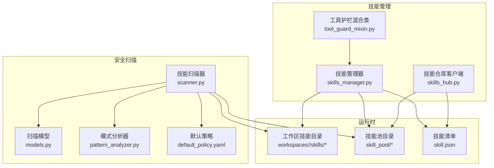
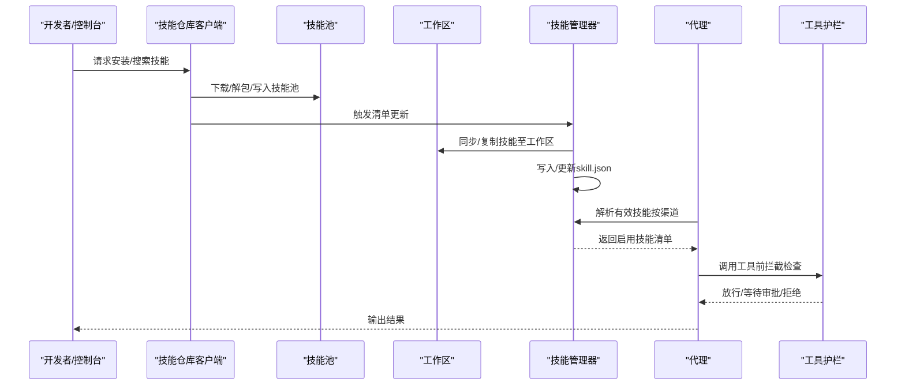
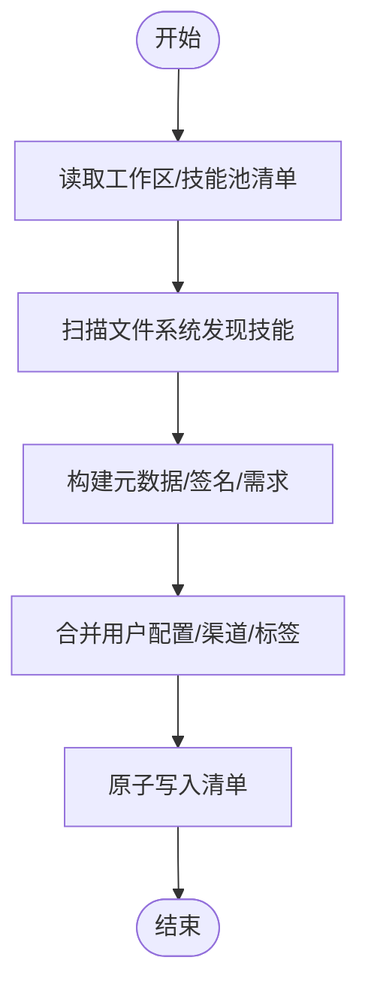
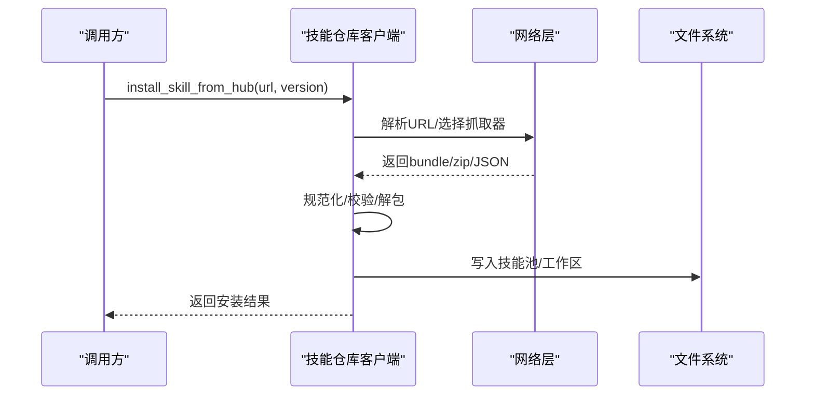
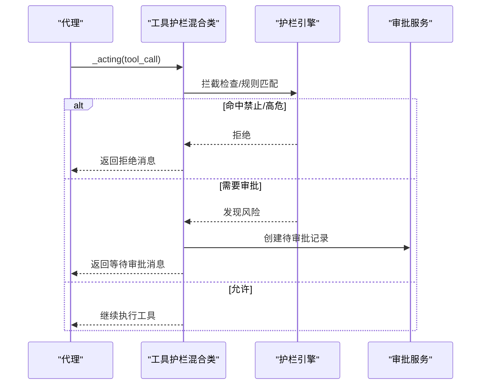
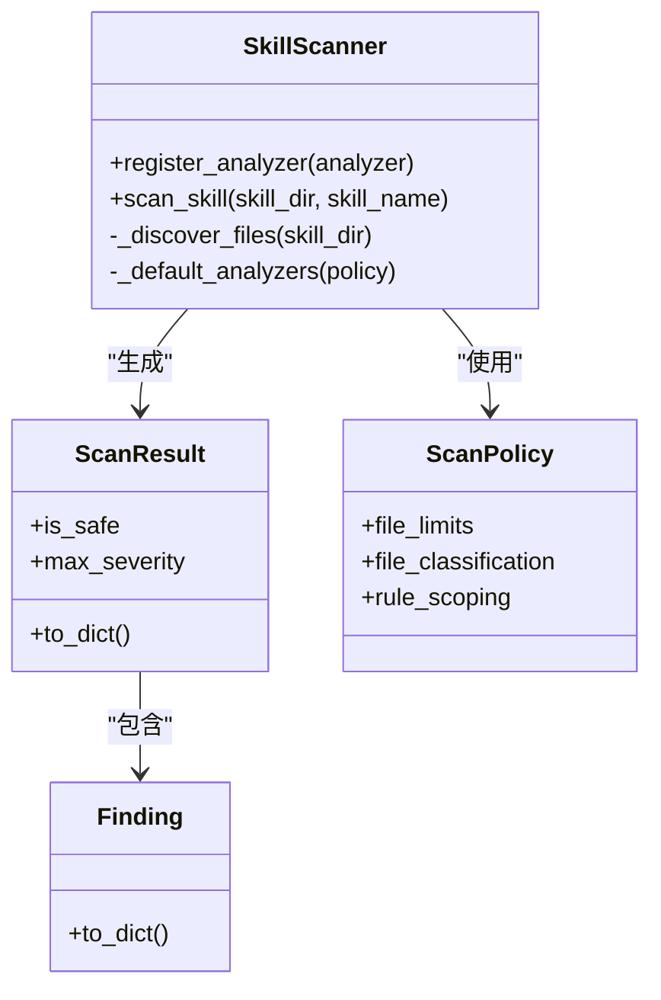
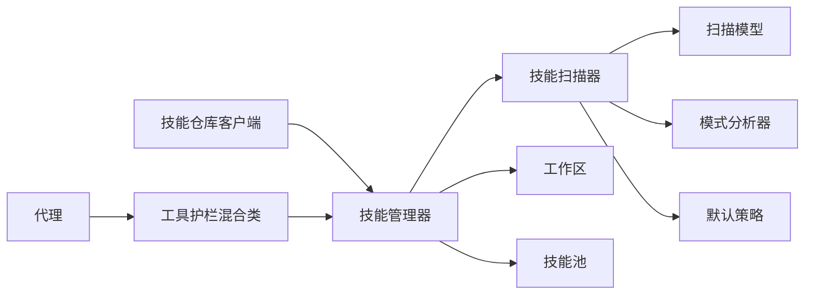

# 技能管理系统

<cite>
**本文引用的文件**
- [skills_manager.py](file://src/qwenpaw/agents/skills_manager.py)
- [skills_hub.py](file://src/qwenpaw/agents/skills_hub.py)
- [tool_guard_mixin.py](file://src/qwenpaw/agents/tool_guard_mixin.py)
- [scanner.py](file://src/qwenpaw/security/skill_scanner/scanner.py)
- [models.py](file://src/qwenpaw/security/skill_scanner/models.py)
- [pattern_analyzer.py](file://src/qwenpaw/security/skill_scanner/analyzers/pattern_analyzer.py)
- [default_policy.yaml](file://src/qwenpaw/security/skill_scanner/data/default_policy.yaml)
- [file_guardian.py](file://src/qwenpaw/security/tool_guard/guardians/file_guardian.py)
- [rule_guardian.py](file://src/qwenpaw/security/tool_guard/guardians/rule_guardian.py)
- [dangerous_shell_commands.yaml](file://src/qwenpaw/security/tool_guard/rules/dangerous_shell_commands.yaml)
- [SKILL.md](file://src/qwenpaw/agents/skills/pdf/SKILL.md)
- [SKILL.md](file://src/qwenpaw/agents/skills/docx/SKILL.md)
- [SKILL.md](file://src/qwenpaw/agents/skills/xlsx/SKILL.md)
- [SKILL.md](file://src/qwenpaw/agents/skills/pptx/SKILL.md)
- [SKILL.md](file://src/qwenpaw/agents/skills/news/SKILL.md)
- [SKILL.md](file://src/qwenpaw/agents/skills/file_reader/SKILL.md)
- [SKILL.md](file://src/qwenpaw/agents/skills/browser_cdp/SKILL.md)
- [SKILL.md](file://src/qwenpaw/agents/skills/browser_visible/SKILL.md)
- [SKILL.md](file://src/qwenpaw/agents/skills/cron/SKILL.md)
- [SKILL.md](file://src/qwenpaw/agents/skills/channel_message/SKILL.md)
- [SKILL.md](file://src/qwenpaw/agents/skills/dingtalk_channel/SKILL.md)
- [SKILL.md](file://src/qwenpaw/agents/skills/multi_agent_collaboration/SKILL.md)
- [SKILL.md](file://src/qwenpaw/agents/skills/himalaya/SKILL.md)
- [SKILL.md](file://src/qwenpaw/agents/skills/guidance/SKILL.md)
- [SKILL.md](file://src/qwenpaw/agents/skills/QA_source_index/SKILL.md)
</cite>

## 目录
1. [简介](#简介)
2. [项目结构](#项目结构)
3. [核心组件](#核心组件)
4. [架构总览](#架构总览)
5. [详细组件分析](#详细组件分析)
6. [依赖分析](#依赖分析)
7. [性能考虑](#性能考虑)
8. [故障排查指南](#故障排查指南)
9. [结论](#结论)
10. [附录](#附录)

## 简介
本文件面向QwenPaw的技能管理系统，系统性阐述技能仓库架构、技能发现与加载机制、生命周期管理（定义、安装、启用、执行、禁用、卸载）、内置技能实现、参数化配置与动态加载、自定义技能开发规范、安全扫描与权限控制、性能优化与并发策略、调试与测试方法，以及与代理系统的集成与调用协议。

## 项目结构
技能系统由“工作区技能服务”“技能池”“技能仓库客户端”“安全扫描器”“工具护栏”五大模块协同构成，围绕“技能清单（manifest）+ 文件系统（workspace/skill_pool）”双轨运行，既保证可编辑性，又确保运行时一致性。

图示来源
- [skills_manager.py](file://src/qwenpaw/agents/skills_manager.py)
- [skills_hub.py](file://src/qwenpaw/agents/skills_hub.py)
- [tool_guard_mixin.py](file://src/qwenpaw/agents/tool_guard_mixin.py)
- [scanner.py](file://src/qwenpaw/security/skill_scanner/scanner.py)
- [models.py](file://src/qwenpaw/security/skill_scanner/models.py)

章节来源
- [skills_manager.py](file://src/qwenpaw/agents/skills_manager.py)
- [skills_hub.py](file://src/qwenpaw/agents/skills_hub.py)
- [scanner.py](file://src/qwenpaw/security/skill_scanner/scanner.py)

## 核心组件
- 技能管理器：负责技能清单解析、工作区与技能池同步、导入导出、签名校验、环境变量注入、冲突处理与重命名建议。
- 技能仓库客户端：支持多源（ClawHub、GitHub、LobeHub、ModelScope、skills.sh、skillsmp）技能包抓取、解包、规范化与安装。
- 工具护栏混合类：在代理推理/行动前拦截敏感工具调用，执行规则检查与审批流。
- 安全扫描器：对技能包进行文件级扫描，基于策略与规则识别高危模式，输出统一结果模型。
- 运行时：以工作区与技能池双目录为数据源，通过manifest驱动运行时选择与路由。

章节来源
- [skills_manager.py](file://src/qwenpaw/agents/skills_manager.py)
- [skills_hub.py](file://src/qwenpaw/agents/skills_hub.py)
- [tool_guard_mixin.py](file://src/qwenpaw/agents/tool_guard_mixin.py)
- [scanner.py](file://src/qwenpaw/security/skill_scanner/scanner.py)
- [models.py](file://src/qwenpaw/security/skill_scanner/models.py)

## 架构总览
技能系统采用“清单驱动 + 文件系统”的双轨架构：
- 清单（skill.json）描述启用状态、渠道路由、配置、需求与元信息。
- 文件系统承载实际技能内容（SKILL.md + 脚本/参考文件），工作区优先，技能池作为共享库与内置技能镜像。

图示来源
- [skills_hub.py](file://src/qwenpaw/agents/skills_hub.py)
- [skills_manager.py](file://src/qwenpaw/agents/skills_manager.py)
- [tool_guard_mixin.py](file://src/qwenpaw/agents/tool_guard_mixin.py)

## 详细组件分析

### 技能管理器（skills_manager.py）
职责与能力
- 技能发现与元数据构建：从SKILL.md提取名称、描述、版本、emoji、需求等；计算内容签名用于冲突检测。
- 工作区与技能池同步：内置技能镜像与用户自定义技能并存，支持池内内置槽位保护与差异更新。
- 清单持久化：提供工作区与技能池的manifest读写、变更锁、原子写入。
- 环境变量注入：根据技能配置与声明需求，生成环境变量覆盖，避免竞态。
- 安全扫描：在导入/创建阶段对技能目录执行扫描。
- 冲突处理：提供冲突建议与重命名逻辑，避免同名覆盖。

关键流程
- 导入内置技能：遍历内置目录，比对签名，必要时复制覆盖，并更新池清单。
- 工作区清单重建：扫描工作区skills目录，保留用户配置与渠道设置，刷新元信息。
- 环境注入：在一次对话回合内，按需注入技能配置相关环境变量，结束后释放。

图示来源
- [skills_manager.py](file://src/qwenpaw/agents/skills_manager.py)

章节来源
- [skills_manager.py](file://src/qwenpaw/agents/skills_manager.py)

### 技能仓库客户端（skills_hub.py）
职责与能力
- 多源抓取：支持ClawHub、GitHub、LobeHub、ModelScope、skills.sh、skillsmp等。
- 包体解包与规范化：将远端返回的bundle标准化为本地文件树，仅保留允许路径与类型。
- 取消与重试：支持取消检查、指数退避、超时与重试策略。
- 缓存与限流：对GitHub API使用TTL缓存，降低请求压力。
- 错误归一化：统一HTTP错误、大小限制、速率限制提示。

图示来源
- [skills_hub.py](file://src/qwenpaw/agents/skills_hub.py)

章节来源
- [skills_hub.py](file://src/qwenpaw/agents/skills_hub.py)

### 工具护栏混合类（tool_guard_mixin.py）
职责与能力
- 在代理推理/行动前拦截敏感工具调用，执行规则检查与审批流。
- 支持预批准令牌消费、强制重放队列、思考块保留与内存清理。
- 提供并发安全的决策与执行，保障并行工具调用下的状态一致。

图示来源
- [tool_guard_mixin.py](file://src/qwenpaw/agents/tool_guard_mixin.py)

章节来源
- [tool_guard_mixin.py](file://src/qwenpaw/agents/tool_guard_mixin.py)

### 安全扫描器（scanner.py + models.py + pattern_analyzer.py + default_policy.yaml）
职责与能力
- 扫描器：遍历技能目录，按策略过滤与限制文件数量/大小，调用各分析器聚合结果。
- 模型：统一Finding/ScanResult/Severity/ThreatCategory等数据结构。
- 分析器：默认使用PatternAnalyzer（基于规则签名）。
- 策略：支持组织级策略覆盖、去重、跳过扩展名、最大文件数/大小等。

图示来源
- [scanner.py](file://src/qwenpaw/security/skill_scanner/scanner.py)
- [models.py](file://src/qwenpaw/security/skill_scanner/models.py)

章节来源
- [scanner.py](file://src/qwenpaw/security/skill_scanner/scanner.py)
- [models.py](file://src/qwenpaw/security/skill_scanner/models.py)

## 依赖分析
- 技能管理器依赖安全扫描器进行导入/创建阶段的安全扫描。
- 技能仓库客户端在安装后会触发技能管理器的清单更新与同步。
- 工具护栏混合类在代理执行工具前进行拦截，与技能管理器的“有效技能解析”配合，决定是否放行。
- 安全扫描器与工具护栏分别在“入库/创建”和“运行时调用”两个阶段提供安全保障。

图示来源
- [skills_hub.py](file://src/qwenpaw/agents/skills_hub.py)
- [skills_manager.py](file://src/qwenpaw/agents/skills_manager.py)
- [scanner.py](file://src/qwenpaw/security/skill_scanner/scanner.py)
- [models.py](file://src/qwenpaw/security/skill_scanner/models.py)
- [tool_guard_mixin.py](file://src/qwenpaw/agents/tool_guard_mixin.py)

章节来源
- [skills_manager.py](file://src/qwenpaw/agents/skills_manager.py)
- [skills_hub.py](file://src/qwenpaw/agents/skills_hub.py)
- [scanner.py](file://src/qwenpaw/security/skill_scanner/scanner.py)
- [tool_guard_mixin.py](file://src/qwenpaw/agents/tool_guard_mixin.py)

## 性能考虑
- 并发与锁：清单写入使用文件级互斥锁，避免跨进程竞争；环境变量注入采用线程锁，减少竞态。
- I/O优化：扫描器对大文件与超量文件进行限制，避免阻塞；GitHub API使用TTL缓存降低重复请求。
- 网络重试：仓库客户端对临时错误与429/5xx使用指数退避，提升稳定性。
- 运行时拦截：工具护栏在并发工具调用下保持决策串行、执行并行，兼顾安全性与吞吐。

## 故障排查指南
常见问题与定位
- 技能导入失败：检查仓库URL格式、网络连通、速率限制与包体大小/条目限制。
- 清单写入异常：确认锁文件存在与权限，查看JSON解析错误日志。
- 环境变量未生效：核对技能配置中的require_envs与注入键名，检查并发注入冲突。
- 工具调用被拦截：查看护栏发现的风险等级与规则来源，确认是否需要审批或调整规则。
- 扫描不通过：根据ScanResult中最高严重级别与类别定位具体文件与规则ID，修正后重新扫描。

章节来源
- [skills_hub.py](file://src/qwenpaw/agents/skills_hub.py)
- [skills_manager.py](file://src/qwenpaw/agents/skills_manager.py)
- [scanner.py](file://src/qwenpaw/security/skill_scanner/scanner.py)
- [tool_guard_mixin.py](file://src/qwenpaw/agents/tool_guard_mixin.py)

## 结论
QwenPaw的技能管理系统通过“清单+文件系统”的双轨设计实现了可编辑性与一致性，结合仓库客户端、安全扫描与工具护栏，在导入、运行、调用三个关键节点提供安全与可控的技能生态。内置技能覆盖文档处理、浏览器交互、计划任务、消息通道等场景，满足通用自动化需求。通过参数化配置与动态加载机制，用户可在不重启代理的情况下灵活启用/禁用技能并按渠道路由。

## 附录

### 技能生命周期（定义→安装→启用→执行→禁用/卸载）
- 定义：编写SKILL.md（含name/description/metadata/requirements等），可选references/scripts。
- 安装：从仓库或本地ZIP导入，写入技能池与工作区，更新清单。
- 启用：在工作区清单中设置enabled与channels，重启或重新解析生效。
- 执行：代理按渠道解析有效技能，工具护栏拦截敏感调用，执行后可回放/清理。
- 禁用/卸载：移除清单项或删除目录，必要时清理环境变量与审批记录。

章节来源
- [skills_manager.py](file://src/qwenpaw/agents/skills_manager.py)
- [tool_guard_mixin.py](file://src/qwenpaw/agents/tool_guard_mixin.py)

### 内置技能功能概览（基于SKILL.md）
- PDF处理：解析与抽取、表单识别、加密处理等（见pdf/SKILL.md）。
- Office文档：docx读写、xlsx表格处理、pptx演示文稿编辑（见docx/xlsx/pptx/SKILL.md）。
- 新闻摘要：抓取与摘要生成（见news/SKILL.md）。
- 文件读取：本地文件读取与编码探测（见file_reader/SKILL.md）。
- 浏览器：CDP与可见界面自动化（见browser_cdp/browser_visible/SKILL.md）。
- 计划任务：定时执行与心跳（见cron/SKILL.md）。
- 通道消息：多渠道消息转发（见channel_message/dingtalk_channel/SKILL.md）。
- 多智能体协作：编排与通信（见multi_agent_collaboration/SKILL.md）。
- 其他：himalaya、guidance、QA_source_index等。

章节来源
- [SKILL.md](file://src/qwenpaw/agents/skills/pdf/SKILL.md)
- [SKILL.md](file://src/qwenpaw/agents/skills/docx/SKILL.md)
- [SKILL.md](file://src/qwenpaw/agents/skills/xlsx/SKILL.md)
- [SKILL.md](file://src/qwenpaw/agents/skills/pptx/SKILL.md)
- [SKILL.md](file://src/qwenpaw/agents/skills/news/SKILL.md)
- [SKILL.md](file://src/qwenpaw/agents/skills/file_reader/SKILL.md)
- [SKILL.md](file://src/qwenpaw/agents/skills/browser_cdp/SKILL.md)
- [SKILL.md](file://src/qwenpaw/agents/skills/browser_visible/SKILL.md)
- [SKILL.md](file://src/qwenpaw/agents/skills/cron/SKILL.md)
- [SKILL.md](file://src/qwenpaw/agents/skills/channel_message/SKILL.md)
- [SKILL.md](file://src/qwenpaw/agents/skills/dingtalk_channel/SKILL.md)
- [SKILL.md](file://src/qwenpaw/agents/skills/multi_agent_collaboration/SKILL.md)
- [SKILL.md](file://src/qwenpaw/agents/skills/himalaya/SKILL.md)
- [SKILL.md](file://src/qwenpaw/agents/skills/guidance/SKILL.md)
- [SKILL.md](file://src/qwenpaw/agents/skills/QA_source_index/SKILL.md)

### 自定义技能开发指南
- 接口与清单：在技能根目录编写SKILL.md，声明name/description/version/metadata/requirements等；可选references/scripts。
- 参数化配置：在metadata中声明requires.env，运行时通过环境变量注入；也可通过apply_skill_config_env_overrides在回合内注入。
- 动态加载：技能目录即代码库，通过resolve_effective_skills按渠道解析启用集合。
- 安全前置：创建/导入时自动扫描，修复高危规则后再上线。
- 错误处理：遵循SkillsError约定，提供清晰的错误信息与建议。

章节来源
- [skills_manager.py](file://src/qwenpaw/agents/skills_manager.py)
- [scanner.py](file://src/qwenpaw/security/skill_scanner/scanner.py)

### 技能安全扫描机制
- 扫描范围：排除隐藏文件与受信任扩展，限制文件数量与大小。
- 分析器：默认PatternAnalyzer（基于规则签名），可注册其他分析器。
- 策略：支持组织策略覆盖、去重、跳过扩展名、最大文件数/大小等。
- 结果：统一Finding/ScanResult模型，按严重级别判定是否安全。

章节来源
- [scanner.py](file://src/qwenpaw/security/skill_scanner/scanner.py)
- [models.py](file://src/qwenpaw/security/skill_scanner/models.py)
- [default_policy.yaml](file://src/qwenpaw/security/skill_scanner/data/default_policy.yaml)

### 权限控制与工具护栏
- 工具护栏：在代理行动前拦截敏感工具，支持预批准、审批队列、强制重放与思考块保留。
- 规则守护：file_guardian与rule_guardian结合危险命令规则，阻断高危路径与命令组合。
- 审批服务：与会话上下文绑定，支持取消/重放与内存清理。

章节来源
- [tool_guard_mixin.py](file://src/qwenpaw/agents/tool_guard_mixin.py)
- [file_guardian.py](file://src/qwenpaw/security/tool_guard/guardians/file_guardian.py)
- [rule_guardian.py](file://src/qwenpaw/security/tool_guard/guardians/rule_guardian.py)
- [dangerous_shell_commands.yaml](file://src/qwenpaw/security/tool_guard/rules/dangerous_shell_commands.yaml)

### 性能优化与并发策略
- 清单写入：文件级互斥锁，避免并发写入冲突。
- 环境注入：线程锁保护全局活跃环境表，避免竞态。
- 网络重试：指数退避与超时控制，降低外部依赖抖动影响。
- 工具护栏：决策串行、执行并行，保障状态一致与吞吐。

章节来源
- [skills_manager.py](file://src/qwenpaw/agents/skills_manager.py)
- [skills_hub.py](file://src/qwenpaw/agents/skills_hub.py)
- [tool_guard_mixin.py](file://src/qwenpaw/agents/tool_guard_mixin.py)

### 调试与测试方法
- 日志：扫描器、仓库客户端、护栏均输出详细日志，便于定位问题。
- 单元测试：仓库包含大量单元测试与集成测试样例，建议复用测试框架与断言。
- 本地验证：先在技能池验证扫描与清单更新，再在工作区验证渠道路由与护栏拦截。

章节来源
- [scanner.py](file://src/qwenpaw/security/skill_scanner/scanner.py)
- [skills_hub.py](file://src/qwenpaw/agents/skills_hub.py)
- [tool_guard_mixin.py](file://src/qwenpaw/agents/tool_guard_mixin.py)