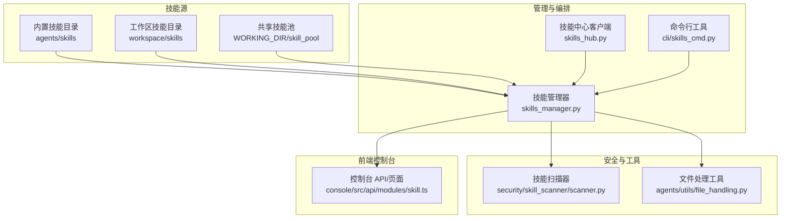
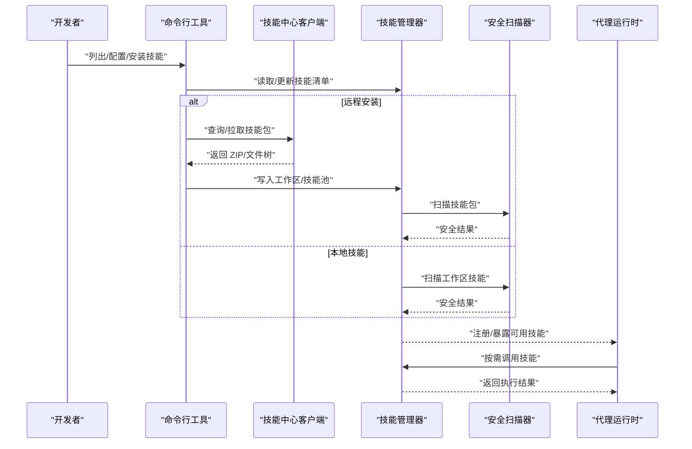
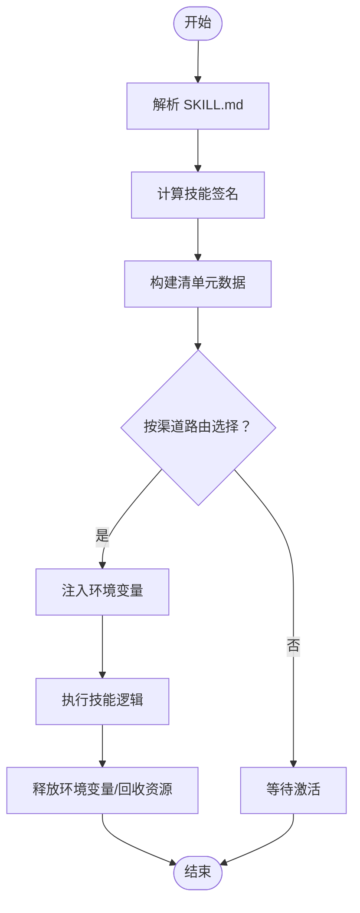
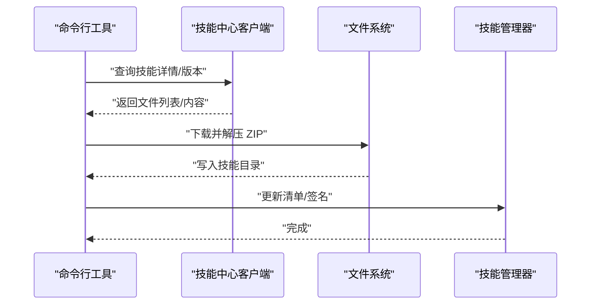
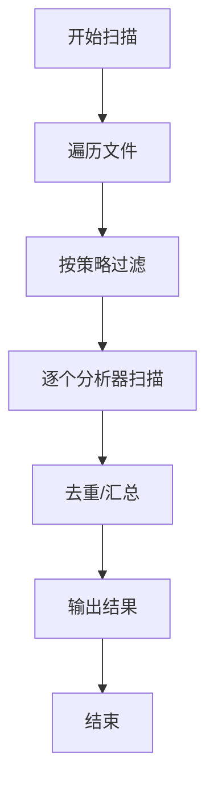
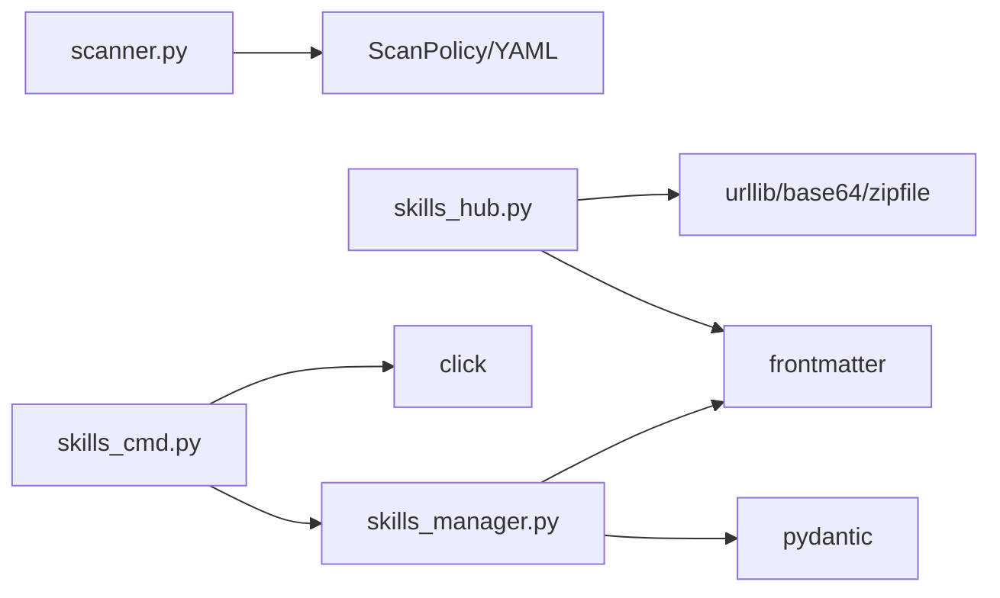

# 自定义技能开发

<cite>
**本文引用的文件**
- [skills_hub.py](file://src/qwenpaw/agents/skills_hub.py)
- [skills_manager.py](file://src/qwenpaw/agents/skills_manager.py)
- [skills_cmd.py](file://src/qwenpaw/cli/skills_cmd.py)
- [file_reader/SKILL.md](file://src/qwenpaw/agents/skills/file_reader/SKILL.md)
- [browser_visible/SKILL.md](file://src/qwenpaw/agents/skills/browser_visible/SKILL.md)
- [news/SKILL.md](file://src/qwenpaw/agents/skills/news/SKILL.md)
- [docx/SKILL.md](file://src/qwenpaw/agents/skills/docx/SKILL.md)
- [file_handling.py](file://src/qwenpaw/agents/utils/file_handling.py)
- [scanner.py](file://src/qwenpaw/security/skill_scanner/scanner.py)
</cite>

## 目录
1. [简介](#简介)
2. [项目结构](#项目结构)
3. [核心组件](#核心组件)
4. [架构总览](#架构总览)
5. [详细组件分析](#详细组件分析)
6. [依赖分析](#依赖分析)
7. [性能考虑](#性能考虑)
8. [故障排查指南](#故障排查指南)
9. [结论](#结论)
10. [附录](#附录)

## 简介
本指南面向希望为 QwenPaw 开发自定义技能的开发者，系统讲解技能的目录结构、配置文件 SKILL.md 的编写规范、技能函数的签名约定与参数校验、生命周期管理（初始化、执行、清理）、打包与分发（ZIP 结构与依赖管理）、测试与调试方法，以及与代理系统的集成与调用协议。文档基于仓库中的实际实现进行归纳总结，确保内容可落地、可复用。

## 项目结构
QwenPaw 的技能体系由“内置技能”“工作区技能”“技能池”三部分组成，并通过管理器与 CLI 工具进行统一编排。前端控制台提供可视化配置入口；安全扫描器对导入的技能进行合规性检查；下载与文件处理工具支持从 URL/本地路径读取与保存文件。

图示来源
- [skills_manager.py](file://src/qwenpaw/agents/skills_manager.py)
- [skills_hub.py](file://src/qwenpaw/agents/skills_hub.py)
- [skills_cmd.py](file://src/qwenpaw/cli/skills_cmd.py)
- [scanner.py](file://src/qwenpaw/security/skill_scanner/scanner.py)
- [file_handling.py](file://src/qwenpaw/agents/utils/file_handling.py)

章节来源
- [skills_manager.py](file://src/qwenpaw/agents/skills_manager.py)
- [skills_hub.py](file://src/qwenpaw/agents/skills_hub.py)
- [skills_cmd.py](file://src/qwenpaw/cli/skills_cmd.py)

## 核心组件
- 技能管理器：负责技能清单解析、签名计算、冲突检测、导入导出、环境变量注入、工作区与技能池同步。
- 技能中心客户端：支持从远程 Hub 拉取技能包，解析 SKILL.md 与文件树，下载 ZIP 并解压。
- 命令行工具：提供技能列表、交互式启用/禁用、安装等能力。
- 安全扫描器：对技能包进行文件发现、规则匹配与结果聚合，支持策略化配置。
- 文件处理工具：提供跨平台编码兼容的文本读取、URL/本地路径解析、下载与扩展名推断。

章节来源
- [skills_manager.py](file://src/qwenpaw/agents/skills_manager.py)
- [skills_hub.py](file://src/qwenpaw/agents/skills_hub.py)
- [skills_cmd.py](file://src/qwenpaw/cli/skills_cmd.py)
- [scanner.py](file://src/qwenpaw/security/skill_scanner/scanner.py)
- [file_handling.py](file://src/qwenpaw/agents/utils/file_handling.py)

## 架构总览
技能从“来源”进入系统后，经过“解析—校验—注册—运行”的流程。远程技能可通过 Hub 下载并写入工作区；本地技能直接在工作区中被识别与启用；运行时根据渠道路由选择可用技能，并注入必要的环境变量与配置。

图示来源
- [skills_cmd.py](file://src/qwenpaw/cli/skills_cmd.py)
- [skills_hub.py](file://src/qwenpaw/agents/skills_hub.py)
- [skills_manager.py](file://src/qwenpaw/agents/skills_manager.py)
- [scanner.py](file://src/qwenpaw/security/skill_scanner/scanner.py)

## 详细组件分析

### SKILL.md 配置规范
每个技能必须包含一个 SKILL.md 文件，采用 YAML Front Matter 定义元数据与行为说明。常见字段如下：
- 必填字段
  - name：技能稳定标识（用于路由与显示）
  - description：技能简述
- 元数据
  - metadata：字典，可包含版本、平台要求、依赖声明等
  - qwenpaw/emoji：用于控制台展示的表情符号
  - license：许可证信息（若适用）
- 正文内容：使用 Markdown 描述使用方式、参数示例、注意事项等

示例参考
- [file_reader/SKILL.md](file://src/qwenpaw/agents/skills/file_reader/SKILL.md)
- [browser_visible/SKILL.md](file://src/qwenpaw/agents/skills/browser_visible/SKILL.md)
- [news/SKILL.md](file://src/qwenpaw/agents/skills/news/SKILL.md)
- [docx/SKILL.md](file://src/qwenpaw/agents/skills/docx/SKILL.md)

章节来源
- [file_reader/SKILL.md](file://src/qwenpaw/agents/skills/file_reader/SKILL.md)
- [browser_visible/SKILL.md](file://src/qwenpaw/agents/skills/browser_visible/SKILL.md)
- [news/SKILL.md](file://src/qwenpaw/agents/skills/news/SKILL.md)
- [docx/SKILL.md](file://src/qwenpaw/agents/skills/docx/SKILL.md)

### 技能生命周期管理
- 初始化
  - 解析 SKILL.md，提取元数据与描述
  - 计算技能签名（含文件树与内容），用于冲突检测与变更追踪
  - 生成清单条目（名称、描述、版本、来源、保护状态、需求等）
- 执行
  - 按渠道路由选择启用的技能
  - 注入环境变量（基于 metadata.requires.env 声明）
  - 执行脚本/工具命令（如需要）
- 清理
  - 释放已注入的环境变量
  - 回收临时资源（如下载文件）

图示来源
- [skills_manager.py](file://src/qwenpaw/agents/skills_manager.py)

章节来源
- [skills_manager.py](file://src/qwenpaw/agents/skills_manager.py)

### 技能函数签名与参数校验
- 函数签名
  - 技能通常通过“动作+参数”的形式对外暴露，例如 browser_use 的 action/start/open/snapshot/stop 等
  - 参数以 JSON 对象传递，键值类型遵循技能文档约定
- 参数校验
  - 基于 SKILL.md 中的使用示例与说明进行参数约束
  - 运行时结合 metadata.requires（如 bins/env）进行前置条件检查
  - 安全扫描器对可疑模式进行拦截

示例参考
- [browser_visible/SKILL.md](file://src/qwenpaw/agents/skills/browser_visible/SKILL.md)
- [news/SKILL.md](file://src/qwenpaw/agents/skills/news/SKILL.md)

章节来源
- [browser_visible/SKILL.md](file://src/qwenpaw/agents/skills/browser_visible/SKILL.md)
- [news/SKILL.md](file://src/qwenpaw/agents/skills/news/SKILL.md)
- [skills_manager.py](file://src/qwenpaw/agents/skills_manager.py)

### 技能导入与安装（Hub 与 ZIP）
- 远程安装
  - 通过 Hub 客户端查询/拉取技能详情与文件列表
  - 支持从 URL 或 Hub 返回的文件流下载并写入本地
  - 对 ZIP 包进行大小与路径合法性校验，避免路径穿越与软链
- 本地安装
  - 将技能目录复制到工作区或技能池
  - 重新计算签名并写入清单

图示来源
- [skills_hub.py](file://src/qwenpaw/agents/skills_hub.py)
- [skills_manager.py](file://src/qwenpaw/agents/skills_manager.py)

章节来源
- [skills_hub.py](file://src/qwenpaw/agents/skills_hub.py)
- [skills_manager.py](file://src/qwenpaw/agents/skills_manager.py)

### 环境变量注入与配置覆盖
- 声明与注入
  - 在 SKILL.md 的 metadata 中声明 require_envs
  - 运行时将匹配的配置项注入为环境变量，同时提供完整 JSON 的 QWENPAW_SKILL_CONFIG_<NAME> 变量
- 并发安全
  - 通过锁机制避免并发覆盖冲突
  - 生命周期结束后释放变量

章节来源
- [skills_manager.py](file://src/qwenpaw/agents/skills_manager.py)

### 安全扫描与合规
- 文件发现
  - 递归遍历技能目录，跳过符号链接与不在目录内的路径
  - 支持策略化的跳过扩展名与最大文件数量/大小限制
- 分析器
  - 默认使用 PatternAnalyzer 进行规则匹配
  - 可扩展注册其他分析器
- 结果
  - 聚合重复发现、统计耗时，输出 is_safe 判定

图示来源
- [scanner.py](file://src/qwenpaw/security/skill_scanner/scanner.py)

章节来源
- [scanner.py](file://src/qwenpaw/security/skill_scanner/scanner.py)

### 文件下载与读取（跨平台兼容）
- 本地/远程路径解析
  - 支持 file://、绝对/相对路径、Windows 绝对路径
  - 空文件与不存在文件的错误提示
- 下载策略
  - 优先 wget，其次 curl，最后 urllib
  - 超时与失败回退
- 扩展名推断
  - HEAD 请求 + MIME 类型 + 魔术字节 + 文件内容前缀判断
- 编码兼容
  - 多编码尝试（UTF-8-BOM、UTF-8、GBK、CP1252、Latin-1），最终替换兜底

章节来源
- [file_handling.py](file://src/qwenpaw/agents/utils/file_handling.py)

## 依赖分析
- 技能管理器依赖
  - frontmatter：解析 SKILL.md
  - pydantic：模型校验（SkillInfo、SkillRequirements）
  - 前端 Markdown 文档：作为技能元数据与使用说明
- Hub 客户端依赖
  - urllib、base64、zipfile：网络请求、二进制处理、ZIP 校验
  - frontmatter：从内容中提取 name
- 安全扫描器依赖
  - 规则签名与策略（YAML）：PatternAnalyzer
  - 文件分类与限额：策略化配置
- CLI 依赖
  - click：交互式选择与确认
  - 技能管理器 API：读取/更新清单、安装/启用/禁用

图示来源
- [skills_manager.py](file://src/qwenpaw/agents/skills_manager.py)
- [skills_hub.py](file://src/qwenpaw/agents/skills_hub.py)
- [scanner.py](file://src/qwenpaw/security/skill_scanner/scanner.py)
- [skills_cmd.py](file://src/qwenpaw/cli/skills_cmd.py)

章节来源
- [skills_manager.py](file://src/qwenpaw/agents/skills_manager.py)
- [skills_hub.py](file://src/qwenpaw/agents/skills_hub.py)
- [scanner.py](file://src/qwenpaw/security/skill_scanner/scanner.py)
- [skills_cmd.py](file://src/qwenpaw/cli/skills_cmd.py)

## 性能考虑
- ZIP 解压与路径校验
  - 限制未压缩体积上限，避免内存压力
  - 校验路径合法性与符号链接，防止路径穿越
- 文件扫描
  - 控制最大文件数与单文件大小，避免大体积资源影响扫描性能
- 网络请求
  - Hub 客户端支持超时、重试与指数退避，降低不稳定网络的影响
- 缓存与重试
  - GitHub API 结果缓存与速率限制处理，必要时通过环境变量设置令牌

章节来源
- [skills_manager.py](file://src/qwenpaw/agents/skills_manager.py)
- [skills_hub.py](file://src/qwenpaw/agents/skills_hub.py)
- [scanner.py](file://src/qwenpaw/security/skill_scanner/scanner.py)

## 故障排查指南
- 技能冲突
  - 现象：同名技能冲突
  - 处理：使用建议命名（时间戳后缀）或重命名
- ZIP 安全问题
  - 现象：路径穿越、符号链接、体积超限
  - 处理：检查 ZIP 结构与权限，确保仅包含受支持的文件
- 环境变量冲突
  - 现象：并发注入导致覆盖
  - 处理：确认 require_envs 声明与配置一致性，避免重复注入
- 下载失败
  - 现象：URL 无法访问、空文件、扩展名异常
  - 处理：检查网络与认证，使用 HEAD/MIME 推断真实扩展名
- 扫描不通过
  - 现象：规则命中、文件过多/过大
  - 处理：精简资源、调整策略或修复可疑模式

章节来源
- [skills_manager.py](file://src/qwenpaw/agents/skills_manager.py)
- [skills_hub.py](file://src/qwenpaw/agents/skills_hub.py)
- [file_handling.py](file://src/qwenpaw/agents/utils/file_handling.py)
- [scanner.py](file://src/qwenpaw/security/skill_scanner/scanner.py)

## 结论
QwenPaw 的技能体系以 SKILL.md 为核心元数据载体，结合管理器、Hub 客户端、安全扫描器与 CLI 工具，形成从“导入—校验—注册—运行—清理”的完整闭环。开发者只需遵循配置规范与签名/依赖约定，即可快速交付高质量、可审计、可复用的技能模块。

## 附录

### 技能开发最佳实践
- 元数据与文档
  - 明确 name、description、metadata（版本、emoji、requires）
  - 提供清晰的使用示例与参数说明
- 参数与签名
  - 严格遵循 SKILL.md 的参数约定
  - 变更 SKILL.md 或脚本时，签名随之变化，便于追踪与回滚
- 依赖与环境
  - 在 metadata.requires 中声明外部二进制与环境变量
  - 运行时通过环境变量注入，避免硬编码
- 安全与合规
  - 避免引入敏感文件与可疑模式
  - 使用安全扫描器自检，确保通过后再发布
- 性能与健壮性
  - 控制 ZIP 体积与文件数量
  - 对下载与网络请求添加超时与重试
  - 跨平台编码兼容，避免乱码

### 打包与分发（ZIP 结构与依赖）
- ZIP 结构
  - 根目录包含 SKILL.md 与业务文件
  - scripts/references 子目录存放可选脚本与引用资源
  - 严禁符号链接与路径穿越
- 依赖管理
  - 在 metadata.qwenpaw.requires 或 metadata.openclaw.*.requires 中声明
  - 运行时自动注入环境变量并进行缺失告警
- 版本与来源
  - 通过 metadata.version/builtin_skill_version 管理版本
  - 来源标记（builtin/pool/workspace）用于区分与保护

章节来源
- [skills_manager.py](file://src/qwenpaw/agents/skills_manager.py)
- [docx/SKILL.md](file://src/qwenpaw/agents/skills/docx/SKILL.md)

### 测试与调试
- 单元测试
  - 使用仓库现有测试框架与用例组织方式
- 集成测试
  - 通过 CLI 交互式启用/禁用技能，观察控制台与运行时行为
- 日志与诊断
  - 关注管理器与 Hub 客户端的日志输出
  - 使用安全扫描器报告定位风险点

章节来源
- [skills_cmd.py](file://src/qwenpaw/cli/skills_cmd.py)
- [scanner.py](file://src/qwenpaw/security/skill_scanner/scanner.py)

### 与代理系统的集成与调用协议
- 渠道路由
  - 通过 ALL_SKILL_ROUTING_CHANNELS 列表配置可用渠道
  - 管理器按渠道选择启用的技能集合
- 调用协议
  - 以动作+参数的形式调用（如 browser_use 的 action/start/open/snapshot/stop）
  - 参数以 JSON 对象传递，遵循 SKILL.md 示例
- 配置注入
  - 运行时注入环境变量与完整 JSON 配置，确保技能可读取所需上下文

章节来源
- [skills_manager.py](file://src/qwenpaw/agents/skills_manager.py)
- [browser_visible/SKILL.md](file://src/qwenpaw/agents/skills/browser_visible/SKILL.md)