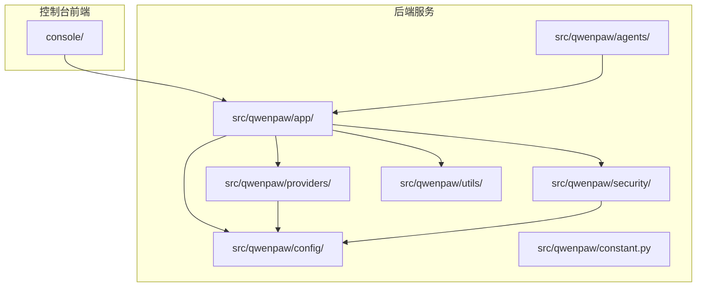
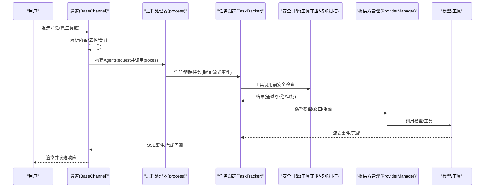
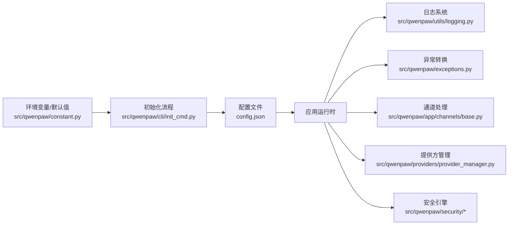
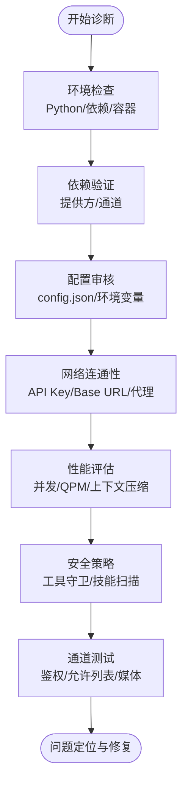

# 故障排除指南

<cite>
**本文引用的文件**
- [README.md](file://README.md)
- [CONTRIBUTING.md](file://CONTRIBUTING.md)
- [SECURITY.md](file://SECURITY.md)
- [src/qwenpaw/utils/logging.py](file://src/qwenpaw/utils/logging.py)
- [src/qwenpaw/exceptions.py](file://src/qwenpaw/exceptions.py)
- [src/qwenpaw/config/config.py](file://src/qwenpaw/config/config.py)
- [src/qwenpaw/constant.py](file://src/qwenpaw/constant.py)
- [src/qwenpaw/cli/init_cmd.py](file://src/qwenpaw/cli/init_cmd.py)
- [src/qwenpaw/app/channels/base.py](file://src/qwenpaw/app/channels/base.py)
- [src/qwenpaw/providers/provider_manager.py](file://src/qwenpaw/providers/provider_manager.py)
- [src/qwenpaw/security/tool_guard/engine.py](file://src/qwenpaw/security/tool_guard/engine.py)
- [src/qwenpaw/security/skill_scanner/scanner.py](file://src/qwenpaw/security/skill_scanner/scanner.py)
</cite>

## 目录
1. [简介](#简介)
2. [项目结构](#项目结构)
3. [核心组件](#核心组件)
4. [架构总览](#架构总览)
5. [详细组件分析](#详细组件分析)
6. [依赖关系分析](#依赖关系分析)
7. [性能考虑](#性能考虑)
8. [故障排除指南](#故障排除指南)
9. [结论](#结论)
10. [附录](#附录)

## 简介
本指南面向运维与开发者，系统化梳理 QwenPaw 在安装、配置、运行、网络与性能等方面的常见问题与解决路径，并提供日志分析、调试技巧、诊断流程、渠道集成与技能执行错误的定位方法，以及紧急情况处理与数据恢复建议。

## 项目结构
QwenPaw 采用前后端分离与多模块协作的架构：前端控制台位于 console/，后端服务位于 src/qwenpaw/，包含通道（channels）、模型提供方（providers）、安全（security）、工作区（workspace）等子系统；部署与打包脚本在 scripts/ 与 deploy/。

图示来源
- [src/qwenpaw/app/channels/base.py:1-120](file://src/qwenpaw/app/channels/base.py#L1-L120)
- [src/qwenpaw/providers/provider_manager.py:1-120](file://src/qwenpaw/providers/provider_manager.py#L1-L120)
- [src/qwenpaw/config/config.py:1-120](file://src/qwenpaw/config/config.py#L1-L120)
- [src/qwenpaw/constant.py:1-120](file://src/qwenpaw/constant.py#L1-L120)

章节来源
- [README.md:104-187](file://README.md#L104-L187)
- [src/qwenpaw/constant.py:89-120](file://src/qwenpaw/constant.py#L89-L120)

## 核心组件
- 日志与调试：统一日志初始化、彩色输出、文件轮转与过滤器，便于快速定位问题。
- 异常体系：将外部服务与模型调用异常转换为统一的运行时异常，便于上层捕获与提示。
- 配置系统：集中管理通道、心跳、运行参数、嵌入与上下文压缩、工具结果压缩等配置。
- 提供方管理：内置多家云模型与本地模型提供方，支持动态切换与连接探测。
- 安全机制：工具守卫与技能扫描，降低误用与恶意风险。
- 通道抽象：统一消息输入/输出契约，屏蔽不同平台差异。

章节来源
- [src/qwenpaw/utils/logging.py:121-202](file://src/qwenpaw/utils/logging.py#L121-L202)
- [src/qwenpaw/exceptions.py:165-254](file://src/qwenpaw/exceptions.py#L165-L254)
- [src/qwenpaw/config/config.py:208-280](file://src/qwenpaw/config/config.py#L208-L280)
- [src/qwenpaw/providers/provider_manager.py:670-750](file://src/qwenpaw/providers/provider_manager.py#L670-L750)
- [src/qwenpaw/security/tool_guard/engine.py:53-130](file://src/qwenpaw/security/tool_guard/engine.py#L53-L130)
- [src/qwenpaw/security/skill_scanner/scanner.py:76-140](file://src/qwenpaw/security/skill_scanner/scanner.py#L76-L140)

## 架构总览
下图展示从用户请求到响应的关键链路，涵盖通道接入、消息渲染、任务跟踪、工具调用与安全校验。

图示来源
- [src/qwenpaw/app/channels/base.py:440-536](file://src/qwenpaw/app/channels/base.py#L440-L536)
- [src/qwenpaw/providers/provider_manager.py:788-800](file://src/qwenpaw/providers/provider_manager.py#L788-L800)
- [src/qwenpaw/security/tool_guard/engine.py:169-227](file://src/qwenpaw/security/tool_guard/engine.py#L169-L227)

## 详细组件分析

### 日志与调试
- 日志初始化：仅输出项目命名空间日志，避免第三方库噪声；支持颜色输出与路径简化。
- 文件输出：按平台选择简单文件句柄或轮转文件句柄，自动去重与幂等添加。
- 过滤器：可抑制特定访问日志路径片段，降低噪音。
- 建议：生产环境提升日志级别，开启文件输出，结合时间戳与行号定位问题。

章节来源
- [src/qwenpaw/utils/logging.py:121-202](file://src/qwenpaw/utils/logging.py#L121-L202)

### 异常与错误转换
- 统一异常：将模型相关异常映射为运行时异常，保留原始类型与消息，便于前端/控制台友好提示。
- 关键场景：鉴权失败、配额超限、超时、上下文过长、未知错误等。
- 建议：捕获统一异常类型，记录 details 并向用户反馈。

章节来源
- [src/qwenpaw/exceptions.py:165-254](file://src/qwenpaw/exceptions.py#L165-L254)

### 配置系统与运行参数
- 通道配置：各平台（如钉钉、飞书、Discord、Telegram 等）独立配置项，含鉴权、媒体目录、策略等。
- 心跳与活跃时段：可配置周期与活跃窗口，避免非工作时间打扰。
- 运行参数：最大迭代次数、并发请求数、QPM、退避重试、上下文压缩阈值、工具结果压缩等。
- 建议：根据模型与网络状况调整并发与重试，避免触发上游限流。

章节来源
- [src/qwenpaw/config/config.py:208-280](file://src/qwenpaw/config/config.py#L208-L280)
- [src/qwenpaw/config/config.py:453-607](file://src/qwenpaw/config/config.py#L453-L607)

### 提供方管理与模型路由
- 内置提供方：DashScope、OpenAI、Azure OpenAI、Anthropic、Gemini、Ollama、LM Studio 等。
- 动态加载：支持插件/自定义提供方，持久化存储于专用目录。
- 连接探测：部分提供方支持连接检查，减少无效配置导致的错误。
- 建议：优先使用已知可用的提供方与模型，确保 API Key 与 Base URL 正确。

章节来源
- [src/qwenpaw/providers/provider_manager.py:463-664](file://src/qwenpaw/providers/provider_manager.py#L463-L664)
- [src/qwenpaw/providers/provider_manager.py:788-800](file://src/qwenpaw/providers/provider_manager.py#L788-L800)

### 安全机制：工具守卫与技能扫描
- 工具守卫：对工具调用参数进行规则与路径检查，支持动态启用/禁用与重载。
- 技能扫描：遍历技能包文件，基于模式分析与策略判定风险等级。
- 建议：默认启用工具守卫与技能扫描，严格限制敏感工具与路径。

章节来源
- [src/qwenpaw/security/tool_guard/engine.py:53-130](file://src/qwenpaw/security/tool_guard/engine.py#L53-L130)
- [src/qwenpaw/security/skill_scanner/scanner.py:76-140](file://src/qwenpaw/security/skill_scanner/scanner.py#L76-L140)

### 通道抽象与消息处理
- 统一契约：原生负载解析为内容块（文本/图片/音频/文件），构建 AgentRequest。
- 去抖与合并：针对无文本内容进行缓冲合并，避免重复/碎片消息。
- 会话与任务：按会话隔离，结合任务跟踪实现取消与事件流。
- 建议：检查通道鉴权、允许列表、提及策略与媒体目录权限。

章节来源
- [src/qwenpaw/app/channels/base.py:128-180](file://src/qwenpaw/app/channels/base.py#L128-L180)
- [src/qwenpaw/app/channels/base.py:374-430](file://src/qwenpaw/app/channels/base.py#L374-L430)
- [src/qwenpaw/app/channels/base.py:659-758](file://src/qwenpaw/app/channels/base.py#L659-L758)

## 依赖关系分析
- 环境变量与默认值：通过常量模块集中加载与回退，保证兼容性与一致性。
- CLI 初始化：引导用户完成工作区、配置、提供方、技能与环境变量配置。
- 配置持久化：config.json 与 providers.json 等文件承载运行期配置。
- 安全边界：工具守卫与技能扫描作为信任边界内的安全基线。

图示来源
- [src/qwenpaw/constant.py:12-87](file://src/qwenpaw/constant.py#L12-L87)
- [src/qwenpaw/cli/init_cmd.py:138-230](file://src/qwenpaw/cli/init_cmd.py#L138-L230)
- [src/qwenpaw/config/config.py:1-120](file://src/qwenpaw/config/config.py#L1-L120)
- [src/qwenpaw/utils/logging.py:121-202](file://src/qwenpaw/utils/logging.py#L121-L202)
- [src/qwenpaw/exceptions.py:165-254](file://src/qwenpaw/exceptions.py#L165-L254)
- [src/qwenpaw/app/channels/base.py:1-120](file://src/qwenpaw/app/channels/base.py#L1-L120)
- [src/qwenpaw/providers/provider_manager.py:670-750](file://src/qwenpaw/providers/provider_manager.py#L670-L750)
- [src/qwenpaw/security/tool_guard/engine.py:53-130](file://src/qwenpaw/security/tool_guard/engine.py#L53-L130)
- [src/qwenpaw/security/skill_scanner/scanner.py:76-140](file://src/qwenpaw/security/skill_scanner/scanner.py#L76-L140)

## 性能考虑
- 并发与限流：合理设置并发数与 QPM，避免上游 429；必要时启用退避与抖动。
- 上下文压缩：根据 max_input_length 与保留比例动态压缩，减少 token 使用。
- 工具结果压缩：对旧/近期工具结果设定字节阈值与保留天数，降低 I/O 压力。
- 日志级别：生产关闭 debug，避免磁盘写放大；必要时开启文件输出以减轻 stdout 压力。
- 本地模型：优先使用本地提供方，减少网络往返与带宽占用。

章节来源
- [src/qwenpaw/config/config.py:453-607](file://src/qwenpaw/config/config.py#L453-L607)
- [src/qwenpaw/constant.py:220-283](file://src/qwenpaw/constant.py#L220-L283)

## 故障排除指南

### 一、安装与启动问题
- 症状
  - 启动后无法打开控制台或页面空白
  - 安装脚本在受限网络/企业防火墙下失败
  - Windows 企业版 Constrained Language Mode 导致脚本无法写入环境变量
- 排查步骤
  - 确认工作目录与配置文件存在，查看初始化流程是否成功
  - 检查端口占用与容器网络映射（Docker）
  - 在受限网络中使用代理或离线安装方式
  - Windows 下手动配置 PATH 并重新执行安装脚本
- 参考
  - [README.md:122-187](file://README.md#L122-L187)
  - [README.md:230-272](file://README.md#L230-L272)
  - [README.md:158-180](file://README.md#L158-L180)

章节来源
- [README.md:122-187](file://README.md#L122-L187)
- [README.md:230-272](file://README.md#L230-L272)
- [README.md:158-180](file://README.md#L158-L180)

### 二、配置错误
- 症状
  - 控制台显示“未配置模型/提供方”
  - 通道无法接收消息或鉴权失败
  - 心跳未按预期执行
- 排查步骤
  - 使用初始化命令生成默认配置与心跳查询文件
  - 校验 config.json 中提供方与通道配置项是否正确
  - 检查环境变量（如 API Key）是否生效
  - 确认通道鉴权参数（Token/AppID/Secret）与媒体目录权限
- 参考
  - [src/qwenpaw/cli/init_cmd.py:138-230](file://src/qwenpaw/cli/init_cmd.py#L138-L230)
  - [src/qwenpaw/config/config.py:208-280](file://src/qwenpaw/config/config.py#L208-L280)
  - [src/qwenpaw/constant.py:12-87](file://src/qwenpaw/constant.py#L12-L87)

章节来源
- [src/qwenpaw/cli/init_cmd.py:138-230](file://src/qwenpaw/cli/init_cmd.py#L138-L230)
- [src/qwenpaw/config/config.py:208-280](file://src/qwenpaw/config/config.py#L208-L280)
- [src/qwenpaw/constant.py:12-87](file://src/qwenpaw/constant.py#L12-L87)

### 三、运行时异常
- 症状
  - 模型调用报错（鉴权失败/配额超限/超时/上下文过长）
  - 通道通信异常（鉴权/网络/权限）
  - 技能启用后报错或被拒绝
- 排查步骤
  - 捕获统一异常类型，查看 details 中的原始错误与状态码
  - 根据状态码映射判断具体原因（401/403、429、超时、上下文过长）
  - 检查通道错误详情中的 channel 名称与会话 ID
  - 审核工具调用参数与路径，确认是否命中工具守卫规则
- 参考
  - [src/qwenpaw/exceptions.py:165-254](file://src/qwenpaw/exceptions.py#L165-L254)
  - [src/qwenpaw/app/channels/base.py:524-536](file://src/qwenpaw/app/channels/base.py#L524-L536)
  - [src/qwenpaw/security/tool_guard/engine.py:169-227](file://src/qwenpaw/security/tool_guard/engine.py#L169-L227)

章节来源
- [src/qwenpaw/exceptions.py:165-254](file://src/qwenpaw/exceptions.py#L165-L254)
- [src/qwenpaw/app/channels/base.py:524-536](file://src/qwenpaw/app/channels/base.py#L524-L536)
- [src/qwenpaw/security/tool_guard/engine.py:169-227](file://src/qwenpaw/security/tool_guard/engine.py#L169-L227)

### 四、网络连接问题
- 症状
  - 无法访问模型提供方或本地模型服务
  - Docker 容器内 localhost 指向容器自身
- 排查步骤
  - 校验 API Key 与 Base URL；必要时使用代理或更换提供方
  - Docker 场景下使用 host.docker.internal 或 host 网络模式
  - 检查防火墙/安全组放通端口
- 参考
  - [README.md:246-270](file://README.md#L246-L270)
  - [src/qwenpaw/providers/provider_manager.py:623-641](file://src/qwenpaw/providers/provider_manager.py#L623-L641)

章节来源
- [README.md:246-270](file://README.md#L246-L270)
- [src/qwenpaw/providers/provider_manager.py:623-641](file://src/qwenpaw/providers/provider_manager.py#L623-L641)

### 五、性能问题
- 症状
  - 响应延迟高、CPU 占用高、磁盘 I/O 抖动
- 排查步骤
  - 降低并发与 QPM，启用退避与抖动
  - 开启上下文压缩与工具结果压缩，减少历史长度
  - 生产环境降低日志级别，避免 debug 输出
  - 本地模型优先，减少网络往返
- 参考
  - [src/qwenpaw/config/config.py:453-607](file://src/qwenpaw/config/config.py#L453-L607)
  - [src/qwenpaw/constant.py:220-283](file://src/qwenpaw/constant.py#L220-L283)
  - [src/qwenpaw/utils/logging.py:121-202](file://src/qwenpaw/utils/logging.py#L121-L202)

章节来源
- [src/qwenpaw/config/config.py:453-607](file://src/qwenpaw/config/config.py#L453-L607)
- [src/qwenpaw/constant.py:220-283](file://src/qwenpaw/constant.py#L220-L283)
- [src/qwenpaw/utils/logging.py:121-202](file://src/qwenpaw/utils/logging.py#L121-L202)

### 六、渠道集成问题
- 认证失败
  - 检查各平台 AppID/Secret/Token 是否正确
  - 确认回调地址与平台配置一致
- 消息接收异常
  - 校验允许列表/群聊/私聊策略与提及要求
  - 检查媒体目录权限与大小限制
- 会话管理
  - 确认 session_id 生成规则与去抖合并逻辑
  - 查看任务跟踪日志，避免重复处理
- 参考
  - [src/qwenpaw/app/channels/base.py:283-318](file://src/qwenpaw/app/channels/base.py#L283-L318)
  - [src/qwenpaw/app/channels/base.py:659-758](file://src/qwenpaw/app/channels/base.py#L659-L758)

章节来源
- [src/qwenpaw/app/channels/base.py:283-318](file://src/qwenpaw/app/channels/base.py#L283-L318)
- [src/qwenpaw/app/channels/base.py:659-758](file://src/qwenpaw/app/channels/base.py#L659-L758)

### 七、技能执行错误
- 症状
  - 报告“技能不安全”或被拒绝
  - 执行过程中抛出异常
- 排查步骤
  - 使用技能扫描器检查风险项与严重等级
  - 审核工具调用参数与路径，必要时调整工具守卫策略
  - 逐步启用/禁用技能，定位具体技能
- 参考
  - [src/qwenpaw/security/skill_scanner/scanner.py:148-242](file://src/qwenpaw/security/skill_scanner/scanner.py#L148-L242)
  - [src/qwenpaw/security/tool_guard/engine.py:169-227](file://src/qwenpaw/security/tool_guard/engine.py#L169-L227)

章节来源
- [src/qwenpaw/security/skill_scanner/scanner.py:148-242](file://src/qwenpaw/security/skill_scanner/scanner.py#L148-L242)
- [src/qwenpaw/security/tool_guard/engine.py:169-227](file://src/qwenpaw/security/tool_guard/engine.py#L169-L227)

### 八、紧急情况与数据恢复
- 紧急处理
  - 立即降低并发与 QPM，临时关闭高风险技能
  - 切换到本地提供方或降级模型
  - 检查并修复网络/鉴权配置
- 数据恢复
  - 备份工作目录与秘密目录（config.json、providers.json、媒体与记忆文件）
  - Docker 场景使用卷挂载持久化数据
  - 如需重置，删除配置后重新初始化
- 参考
  - [README.md:230-272](file://README.md#L230-L272)
  - [SECURITY.md:143-152](file://SECURITY.md#L143-L152)

章节来源
- [README.md:230-272](file://README.md#L230-L272)
- [SECURITY.md:143-152](file://SECURITY.md#L143-L152)

### 九、日志分析与调试技巧
- 设置日志级别：通过环境变量或代码入口设置日志级别
- 关键信息提取：关注异常 details、状态码、会话 ID、通道名
- 问题定位策略：先检查配置与网络，再定位通道与提供方，最后排查工具与技能
- 参考
  - [src/qwenpaw/utils/logging.py:121-202](file://src/qwenpaw/utils/logging.py#L121-L202)
  - [src/qwenpaw/exceptions.py:165-254](file://src/qwenpaw/exceptions.py#L165-L254)

章节来源
- [src/qwenpaw/utils/logging.py:121-202](file://src/qwenpaw/utils/logging.py#L121-L202)
- [src/qwenpaw/exceptions.py:165-254](file://src/qwenpaw/exceptions.py#L165-L254)

### 十、系统性诊断流程

图示来源
- [src/qwenpaw/constant.py:12-87](file://src/qwenpaw/constant.py#L12-L87)
- [src/qwenpaw/config/config.py:208-280](file://src/qwenpaw/config/config.py#L208-L280)
- [src/qwenpaw/providers/provider_manager.py:788-800](file://src/qwenpaw/providers/provider_manager.py#L788-L800)
- [src/qwenpaw/security/tool_guard/engine.py:53-130](file://src/qwenpaw/security/tool_guard/engine.py#L53-L130)
- [src/qwenpaw/security/skill_scanner/scanner.py:76-140](file://src/qwenpaw/security/skill_scanner/scanner.py#L76-L140)
- [src/qwenpaw/app/channels/base.py:283-318](file://src/qwenpaw/app/channels/base.py#L283-L318)

## 结论
通过规范化的安装与初始化、严格的配置与网络校验、完善的日志与异常体系、以及工具守卫与技能扫描的安全基线，QwenPaw 能够在复杂环境中稳定运行。遇到问题时，遵循本文提供的诊断流程与排障步骤，通常可在较短时间内定位并解决问题。

## 附录
- 社区支持与反馈
  - GitHub Issues：用于报告缺陷与功能请求
  - GitHub Discussions：交流想法与任务认领
  - 钉钉/Discord：实时沟通渠道
- 安全披露
  - 私有渠道提交漏洞，提供复现步骤与影响范围
- 贡献指南
  - 提交前确保本地门禁通过，文档同步更新

章节来源
- [CONTRIBUTING.md:229-236](file://CONTRIBUTING.md#L229-L236)
- [SECURITY.md:5-36](file://SECURITY.md#L5-L36)
- [README.md:482-487](file://README.md#L482-L487)