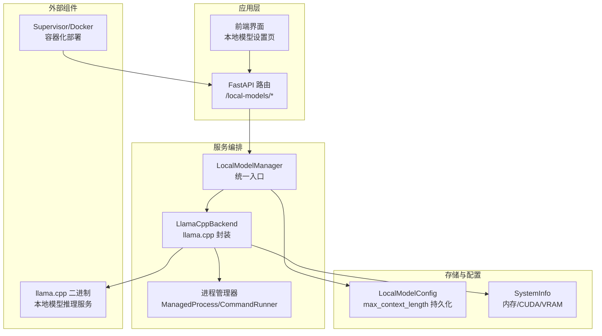
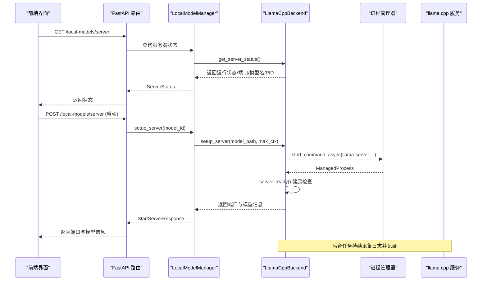
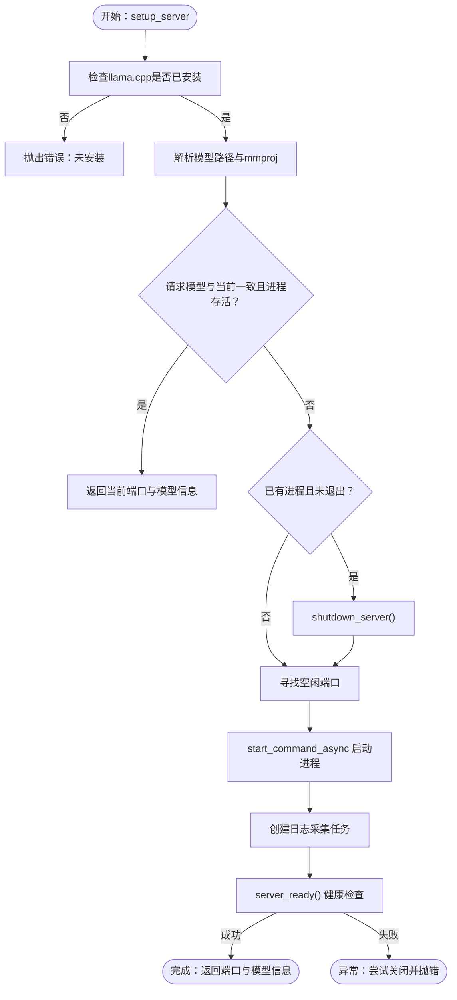
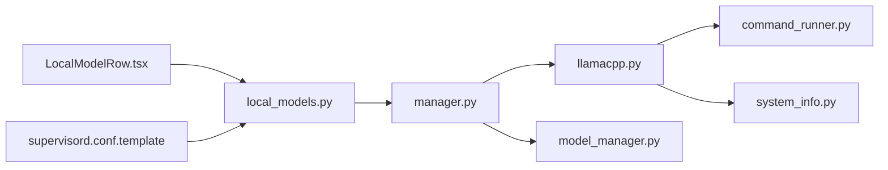
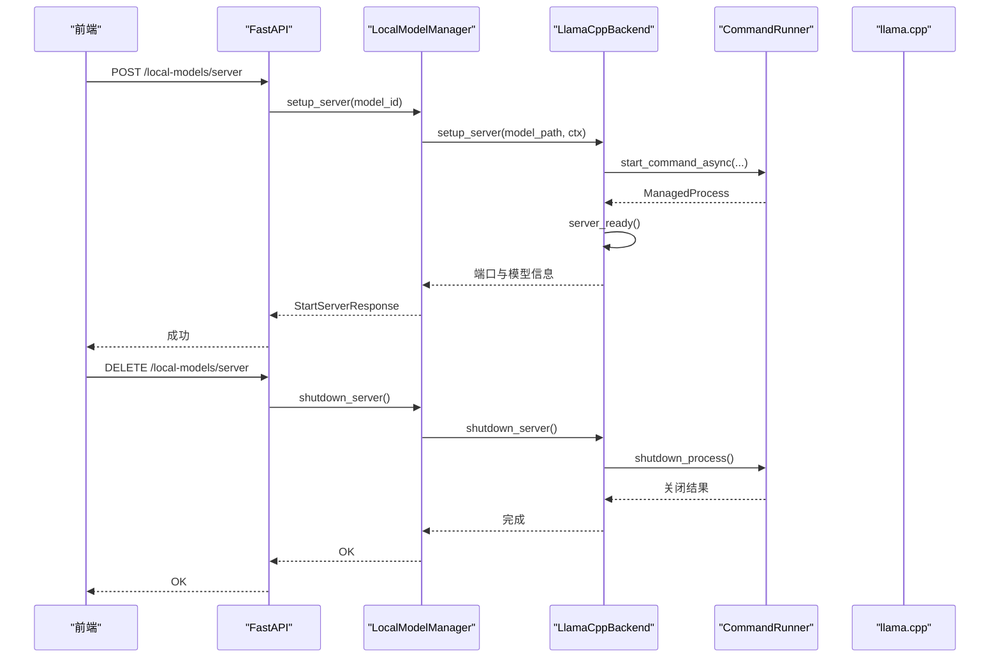
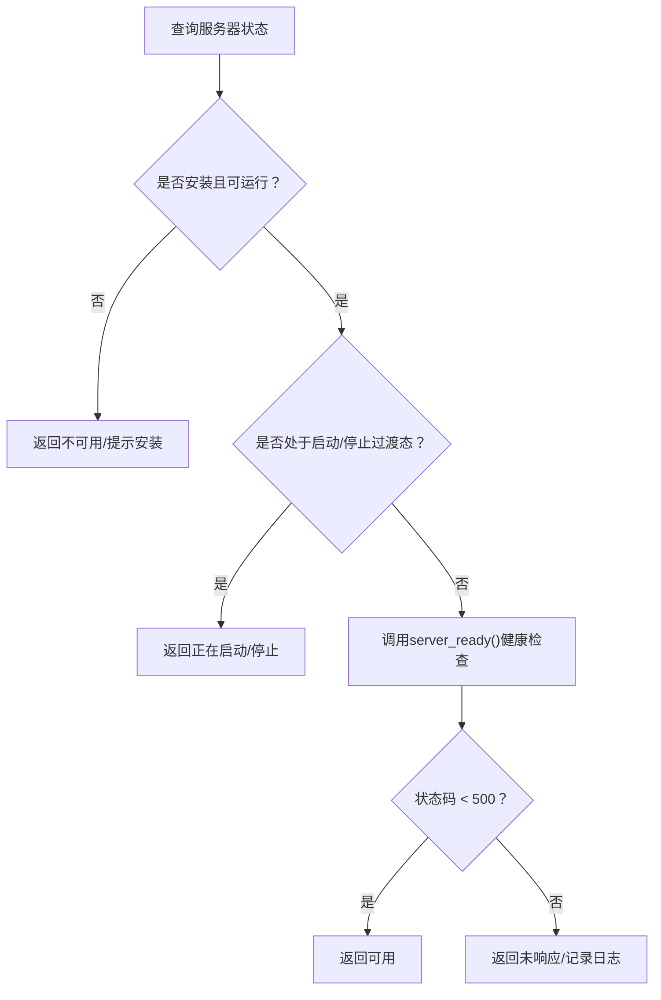

# 服务器管理

<cite>
**本文引用的文件**
- [src/qwenpaw/local_models/llamacpp.py](file://src/qwenpaw/local_models/llamacpp.py)
- [src/qwenpaw/local_models/manager.py](file://src/qwenpaw/local_models/manager.py)
- [src/qwenpaw/local_models/model_manager.py](file://src/qwenpaw/local_models/model_manager.py)
- [src/qwenpaw/app/routers/local_models.py](file://src/qwenpaw/app/routers/local_models.py)
- [src/qwenpaw/utils/command_runner.py](file://src/qwenpaw/utils/command_runner.py)
- [src/qwenpaw/utils/system_info.py](file://src/qwenpaw/utils/system_info.py)
- [src/qwenpaw/utils/logging.py](file://src/qwenpaw/utils/logging.py)
- [src/qwenpaw/cli/process_utils.py](file://src/qwenpaw/cli/process_utils.py)
- [src/qwenpaw/cli/shutdown_cmd.py](file://src/qwenpaw/cli/shutdown_cmd.py)
- [deploy/config/supervisord.conf.template](file://deploy/config/supervisord.conf.template)
- [deploy/entrypoint.sh](file://deploy/entrypoint.sh)
- [console/src/pages/Settings/Models/components/modals/local-models/LocalModelRow.tsx](file://console/src/pages/Settings/Models/components/modals/local-models/LocalModelRow.tsx)
</cite>

## 目录
1. [简介](#简介)
2. [项目结构](#项目结构)
3. [核心组件](#核心组件)
4. [架构总览](#架构总览)
5. [详细组件分析](#详细组件分析)
6. [依赖分析](#依赖分析)
7. [性能考虑](#性能考虑)
8. [故障排查指南](#故障排查指南)
9. [结论](#结论)
10. [附录](#附录)

## 简介
本文件面向QwenPaw的本地模型服务器管理，聚焦于llama.cpp服务器的启动与停止流程、进程与资源管理、状态监控与健康检查、自动重启机制、配置参数（端口绑定、上下文长度等）、生命周期管理（优雅关闭与强制终止）、性能监控与日志分析、故障诊断与恢复策略，以及多实例与负载均衡的实践建议。内容以代码为依据，辅以图示帮助理解。

## 项目结构
围绕本地模型服务器管理的关键模块如下：
- 后端服务与进程管理：llama.cpp后端封装、进程启动/关闭、健康检查、日志采集
- 服务器生命周期与配置：本地运行时配置、最大上下文长度持久化、下载与模型管理
- API接口层：FastAPI路由，提供服务器状态查询、启动/停止、更新检测、下载进度等
- 命令行与系统工具：进程树扫描、端口解析、强制终止、Supervisor容器化部署
- 日志与系统信息：统一日志格式、文件落盘、平台差异处理、系统硬件信息采集

图表来源
- [src/qwenpaw/app/routers/local_models.py](file://src/qwenpaw/app/routers/local_models.py)
- [src/qwenpaw/local_models/manager.py](file://src/qwenpaw/local_models/manager.py)
- [src/qwenpaw/local_models/llamacpp.py](file://src/qwenpaw/local_models/llamacpp.py)
- [src/qwenpaw/utils/command_runner.py](file://src/qwenpaw/utils/command_runner.py)
- [src/qwenpaw/utils/system_info.py](file://src/qwenpaw/utils/system_info.py)
- [deploy/config/supervisord.conf.template](file://deploy/config/supervisord.conf.template)

章节来源
- [src/qwenpaw/app/routers/local_models.py](file://src/qwenpaw/app/routers/local_models.py)
- [src/qwenpaw/local_models/manager.py](file://src/qwenpaw/local_models/manager.py)
- [src/qwenpaw/local_models/llamacpp.py](file://src/qwenpaw/local_models/llamacpp.py)
- [src/qwenpaw/utils/command_runner.py](file://src/qwenpaw/utils/command_runner.py)
- [src/qwenpaw/utils/system_info.py](file://src/qwenpaw/utils/system_info.py)
- [deploy/config/supervisord.conf.template](file://deploy/config/supervisord.conf.template)

## 核心组件
- LlamaCppBackend：封装llama.cpp二进制安装、下载、进程启动、健康检查、日志采集、优雅关闭与异常恢复
- LocalModelManager：对外统一入口，负责配置持久化、下载控制、服务器生命周期锁、与ProviderManager联动
- ModelManager：本地模型仓库管理、推荐模型选择、下载进度追踪、源站探测与回退
- FastAPI路由：提供服务器状态查询、启动/停止、更新检测、下载进度、配置读写等接口
- 进程管理与命令执行：统一的ManagedProcess、start_command_async、shutdown_process、进程树扫描与强制终止
- 日志与系统信息：统一日志格式、文件落盘、ANSI支持、系统硬件信息采集

章节来源
- [src/qwenpaw/local_models/llamacpp.py](file://src/qwenpaw/local_models/llamacpp.py)
- [src/qwenpaw/local_models/manager.py](file://src/qwenpaw/local_models/manager.py)
- [src/qwenpaw/local_models/model_manager.py](file://src/qwenpaw/local_models/model_manager.py)
- [src/qwenpaw/app/routers/local_models.py](file://src/qwenpaw/app/routers/local_models.py)
- [src/qwenpaw/utils/command_runner.py](file://src/qwenpaw/utils/command_runner.py)
- [src/qwenpaw/utils/system_info.py](file://src/qwenpaw/utils/system_info.py)
- [src/qwenpaw/utils/logging.py](file://src/qwenpaw/utils/logging.py)

## 架构总览
下图展示从API到进程管理再到llama.cpp服务的调用链路，以及健康检查与日志采集路径。

图表来源
- [src/qwenpaw/app/routers/local_models.py](file://src/qwenpaw/app/routers/local_models.py)
- [src/qwenpaw/local_models/manager.py](file://src/qwenpaw/local_models/manager.py)
- [src/qwenpaw/local_models/llamacpp.py](file://src/qwenpaw/local_models/llamacpp.py)
- [src/qwenpaw/utils/command_runner.py](file://src/qwenpaw/utils/command_runner.py)

## 详细组件分析

### 组件A：LlamaCppBackend（llama.cpp服务器封装）
职责与能力
- 安装检查与可安装性检查（含macOS版本要求）
- 下载进度追踪与错误格式化
- 服务器进程启动（命令行参数：host/port/model/alias/gpu-layers/ctx-size/mmproj）
- 健康检查（/health轮询，超时控制）
- 日志采集（后台任务读取stdout并记录）
- 优雅关闭与强制终止（分平台策略）
- 过渡态标记（避免并发启动/停止）

关键流程图：服务器启动与健康检查

图表来源
- [src/qwenpaw/local_models/llamacpp.py](file://src/qwenpaw/local_models/llamacpp.py)

章节来源
- [src/qwenpaw/local_models/llamacpp.py](file://src/qwenpaw/local_models/llamacpp.py)

### 组件B：LocalModelManager（统一入口与配置）
职责与能力
- 服务器生命周期锁，确保并发安全
- 配置持久化（max_context_length），支持异步写入
- llama.cpp下载与更新检测
- 服务器状态查询、就绪检查、下载进度查询
- 与ProviderManager联动，动态更新本地Provider配置

章节来源
- [src/qwenpaw/local_models/manager.py](file://src/qwenpaw/local_models/manager.py)

### 组件C：ModelManager（模型下载与推荐）
职责与能力
- 推荐模型列表（基于GPU/内存容量）
- 多源下载（HF/ModelScope），自动探测可达源
- 下载进度追踪、临时目录清理、最终归档
- 模型根目录识别、大小统计、GGUF校验

章节来源
- [src/qwenpaw/local_models/model_manager.py](file://src/qwenpaw/local_models/model_manager.py)

### 组件D：FastAPI路由（本地模型API）
职责与能力
- 服务器可用性查询（安装性/安装状态/就绪状态）
- llama.cpp更新检测
- 服务器启动/停止
- 下载进度查询与取消
- 本地模型列表、下载与取消
- 配置读取与更新（max_context_length/generate_kwargs）

章节来源
- [src/qwenpaw/app/routers/local_models.py](file://src/qwenpaw/app/routers/local_models.py)

### 组件E：进程管理与命令执行（跨平台）
职责与能力
- 统一的ManagedProcess封装，支持进程组（POSIX）与线程模式（Windows）
- start_command_async：在Windows事件循环不支持async子进程时回退至线程
- shutdown_process/shutdown_process_sync：先SIGTERM，超时后SIGKILL；支持进程组信号
- _wait_for_process_exit/_wait_for_process_exit_async：等待进程退出或超时
- 进程树扫描与强制终止（Windows使用taskkill，Unix使用pgrep/kill）

章节来源
- [src/qwenpaw/utils/command_runner.py](file://src/qwenpaw/utils/command_runner.py)
- [src/qwenpaw/cli/process_utils.py](file://src/qwenpaw/cli/process_utils.py)
- [src/qwenpaw/cli/shutdown_cmd.py](file://src/qwenpaw/cli/shutdown_cmd.py)

### 组件F：日志与系统信息
职责与能力
- 日志格式化（彩色/纯文本）、按项目命名空间过滤、文件处理器（Windows/Linux简单文件，macOS旋转文件）
- 系统信息采集（OS/架构/CUDA/内存/显存），用于推荐模型与环境判断

章节来源
- [src/qwenpaw/utils/logging.py](file://src/qwenpaw/utils/logging.py)
- [src/qwenpaw/utils/system_info.py](file://src/qwenpaw/utils/system_info.py)

## 依赖分析
- LlamaCppBackend依赖命令执行与系统信息模块，负责进程生命周期与健康检查
- LocalModelManager聚合LlamaCppBackend与ModelManager，提供统一API与配置持久化
- FastAPI路由依赖LocalModelManager进行业务编排
- Supervisor模板与入口脚本提供容器化部署与进程管理

图表来源
- [src/qwenpaw/app/routers/local_models.py](file://src/qwenpaw/app/routers/local_models.py)
- [src/qwenpaw/local_models/manager.py](file://src/qwenpaw/local_models/manager.py)
- [src/qwenpaw/local_models/llamacpp.py](file://src/qwenpaw/local_models/llamacpp.py)
- [src/qwenpaw/local_models/model_manager.py](file://src/qwenpaw/local_models/model_manager.py)
- [src/qwenpaw/utils/command_runner.py](file://src/qwenpaw/utils/command_runner.py)
- [src/qwenpaw/utils/system_info.py](file://src/qwenpaw/utils/system_info.py)
- [console/src/pages/Settings/Models/components/modals/local-models/LocalModelRow.tsx](file://console/src/pages/Settings/Models/components/modals/local-models/LocalModelRow.tsx)
- [deploy/config/supervisord.conf.template](file://deploy/config/supervisord.conf.template)

章节来源
- [src/qwenpaw/app/routers/local_models.py](file://src/qwenpaw/app/routers/local_models.py)
- [src/qwenpaw/local_models/manager.py](file://src/qwenpaw/local_models/manager.py)
- [src/qwenpaw/local_models/llamacpp.py](file://src/qwenpaw/local_models/llamacpp.py)
- [src/qwenpaw/local_models/model_manager.py](file://src/qwenpaw/local_models/model_manager.py)
- [src/qwenpaw/utils/command_runner.py](file://src/qwenpaw/utils/command_runner.py)
- [src/qwenpaw/utils/system_info.py](file://src/qwenpaw/utils/system_info.py)
- [console/src/pages/Settings/Models/components/modals/local-models/LocalModelRow.tsx](file://console/src/pages/Settings/Models/components/modals/local-models/LocalModelRow.tsx)
- [deploy/config/supervisord.conf.template](file://deploy/config/supervisord.conf.template)

## 性能考虑
- 上下文长度与显存占用：通过配置max_context_length影响推理上下文窗口，需结合GPU/系统内存容量评估
- 进程与I/O：后台日志采集采用异步读取，避免阻塞主事件循环；健康检查采用短超时轮询，降低延迟
- 平台差异：Windows上使用线程模式启动子进程，避免事件循环限制；POSIX使用进程组信号，便于批量终止
- 推荐模型：根据VRAM/内存自动选择合适规模模型，减少加载失败与OOM风险

章节来源
- [src/qwenpaw/local_models/manager.py](file://src/qwenpaw/local_models/manager.py)
- [src/qwenpaw/local_models/model_manager.py](file://src/qwenpaw/local_models/model_manager.py)
- [src/qwenpaw/utils/system_info.py](file://src/qwenpaw/utils/system_info.py)
- [src/qwenpaw/utils/command_runner.py](file://src/qwenpaw/utils/command_runner.py)

## 故障排查指南
常见问题与定位步骤
- 服务器未就绪
  - 检查健康检查URL与端口：/health轮询，超时默认120秒
  - 查看后台日志采集任务是否正常运行
  - 参考：[健康检查实现](file://src/qwenpaw/local_models/llamacpp.py)
- 进程无法优雅退出
  - 使用shutdown_process/shutdown_process_sync，先SIGTERM后SIGKILL
  - 在Windows上使用taskkill，POSIX使用进程组信号
  - 参考：[进程关闭实现](file://src/qwenpaw/utils/command_runner.py)
- 强制终止进程树
  - 使用CLI shutdown命令，扫描监听端口、前端开发进程、桌面包装进程及Windows祖先包装进程
  - 参考：[进程扫描与终止](file://src/qwenpaw/cli/shutdown_cmd.py)
- 下载失败与网络异常
  - 错误消息格式化包含HTTP状态码与原因，便于快速定位
  - 参考：[下载错误格式化](file://src/qwenpaw/local_models/llamacpp.py)
- 日志分析
  - 统一命名空间与格式化输出，支持彩色/纯文本；文件处理器按平台选择
  - 参考：[日志配置](file://src/qwenpaw/utils/logging.py)

章节来源
- [src/qwenpaw/local_models/llamacpp.py](file://src/qwenpaw/local_models/llamacpp.py)
- [src/qwenpaw/utils/command_runner.py](file://src/qwenpaw/utils/command_runner.py)
- [src/qwenpaw/cli/shutdown_cmd.py](file://src/qwenpaw/cli/shutdown_cmd.py)
- [src/qwenpaw/utils/logging.py](file://src/qwenpaw/utils/logging.py)

## 结论
QwenPaw对本地模型服务器提供了完整的生命周期管理：从安装检查、下载、启动、健康检查、日志采集到优雅关闭与强制终止均有明确实现；通过配置持久化与API编排，用户可在Web界面中便捷地管理本地模型服务。结合Supervisor容器化部署与CLI工具，可满足单机与容器环境下的稳定运行与运维需求。

## 附录

### 服务器启动与停止流程（序列图）

图表来源
- [src/qwenpaw/app/routers/local_models.py](file://src/qwenpaw/app/routers/local_models.py)
- [src/qwenpaw/local_models/manager.py](file://src/qwenpaw/local_models/manager.py)
- [src/qwenpaw/local_models/llamacpp.py](file://src/qwenpaw/local_models/llamacpp.py)
- [src/qwenpaw/utils/command_runner.py](file://src/qwenpaw/utils/command_runner.py)

### 服务器状态监控与健康检查（流程图）

图表来源
- [src/qwenpaw/app/routers/local_models.py](file://src/qwenpaw/app/routers/local_models.py)
- [src/qwenpaw/local_models/llamacpp.py](file://src/qwenpaw/local_models/llamacpp.py)

### 配置参数与持久化
- 最大上下文长度（max_context_length）：影响推理上下文窗口，需结合显存与内存评估
- 生成参数（generate_kwargs）：可通过配置接口传递给ProviderManager
- 配置文件位置：位于默认本地提供者目录下的config.json

章节来源
- [src/qwenpaw/local_models/manager.py](file://src/qwenpaw/local_models/manager.py)
- [src/qwenpaw/app/routers/local_models.py](file://src/qwenpaw/app/routers/local_models.py)

### 生命周期管理（优雅关闭与强制终止）
- 优雅关闭：先发送终止信号，等待进程退出；超时后强制杀死
- 强制终止：跨平台扫描进程树并逐个终止，Windows优先使用taskkill
- atexit钩子：进程退出时尝试同步关闭

章节来源
- [src/qwenpaw/local_models/llamacpp.py](file://src/qwenpaw/local_models/llamacpp.py)
- [src/qwenpaw/utils/command_runner.py](file://src/qwenpaw/utils/command_runner.py)
- [src/qwenpaw/cli/shutdown_cmd.py](file://src/qwenpaw/cli/shutdown_cmd.py)

### 多实例与负载均衡（实践建议）
- 多实例：在同一主机上启动多个llama.cpp实例，分别绑定不同端口，通过Supervisor管理
- 负载均衡：在反向代理层（如Nginx）对多个端口进行轮询或加权
- 健康检查：为每个实例配置独立的健康检查端点，便于探活与故障摘除
- 日志隔离：为每个实例配置独立的日志文件，便于问题定位

章节来源
- [deploy/config/supervisord.conf.template](file://deploy/config/supervisord.conf.template)
- [deploy/entrypoint.sh](file://deploy/entrypoint.sh)

### 前端交互与状态展示
- 前端界面根据服务器状态显示“启动/停止”按钮与禁用逻辑
- 当服务器处于过渡态（启动/停止）时，按钮显示相应提示

章节来源
- [console/src/pages/Settings/Models/components/modals/local-models/LocalModelRow.tsx](file://console/src/pages/Settings/Models/components/modals/local-models/LocalModelRow.tsx)