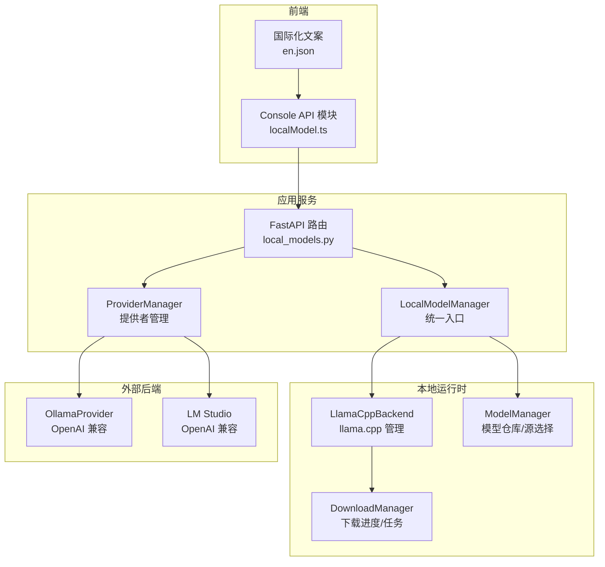
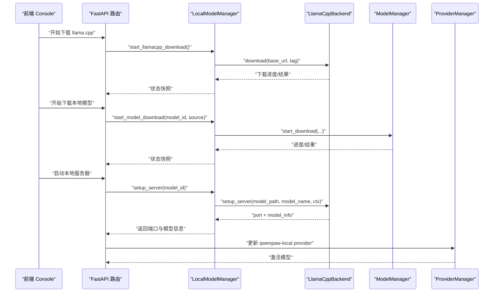
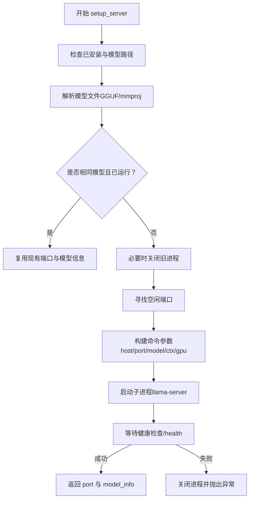
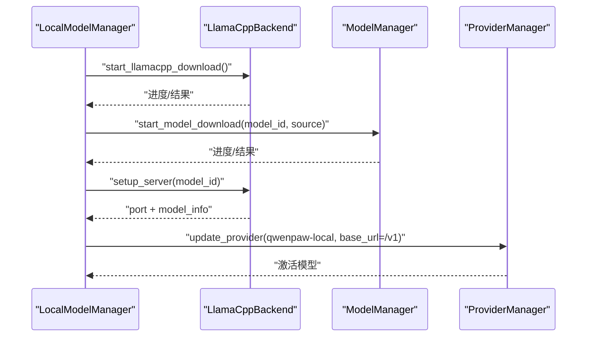
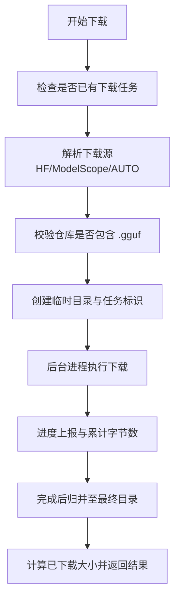
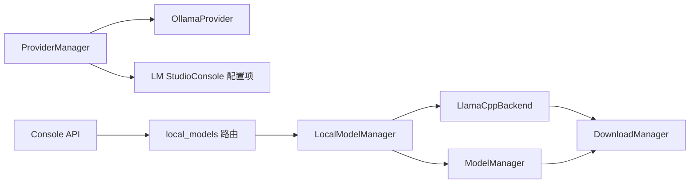

# 本地模型后端支持

<cite>
**本文引用的文件**
- [src/qwenpaw/local_models/llamacpp.py](file://src/qwenpaw/local_models/llamacpp.py)
- [src/qwenpaw/local_models/manager.py](file://src/qwenpaw/local_models/manager.py)
- [src/qwenpaw/local_models/model_manager.py](file://src/qwenpaw/local_models/model_manager.py)
- [src/qwenpaw/local_models/download_manager.py](file://src/qwenpaw/local_models/download_manager.py)
- [src/qwenpaw/providers/ollama_provider.py](file://src/qwenpaw/providers/ollama_provider.py)
- [src/qwenpaw/app/routers/local_models.py](file://src/qwenpaw/app/routers/local_models.py)
- [src/qwenpaw/constant.py](file://src/qwenpaw/constant.py)
- [console/src/api/modules/localModel.ts](file://console/src/api/modules/localModel.ts)
- [console/src/locales/en.json](file://console/src/locales/en.json)
- [README.md](file://README.md)
</cite>

## 目录
1. [简介](#简介)
2. [项目结构](#项目结构)
3. [核心组件](#核心组件)
4. [架构总览](#架构总览)
5. [详细组件分析](#详细组件分析)
6. [依赖分析](#依赖分析)
7. [性能考虑](#性能考虑)
8. [故障排除指南](#故障排除指南)
9. [结论](#结论)
10. [附录](#附录)

## 简介
本文件面向 QwenPaw 的本地模型后端支持，系统性阐述以下内容：
- llama.cpp 后端的实现原理与运行机制（二进制下载、编译产物使用、进程管理、健康检查）
- Ollama 与 LM Studio 的集成方式与配置要点
- 不同后端的性能特征、资源消耗与适用场景
- 后端选择策略与切换机制
- 安装指南、环境要求与兼容性说明
- 配置示例与故障排除方法
- 版本管理与更新机制

## 项目结构
本地模型后端由“嵌入式 llama.cpp 运行时”“模型下载器”“提供者适配层（Ollama/LM Studio）”“API 路由与前端交互”四部分组成，职责清晰、边界明确。

图示来源
- [src/qwenpaw/app/routers/local_models.py:14-454](file://src/qwenpaw/app/routers/local_models.py#L14-L454)
- [src/qwenpaw/local_models/manager.py:33-229](file://src/qwenpaw/local_models/manager.py#L33-L229)
- [src/qwenpaw/local_models/llamacpp.py:51-887](file://src/qwenpaw/local_models/llamacpp.py#L51-L887)
- [src/qwenpaw/local_models/model_manager.py:63-654](file://src/qwenpaw/local_models/model_manager.py#L63-L654)
- [src/qwenpaw/local_models/download_manager.py:1-599](file://src/qwenpaw/local_models/download_manager.py#L1-L599)
- [src/qwenpaw/providers/ollama_provider.py:16-86](file://src/qwenpaw/providers/ollama_provider.py#L16-L86)
- [console/src/api/modules/localModel.ts:44-59](file://console/src/api/modules/localModel.ts#L44-L59)
- [console/src/locales/en.json:700-899](file://console/src/locales/en.json#L700-L899)

章节来源
- [src/qwenpaw/app/routers/local_models.py:1-454](file://src/qwenpaw/app/routers/local_models.py#L1-L454)
- [src/qwenpaw/local_models/manager.py:1-229](file://src/qwenpaw/local_models/manager.py#L1-L229)
- [src/qwenpaw/local_models/llamacpp.py:1-887](file://src/qwenpaw/local_models/llamacpp.py#L1-L887)
- [src/qwenpaw/local_models/model_manager.py:1-654](file://src/qwenpaw/local_models/model_manager.py#L1-L654)
- [src/qwenpaw/local_models/download_manager.py:1-599](file://src/qwenpaw/local_models/download_manager.py#L1-L599)
- [src/qwenpaw/providers/ollama_provider.py:1-86](file://src/qwenpaw/providers/ollama_provider.py#L1-L86)
- [console/src/api/modules/localModel.ts:1-59](file://console/src/api/modules/localModel.ts#L1-L59)
- [console/src/locales/en.json:700-899](file://console/src/locales/en.json#L700-L899)

## 核心组件
- LlamaCppBackend：负责 llama.cpp 可执行文件的检测、下载、解压、安装、进程启动/停止、健康检查、日志采集与版本查询等。
- LocalModelManager：统一入口，协调 llama.cpp 下载与服务器生命周期、模型下载、配置持久化与读取、最大上下文长度等。
- ModelManager：负责推荐模型列表、模型仓库目录结构识别、GGUF 文件校验、多源下载（HF/ModelScope）、进度追踪与取消。
- DownloadManager：统一的后台下载任务控制器，支持进度上报、结果归并、取消与清理。
- OllamaProvider：基于 OpenAI 兼容接口访问本地 Ollama 服务，自动规范化 base_url，屏蔽 /v1 后缀差异。
- FastAPI 路由：对外暴露本地模型与服务器状态查询、下载控制、服务器启停、配置读写等接口。
- 前端模块：通过 Console API 与路由交互，完成下载进度展示、服务器启停、配置修改等操作。

章节来源
- [src/qwenpaw/local_models/llamacpp.py:51-887](file://src/qwenpaw/local_models/llamacpp.py#L51-L887)
- [src/qwenpaw/local_models/manager.py:33-229](file://src/qwenpaw/local_models/manager.py#L33-L229)
- [src/qwenpaw/local_models/model_manager.py:63-654](file://src/qwenpaw/local_models/model_manager.py#L63-L654)
- [src/qwenpaw/local_models/download_manager.py:1-599](file://src/qwenpaw/local_models/download_manager.py#L1-L599)
- [src/qwenpaw/providers/ollama_provider.py:16-86](file://src/qwenpaw/providers/ollama_provider.py#L16-L86)
- [src/qwenpaw/app/routers/local_models.py:1-454](file://src/qwenpaw/app/routers/local_models.py#L1-L454)
- [console/src/api/modules/localModel.ts:44-59](file://console/src/api/modules/localModel.ts#L44-L59)

## 架构总览
下图展示了本地模型后端的端到端调用链路：前端发起请求 → API 路由处理 → 统一管理器协调 → 后端运行时/提供者执行 → 返回状态与结果。

图示来源
- [src/qwenpaw/app/routers/local_models.py:233-337](file://src/qwenpaw/app/routers/local_models.py#L233-L337)
- [src/qwenpaw/local_models/manager.py:119-220](file://src/qwenpaw/local_models/manager.py#L119-L220)
- [src/qwenpaw/local_models/llamacpp.py:216-307](file://src/qwenpaw/local_models/llamacpp.py#L216-L307)
- [src/qwenpaw/local_models/model_manager.py:181-250](file://src/qwenpaw/local_models/model_manager.py#L181-L250)

## 详细组件分析

### Llama.cpp 后端（LlamaCppBackend）
- 功能要点
  - 可执行文件路径解析（Windows/类 Unix 差异）
  - 安装性检查（含 macOS 版本约束）
  - 下载与解压（后台进程 + 进度追踪）
  - 服务器进程管理（启动/停止/重启/过渡态保护）
  - 健康检查（/health 探针）
  - 设备枚举与版本查询
  - 模型文件解析（GGUF 与 mmproj 自动识别）

- 关键流程（启动服务器）

图示来源
- [src/qwenpaw/local_models/llamacpp.py:216-307](file://src/qwenpaw/local_models/llamacpp.py#L216-L307)
- [src/qwenpaw/local_models/llamacpp.py:656-691](file://src/qwenpaw/local_models/llamacpp.py#L656-L691)

章节来源
- [src/qwenpaw/local_models/llamacpp.py:51-887](file://src/qwenpaw/local_models/llamacpp.py#L51-L887)

### 本地模型统一管理（LocalModelManager）
- 功能要点
  - 单例入口，聚合 llama.cpp 与模型下载能力
  - 本地运行时配置持久化（最大上下文长度等）
  - 服务器生命周期锁，避免并发冲突
  - 默认下载源与版本标签管理
  - 与 ProviderManager 协作，动态注册本地模型为可用

- 关键流程（下载与启动）

图示来源
- [src/qwenpaw/local_models/manager.py:119-220](file://src/qwenpaw/local_models/manager.py#L119-L220)
- [src/qwenpaw/app/routers/local_models.py:283-318](file://src/qwenpaw/app/routers/local_models.py#L283-L318)

章节来源
- [src/qwenpaw/local_models/manager.py:33-229](file://src/qwenpaw/local_models/manager.py#L33-L229)

### 模型下载器（ModelManager）
- 功能要点
  - 推荐模型列表（按内存/GPU 显存估算）
  - 多源下载（Hugging Face / ModelScope），自动探测可达性
  - GGUF 文件校验与仓库结构识别
  - 下载进度追踪与取消
  - 临时目录与最终目录的迁移与清理

- 关键流程（下载模型）

图示来源
- [src/qwenpaw/local_models/model_manager.py:181-250](file://src/qwenpaw/local_models/model_manager.py#L181-L250)
- [src/qwenpaw/local_models/model_manager.py:321-372](file://src/qwenpaw/local_models/model_manager.py#L321-L372)

章节来源
- [src/qwenpaw/local_models/model_manager.py:63-654](file://src/qwenpaw/local_models/model_manager.py#L63-L654)

### 下载控制器（DownloadManager）
- 功能要点
  - 进程级下载任务封装（目标函数、进度探针、收尾与清理）
  - 进度追踪器（状态、速度、误差、本地路径）
  - 监控线程与消息队列，统一处理进度与结果
  - 取消与清理，保证资源释放

章节来源
- [src/qwenpaw/local_models/download_manager.py:1-599](file://src/qwenpaw/local_models/download_manager.py#L1-L599)

### Ollama 提供者（OllamaProvider）
- 功能要点
  - 基于 OpenAI 兼容接口访问 Ollama
  - 自动规范化 base_url，剥离或补齐 /v1
  - 通过 OpenAIChatModelCompat 适配生成参数与流式输出
  - 不支持动态添加/删除模型（需在 Ollama 侧维护）

章节来源
- [src/qwenpaw/providers/ollama_provider.py:16-86](file://src/qwenpaw/providers/ollama_provider.py#L16-L86)

### API 路由与前端交互
- 路由要点
  - 本地服务器状态查询、更新检查、下载启停、服务器启停、配置读写
  - 与 ProviderManager 协作，动态注册本地模型为可用
- 前端要点
  - Console API 模块封装本地模型相关请求
  - 国际化文案提供 LM Studio 端点提示与本地运行时说明

章节来源
- [src/qwenpaw/app/routers/local_models.py:1-454](file://src/qwenpaw/app/routers/local_models.py#L1-L454)
- [console/src/api/modules/localModel.ts:44-59](file://console/src/api/modules/localModel.ts#L44-L59)
- [console/src/locales/en.json:700-899](file://console/src/locales/en.json#L700-L899)

## 依赖分析
- 组件耦合
  - LocalModelManager 对 LlamaCppBackend 与 ModelManager 存在强依赖；通过统一入口降低上层复杂度。
  - LlamaCppBackend 依赖系统信息与命令运行工具，确保跨平台可执行文件路径与进程管理。
  - ModelManager 依赖 huggingface_hub 与 modelscope，用于远程仓库元数据与下载。
  - OllamaProvider 依赖 OpenAI 兼容客户端，通过 ProviderManager 注册为可用提供者。
- 外部依赖
  - llama.cpp 二进制（通过下载器获取）
  - Ollama 服务（本地 HTTP 服务）
  - LM Studio 服务（本地 HTTP 服务，需 /v1 兼容端点）

图示来源
- [src/qwenpaw/local_models/manager.py:33-229](file://src/qwenpaw/local_models/manager.py#L33-L229)
- [src/qwenpaw/local_models/llamacpp.py:51-887](file://src/qwenpaw/local_models/llamacpp.py#L51-L887)
- [src/qwenpaw/local_models/model_manager.py:63-654](file://src/qwenpaw/local_models/model_manager.py#L63-L654)
- [src/qwenpaw/providers/ollama_provider.py:16-86](file://src/qwenpaw/providers/ollama_provider.py#L16-L86)
- [src/qwenpaw/app/routers/local_models.py:1-454](file://src/qwenpaw/app/routers/local_models.py#L1-L454)

## 性能考虑
- llama.cpp
  - 使用 GPU 加速时建议优先选择 Ollama 或 LM Studio；若仅使用嵌入式运行时，默认走 CPU。
  - 上下文窗口越大，显存占用越高；可通过最大上下文长度配置减少内存压力。
  - 健康检查超时与端口占用会影响启动时间，建议在空闲端口启动。
- Ollama/LM Studio
  - 作为独立服务，具备更强的资源调度与模型管理能力，适合生产与多模型场景。
  - 通过 /v1 兼容接口与 OpenAI 客户端对接，便于统一编程模型。
- 下载与存储
  - 下载进度采用后台进程与队列通信，避免阻塞主线程；磁盘空间不足或权限问题会导致失败。
  - 模型仓库目录结构与 .gguf 文件数量影响加载速度，建议保持仓库整洁。

## 故障排除指南
- 无法启动本地服务器
  - 检查 llama.cpp 是否已安装与可执行文件是否存在
  - 查看健康检查返回码与日志输出，确认端口未被占用
  - 若上次进程异常退出，尝试先停止再启动
- 下载失败
  - 网络不可达或 HTTP 错误：根据错误类型重试或更换下载源
  - 权限不足或磁盘空间不足：检查工作目录权限与剩余空间
- Ollama/LM Studio 连接失败
  - 确认服务已启动且端口正确（Ollama 默认 11434，LM Studio 默认 1234）
  - Console 中 Base URL 需符合 /v1 兼容格式（LM Studio）
- 版本更新问题
  - 更新前会覆盖当前安装版本；若存在正在运行的服务器，更新前会先停止
  - 更新失败时检查网络与权限

章节来源
- [src/qwenpaw/local_models/llamacpp.py:656-691](file://src/qwenpaw/local_models/llamacpp.py#L656-L691)
- [src/qwenpaw/app/routers/local_models.py:145-210](file://src/qwenpaw/app/routers/local_models.py#L145-L210)
- [README.md:250-268](file://README.md#L250-L268)

## 结论
QwenPaw 的本地模型后端以“嵌入式 llama.cpp + 多源模型下载 + OpenAI 兼容提供者”的组合，实现了跨平台、低门槛的本地推理体验。对于追求极致易用性的用户，推荐直接使用嵌入式运行时；对于需要多模型管理与 GPU 加速的用户，建议结合 Ollama 或 LM Studio。通过统一的 API 与前端交互，用户可以便捷地完成下载、启动、配置与切换。

## 附录

### 安装与环境要求
- llama.cpp
  - 通过 Web UI 点击“下载 Llama.cpp”，自动完成下载与解压
  - macOS 需满足最低版本要求；Windows/Linux 类 Unix 均可
- Ollama
  - 需提前安装并启动 Ollama 服务；默认端口 11434
- LM Studio
  - 需提前安装并启动 LM Studio 服务；默认端口 1234，需 /v1 兼容端点

章节来源
- [README.md:346-354](file://README.md#L346-L354)

### 配置示例与最佳实践
- 设置最大上下文长度
  - 通过本地高级配置保存，下次启动生效
- 选择下载源
  - 默认 AUTO：优先 Hugging Face，不可达时回退至 ModelScope
- 本地服务器启停
  - 通过 API 路由或 Console 操作；启停时自动清理 Provider 状态

章节来源
- [src/qwenpaw/app/routers/local_models.py:416-453](file://src/qwenpaw/app/routers/local_models.py#L416-L453)
- [src/qwenpaw/local_models/manager.py:105-110](file://src/qwenpaw/local_models/manager.py#L105-L110)

### 版本管理与更新机制
- llama.cpp 更新
  - 通过“检查更新”接口判断是否有新版本；点击“下载最新版本”进行覆盖安装
  - 更新前若存在运行中的服务器，会先停止再安装
- 模型版本
  - 通过仓库 ID 与 GGUF 文件版本决定模型版本；下载完成后可在本地查看已下载模型列表

章节来源
- [src/qwenpaw/app/routers/local_models.py:213-231](file://src/qwenpaw/app/routers/local_models.py#L213-L231)
- [src/qwenpaw/local_models/manager.py:137-141](file://src/qwenpaw/local_models/manager.py#L137-L141)