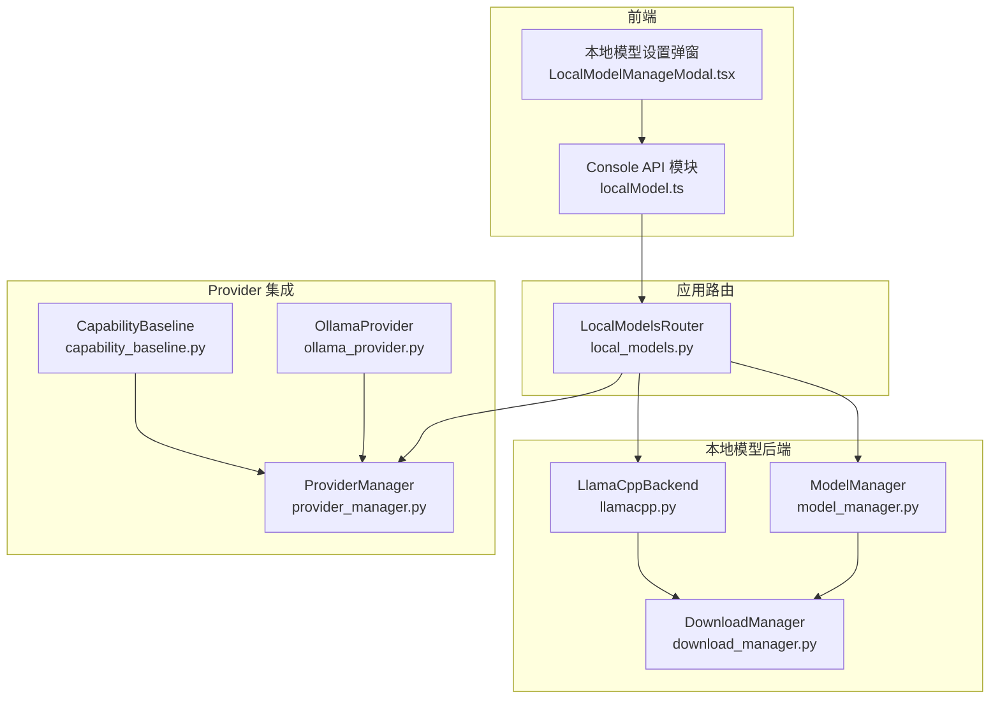
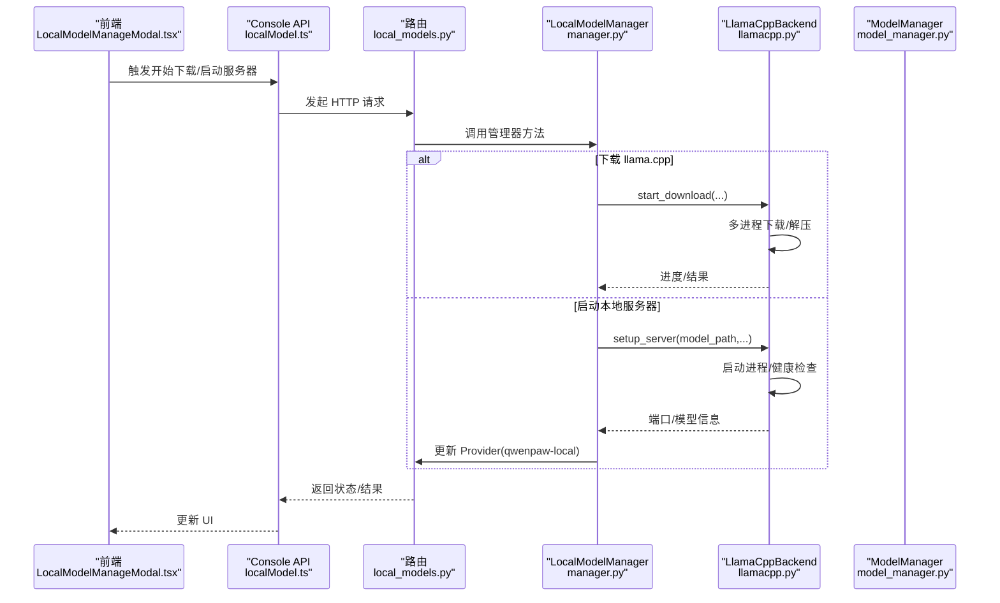
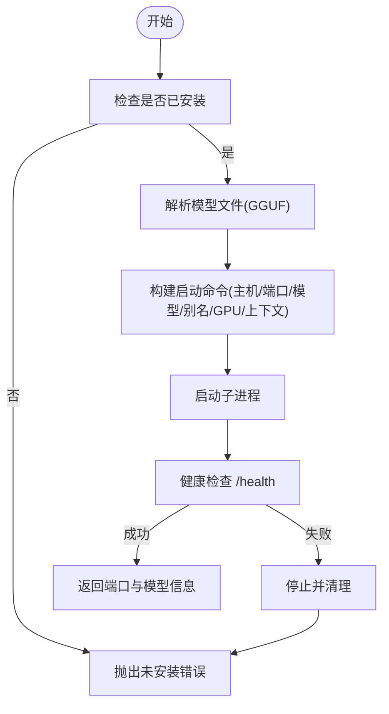
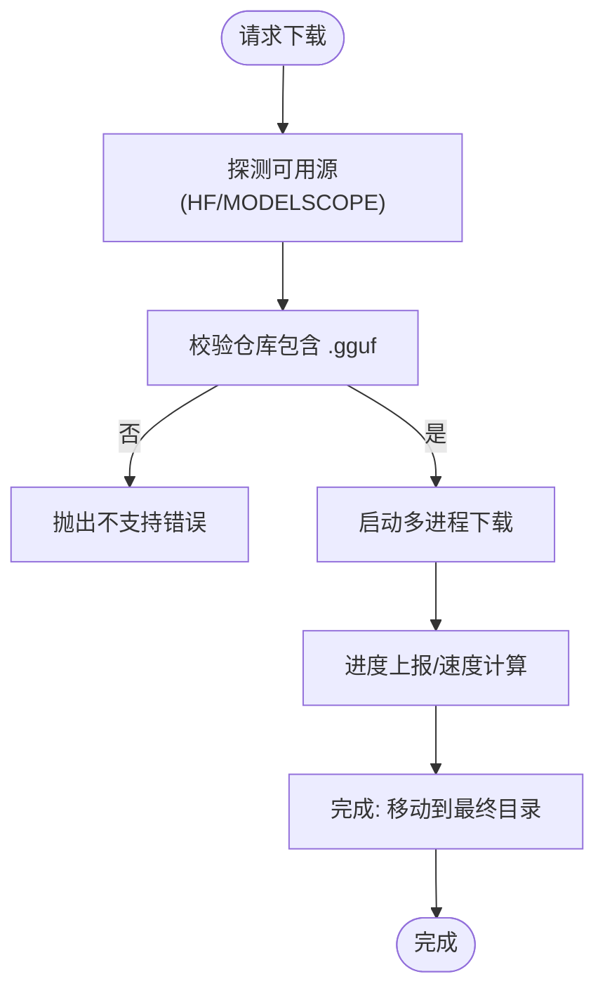
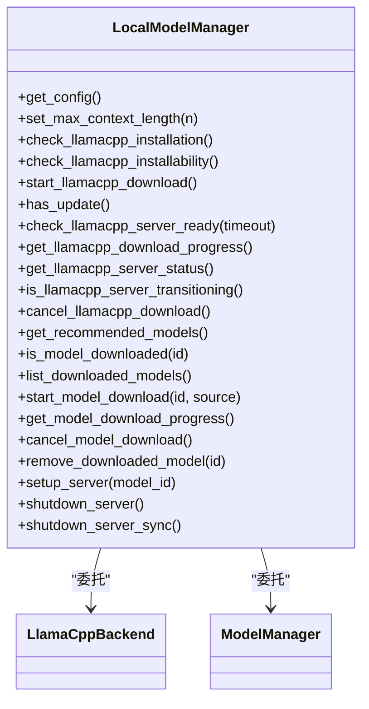
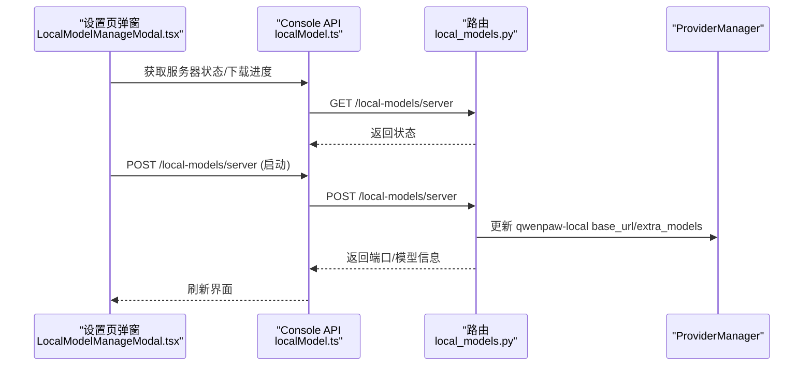
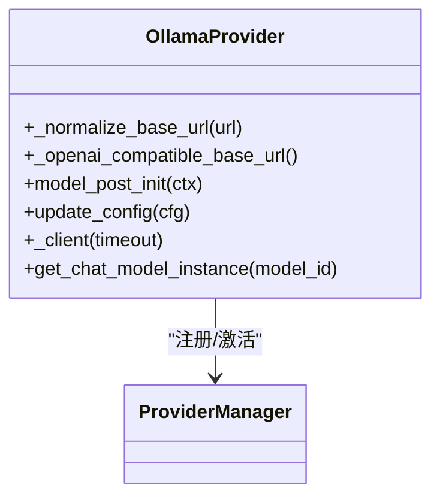
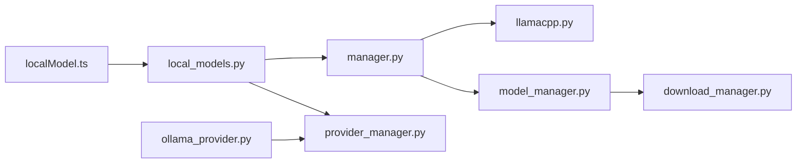

# 本地模型管理

<cite>
**本文引用的文件**
- [src/qwenpaw/local_models/__init__.py](file://src/qwenpaw/local_models/__init__.py)
- [src/qwenpaw/local_models/manager.py](file://src/qwenpaw/local_models/manager.py)
- [src/qwenpaw/local_models/model_manager.py](file://src/qwenpaw/local_models/model_manager.py)
- [src/qwenpaw/local_models/download_manager.py](file://src/qwenpaw/local_models/download_manager.py)
- [src/qwenpaw/local_models/llamacpp.py](file://src/qwenpaw/local_models/llamacpp.py)
- [src/qwenpaw/app/routers/local_models.py](file://src/qwenpaw/app/routers/local_models.py)
- [src/qwenpaw/providers/ollama_provider.py](file://src/qwenpaw/providers/ollama_provider.py)
- [src/qwenpaw/providers/capability_baseline.py](file://src/qwenpaw/providers/capability_baseline.py)
- [src/qwenpaw/providers/provider_manager.py](file://src/qwenpaw/providers/provider_manager.py)
- [console/src/api/modules/localModel.ts](file://console/src/api/modules/localModel.ts)
- [console/src/pages/Settings/Models/components/modals/LocalModelManageModal.tsx](file://console/src/pages/Settings/Models/components/modals/LocalModelManageModal.tsx)
- [tests/unit/local_models/test_llamacpp_backend.py](file://tests/unit/local_models/test_llamacpp_backend.py)
- [tests/unit/providers/test_ollama_provider.py](file://tests/unit/providers/test_ollama_provider.py)
</cite>

## 目录
1. [简介](#简介)
2. [项目结构](#项目结构)
3. [核心组件](#核心组件)
4. [架构总览](#架构总览)
5. [详细组件分析](#详细组件分析)
6. [依赖分析](#依赖分析)
7. [性能考量](#性能考量)
8. [故障排除指南](#故障排除指南)
9. [结论](#结论)
10. [附录](#附录)

## 简介
本文件面向 QwenPaw 的本地模型管理系统，系统性阐述三类本地推理后端的集成与配置：llama.cpp（内置二进制分发与服务）、Ollama（OpenAI 兼容接口）以及 LM Studio（动态发现）。文档覆盖模型下载与安装机制（校验、依赖、版本控制）、本地模型服务器的启动与管理（端口、资源、健康检查）、模型配置优化（上下文长度、生成参数）、性能监控与故障排除、本地与云端模型的切换与一致性保障，以及最佳实践与安全建议，并提供可操作的配置示例与使用场景。

## 项目结构
本地模型管理由“后端抽象层 + 下载与进度跟踪 + 路由与前端交互 + Provider 集成”构成，核心文件如下：
- 后端与下载：llama.cpp 后端、通用下载控制器与进度追踪、模型仓库管理
- 路由与状态：FastAPI 路由暴露本地模型与服务器状态、下载进度、配置等
- Provider 集成：Ollama 提供者（OpenAI 兼容），LM Studio 动态发现能力基线
- 前端对接：Console API 模块与设置页弹窗组件

图示来源
- [src/qwenpaw/local_models/llamacpp.py:1-887](file://src/qwenpaw/local_models/llamacpp.py#L1-L887)
- [src/qwenpaw/local_models/model_manager.py:1-654](file://src/qwenpaw/local_models/model_manager.py#L1-L654)
- [src/qwenpaw/local_models/download_manager.py:1-599](file://src/qwenpaw/local_models/download_manager.py#L1-L599)
- [src/qwenpaw/app/routers/local_models.py:1-454](file://src/qwenpaw/app/routers/local_models.py#L1-L454)
- [src/qwenpaw/providers/ollama_provider.py:1-86](file://src/qwenpaw/providers/ollama_provider.py#L1-L86)
- [src/qwenpaw/providers/capability_baseline.py:580-600](file://src/qwenpaw/providers/capability_baseline.py#L580-L600)
- [src/qwenpaw/providers/provider_manager.py:620-640](file://src/qwenpaw/providers/provider_manager.py#L620-L640)
- [console/src/api/modules/localModel.ts:1-59](file://console/src/api/modules/localModel.ts#L1-L59)
- [console/src/pages/Settings/Models/components/modals/LocalModelManageModal.tsx:212-247](file://console/src/pages/Settings/Models/components/modals/LocalModelManageModal.tsx#L212-L247)

章节来源
- [src/qwenpaw/local_models/__init__.py:1-17](file://src/qwenpaw/local_models/__init__.py#L1-L17)
- [src/qwenpaw/local_models/manager.py:1-229](file://src/qwenpaw/local_models/manager.py#L1-L229)
- [src/qwenpaw/app/routers/local_models.py:1-454](file://src/qwenpaw/app/routers/local_models.py#L1-L454)

## 核心组件
- LocalModelManager：本地运行时的门面，统一管理 llama.cpp 安装、下载、服务器生命周期、推荐模型与下载进度；持久化最大上下文长度配置
- LlamaCppBackend：封装 llama.cpp 可执行文件下载、解压、安装、进程启动、健康检查、日志采集、版本查询、设备枚举、停止与清理
- ModelManager：模型仓库管理，支持从 HuggingFace 或 ModelScope 下载 GGUF 模型，自动探测可用内存选择推荐模型，进度追踪与取消
- DownloadManager：多进程下载控制器，统一进度计算、结果归并、错误映射与资源回收
- 路由层：FastAPI 路由提供服务器状态、更新检测、下载控制、模型列表、下载进度、配置读写等接口
- Provider 集成：OllamaProvider 将 Ollama 作为 OpenAI 兼容后端接入；LM Studio 在能力基线中被标记为动态发现类型

章节来源
- [src/qwenpaw/local_models/manager.py:33-229](file://src/qwenpaw/local_models/manager.py#L33-L229)
- [src/qwenpaw/local_models/llamacpp.py:51-800](file://src/qwenpaw/local_models/llamacpp.py#L51-L800)
- [src/qwenpaw/local_models/model_manager.py:63-654](file://src/qwenpaw/local_models/model_manager.py#L63-L654)
- [src/qwenpaw/local_models/download_manager.py:25-599](file://src/qwenpaw/local_models/download_manager.py#L25-L599)
- [src/qwenpaw/app/routers/local_models.py:145-454](file://src/qwenpaw/app/routers/local_models.py#L145-L454)
- [src/qwenpaw/providers/ollama_provider.py:16-86](file://src/qwenpaw/providers/ollama_provider.py#L16-L86)
- [src/qwenpaw/providers/capability_baseline.py:591-591](file://src/qwenpaw/providers/capability_baseline.py#L591-L591)
- [src/qwenpaw/providers/provider_manager.py:632-633](file://src/qwenpaw/providers/provider_manager.py#L632-L633)

## 架构总览
本地模型管理采用“路由层 + 后端抽象 + Provider 集成”的分层设计。路由层负责对外暴露 REST 接口，后端抽象层负责下载与服务器生命周期管理，Provider 层负责将本地或远程模型以统一接口注入到系统中，前端通过 Console API 模块调用路由接口实现可视化管理。

图示来源
- [console/src/pages/Settings/Models/components/modals/LocalModelManageModal.tsx:464-534](file://console/src/pages/Settings/Models/components/modals/LocalModelManageModal.tsx#L464-L534)
- [console/src/api/modules/localModel.ts:1-59](file://console/src/api/modules/localModel.ts#L1-L59)
- [src/qwenpaw/app/routers/local_models.py:283-338](file://src/qwenpaw/app/routers/local_models.py#L283-L338)
- [src/qwenpaw/local_models/manager.py:200-229](file://src/qwenpaw/local_models/manager.py#L200-L229)
- [src/qwenpaw/local_models/llamacpp.py:216-308](file://src/qwenpaw/local_models/llamacpp.py#L216-L308)

## 详细组件分析

### 组件一：LlamaCppBackend（本地二进制与服务器）
- 职责：下载/安装 llama.cpp 可执行文件、解析目标平台、健康检查、版本查询、设备枚举、启动/停止服务器、日志采集
- 关键流程：
  - 下载：构造下载 URL，多进程流式下载，进度上报，解压合并，最终移动到目标目录
  - 启动：解析模型文件（支持单文件或目录内 GGUF），构建命令行参数（主机、端口、模型路径、别名、GPU 层数、上下文大小、多模态投影），启动子进程并异步等待健康检查
  - 停止：优雅关闭，日志任务取消，重置状态
- 错误处理：对 HTTP 状态码进行语义化映射，异常捕获与清理，失败时回滚并记录

图示来源
- [src/qwenpaw/local_models/llamacpp.py:216-308](file://src/qwenpaw/local_models/llamacpp.py#L216-L308)
- [src/qwenpaw/local_models/llamacpp.py:656-692](file://src/qwenpaw/local_models/llamacpp.py#L656-L692)

章节来源
- [src/qwenpaw/local_models/llamacpp.py:51-800](file://src/qwenpaw/local_models/llamacpp.py#L51-L800)
- [tests/unit/local_models/test_llamacpp_backend.py:296-460](file://tests/unit/local_models/test_llamacpp_backend.py#L296-L460)

### 组件二：ModelManager（模型下载与仓库）
- 职责：根据系统内存推荐模型、从 HuggingFace 或 ModelScope 下载 GGUF 模型、进度追踪、取消下载、删除模型、扫描已下载模型目录
- 关键流程：
  - 推荐模型：按显存/内存阈值返回候选模型清单，标注是否已下载
  - 下载：探测可达源（优先 HuggingFace），校验是否存在 .gguf 文件，启动多进程下载，完成后移动到最终目录
  - 列表：遍历 models 目录，识别可见模型根目录，统计字节大小
- 依赖与错误：导入 huggingface_hub 与 modelscope，网络探测与错误映射，下载失败回滚临时目录

图示来源
- [src/qwenpaw/local_models/model_manager.py:181-250](file://src/qwenpaw/local_models/model_manager.py#L181-L250)
- [src/qwenpaw/local_models/model_manager.py:321-372](file://src/qwenpaw/local_models/model_manager.py#L321-L372)
- [src/qwenpaw/local_models/download_manager.py:368-599](file://src/qwenpaw/local_models/download_manager.py#L368-L599)

章节来源
- [src/qwenpaw/local_models/model_manager.py:63-654](file://src/qwenpaw/local_models/model_manager.py#L63-L654)
- [src/qwenpaw/local_models/download_manager.py:25-599](file://src/qwenpaw/local_models/download_manager.py#L25-L599)

### 组件三：LocalModelManager（统一门面）
- 职责：聚合 LlamaCppBackend 与 ModelManager，提供统一入口；持久化最大上下文长度；在启动服务器前确保环境可安装；在服务器启动后更新 qwenpaw-local Provider
- 生命周期：下载与服务器启停互斥，使用锁保护；配置落盘为只写权限

图示来源
- [src/qwenpaw/local_models/manager.py:33-229](file://src/qwenpaw/local_models/manager.py#L33-L229)

章节来源
- [src/qwenpaw/local_models/manager.py:1-229](file://src/qwenpaw/local_models/manager.py#L1-L229)

### 组件四：路由与前端（FastAPI + Console）
- 路由：提供服务器状态、更新检测、下载控制、模型列表、下载进度、配置读写等接口；启动服务器后更新 qwenpaw-local Provider 的 base_url 与 extra_models
- 前端：LocalModelManageModal.tsx 与 localModel.ts API 模块配合，轮询状态、触发下载/取消、启动/停止服务器、保存高级配置

图示来源
- [console/src/pages/Settings/Models/components/modals/LocalModelManageModal.tsx:212-247](file://console/src/pages/Settings/Models/components/modals/LocalModelManageModal.tsx#L212-L247)
- [console/src/api/modules/localModel.ts:1-59](file://console/src/api/modules/localModel.ts#L1-L59)
- [src/qwenpaw/app/routers/local_models.py:283-338](file://src/qwenpaw/app/routers/local_models.py#L283-L338)

章节来源
- [src/qwenpaw/app/routers/local_models.py:145-454](file://src/qwenpaw/app/routers/local_models.py#L145-L454)
- [console/src/api/modules/localModel.ts:1-59](file://console/src/api/modules/localModel.ts#L1-L59)
- [console/src/pages/Settings/Models/components/modals/LocalModelManageModal.tsx:464-534](file://console/src/pages/Settings/Models/components/modals/LocalModelManageModal.tsx#L464-L534)

### 组件五：Provider 集成（Ollama 与 LM Studio）
- OllamaProvider：将 Ollama 作为 OpenAI 兼容后端接入，自动从环境变量 OLLAMA_HOST 读取地址，规范化 base_url，统一注入到 ProviderManager
- LM Studio：在能力基线中标注为动态发现类型，便于后续扩展

图示来源
- [src/qwenpaw/providers/ollama_provider.py:16-86](file://src/qwenpaw/providers/ollama_provider.py#L16-L86)
- [src/qwenpaw/providers/provider_manager.py:632-633](file://src/qwenpaw/providers/provider_manager.py#L632-L633)
- [src/qwenpaw/providers/capability_baseline.py:591-591](file://src/qwenpaw/providers/capability_baseline.py#L591-L591)

章节来源
- [src/qwenpaw/providers/ollama_provider.py:1-86](file://src/qwenpaw/providers/ollama_provider.py#L1-L86)
- [tests/unit/providers/test_ollama_provider.py:1-141](file://tests/unit/providers/test_ollama_provider.py#L1-L141)

## 依赖分析
- 组件耦合：
  - LocalModelManager 对 LlamaCppBackend 与 ModelManager 存在强依赖，负责协调生命周期与状态
  - 路由层依赖 LocalModelManager 与 ProviderManager，用于状态查询与 Provider 注入
  - 前端仅通过 HTTP 接口与路由交互，降低耦合
- 外部依赖：
  - 下载：huggingface_hub、modelscope（可选）
  - 进程与命令：multiprocessing、subprocess、httpx
  - 前端：React + Ant Design（UI），Axios（HTTP）

图示来源
- [src/qwenpaw/app/routers/local_models.py:1-454](file://src/qwenpaw/app/routers/local_models.py#L1-L454)
- [src/qwenpaw/local_models/manager.py:1-229](file://src/qwenpaw/local_models/manager.py#L1-L229)
- [src/qwenpaw/local_models/llamacpp.py:1-887](file://src/qwenpaw/local_models/llamacpp.py#L1-L887)
- [src/qwenpaw/local_models/model_manager.py:1-654](file://src/qwenpaw/local_models/model_manager.py#L1-L654)
- [src/qwenpaw/local_models/download_manager.py:1-599](file://src/qwenpaw/local_models/download_manager.py#L1-L599)
- [src/qwenpaw/providers/ollama_provider.py:1-86](file://src/qwenpaw/providers/ollama_provider.py#L1-L86)
- [console/src/api/modules/localModel.ts:1-59](file://console/src/api/modules/localModel.ts#L1-L59)

章节来源
- [src/qwenpaw/app/routers/local_models.py:1-454](file://src/qwenpaw/app/routers/local_models.py#L1-L454)
- [src/qwenpaw/local_models/manager.py:1-229](file://src/qwenpaw/local_models/manager.py#L1-L229)

## 性能考量
- 内存与上下文：
  - 通过 LocalModelConfig.max_context_length 控制 llama.cpp 上下文窗口大小，影响显存占用与推理延迟
  - ModelManager 根据 GPU 显存或系统内存自动推荐模型规模，避免超配导致 OOM
- 并发与 I/O：
  - 下载采用多进程 + 流式分块，结合进度追踪与速度计算，提升吞吐与可观测性
  - 服务器启动采用异步健康检查，避免阻塞主线程
- 设备与加速：
  - LlamaCppBackend 自动设置 GPU 层数为 auto，支持设备枚举与版本查询，便于定位性能瓶颈
- 生成参数：
  - 通过 Provider 的 generate_kwargs 注入额外参数（如温度、采样策略等），在路由层持久化到 qwenpaw-local Provider

章节来源
- [src/qwenpaw/local_models/manager.py:23-31](file://src/qwenpaw/local_models/manager.py#L23-L31)
- [src/qwenpaw/local_models/model_manager.py:519-525](file://src/qwenpaw/local_models/model_manager.py#L519-L525)
- [src/qwenpaw/local_models/llamacpp.py:349-396](file://src/qwenpaw/local_models/llamacpp.py#L349-L396)
- [src/qwenpaw/app/routers/local_models.py:416-442](file://src/qwenpaw/app/routers/local_models.py#L416-L442)

## 故障排除指南
- llama.cpp 下载失败：
  - 常见原因：HTTP 404/403/5xx、网络不可达、目标平台不支持
  - 处理：查看错误映射与日志，确认版本标签与平台匹配，必要时切换镜像源或手动下载
- 服务器启动失败：
  - 常见原因：模型路径不存在、模型非 GGUF、GPU 不兼容、端口冲突
  - 处理：确认模型文件与目录结构，检查 GPU 层数与上下文大小，更换端口
- 健康检查超时：
  - 常见原因：进程提前退出、端口未开放、日志输出异常
  - 处理：查看后台日志任务输出，确认进程状态，缩短超时时间重试
- Provider 注入失败：
  - 常见原因：base_url 未正确规范化、模型未就绪
  - 处理：检查 Ollama 地址与 /v1 后缀规范化，确认模型已拉取

章节来源
- [src/qwenpaw/local_models/llamacpp.py:614-648](file://src/qwenpaw/local_models/llamacpp.py#L614-L648)
- [src/qwenpaw/local_models/llamacpp.py:656-692](file://src/qwenpaw/local_models/llamacpp.py#L656-L692)
- [src/qwenpaw/app/routers/local_models.py:283-338](file://src/qwenpaw/app/routers/local_models.py#L283-L338)
- [tests/unit/local_models/test_llamacpp_backend.py:609-707](file://tests/unit/local_models/test_llamacpp_backend.py#L609-L707)

## 结论
QwenPaw 的本地模型管理以“统一门面 + 多后端抽象 + Provider 集成”为核心，既支持内置 llama.cpp 的一键安装与服务，又兼容 Ollama 的 OpenAI 兼容接口，并预留 LM Studio 动态发现能力。通过完善的下载进度追踪、服务器健康检查、配置持久化与前端可视化，系统在易用性与可观测性之间取得平衡。建议在生产环境中结合资源监控与参数调优，持续优化上下文长度与生成参数，确保稳定与高效。

## 附录

### 使用场景与配置示例
- 启动本地 llama.cpp 服务器
  - 步骤：先下载二进制 → 选择已下载模型 → 启动服务器 → Provider 注入
  - 路由：POST /local-models/server
  - 前端：LocalModelManageModal.tsx 中的启动按钮
- 下载推荐模型
  - 步骤：获取推荐列表 → 选择来源（HF/MODELSCOPE/AUTO） → 开始下载 → 查看进度
  - 路由：GET /local-models/models；POST /local-models/models/download
  - 前端：listRecommendedLocalModels 与 startLocalModelDownload
- 配置本地模型参数
  - 步骤：设置最大上下文长度；设置生成参数（如温度、采样策略）
  - 路由：PUT /local-models/config；GET /local-models/config
  - 前端：高级配置保存逻辑

章节来源
- [src/qwenpaw/app/routers/local_models.py:145-454](file://src/qwenpaw/app/routers/local_models.py#L145-L454)
- [console/src/api/modules/localModel.ts:1-59](file://console/src/api/modules/localModel.ts#L1-L59)
- [console/src/pages/Settings/Models/components/modals/LocalModelManageModal.tsx:464-534](file://console/src/pages/Settings/Models/components/modals/LocalModelManageModal.tsx#L464-L534)