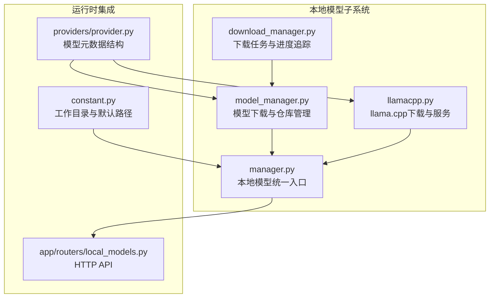
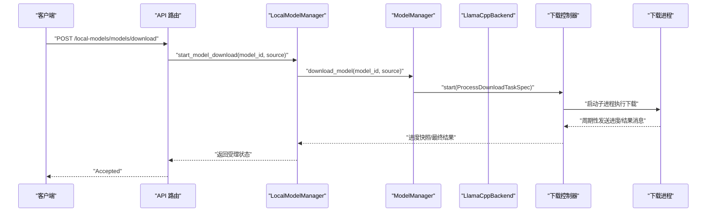
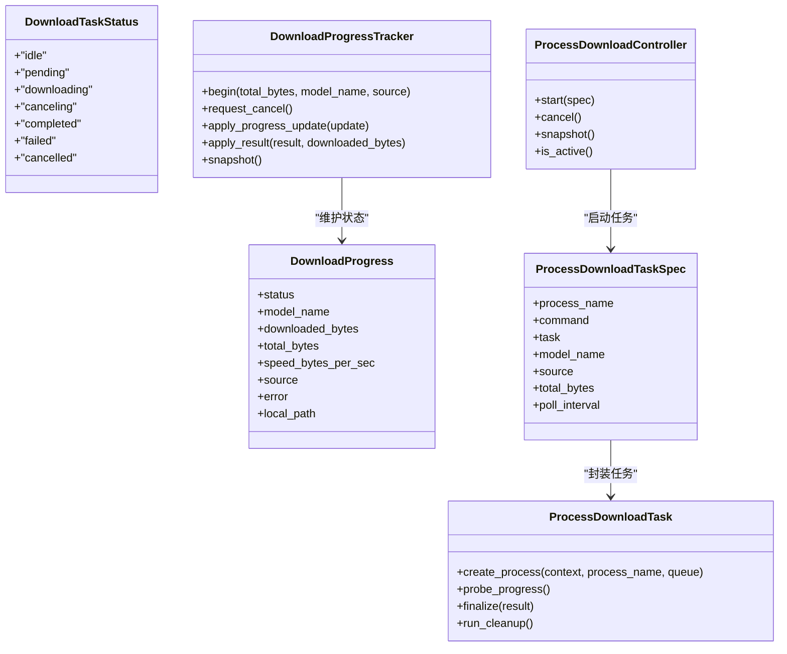
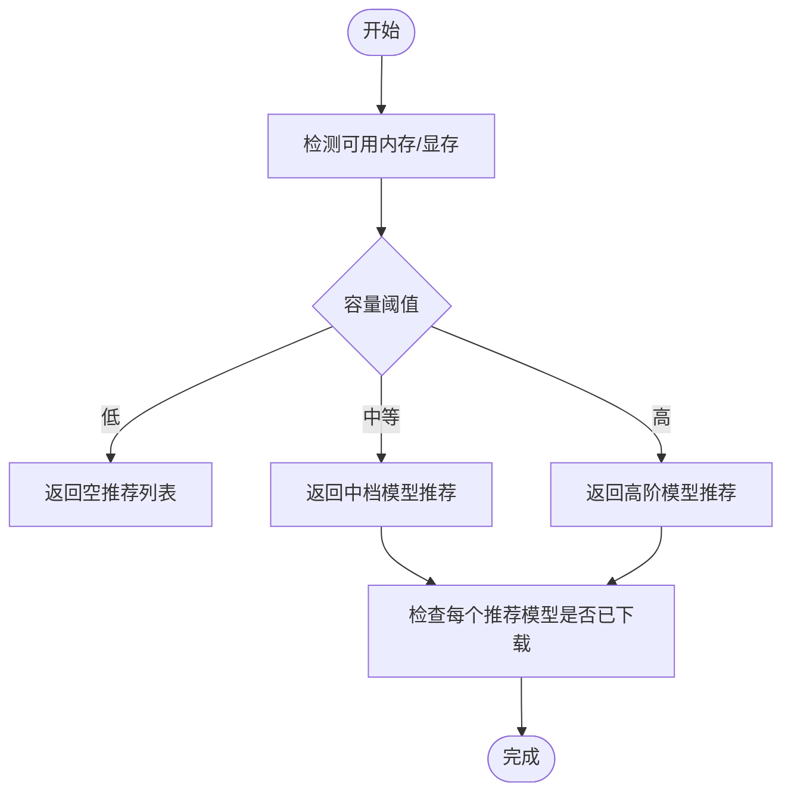
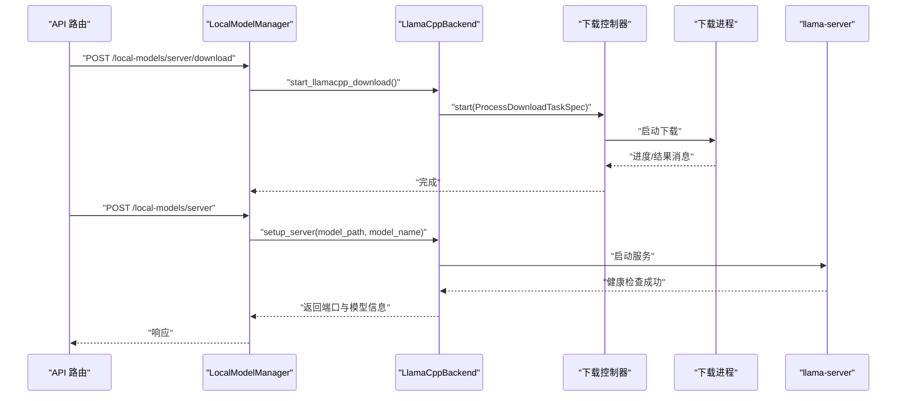
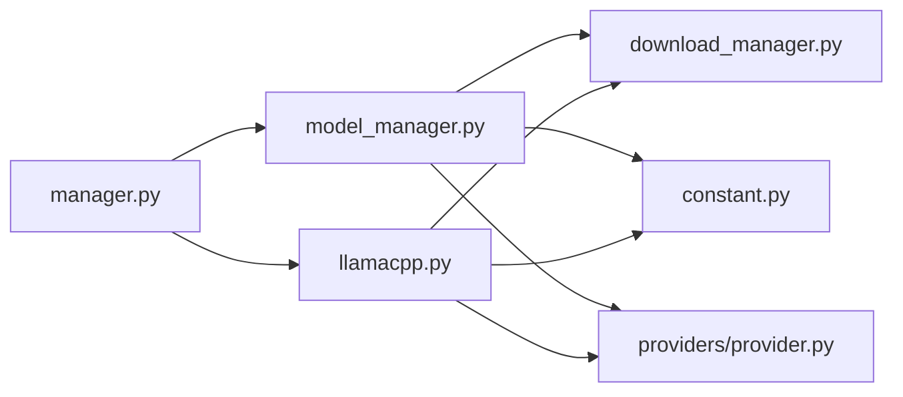

# 模型下载与安装

<cite>
**本文引用的文件**
- [src/qwenpaw/local_models/download_manager.py](file://src/qwenpaw/local_models/download_manager.py)
- [src/qwenpaw/local_models/model_manager.py](file://src/qwenpaw/local_models/model_manager.py)
- [src/qwenpaw/local_models/manager.py](file://src/qwenpaw/local_models/manager.py)
- [src/qwenpaw/local_models/llamacpp.py](file://src/qwenpaw/local_models/llamacpp.py)
- [src/qwenpaw/app/routers/local_models.py](file://src/qwenpaw/app/routers/local_models.py)
- [src/qwenpaw/constant.py](file://src/qwenpaw/constant.py)
- [src/qwenpaw/providers/provider.py](file://src/qwenpaw/providers/provider.py)
- [tests/unit/local_models/test_download_manager.py](file://tests/unit/local_models/test_download_manager.py)
- [tests/unit/local_models/test_model_manager.py](file://tests/unit/local_models/test_model_manager.py)
</cite>

## 目录
1. [简介](#简介)
2. [项目结构](#项目结构)
3. [核心组件](#核心组件)
4. [架构总览](#架构总览)
5. [详细组件分析](#详细组件分析)
6. [依赖分析](#依赖分析)
7. [性能考虑](#性能考虑)
8. [故障排查指南](#故障排查指南)
9. [结论](#结论)
10. [附录](#附录)

## 简介
本技术文档围绕 QwenPaw 的“本地模型下载与安装”子系统，系统化阐述以下主题：
- 模型仓库管理机制：推荐模型列表生成、模型信息校验与元数据结构
- 下载进度跟踪、断点续传与错误重试机制
- 模型文件验证、完整性检查与依赖解析
- 安装目录结构与文件组织方式
- 版本管理与兼容性检查
- 下载配置选项与网络代理设置
- 下载失败诊断与解决方案
- 缓存策略与磁盘空间管理

该系统以多进程隔离下载、统一进度追踪器与可插拔后端为核心设计，既保证下载稳定性，又便于扩展不同来源（如 Hugging Face、ModelScope）与不同目标（llama.cpp 可执行文件或 GGUF 模型文件）。

## 项目结构
与模型下载与安装直接相关的模块分布如下：
- 下载与进度控制：download_manager.py
- 模型下载与仓库管理：model_manager.py
- llama.cpp 二进制下载与服务管理：llamacpp.py
- 本地模型统一入口与持久化配置：manager.py
- API 路由：app/routers/local_models.py
- 常量与默认路径：constant.py
- 提供商与模型元数据定义：providers/provider.py
- 单元测试：tests/unit/local_models/*

图表来源
- [src/qwenpaw/local_models/download_manager.py:1-599](file://src/qwenpaw/local_models/download_manager.py#L1-L599)
- [src/qwenpaw/local_models/model_manager.py:1-654](file://src/qwenpaw/local_models/model_manager.py#L1-L654)
- [src/qwenpaw/local_models/manager.py:1-229](file://src/qwenpaw/local_models/manager.py#L1-L229)
- [src/qwenpaw/local_models/llamacpp.py:1-887](file://src/qwenpaw/local_models/llamacpp.py#L1-L887)
- [src/qwenpaw/app/routers/local_models.py:1-454](file://src/qwenpaw/app/routers/local_models.py#L1-L454)
- [src/qwenpaw/constant.py:1-307](file://src/qwenpaw/constant.py#L1-L307)
- [src/qwenpaw/providers/provider.py:1-314](file://src/qwenpaw/providers/provider.py#L1-L314)

章节来源
- [src/qwenpaw/local_models/download_manager.py:1-599](file://src/qwenpaw/local_models/download_manager.py#L1-L599)
- [src/qwenpaw/local_models/model_manager.py:1-654](file://src/qwenpaw/local_models/model_manager.py#L1-L654)
- [src/qwenpaw/local_models/manager.py:1-229](file://src/qwenpaw/local_models/manager.py#L1-L229)
- [src/qwenpaw/local_models/llamacpp.py:1-887](file://src/qwenpaw/local_models/llamacpp.py#L1-L887)
- [src/qwenpaw/app/routers/local_models.py:1-454](file://src/qwenpaw/app/routers/local_models.py#L1-L454)
- [src/qwenpaw/constant.py:1-307](file://src/qwenpaw/constant.py#L1-L307)
- [src/qwenpaw/providers/provider.py:1-314](file://src/qwenpaw/providers/provider.py#L1-L314)

## 核心组件
- 进度追踪与消息协议
  - 下载生命周期状态、进度更新、结果消息类型与序列化
  - 多线程安全的状态快照与速度计算
- 模型下载控制器
  - 进程隔离下载、队列通信、监控线程、取消与清理
- 模型管理器
  - 推荐模型列表生成（基于内存容量）、下载源探测与选择、GGUF 文件存在性校验、下载进度查询与取消
- llama.cpp 后端
  - 二进制包下载、解压与安装、服务启动与健康检查、设备列表与版本查询
- 统一入口 LocalModelManager
  - 配置持久化（最大上下文长度等）、并发锁保护、与提供商管理器联动
- API 路由
  - 提供服务器状态、下载进度、取消下载、启动/停止服务、下载模型、配置读写等接口
- 常量与默认路径
  - 工作目录、本地模型目录、媒体目录、日志级别、超时等环境变量加载与默认值

章节来源
- [src/qwenpaw/local_models/download_manager.py:25-128](file://src/qwenpaw/local_models/download_manager.py#L25-L128)
- [src/qwenpaw/local_models/model_manager.py:63-320](file://src/qwenpaw/local_models/model_manager.py#L63-L320)
- [src/qwenpaw/local_models/llamacpp.py:51-308](file://src/qwenpaw/local_models/llamacpp.py#L51-L308)
- [src/qwenpaw/local_models/manager.py:33-229](file://src/qwenpaw/local_models/manager.py#L33-L229)
- [src/qwenpaw/app/routers/local_models.py:1-454](file://src/qwenpaw/app/routers/local_models.py#L1-L454)
- [src/qwenpaw/constant.py:89-120](file://src/qwenpaw/constant.py#L89-L120)

## 架构总览
系统采用“统一入口 + 多后端 + 进度追踪”的分层架构：
- 统一入口负责配置持久化、并发控制与与上层提供商管理器对接
- 模型下载与 llama.cpp 下载分别由独立后端实现，均通过统一的下载控制器进行进程级隔离与进度追踪
- API 路由暴露 HTTP 接口，调用统一入口完成业务操作

图表来源
- [src/qwenpaw/app/routers/local_models.py:362-414](file://src/qwenpaw/app/routers/local_models.py#L362-L414)
- [src/qwenpaw/local_models/manager.py:180-194](file://src/qwenpaw/local_models/manager.py#L180-L194)
- [src/qwenpaw/local_models/model_manager.py:181-243](file://src/qwenpaw/local_models/model_manager.py#L181-L243)
- [src/qwenpaw/local_models/download_manager.py:368-491](file://src/qwenpaw/local_models/download_manager.py#L368-L491)

## 详细组件分析

### 下载进度追踪与消息协议
- 生命周期状态：空闲、待定、下载中、取消中、已完成、失败、已取消
- 进度更新：累计字节、总大小、模型名、来源
- 结果消息：状态、本地路径、错误信息
- 追踪器：线程安全、速度计算、取消请求、结果应用
- 控制器：进程启动、监控线程、消息处理、异常与清理

图表来源
- [src/qwenpaw/local_models/download_manager.py:25-128](file://src/qwenpaw/local_models/download_manager.py#L25-L128)
- [src/qwenpaw/local_models/download_manager.py:198-366](file://src/qwenpaw/local_models/download_manager.py#L198-L366)
- [src/qwenpaw/local_models/download_manager.py:368-599](file://src/qwenpaw/local_models/download_manager.py#L368-L599)

章节来源
- [src/qwenpaw/local_models/download_manager.py:25-128](file://src/qwenpaw/local_models/download_manager.py#L25-L128)
- [src/qwenpaw/local_models/download_manager.py:198-366](file://src/qwenpaw/local_models/download_manager.py#L198-L366)
- [src/qwenpaw/local_models/download_manager.py:368-599](file://src/qwenpaw/local_models/download_manager.py#L368-L599)

### 模型下载与仓库管理
- 推荐模型列表：根据 GPU/系统显存或内存容量自动推荐适合的模型集，并标注是否已下载
- 下载源选择：优先 Hugging Face，不可达时回退到 ModelScope；支持显式指定
- GGUF 校验：在开始下载前检查仓库是否包含至少一个 .gguf 文件，否则拒绝下载
- 进度与取消：通过统一追踪器与控制器提供实时进度与取消能力
- 目录结构：模型按“组织/仓库名”布局，使用临时目录作为下载暂存区，完成后移动至最终位置

图表来源
- [src/qwenpaw/local_models/model_manager.py:78-135](file://src/qwenpaw/local_models/model_manager.py#L78-L135)

章节来源
- [src/qwenpaw/local_models/model_manager.py:63-320](file://src/qwenpaw/local_models/model_manager.py#L63-L320)
- [src/qwenpaw/local_models/model_manager.py:321-654](file://src/qwenpaw/local_models/model_manager.py#L321-L654)

### llama.cpp 下载与服务管理
- 二进制下载：支持从镜像地址下载预编译包，支持断点续传（通过流式写入与进度上报）
- 解压与安装：下载完成后解压并合并内容，移动到目标目录
- 服务启动：解析模型文件（优先 GGUF，支持 mmproj），构建命令参数，启动 llama-server 并进行健康检查
- 设备与版本：列出可用设备、查询版本号
- 更新检查：比较当前版本与最新版本，判断是否需要升级

图表来源
- [src/qwenpaw/app/routers/local_models.py:233-318](file://src/qwenpaw/app/routers/local_models.py#L233-L318)
- [src/qwenpaw/local_models/llamacpp.py:145-308](file://src/qwenpaw/local_models/llamacpp.py#L145-L308)

章节来源
- [src/qwenpaw/local_models/llamacpp.py:51-308](file://src/qwenpaw/local_models/llamacpp.py#L51-L308)
- [src/qwenpaw/app/routers/local_models.py:233-318](file://src/qwenpaw/app/routers/local_models.py#L233-L318)

### 统一入口与配置持久化
- LocalModelManager：单例入口，聚合 ModelManager 与 LlamaCppBackend，提供配置持久化（最大上下文长度）、并发锁保护、与提供商管理器联动
- 配置文件：config.json 存储在本地模型目录，支持异步写入与权限设置

章节来源
- [src/qwenpaw/local_models/manager.py:33-229](file://src/qwenpaw/local_models/manager.py#L33-L229)

### API 路由与对外接口
- 服务器状态与更新：检查安装、就绪状态、更新可用性
- 下载控制：启动/取消 llama.cpp 下载与模型下载，查询进度
- 服务控制：启动/停止 llama.cpp 服务，健康检查
- 模型管理：列出推荐与已下载模型、启动/取消模型下载、查询进度
- 配置管理：读取/更新本地模型配置（最大上下文长度、生成参数）

章节来源
- [src/qwenpaw/app/routers/local_models.py:1-454](file://src/qwenpaw/app/routers/local_models.py#L1-L454)

## 依赖分析
- 内部依赖
  - download_manager 为 model_manager 与 llamacpp 提供统一的下载与进度控制能力
  - manager 将下载与服务管理整合为统一入口，并与提供商管理器协作
  - constant 提供默认工作目录与路径，影响模型与二进制的存储位置
  - provider 定义模型元数据结构，被下载与服务管理使用
- 外部依赖
  - huggingface_hub、modelscope：用于从 Hugging Face 与 ModelScope 获取仓库信息与快照下载
  - httpx：用于网络请求、流式下载与健康检查
  - agentscope：用于模型类与提供商适配

图表来源
- [src/qwenpaw/local_models/model_manager.py:22-34](file://src/qwenpaw/local_models/model_manager.py#L22-L34)
- [src/qwenpaw/local_models/llamacpp.py:22-40](file://src/qwenpaw/local_models/llamacpp.py#L22-L40)
- [src/qwenpaw/local_models/manager.py:13-18](file://src/qwenpaw/local_models/manager.py#L13-L18)
- [src/qwenpaw/constant.py:118-119](file://src/qwenpaw/constant.py#L118-L119)
- [src/qwenpaw/providers/provider.py:17-47](file://src/qwenpaw/providers/provider.py#L17-L47)

章节来源
- [src/qwenpaw/local_models/model_manager.py:22-34](file://src/qwenpaw/local_models/model_manager.py#L22-L34)
- [src/qwenpaw/local_models/llamacpp.py:22-40](file://src/qwenpaw/local_models/llamacpp.py#L22-L40)
- [src/qwenpaw/local_models/manager.py:13-18](file://src/qwenpaw/local_models/manager.py#L13-L18)
- [src/qwenpaw/constant.py:118-119](file://src/qwenpaw/constant.py#L118-L119)
- [src/qwenpaw/providers/provider.py:17-47](file://src/qwenpaw/providers/provider.py#L17-L47)

## 性能考虑
- 进度采样与速度计算：基于时间戳差值计算瞬时速率，避免频繁 I/O 查询
- 流式下载：使用 httpx 流式读取与分块写入，降低内存占用
- 进程隔离：下载在独立进程中执行，避免阻塞主线程与事件循环
- 并发控制：统一入口使用锁保护服务器生命周期切换，避免竞态
- 目录扫描优化：下载完成后再一次性计算已下载字节数，减少重复遍历

[本节为通用指导，无需特定文件引用]

## 故障排查指南
- 下载失败
  - 检查网络连通性与代理设置（系统环境变量生效）
  - 查看下载进度与错误消息，定位具体阶段（探测源、下载、解压、安装）
  - 若为 HTTP 错误，参考错误格式化逻辑中的状态码含义
- 无法找到 .gguf 文件
  - 确认仓库包含至少一个 .gguf 文件；否则拒绝下载
  - 对于 ModelScope，检查仓库文件列表是否包含 .gguf
- 服务器未就绪
  - 观察健康检查超时与返回码；必要时增加超时或检查端口占用
  - 查看服务日志输出，确认启动参数与模型路径正确
- 取消与清理
  - 取消下载会触发清理流程；若仍残留临时目录，需手动清理
- 配置问题
  - 最大上下文长度需满足最小约束；生成参数需与提供商要求一致

章节来源
- [src/qwenpaw/local_models/llamacpp.py:614-647](file://src/qwenpaw/local_models/llamacpp.py#L614-L647)
- [src/qwenpaw/local_models/model_manager.py:474-517](file://src/qwenpaw/local_models/model_manager.py#L474-L517)
- [src/qwenpaw/app/routers/local_models.py:145-210](file://src/qwenpaw/app/routers/local_models.py#L145-L210)

## 结论
QwenPaw 的模型下载与安装系统通过“统一入口 + 多后端 + 进度追踪”的架构，实现了：
- 自动化的推荐模型生成与下载源探测
- 稳健的下载进度追踪、断点续传与错误恢复
- 明确的模型文件校验与依赖解析
- 清晰的安装目录结构与持久化配置
- 完整的 API 接口与可观测性

该设计兼顾易用性与可扩展性，便于后续接入更多模型源与服务后端。

[本节为总结，无需特定文件引用]

## 附录

### 模型安装目录结构与文件组织
- 默认本地模型目录：由常量 DEFAULT_LOCAL_PROVIDER_DIR 指定
- 模型目录：按“组织/仓库名”组织，内部包含 GGUF 文件与辅助文件
- 临时目录：下载过程中使用随机 UUID 的临时目录，完成后移动至最终位置
- 配置文件：config.json 存放本地模型运行时配置（如最大上下文长度）

章节来源
- [src/qwenpaw/constant.py:118-119](file://src/qwenpaw/constant.py#L118-L119)
- [src/qwenpaw/local_models/model_manager.py:142-148](file://src/qwenpaw/local_models/model_manager.py#L142-L148)
- [src/qwenpaw/local_models/manager.py:57-99](file://src/qwenpaw/local_models/manager.py#L57-L99)

### 模型版本管理与兼容性检查
- llama.cpp 版本检查：通过版本字符串比较判断是否需要更新
- 兼容性检查：在 macOS 上检查系统版本，在下载前尝试解析目标文件名
- 服务器状态：检查安装、就绪与更新可用性

章节来源
- [src/qwenpaw/local_models/llamacpp.py:133-143](file://src/qwenpaw/local_models/llamacpp.py#L133-L143)
- [src/qwenpaw/local_models/llamacpp.py:96-108](file://src/qwenpaw/local_models/llamacpp.py#L96-L108)

### 下载配置选项与网络代理设置
- 环境变量加载：通过 EnvVarLoader 读取与解析布尔/数值/字符串类型配置
- 超时与重试：模型提供商检查超时、LLM 重试与退避参数
- 代理：httpx 请求遵循系统信任环境（trust_env=false），建议通过系统代理配置或网络层代理

章节来源
- [src/qwenpaw/constant.py:168-174](file://src/qwenpaw/constant.py#L168-L174)
- [src/qwenpaw/constant.py:220-282](file://src/qwenpaw/constant.py#L220-L282)

### 下载失败诊断与解决方案
- HTTP 状态码映射：404、401/403、5xx 等错误的用户提示
- 请求错误：连接失败、DNS 解析失败等
- 异常捕获：下载进程异常会被转换为失败结果并记录日志
- 单元测试覆盖：进度消息往返、结果处理、队列关闭与终止结果处理等

章节来源
- [src/qwenpaw/local_models/llamacpp.py:614-647](file://src/qwenpaw/local_models/llamacpp.py#L614-L647)
- [tests/unit/local_models/test_download_manager.py:1-260](file://tests/unit/local_models/test_download_manager.py#L1-L260)
- [tests/unit/local_models/test_model_manager.py:1-414](file://tests/unit/local_models/test_model_manager.py#L1-L414)