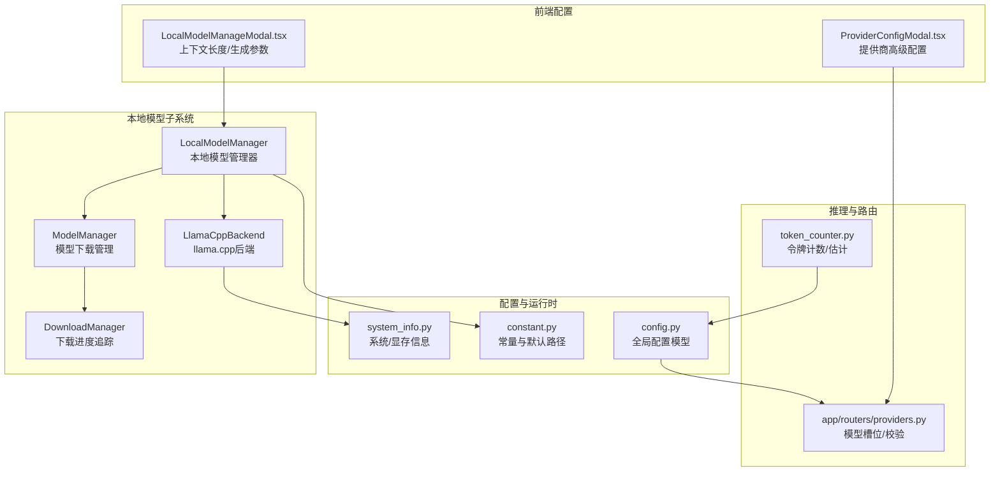
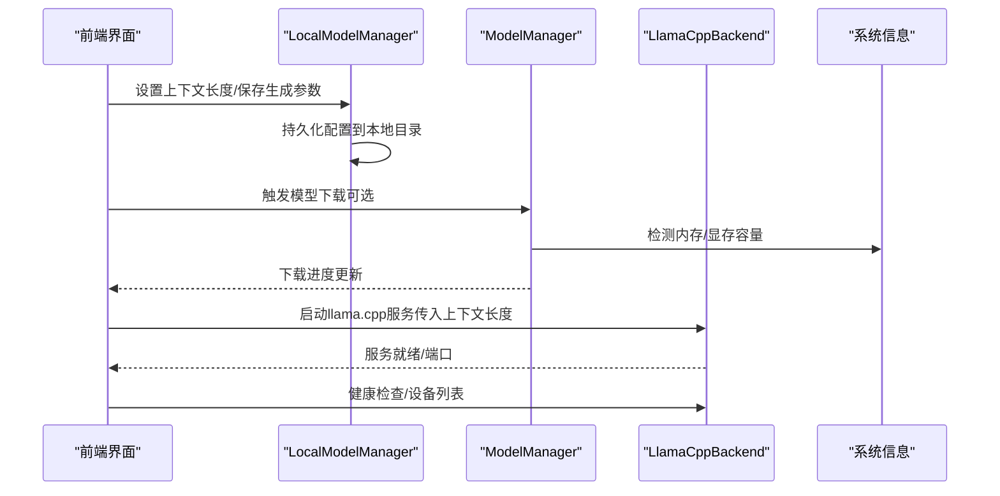
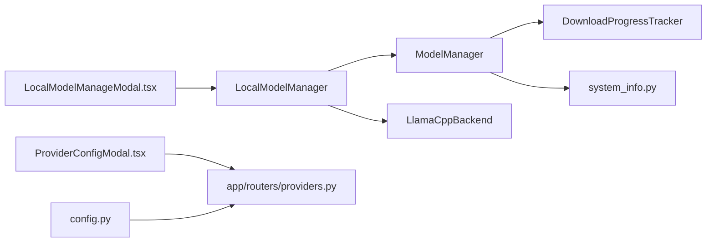

# 模型配置与优化

<cite>
**本文引用的文件**
- [src/qwenpaw/local_models/__init__.py](file://src/qwenpaw/local_models/__init__.py)
- [src/qwenpaw/local_models/manager.py](file://src/qwenpaw/local_models/manager.py)
- [src/qwenpaw/local_models/model_manager.py](file://src/qwenpaw/local_models/model_manager.py)
- [src/qwenpaw/local_models/llamacpp.py](file://src/qwenpaw/local_models/llamacpp.py)
- [src/qwenpaw/local_models/download_manager.py](file://src/qwenpaw/local_models/download_manager.py)
- [src/qwenpaw/config/config.py](file://src/qwenpaw/config/config.py)
- [src/qwenpaw/constant.py](file://src/qwenpaw/constant.py)
- [src/qwenpaw/utils/system_info.py](file://src/qwenpaw/utils/system_info.py)
- [console/src/pages/Settings/Models/components/modals/LocalModelManageModal.tsx](file://console/src/pages/Settings/Models/components/modals/LocalModelManageModal.tsx)
- [console/src/pages/Settings/Models/components/modals/ProviderConfigModal.tsx](file://console/src/pages/Settings/Models/components/modals/ProviderConfigModal.tsx)
- [src/qwenpaw/app/routers/providers.py](file://src/qwenpaw/app/routers/providers.py)
- [src/qwenpaw/agents/utils/token_counter.py](file://src/qwenpaw/agents/utils/token_counter.py)
- [scripts/pack/build_common.py](file://scripts/pack/build_common.py)
</cite>

## 目录
1. [简介](#简介)
2. [项目结构](#项目结构)
3. [核心组件](#核心组件)
4. [架构总览](#架构总览)
5. [详细组件分析](#详细组件分析)
6. [依赖分析](#依赖分析)
7. [性能考虑](#性能考虑)
8. [故障排查指南](#故障排查指南)
9. [结论](#结论)
10. [附录](#附录)

## 简介
本文件面向QwenPaw的本地模型配置与优化，系统性说明以下主题：
- 本地模型配置参数：上下文长度、GPU层分配、下载源选择等
- 推理参数调优：温度、top_p、max_tokens等对生成质量的影响
- 内存优化策略：量化模型使用、显存/系统内存检测与推荐
- 性能基准测试方法与结果分析思路
- 不同硬件配置下的最优参数建议
- 精度与性能的权衡策略
- 配置文件管理与参数验证机制
- 配置变更的影响分析与回滚方案

## 项目结构
围绕本地模型与推理优化的关键代码位于以下模块：
- 本地模型管理与下载：local_models
- 配置与运行时参数：config、constant
- 系统信息采集（内存/GPU）：utils/system_info.py
- 前端配置界面（上下文长度、生成参数）：console
- 提供商路由与模型槽位：app/routers/providers.py
- 令牌计数与上下文压缩：agents/utils/token_counter.py
- 构建打包中的llama.cpp依赖处理：scripts/pack/build_common.py

图表来源
- [src/qwenpaw/local_models/manager.py:33-229](file://src/qwenpaw/local_models/manager.py#L33-L229)
- [src/qwenpaw/local_models/model_manager.py:63-136](file://src/qwenpaw/local_models/model_manager.py#L63-L136)
- [src/qwenpaw/local_models/llamacpp.py:51-120](file://src/qwenpaw/local_models/llamacpp.py#L51-L120)
- [src/qwenpaw/local_models/download_manager.py:198-260](file://src/qwenpaw/local_models/download_manager.py#L198-L260)
- [src/qwenpaw/config/config.py:551-607](file://src/qwenpaw/config/config.py#L551-L607)
- [src/qwenpaw/constant.py:118-120](file://src/qwenpaw/constant.py#L118-L120)
- [src/qwenpaw/utils/system_info.py:111-121](file://src/qwenpaw/utils/system_info.py#L111-L121)
- [console/src/pages/Settings/Models/components/modals/LocalModelManageModal.tsx:1000-1074](file://console/src/pages/Settings/Models/components/modals/LocalModelManageModal.tsx#L1000-L1074)
- [console/src/pages/Settings/Models/components/modals/ProviderConfigModal.tsx:650-690](file://console/src/pages/Settings/Models/components/modals/ProviderConfigModal.tsx#L650-L690)
- [src/qwenpaw/app/routers/providers.py:106-134](file://src/qwenpaw/app/routers/providers.py#L106-L134)
- [src/qwenpaw/agents/utils/token_counter.py:77-157](file://src/qwenpaw/agents/utils/token_counter.py#L77-L157)

章节来源
- [src/qwenpaw/local_models/__init__.py:1-17](file://src/qwenpaw/local_models/__init__.py#L1-L17)
- [src/qwenpaw/local_models/manager.py:33-229](file://src/qwenpaw/local_models/manager.py#L33-L229)
- [src/qwenpaw/local_models/model_manager.py:63-136](file://src/qwenpaw/local_models/model_manager.py#L63-L136)
- [src/qwenpaw/local_models/llamacpp.py:51-120](file://src/qwenpaw/local_models/llamacpp.py#L51-L120)
- [src/qwenpaw/local_models/download_manager.py:198-260](file://src/qwenpaw/local_models/download_manager.py#L198-L260)
- [src/qwenpaw/config/config.py:551-607](file://src/qwenpaw/config/config.py#L551-L607)
- [src/qwenpaw/constant.py:118-120](file://src/qwenpaw/constant.py#L118-L120)
- [src/qwenpaw/utils/system_info.py:111-121](file://src/qwenpaw/utils/system_info.py#L111-L121)
- [console/src/pages/Settings/Models/components/modals/LocalModelManageModal.tsx:1000-1074](file://console/src/pages/Settings/Models/components/modals/LocalModelManageModal.tsx#L1000-L1074)
- [console/src/pages/Settings/Models/components/modals/ProviderConfigModal.tsx:650-690](file://console/src/pages/Settings/Models/components/modals/ProviderConfigModal.tsx#L650-L690)
- [src/qwenpaw/app/routers/providers.py:106-134](file://src/qwenpaw/app/routers/providers.py#L106-L134)
- [src/qwenpaw/agents/utils/token_counter.py:77-157](file://src/qwenpaw/agents/utils/token_counter.py#L77-L157)

## 核心组件
- LocalModelManager：本地模型生命周期入口，负责配置持久化、llama.cpp服务启动/停止、模型下载与状态查询。
- ModelManager：模型下载控制器，支持多源（HF/ModelScope），自动探测可用存储空间并推荐模型，提供进度追踪与取消能力。
- LlamaCppBackend：封装llama.cpp二进制安装、版本检查、设备枚举、服务进程管理与健康检查。
- DownloadProgressTracker：统一的下载进度与结果追踪，支持跨进程通信。
- 配置模型（config.py）：定义全局运行参数，如最大输入长度、并发与限流、上下文压缩阈值等。
- 系统信息工具（system_info.py）：检测系统内存与显存容量，用于模型推荐与资源规划。

章节来源
- [src/qwenpaw/local_models/manager.py:33-229](file://src/qwenpaw/local_models/manager.py#L33-L229)
- [src/qwenpaw/local_models/model_manager.py:63-136](file://src/qwenpaw/local_models/model_manager.py#L63-L136)
- [src/qwenpaw/local_models/llamacpp.py:51-120](file://src/qwenpaw/local_models/llamacpp.py#L51-L120)
- [src/qwenpaw/local_models/download_manager.py:198-260](file://src/qwenpaw/local_models/download_manager.py#L198-L260)
- [src/qwenpaw/config/config.py:551-607](file://src/qwenpaw/config/config.py#L551-L607)
- [src/qwenpaw/utils/system_info.py:73-121](file://src/qwenpaw/utils/system_info.py#L73-L121)

## 架构总览
本地模型从“配置—下载—服务—推理”闭环运行。用户通过前端界面调整上下文长度与生成参数；后端根据系统资源推荐合适模型；llama.cpp以服务形式承载推理；配置与令牌计数保障上下文控制与性能稳定。

图表来源
- [src/qwenpaw/local_models/manager.py:101-110](file://src/qwenpaw/local_models/manager.py#L101-L110)
- [src/qwenpaw/local_models/model_manager.py:78-136](file://src/qwenpaw/local_models/model_manager.py#L78-L136)
- [src/qwenpaw/local_models/llamacpp.py:216-307](file://src/qwenpaw/local_models/llamacpp.py#L216-L307)
- [src/qwenpaw/utils/system_info.py:111-121](file://src/qwenpaw/utils/system_info.py#L111-L121)

## 详细组件分析

### 本地模型配置参数
- 上下文长度（max_context_length）
  - 存储于LocalModelConfig，默认值与取值范围在模型管理器中定义。
  - 在启动llama.cpp服务时作为命令行参数传入，决定推理上下文窗口大小。
  - 前端提供输入框与保存按钮，支持步进与提示信息。
- GPU层分配（gpu-layers）
  - llama.cpp服务命令中固定传入“gpu-layers auto”，由后端自动选择可用显存层数。
- 线程数（未在当前实现中显式暴露）
  - 当前未见显式线程参数传入，若需调优可通过llama.cpp原生参数扩展（需在命令构建处增加）。
- 下载源与模型推荐
  - 支持HuggingFace与ModelScope自动探测与回退；根据系统内存/显存容量推荐模型大小。

章节来源
- [src/qwenpaw/local_models/manager.py:23-31](file://src/qwenpaw/local_models/manager.py#L23-L31)
- [src/qwenpaw/local_models/manager.py:200-210](file://src/qwenpaw/local_models/manager.py#L200-L210)
- [src/qwenpaw/local_models/llamacpp.py:358-396](file://src/qwenpaw/local_models/llamacpp.py#L358-L396)
- [console/src/pages/Settings/Models/components/modals/LocalModelManageModal.tsx:1000-1074](file://console/src/pages/Settings/Models/components/modals/LocalModelManageModal.tsx#L1000-L1074)
- [src/qwenpaw/local_models/model_manager.py:78-136](file://src/qwenpaw/local_models/model_manager.py#L78-L136)

### 推理参数调优
- 温度（temperature）、top_p、max_tokens等
  - 前端提供“生成配置”编辑器，支持JSON格式输入与实时校验。
  - 校验逻辑解析JSON并抛出错误，确保参数合法。
  - 该配置最终作为模型生成参数传递给提供商或本地推理后端。
- 参数验证机制
  - 使用表单规则进行JSON解析校验，失败时阻止保存并提示错误信息。
  - 提供器路由接口对模型槽位存在性进行校验，避免无效配置生效。

章节来源
- [console/src/pages/Settings/Models/components/modals/ProviderConfigModal.tsx:658-684](file://console/src/pages/Settings/Models/components/modals/ProviderConfigModal.tsx#L658-L684)
- [src/qwenpaw/app/routers/providers.py:106-134](file://src/qwenpaw/app/routers/providers.py#L106-L134)

### 内存优化策略
- 量化模型使用
  - 模型仓库以GGUF格式存在，量化版本（如Q4_K_M、Q8_0）在推荐列表中体现，便于选择更小体积模型。
- 显存/系统内存检测与推荐
  - 优先检测GPU显存，否则回退到系统内存，据此推荐不同规模模型。
- 上下文压缩与令牌计数
  - 全局配置提供上下文压缩阈值与保留比例；令牌计数器支持基于字符的快速估算，作为下限保护。
- 构建期依赖处理
  - 打包脚本针对llama-cpp-python提供预编译轮子与编译开关，减少本地编译成本。

章节来源
- [src/qwenpaw/local_models/model_manager.py:78-136](file://src/qwenpaw/local_models/model_manager.py#L78-L136)
- [src/qwenpaw/utils/system_info.py:81-121](file://src/qwenpaw/utils/system_info.py#L81-L121)
- [src/qwenpaw/config/config.py:295-348](file://src/qwenpaw/config/config.py#L295-L348)
- [src/qwenpaw/agents/utils/token_counter.py:77-157](file://src/qwenpaw/agents/utils/token_counter.py#L77-L157)
- [scripts/pack/build_common.py:169-230](file://scripts/pack/build_common.py#L169-L230)

### 性能基准测试方法与结果分析
- 测试维度建议
  - 吞吐（RPS/每秒请求）、延迟（首token/平均）、内存占用（RSS/显存峰值）、上下文长度与生成长度组合。
- 测试流程
  - 固定Prompt与工具调用场景，循环执行并记录指标；重复多次取均值与方差。
  - 对比不同上下文长度、量化模型、max_tokens等参数组合。
- 结果分析
  - 关注吞吐与延迟的拐点（如超过显存上限导致降级）与稳定性（抖动幅度）。
  - 将结果映射到“精度-性能”权衡曲线，指导生产参数选择。

[本节为通用方法论说明，不直接分析具体文件]

### 不同硬件配置下的最优参数建议
- 低内存（<8GB）
  - 推荐量化模型（Q4_K_M/Q8_0），适当降低上下文长度，启用上下文压缩。
- 中等内存（8–16GB）
  - 可尝试更大量化模型或较小FP16模型；适度提高上下文长度。
- 高显存（>16GB）
  - 可使用更高参数模型；结合GPU层自动分配策略提升吞吐。

章节来源
- [src/qwenpaw/local_models/model_manager.py:78-136](file://src/qwenpaw/local_models/model_manager.py#L78-L136)
- [src/qwenpaw/utils/system_info.py:81-121](file://src/qwenpaw/utils/system_info.py#L81-L121)
- [src/qwenpaw/config/config.py:295-348](file://src/qwenpaw/config/config.py#L295-L348)

### 精度与性能的权衡策略
- 量化模型（Q4/Q8）：显著降低内存与提升吞吐，可能牺牲少量精度；适合多数对话与检索场景。
- 上下文长度：越长上下文越易保持长依赖，但内存与计算开销上升；结合压缩阈值与保留比例平衡。
- 生成参数：较低温度与top_p通常更稳定，但创造性下降；max_tokens限制输出长度，避免资源浪费。

章节来源
- [src/qwenpaw/local_models/model_manager.py:78-136](file://src/qwenpaw/local_models/model_manager.py#L78-L136)
- [src/qwenpaw/config/config.py:295-348](file://src/qwenpaw/config/config.py#L295-L348)
- [src/qwenpaw/agents/utils/token_counter.py:138-157](file://src/qwenpaw/agents/utils/token_counter.py#L138-L157)

### 配置文件管理与参数验证机制
- 配置持久化
  - LocalModelManager将上下文长度写入本地配置文件，采用异步线程落盘并设置权限。
- 参数验证
  - 前端JSON校验与提供商路由接口存在性校验共同保证配置合法性。
- 运行时参数
  - 全局配置模型集中定义最大输入长度、并发与限流、上下文压缩等运行参数。

章节来源
- [src/qwenpaw/local_models/manager.py:57-99](file://src/qwenpaw/local_models/manager.py#L57-L99)
- [console/src/pages/Settings/Models/components/modals/ProviderConfigModal.tsx:658-684](file://console/src/pages/Settings/Models/components/modals/ProviderConfigModal.tsx#L658-L684)
- [src/qwenpaw/app/routers/providers.py:106-134](file://src/qwenpaw/app/routers/providers.py#L106-L134)
- [src/qwenpaw/config/config.py:551-607](file://src/qwenpaw/config/config.py#L551-L607)

### 配置变更的影响分析与回滚方案
- 影响分析
  - 上下文长度变化：直接影响显存占用与吞吐；过小影响长对话质量，过大可能导致OOM。
  - 生成参数变化：影响输出多样性与稳定性；错误JSON会导致保存失败。
  - 模型切换：不同量化级别带来精度/性能差异，需重新评估吞吐与延迟。
- 回滚方案
  - 本地配置采用原子写入与权限控制，异常时保留旧配置；必要时可删除配置文件触发默认回退。
  - 生成参数保存失败时，前端保留上次成功值，避免覆盖。

章节来源
- [src/qwenpaw/local_models/manager.py:74-92](file://src/qwenpaw/local_models/manager.py#L74-L92)
- [console/src/pages/Settings/Models/components/modals/ProviderConfigModal.tsx:658-684](file://console/src/pages/Settings/Models/components/modals/ProviderConfigModal.tsx#L658-L684)

## 依赖分析
- 组件耦合
  - LocalModelManager聚合ModelManager与LlamaCppBackend，形成“配置—下载—服务”的主控入口。
  - ModelManager依赖系统信息工具进行容量检测，并通过下载控制器与下载管理器协作。
  - 前端配置通过路由接口与配置模型联动，确保参数合法与可执行。
- 外部依赖
  - llama.cpp二进制与设备能力；HuggingFace/ModelScope下载源；系统命令（nvidia-smi等）。

图表来源
- [src/qwenpaw/local_models/manager.py:45-55](file://src/qwenpaw/local_models/manager.py#L45-L55)
- [src/qwenpaw/local_models/model_manager.py:63-77](file://src/qwenpaw/local_models/model_manager.py#L63-L77)
- [src/qwenpaw/local_models/download_manager.py:198-260](file://src/qwenpaw/local_models/download_manager.py#L198-L260)
- [src/qwenpaw/utils/system_info.py:111-121](file://src/qwenpaw/utils/system_info.py#L111-L121)
- [console/src/pages/Settings/Models/components/modals/LocalModelManageModal.tsx:1000-1074](file://console/src/pages/Settings/Models/components/modals/LocalModelManageModal.tsx#L1000-L1074)
- [console/src/pages/Settings/Models/components/modals/ProviderConfigModal.tsx:650-690](file://console/src/pages/Settings/Models/components/modals/ProviderConfigModal.tsx#L650-L690)
- [src/qwenpaw/app/routers/providers.py:106-134](file://src/qwenpaw/app/routers/providers.py#L106-L134)
- [src/qwenpaw/config/config.py:551-607](file://src/qwenpaw/config/config.py#L551-L607)

## 性能考虑
- 显存优先：优先检测GPU显存，不足时回退系统内存，避免推理失败。
- 自动分层：llama.cpp使用“gpu-layers auto”自动分配显存层，减少手工调参。
- 上下文压缩：结合全局配置阈值与保留比例，动态压缩历史消息，维持稳定吞吐。
- 令牌估计：在无法加载精确分词器时，使用字符估算作为下限，保障上下文预算。

章节来源
- [src/qwenpaw/utils/system_info.py:81-121](file://src/qwenpaw/utils/system_info.py#L81-L121)
- [src/qwenpaw/local_models/llamacpp.py:368-370](file://src/qwenpaw/local_models/llamacpp.py#L368-L370)
- [src/qwenpaw/config/config.py:295-348](file://src/qwenpaw/config/config.py#L295-L348)
- [src/qwenpaw/agents/utils/token_counter.py:138-157](file://src/qwenpaw/agents/utils/token_counter.py#L138-L157)

## 故障排查指南
- llama.cpp未安装/不可用
  - 检查安装状态与环境兼容性；确认目标平台与架构匹配。
- 服务启动失败或超时
  - 查看健康检查日志与端口占用；确认上下文长度与显存是否匹配。
- 下载失败
  - 检查网络与下载源可达性；查看进度追踪与错误消息。
- 生成参数非法
  - 前端JSON校验失败时，修正格式或恢复上次成功配置。

章节来源
- [src/qwenpaw/local_models/llamacpp.py:89-109](file://src/qwenpaw/local_models/llamacpp.py#L89-L109)
- [src/qwenpaw/local_models/llamacpp.py:656-692](file://src/qwenpaw/local_models/llamacpp.py#L656-L692)
- [src/qwenpaw/local_models/download_manager.py:25-90](file://src/qwenpaw/local_models/download_manager.py#L25-L90)
- [console/src/pages/Settings/Models/components/modals/ProviderConfigModal.tsx:658-684](file://console/src/pages/Settings/Models/components/modals/ProviderConfigModal.tsx#L658-L684)

## 结论
QwenPaw在本地模型配置与优化方面提供了完善的基础设施：从系统资源检测、模型推荐、下载与服务管理，到前端参数配置与验证，形成了可操作、可回滚、可扩展的闭环。实践中应结合硬件条件与业务需求，在“精度-性能-稳定性”之间找到最佳折中点，并通过持续的基准测试与参数微调保持系统在生产环境中的稳健表现。

## 附录
- 关键参数一览
  - 上下文长度：通过LocalModelConfig与llama.cpp命令传入
  - 量化模型：Q4_K_M/Q8_0等
  - 并发与限流：全局配置模型提供
  - 令牌估计：字符估算作为下限

章节来源
- [src/qwenpaw/local_models/manager.py:23-31](file://src/qwenpaw/local_models/manager.py#L23-L31)
- [src/qwenpaw/local_models/llamacpp.py:358-396](file://src/qwenpaw/local_models/llamacpp.py#L358-L396)
- [src/qwenpaw/config/config.py:551-607](file://src/qwenpaw/config/config.py#L551-L607)
- [src/qwenpaw/agents/utils/token_counter.py:138-157](file://src/qwenpaw/agents/utils/token_counter.py#L138-L157)