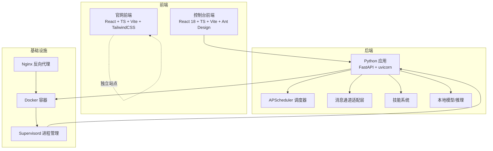
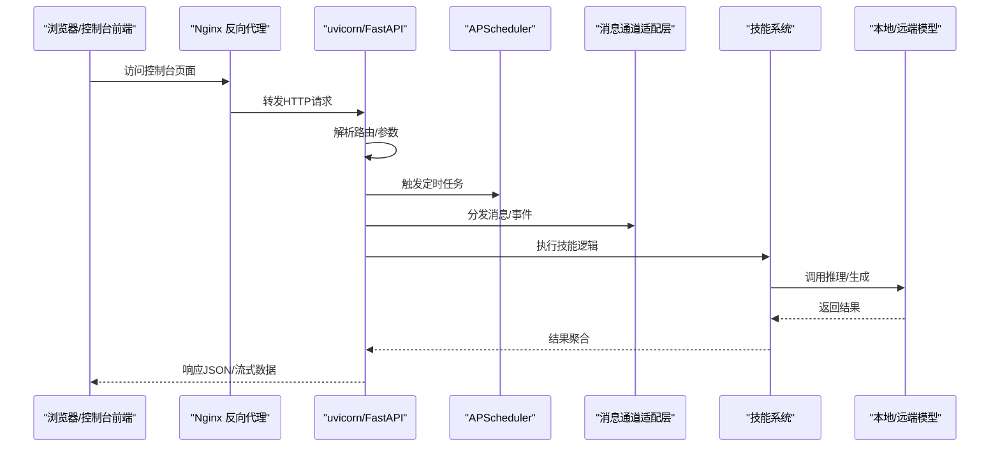
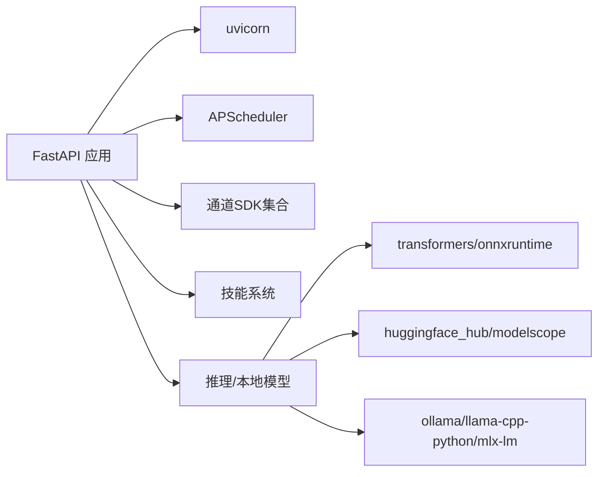
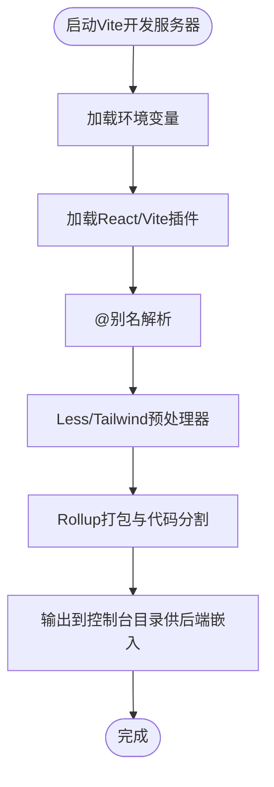
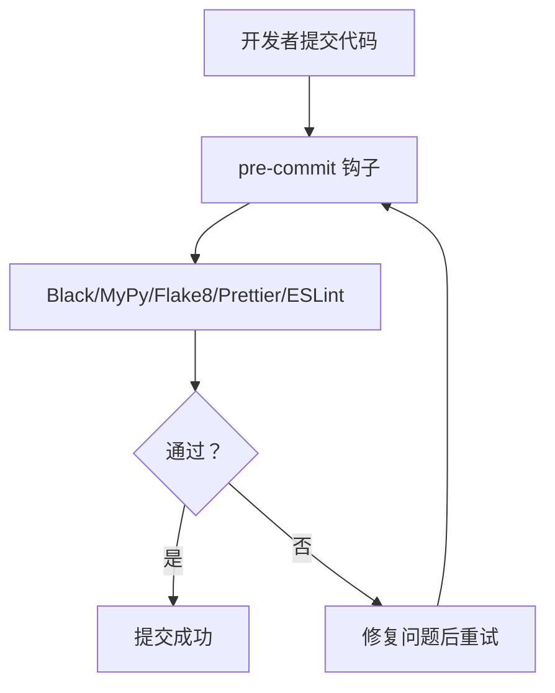
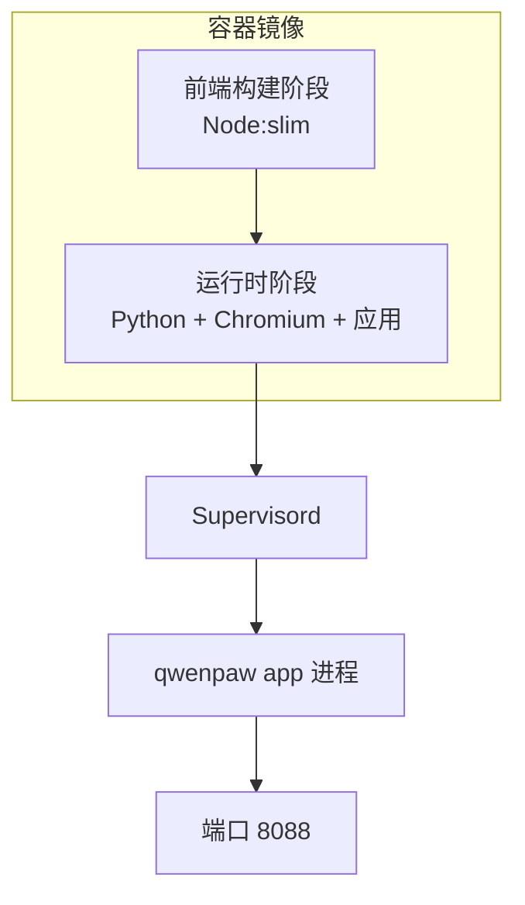
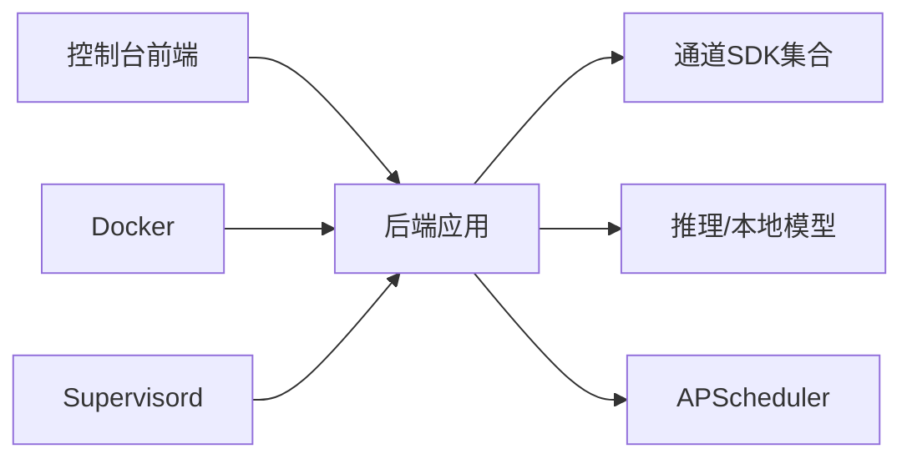

# 技术栈

<cite>
**本文引用的文件**
- [pyproject.toml](file://pyproject.toml)
- [setup.py](file://setup.py)
- [console/package.json](file://console/package.json)
- [console/tsconfig.json](file://console/tsconfig.json)
- [console/vite.config.ts](file://console/vite.config.ts)
- [console/eslint.config.js](file://console/eslint.config.js)
- [website/package.json](file://website/package.json)
- [deploy/Dockerfile](file://deploy/Dockerfile)
- [deploy/config/supervisord.conf.template](file://deploy/config/supervisord.conf.template)
- [docker-compose.yml](file://docker-compose.yml)
- [scripts/run_tests.py](file://scripts/run_tests.py)
- [.pre-commit-config.yaml](file://.pre-commit-config.yaml)
</cite>

## 目录
1. [简介](#简介)
2. [项目结构](#项目结构)
3. [核心组件](#核心组件)
4. [架构总览](#架构总览)
5. [详细组件分析](#详细组件分析)
6. [依赖分析](#依赖分析)
7. [性能考虑](#性能考虑)
8. [故障排查指南](#故障排查指南)
9. [结论](#结论)
10. [附录：版本兼容性矩阵与依赖管理策略](#附录版本兼容性矩阵与依赖管理策略)

## 简介
本文件面向QwenPaw项目的开发者与运维人员，系统梳理并解释后端（Python/FastAPI）、前端（React/TypeScript/Ant Design/Vite）、开发工具链（Black/MyPy/Pytest/Coverage）、以及部署（Docker/Nginx/Supervisord）等技术栈，给出版本兼容性建议、依赖管理策略与安全更新机制，帮助团队在本地与生产环境稳定运行与演进。

## 项目结构
QwenPaw采用前后端分离与多语言混合架构：
- 后端：Python 3.10–3.13，基于FastAPI生态（uvicorn），提供REST与流式接口；集成调度器、消息通道、技能系统与本地模型能力。
- 前端：控制台使用React 18 + TypeScript + Vite + Ant Design 5，网站使用React + Vite + TailwindCSS（独立站点）。
- 部署：Docker多阶段构建，Supervisord管理进程，支持容器内Chromium与桌面环境模拟（Xvfb/xfce4）。
- 测试与质量：pytest + pytest-asyncio + pytest-cov，配合pre-commit钩子（Black、MyPy、Flake8、Prettier等）。

图表来源
- [deploy/Dockerfile:1-103](file://deploy/Dockerfile#L1-L103)
- [deploy/config/supervisord.conf.template:1-40](file://deploy/config/supervisord.conf.template#L1-L40)
- [console/package.json:1-62](file://console/package.json#L1-L62)
- [website/package.json:1-51](file://website/package.json#L1-L51)
- [pyproject.toml:1-111](file://pyproject.toml#L1-L111)

章节来源
- [pyproject.toml:1-111](file://pyproject.toml#L1-L111)
- [console/package.json:1-62](file://console/package.json#L1-L62)
- [website/package.json:1-51](file://website/package.json#L1-L51)
- [deploy/Dockerfile:1-103](file://deploy/Dockerfile#L1-L103)
- [deploy/config/supervisord.conf.template:1-40](file://deploy/config/supervisord.conf.template#L1-L40)
- [docker-compose.yml:1-23](file://docker-compose.yml#L1-L23)

## 核心组件
- 后端运行时与框架
  - Python 版本：>=3.10,<3.14（确保与uvicorn、onnxruntime等依赖兼容）
  - Web 框架：FastAPI（通过uvicorn运行）
  - 异步与并发：httpx、aiofiles、apscheduler（定时任务）
  - 多协议通道：Discord、Telegram、钉钉、飞书、企业微信、QQ、Matrix、MQTT、OneBot等SDK
  - 推理与本地模型：transformers、onnxruntime、huggingface_hub、modelscope、ollama、llama-cpp-python、mlx-lm（可选）
  - 工具与媒体：playwright（Chromium）、pillow、mss（截图）、pywebview（桌面）
  - 安全与密钥：cryptography、keyring、python-dotenv
- 前端控制台
  - React 18、TypeScript ~5.8、Vite 6.x
  - UI 框架：Ant Design 5 + @ant-design/icons + antd-style
  - 构建与样式：Less、TailwindCSS（按需）、ESLint + Prettier
- 开发工具链
  - Black、MyPy、Flake8、Pylint、ESLint、Prettier
  - pytest + pytest-asyncio + pytest-cov（覆盖率）
- 部署
  - Docker 多阶段构建，Supervisord 管理应用与桌面环境（Xvfb/xfce4），可选Nginx反代

章节来源
- [pyproject.toml:6-46](file://pyproject.toml#L6-L46)
- [pyproject.toml:75-103](file://pyproject.toml#L75-L103)
- [console/package.json:18-59](file://console/package.json#L18-L59)
- [console/vite.config.ts:1-109](file://console/vite.config.ts#L1-L109)
- [console/eslint.config.js:1-29](file://console/eslint.config.js#L1-L29)
- [scripts/run_tests.py:105-111](file://scripts/run_tests.py#L105-L111)
- [.pre-commit-config.yaml:1-121](file://.pre-commit-config.yaml#L1-L121)

## 架构总览
下图展示从浏览器到后端服务、再到多通道适配与技能执行的整体流程，以及容器化与进程管理的关键节点。

图表来源
- [deploy/Dockerfile:94-102](file://deploy/Dockerfile#L94-L102)
- [deploy/config/supervisord.conf.template:14-21](file://deploy/config/supervisord.conf.template#L14-L21)
- [pyproject.toml:15-46](file://pyproject.toml#L15-L46)

## 详细组件分析

### 后端技术栈与依赖
- Python与包管理
  - 使用setuptools构建，动态版本由包内版本模块提供
  - 通过可选组区分功能集：dev、local、llamacpp、mlx、ollama、whisper、full
- Web与异步
  - FastAPI + uvicorn（生产运行）
  - httpx用于HTTP客户端，aiofiles用于异步文件操作
- 调度与任务
  - apscheduler用于定时任务与心跳
- 通道与消息
  - 多平台SDK统一接入（Discord、Telegram、钉钉、飞书、企业微信、QQ、Matrix、MQTT、OneBot等）
- 推理与本地模型
  - transformers、huggingface_hub、modelscope用于远程模型
  - onnxruntime限制版本上限以避免已知问题
  - 可选：ollama、llama-cpp-python、mlx-lm（macOS）
- 工具与媒体
  - playwright（Chromium）、pillow、mss、pywebview
- 安全与密钥
  - cryptography、keyring、python-dotenv

图表来源
- [pyproject.toml:7-46](file://pyproject.toml#L7-L46)
- [pyproject.toml:75-103](file://pyproject.toml#L75-L103)

章节来源
- [pyproject.toml:1-111](file://pyproject.toml#L1-L111)
- [setup.py:1-5](file://setup.py#L1-L5)

### 前端技术栈与构建
- 控制台前端
  - React 18、TypeScript ~5.8、Vite 6.x
  - UI：Ant Design 5、@ant-design/icons、antd-style
  - 构建：Vite + React插件；Less启用；ESLint + Prettier
  - 代码拆分：按功能域拆分为react-vendor、ui-vendor、i18n-vendor、markdown-vendor、dnd-vendor、utils-vendor等
- 官网前端
  - React + Vite + TailwindCSS，Mermaid、Syntax Highlight等生态

图表来源
- [console/vite.config.ts:1-109](file://console/vite.config.ts#L1-L109)
- [console/package.json:18-59](file://console/package.json#L18-L59)
- [console/tsconfig.json:1-8](file://console/tsconfig.json#L1-L8)

章节来源
- [console/package.json:1-62](file://console/package.json#L1-L62)
- [console/tsconfig.json:1-8](file://console/tsconfig.json#L1-L8)
- [console/vite.config.ts:1-109](file://console/vite.config.ts#L1-L109)
- [console/eslint.config.js:1-29](file://console/eslint.config.js#L1-L29)
- [website/package.json:1-51](file://website/package.json#L1-L51)

### 开发工具链
- 代码格式化与静态检查
  - Black、Flake8、Pylint（禁用部分规则以提升开发效率）
  - MyPy（忽略缺失导入、跳过跟随导入等，聚焦业务代码）
  - ESLint + Prettier（TS/TSX）
- 提交前钩子
  - pre-commit：YAML/XML/JSON校验、添加尾随逗号、AST/Docstring检查、私钥检测、行尾空白清理
- 测试
  - pytest + asyncio模式自动；pytest-cov生成覆盖率报告；支持并行（pytest-xdist）

图表来源
- [.pre-commit-config.yaml:1-121](file://.pre-commit-config.yaml#L1-L121)
- [scripts/run_tests.py:105-111](file://scripts/run_tests.py#L105-L111)

章节来源
- [.pre-commit-config.yaml:1-121](file://.pre-commit-config.yaml#L1-L121)
- [scripts/run_tests.py:105-111](file://scripts/run_tests.py#L105-L111)

### 部署技术栈
- Docker容器化
  - 多阶段构建：先构建控制台前端产物，再安装Python运行时与应用
  - 注入前端dist至后端包内，避免额外拷贝步骤
  - 安装Chromium与桌面依赖，设置PLAYWRIGHT相关环境变量
- Supervisord进程管理
  - 管理dbus、xvfb、xfce4与主应用进程，设置DISPLAY与Chromium路径
- docker-compose
  - 默认映射127.0.0.1:8088:8088，挂载工作目录与密钥目录
- Nginx
  - 可选作为反向代理（示例未包含具体配置文件，但容器暴露8088端口）

图表来源
- [deploy/Dockerfile:1-103](file://deploy/Dockerfile#L1-L103)
- [deploy/config/supervisord.conf.template:1-40](file://deploy/config/supervisord.conf.template#L1-L40)
- [docker-compose.yml:1-23](file://docker-compose.yml#L1-L23)

章节来源
- [deploy/Dockerfile:1-103](file://deploy/Dockerfile#L1-L103)
- [deploy/config/supervisord.conf.template:1-40](file://deploy/config/supervisord.conf.template#L1-L40)
- [docker-compose.yml:1-23](file://docker-compose.yml#L1-L23)

## 依赖分析
- 组件耦合
  - 后端对通道SDK存在直接依赖，建议通过抽象接口隔离不同渠道差异
  - 前端控制台与后端API通过REST交互，建议明确版本与兼容策略
- 外部依赖与集成点
  - Playwright依赖系统Chromium，容器中已预置并设置环境变量
  - 本地模型可选组件（ollama、llama-cpp-python、mlx-lm）通过可选依赖组启用
- 循环依赖
  - 未见明显循环导入；建议持续通过MyPy与静态检查监控

图表来源
- [pyproject.toml:7-46](file://pyproject.toml#L7-L46)
- [deploy/Dockerfile:74-78](file://deploy/Dockerfile#L74-L78)
- [deploy/config/supervisord.conf.template:14-21](file://deploy/config/supervisord.conf.template#L14-L21)

章节来源
- [pyproject.toml:1-111](file://pyproject.toml#L1-L111)
- [deploy/Dockerfile:74-78](file://deploy/Dockerfile#L74-L78)
- [deploy/config/supervisord.conf.template:14-21](file://deploy/config/supervisord.conf.template#L14-L21)

## 性能考虑
- 前端构建优化
  - 通过Vite的manualChunks策略将React、Ant Design、Markdown、i18n、拖拽与工具库拆分为独立vendor块，减少重复打包与缓存失效
  - 生产环境按需开启SourceMap，平衡调试与体积
- 后端异步与并发
  - 使用httpx与aiofiles进行IO密集型操作；合理配置uvicorn工作进程数
  - 定时任务使用APScheduler，注意任务粒度与资源占用
- 本地模型推理
  - onnxruntime版本上限限制避免已知问题；根据硬件选择ollama或llama-cpp-python或mlx-lm（macOS）
- 容器与桌面环境
  - Xvfb/xfce4仅在容器内启用，避免不必要的资源消耗；仅在需要无头浏览器/桌面交互时开启

## 故障排查指南
- 测试运行失败
  - 确认已安装开发依赖（含pytest、pytest-asyncio、pytest-cov、pytest-xdist）
  - 使用脚本提供的子命令分别运行单元/集成测试，并可开启覆盖率与并行
- 依赖冲突或版本问题
  - 关注onnxruntime上限与anyio范围限制；如遇异常，优先回退到受支持范围内的版本
- 容器内Chromium无法启动
  - 确认PLAYWRIGHT_CHROMIUM_EXECUTABLE_PATH与QWENPAW_RUNNING_IN_CONTAINER已正确设置
  - 检查Supervisord日志中xvfb/xfce4是否正常启动
- 权限与端口
  - docker-compose默认绑定127.0.0.1:8088，请确认宿主机端口未被占用

章节来源
- [scripts/run_tests.py:63-74](file://scripts/run_tests.py#L63-L74)
- [scripts/run_tests.py:148-173](file://scripts/run_tests.py#L148-L173)
- [pyproject.toml:44-46](file://pyproject.toml#L44-L46)
- [deploy/Dockerfile:74-78](file://deploy/Dockerfile#L74-L78)
- [deploy/config/supervisord.conf.template:23-39](file://deploy/config/supervisord.conf.template#L23-L39)
- [docker-compose.yml:14-15](file://docker-compose.yml#L14-L15)

## 结论
QwenPaw采用成熟且互补的技术栈：后端以FastAPI+uvicorn为核心，结合丰富的消息通道与技能系统；前端以React 18 + Ant Design + Vite构建高可用控制台；开发工具链覆盖格式化、静态检查与测试；部署通过Docker与Supervisord实现容器化与进程管理。遵循本文的版本兼容性建议与依赖管理策略，可在本地与生产环境中稳定运行并持续演进。

## 附录：版本兼容性矩阵与依赖管理策略

### 版本兼容性矩阵
- Python
  - 要求：>=3.10,<3.14
  - 建议：在CI与生产中统一使用同一minor版本，避免第三方库的隐式不兼容
- FastAPI/uvicorn
  - uvicorn>=0.40.0；建议与FastAPI主版本保持兼容
- 前端
  - React 18、TypeScript ~5.8、Vite 6.x、Ant Design 5
  - 控制台与官网分别维护独立package.json，避免相互污染
- 本地模型
  - onnxruntime<1.24；ollama>=0.6.1；llama-cpp-python>=0.3.0；mlx-lm>=0.10.0（macOS）
- 其他
  - anyio>=4.0.0,<4.13.0（避免特定版本的取消风暴问题）

章节来源
- [pyproject.toml:6-46](file://pyproject.toml#L6-L46)
- [pyproject.toml:86-103](file://pyproject.toml#L86-L103)
- [console/package.json:35-41](file://console/package.json#L35-L41)
- [website/package.json:25-36](file://website/package.json#L25-L36)

### 依赖管理策略
- 后端
  - 使用可选依赖组按需启用本地模型与功能扩展
  - 通过pyproject.toml集中声明核心依赖与版本范围
- 前端
  - 控制台与官网分别锁定依赖版本，避免跨项目影响
  - Vite配置中启用代码分割与按需加载，降低首屏体积
- 开发与发布
  - pre-commit统一格式化与静态检查；pytest驱动的测试与覆盖率
  - Docker多阶段构建，将前端构建产物注入后端包，简化发布流程

章节来源
- [pyproject.toml:75-103](file://pyproject.toml#L75-L103)
- [console/package.json:1-62](file://console/package.json#L1-L62)
- [console/vite.config.ts:41-106](file://console/vite.config.ts#L41-L106)
- [.pre-commit-config.yaml:1-121](file://.pre-commit-config.yaml#L1-L121)
- [scripts/run_tests.py:105-111](file://scripts/run_tests.py#L105-L111)

### 安全更新机制
- 密钥与安全
  - 使用cryptography与keyring存储敏感信息；dotenv加载环境变量
- 代码扫描与策略
  - 前端：ESLint规则约束；pre-commit禁用私钥与多余空白
  - 后端：Black、MyPy、Flake8、Pylint；忽略非关键规则以提升开发效率
- 供应链安全
  - Docker镜像来自指定registry；容器内Chromium与桌面依赖最小化安装
  - 通过可选依赖组控制功能面，避免引入不必要的高风险组件

章节来源
- [pyproject.toml:36-38](file://pyproject.toml#L36-L38)
- [.pre-commit-config.yaml:23-25](file://.pre-commit-config.yaml#L23-L25)
- [deploy/Dockerfile:29-68](file://deploy/Dockerfile#L29-L68)