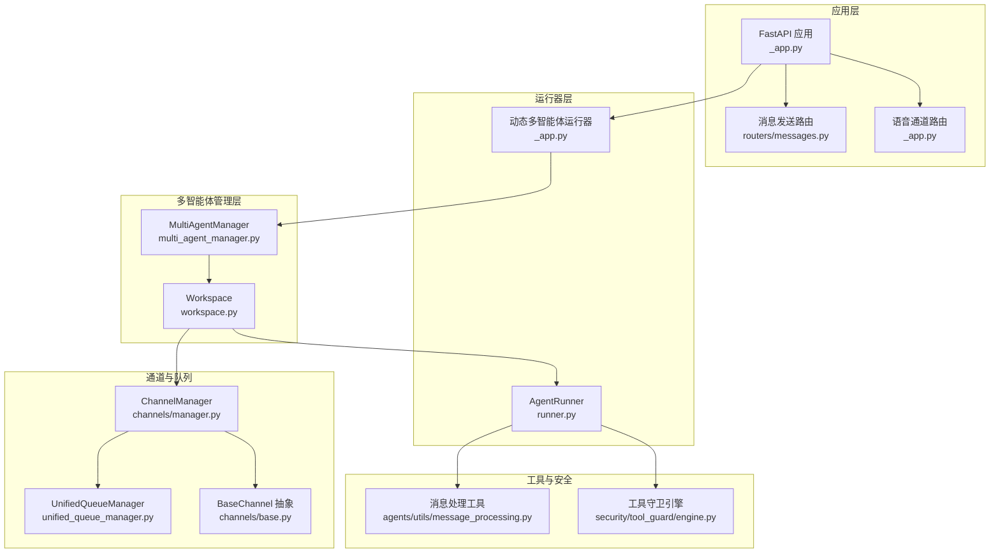
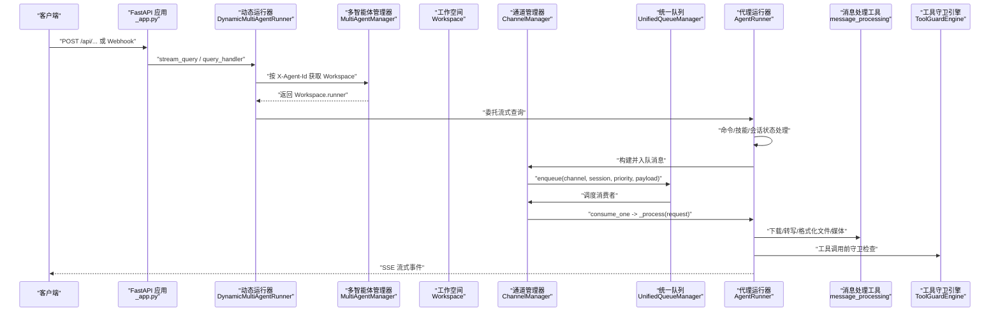
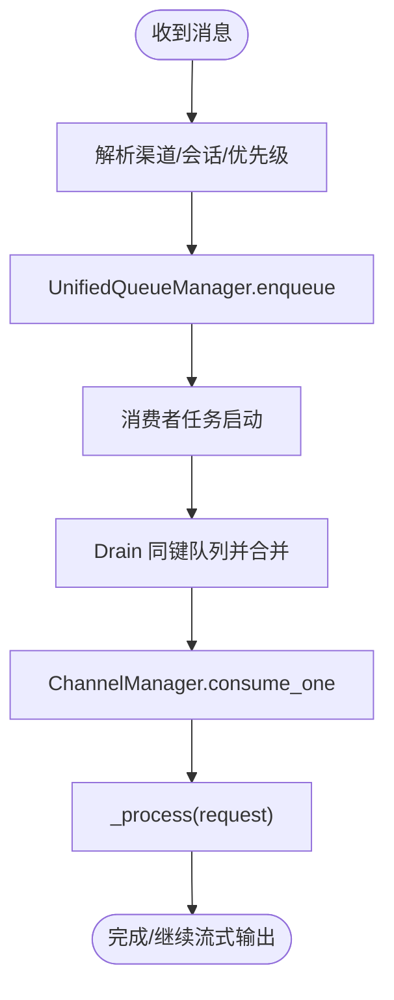
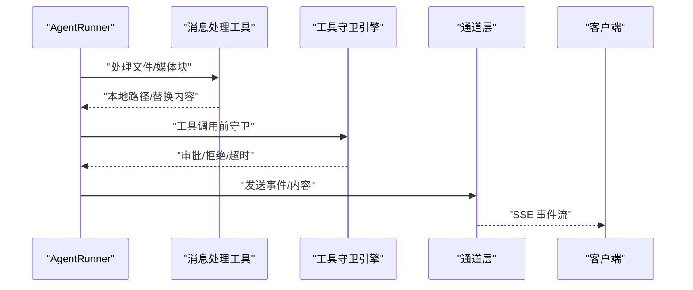
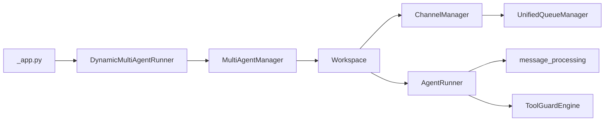

# 数据流架构

<cite>
**本文引用的文件**
- [src/qwenpaw/app/_app.py](file://src/qwenpaw/app/_app.py)
- [src/qwenpaw/app/channels/base.py](file://src/qwenpaw/app/channels/base.py)
- [src/qwenpaw/app/channels/manager.py](file://src/qwenpaw/app/channels/manager.py)
- [src/qwenpaw/app/channels/unified_queue_manager.py](file://src/qwenpaw/app/channels/unified_queue_manager.py)
- [src/qwenpaw/app/runner/runner.py](file://src/qwenpaw/app/runner/runner.py)
- [src/qwenpaw/app/multi_agent_manager.py](file://src/qwenpaw/app/multi_agent_manager.py)
- [src/qwenpaw/app/workspace/workspace.py](file://src/qwenpaw/app/workspace/workspace.py)
- [src/qwenpaw/agents/utils/message_processing.py](file://src/qwenpaw/agents/utils/message_processing.py)
- [src/qwenpaw/app/routers/messages.py](file://src/qwenpaw/app/routers/messages.py)
- [src/qwenpaw/agents/command_handler.py](file://src/qwenpaw/agents/command_handler.py)
- [src/qwenpaw/security/tool_guard/engine.py](file://src/qwenpaw/security/tool_guard/engine.py)
</cite>

## 目录
1. [简介](#简介)
2. [项目结构](#项目结构)
3. [核心组件](#核心组件)
4. [架构总览](#架构总览)
5. [详细组件分析](#详细组件分析)
6. [依赖分析](#依赖分析)
7. [性能考虑](#性能考虑)
8. [故障排查指南](#故障排查指南)
9. [结论](#结论)
10. [附录](#附录)

## 简介
本文件系统性梳理 QwenPaw 的数据流架构，覆盖从用户输入到最终响应的完整路径，包括消息接收、路由分发、代理处理与结果返回；解释文本、多媒体、文件与实时语音等不同数据类型的处理流程；说明同步调用、异步事件与流式处理的协作方式；阐述消息标准化、内容解析与响应生成机制；给出关键数据节点与处理步骤的流程图；记录内存缓存、文件存储与会话持久化的策略；并总结数据安全与隐私保护措施。

## 项目结构
QwenPaw 基于 FastAPI 应用入口，通过多智能体工作空间（Workspace）承载运行时组件：通道管理器（ChannelManager）、统一队列管理器（UnifiedQueueManager）、代理运行器（AgentRunner）、多智能体管理器（MultiAgentManager）以及工作空间（Workspace）。应用层还提供面向外部的消息发送接口与语音通道路由。

图表来源
- [src/qwenpaw/app/_app.py:156-163](file://src/qwenpaw/app/_app.py#L156-L163)
- [src/qwenpaw/app/multi_agent_manager.py:21-90](file://src/qwenpaw/app/multi_agent_manager.py#L21-L90)
- [src/qwenpaw/app/workspace/workspace.py:47-123](file://src/qwenpaw/app/workspace/workspace.py#L47-L123)
- [src/qwenpaw/app/channels/manager.py:68-106](file://src/qwenpaw/app/channels/manager.py#L68-L106)
- [src/qwenpaw/app/channels/unified_queue_manager.py:60-78](file://src/qwenpaw/app/channels/unified_queue_manager.py#L60-L78)
- [src/qwenpaw/app/runner/runner.py:70-112](file://src/qwenpaw/app/runner/runner.py#L70-L112)
- [src/qwenpaw/agents/utils/message_processing.py:388-431](file://src/qwenpaw/agents/utils/message_processing.py#L388-L431)
- [src/qwenpaw/security/tool_guard/engine.py:53-82](file://src/qwenpaw/security/tool_guard/engine.py#L53-L82)

章节来源
- [src/qwenpaw/app/_app.py:424-569](file://src/qwenpaw/app/_app.py#L424-L569)
- [src/qwenpaw/app/multi_agent_manager.py:21-90](file://src/qwenpaw/app/multi_agent_manager.py#L21-L90)
- [src/qwenpaw/app/workspace/workspace.py:47-123](file://src/qwenpaw/app/workspace/workspace.py#L47-L123)
- [src/qwenpaw/app/channels/manager.py:68-106](file://src/qwenpaw/app/channels/manager.py#L68-L106)
- [src/qwenpaw/app/channels/unified_queue_manager.py:60-78](file://src/qwenpaw/app/channels/unified_queue_manager.py#L60-L78)
- [src/qwenpaw/app/runner/runner.py:70-112](file://src/qwenpaw/app/runner/runner.py#L70-L112)
- [src/qwenpaw/agents/utils/message_processing.py:388-431](file://src/qwenpaw/agents/utils/message_processing.py#L388-L431)
- [src/qwenpaw/security/tool_guard/engine.py:53-82](file://src/qwenpaw/security/tool_guard/engine.py#L53-L82)

## 核心组件
- 动态多智能体运行器（DynamicMultiAgentRunner）
  - 负责根据请求中的 Agent 上下文选择具体 Workspace 的 Runner，并代理流式查询与查询处理器。
  - 支持错误回传与流式事件输出。
- 多智能体管理器（MultiAgentManager）
  - 按需加载与启动 Workspace，支持零停机热重载，管理生命周期与清理任务。
- 工作空间（Workspace）
  - 封装独立的运行时组件：Runner、ChannelManager、MemoryManager、MCPClientManager、CronManager。
- 通道管理器（ChannelManager）
  - 统一入队与消费，支持按会话与优先级隔离，注入统一处理函数（AgentRunner.stream_query）。
- 统一队列管理器（UnifiedQueueManager）
  - 基于三元键（渠道、会话、优先级）的动态消费者模型，自动清理空闲队列，支持度量与监控。
- 代理运行器（AgentRunner）
  - 执行命令路径、技能注入、工具守卫审批、会话状态读写与流式输出。
- 消息处理工具（message_processing）
  - 文件/媒体块下载、本地化、音频转写或格式转换、消息内容增强。
- 工具守卫引擎（ToolGuardEngine）
  - 对工具调用参数进行规则与路径检查，支持审批与超时处理。
- 消息发送路由（messages.py）
  - 提供外部主动向指定渠道发送消息的能力，经由 ChannelManager 发送。

章节来源
- [src/qwenpaw/app/_app.py:64-150](file://src/qwenpaw/app/_app.py#L64-L150)
- [src/qwenpaw/app/multi_agent_manager.py:21-90](file://src/qwenpaw/app/multi_agent_manager.py#L21-L90)
- [src/qwenpaw/app/workspace/workspace.py:47-123](file://src/qwenpaw/app/workspace/workspace.py#L47-L123)
- [src/qwenpaw/app/channels/manager.py:68-106](file://src/qwenpaw/app/channels/manager.py#L68-L106)
- [src/qwenpaw/app/channels/unified_queue_manager.py:60-78](file://src/qwenpaw/app/channels/unified_queue_manager.py#L60-L78)
- [src/qwenpaw/app/runner/runner.py:70-112](file://src/qwenpaw/app/runner/runner.py#L70-L112)
- [src/qwenpaw/agents/utils/message_processing.py:388-431](file://src/qwenpaw/agents/utils/message_processing.py#L388-L431)
- [src/qwenpaw/security/tool_guard/engine.py:53-82](file://src/qwenpaw/security/tool_guard/engine.py#L53-L82)
- [src/qwenpaw/app/routers/messages.py:78-187](file://src/qwenpaw/app/routers/messages.py#L78-L187)

## 架构总览
下图展示从用户输入到响应返回的端到端数据流，涵盖同步/异步与流式处理的关键节点。

图表来源
- [src/qwenpaw/app/_app.py:110-139](file://src/qwenpaw/app/_app.py#L110-L139)
- [src/qwenpaw/app/multi_agent_manager.py:38-90](file://src/qwenpaw/app/multi_agent_manager.py#L38-L90)
- [src/qwenpaw/app/channels/manager.py:399-415](file://src/qwenpaw/app/channels/manager.py#L399-L415)
- [src/qwenpaw/app/channels/unified_queue_manager.py:119-163](file://src/qwenpaw/app/channels/unified_queue_manager.py#L119-L163)
- [src/qwenpaw/app/runner/runner.py:349-595](file://src/qwenpaw/app/runner/runner.py#L349-L595)
- [src/qwenpaw/agents/utils/message_processing.py:388-431](file://src/qwenpaw/agents/utils/message_processing.py#L388-L431)
- [src/qwenpaw/security/tool_guard/engine.py:169-226](file://src/qwenpaw/security/tool_guard/engine.py#L169-L226)

## 详细组件分析

### 消息接收与路由分发
- 入口路由
  - 应用注册了统一的 API 路由、代理专用路由与语音通道路由，确保不同来源的消息可被正确接入。
- 动态运行器
  - 根据请求上下文（如 X-Agent-Id）解析当前 Agent，再委托对应 Workspace 的 Runner 执行。
- 通道管理器
  - 通过统一入队接口将消息按（渠道, 会话, 优先级）路由至对应队列，支持批量合并与去抖动。
- 统一队列管理器
  - 按需创建消费者任务，严格序列化相同键的消息，空闲队列定时清理，支持度量统计。

图表来源
- [src/qwenpaw/app/_app.py:80-100](file://src/qwenpaw/app/_app.py#L80-L100)
- [src/qwenpaw/app/channels/manager.py:399-415](file://src/qwenpaw/app/channels/manager.py#L399-L415)
- [src/qwenpaw/app/channels/unified_queue_manager.py:119-163](file://src/qwenpaw/app/channels/unified_queue_manager.py#L119-L163)

章节来源
- [src/qwenpaw/app/_app.py:424-569](file://src/qwenpaw/app/_app.py#L424-L569)
- [src/qwenpaw/app/channels/manager.py:39-66](file://src/qwenpaw/app/channels/manager.py#L39-L66)
- [src/qwenpaw/app/channels/unified_queue_manager.py:119-163](file://src/qwenpaw/app/channels/unified_queue_manager.py#L119-L163)

### 代理处理与结果返回
- 代理运行器
  - 解析命令与技能注入，加载会话状态，重建系统提示，流式打印消息并产出事件。
  - 处理工具守卫审批与超时，必要时清理会话记忆。
- 消息处理工具
  - 下载文件/媒体至本地，音频转写或格式转换，补充“文件已下载”通知，保持消息一致性。
- 工具守卫引擎
  - 在工具调用前进行规则与路径检查，支持审批与超时处理，保障安全可控。

图表来源
- [src/qwenpaw/app/runner/runner.py:349-595](file://src/qwenpaw/app/runner/runner.py#L349-L595)
- [src/qwenpaw/agents/utils/message_processing.py:388-431](file://src/qwenpaw/agents/utils/message_processing.py#L388-L431)
- [src/qwenpaw/security/tool_guard/engine.py:169-226](file://src/qwenpaw/security/tool_guard/engine.py#L169-L226)

章节来源
- [src/qwenpaw/app/runner/runner.py:349-595](file://src/qwenpaw/app/runner/runner.py#L349-L595)
- [src/qwenpaw/agents/utils/message_processing.py:388-431](file://src/qwenpaw/agents/utils/message_processing.py#L388-L431)
- [src/qwenpaw/security/tool_guard/engine.py:169-226](file://src/qwenpaw/security/tool_guard/engine.py#L169-L226)

### 不同类型数据的处理流程
- 文本消息
  - 直接进入统一队列，按会话与优先级串行处理，支持命令检测与技能注入。
- 多媒体内容
  - 图片/视频/音频块下载至本地，音频根据配置模式进行转写或格式转换，随后以文本占位或本地 URL 形式参与后续处理。
- 文件传输
  - 支持 base64 与 URL 两种源，下载后更新消息块并插入“文件已下载”提示。
- 实时语音
  - 依据音频模式（自动/原生）决定转写或直接发送；若原生模式且不支持则降级为占位提示。

章节来源
- [src/qwenpaw/agents/utils/message_processing.py:25-74](file://src/qwenpaw/agents/utils/message_processing.py#L25-L74)
- [src/qwenpaw/agents/utils/message_processing.py:231-304](file://src/qwenpaw/agents/utils/message_processing.py#L231-L304)
- [src/qwenpaw/agents/utils/message_processing.py:388-431](file://src/qwenpaw/agents/utils/message_processing.py#L388-L431)

### 数据转换与格式化机制
- 消息标准化
  - 通道层将原生负载转换为统一的 AgentRequest，使用标准内容类型（文本/图片/音频/视频/文件/拒绝）。
- 内容解析
  - 针对文件/媒体块提取源信息与文件名，下载至本地并更新消息块；音频块根据模式进行转写或格式转换。
- 响应生成
  - 运行器流式输出事件，通道层将其封装为 SSE 事件字符串，客户端按事件流渲染。

章节来源
- [src/qwenpaw/app/channels/base.py:569-631](file://src/qwenpaw/app/channels/base.py#L569-L631)
- [src/qwenpaw/app/channels/base.py:446-535](file://src/qwenpaw/app/channels/base.py#L446-L535)
- [src/qwenpaw/agents/utils/message_processing.py:388-431](file://src/qwenpaw/agents/utils/message_processing.py#L388-L431)

### 数据持久化策略
- 会话状态
  - 运行器在查询前后加载/保存会话状态，确保上下文连续性与可恢复性。
- 会话历史
  - 支持导出/导入历史记录，便于调试与迁移。
- 队列与资源
  - 统一队列管理器在空闲超时后清理消费者与队列，避免资源泄漏；多智能体管理器在热重载时采用延迟清理策略，保证零停机。

章节来源
- [src/qwenpaw/app/runner/runner.py:522-595](file://src/qwenpaw/app/runner/runner.py#L522-L595)
- [src/qwenpaw/app/channels/unified_queue_manager.py:376-428](file://src/qwenpaw/app/channels/unified_queue_manager.py#L376-L428)
- [src/qwenpaw/app/multi_agent_manager.py:91-187](file://src/qwenpaw/app/multi_agent_manager.py#L91-L187)

### 数据安全与隐私保护
- 工具守卫
  - 对工具调用参数进行规则与路径检查，支持审批与超时处理，防止高危操作。
- 访问控制
  - 通道层支持白名单/黑名单与提及策略，限制消息来源与目标。
- 审计与日志
  - 关键操作（启动、停止、重载、错误）均记录日志，便于审计与排障。

章节来源
- [src/qwenpaw/security/tool_guard/engine.py:169-226](file://src/qwenpaw/security/tool_guard/engine.py#L169-L226)
- [src/qwenpaw/app/channels/base.py:283-318](file://src/qwenpaw/app/channels/base.py#L283-L318)
- [src/qwenpaw/app/_app.py:166-422](file://src/qwenpaw/app/_app.py#L166-L422)

## 依赖分析
- 组件耦合
  - 应用层仅依赖动态运行器与多智能体管理器；运行器依赖工作空间内的通道与内存管理；通道层依赖统一队列实现并发与隔离。
- 外部依赖
  - 使用 Agentscope Runtime 的 Runner 与 Schema；FastAPI 提供路由与中间件；ffmpeg 用于音频格式转换。
- 循环依赖
  - 通过服务管理器与延迟初始化避免循环依赖；通道层与运行器通过回调与接口解耦。

图表来源
- [src/qwenpaw/app/_app.py:156-163](file://src/qwenpaw/app/_app.py#L156-L163)
- [src/qwenpaw/app/multi_agent_manager.py:21-90](file://src/qwenpaw/app/multi_agent_manager.py#L21-L90)
- [src/qwenpaw/app/workspace/workspace.py:47-123](file://src/qwenpaw/app/workspace/workspace.py#L47-L123)
- [src/qwenpaw/app/channels/manager.py:68-106](file://src/qwenpaw/app/channels/manager.py#L68-L106)
- [src/qwenpaw/app/channels/unified_queue_manager.py:60-78](file://src/qwenpaw/app/channels/unified_queue_manager.py#L60-L78)
- [src/qwenpaw/app/runner/runner.py:70-112](file://src/qwenpaw/app/runner/runner.py#L70-L112)
- [src/qwenpaw/agents/utils/message_processing.py:388-431](file://src/qwenpaw/agents/utils/message_processing.py#L388-L431)
- [src/qwenpaw/security/tool_guard/engine.py:53-82](file://src/qwenpaw/security/tool_guard/engine.py#L53-L82)

章节来源
- [src/qwenpaw/app/_app.py:156-163](file://src/qwenpaw/app/_app.py#L156-L163)
- [src/qwenpaw/app/multi_agent_manager.py:21-90](file://src/qwenpaw/app/multi_agent_manager.py#L21-L90)
- [src/qwenpaw/app/workspace/workspace.py:47-123](file://src/qwenpaw/app/workspace/workspace.py#L47-L123)
- [src/qwenpaw/app/channels/manager.py:68-106](file://src/qwenpaw/app/channels/manager.py#L68-L106)
- [src/qwenpaw/app/channels/unified_queue_manager.py:60-78](file://src/qwenpaw/app/channels/unified_queue_manager.py#L60-L78)
- [src/qwenpaw/app/runner/runner.py:70-112](file://src/qwenpaw/app/runner/runner.py#L70-L112)
- [src/qwenpaw/agents/utils/message_processing.py:388-431](file://src/qwenpaw/agents/utils/message_processing.py#L388-L431)
- [src/qwenpaw/security/tool_guard/engine.py:53-82](file://src/qwenpaw/security/tool_guard/engine.py#L53-L82)

## 性能考虑
- 并发与隔离
  - 统一队列按（渠道, 会话, 优先级）隔离，避免跨会话争用；消费者按需创建，减少固定线程池开销。
- 批量合并
  - 同键队列批量拉取并合并快速消息（如图片），降低处理次数与上下文切换成本。
- 资源回收
  - 空闲队列定时清理，避免长期占用内存；热重载采用延迟清理，保证零停机。
- I/O 优化
  - 文件/媒体下载采用异步线程池与临时文件策略，音频转换使用 ffmpeg，失败时降级为占位提示。

## 故障排查指南
- 常见问题定位
  - 队列阻塞：查看统一队列指标与空闲清理日志，确认是否因队列满或消费者异常导致。
  - 代理异常：检查运行器错误捕获与调试转储路径，关注会话状态加载/保存异常。
  - 工具调用失败：核对工具守卫规则与审批状态，确认超时与拒绝原因。
- 排查步骤
  - 启用更详细日志级别，观察通道层去抖动与合并逻辑是否触发。
  - 使用会话导出/导入功能复现问题，核对消息内容与媒体块状态。
  - 检查 ffmpeg 是否可用，确认音频模式配置与转换日志。

章节来源
- [src/qwenpaw/app/channels/unified_queue_manager.py:430-471](file://src/qwenpaw/app/channels/unified_queue_manager.py#L430-L471)
- [src/qwenpaw/app/runner/runner.py:554-587](file://src/qwenpaw/app/runner/runner.py#L554-L587)
- [src/qwenpaw/security/tool_guard/engine.py:169-226](file://src/qwenpaw/security/tool_guard/engine.py#L169-L226)

## 结论
QwenPaw 的数据流架构以统一队列与通道层为核心，结合动态多智能体运行器与工作空间，实现了高并发、低耦合、可扩展的消息处理链路。通过命令/技能注入、工具守卫与会话状态持久化，系统在保证安全性的同时提供了灵活的代理能力；通过流式事件与 SSE 输出，前端可获得一致的交互体验。建议在生产环境中启用监控与日志审计，持续优化队列容量与消费者策略，以应对峰值流量与复杂消息形态。

## 附录
- 外部主动发送消息
  - 通过消息发送路由，可按渠道、用户与会话 ID 主动推送文本消息，适用于定时任务与后台通知场景。

章节来源
- [src/qwenpaw/app/routers/messages.py:78-187](file://src/qwenpaw/app/routers/messages.py#L78-L187)