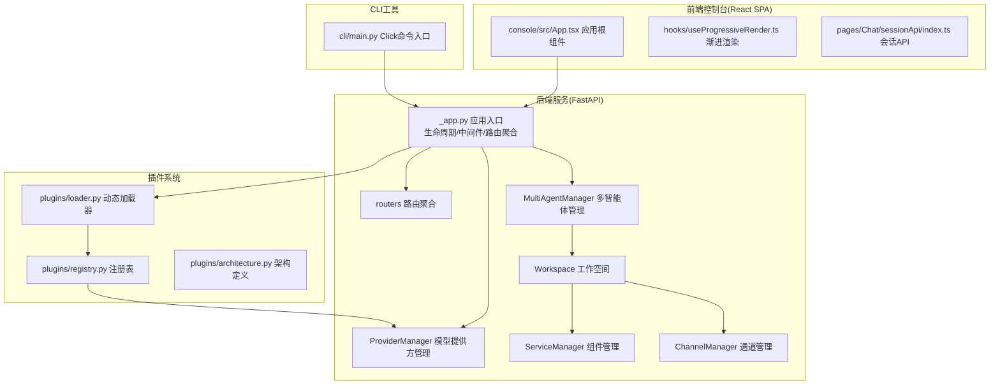
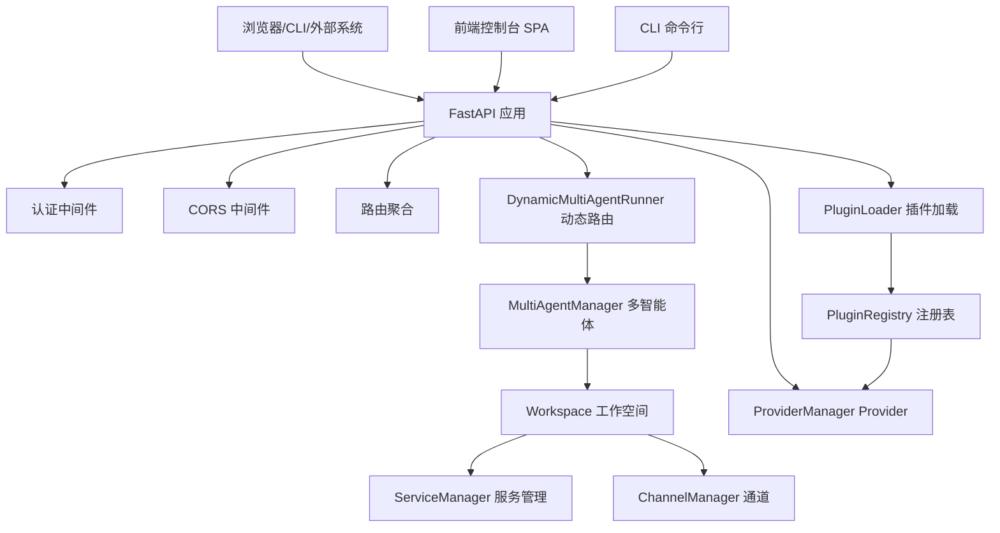
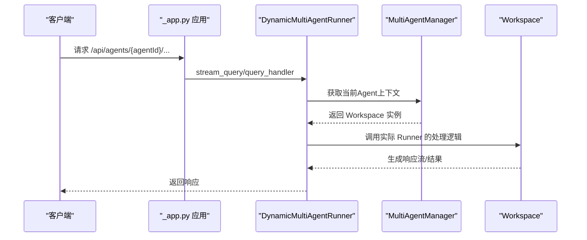
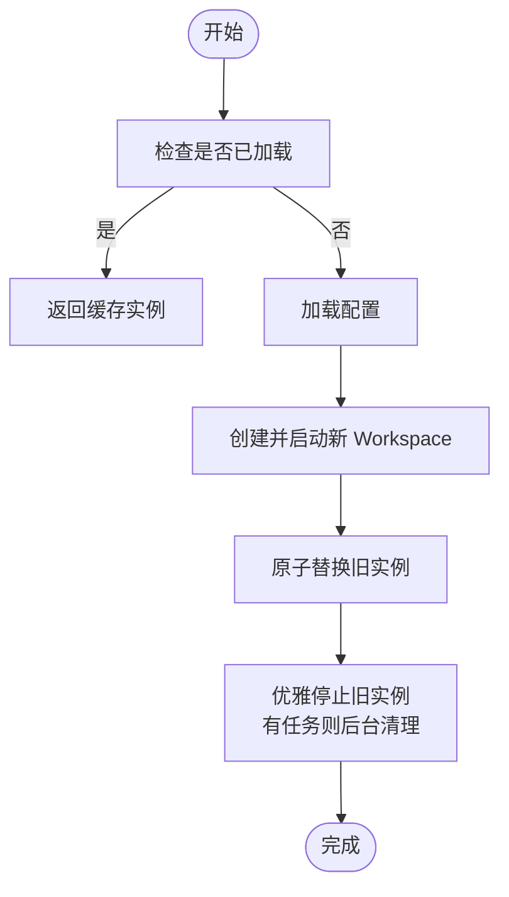
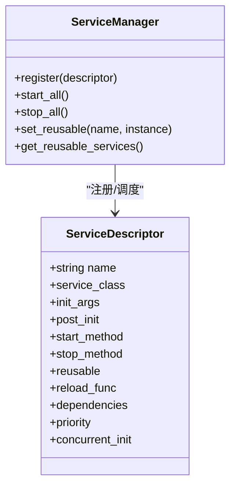
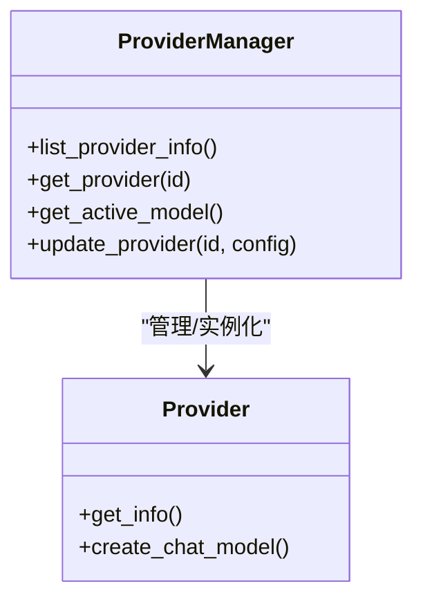
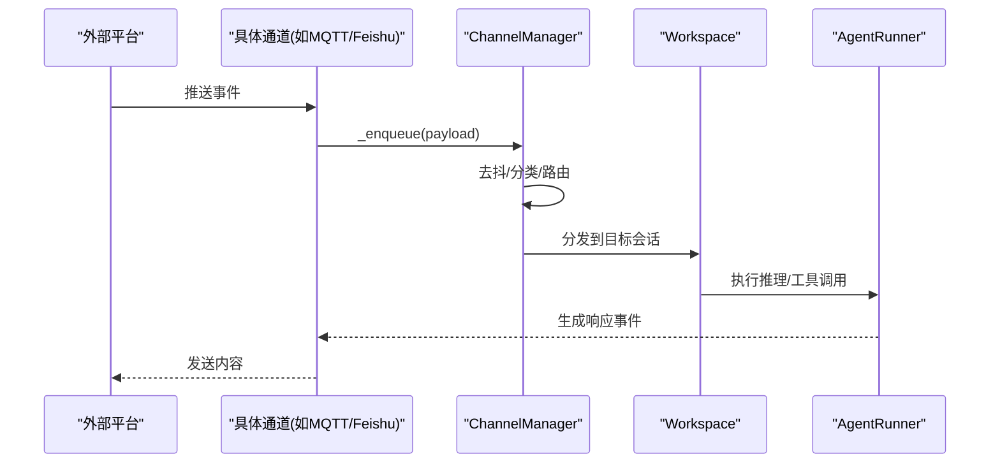
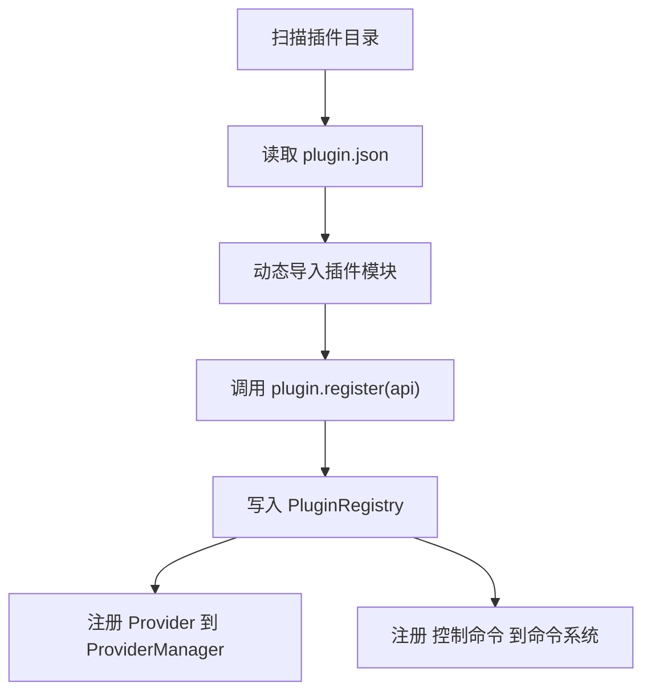
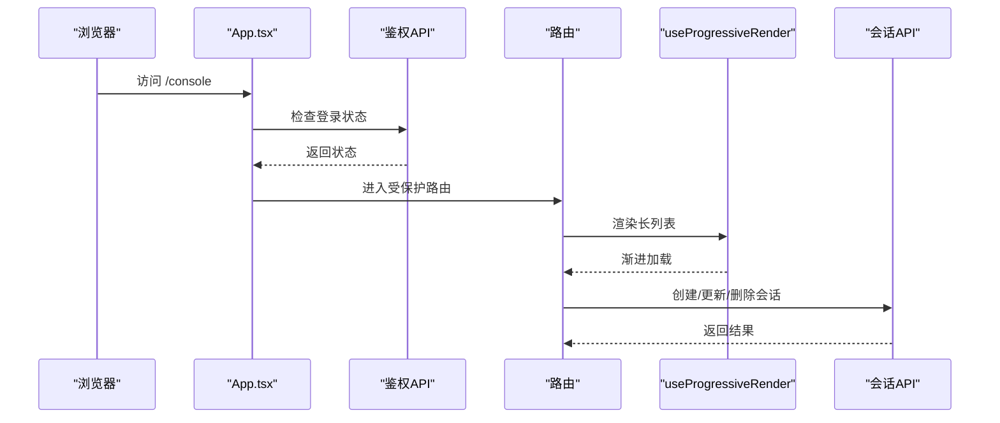
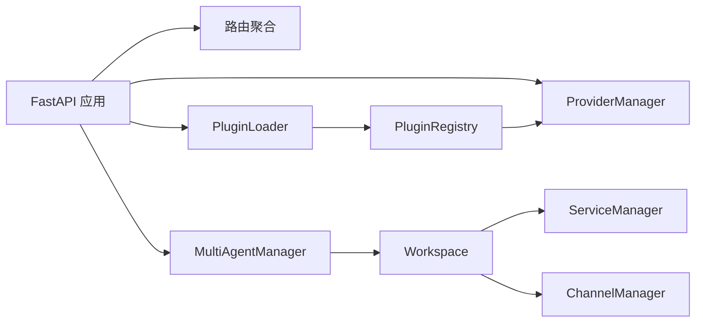

# 整体设计

<cite>
**本文引用的文件**
- [src/qwenpaw/__init__.py](file://src/qwenpaw/__init__.py)
- [src/qwenpaw/app/_app.py](file://src/qwenpaw/app/_app.py)
- [src/qwenpaw/cli/main.py](file://src/qwenpaw/cli/main.py)
- [console/src/App.tsx](file://console/src/App.tsx)
- [src/qwenpaw/plugins/architecture.py](file://src/qwenpaw/plugins/architecture.py)
- [src/qwenpaw/app/routers/__init__.py](file://src/qwenpaw/app/routers/__init__.py)
- [src/qwenpaw/plugins/loader.py](file://src/qwenpaw/plugins/loader.py)
- [src/qwenpaw/providers/provider_manager.py](file://src/qwenpaw/providers/provider_manager.py)
- [src/qwenpaw/app/multi_agent_manager.py](file://src/qwenpaw/app/multi_agent_manager.py)
- [src/qwenpaw/constant.py](file://src/qwenpaw/constant.py)
- [src/qwenpaw/config/config.py](file://src/qwenpaw/config/config.py)
- [src/qwenpaw/app/workspace/workspace.py](file://src/qwenpaw/app/workspace/workspace.py)
- [src/qwenpaw/app/workspace/service_manager.py](file://src/qwenpaw/app/workspace/service_manager.py)
- [src/qwenpaw/app/channels/base.py](file://src/qwenpaw/app/channels/base.py)
- [src/qwenpaw/app/channels/manager.py](file://src/qwenpaw/app/channels/manager.py)
- [src/qwenpaw/app/channels/mqtt/channel.py](file://src/qwenpaw/app/channels/mqtt/channel.py)
- [src/qwenpaw/app/channels/feishu/channel.py](file://src/qwenpaw/app/channels/feishu/channel.py)
- [src/qwenpaw/agents/tools/browser_control.py](file://src/qwenpaw/agents/tools/browser_control.py)
- [console/src/hooks/useProgressiveRender.ts](file://console/src/hooks/useProgressiveRender.ts)
- [console/src/pages/Chat/sessionApi/index.ts](file://console/src/pages/Chat/sessionApi/index.ts)
</cite>

## 目录
1. [引言](#引言)
2. [项目结构](#项目结构)
3. [核心组件](#核心组件)
4. [架构总览](#架构总览)
5. [详细组件分析](#详细组件分析)
6. [依赖分析](#依赖分析)
7. [性能考虑](#性能考虑)
8. [故障排查指南](#故障排查指南)
9. [结论](#结论)
10. [附录](#附录)

## 引言
本文件面向QwenPaw的整体设计，系统化阐述其架构理念与实现方式。QwenPaw采用微服务化与事件驱动相结合的架构，围绕“多智能体工作空间”构建统一运行时，通过插件化扩展能力，并以模块化、松耦合、可扩展性与安全为核心设计原则。系统边界清晰地划分为：后端服务（FastAPI）、前端控制台（React SPA）、桌面应用（打包产物）与CLI工具（命令行入口）。在设计模式层面，系统广泛采用工厂模式（Provider/Service）、观察者模式（事件监听与回调）、依赖注入（ServiceManager）与策略模式（模型路由与通道策略），并在性能、可维护性与可扩展性之间取得平衡。

## 项目结构
QwenPaw的工程由Python后端、TypeScript前端控制台、CLI与插件体系构成，采用分层与功能域结合的组织方式：
- 后端服务：基于FastAPI，提供REST API与事件路由；包含多智能体管理、通道管理、定时任务、MCP客户端、本地模型与Provider管理等子系统。
- 前端控制台：React + Ant Design，SPA路由，提供聊天、代理配置、技能管理、通道与计划任务等界面。
- CLI工具：Click封装的命令组，支持启动、停止、安装插件、管理频道、任务与更新等。
- 插件系统：动态加载、注册Provider与控制命令，支持启动/关闭钩子，实现能力扩展与隔离。

**图表来源**
- [src/qwenpaw/app/_app.py:424-569](file://src/qwenpaw/app/_app.py#L424-L569)
- [src/qwenpaw/app/routers/__init__.py:1-60](file://src/qwenpaw/app/routers/__init__.py#L1-L60)
- [src/qwenpaw/providers/provider_manager.py:670-800](file://src/qwenpaw/providers/provider_manager.py#L670-L800)
- [src/qwenpaw/app/multi_agent_manager.py:21-470](file://src/qwenpaw/app/multi_agent_manager.py#L21-L470)
- [src/qwenpaw/app/workspace/workspace.py:47-200](file://src/qwenpaw/app/workspace/workspace.py#L47-L200)
- [src/qwenpaw/app/workspace/service_manager.py:74-289](file://src/qwenpaw/app/workspace/service_manager.py#L74-L289)
- [src/qwenpaw/app/channels/manager.py:234-278](file://src/qwenpaw/app/channels/manager.py#L234-L278)
- [console/src/App.tsx:1-196](file://console/src/App.tsx#L1-L196)
- [console/src/hooks/useProgressiveRender.ts:1-51](file://console/src/hooks/useProgressiveRender.ts#L1-L51)
- [console/src/pages/Chat/sessionApi/index.ts:667-712](file://console/src/pages/Chat/sessionApi/index.ts#L667-L712)
- [src/qwenpaw/cli/main.py:58-171](file://src/qwenpaw/cli/main.py#L58-L171)
- [src/qwenpaw/plugins/loader.py:19-241](file://src/qwenpaw/plugins/loader.py#L19-L241)
- [src/qwenpaw/plugins/registry.py:62-147](file://src/qwenpaw/plugins/registry.py#L62-L147)
- [src/qwenpaw/plugins/architecture.py:9-55](file://src/qwenpaw/plugins/architecture.py#L9-L55)

**章节来源**
- [src/qwenpaw/app/_app.py:424-569](file://src/qwenpaw/app/_app.py#L424-L569)
- [src/qwenpaw/app/routers/__init__.py:1-60](file://src/qwenpaw/app/routers/__init__.py#L1-L60)
- [console/src/App.tsx:1-196](file://console/src/App.tsx#L1-L196)
- [src/qwenpaw/cli/main.py:58-171](file://src/qwenpaw/cli/main.py#L58-L171)
- [src/qwenpaw/plugins/loader.py:19-241](file://src/qwenpaw/plugins/loader.py#L19-L241)

## 核心组件
- 应用入口与生命周期：FastAPI应用在生命周期中完成多智能体初始化、插件加载、Provider注册、启动钩子执行与关闭钩子清理。
- 多智能体管理：按需懒加载工作空间，支持零停机热重载，保证并发请求不中断。
- 服务管理：通过ServiceDescriptor声明式注册组件，支持并发初始化、依赖解析、可复用组件传递与后置初始化。
- Provider管理：内置多家大模型Provider，支持自定义与插件Provider，统一抽象与信息查询。
- 通道系统：统一的ChannelManager负责事件入队、去抖与路由，具体通道实现遵循BaseChannel接口。
- 插件系统：动态发现与加载插件，注册Provider与控制命令，提供启动/关闭钩子。
- 前端控制台：SPA路由与鉴权守卫，渐进渲染优化长列表，会话API处理会话生命周期。
- CLI工具：Click分组命令，延迟加载子命令，支持主机与端口参数。

**章节来源**
- [src/qwenpaw/app/_app.py:166-423](file://src/qwenpaw/app/_app.py#L166-L423)
- [src/qwenpaw/app/multi_agent_manager.py:21-470](file://src/qwenpaw/app/multi_agent_manager.py#L21-L470)
- [src/qwenpaw/app/workspace/service_manager.py:74-289](file://src/qwenpaw/app/workspace/service_manager.py#L74-L289)
- [src/qwenpaw/providers/provider_manager.py:670-800](file://src/qwenpaw/providers/provider_manager.py#L670-L800)
- [src/qwenpaw/app/channels/manager.py:234-278](file://src/qwenpaw/app/channels/manager.py#L234-L278)
- [src/qwenpaw/plugins/loader.py:19-241](file://src/qwenpaw/plugins/loader.py#L19-L241)
- [console/src/App.tsx:49-104](file://console/src/App.tsx#L49-L104)
- [console/src/hooks/useProgressiveRender.ts:1-51](file://console/src/hooks/useProgressiveRender.ts#L1-L51)
- [console/src/pages/Chat/sessionApi/index.ts:667-712](file://console/src/pages/Chat/sessionApi/index.ts#L667-L712)
- [src/qwenpaw/cli/main.py:58-171](file://src/qwenpaw/cli/main.py#L58-L171)

## 架构总览
QwenPaw采用“后端服务 + 前端控制台 + CLI + 插件”的整体架构。后端以FastAPI为核心，通过中间件与路由聚合提供统一API；多智能体通过DynamicMultiAgentRunner进行动态路由；ProviderManager集中管理模型提供方；插件系统在启动阶段被加载并注册到全局；前端控制台作为SPA与后端交互；CLI提供运维与开发调试能力。

**图表来源**
- [src/qwenpaw/app/_app.py:424-569](file://src/qwenpaw/app/_app.py#L424-L569)
- [src/qwenpaw/app/multi_agent_manager.py:21-470](file://src/qwenpaw/app/multi_agent_manager.py#L21-L470)
- [src/qwenpaw/app/workspace/workspace.py:47-200](file://src/qwenpaw/app/workspace/workspace.py#L47-L200)
- [src/qwenpaw/app/workspace/service_manager.py:74-289](file://src/qwenpaw/app/workspace/service_manager.py#L74-L289)
- [src/qwenpaw/app/channels/manager.py:234-278](file://src/qwenpaw/app/channels/manager.py#L234-L278)
- [src/qwenpaw/providers/provider_manager.py:670-800](file://src/qwenpaw/providers/provider_manager.py#L670-L800)
- [src/qwenpaw/plugins/loader.py:19-241](file://src/qwenpaw/plugins/loader.py#L19-L241)
- [console/src/App.tsx:1-196](file://console/src/App.tsx#L1-L196)
- [src/qwenpaw/cli/main.py:58-171](file://src/qwenpaw/cli/main.py#L58-L171)

## 详细组件分析

### 后端服务与应用入口
- 生命周期管理：在FastAPI lifespan中完成多智能体迁移与初始化、Provider与本地模型管理器启动、插件系统加载与注册、启动钩子执行与关闭钩子清理。
- 动态多智能体运行器：根据请求头中的Agent上下文动态选择对应Workspace的Runner，实现多代理共享同一进程内的隔离运行。
- 静态资源与SPA回退：支持控制台静态目录解析与SPA路由回退，确保前端路由与API路由互不冲突。

**图表来源**
- [src/qwenpaw/app/_app.py:64-151](file://src/qwenpaw/app/_app.py#L64-L151)
- [src/qwenpaw/app/multi_agent_manager.py:38-90](file://src/qwenpaw/app/multi_agent_manager.py#L38-L90)

**章节来源**
- [src/qwenpaw/app/_app.py:166-423](file://src/qwenpaw/app/_app.py#L166-L423)
- [src/qwenpaw/app/_app.py:424-569](file://src/qwenpaw/app/_app.py#L424-L569)

### 多智能体管理与工作空间
- 懒加载与零停机热重载：首次访问才创建Workspace并启动；重载时先启动新实例，原子替换旧实例，再优雅停止旧实例，避免中断正在进行的任务。
- 可复用组件：在重载过程中将旧实例中的可复用服务传递给新实例，减少重启成本。
- 并发启动：对启用的代理并发启动，提升初始化效率。

**图表来源**
- [src/qwenpaw/app/multi_agent_manager.py:38-320](file://src/qwenpaw/app/multi_agent_manager.py#L38-L320)

**章节来源**
- [src/qwenpaw/app/multi_agent_manager.py:21-470](file://src/qwenpaw/app/multi_agent_manager.py#L21-L470)
- [src/qwenpaw/app/workspace/workspace.py:47-200](file://src/qwenpaw/app/workspace/workspace.py#L47-L200)
- [src/qwenpaw/app/workspace/service_manager.py:74-289](file://src/qwenpaw/app/workspace/service_manager.py#L74-L289)

### 服务管理与依赖注入
- ServiceDescriptor声明式注册：定义服务类、初始化参数、依赖关系、优先级与并发初始化策略。
- 后置初始化：支持在服务创建后执行post_init钩子，用于设置跨服务引用或初始化依赖。
- 可复用组件：在重载时将可复用服务实例传递给新Workspace，减少重复初始化。

**图表来源**
- [src/qwenpaw/app/workspace/service_manager.py:51-289](file://src/qwenpaw/app/workspace/service_manager.py#L51-L289)

**章节来源**
- [src/qwenpaw/app/workspace/service_manager.py:74-289](file://src/qwenpaw/app/workspace/service_manager.py#L74-L289)

### Provider管理与策略模式
- ProviderManager集中管理内置、自定义与插件Provider，提供统一的ProviderInfo查询与实例获取。
- 策略模式体现在模型路由配置（本地优先/云端优先）与并发限制、速率限制策略上。
- 安全性：Provider密钥存储加密，支持迁移与注解默认值。

**图表来源**
- [src/qwenpaw/providers/provider_manager.py:670-800](file://src/qwenpaw/providers/provider_manager.py#L670-L800)

**章节来源**
- [src/qwenpaw/providers/provider_manager.py:670-800](file://src/qwenpaw/providers/provider_manager.py#L670-L800)
- [src/qwenpaw/config/config.py:608-631](file://src/qwenpaw/config/config.py#L608-L631)

### 通道系统与事件驱动
- ChannelManager统一事件入队、去抖与路由，具体通道实现遵循BaseChannel接口，支持多种协议（如MQTT、Feishu等）。
- 观察者模式：页面事件监听（如console、request、response、dialog、filechooser）用于调试与自动化测试。
- 事件处理：通道接收外部事件后，转换为内部消息并入队，由Runner消费并产生响应。

**图表来源**
- [src/qwenpaw/app/channels/manager.py:234-278](file://src/qwenpaw/app/channels/manager.py#L234-L278)
- [src/qwenpaw/app/channels/base.py:1136-1170](file://src/qwenpaw/app/channels/base.py#L1136-L1170)
- [src/qwenpaw/app/channels/mqtt/channel.py:325-366](file://src/qwenpaw/app/channels/mqtt/channel.py#L325-L366)
- [src/qwenpaw/app/channels/feishu/channel.py:547-564](file://src/qwenpaw/app/channels/feishu/channel.py#L547-L564)
- [src/qwenpaw/agents/tools/browser_control.py:429-472](file://src/qwenpaw/agents/tools/browser_control.py#L429-L472)

**章节来源**
- [src/qwenpaw/app/channels/manager.py:234-278](file://src/qwenpaw/app/channels/manager.py#L234-L278)
- [src/qwenpaw/app/channels/base.py:916-949](file://src/qwenpaw/app/channels/base.py#L916-L949)
- [src/qwenpaw/app/channels/mqtt/channel.py:325-366](file://src/qwenpaw/app/channels/mqtt/channel.py#L325-L366)
- [src/qwenpaw/app/channels/feishu/channel.py:547-564](file://src/qwenpaw/app/channels/feishu/channel.py#L547-L564)
- [src/qwenpaw/agents/tools/browser_control.py:429-472](file://src/qwenpaw/agents/tools/browser_control.py#L429-L472)

### 插件系统与工厂模式
- 插件发现与加载：扫描插件目录，读取plugin.json，动态导入插件模块并调用register(api)。
- 注册表：记录Provider、启动/关闭钩子、控制命令等，支持运行时辅助对象注入。
- 工厂模式：通过PluginManifest与PluginRecord抽象插件元数据与实例，便于统一管理与诊断。

**图表来源**
- [src/qwenpaw/plugins/loader.py:32-221](file://src/qwenpaw/plugins/loader.py#L32-L221)
- [src/qwenpaw/plugins/registry.py:62-147](file://src/qwenpaw/plugins/registry.py#L62-L147)
- [src/qwenpaw/plugins/architecture.py:9-55](file://src/qwenpaw/plugins/architecture.py#L9-L55)

**章节来源**
- [src/qwenpaw/plugins/loader.py:19-241](file://src/qwenpaw/plugins/loader.py#L19-L241)
- [src/qwenpaw/plugins/registry.py:62-147](file://src/qwenpaw/plugins/registry.py#L62-L147)
- [src/qwenpaw/plugins/architecture.py:9-55](file://src/qwenpaw/plugins/architecture.py#L9-L55)

### 前端控制台与用户体验
- 鉴权守卫：登录状态检查与令牌校验，未登录自动跳转至登录页。
- 渐进渲染：长列表初始显示少量项，滚动触底再批量加载，降低首屏压力。
- 会话API：创建/更新/删除会话，处理临时ID与真实ID映射。

**图表来源**
- [console/src/App.tsx:49-104](file://console/src/App.tsx#L49-L104)
- [console/src/hooks/useProgressiveRender.ts:1-51](file://console/src/hooks/useProgressiveRender.ts#L1-L51)
- [console/src/pages/Chat/sessionApi/index.ts:667-712](file://console/src/pages/Chat/sessionApi/index.ts#L667-L712)

**章节来源**
- [console/src/App.tsx:1-196](file://console/src/App.tsx#L1-L196)
- [console/src/hooks/useProgressiveRender.ts:1-51](file://console/src/hooks/useProgressiveRender.ts#L1-L51)
- [console/src/pages/Chat/sessionApi/index.ts:667-712](file://console/src/pages/Chat/sessionApi/index.ts#L667-L712)

### CLI工具与运维
- Click分组命令：支持app、channels、daemon、chats、clean、cron、env、init、models、skills、uninstall、desktop、update、shutdown、auth、agents、plugin、task等。
- 延迟加载：仅在调用时动态导入子命令模块，降低启动开销。
- 主机与端口：支持从上次运行记录读取或命令行传参覆盖。

**章节来源**
- [src/qwenpaw/cli/main.py:58-171](file://src/qwenpaw/cli/main.py#L58-L171)

## 依赖分析
- 模块内聚与耦合：后端以FastAPI为中心，通过中间件与路由聚合实现低耦合；多智能体与工作空间通过ServiceManager解耦；ProviderManager与插件系统通过注册表解耦。
- 外部依赖：FastAPI、Pydantic、agentscope-runtime、Click等；通道实现依赖第三方SDK（如MQTT、Feishu SDK）。
- 循环依赖：通过延迟导入与运行时装配避免循环依赖；服务管理器在启动阶段统一解析依赖顺序。

**图表来源**
- [src/qwenpaw/app/_app.py:424-569](file://src/qwenpaw/app/_app.py#L424-L569)
- [src/qwenpaw/app/routers/__init__.py:1-60](file://src/qwenpaw/app/routers/__init__.py#L1-L60)
- [src/qwenpaw/providers/provider_manager.py:670-800](file://src/qwenpaw/providers/provider_manager.py#L670-L800)
- [src/qwenpaw/app/multi_agent_manager.py:21-470](file://src/qwenpaw/app/multi_agent_manager.py#L21-L470)
- [src/qwenpaw/app/workspace/service_manager.py:74-289](file://src/qwenpaw/app/workspace/service_manager.py#L74-L289)
- [src/qwenpaw/plugins/loader.py:19-241](file://src/qwenpaw/plugins/loader.py#L19-L241)
- [src/qwenpaw/plugins/registry.py:62-147](file://src/qwenpaw/plugins/registry.py#L62-L147)

**章节来源**
- [src/qwenpaw/app/_app.py:424-569](file://src/qwenpaw/app/_app.py#L424-L569)
- [src/qwenpaw/app/routers/__init__.py:1-60](file://src/qwenpaw/app/routers/__init__.py#L1-L60)
- [src/qwenpaw/plugins/loader.py:19-241](file://src/qwenpaw/plugins/loader.py#L19-L241)

## 性能考虑
- 并发与限流：ProviderManager与运行配置支持最大并发、每分钟请求数与指数退避策略，避免触发上游429。
- 懒加载与零停机：多智能体按需创建与热重载，最小化阻塞时间，保障在线服务连续性。
- 缓存与复用：服务可复用、内存管理后端可切换、嵌入模型缓存可配置。
- 前端优化：渐进渲染减少长列表渲染压力，SPA路由避免重复加载静态资源。

**章节来源**
- [src/qwenpaw/providers/provider_manager.py:670-800](file://src/qwenpaw/providers/provider_manager.py#L670-L800)
- [src/qwenpaw/config/config.py:538-550](file://src/qwenpaw/config/config.py#L538-L550)
- [src/qwenpaw/app/multi_agent_manager.py:208-320](file://src/qwenpaw/app/multi_agent_manager.py#L208-L320)
- [console/src/hooks/useProgressiveRender.ts:1-51](file://console/src/hooks/useProgressiveRender.ts#L1-L51)

## 故障排查指南
- 插件加载失败：检查plugin.json格式、entry_point路径与plugin对象导出；查看加载器日志定位异常。
- Provider不可用：确认Provider配置、密钥与网络连通性；查看ProviderManager的连接检查与错误日志。
- 多智能体重载异常：关注旧实例优雅停止与新实例启动过程的日志；检查TaskTracker是否存在未完成任务导致延迟清理。
- 通道事件未到达：检查ChannelManager的_enqueue流程与去抖逻辑；验证具体通道实现的事件监听与发送。
- 前端鉴权问题：确认鉴权API可用、令牌有效与路由守卫逻辑；检查本地存储语言偏好与国际化设置。

**章节来源**
- [src/qwenpaw/plugins/loader.py:84-198](file://src/qwenpaw/plugins/loader.py#L84-L198)
- [src/qwenpaw/providers/provider_manager.py:770-790](file://src/qwenpaw/providers/provider_manager.py#L770-L790)
- [src/qwenpaw/app/multi_agent_manager.py:91-187](file://src/qwenpaw/app/multi_agent_manager.py#L91-L187)
- [src/qwenpaw/app/channels/manager.py:255-278](file://src/qwenpaw/app/channels/manager.py#L255-L278)
- [console/src/App.tsx:49-104](file://console/src/App.tsx#L49-L104)

## 结论
QwenPaw通过微服务化与事件驱动的架构，实现了多智能体的高可用与可扩展运行环境。插件化设计使系统能力可插拔扩展；模块化与松耦合确保了可维护性；Provider与通道策略提供了灵活的外部集成方案；前后端分离与CLI工具完善了使用体验与运维能力。在性能方面，通过并发控制、懒加载与渐进渲染等手段兼顾吞吐与响应速度。整体设计在安全性、可扩展性与可维护性之间取得了良好平衡。

## 附录
- 系统边界与职责分离
  - 后端服务：统一API、多智能体运行时、Provider与通道管理、插件生命周期。
  - 前端控制台：用户界面、路由与鉴权、渐进渲染与会话管理。
  - 桌面应用：打包产物与本地运行（若使用）。
  - CLI工具：运维与开发调试命令入口。
- 设计原则
  - 模块化：组件职责单一，通过接口与注册表解耦。
  - 松耦合：依赖注入与服务管理器统一装配。
  - 可扩展性：插件系统、Provider策略与通道适配器。
  - 安全性：密钥加密存储、鉴权中间件、工具与技能扫描。