# 核心架构

<cite>
**本文引用的文件**
- [README.md](file://README.md)
- [pyproject.toml](file://pyproject.toml)
- [console/package.json](file://console/package.json)
- [src/qwenpaw/__main__.py](file://src/qwenpaw/__main__.py)
- [src/qwenpaw/app/_app.py](file://src/qwenpaw/app/_app.py)
- [src/qwenpaw/app/multi_agent_manager.py](file://src/qwenpaw/app/multi_agent_manager.py)
- [src/qwenpaw/app/workspace/workspace.py](file://src/qwenpaw/app/workspace/workspace.py)
- [src/qwenpaw/app/workspace/service_manager.py](file://src/qwenpaw/app/workspace/service_manager.py)
- [src/qwenpaw/app/runner/runner.py](file://src/qwenpaw/app/runner/runner.py)
- [src/qwenpaw/app/channels/manager.py](file://src/qwenpaw/app/channels/manager.py)
- [src/qwenpaw/app/routers/agent.py](file://src/qwenpaw/app/routers/agent.py)
- [src/qwenpaw/providers/provider_manager.py](file://src/qwenpaw/providers/provider_manager.py)
- [src/qwenpaw/local_models/manager.py](file://src/qwenpaw/local_models/manager.py)
- [src/qwenpaw/app/crons/manager.py](file://src/qwenpaw/app/crons/manager.py)
- [src/qwenpaw/agents/memory/base_memory_manager.py](file://src/qwenpaw/agents/memory/base_memory_manager.py)
</cite>

## 目录
1. [简介](#简介)
2. [项目结构](#项目结构)
3. [核心组件](#核心组件)
4. [架构总览](#架构总览)
5. [详细组件分析](#详细组件分析)
6. [依赖分析](#依赖分析)
7. [性能考量](#性能考量)
8. [故障排查指南](#故障排查指南)
9. [结论](#结论)
10. [附录](#附录)

## 简介
本架构文档面向 QwenPaw 的整体设计与实现，覆盖系统边界、技术栈与依赖关系、核心组件交互模式、数据流架构、关键设计决策与约束、基础设施与可扩展性、部署拓扑以及横切关注点（安全、监控、灾备）。目标是帮助开发者与运维人员快速理解系统如何从用户输入到消息路由再到代理处理的完整链路，并掌握多智能体、多通道、多模型与本地模型支持等关键能力。

## 项目结构
QwenPaw 采用前后端分离架构：前端为 React 控制台（console），后端基于 FastAPI 提供 API 服务；运行时依托 AgentScope Runtime 引擎，通过多工作空间（Workspace）与多智能体（MultiAgentManager）实现独立且可热重载的运行环境。核心模块包括：
- 应用入口与生命周期：FastAPI 应用、生命周期钩子、静态资源与路由注册
- 多智能体管理：按需加载、零停机热重载、任务跟踪
- 工作空间：统一的服务注册与生命周期管理（Runner、ChannelManager、MemoryManager、CronManager 等）
- 通道管理：统一队列与优先级调度，支持多平台渠道
- 模型与本地模型：ProviderManager 统一接入云/本地模型，LocalModelManager 管理 llama.cpp 与模型下载
- 计划任务：基于 APScheduler 的 Cron 管理器
- 内存管理：抽象接口与 ReMe 轻量内存实现
- 控制台路由：Agent 文件与配置读写、语言与音频模式设置等

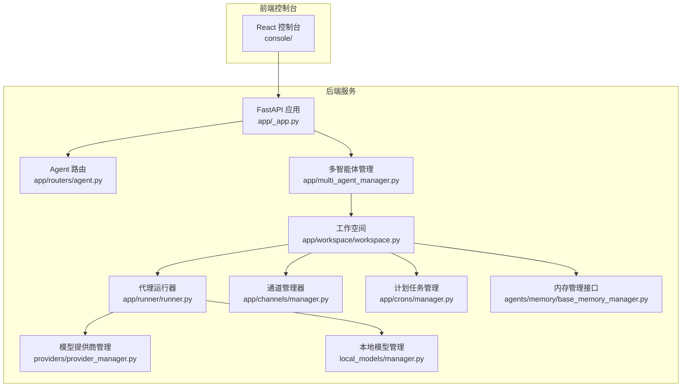

图表来源
- [src/qwenpaw/app/_app.py](file://src/qwenpaw/app/_app.py)
- [src/qwenpaw/app/multi_agent_manager.py](file://src/qwenpaw/app/multi_agent_manager.py)
- [src/qwenpaw/app/workspace/workspace.py](file://src/qwenpaw/app/workspace/workspace.py)
- [src/qwenpaw/app/runner/runner.py](file://src/qwenpaw/app/runner/runner.py)
- [src/qwenpaw/app/channels/manager.py](file://src/qwenpaw/app/channels/manager.py)
- [src/qwenpaw/providers/provider_manager.py](file://src/qwenpaw/providers/provider_manager.py)
- [src/qwenpaw/local_models/manager.py](file://src/qwenpaw/local_models/manager.py)
- [src/qwenpaw/app/crons/manager.py](file://src/qwenpaw/app/crons/manager.py)
- [src/qwenpaw/agents/memory/base_memory_manager.py](file://src/qwenpaw/agents/memory/base_memory_manager.py)

章节来源
- [src/qwenpaw/app/_app.py](file://src/qwenpaw/app/_app.py)
- [src/qwenpaw/app/multi_agent_manager.py](file://src/qwenpaw/app/multi_agent_manager.py)
- [src/qwenpaw/app/workspace/workspace.py](file://src/qwenpaw/app/workspace/workspace.py)
- [src/qwenpaw/app/runner/runner.py](file://src/qwenpaw/app/runner/runner.py)
- [src/qwenpaw/app/channels/manager.py](file://src/qwenpaw/app/channels/manager.py)
- [src/qwenpaw/providers/provider_manager.py](file://src/qwenpaw/providers/provider_manager.py)
- [src/qwenpaw/local_models/manager.py](file://src/qwenpaw/local_models/manager.py)
- [src/qwenpaw/app/crons/manager.py](file://src/qwenpaw/app/crons/manager.py)
- [src/qwenpaw/agents/memory/base_memory_manager.py](file://src/qwenpaw/agents/memory/base_memory_manager.py)

## 核心组件
- 应用主程序（FastAPI）：负责路由注册、中间件（认证、CORS）、静态资源、生命周期钩子（启动/关闭插件、本地模型服务停止、多智能体停止）
- 多智能体管理器（MultiAgentManager）：按需加载与零停机热重载，支持并发启动、任务跟踪与延迟清理
- 工作空间（Workspace）：统一服务注册与生命周期（Runner、ChannelManager、MemoryManager、CronManager、MCPClientManager 等）
- 代理运行器（AgentRunner）：请求处理、命令解析、会话状态管理、工具调用审批、错误转译与持久化
- 通道管理器（ChannelManager）：统一队列与优先级调度、批量合并、通道替换、事件发送
- 模型提供商管理（ProviderManager）：内置与自定义/插件提供商统一管理，支持模型发现与连接检查
- 本地模型管理（LocalModelManager）：llama.cpp 下载、服务器启停、模型下载与进度管理
- 计划任务管理（CronManager）：基于 APScheduler 的定时任务与心跳任务
- 内存管理（BaseMemoryManager）：抽象接口与后台摘要任务管理
- 控制台路由（Agent 路由）：Agent 文件与配置读写、语言与音频模式设置

章节来源
- [src/qwenpaw/app/_app.py](file://src/qwenpaw/app/_app.py)
- [src/qwenpaw/app/multi_agent_manager.py](file://src/qwenpaw/app/multi_agent_manager.py)
- [src/qwenpaw/app/workspace/workspace.py](file://src/qwenpaw/app/workspace/workspace.py)
- [src/qwenpaw/app/workspace/service_manager.py](file://src/qwenpaw/app/workspace/service_manager.py)
- [src/qwenpaw/app/runner/runner.py](file://src/qwenpaw/app/runner/runner.py)
- [src/qwenpaw/app/channels/manager.py](file://src/qwenpaw/app/channels/manager.py)
- [src/qwenpaw/providers/provider_manager.py](file://src/qwenpaw/providers/provider_manager.py)
- [src/qwenpaw/local_models/manager.py](file://src/qwenpaw/local_models/manager.py)
- [src/qwenpaw/app/crons/manager.py](file://src/qwenpaw/app/crons/manager.py)
- [src/qwenpaw/agents/memory/base_memory_manager.py](file://src/qwenpaw/agents/memory/base_memory_manager.py)
- [src/qwenpaw/app/routers/agent.py](file://src/qwenpaw/app/routers/agent.py)

## 架构总览
系统采用“单进程多工作空间”的多智能体架构，每个 Workspace 独立封装 Runner、ChannelManager、MemoryManager、CronManager 等组件。应用通过动态运行器（DynamicMultiAgentRunner）根据请求头中的 AgentId 将请求路由至对应 Workspace 的 Runner，从而实现多智能体隔离与共享资源复用。

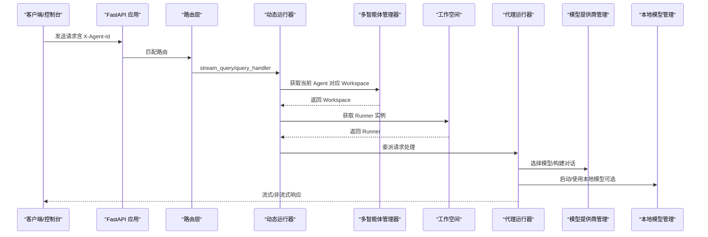

图表来源
- [src/qwenpaw/app/_app.py](file://src/qwenpaw/app/_app.py)
- [src/qwenpaw/app/multi_agent_manager.py](file://src/qwenpaw/app/multi_agent_manager.py)
- [src/qwenpaw/app/workspace/workspace.py](file://src/qwenpaw/app/workspace/workspace.py)
- [src/qwenpaw/app/runner/runner.py](file://src/qwenpaw/app/runner/runner.py)
- [src/qwenpaw/providers/provider_manager.py](file://src/qwenpaw/providers/provider_manager.py)
- [src/qwenpaw/local_models/manager.py](file://src/qwenpaw/local_models/manager.py)

## 详细组件分析

### 应用主程序与生命周期
- 负责加载环境变量、注册中间件（认证、CORS）、静态资源与路由
- 在 lifespan 中完成多智能体迁移与初始化、插件系统加载与启动钩子执行、默认代理与 QA 代理确保、本地模型服务启动
- 关闭阶段执行插件关闭钩子、本地模型服务优雅关停、多智能体停止

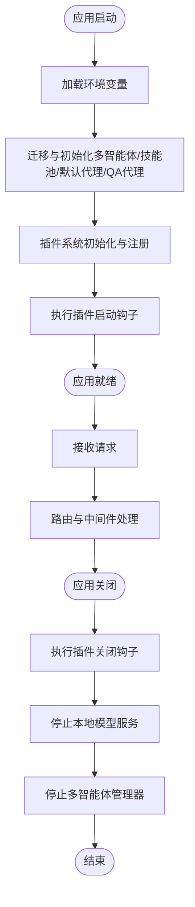

图表来源
- [src/qwenpaw/app/_app.py](file://src/qwenpaw/app/_app.py)

章节来源
- [src/qwenpaw/app/_app.py](file://src/qwenpaw/app/_app.py)

### 多智能体管理器
- 按需懒加载工作空间，支持并发启动与零停机热重载
- 通过原子交换与延迟清理策略保证旧实例在无活动任务时及时停止或在有活动任务时延后清理
- 支持预加载、列出已加载智能体、是否已加载查询

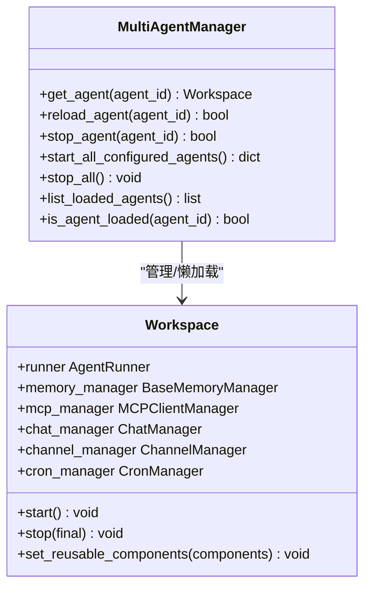

图表来源
- [src/qwenpaw/app/multi_agent_manager.py](file://src/qwenpaw/app/multi_agent_manager.py)
- [src/qwenpaw/app/workspace/workspace.py](file://src/qwenpaw/app/workspace/workspace.py)

章节来源
- [src/qwenpaw/app/multi_agent_manager.py](file://src/qwenpaw/app/multi_agent_manager.py)
- [src/qwenpaw/app/workspace/workspace.py](file://src/qwenpaw/app/workspace/workspace.py)

### 工作空间与服务管理
- 使用 ServiceManager 进行声明式服务注册与生命周期管理，支持并发初始化、依赖顺序、可复用组件与重启回调
- 服务包括 Runner、MemoryManager、MCPClientManager、ChatManager、ChannelManager、CronManager 等
- 支持在热重载前设置可复用组件（如 MemoryManager、ChatManager）

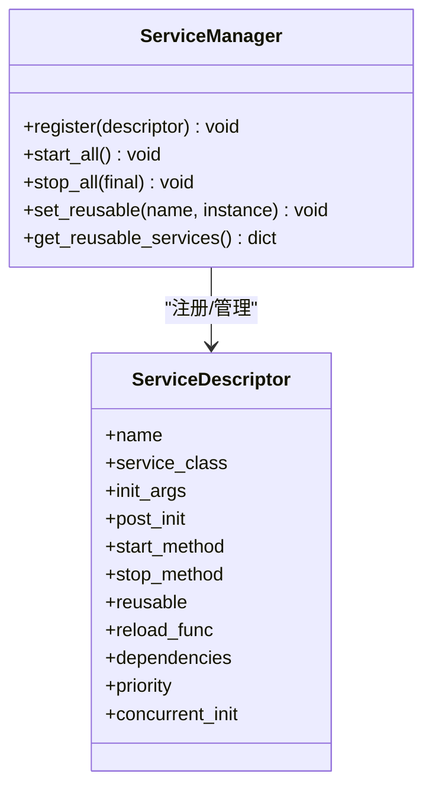

图表来源
- [src/qwenpaw/app/workspace/service_manager.py](file://src/qwenpaw/app/workspace/service_manager.py)

章节来源
- [src/qwenpaw/app/workspace/service_manager.py](file://src/qwenpaw/app/workspace/service_manager.py)
- [src/qwenpaw/app/workspace/workspace.py](file://src/qwenpaw/app/workspace/workspace.py)

### 代理运行器与请求处理
- 解析命令与技能注入、会话状态加载/保存、工具调用审批（含超时处理）、异常转译与调试信息落盘
- 与 MCP 客户端、内存管理、聊天管理器协作，构建系统提示词并流式输出

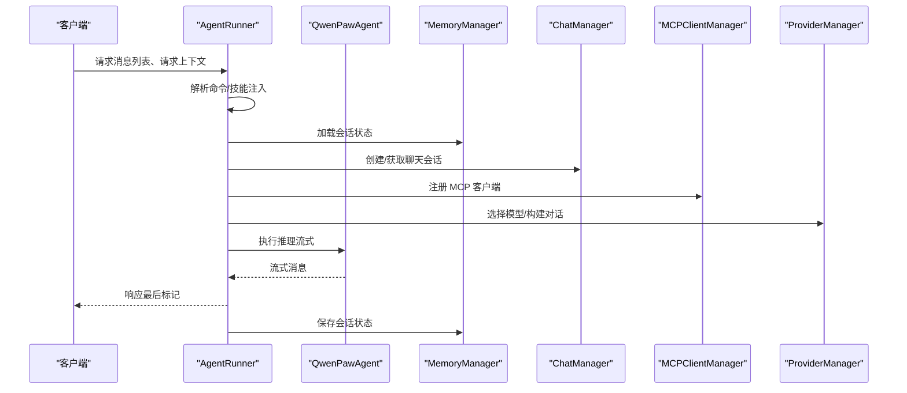

图表来源
- [src/qwenpaw/app/runner/runner.py](file://src/qwenpaw/app/runner/runner.py)
- [src/qwenpaw/providers/provider_manager.py](file://src/qwenpaw/providers/provider_manager.py)
- [src/qwenpaw/agents/memory/base_memory_manager.py](file://src/qwenpaw/agents/memory/base_memory_manager.py)

章节来源
- [src/qwenpaw/app/runner/runner.py](file://src/qwenpaw/app/runner/runner.py)
- [src/qwenpaw/providers/provider_manager.py](file://src/qwenpaw/providers/provider_manager.py)
- [src/qwenpaw/agents/memory/base_memory_manager.py](file://src/qwenpaw/agents/memory/base_memory_manager.py)

### 通道管理与消息路由
- 统一队列管理与优先级调度，支持批量合并、去抖键提取、会话维度排队
- 支持通道替换（热插拔）、事件发送与文本发送

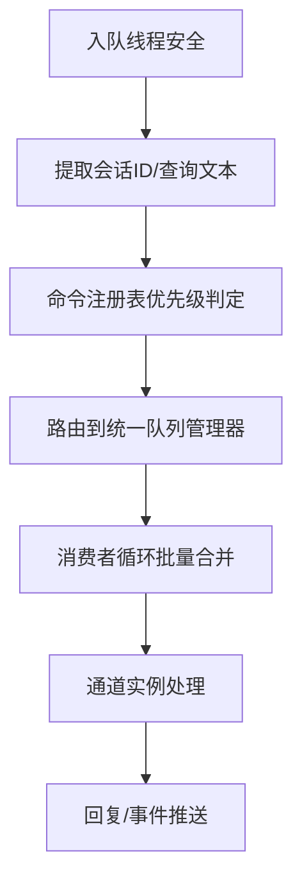

图表来源
- [src/qwenpaw/app/channels/manager.py](file://src/qwenpaw/app/channels/manager.py)

章节来源
- [src/qwenpaw/app/channels/manager.py](file://src/qwenpaw/app/channels/manager.py)

### 模型提供商与本地模型
- ProviderManager 统一管理内置/自定义/插件提供商，支持模型发现与连接检查
- LocalModelManager 管理 llama.cpp 二进制下载、服务器启停、模型下载与进度

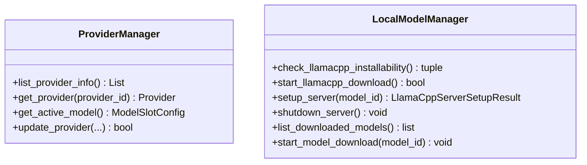

图表来源
- [src/qwenpaw/providers/provider_manager.py](file://src/qwenpaw/providers/provider_manager.py)
- [src/qwenpaw/local_models/manager.py](file://src/qwenpaw/local_models/manager.py)

章节来源
- [src/qwenpaw/providers/provider_manager.py](file://src/qwenpaw/providers/provider_manager.py)
- [src/qwenpaw/local_models/manager.py](file://src/qwenpaw/local_models/manager.py)

### 计划任务与心跳
- CronManager 基于 APScheduler，支持 Cron 表达式与间隔触发，带并发信号量与失败回推
- 心跳任务从配置中读取，支持 Cron 或间隔两种表达方式

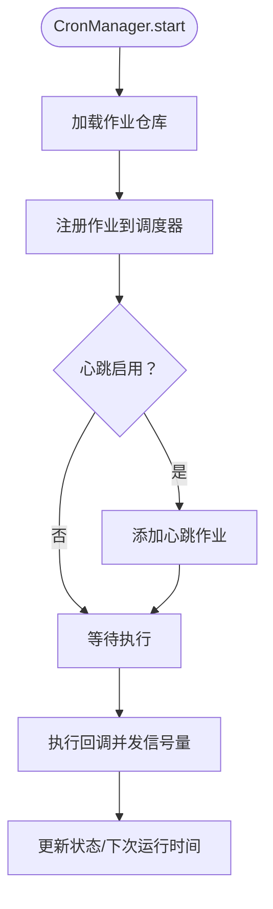

图表来源
- [src/qwenpaw/app/crons/manager.py](file://src/qwenpaw/app/crons/manager.py)

章节来源
- [src/qwenpaw/app/crons/manager.py](file://src/qwenpaw/app/crons/manager.py)

### 控制台路由与 Agent 配置
- 提供 Agent 文件读写、内存文件读写、语言设置、音频模式与提供商选择等接口
- 支持运行配置热重载与系统提示词文件管理

章节来源
- [src/qwenpaw/app/routers/agent.py](file://src/qwenpaw/app/routers/agent.py)

## 依赖分析
- 技术栈与版本
  - Python 3.10–3.14，FastAPI、Uvicorn、AgentScope Runtime、APScheduler、Playwright、Twilio、Matrix、MQTT、Ant Design、React、Zustand 等
  - 可选本地模型支持（llama.cpp、Ollama、LM Studio、Whisper）
- 关键外部依赖
  - 模型提供商：OpenAI、Azure OpenAI、Anthropic、Gemini、DashScope、ModelScope、Minimax、Kimi、DeepSeek、SiliconFlow 等
  - 通道集成：钉钉、飞书、微信、Discord、Telegram、Mattermost、Matrix、MQTT、OneBot、iMessage、语音 Twilio 等
- 依赖关系可视化

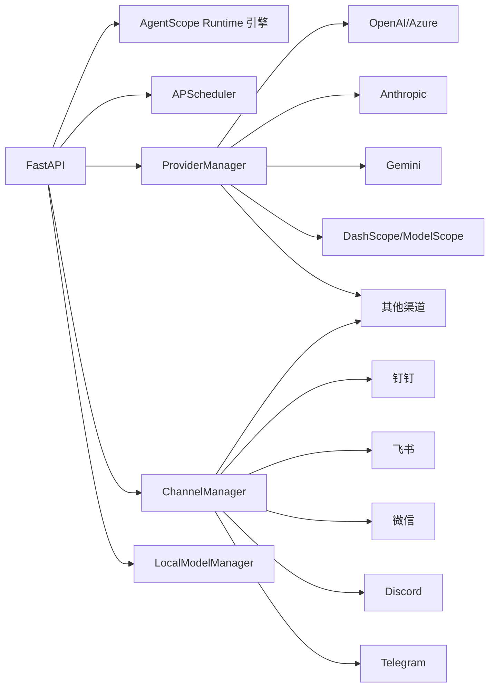

图表来源
- [src/qwenpaw/app/_app.py](file://src/qwenpaw/app/_app.py)
- [src/qwenpaw/providers/provider_manager.py](file://src/qwenpaw/providers/provider_manager.py)
- [src/qwenpaw/app/channels/manager.py](file://src/qwenpaw/app/channels/manager.py)
- [src/qwenpaw/local_models/manager.py](file://src/qwenpaw/local_models/manager.py)

章节来源
- [pyproject.toml](file://pyproject.toml)
- [console/package.json](file://console/package.json)
- [src/qwenpaw/providers/provider_manager.py](file://src/qwenpaw/providers/provider_manager.py)
- [src/qwenpaw/app/channels/manager.py](file://src/qwenpaw/app/channels/manager.py)

## 性能考量
- 并发与异步
  - 多智能体管理器并发启动与热重载，服务管理器支持并发初始化
  - 通道统一队列与批量合并减少重复处理
  - CronManager 使用信号量限制并发执行
- 资源复用
  - 可复用组件（MemoryManager、ChatManager）在热重载时转移，避免重建
  - ProviderManager 与 LocalModelManager 单例持有，减少重复初始化
- I/O 与网络
  - 本地模型服务器启停加锁，避免竞态
  - 模型下载与服务器准备过程异步化，提供进度反馈
- 日志与可观测性
  - 生命周期钩子记录启动/关闭阶段日志
  - 错误转译与调试信息落盘，便于定位问题

## 故障排查指南
- 启动/关闭阶段
  - 插件启动/关闭钩子异常会被捕获并记录，不影响整体流程
  - 本地模型服务停止可能同步/异步两种路径，确保进程退出时清理
  - 多智能体停止时取消延迟清理任务，避免孤儿实例
- 请求处理
  - 工具调用审批超时自动拒绝并清理标记，保留会话一致性
  - 模型异常转换为统一异常类型并生成调试转储文件路径
- 通道与队列
  - 入队超时保护与取消处理，防止阻塞
  - 通道替换支持新通道预启动与旧通道停止的原子切换
- Cron 任务
  - 失败任务通过控制台推送错误信息，便于前端展示
  - 无效 Cron 表达式自动禁用并持久化

章节来源
- [src/qwenpaw/app/_app.py](file://src/qwenpaw/app/_app.py)
- [src/qwenpaw/app/runner/runner.py](file://src/qwenpaw/app/runner/runner.py)
- [src/qwenpaw/app/channels/manager.py](file://src/qwenpaw/app/channels/manager.py)
- [src/qwenpaw/app/crons/manager.py](file://src/qwenpaw/app/crons/manager.py)

## 结论
QwenPaw 以 FastAPI 与 AgentScope Runtime 为核心，构建了可扩展、可热重载、多智能体隔离的个人智能助手平台。通过统一的服务管理、通道队列与优先级调度、模型提供商与本地模型管理、计划任务与心跳机制，系统在功能丰富的同时保持了良好的可维护性与可扩展性。结合安全、监控与灾备实践，可在本地或云端稳定运行。

## 附录
- 系统上下文图（概念性）
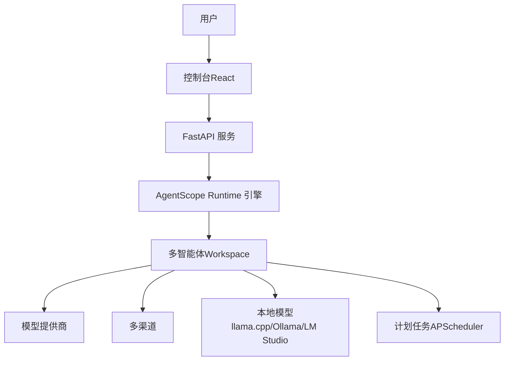

- 部署拓扑建议
  - 单机部署：Docker（推荐），映射工作目录与密钥目录，按需挂载本地模型缓存
  - 云原生：容器编排，结合对象存储与密钥管理服务
  - 本地模型：在容器内通过 host 网络或显式 host 映射访问宿主机服务（如 Ollama/LM Studio）
- 安全与合规
  - 工具守卫与文件访问控制、技能安全扫描、Web 登录保护（可选）
  - 密钥加密存储与传输（ProviderManager 与 SecretStore）
- 监控与灾备
  - 生命周期钩子日志、错误转译与调试转储、Cron 失败推送
  - 多智能体零停机热重载与延迟清理，保障业务连续性