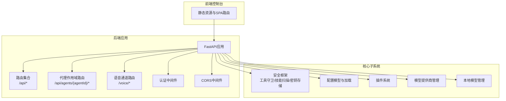
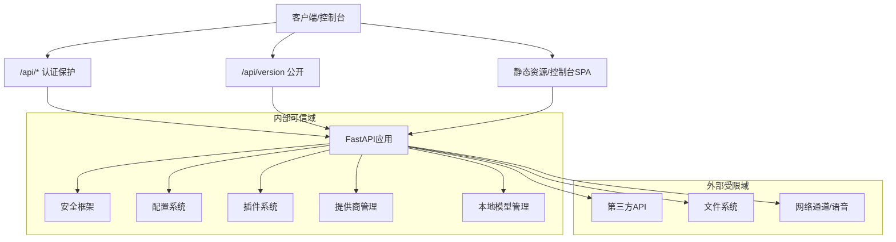
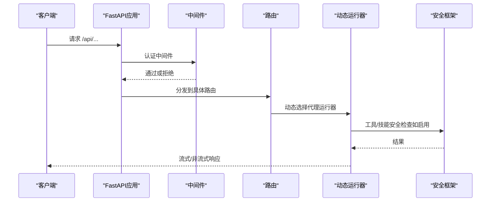
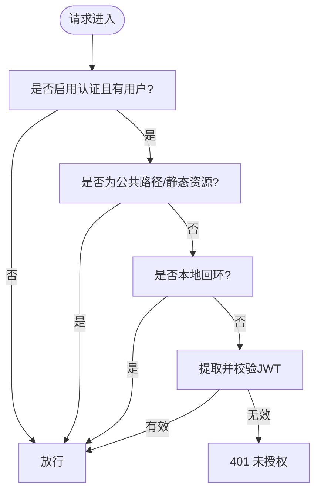
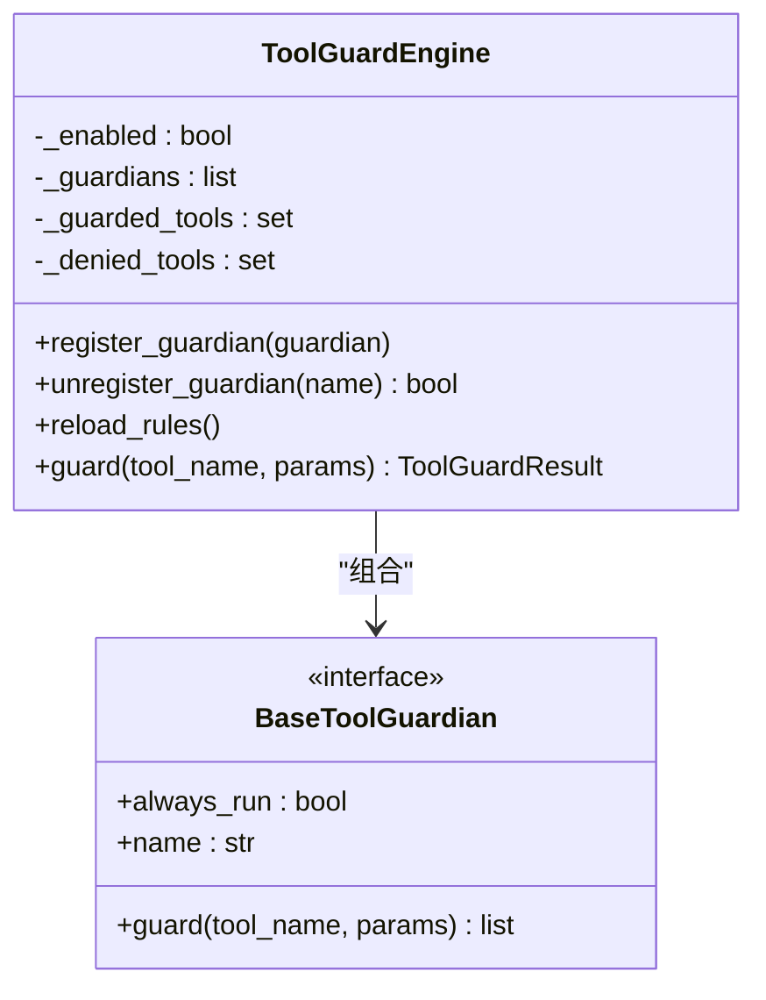
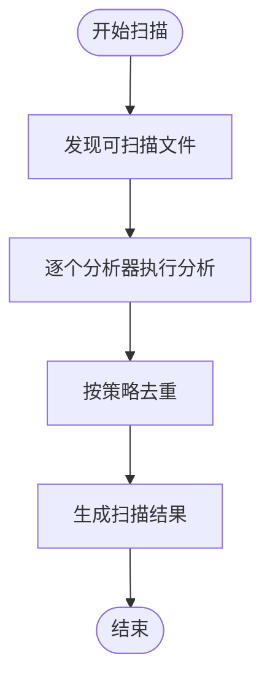
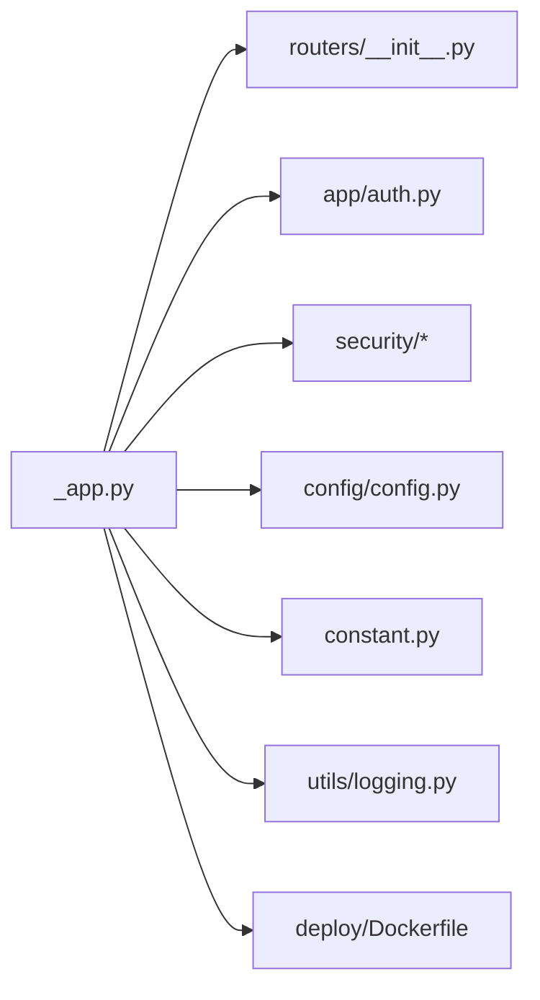

# 系统边界

<cite>
**本文引用的文件**
- [src/qwenpaw/app/_app.py](file://src/qwenpaw/app/_app.py)
- [src/qwenpaw/app/routers/__init__.py](file://src/qwenpaw/app/routers/__init__.py)
- [src/qwenpaw/app/auth.py](file://src/qwenpaw/app/auth.py)
- [src/qwenpaw/app/routers/auth.py](file://src/qwenpaw/app/routers/auth.py)
- [src/qwenpaw/config/config.py](file://src/qwenpaw/config/config.py)
- [src/qwenpaw/constant.py](file://src/qwenpaw/constant.py)
- [src/qwenpaw/security/__init__.py](file://src/qwenpaw/security/__init__.py)
- [src/qwenpaw/security/tool_guard/engine.py](file://src/qwenpaw/security/tool_guard/engine.py)
- [src/qwenpaw/security/skill_scanner/scanner.py](file://src/qwenpaw/security/skill_scanner/scanner.py)
- [src/qwenpaw/utils/logging.py](file://src/qwenpaw/utils/logging.py)
- [deploy/Dockerfile](file://deploy/Dockerfile)
- [src/qwenpaw/cli/main.py](file://src/qwenpaw/cli/main.py)
- [SECURITY.md](file://SECURITY.md)
</cite>

## 目录
1. [引言](#引言)
2. [项目结构](#项目结构)
3. [核心组件](#核心组件)
4. [架构总览](#架构总览)
5. [详细组件分析](#详细组件分析)
6. [依赖分析](#依赖分析)
7. [性能考虑](#性能考虑)
8. [故障排查指南](#故障排查指南)
9. [结论](#结论)
10. [附录](#附录)

## 引言
本文件面向QwenPaw项目的系统边界设计与实现，明确界定系统内外部边界：对外API暴露范围、内部服务调用权限、外部依赖接口；划分代理管理、渠道集成、技能执行、安全管理等子系统职责边界；说明系统与外部系统的集成边界（第三方API、文件系统、网络通信）的权限控制；阐述数据边界与访问控制机制（认证授权、资源隔离、权限验证）；给出系统边界图与接口定义；记录边界安全策略（防火墙、ACL、审计）、边界监控与告警机制（性能指标与异常检测）。

## 项目结构
QwenPaw采用“Python后端 + 前端控制台 + 插件与技能扩展”的分层架构：
- 后端应用入口通过FastAPI提供REST与流式接口，并挂载多路由模块（代理、技能、工具、工作区、认证、文件等）
- 安全框架集中于独立包，包含工具调用守卫、技能扫描器、密钥存储
- 配置模型覆盖代理、渠道、运行时、嵌入与内存压缩等参数
- 部署镜像包含前端构建产物与运行时环境，支持Supervisor进程管理

图表来源
- [src/qwenpaw/app/_app.py:424-569](file://src/qwenpaw/app/_app.py#L424-L569)
- [src/qwenpaw/app/routers/__init__.py:1-60](file://src/qwenpaw/app/routers/__init__.py#L1-L60)

章节来源
- [src/qwenpaw/app/_app.py:424-569](file://src/qwenpaw/app/_app.py#L424-L569)
- [src/qwenpaw/app/routers/__init__.py:1-60](file://src/qwenpaw/app/routers/__init__.py#L1-L60)

## 核心组件
- 应用生命周期与运行器：动态多代理运行器根据请求头选择工作空间运行器，统一处理流式查询与查询处理器
- 路由体系：统一挂载代理、技能、工具、工作区、认证、文件、设置等路由，并提供代理作用域路由
- 认证与授权：基于JWT令牌的登录/注册/状态检查，仅保护/api/路径，支持本地回环豁免
- 安全框架：工具调用前扫描（规则+路径），技能安装前静态扫描（模式匹配、文件大小/数量限制、跳过扩展集）
- 配置模型：代理配置、渠道配置、运行时参数、嵌入与内存压缩、心跳等
- 日志与审计：彩色终端输出、可选文件轮转、访问日志过滤
- 部署与容器化：前端构建产物注入镜像，Supervisor管理，端口暴露与环境变量

章节来源
- [src/qwenpaw/app/_app.py:64-151](file://src/qwenpaw/app/_app.py#L64-L151)
- [src/qwenpaw/app/routers/__init__.py:1-60](file://src/qwenpaw/app/routers/__init__.py#L1-L60)
- [src/qwenpaw/app/auth.py:47-64](file://src/qwenpaw/app/auth.py#L47-L64)
- [src/qwenpaw/security/tool_guard/engine.py:53-103](file://src/qwenpaw/security/tool_guard/engine.py#L53-L103)
- [src/qwenpaw/security/skill_scanner/scanner.py:76-134](file://src/qwenpaw/security/skill_scanner/scanner.py#L76-L134)
- [src/qwenpaw/config/config.py:256-791](file://src/qwenpaw/config/config.py#L256-L791)
- [src/qwenpaw/utils/logging.py:121-202](file://src/qwenpaw/utils/logging.py#L121-L202)
- [deploy/Dockerfile:1-103](file://deploy/Dockerfile#L1-L103)

## 架构总览
系统边界分为“内部可信域”和“外部受限域”：
- 内部可信域：后端应用、安全框架、配置与工作区、插件与提供商、本地模型服务
- 外部受限域：客户端浏览器、第三方API、文件系统、网络通道（渠道、语音）

对外API边界：/api/*受认证保护；/api/version公开；静态资源与控制台SPA路由在后端统一托管
内部调用边界：路由到运行器、安全引擎、配置加载、插件注册、提供商与本地模型管理
外部依赖边界：第三方LLM API、文件系统读写、网络通道协议（如WebSocket、HTTP）

图表来源
- [src/qwenpaw/app/_app.py:506-569](file://src/qwenpaw/app/_app.py#L506-L569)
- [src/qwenpaw/app/auth.py:47-64](file://src/qwenpaw/app/auth.py#L47-L64)
- [src/qwenpaw/security/__init__.py:1-21](file://src/qwenpaw/security/__init__.py#L1-L21)

## 详细组件分析

### 组件A：应用与路由边界
- 应用启动与生命周期：加载环境变量、日志初始化、迁移与默认代理初始化、多代理管理器、提供商与本地模型管理器实例化、插件加载与注册、启动/关闭钩子
- 路由组织：统一挂载代理、技能、工具、工作区、认证、文件、设置等路由；提供代理作用域路由；挂载AgentApp路由；语音通道路由；自定义渠道路由优先级高于SPA回退
- 中间件：认证中间件、CORS中间件（按配置启用）

图表来源
- [src/qwenpaw/app/_app.py:166-423](file://src/qwenpaw/app/_app.py#L166-L423)
- [src/qwenpaw/app/routers/__init__.py:1-60](file://src/qwenpaw/app/routers/__init__.py#L1-L60)
- [src/qwenpaw/app/auth.py:391-440](file://src/qwenpaw/app/auth.py#L391-L440)

章节来源
- [src/qwenpaw/app/_app.py:166-423](file://src/qwenpaw/app/_app.py#L166-L423)
- [src/qwenpaw/app/routers/__init__.py:1-60](file://src/qwenpaw/app/routers/__init__.py#L1-L60)
- [src/qwenpaw/app/auth.py:391-440](file://src/qwenpaw/app/auth.py#L391-L440)

### 组件B：认证与授权边界
- 登录/注册/状态：仅当认证开启且存在用户时生效；登录成功返回JWT；状态接口返回是否启用与是否存在用户
- 路由保护：/api/下受保护；公共路径与静态资源豁免；本地回环地址豁免
- 令牌校验：支持HTTP头Bearer与WebSocket升级参数token；过期或无效返回401

图表来源
- [src/qwenpaw/app/auth.py:47-64](file://src/qwenpaw/app/auth.py#L47-L64)
- [src/qwenpaw/app/auth.py:405-440](file://src/qwenpaw/app/auth.py#L405-L440)
- [src/qwenpaw/app/routers/auth.py:41-114](file://src/qwenpaw/app/routers/auth.py#L41-L114)

章节来源
- [src/qwenpaw/app/auth.py:47-64](file://src/qwenpaw/app/auth.py#L47-L64)
- [src/qwenpaw/app/auth.py:405-440](file://src/qwenpaw/app/auth.py#L405-L440)
- [src/qwenpaw/app/routers/auth.py:41-114](file://src/qwenpaw/app/routers/auth.py#L41-L114)

### 组件C：工具调用守卫边界
- 启用策略：优先从环境变量读取，其次从配置，最后默认启用
- 默认守护者：路径型与规则型守护者；支持注册/注销守护者、重载规则、解析受保护与禁用工具集
- 执行流程：按工具名与参数进行扫描，聚合结果，记录耗时与失败守护者

图表来源
- [src/qwenpaw/security/tool_guard/engine.py:53-103](file://src/qwenpaw/security/tool_guard/engine.py#L53-L103)
- [src/qwenpaw/security/tool_guard/engine.py:169-227](file://src/qwenpaw/security/tool_guard/engine.py#L169-L227)

章节来源
- [src/qwenpaw/security/tool_guard/engine.py:53-103](file://src/qwenpaw/security/tool_guard/engine.py#L53-L103)
- [src/qwenpaw/security/tool_guard/engine.py:169-227](file://src/qwenpaw/security/tool_guard/engine.py#L169-L227)

### 组件D：技能扫描边界
- 扫描策略：默认使用模式分析器；可注册自定义分析器；支持策略化文件分类、最大文件数/大小限制、跳过扩展集
- 文件发现：递归遍历技能目录，排除符号链接与越界路径，按大小与数量上限筛选
- 结果聚合：去重、记录分析器使用与失败项，输出扫描结果

图表来源
- [src/qwenpaw/security/skill_scanner/scanner.py:148-242](file://src/qwenpaw/security/skill_scanner/scanner.py#L148-L242)
- [src/qwenpaw/security/skill_scanner/scanner.py:248-299](file://src/qwenpaw/security/skill_scanner/scanner.py#L248-L299)

章节来源
- [src/qwenpaw/security/skill_scanner/scanner.py:76-134](file://src/qwenpaw/security/skill_scanner/scanner.py#L76-L134)
- [src/qwenpaw/security/skill_scanner/scanner.py:148-242](file://src/qwenpaw/security/skill_scanner/scanner.py#L148-L242)
- [src/qwenpaw/security/skill_scanner/scanner.py:248-299](file://src/qwenpaw/security/skill_scanner/scanner.py#L248-L299)

### 组件E：配置与数据边界
- 配置模型：代理配置、渠道配置、运行时参数（最大迭代、并发、速率限制、上下文压缩、记忆摘要）、嵌入与工具结果压缩、心跳等
- 数据边界：工作目录、密钥目录、媒体目录、插件目录、本地模型目录等均受环境变量控制，确保最小暴露面
- 运行时约束：LLM并发、QPM、指数退避、获取信号量超时等参数可调，避免上游限流与阻塞

章节来源
- [src/qwenpaw/config/config.py:256-791](file://src/qwenpaw/config/config.py#L256-L791)
- [src/qwenpaw/constant.py:89-220](file://src/qwenpaw/constant.py#L89-L220)

### 组件F：部署与容器边界
- 前端构建：多阶段构建，先构建控制台dist再注入镜像
- 运行时：Python虚拟环境、Chromium、Playwright系统浏览器、Supervisor
- 环境变量：工作目录、密钥目录、端口、通道白/黑名单、OpenAPI文档开关、CORS来源等
- 端口：默认8088，容器内暴露

章节来源
- [deploy/Dockerfile:1-103](file://deploy/Dockerfile#L1-L103)
- [src/qwenpaw/constant.py:179-182](file://src/qwenpaw/constant.py#L179-L182)
- [src/qwenpaw/constant.py:215-218](file://src/qwenpaw/constant.py#L215-L218)

## 依赖分析
- 组件耦合与内聚：应用主模块对路由、认证、安全、配置、插件、提供商、本地模型形成高内聚低耦合的装配关系
- 直接依赖：FastAPI应用依赖路由集合、认证中间件、CORS中间件；路由依赖运行器与安全引擎；运行器依赖多代理管理器
- 外部依赖：第三方LLM提供商、文件系统、网络通道、浏览器驱动（Playwright/Chromium）

图表来源
- [src/qwenpaw/app/_app.py:424-569](file://src/qwenpaw/app/_app.py#L424-L569)
- [src/qwenpaw/app/routers/__init__.py:1-60](file://src/qwenpaw/app/routers/__init__.py#L1-L60)
- [src/qwenpaw/app/auth.py:1-200](file://src/qwenpaw/app/auth.py#L1-L200)
- [src/qwenpaw/security/__init__.py:1-21](file://src/qwenpaw/security/__init__.py#L1-L21)
- [src/qwenpaw/config/config.py:1-200](file://src/qwenpaw/config/config.py#L1-L200)
- [src/qwenpaw/constant.py:1-120](file://src/qwenpaw/constant.py#L1-L120)
- [src/qwenpaw/utils/logging.py:1-120](file://src/qwenpaw/utils/logging.py#L1-L120)
- [deploy/Dockerfile:1-103](file://deploy/Dockerfile#L1-L103)

章节来源
- [src/qwenpaw/app/_app.py:424-569](file://src/qwenpaw/app/_app.py#L424-L569)
- [src/qwenpaw/app/routers/__init__.py:1-60](file://src/qwenpaw/app/routers/__init__.py#L1-L60)
- [src/qwenpaw/app/auth.py:1-200](file://src/qwenpaw/app/auth.py#L1-L200)
- [src/qwenpaw/security/__init__.py:1-21](file://src/qwenpaw/security/__init__.py#L1-L21)
- [src/qwenpaw/config/config.py:1-200](file://src/qwenpaw/config/config.py#L1-L200)
- [src/qwenpaw/constant.py:1-120](file://src/qwenpaw/constant.py#L1-L120)
- [src/qwenpaw/utils/logging.py:1-120](file://src/qwenpaw/utils/logging.py#L1-L120)
- [deploy/Dockerfile:1-103](file://deploy/Dockerfile#L1-L103)

## 性能考虑
- 并发与限流：全局并发上限、每分钟查询数（QPM）滑动窗口限制、429响应时的暂停与抖动、获取信号量超时
- 上下文压缩：基于输入长度的比例阈值与保留比例，减少长对话带来的延迟与成本
- 工具结果压缩：近期与旧内容的字节阈值、保留天数，降低磁盘占用与检索成本
- 日志轮转：文件日志在macOS使用轮转，在Windows/Linux使用简单文件句柄，避免锁争用

章节来源
- [src/qwenpaw/config/config.py:453-607](file://src/qwenpaw/config/config.py#L453-L607)
- [src/qwenpaw/utils/logging.py:160-202](file://src/qwenpaw/utils/logging.py#L160-L202)

## 故障排查指南
- 认证相关：确认认证是否启用、是否存在用户、是否为本地回环、令牌格式与有效期；检查公共路径与静态资源豁免
- 路由与中间件：核对CORS来源、代理作用域路由前缀、AgentApp路由挂载位置
- 安全策略：工具守卫与技能扫描是否启用、受保护/禁用工具集配置、扫描策略与文件限制
- 日志与审计：查看项目命名空间日志、文件轮转、访问日志过滤；定位异常堆栈与错误码
- 部署问题：容器内Chromium路径、Playwright环境变量、Supervisor配置、端口与环境变量

章节来源
- [src/qwenpaw/app/auth.py:405-440](file://src/qwenpaw/app/auth.py#L405-L440)
- [src/qwenpaw/app/_app.py:436-447](file://src/qwenpaw/app/_app.py#L436-L447)
- [src/qwenpaw/security/tool_guard/engine.py:35-51](file://src/qwenpaw/security/tool_guard/engine.py#L35-L51)
- [src/qwenpaw/security/skill_scanner/scanner.py:100-134](file://src/qwenpaw/security/skill_scanner/scanner.py#L100-L134)
- [src/qwenpaw/utils/logging.py:121-202](file://src/qwenpaw/utils/logging.py#L121-L202)
- [deploy/Dockerfile:71-78](file://deploy/Dockerfile#L71-L78)

## 结论
QwenPaw通过清晰的系统边界设计，将认证授权、安全扫描、配置与运行时管理解耦，形成以FastAPI为中心的可扩展后端。对外仅暴露受控API与静态资源，内部通过中间件与运行器实现细粒度的访问控制与资源隔离。安全框架在工具调用与技能安装两个关键入口实施前置防护，结合配置与环境变量实现最小暴露面与可控运行时行为。建议在生产环境中严格启用认证、限制CORS来源、合理配置并发与限流参数，并持续审计日志与异常。

## 附录

### 接口定义（对外API）
- 版本信息：GET /api/version
- 认证相关：POST /api/auth/login、POST /api/auth/register、POST /api/auth/update-profile、GET /api/auth/status、GET /api/auth/verify
- 路由集合：代理、技能、工具、工作区、配置、文件、设置、提供商、本地模型、消息、控制命令、定时任务、MCP、语音等（详见路由汇总）

章节来源
- [src/qwenpaw/app/_app.py:506-517](file://src/qwenpaw/app/_app.py#L506-L517)
- [src/qwenpaw/app/routers/__init__.py:1-60](file://src/qwenpaw/app/routers/__init__.py#L1-L60)
- [src/qwenpaw/app/routers/auth.py:1-141](file://src/qwenpaw/app/routers/auth.py#L1-L141)

### 边界安全策略
- 认证策略：JWT令牌、7天有效期、本地回环豁免、仅保护/api/路径、公共路径与静态资源豁免
- 工具调用：规则+路径双重扫描，支持禁用工具集与受保护工具集
- 技能安装：模式匹配扫描、文件数量/大小限制、跳过扩展集、路径越界与符号链接防护
- 部署假设：单用户信任模型、工作目录与配置视为可信、技能与本地代码同权、不推荐共享实例

章节来源
- [src/qwenpaw/app/auth.py:47-64](file://src/qwenpaw/app/auth.py#L47-L64)
- [src/qwenpaw/app/auth.py:121-166](file://src/qwenpaw/app/auth.py#L121-L166)
- [src/qwenpaw/security/tool_guard/engine.py:53-103](file://src/qwenpaw/security/tool_guard/engine.py#L53-L103)
- [src/qwenpaw/security/skill_scanner/scanner.py:76-134](file://src/qwenpaw/security/skill_scanner/scanner.py#L76-L134)
- [SECURITY.md:65-141](file://SECURITY.md#L65-L141)

### 边界监控与告警
- 日志：项目命名空间日志、终端彩色输出、文件轮转（macOS轮转，其他平台简单文件句柄）
- 访问日志过滤：抑制特定路径访问日志
- 指标采集：应用启动时间、插件加载数量、本地模型服务器启停、关闭钩子执行
- 建议：结合外部监控系统（如Prometheus/Grafana）采集应用指标与容器健康状态，设置429/错误率告警

章节来源
- [src/qwenpaw/utils/logging.py:121-202](file://src/qwenpaw/utils/logging.py#L121-L202)
- [src/qwenpaw/app/_app.py:178-194](file://src/qwenpaw/app/_app.py#L178-L194)
- [src/qwenpaw/app/_app.py:366-398](file://src/qwenpaw/app/_app.py#L366-L398)