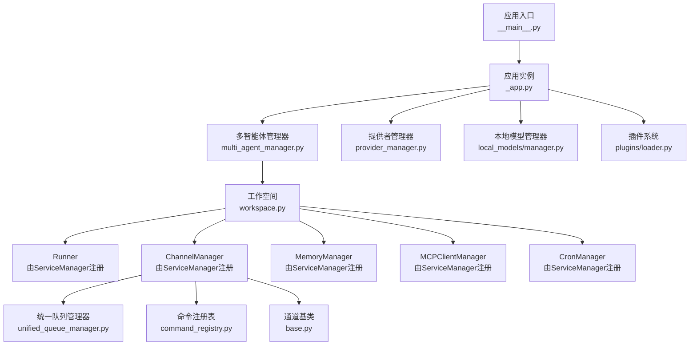
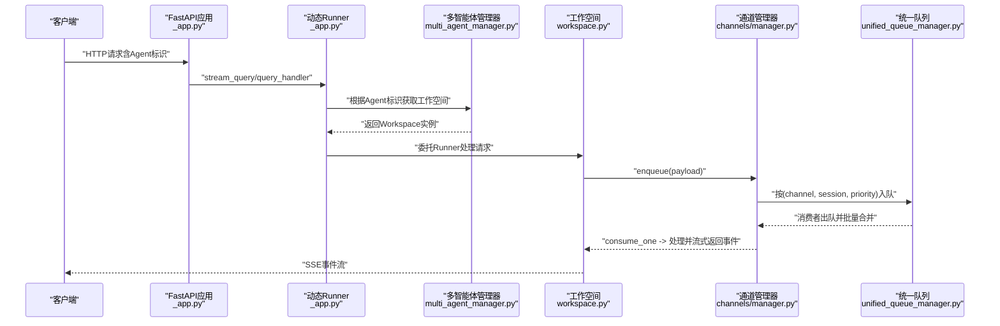
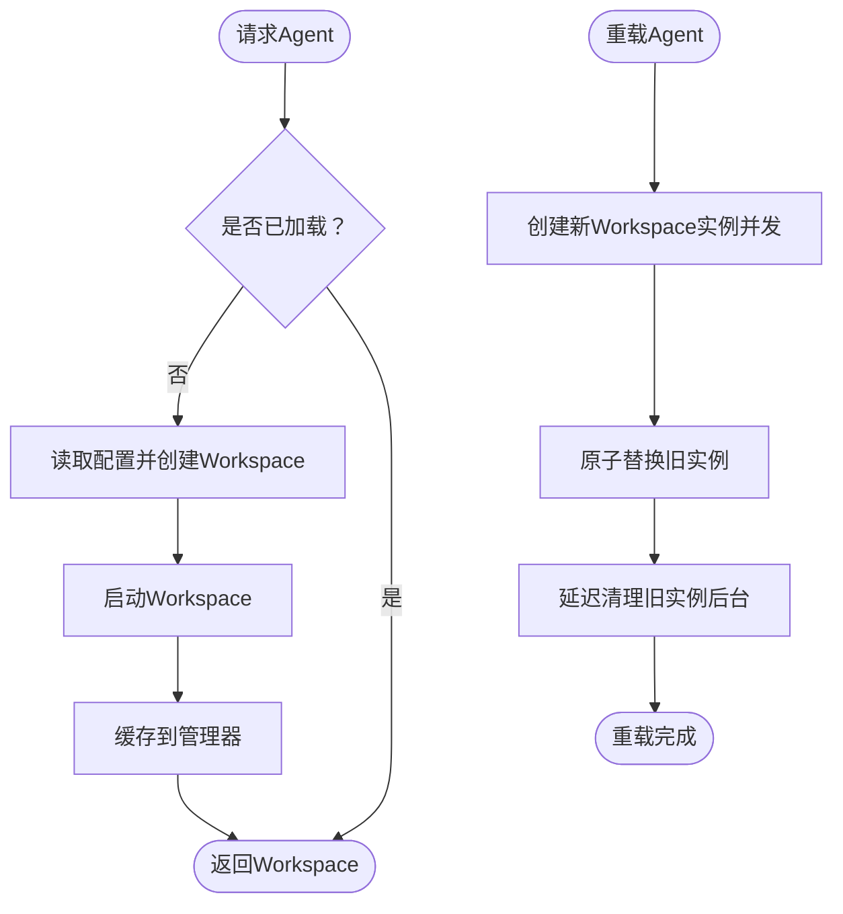
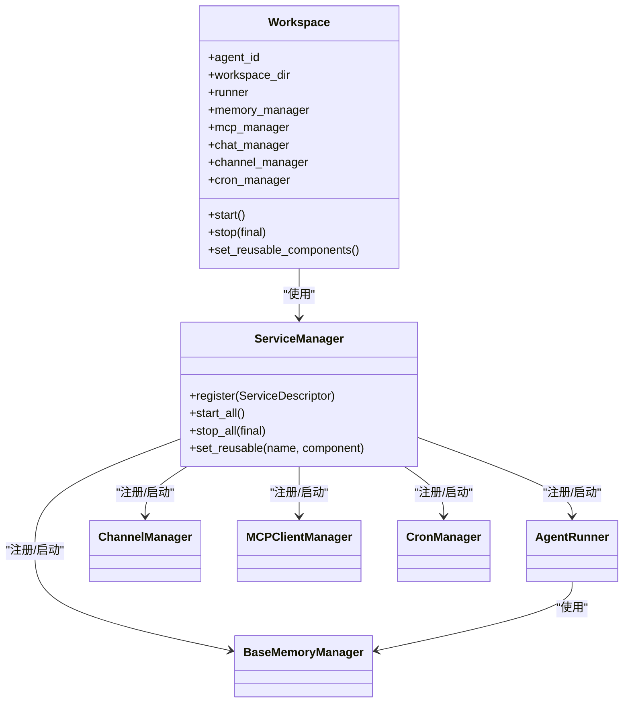
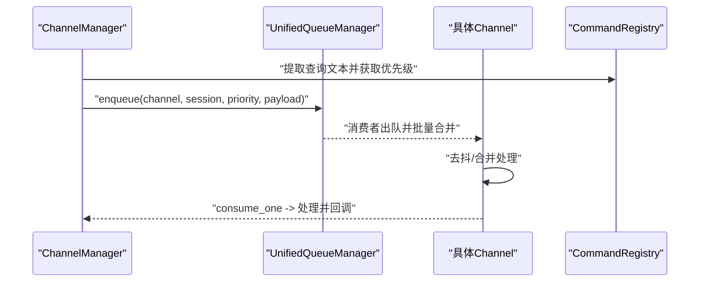
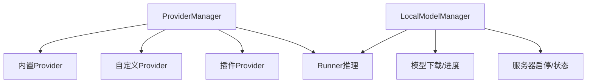
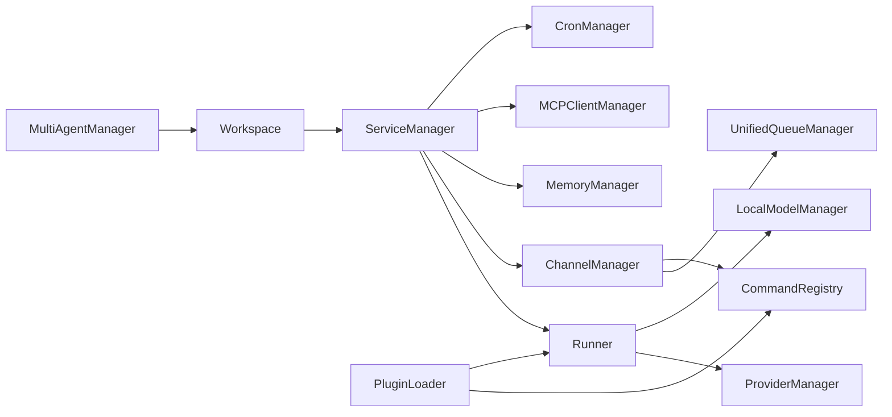

# 组件交互

<cite>
**本文引用的文件**
- [src/qwenpaw/app/_app.py](file://src/qwenpaw/app/_app.py)
- [src/qwenpaw/app/multi_agent_manager.py](file://src/qwenpaw/app/multi_agent_manager.py)
- [src/qwenpaw/app/workspace/workspace.py](file://src/qwenpaw/app/workspace/workspace.py)
- [src/qwenpaw/app/channels/manager.py](file://src/qwenpaw/app/channels/manager.py)
- [src/qwenpaw/app/channels/unified_queue_manager.py](file://src/qwenpaw/app/channels/unified_queue_manager.py)
- [src/qwenpaw/app/channels/command_registry.py](file://src/qwenpaw/app/channels/command_registry.py)
- [src/qwenpaw/app/channels/base.py](file://src/qwenpaw/app/channels/base.py)
- [src/qwenpaw/app/runner/manager.py](file://src/qwenpaw/app/runner/manager.py)
- [src/qwenpaw/providers/provider_manager.py](file://src/qwenpaw/providers/provider_manager.py)
- [src/qwenpaw/local_models/manager.py](file://src/qwenpaw/local_models/manager.py)
- [src/qwenpaw/agents/memory/base_memory_manager.py](file://src/qwenpaw/agents/memory/base_memory_manager.py)
- [src/qwenpaw/agents/skills_manager.py](file://src/qwenpaw/agents/skills_manager.py)
- [src/qwenpaw/agents/hooks/bootstrap.py](file://src/qwenpaw/agents/hooks/bootstrap.py)
- [src/qwenpaw/plugins/loader.py](file://src/qwenpaw/plugins/loader.py)
- [src/qwenpaw/__main__.py](file://src/qwenpaw/__main__.py)
</cite>

## 目录
1. [引言](#引言)
2. [项目结构](#项目结构)
3. [核心组件](#核心组件)
4. [架构总览](#架构总览)
5. [详细组件分析](#详细组件分析)
6. [依赖分析](#依赖分析)
7. [性能考虑](#性能考虑)
8. [故障排查指南](#故障排查指南)
9. [结论](#结论)

## 引言
本文件面向QwenPaw的组件交互与运行时编排，聚焦应用主程序如何协调多智能体工作空间（Workspace）、通道（Channel）系统、技能（Skill）与内存（Memory）管理等子系统；阐述代理管理器（MultiAgentManager）、渠道管理器（ChannelManager）、技能管理器（SkillsManager）、内存管理器（BaseMemoryManager）之间的通信机制、依赖关系与生命周期管理；说明消息传递、异步任务处理、事件广播与状态同步；给出组件交互序列图与时序图，并总结解耦策略、错误传播与恢复机制。

## 项目结构
QwenPaw采用“应用层（FastAPI）—多智能体管理层—工作空间（Workspace）—服务管理器（ServiceManager）—具体子系统”的分层组织方式。应用层负责HTTP生命周期、路由注册与插件系统；多智能体管理层负责按需加载与热重载；工作空间封装Runner、ChannelManager、MemoryManager、MCPClientManager、CronManager等；通道系统通过统一队列实现优先级与会话隔离；技能与内存管理器提供可替换后端；提供者与本地模型管理器提供推理能力与本地推理支持。

图表来源
- [src/qwenpaw/__main__.py:1-7](file://src/qwenpaw/__main__.py#L1-L7)
- [src/qwenpaw/app/_app.py:1-569](file://src/qwenpaw/app/_app.py#L1-L569)
- [src/qwenpaw/app/multi_agent_manager.py:1-470](file://src/qwenpaw/app/multi_agent_manager.py#L1-L470)
- [src/qwenpaw/app/workspace/workspace.py:1-389](file://src/qwenpaw/app/workspace/workspace.py#L1-L389)
- [src/qwenpaw/app/channels/unified_queue_manager.py:1-498](file://src/qwenpaw/app/channels/unified_queue_manager.py#L1-L498)
- [src/qwenpaw/app/channels/command_registry.py:1-267](file://src/qwenpaw/app/channels/command_registry.py#L1-L267)
- [src/qwenpaw/app/channels/base.py:1-1171](file://src/qwenpaw/app/channels/base.py#L1-L1171)
- [src/qwenpaw/providers/provider_manager.py:1-1602](file://src/qwenpaw/providers/provider_manager.py#L1-L1602)
- [src/qwenpaw/local_models/manager.py:1-229](file://src/qwenpaw/local_models/manager.py#L1-L229)
- [src/qwenpaw/plugins/loader.py:1-241](file://src/qwenpaw/plugins/loader.py#L1-L241)

章节来源
- [src/qwenpaw/app/_app.py:1-569](file://src/qwenpaw/app/_app.py#L1-L569)
- [src/qwenpaw/app/multi_agent_manager.py:1-470](file://src/qwenpaw/app/multi_agent_manager.py#L1-L470)
- [src/qwenpaw/app/workspace/workspace.py:1-389](file://src/qwenpaw/app/workspace/workspace.py#L1-L389)
- [src/qwenpaw/app/channels/manager.py:1-711](file://src/qwenpaw/app/channels/manager.py#L1-L711)
- [src/qwenpaw/app/channels/unified_queue_manager.py:1-498](file://src/qwenpaw/app/channels/unified_queue_manager.py#L1-L498)
- [src/qwenpaw/app/channels/command_registry.py:1-267](file://src/qwenpaw/app/channels/command_registry.py#L1-L267)
- [src/qwenpaw/app/channels/base.py:1-1171](file://src/qwenpaw/app/channels/base.py#L1-L1171)
- [src/qwenpaw/providers/provider_manager.py:1-1602](file://src/qwenpaw/providers/provider_manager.py#L1-L1602)
- [src/qwenpaw/local_models/manager.py:1-229](file://src/qwenpaw/local_models/manager.py#L1-L229)
- [src/qwenpaw/plugins/loader.py:1-241](file://src/qwenpaw/plugins/loader.py#L1-L241)

## 核心组件
- 应用主程序与生命周期：FastAPI应用、lifespan启动/停止钩子、全局状态注入（多智能体管理器、提供者管理器、本地模型管理器、插件系统）。
- 多智能体管理器：按需加载、并发启动、零停机热重载、延迟清理旧实例。
- 工作空间：服务化装配（Runner、ChannelManager、MemoryManager、MCPClientManager、CronManager），统一启动/停止。
- 渠道系统：ChannelManager统一入队与消费，基于UnifiedQueueManager实现会话+优先级隔离与自动清理；CommandRegistry用于控制命令优先级识别。
- 提供者与本地模型：ProviderManager集中管理内置/自定义/插件提供者；LocalModelManager统一本地推理服务生命周期。
- 技能与内存：SkillsManager负责技能池与工作区技能同步；BaseMemoryManager抽象记忆后端，支持压缩、检索与后台摘要任务。
- 插件系统：PluginLoader动态发现/加载插件，注册控制命令与启动/停止钩子。

章节来源
- [src/qwenpaw/app/_app.py:166-422](file://src/qwenpaw/app/_app.py#L166-L422)
- [src/qwenpaw/app/multi_agent_manager.py:21-470](file://src/qwenpaw/app/multi_agent_manager.py#L21-L470)
- [src/qwenpaw/app/workspace/workspace.py:47-389](file://src/qwenpaw/app/workspace/workspace.py#L47-L389)
- [src/qwenpaw/app/channels/manager.py:68-711](file://src/qwenpaw/app/channels/manager.py#L68-L711)
- [src/qwenpaw/app/channels/unified_queue_manager.py:60-498](file://src/qwenpaw/app/channels/unified_queue_manager.py#L60-L498)
- [src/qwenpaw/app/channels/command_registry.py:23-267](file://src/qwenpaw/app/channels/command_registry.py#L23-L267)
- [src/qwenpaw/providers/provider_manager.py:670-1602](file://src/qwenpaw/providers/provider_manager.py#L670-L1602)
- [src/qwenpaw/local_models/manager.py:33-229](file://src/qwenpaw/local_models/manager.py#L33-L229)
- [src/qwenpaw/agents/skills_manager.py:1-800](file://src/qwenpaw/agents/skills_manager.py#L1-L800)
- [src/qwenpaw/agents/memory/base_memory_manager.py:21-226](file://src/qwenpaw/agents/memory/base_memory_manager.py#L21-L226)
- [src/qwenpaw/plugins/loader.py:19-241](file://src/qwenpaw/plugins/loader.py#L19-L241)

## 架构总览
应用启动时，lifespan完成迁移、多智能体初始化、提供者与本地模型管理器启动、插件系统加载与启动钩子执行；随后将MultiAgentManager注入到动态Runner中，使AgentApp按请求头选择对应工作空间；工作空间内部通过ServiceManager以声明式顺序启动各服务，其中ChannelManager与UnifiedQueueManager协作实现消息的优先级与会话隔离处理；ProviderManager与LocalModelManager为Runner提供模型能力；SkillsManager与MemoryManager分别负责技能与记忆后端；插件系统在启动/停止阶段提供扩展点。

图表来源
- [src/qwenpaw/app/_app.py:64-163](file://src/qwenpaw/app/_app.py#L64-L163)
- [src/qwenpaw/app/multi_agent_manager.py:38-90](file://src/qwenpaw/app/multi_agent_manager.py#L38-L90)
- [src/qwenpaw/app/workspace/workspace.py:322-389](file://src/qwenpaw/app/workspace/workspace.py#L322-L389)
- [src/qwenpaw/app/channels/manager.py:349-425](file://src/qwenpaw/app/channels/manager.py#L349-L425)
- [src/qwenpaw/app/channels/unified_queue_manager.py:119-273](file://src/qwenpaw/app/channels/unified_queue_manager.py#L119-L273)

## 详细组件分析

### 多智能体管理器（MultiAgentManager）
- 职责：按需加载工作空间、并发启动、零停机热重载、延迟清理旧实例、统一停止。
- 关键点：
  - 懒加载：首次请求才创建并启动Workspace。
  - 零停机重载：先创建新实例，再原子替换，最后在后台等待活动任务完成后停止旧实例。
  - 延迟清理：若旧实例仍有活动任务，安排后台清理，避免中断用户会话。
  - 并发启动：启用的Agent并发启动，失败不影响其他Agent。

图表来源
- [src/qwenpaw/app/multi_agent_manager.py:38-320](file://src/qwenpaw/app/multi_agent_manager.py#L38-L320)

章节来源
- [src/qwenpaw/app/multi_agent_manager.py:21-470](file://src/qwenpaw/app/multi_agent_manager.py#L21-L470)

### 工作空间（Workspace）与服务管理（ServiceManager）
- 职责：以声明式方式注册Runner、MemoryManager、MCPClientManager、ChatManager、ChannelManager、CronManager等服务，按优先级顺序启动/停止。
- 关键点：
  - 可复用组件：支持在重载时保留MemoryManager、ChatManager等可复用组件，减少重启成本。
  - 生命周期：start()加载配置并启动所有服务；stop(final)支持仅停止非复用组件以便热重载。
  - 与Runner联动：将MemoryManager注入Runner，确保推理与记忆一致。

图表来源
- [src/qwenpaw/app/workspace/workspace.py:47-389](file://src/qwenpaw/app/workspace/workspace.py#L47-L389)

章节来源
- [src/qwenpaw/app/workspace/workspace.py:47-389](file://src/qwenpaw/app/workspace/workspace.py#L47-L389)

### 渠道管理器（ChannelManager）与统一队列（UnifiedQueueManager）
- 职责：统一接收来自各渠道的消息，按(channel, session, priority)入队；消费者按队列逐条处理，支持批量合并与时间去抖；提供发送文本/事件的能力。
- 关键点：
  - CommandRegistry：从查询文本提取命令前缀，映射到优先级（critical/high/normal/low）。
  - UnifiedQueueManager：每个QueueKey拥有独立队列与消费者任务，空闲超时自动清理；支持增量处理计数与指标导出。
  - 去抖与合并：对无文本内容进行缓冲合并，音频类消息可直接处理；原生payload支持合并与元信息透传。

图表来源
- [src/qwenpaw/app/channels/manager.py:284-425](file://src/qwenpaw/app/channels/manager.py#L284-L425)
- [src/qwenpaw/app/channels/unified_queue_manager.py:119-273](file://src/qwenpaw/app/channels/unified_queue_manager.py#L119-L273)
- [src/qwenpaw/app/channels/command_registry.py:175-218](file://src/qwenpaw/app/channels/command_registry.py#L175-L218)
- [src/qwenpaw/app/channels/base.py:659-800](file://src/qwenpaw/app/channels/base.py#L659-L800)

章节来源
- [src/qwenpaw/app/channels/manager.py:68-711](file://src/qwenpaw/app/channels/manager.py#L68-L711)
- [src/qwenpaw/app/channels/unified_queue_manager.py:60-498](file://src/qwenpaw/app/channels/unified_queue_manager.py#L60-L498)
- [src/qwenpaw/app/channels/command_registry.py:23-267](file://src/qwenpaw/app/channels/command_registry.py#L23-L267)
- [src/qwenpaw/app/channels/base.py:70-1171](file://src/qwenpaw/app/channels/base.py#L70-L1171)

### 提供者管理器（ProviderManager）与本地模型管理器（LocalModelManager）
- 职责：ProviderManager集中管理内置/自定义/插件提供者，暴露列表、获取信息、切换活跃模型；LocalModelManager统一本地llama.cpp服务下载、安装、服务器生命周期与配置持久化。
- 关键点：
  - ProviderManager单例，内置多家大模型提供商，支持插件注册新的Provider。
  - LocalModelManager线程安全的生命周期锁，保证服务器启停一致性；支持最大上下文长度配置持久化。

图表来源
- [src/qwenpaw/providers/provider_manager.py:670-1602](file://src/qwenpaw/providers/provider_manager.py#L670-L1602)
- [src/qwenpaw/local_models/manager.py:33-229](file://src/qwenpaw/local_models/manager.py#L33-L229)

章节来源
- [src/qwenpaw/providers/provider_manager.py:1-1602](file://src/qwenpaw/providers/provider_manager.py#L1-L1602)
- [src/qwenpaw/local_models/manager.py:1-229](file://src/qwenpaw/local_models/manager.py#L1-L229)

### 技能管理器（SkillsManager）与内存管理器（BaseMemoryManager）
- 职责：SkillsManager负责技能池与工作区技能的同步、签名校验、冲突处理、环境变量注入；BaseMemoryManager抽象记忆后端，支持压缩、摘要、检索与后台摘要任务。
- 关键点：
  - SkillsManager提供技能清单、版本、签名、依赖与环境注入，保障跨渠道一致性。
  - BaseMemoryManager支持异步摘要任务收集与优雅等待，Shutdown前汇总结果。

章节来源
- [src/qwenpaw/agents/skills_manager.py:1-800](file://src/qwenpaw/agents/skills_manager.py#L1-L800)
- [src/qwenpaw/agents/memory/base_memory_manager.py:21-226](file://src/qwenpaw/agents/memory/base_memory_manager.py#L21-L226)

### 插件系统（PluginLoader）
- 职责：扫描插件目录、加载插件模块、调用register(api)、注册控制命令与启动/停止钩子。
- 关键点：
  - 动态导入，支持相对导入；支持同步/异步register；记录诊断信息。
  - 注册控制命令到CommandRegistry，影响消息优先级路由。

章节来源
- [src/qwenpaw/plugins/loader.py:19-241](file://src/qwenpaw/plugins/loader.py#L19-L241)
- [src/qwenpaw/app/channels/command_registry.py:90-135](file://src/qwenpaw/app/channels/command_registry.py#L90-L135)

### 应用主程序与生命周期（lifespan）
- 职责：应用启动时执行迁移、初始化多智能体、加载插件、执行启动钩子；停止时执行停止钩子、关闭本地模型服务、停止多智能体管理器。
- 关键点：
  - 将MultiAgentManager注入动态Runner，使AgentApp按请求头选择工作空间。
  - 全局共享ProviderManager与LocalModelManager实例，供各工作空间复用。

章节来源
- [src/qwenpaw/app/_app.py:166-422](file://src/qwenpaw/app/_app.py#L166-L422)

## 依赖分析
- 组件耦合与内聚：
  - MultiAgentManager与Workspace高内聚，通过ServiceManager解耦具体服务。
  - ChannelManager与UnifiedQueueManager强耦合但职责清晰：前者负责入队/消费调度，后者负责队列与消费者生命周期。
  - ProviderManager与LocalModelManager与Runner弱耦合，通过Runner的模型槽位与工具链接入。
- 外部依赖与集成点：
  - 插件系统通过PluginLoader与CommandRegistry实现控制命令与启动/停止钩子的动态注册。
  - 技能管理器与内存管理器通过工作区配置与环境变量注入实现跨渠道一致性。
- 循环依赖：
  - 未见循环依赖迹象；ChannelManager通过回调注入到各Channel，不反向依赖。

图表来源
- [src/qwenpaw/app/multi_agent_manager.py:21-470](file://src/qwenpaw/app/multi_agent_manager.py#L21-L470)
- [src/qwenpaw/app/workspace/workspace.py:142-289](file://src/qwenpaw/app/workspace/workspace.py#L142-L289)
- [src/qwenpaw/app/channels/manager.py:68-111](file://src/qwenpaw/app/channels/manager.py#L68-L111)
- [src/qwenpaw/app/channels/unified_queue_manager.py:60-118](file://src/qwenpaw/app/channels/unified_queue_manager.py#L60-L118)
- [src/qwenpaw/app/channels/command_registry.py:23-62](file://src/qwenpaw/app/channels/command_registry.py#L23-L62)
- [src/qwenpaw/providers/provider_manager.py:670-751](file://src/qwenpaw/providers/provider_manager.py#L670-L751)
- [src/qwenpaw/local_models/manager.py:33-100](file://src/qwenpaw/local_models/manager.py#L33-L100)
- [src/qwenpaw/plugins/loader.py:199-221](file://src/qwenpaw/plugins/loader.py#L199-L221)

章节来源
- [src/qwenpaw/app/multi_agent_manager.py:1-470](file://src/qwenpaw/app/multi_agent_manager.py#L1-L470)
- [src/qwenpaw/app/workspace/workspace.py:1-389](file://src/qwenpaw/app/workspace/workspace.py#L1-L389)
- [src/qwenpaw/app/channels/manager.py:1-711](file://src/qwenpaw/app/channels/manager.py#L1-L711)
- [src/qwenpaw/app/channels/unified_queue_manager.py:1-498](file://src/qwenpaw/app/channels/unified_queue_manager.py#L1-L498)
- [src/qwenpaw/app/channels/command_registry.py:1-267](file://src/qwenpaw/app/channels/command_registry.py#L1-L267)
- [src/qwenpaw/providers/provider_manager.py:1-1602](file://src/qwenpaw/providers/provider_manager.py#L1-L1602)
- [src/qwenpaw/local_models/manager.py:1-229](file://src/qwenpaw/local_models/manager.py#L1-L229)
- [src/qwenpaw/plugins/loader.py:1-241](file://src/qwenpaw/plugins/loader.py#L1-L241)

## 性能考虑
- 队列与消费者：
  - UnifiedQueueManager按QueueKey创建消费者，避免固定Worker池，降低资源浪费；空闲超时自动清理，防止僵尸任务堆积。
  - 批量合并与去抖提升吞吐，减少重复渲染与网络往返。
- 并发与懒加载：
  - MultiAgentManager并发启动已启用的Agent；Workspace懒加载避免冷启动开销。
  - MemoryManager后台摘要任务异步执行，Shutdown前等待汇总，避免丢失中间结果。
- 本地推理：
  - LocalModelManager生命周期锁保护服务器启停，避免竞态；配置持久化减少重复设置。

## 故障排查指南
- 启动失败：
  - 检查lifespan中的迁移与插件加载日志；确认ProviderManager与LocalModelManager初始化成功。
  - 查看MultiAgentManager启动映射与Workspace启动异常堆栈。
- 消息未送达或乱序：
  - 检查ChannelManager的enqueue回调是否正确设置；确认CommandRegistry的命令前缀匹配。
  - 观察UnifiedQueueManager的队列指标与清理日志，确认Idle超时与队列积压。
- 记忆与技能问题：
  - MemoryManager摘要任务异常会在await_summary_tasks中汇总；检查相关日志。
  - SkillsManager签名与冲突处理日志，确认技能池同步状态。
- 插件异常：
  - PluginLoader加载失败会记录异常；检查插件入口与register方法签名。

章节来源
- [src/qwenpaw/app/_app.py:166-422](file://src/qwenpaw/app/_app.py#L166-L422)
- [src/qwenpaw/app/channels/manager.py:447-525](file://src/qwenpaw/app/channels/manager.py#L447-L525)
- [src/qwenpaw/app/channels/unified_queue_manager.py:376-428](file://src/qwenpaw/app/channels/unified_queue_manager.py#L376-L428)
- [src/qwenpaw/agents/memory/base_memory_manager.py:140-196](file://src/qwenpaw/agents/memory/base_memory_manager.py#L140-L196)
- [src/qwenpaw/agents/skills_manager.py:1-800](file://src/qwenpaw/agents/skills_manager.py#L1-L800)
- [src/qwenpaw/plugins/loader.py:199-221](file://src/qwenpaw/plugins/loader.py#L199-L221)

## 结论
QwenPaw通过“应用层—多智能体—工作空间—服务化组件”的分层设计，实现了高内聚低耦合的组件交互。动态Runner结合MultiAgentManager按请求路由至对应Workspace；ChannelManager与UnifiedQueueManager提供可靠的优先级与会话隔离；ProviderManager与LocalModelManager为推理提供统一能力；SkillsManager与MemoryManager确保技能与记忆的一致性与可扩展性；插件系统提供启动/停止钩子与控制命令扩展。整体具备良好的可维护性、可观测性与可演进性。