# 代理系统测试

<cite>
**本文档引用的文件**
- [test_agent_creation.py](file://tests/unit/workspace/test_agent_creation.py)
- [test_agent_id.py](file://tests/unit/workspace/test_agent_id.py)
- [test_agent_model.py](file://tests/unit/workspace/test_agent_model.py)
- [test_workspace.py](file://tests/unit/workspace/test_workspace.py)
- [test_file_search.py](file://tests/unit/agents/tools/test_file_search.py)
- [config.py](file://src/qwenpaw/config/config.py)
- [workspace.py](file://src/qwenpaw/app/workspace/workspace.py)
- [file_search.py](file://src/qwenpaw/agents/tools/file_search.py)
- [service_factories.py](file://src/qwenpaw/app/workspace/service_factories.py)
- [constant.py](file://src/qwenpaw/constant.py)
</cite>

## 目录
1. [简介](#简介)
2. [项目结构](#项目结构)
3. [核心组件](#核心组件)
4. [架构概览](#架构概览)
5. [详细组件分析](#详细组件分析)
6. [依赖分析](#依赖分析)
7. [性能考虑](#性能考虑)
8. [故障排除指南](#故障排除指南)
9. [结论](#结论)

## 简介

本文档为QwenPaw代理系统的单元测试提供了全面的技术文档。重点涵盖了代理创建、代理ID验证、代理模型测试、代理工作空间初始化等核心功能的测试实现。特别详细解释了文件搜索工具测试的实现方法，包括测试夹具的使用、模拟对象的配置和断言验证。

QwenPaw是一个基于Python的智能代理系统，支持多代理管理和工作空间隔离。系统通过单元测试确保核心功能的稳定性和可靠性，特别是在代理生命周期管理、配置持久化和工具执行方面。

## 项目结构

QwenPaw项目的测试组织遵循标准的分层结构：

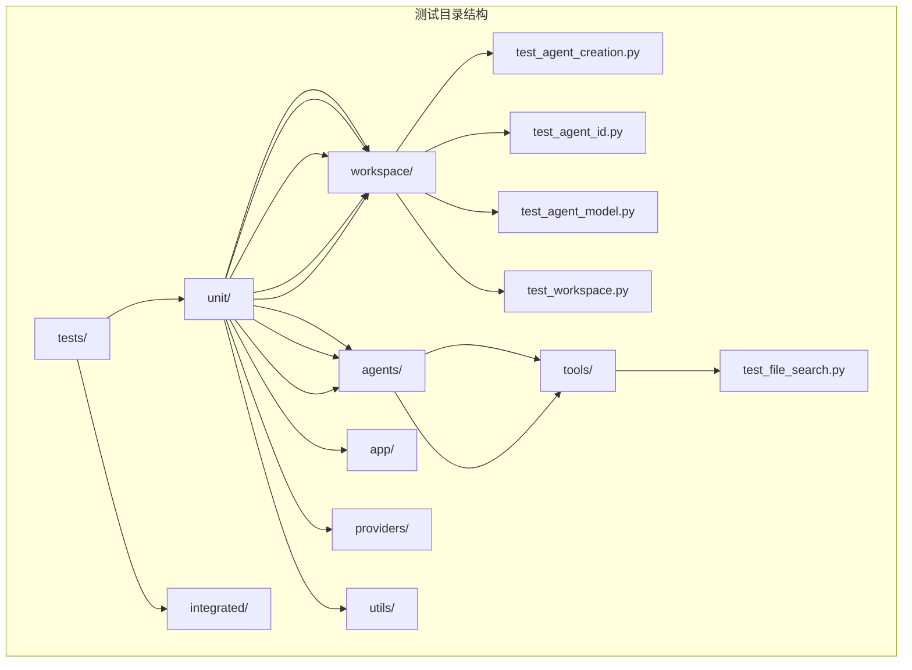

**图表来源**
- [test_agent_creation.py:1-87](file://tests/unit/workspace/test_agent_creation.py#L1-L87)
- [test_agent_id.py:1-27](file://tests/unit/workspace/test_agent_id.py#L1-L27)
- [test_agent_model.py:1-296](file://tests/unit/workspace/test_agent_model.py#L1-L296)
- [test_workspace.py:1-97](file://tests/unit/workspace/test_workspace.py#L1-L97)

## 核心组件

### 代理配置管理系统

代理配置系统是整个测试框架的核心，负责管理代理的生命周期和配置持久化：

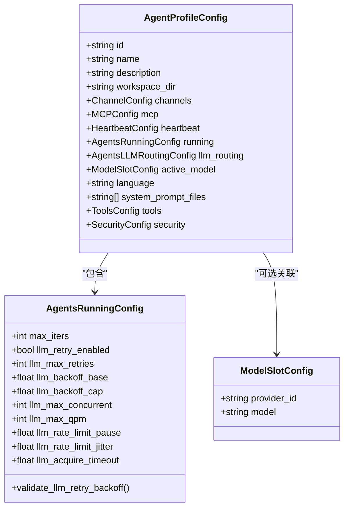

**图表来源**
- [config.py:653-712](file://src/qwenpaw/config/config.py#L653-L712)
- [config.py:453-549](file://src/qwenpaw/config/config.py#L453-L549)
- [config.py:1-50](file://src/qwenpaw/providers/models.py#L1-L50)

### 工作空间管理系统

工作空间系统为每个代理提供独立的运行环境：

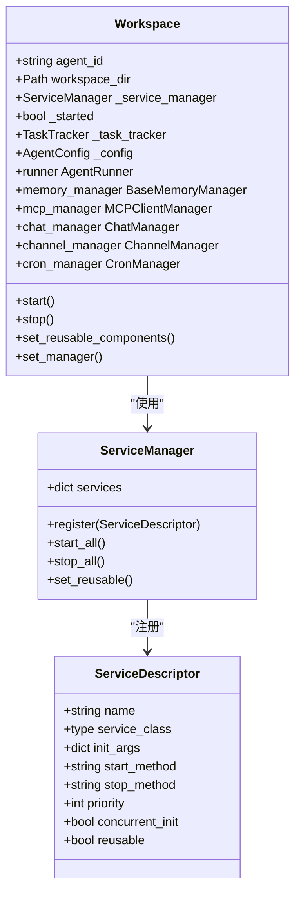

**图表来源**
- [workspace.py:47-389](file://src/qwenpaw/app/workspace/workspace.py#L47-L389)
- [service_factories.py:1-171](file://src/qwenpaw/app/workspace/service_factories.py#L1-L171)

**章节来源**
- [config.py:30-37](file://src/qwenpaw/config/config.py#L30-L37)
- [workspace.py:60-86](file://src/qwenpaw/app/workspace/workspace.py#L60-L86)

## 架构概览

QwenPaw的测试架构采用分层设计，确保各个组件的独立测试和集成验证：

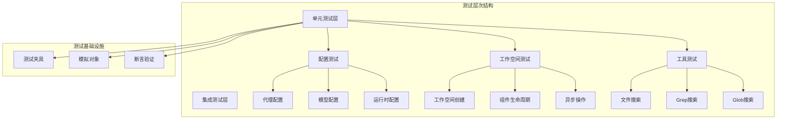

**图表来源**
- [test_agent_creation.py:1-87](file://tests/unit/workspace/test_agent_creation.py#L1-L87)
- [test_agent_model.py:24-64](file://tests/unit/workspace/test_agent_model.py#L24-L64)
- [test_file_search.py:26-51](file://tests/unit/agents/tools/test_file_search.py#L26-L51)

## 详细组件分析

### 代理创建测试

代理创建测试主要验证代理ID生成机制和冲突处理逻辑：

#### 代理ID生成测试

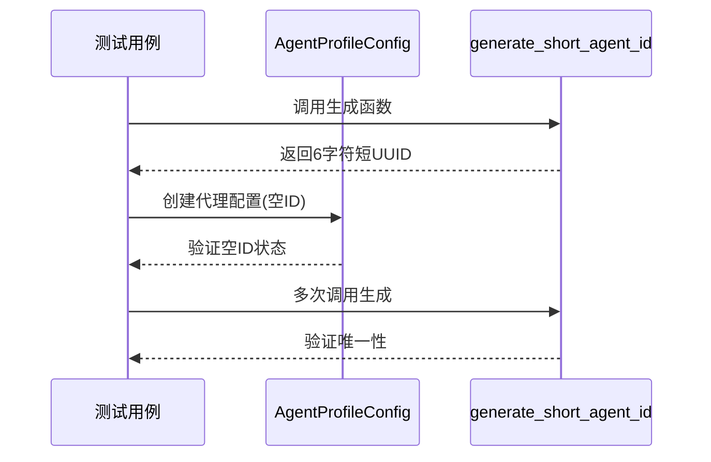

**图表来源**
- [test_agent_creation.py:11-25](file://tests/unit/workspace/test_agent_creation.py#L11-L25)
- [config.py:30-36](file://src/qwenpaw/config/config.py#L30-L36)

**章节来源**
- [test_agent_creation.py:11-87](file://tests/unit/workspace/test_agent_creation.py#L11-L87)
- [config.py:30-36](file://src/qwenpaw/config/config.py#L30-L36)

#### 代理ID验证测试

代理ID验证测试确保生成的ID符合预期格式和约束：

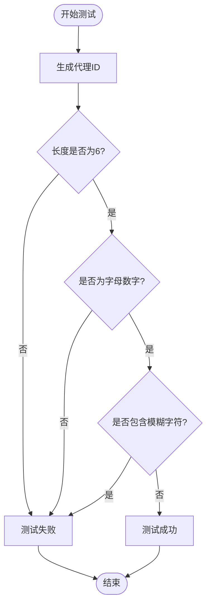

**图表来源**
- [test_agent_id.py:6-27](file://tests/unit/workspace/test_agent_id.py#L6-L27)

**章节来源**
- [test_agent_id.py:6-27](file://tests/unit/workspace/test_agent_id.py#L6-L27)

### 代理模型配置测试

代理模型配置测试验证每个代理的独立模型设置和持久化机制：

#### 模型配置持久化测试

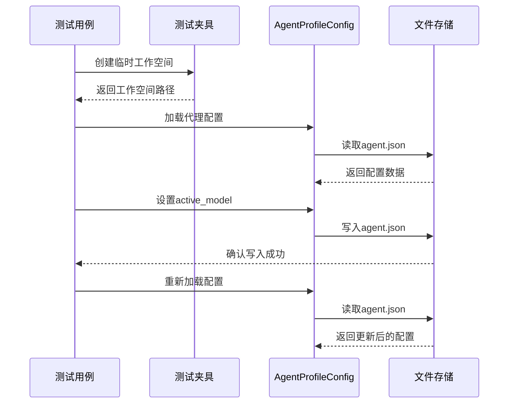

**图表来源**
- [test_agent_model.py:24-64](file://tests/unit/workspace/test_agent_model.py#L24-L64)
- [test_agent_model.py:75-93](file://tests/unit/workspace/test_agent_model.py#L75-L93)

**章节来源**
- [test_agent_model.py:24-296](file://tests/unit/workspace/test_agent_model.py#L24-L296)

#### 异步操作和错误处理测试

代理模型测试中包含了对异步操作和错误场景的处理：

**章节来源**
- [test_agent_model.py:289-296](file://tests/unit/workspace/test_agent_model.py#L289-L296)

### 工作空间初始化测试

工作空间测试验证代理运行时环境的正确初始化：

#### 工作空间生命周期测试

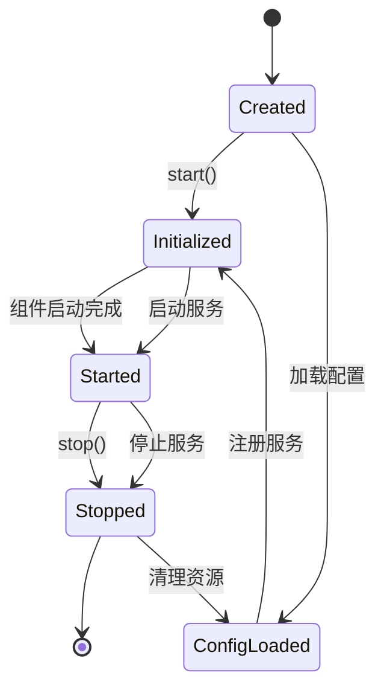

**图表来源**
- [test_workspace.py:8-97](file://tests/unit/workspace/test_workspace.py#L8-L97)

**章节来源**
- [test_workspace.py:8-97](file://tests/unit/workspace/test_workspace.py#L8-L97)

#### 组件依赖关系测试

工作空间测试还验证了组件之间的依赖关系：

**章节来源**
- [workspace.py:142-289](file://src/qwenpaw/app/workspace/workspace.py#L142-L289)

### 文件搜索工具测试

文件搜索工具测试是最复杂的测试模块，涵盖了内容搜索、文件发现和异步操作的完整测试套件。

#### 文件搜索测试夹具

文件搜索测试使用了精心设计的测试夹具和模拟对象：

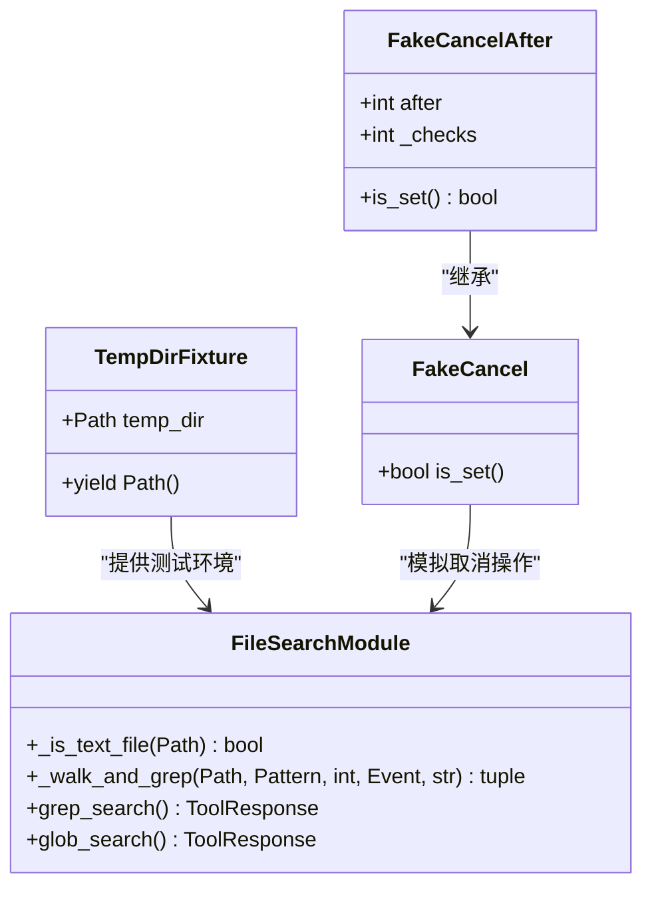

**图表来源**
- [test_file_search.py:26-51](file://tests/unit/agents/tools/test_file_search.py#L26-L51)
- [test_file_search.py:13-18](file://tests/unit/agents/tools/test_file_search.py#L13-L18)

**章节来源**
- [test_file_search.py:26-51](file://tests/unit/agents/tools/test_file_search.py#L26-L51)

#### 搜索算法测试

文件搜索算法经过了全面的测试覆盖：

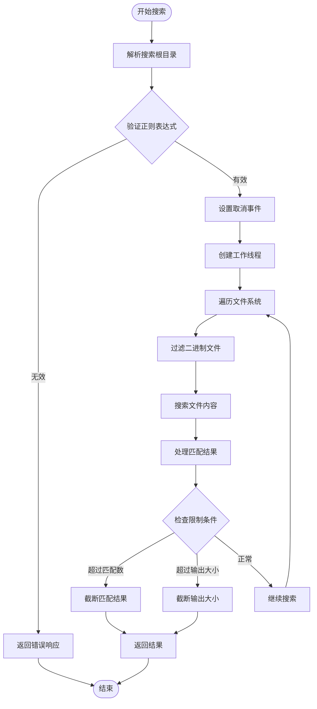

**图表来源**
- [file_search.py:274-435](file://src/qwenpaw/agents/tools/file_search.py#L274-L435)

**章节来源**
- [test_file_search.py:72-101](file://tests/unit/agents/tools/test_file_search.py#L72-L101)

#### 异步操作和超时处理测试

文件搜索工具测试包含了对异步操作和超时处理的验证：

**章节来源**
- [test_file_search.py:343-366](file://tests/unit/agents/tools/test_file_search.py#L343-L366)
- [test_file_search.py:537-547](file://tests/unit/agents/tools/test_file_search.py#L537-L547)

## 依赖分析

QwenPaw测试系统的依赖关系展现了清晰的模块化设计：

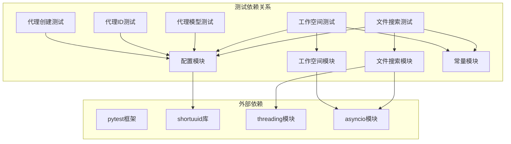

**图表来源**
- [test_agent_creation.py:5-8](file://tests/unit/workspace/test_agent_creation.py#L5-L8)
- [test_agent_model.py:10-21](file://tests/unit/workspace/test_agent_model.py#L10-L21)
- [test_file_search.py:13-18](file://tests/unit/agents/tools/test_file_search.py#L13-L18)

**章节来源**
- [config.py:8-27](file://src/qwenpaw/config/config.py#L8-L27)
- [constant.py:221-282](file://src/qwenpaw/constant.py#L221-L282)

## 性能考虑

在设计测试时，性能是一个重要的考量因素：

### 测试性能优化策略

1. **内存管理**: 使用临时目录和自动清理机制
2. **并发控制**: 合理使用异步操作和线程池
3. **资源复用**: 在可能的情况下重用测试资源
4. **超时设置**: 为长时间运行的操作设置合理的超时

### 性能测试指标

- **测试执行时间**: 单个测试用例应在合理时间内完成
- **内存使用**: 避免内存泄漏和过度占用
- **并发性能**: 异步操作的并发处理能力
- **资源清理**: 测试完成后资源的完全释放

## 故障排除指南

### 常见测试问题及解决方案

#### 代理ID生成冲突

当遇到代理ID生成冲突时，可以：

1. 检查ID生成算法的唯一性保证
2. 验证冲突检测机制的有效性
3. 确认重试逻辑的正确实现

#### 工作空间初始化失败

工作空间初始化失败的常见原因：

1. **权限问题**: 检查工作空间目录的访问权限
2. **配置错误**: 验证代理配置文件的完整性
3. **依赖缺失**: 确认所有必需的服务都已正确启动

#### 文件搜索性能问题

文件搜索性能问题的排查步骤：

1. **超时处理**: 检查搜索超时设置是否合理
2. **资源限制**: 验证文件大小和匹配数量的限制
3. **并发控制**: 确认异步操作的并发限制

**章节来源**
- [test_agent_creation.py:27-57](file://tests/unit/workspace/test_agent_creation.py#L27-L57)
- [test_workspace.py:322-358](file://tests/unit/workspace/test_workspace.py#L322-L358)
- [test_file_search.py:537-547](file://tests/unit/agents/tools/test_file_search.py#L537-L547)

## 结论

QwenPaw代理系统的单元测试展现了完整的测试覆盖和严谨的测试设计。通过精心设计的测试夹具、模拟对象和断言验证，确保了代理系统核心功能的稳定性和可靠性。

测试系统的主要特点包括：

1. **全面的功能覆盖**: 涵盖了代理创建、配置管理、工作空间初始化和工具执行等核心功能
2. **严格的边界条件测试**: 包含了各种异常情况和边界场景的处理
3. **异步操作验证**: 全面测试了异步操作和超时处理机制
4. **性能和资源管理**: 关注测试的性能影响和资源使用效率

这些测试为QwenPaw代理系统的持续开发和维护提供了坚实的基础，确保了系统的稳定性和可扩展性。