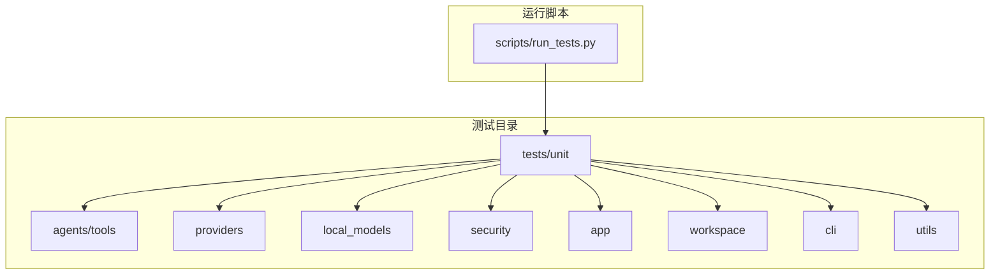
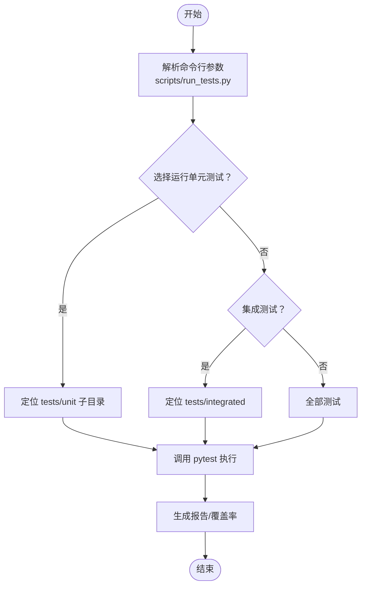
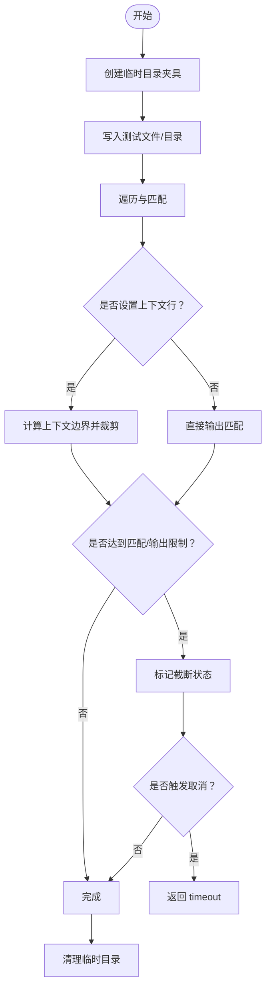
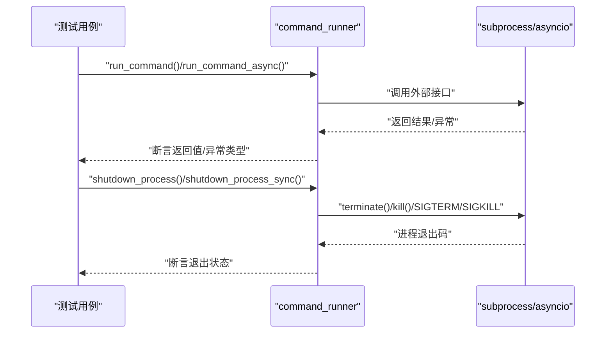
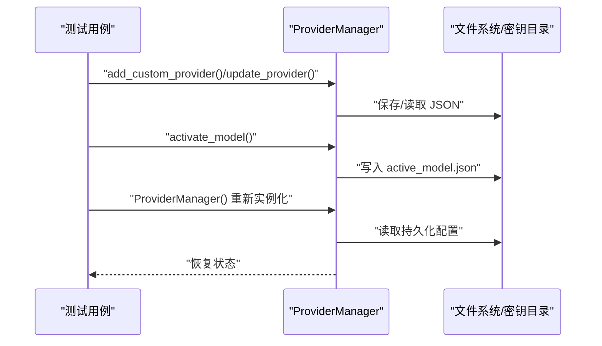
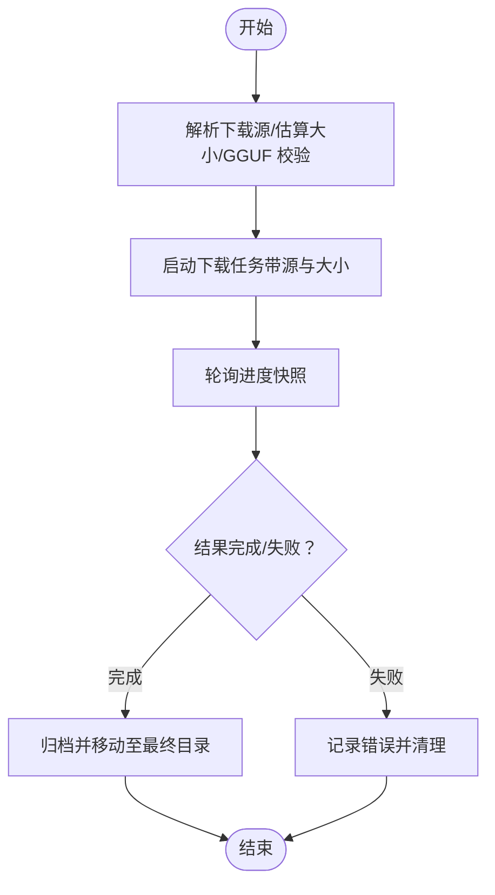
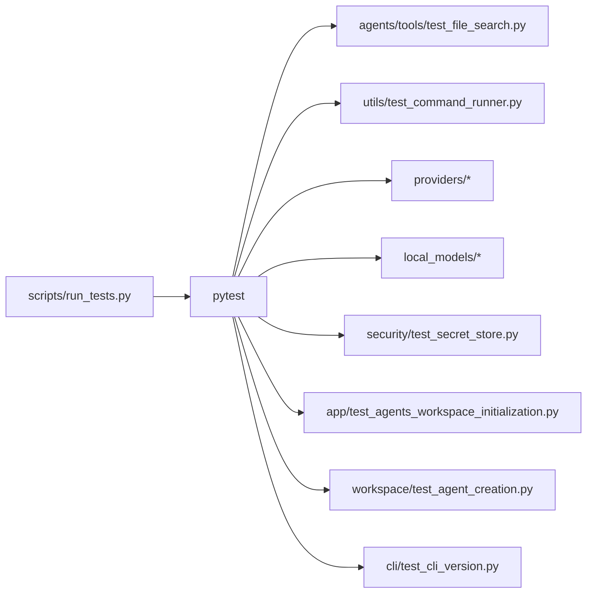

# 单元测试

<cite>
**本文引用的文件**
- [tests/unit/agents/tools/test_file_search.py](file://tests/unit/agents/tools/test_file_search.py)
- [tests/unit/utils/test_command_runner.py](file://tests/unit/utils/test_command_runner.py)
- [tests/unit/providers/test_provider_manager.py](file://tests/unit/providers/test_provider_manager.py)
- [tests/unit/providers/test_openai_provider.py](file://tests/unit/providers/test_openai_provider.py)
- [tests/unit/providers/test_anthropic_provider.py](file://tests/unit/providers/test_anthropic_provider.py)
- [tests/unit/providers/test_gemini_provider.py](file://tests/unit/providers/test_gemini_provider.py)
- [tests/unit/local_models/test_model_manager.py](file://tests/unit/local_models/test_model_manager.py)
- [tests/unit/local_models/test_download_manager.py](file://tests/unit/local_models/test_download_manager.py)
- [tests/unit/security/test_secret_store.py](file://tests/unit/security/test_secret_store.py)
- [tests/unit/app/test_agents_workspace_initialization.py](file://tests/unit/app/test_agents_workspace_initialization.py)
- [tests/unit/workspace/test_agent_creation.py](file://tests/unit/workspace/test_agent_creation.py)
- [tests/unit/cli/test_cli_version.py](file://tests/unit/cli/test_cli_version.py)
- [scripts/run_tests.py](file://scripts/run_tests.py)
</cite>

## 目录
1. [简介](#简介)
2. [项目结构](#项目结构)
3. [核心组件](#核心组件)
4. [架构总览](#架构总览)
5. [详细组件分析](#详细组件分析)
6. [依赖分析](#依赖分析)
7. [性能考虑](#性能考虑)
8. [故障排查指南](#故障排查指南)
9. [结论](#结论)
10. [附录](#附录)

## 简介
本文件为 QwenPaw 的单元测试文档，覆盖代理系统、提供商（Provider）、本地模型、安全模块、应用初始化与工作区、命令行版本检查以及通用工具（命令执行）等模块的测试实现。文档解释了测试用例设计原则、边界条件处理、夹具（fixtures）与模拟对象（mock/fake）的使用方式、断言方法与错误场景验证，并给出测试数据准备与清理策略，以及调试与问题定位建议。

## 项目结构
- 测试目录按功能分层组织：tests/unit 下按模块划分子目录，例如 agents、providers、local_models、security、app、workspace、cli 等。
- 覆盖范围广：从核心工具函数到复杂流程（如模型下载、提供商连接性检查、工作区初始化）均有对应测试。
- 使用 pytest 作为测试框架，配合 monkeypatch、临时目录、自定义夹具等机制进行隔离与模拟。

图示来源
- [scripts/run_tests.py:175-282](file://scripts/run_tests.py#L175-L282)

章节来源
- [scripts/run_tests.py:175-282](file://scripts/run_tests.py#L175-L282)

## 核心组件
- 文件搜索工具：对文本文件识别、递归遍历、正则匹配、上下文行输出、截断与取消控制等进行测试。
- 命令执行工具：同步/异步命令执行、进程生命周期管理、优雅关闭与强制终止、跨平台差异处理。
- 提供商管理：内置提供商注册、自定义提供商增删改查、持久化与迁移、激活模型、本地模型恢复。
- 本地模型管理：下载任务进度追踪、结果归档、源选择与校验、模型目录布局与清理。
- 安全模块：密钥加密/解密、字段级加解密、兼容性与容错、主密钥生成与读取。
- 应用初始化与工作区：工作区文件结构初始化、内置技能复制、QA 文档种子语言参数传递。
- 工作区代理创建：短 UUID 生成、冲突处理、默认 ID 保护。
- CLI 版本：命令行 --version 输出与版本号一致性。

章节来源
- [tests/unit/agents/tools/test_file_search.py:1-737](file://tests/unit/agents/tools/test_file_search.py#L1-L737)
- [tests/unit/utils/test_command_runner.py:1-600](file://tests/unit/utils/test_command_runner.py#L1-L600)
- [tests/unit/providers/test_provider_manager.py:1-537](file://tests/unit/providers/test_provider_manager.py#L1-L537)
- [tests/unit/providers/test_openai_provider.py:1-269](file://tests/unit/providers/test_openai_provider.py#L1-L269)
- [tests/unit/providers/test_anthropic_provider.py:1-189](file://tests/unit/providers/test_anthropic_provider.py#L1-L189)
- [tests/unit/providers/test_gemini_provider.py:1-341](file://tests/unit/providers/test_gemini_provider.py#L1-L341)
- [tests/unit/local_models/test_model_manager.py:1-414](file://tests/unit/local_models/test_model_manager.py#L1-L414)
- [tests/unit/local_models/test_download_manager.py:1-260](file://tests/unit/local_models/test_download_manager.py#L1-L260)
- [tests/unit/security/test_secret_store.py:1-176](file://tests/unit/security/test_secret_store.py#L1-L176)
- [tests/unit/app/test_agents_workspace_initialization.py:1-109](file://tests/unit/app/test_agents_workspace_initialization.py#L1-L109)
- [tests/unit/workspace/test_agent_creation.py:1-87](file://tests/unit/workspace/test_agent_creation.py#L1-L87)
- [tests/unit/cli/test_cli_version.py:1-13](file://tests/unit/cli/test_cli_version.py#L1-L13)

## 架构总览
下图展示了测试运行的整体流程与关键入口：

图示来源
- [scripts/run_tests.py:148-173](file://scripts/run_tests.py#L148-L173)

## 详细组件分析

### 文件搜索工具（agents.tools.file_search）
- 设计原则
  - 使用临时目录夹具隔离测试环境，确保可重复与无污染。
  - 使用自定义 FakeCancel/FakeCancelAfter 模拟取消事件，覆盖提前退出路径。
  - 对二进制/大文件/不可读文件进行边界与容错测试。
  - 针对 include 模式、上下文行、匹配上限、输出大小限制、目录跳过等边界条件逐一验证。
- 关键断言
  - 匹配结果数量与顺序、上下文行范围、状态字符串（ok/truncated/timeout）。
  - 文件权限异常时的降级行为（跳过不可读文件）。
- 错误场景
  - 正则转义、超限截断、取消事件触发、空目录、嵌套目录匹配。
- 数据准备与清理
  - 通过临时目录夹具自动创建与回收；对权限修改在 finally 中恢复。
- 调试建议
  - 在复杂上下文场景中打印中间状态（匹配块、分隔符位置），便于定位重叠上下文问题。

图示来源
- [tests/unit/agents/tools/test_file_search.py:26-537](file://tests/unit/agents/tools/test_file_search.py#L26-L537)

章节来源
- [tests/unit/agents/tools/test_file_search.py:1-737](file://tests/unit/agents/tools/test_file_search.py#L1-L737)

### 命令执行工具（utils.command_runner）
- 设计原则
  - 使用 monkeypatch 替换 subprocess/asyncio 实现，避免真实外部进程。
  - 分离同步与异步路径，覆盖 Windows 回退到线程 Popen 的场景。
  - 进程生命周期：启动、等待、优雅关闭、强制终止、进程组信号。
- 关键断言
  - 返回码、组合输出、命令参数、工作目录、环境变量、标准流参数。
  - 异步进程属性（PID、创建模式、是否拥有进程组）。
- 错误场景
  - 可执行文件不存在、非零返回码、Windows 平台特定异常、进程组信号发送。
- 数据准备与清理
  - 通过 monkeypatch 注入假实现，无需真实文件系统变更。
- 调试建议
  - 记录实际传入 subprocess/asyncio 的参数，快速定位调用差异。

图示来源
- [tests/unit/utils/test_command_runner.py:26-600](file://tests/unit/utils/test_command_runner.py#L26-L600)

章节来源
- [tests/unit/utils/test_command_runner.py:1-600](file://tests/unit/utils/test_command_runner.py#L1-L600)

### 提供商管理（providers.provider_manager）
- 设计原则
  - 使用隔离的密钥存储目录夹具，避免影响用户主目录。
  - 通过 monkeypatch 注入假客户端，模拟远端 API 行为。
  - 验证持久化、迁移、冲突解决、内置/自定义提供商区分。
- 关键断言
  - 内置提供商注册与基础 URL、模型列表、连接检查支持标志。
  - 自定义提供商添加、重命名、重复添加的唯一性处理。
  - 激活模型持久化与重启后恢复。
  - 本地模型恢复：URL 更新、额外模型探测信息保留。
- 错误场景
  - 未知提供商/模型激活失败、JSON 解析失败、删除缺失文件的安全性。
- 数据准备与清理
  - 临时密钥目录与 JSON 文件；迁移后旧文件不再存在。
- 调试建议
  - 打印加载的提供商配置与最终持久化内容，核对字段更新。

图示来源
- [tests/unit/providers/test_provider_manager.py:84-537](file://tests/unit/providers/test_provider_manager.py#L84-L537)

章节来源
- [tests/unit/providers/test_provider_manager.py:1-537](file://tests/unit/providers/test_provider_manager.py#L1-L537)

### OpenAI 提供商（providers.openai_provider）
- 设计原则
  - 通过 SimpleNamespace 构造假客户端，模拟 list/list 接口。
  - 验证连接检查、模型列表规范化与去重、模型连接检查、配置更新。
- 关键断言
  - 连接成功/失败消息、模型 ID/名称规范化、配置更新仅作用于非 None 字段。
  - 冻结 URL 与聊天模型更新策略差异（内置 vs 自定义）。
- 错误场景
  - API 异常捕获、空模型 ID、None 值跳过。
- 数据准备与清理
  - 通过 monkeypatch 注入假客户端，无需真实网络访问。
- 调试建议
  - 断言传入客户端的参数（超时、模型名、最大 token 等）。

章节来源
- [tests/unit/providers/test_openai_provider.py:1-269](file://tests/unit/providers/test_openai_provider.py#L1-L269)

### Anthropic 提供商（providers.anthropic_provider）
- 设计原则
  - 同 OpenAI 测试模式，构造假客户端与异步迭代器。
- 关键断言
  - 连接检查、模型列表规范化、模型连接检查（含 ping 内容）。
  - 配置更新仅对非 None 字段生效。
- 错误场景
  - API 异常、空模型 ID、异常消息格式。
- 数据准备与清理
  - monkeypatch 注入假客户端与异常类。

章节来源
- [tests/unit/providers/test_anthropic_provider.py:1-189](file://tests/unit/providers/test_anthropic_provider.py#L1-L189)

### Gemini 提供商（providers.gemini_provider）
- 设计原则
  - 使用自定义异步迭代器包装器，模拟异步流式响应。
- 关键断言
  - 连接检查、模型列表规范化、模型连接检查（contents/ping）。
  - 模型载荷标准化（去除前缀、去重、显示名处理）。
  - 配置更新仅对非 None 字段生效。
- 错误场景
  - API 错误、通用异常、空模型 ID。
- 数据准备与清理
  - monkeypatch 注入假客户端与异常类型。

章节来源
- [tests/unit/providers/test_gemini_provider.py:1-341](file://tests/unit/providers/test_gemini_provider.py#L1-L341)

### 本地模型管理（local_models.model_manager）
- 设计原则
  - 通过自定义控制器夹具模拟下载控制与快照。
  - 验证下载源解析、大小估算、GGUF 校验、结果归档、目录布局。
- 关键断言
  - 下载命令参数、源选择、进度快照、最终目录移动。
  - 不包含 GGUF 的仓库拒绝下载并抛出异常。
  - 临时目录清理与最终目录存在性。
- 错误场景
  - 源显式指定时跳过探测、标准流损坏时的修复。
- 数据准备与清理
  - 临时 staging/final 目录；模拟标准流损坏并验证修复逻辑。
- 调试建议
  - 打印 staging 目录与最终目录路径，确认移动与清理。

图示来源
- [tests/unit/local_models/test_model_manager.py:49-414](file://tests/unit/local_models/test_model_manager.py#L49-L414)

章节来源
- [tests/unit/local_models/test_model_manager.py:1-414](file://tests/unit/local_models/test_model_manager.py#L1-L414)

### 本地模型下载控制器（local_models.download_manager）
- 设计原则
  - 验证进度追踪器、消息序列化/反序列化、进程任务封装、队列消息处理。
- 关键断言
  - 结果消息 round-trip、进度更新消息 round-trip、任务完成/失败标记。
  - 终止结果后停止轮询、finalize 异常转换为失败并清理。
- 错误场景
  - 队列关闭、终端消息后不再轮询、finalize 抛出异常。
- 数据准备与清理
  - 使用内存队列与假任务目标，无需真实进程。

章节来源
- [tests/unit/local_models/test_download_manager.py:1-260](file://tests/unit/local_models/test_download_manager.py#L1-L260)

### 安全模块（security.secret_store）
- 设计原则
  - 使用隔离密钥目录夹具与确定性主密钥，保证可重复测试。
  - 验证字段级加解密、明文回退、错误密文容错、主密钥生成与读取。
- 关键断言
  - 加密/解密往返、空字段与 Unicode 处理、混合字段解密。
  - 错误密文与错误密钥的回退策略。
  - 主密钥缺失时自动生成并落盘。
- 错误场景
  - 破坏的 Fernet token、错误密钥导致的解密失败。
- 数据准备与清理
  - 临时密钥目录与 .master_key 文件；测试后自动清理。
- 调试建议
  - 打印密钥长度与生成路径，核对密钥文件存在性。

章节来源
- [tests/unit/security/test_secret_store.py:1-176](file://tests/unit/security/test_secret_store.py#L1-L176)

### 应用初始化与工作区（app 与 workspace）
- 设计原则
  - 使用 monkeypatch 替换 shutil.copytree、文件读写等外部调用。
  - 验证工作区目录结构、内置 QA 种子语言参数传递。
- 关键断言
  - sessions/memory/skills/jobs.json/chats.json 文件存在且内容正确。
  - 内置技能复制目标统一到 skills/ 目录。
  - QA 种子调用顺序：先语言后工作区目录。
- 错误场景
  - 无集成测试文件或目录不存在时的安全提示。
- 数据准备与清理
  - 临时工作区目录；测试后自动清理。

章节来源
- [tests/unit/app/test_agents_workspace_initialization.py:1-109](file://tests/unit/app/test_agents_workspace_initialization.py#L1-L109)
- [tests/unit/workspace/test_agent_creation.py:1-87](file://tests/unit/workspace/test_agent_creation.py#L1-L87)

### CLI 版本（cli）
- 设计原则
  - 使用 Click 的 CliRunner 调用 --version，断言输出包含当前版本号。
- 关键断言
  - 退出码为 0，输出包含 __version__。
- 错误场景
  - CLI 未安装或导入失败（由 run_tests.py 提前检测）。

章节来源
- [tests/unit/cli/test_cli_version.py:1-13](file://tests/unit/cli/test_cli_version.py#L1-L13)

## 依赖分析
- 测试运行依赖
  - pytest：核心测试框架。
  - pytest-xdist：并行执行（可选）。
  - click：CLI 测试。
  - google.genai、anthropic 等第三方 SDK：提供商测试。
- 模块间耦合
  - ProviderManager 与本地模型管理器存在协作关系（本地模型恢复）。
  - 下载控制器与模型管理器通过消息协议交互。
- 外部依赖与集成点
  - subprocess/asyncio：命令执行测试。
  - 文件系统：文件搜索、工作区初始化、密钥存储。
  - 第三方 API：OpenAI、Anthropic、Google Gemini。

图示来源
- [scripts/run_tests.py:148-173](file://scripts/run_tests.py#L148-L173)

章节来源
- [scripts/run_tests.py:148-173](file://scripts/run_tests.py#L148-L173)

## 性能考虑
- 测试并发与并行
  - 使用 -n auto 开启并行执行（需 pytest-xdist），缩短整体测试时间。
- I/O 与外部调用
  - 尽量使用内存队列、假实现与临时目录，减少磁盘与网络 I/O。
- 断言粒度
  - 对大文件/大量匹配场景，优先断言关键指标（数量、状态、路径），避免冗长比较。

## 故障排查指南
- 测试失败定位
  - 查看 pytest 输出中的断言失败点与异常栈。
  - 对异步/进程场景，打印传入参数与返回值，核对与期望一致。
- 权限与平台差异
  - Windows 上的进程组信号与 POSIX 不同，注意测试覆盖。
  - 文件权限异常时，确保 finally 中恢复权限。
- 覆盖率与报告
  - 使用 --cov 生成覆盖率报告，定位未覆盖路径。
- 日志与颜色输出
  - run_tests.py 提供彩色输出与状态提示，便于快速判断测试阶段。

章节来源
- [scripts/run_tests.py:33-61](file://scripts/run_tests.py#L33-L61)

## 结论
本测试文档系统梳理了 QwenPaw 的核心模块测试策略，强调了夹具与模拟对象的使用、边界条件与错误场景的覆盖、断言方法与调试技巧。通过规范化的测试实践，能够有效保障代理系统、提供商、本地模型、安全模块等功能的稳定性与可维护性。

## 附录
- 测试运行建议
  - 全量测试：python scripts/run_tests.py -a
  - 仅单元测试：python scripts/run_tests.py -u
  - 指定子目录：python scripts/run_tests.py -u providers
  - 生成覆盖率：python scripts/run_tests.py -a -c
  - 并行执行：python scripts/run_tests.py -p

章节来源
- [scripts/run_tests.py:175-282](file://scripts/run_tests.py#L175-L282)