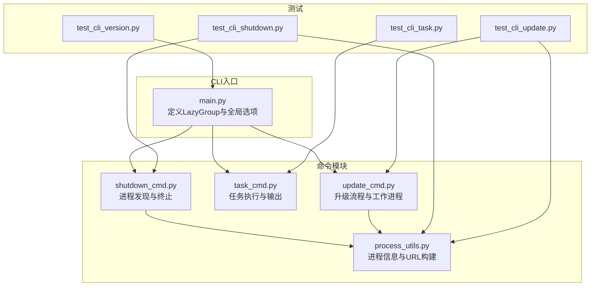
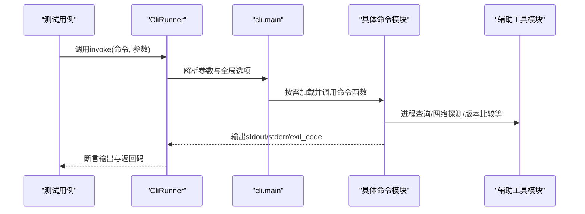
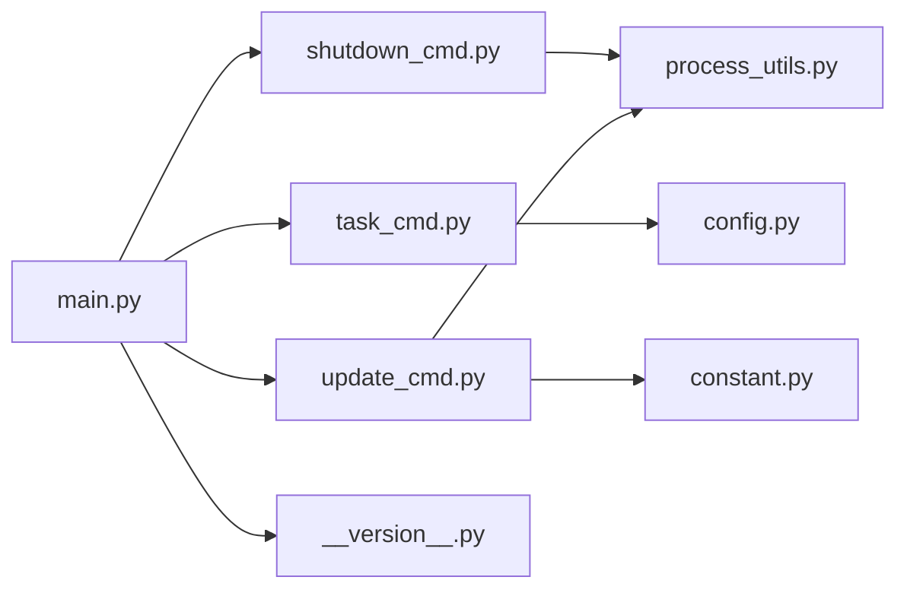

# 命令行工具测试

<cite>
**本文引用的文件**
- [main.py](file://src/qwenpaw/cli/main.py)
- [shutdown_cmd.py](file://src/qwenpaw/cli/shutdown_cmd.py)
- [task_cmd.py](file://src/qwenpaw/cli/task_cmd.py)
- [update_cmd.py](file://src/qwenpaw/cli/update_cmd.py)
- [process_utils.py](file://src/qwenpaw/cli/process_utils.py)
- [test_cli_shutdown.py](file://tests/unit/cli/test_cli_shutdown.py)
- [test_cli_task.py](file://tests/unit/cli/test_cli_task.py)
- [test_cli_update.py](file://tests/unit/cli/test_cli_update.py)
- [test_cli_version.py](file://tests/unit/cli/test_cli_version.py)
- [__version__.py](file://src/qwenpaw/__version__.py)
- [config.py](file://src/qwenpaw/config/config.py)
- [constant.py](file://src/qwenpaw/constant.py)
</cite>

## 目录
1. [简介](#简介)
2. [项目结构](#项目结构)
3. [核心组件](#核心组件)
4. [架构总览](#架构总览)
5. [详细组件分析](#详细组件分析)
6. [依赖分析](#依赖分析)
7. [性能考虑](#性能考虑)
8. [故障排查指南](#故障排查指南)
9. [结论](#结论)
10. [附录](#附录)

## 简介
本文件面向QwenPaw命令行工具的单元测试，系统性梳理并解释以下CLI功能的测试实现与方法：
- shutdown命令测试：进程发现、终止策略、跨平台差异（Windows/Linux）、失败回退与输出校验
- task命令测试：参数解析与验证、模型覆盖、输出目录写入、标准输出JSON格式、工具守卫行为、端到端请求上下文传递
- update命令测试：版本比较、安装源检测、运行服务探测、强制关闭流程、交互确认与非PyPI覆盖、工作进程分离与退出码
- version命令测试：版本选项输出一致性

文档同时提供命令解析测试、参数验证测试与执行结果验证的具体方法，以及如何模拟命令行环境与测试交互式操作的实践建议。

## 项目结构
QwenPaw CLI采用Click框架组织命令，通过延迟加载机制按需加载子命令模块；测试使用Click的CliRunner进行命令调用与断言，结合pytest的monkeypatch对内部函数进行打桩，以隔离外部依赖（网络、进程、文件系统）。

图表来源
- [main.py:58-171](file://src/qwenpaw/cli/main.py#L58-L171)
- [shutdown_cmd.py:1-386](file://src/qwenpaw/cli/shutdown_cmd.py#L1-L386)
- [task_cmd.py:1-289](file://src/qwenpaw/cli/task_cmd.py#L1-L289)
- [update_cmd.py:1-731](file://src/qwenpaw/cli/update_cmd.py#L1-L731)
- [process_utils.py:1-237](file://src/qwenpaw/cli/process_utils.py#L1-L237)
- [test_cli_shutdown.py:1-239](file://tests/unit/cli/test_cli_shutdown.py#L1-L239)
- [test_cli_task.py:1-441](file://tests/unit/cli/test_cli_task.py#L1-L441)
- [test_cli_update.py:1-912](file://tests/unit/cli/test_cli_update.py#L1-L912)
- [test_cli_version.py:1-13](file://tests/unit/cli/test_cli_version.py#L1-L13)

章节来源
- [main.py:58-171](file://src/qwenpaw/cli/main.py#L58-L171)

## 核心组件
- CLI入口与延迟加载：通过LazyGroup在首次调用时动态导入具体命令模块，减少启动开销。
- 全局选项：支持--host/--port，用于API主机与端口，默认从上次运行记录读取，最终回退至默认值。
- 版本选项：通过version_option装饰器输出当前版本。
- 子命令注册：包括app、channels、daemon、chats、clean、cron、env、init、models、skills、uninstall、desktop、update、shutdown、auth、agents、plugin、task等。

章节来源
- [main.py:58-171](file://src/qwenpaw/cli/main.py#L58-L171)

## 架构总览
下图展示了CLI命令的调用链路与关键依赖关系，便于理解测试中需要关注的模块边界与打桩点。

图表来源
- [main.py:58-171](file://src/qwenpaw/cli/main.py#L58-L171)
- [shutdown_cmd.py:303-386](file://src/qwenpaw/cli/shutdown_cmd.py#L303-L386)
- [task_cmd.py:173-289](file://src/qwenpaw/cli/task_cmd.py#L173-L289)
- [update_cmd.py:631-731](file://src/qwenpaw/cli/update_cmd.py#L631-L731)
- [process_utils.py:131-237](file://src/qwenpaw/cli/process_utils.py#L131-L237)

## 详细组件分析

### shutdown命令测试
目标与范围
- 验证后端监听进程、前端开发进程、桌面包装进程的发现与终止
- 跨平台差异：Windows进程树终止与信号发送；失败回退与超时等待
- 输出格式与错误处理：无进程可停、部分失败、成功列表

测试要点
- 使用monkeypatch替换进程发现与终止相关函数，确保测试稳定可控
- 针对Windows与Unix分别验证终止策略与回退逻辑
- 断言输出包含被停止的PID列表，以及失败时的异常信息

典型断言路径
- 成功停止：断言exit_code为0且输出包含已停止的PID
- 失败停止：断言exit_code非0且输出包含“Failed to shutdown process”
- 无进程可停：断言exit_code非0且输出包含“No running QwenPaw”

章节来源
- [test_cli_shutdown.py:14-93](file://tests/unit/cli/test_cli_shutdown.py#L14-L93)
- [test_cli_shutdown.py:95-123](file://tests/unit/cli/test_cli_shutdown.py#L95-L123)
- [test_cli_shutdown.py:125-173](file://tests/unit/cli/test_cli_shutdown.py#L125-L173)
- [test_cli_shutdown.py:175-239](file://tests/unit/cli/test_cli_shutdown.py#L175-L239)
- [shutdown_cmd.py:303-386](file://src/qwenpaw/cli/shutdown_cmd.py#L303-L386)
- [process_utils.py:131-237](file://src/qwenpaw/cli/process_utils.py#L131-L237)

### task命令测试
目标与范围
- 参数解析与验证：--instruction必填、空指令拒绝、--model覆盖Agent配置
- 输出与退出码：成功返回状态码0，失败返回1；标准输出为JSON对象
- 工具守卫：通过request_context控制是否绕过守卫
- 技能工作区隔离：外部技能目录作为overlay，不污染真实工作区
- 输出目录：可选写入result.json，包含状态、耗时、用量等字段

测试要点
- 使用monkeypatch注入异步任务执行函数，避免真实推理与IO
- 验证不同模型字符串格式（带斜杠与不带斜杠）的解析
- 验证输出目录写入与JSON内容结构
- 验证工具守卫在不同request_context下的行为

典型断言路径
- 帮助信息：断言--help输出包含各参数标志
- 空指令拒绝：断言exit_code非0且输出包含“empty”
- 成功输出：断言exit_code为0，输出为合法JSON，包含status与usage
- 工具守卫绕过：断言request_context中的“_headless_tool_guard”为“false”
- 技能工作区隔离：断言overlay仅包含有效技能清单，且不污染原工作区

章节来源
- [test_cli_task.py:38-52](file://tests/unit/cli/test_cli_task.py#L38-L52)
- [test_cli_task.py:54-64](file://tests/unit/cli/test_cli_task.py#L54-L64)
- [test_cli_task.py:70-115](file://tests/unit/cli/test_cli_task.py#L70-L115)
- [test_cli_task.py:120-161](file://tests/unit/cli/test_cli_task.py#L120-L161)
- [test_cli_task.py:170-189](file://tests/unit/cli/test_cli_task.py#L170-L189)
- [test_cli_task.py:192-222](file://tests/unit/cli/test_cli_task.py#L192-L222)
- [test_cli_task.py:251-284](file://tests/unit/cli/test_cli_task.py#L251-L284)
- [test_cli_task.py:289-441](file://tests/unit/cli/test_cli_task.py#L289-L441)
- [task_cmd.py:173-289](file://src/qwenpaw/cli/task_cmd.py#L173-L289)

### update命令测试
目标与范围
- 版本比较：支持语义化版本与不可比较版本（如分支名）
- 安装源检测：PyPI、editable、VCS、本地wheel、direct-url
- 运行服务探测：HTTP探测与进程回退探测，支持0.0.0.0回退为127.0.0.1
- 强制关闭：交互确认、调用qwenpaw shutdown、二次探测
- 非PyPI覆盖：交互确认或--yes跳过确认
- 工作进程：前台/后台执行更新，Windows分离、其他平台会话新建
- 退出码：工作进程返回码透传

测试要点
- 使用monkeypatch替换HTTP请求、进程探测、安装信息检测等外部依赖
- 验证不同安装源类型与版本比较结果
- 验证运行服务存在时的交互流程与错误提示
- 验证Windows与非Windows平台的不同执行路径

典型断言路径
- 最新版本已是最新：断言输出包含“already up to date.”
- 运行服务检测：断言探测到服务且版本正确
- 强制关闭流程：断言输出包含“Running qwenpaw shutdown...”，并验证后续步骤
- 非PyPI覆盖：断言输出包含覆盖警告与确认提示
- 工作进程分离：断言Windows平台输出“continue after this command exits”，并生成计划文件
- 退出码透传：断言update命令返回工作进程的退出码

章节来源
- [test_cli_update.py:57-62](file://tests/unit/cli/test_cli_update.py#L57-L62)
- [test_cli_update.py:93-97](file://tests/unit/cli/test_cli_update.py#L93-L97)
- [test_cli_update.py:124-170](file://tests/unit/cli/test_cli_update.py#L124-L170)
- [test_cli_update.py:172-198](file://tests/unit/cli/test_cli_update.py#L172-L198)
- [test_cli_update.py:200-234](file://tests/unit/cli/test_cli_update.py#L200-L234)
- [test_cli_update.py:236-284](file://tests/unit/cli/test_cli_update.py#L236-L284)
- [test_cli_update.py:286-364](file://tests/unit/cli/test_cli_update.py#L286-L364)
- [test_cli_update.py:366-447](file://tests/unit/cli/test_cli_update.py#L366-L447)
- [test_cli_update.py:449-477](file://tests/unit/cli/test_cli_update.py#L449-L477)
- [test_cli_update.py:479-536](file://tests/unit/cli/test_cli_update.py#L479-L536)
- [test_cli_update.py:538-601](file://tests/unit/cli/test_cli_update.py#L538-L601)
- [test_cli_update.py:603-632](file://tests/unit/cli/test_cli_update.py#L603-L632)
- [test_cli_update.py:634-690](file://tests/unit/cli/test_cli_update.py#L634-L690)
- [test_cli_update.py:692-724](file://tests/unit/cli/test_cli_update.py#L692-L724)
- [test_cli_update.py:726-775](file://tests/unit/cli/test_cli_update.py#L726-L775)
- [test_cli_update.py:777-800](file://tests/unit/cli/test_cli_update.py#L777-L800)
- [update_cmd.py:631-731](file://src/qwenpaw/cli/update_cmd.py#L631-L731)
- [process_utils.py:131-237](file://src/qwenpaw/cli/process_utils.py#L131-L237)

### version命令测试
目标与范围
- 验证--version选项输出当前版本号

测试要点
- 使用CliRunner调用--version，断言输出包含当前版本字符串，且exit_code为0

章节来源
- [test_cli_version.py:8-13](file://tests/unit/cli/test_cli_version.py#L8-L13)
- [__version__.py:1-3](file://src/qwenpaw/__version__.py#L1-L3)

## 依赖分析
- 命令注册与延迟加载：LazyGroup在首次访问时动态导入命令模块，避免启动时的重依赖加载
- 进程与网络依赖：shutdown与update命令依赖系统进程与HTTP探测，测试通过monkeypatch隔离
- 配置与常量：task命令依赖Agent配置与工作目录，update命令依赖安装信息与工作目录常量
- 版本管理：version命令依赖__version__常量

图表来源
- [main.py:98-144](file://src/qwenpaw/cli/main.py#L98-L144)
- [shutdown_cmd.py:14-18](file://src/qwenpaw/cli/shutdown_cmd.py#L14-L18)
- [task_cmd.py:236-238](file://src/qwenpaw/cli/task_cmd.py#L236-L238)
- [update_cmd.py:22-23](file://src/qwenpaw/cli/update_cmd.py#L22-L23)
- [constant.py:89-101](file://src/qwenpaw/constant.py#L89-L101)
- [__version__.py:1-3](file://src/qwenpaw/__version__.py#L1-L3)

章节来源
- [main.py:98-144](file://src/qwenpaw/cli/main.py#L98-L144)
- [constant.py:89-101](file://src/qwenpaw/constant.py#L89-L101)

## 性能考虑
- 延迟加载：通过LazyGroup减少启动时的模块导入成本
- 测试隔离：使用monkeypatch替换外部依赖，避免真实系统调用带来的不确定性与耗时
- 异步任务：task命令使用异步执行，测试中通过AsyncMock快速返回结果，缩短测试时间
- 进程探测：shutdown与update命令在不同平台使用不同的探测策略，测试中统一通过打桩保证稳定性

## 故障排查指南
- 无进程可停：检查进程发现函数是否正确返回PID集合，确认平台差异与权限问题
- 终止失败：检查终止策略与回退逻辑，确认超时等待与信号发送是否生效
- 版本不可比较：当最新版本为分支名或预发布标签时，交互确认或--yes跳过
- 运行服务冲突：update命令检测到正在运行的服务时，需先执行shutdown或确认强制关闭
- 输出格式异常：task命令输出为JSON，需确保字段完整性与编码正确性

章节来源
- [test_cli_shutdown.py:71-93](file://tests/unit/cli/test_cli_shutdown.py#L71-L93)
- [test_cli_update.py:286-325](file://tests/unit/cli/test_cli_update.py#L286-L325)
- [test_cli_update.py:603-632](file://tests/unit/cli/test_cli_update.py#L603-L632)
- [task_cmd.py:275-289](file://src/qwenpaw/cli/task_cmd.py#L275-L289)

## 结论
通过对shutdown、task、update、version四个CLI功能的单元测试分析，可以看出：
- 测试围绕命令解析、参数验证、执行结果与错误处理四条主线展开
- 使用Click的CliRunner与pytest的monkeypatch实现了稳定的命令行环境模拟
- 跨平台差异通过平台条件判断与打桩策略得到充分覆盖
- 端到端测试关注请求上下文与输出格式，确保CLI行为与预期一致

## 附录
- 测试示例路径
  - shutdown命令：[test_cli_shutdown.py:14-123](file://tests/unit/cli/test_cli_shutdown.py#L14-L123)
  - task命令：[test_cli_task.py:38-222](file://tests/unit/cli/test_cli_task.py#L38-L222)
  - update命令：[test_cli_update.py:172-447](file://tests/unit/cli/test_cli_update.py#L172-L447)
  - version命令：[test_cli_version.py:8-13](file://tests/unit/cli/test_cli_version.py#L8-L13)
- 关键实现路径
  - CLI入口与延迟加载：[main.py:58-171](file://src/qwenpaw/cli/main.py#L58-L171)
  - shutdown命令实现：[shutdown_cmd.py:303-386](file://src/qwenpaw/cli/shutdown_cmd.py#L303-L386)
  - task命令实现：[task_cmd.py:173-289](file://src/qwenpaw/cli/task_cmd.py#L173-L289)
  - update命令实现：[update_cmd.py:631-731](file://src/qwenpaw/cli/update_cmd.py#L631-L731)
  - 进程工具实现：[process_utils.py:131-237](file://src/qwenpaw/cli/process_utils.py#L131-L237)
  - 版本常量：[__version__.py:1-3](file://src/qwenpaw/__version__.py#L1-L3)
  - 配置与常量：[config.py:1-200](file://src/qwenpaw/config/config.py#L1-L200)，[constant.py:89-101](file://src/qwenpaw/constant.py#L89-L101)