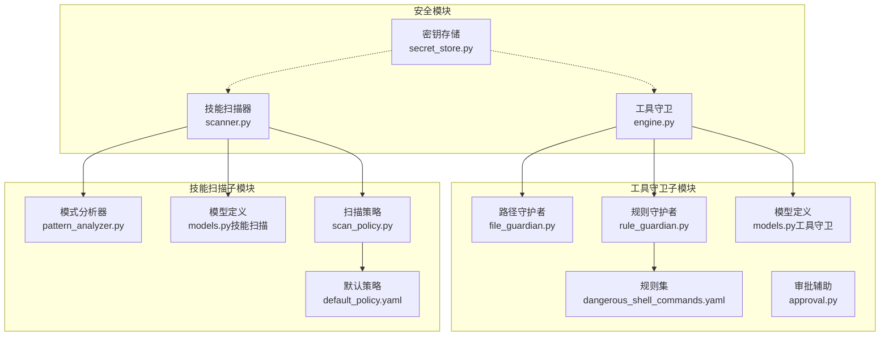
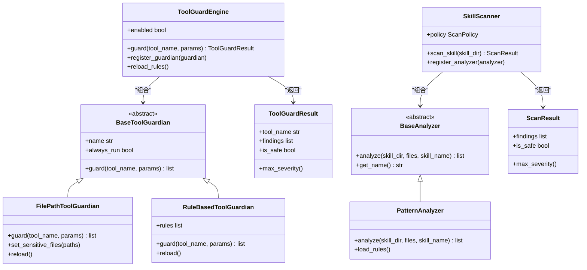
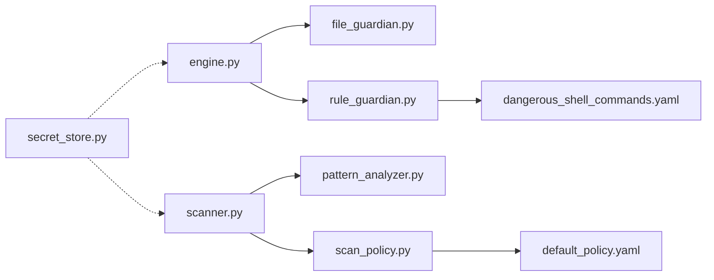

# 安全模块测试

<cite>
**本文档引用的文件**
- [security/__init__.py](file://src/qwenpaw/security/__init__.py)
- [secret_store.py](file://src/qwenpaw/security/secret_store.py)
- [engine.py](file://src/qwenpaw/security/tool_guard/engine.py)
- [file_guardian.py](file://src/qwenpaw/security/tool_guard/guardians/file_guardian.py)
- [rule_guardian.py](file://src/qwenpaw/security/tool_guard/guardians/rule_guardian.py)
- [guardians/__init__.py](file://src/qwenpaw/security/tool_guard/guardians/__init__.py)
- [models.py（工具守卫）](file://src/qwenpaw/security/tool_guard/models.py)
- [scanner.py](file://src/qwenpaw/security/skill_scanner/scanner.py)
- [pattern_analyzer.py](file://src/qwenpaw/security/skill_scanner/analyzers/pattern_analyzer.py)
- [models.py（技能扫描）](file://src/qwenpaw/security/skill_scanner/models.py)
- [scan_policy.py](file://src/qwenpaw/security/skill_scanner/scan_policy.py)
- [default_policy.yaml](file://src/qwenpaw/security/skill_scanner/data/default_policy.yaml)
- [dangerous_shell_commands.yaml](file://src/qwenpaw/security/tool_guard/rules/dangerous_shell_commands.yaml)
- [approval.py](file://src/qwenpaw/security/tool_guard/approval.py)
- [test_secret_store.py](file://tests/unit/security/test_secret_store.py)
</cite>

## 目录
1. [简介](#简介)
2. [项目结构](#项目结构)
3. [核心组件](#核心组件)
4. [架构总览](#架构总览)
5. [详细组件分析](#详细组件分析)
6. [依赖关系分析](#依赖关系分析)
7. [性能考量](#性能考量)
8. [故障排查指南](#故障排查指南)
9. [结论](#结论)
10. [附录](#附录)

## 简介
本文件面向QwenPaw安全模块的单元测试，聚焦以下安全功能的测试实现与最佳实践：
- 密钥存储测试：覆盖透明加密/解密、字典字段加解密、主密钥生成与迁移、降级容错等。
- 工具守卫测试：覆盖路径型敏感文件守护、基于规则的命令扫描、审批摘要格式化等。
- 技能扫描器测试：覆盖模式匹配分析器、扫描策略、默认策略配置、结果聚合与严重性判定等。

文档同时解释安全策略验证、权限控制测试和威胁检测测试的实现方法，并提供具体测试示例路径，展示如何测试敏感信息保护、访问控制和安全审计功能；最后说明测试中的安全考虑与模拟攻击场景的方法。

## 项目结构
安全模块由三大子系统构成：
- 密钥存储（secret_store）：提供磁盘上敏感字段的透明加密层，支持主密钥在系统钥匙串与文件中的回退存储。
- 工具守卫（tool_guard）：对工具调用参数进行预执行扫描，包含路径守护与规则守护两类守护者。
- 技能扫描器（skill_scanner）：对技能包进行静态分析，使用模式签名与扫描策略进行威胁检测与结果聚合。

图表来源
- [secret_store.py:1-291](file://src/qwenpaw/security/secret_store.py#L1-L291)
- [engine.py:1-238](file://src/qwenpaw/security/tool_guard/engine.py#L1-L238)
- [file_guardian.py:1-365](file://src/qwenpaw/security/tool_guard/guardians/file_guardian.py#L1-L365)
- [rule_guardian.py:1-758](file://src/qwenpaw/security/tool_guard/guardians/rule_guardian.py#L1-L758)
- [models.py（工具守卫）:1-185](file://src/qwenpaw/security/tool_guard/models.py#L1-L185)
- [scanner.py:1-319](file://src/qwenpaw/security/skill_scanner/scanner.py#L1-L319)
- [pattern_analyzer.py:1-393](file://src/qwenpaw/security/skill_scanner/analyzers/pattern_analyzer.py#L1-L393)
- [models.py（技能扫描）:1-235](file://src/qwenpaw/security/skill_scanner/models.py#L1-L235)
- [scan_policy.py:1-476](file://src/qwenpaw/security/skill_scanner/scan_policy.py#L1-L476)
- [default_policy.yaml:1-243](file://src/qwenpaw/security/skill_scanner/data/default_policy.yaml#L1-L243)
- [dangerous_shell_commands.yaml:1-187](file://src/qwenpaw/security/tool_guard/rules/dangerous_shell_commands.yaml#L1-L187)
- [approval.py:1-42](file://src/qwenpaw/security/tool_guard/approval.py#L1-L42)

章节来源
- [security/__init__.py:1-21](file://src/qwenpaw/security/__init__.py#L1-L21)

## 核心组件
- 密钥存储（secret_store）
  - 主密钥管理：支持系统钥匙串优先、文件回退；容器/无头环境自动跳过钥匙串。
  - 加密/解密：Fernet（AES-128-CBC + HMAC-SHA256）封装，带前缀标识；解密失败时优雅降级返回原文。
  - 字典字段加解密：按字段白名单批量处理，避免重复加密。
- 工具守卫（tool_guard）
  - 引擎：懒加载单例，动态注册守护者，聚合结果并统计耗时。
  - 路径守护者：识别敏感目录/文件，解析shell重定向，阻断敏感路径访问。
  - 规则守护者：从YAML加载正则规则，扫描字符串化参数值，支持工作区边界检查与增强提示。
  - 模型：统一威胁分类与严重性，结果序列化便于UI展示。
- 技能扫描器（skill_scanner）
  - 扫描器：遍历技能目录，按策略过滤扩展名与大小，运行各分析器，去重与聚合结果。
  - 分析器：基于签名的模式匹配，支持多行模式与排除规则，按文件类型筛选规则。
  - 策略：隐藏文件白名单、规则作用域、凭证占位符抑制、文件分类与阈值、严重性覆盖与禁用规则。

章节来源
- [secret_store.py:1-291](file://src/qwenpaw/security/secret_store.py#L1-L291)
- [engine.py:1-238](file://src/qwenpaw/security/tool_guard/engine.py#L1-L238)
- [file_guardian.py:1-365](file://src/qwenpaw/security/tool_guard/guardians/file_guardian.py#L1-L365)
- [rule_guardian.py:1-758](file://src/qwenpaw/security/tool_guard/guardians/rule_guardian.py#L1-L758)
- [models.py（工具守卫）:1-185](file://src/qwenpaw/security/tool_guard/models.py#L1-L185)
- [scanner.py:1-319](file://src/qwenpaw/security/skill_scanner/scanner.py#L1-L319)
- [pattern_analyzer.py:1-393](file://src/qwenpaw/security/skill_scanner/analyzers/pattern_analyzer.py#L1-L393)
- [models.py（技能扫描）:1-235](file://src/qwenpaw/security/skill_scanner/models.py#L1-L235)
- [scan_policy.py:1-476](file://src/qwenpaw/security/skill_scanner/scan_policy.py#L1-L476)
- [default_policy.yaml:1-243](file://src/qwenpaw/security/skill_scanner/data/default_policy.yaml#L1-L243)
- [dangerous_shell_commands.yaml:1-187](file://src/qwenpaw/security/tool_guard/rules/dangerous_shell_commands.yaml#L1-L187)
- [approval.py:1-42](file://src/qwenpaw/security/tool_guard/approval.py#L1-L42)

## 架构总览
工具守卫与技能扫描器均采用“引擎/分析器/策略”的分层设计，通过抽象基类隔离不同实现，确保可插拔与可扩展。

图表来源
- [engine.py:53-238](file://src/qwenpaw/security/tool_guard/engine.py#L53-L238)
- [guardians/__init__.py:17-62](file://src/qwenpaw/security/tool_guard/guardians/__init__.py#L17-L62)
- [file_guardian.py:184-365](file://src/qwenpaw/security/tool_guard/guardians/file_guardian.py#L184-L365)
- [rule_guardian.py:559-758](file://src/qwenpaw/security/tool_guard/guardians/rule_guardian.py#L559-L758)
- [models.py（工具守卫）:103-185](file://src/qwenpaw/security/tool_guard/models.py#L103-L185)
- [scanner.py:76-319](file://src/qwenpaw/security/skill_scanner/scanner.py#L76-L319)
- [pattern_analyzer.py:236-393](file://src/qwenpaw/security/skill_scanner/analyzers/pattern_analyzer.py#L236-L393)
- [models.py（技能扫描）:168-235](file://src/qwenpaw/security/skill_scanner/models.py#L168-L235)

## 详细组件分析

### 密钥存储测试
目标与要点
- 验证透明加密/解密流程与前缀识别。
- 验证字典字段按白名单批量加解密，避免重复加密。
- 验证主密钥生成、钥匙串读写、文件回退与错误降级。
- 验证容器/无头环境下的钥匙串跳过逻辑。

测试覆盖点
- 加密/解密往返一致性与空值/明文透传。
- Unicode文本加解密。
- 字典字段加解密与空字段处理。
- 已加密字段不重复加密。
- 认证字段（如jwt_secret）与提供方字段（如api_key）分别处理。
- 解密失败（损坏/错误密钥）时的降级行为。
- 主密钥缺失时自动生成并落盘，且钥匙串不可用时回退文件存储。

测试示例路径
- [test_secret_store.py:36-176](file://tests/unit/security/test_secret_store.py#L36-L176)

章节来源
- [secret_store.py:213-291](file://src/qwenpaw/security/secret_store.py#L213-L291)
- [test_secret_store.py:1-176](file://tests/unit/security/test_secret_store.py#L1-L176)

### 工具守卫测试
目标与要点
- 路径守护：识别敏感文件/目录，解析shell命令重定向，阻断敏感路径访问。
- 规则守护：加载YAML规则，扫描字符串化参数，支持工作区边界检查与增强提示。
- 引擎：启用/禁用开关、守护者注册/注销、受保护工具集合与禁止工具集合。
- 审批摘要：将发现汇总为简洁的Markdown摘要。

测试覆盖点
- 路径守护者：敏感文件/目录设置、路径规范化、shell命令路径提取、命中敏感路径的发现构造。
- 规则守护者：规则加载、正则编译、排除规则、工作区边界检查、rm命令目标外部路径检测与提示。
- 引擎：默认守护者装配、守护者注册/注销、受保护工具集合、禁止工具集合、仅执行always_run守护者。
- 审批摘要：摘要格式化、省略剩余项。

测试示例路径
- [file_guardian.py:184-365](file://src/qwenpaw/security/tool_guard/guardians/file_guardian.py#L184-L365)
- [rule_guardian.py:559-758](file://src/qwenpaw/security/tool_guard/guardians/rule_guardian.py#L559-L758)
- [engine.py:53-238](file://src/qwenpaw/security/tool_guard/engine.py#L53-L238)
- [models.py（工具守卫）:60-185](file://src/qwenpaw/security/tool_guard/models.py#L60-L185)
- [dangerous_shell_commands.yaml:1-187](file://src/qwenpaw/security/tool_guard/rules/dangerous_shell_commands.yaml#L1-L187)
- [approval.py:20-42](file://src/qwenpaw/security/tool_guard/approval.py#L20-L42)

章节来源
- [file_guardian.py:1-365](file://src/qwenpaw/security/tool_guard/guardians/file_guardian.py#L1-L365)
- [rule_guardian.py:1-758](file://src/qwenpaw/security/tool_guard/guardians/rule_guardian.py#L1-L758)
- [engine.py:1-238](file://src/qwenpaw/security/tool_guard/engine.py#L1-L238)
- [models.py（工具守卫）:1-185](file://src/qwenpaw/security/tool_guard/models.py#L1-L185)
- [dangerous_shell_commands.yaml:1-187](file://src/qwenpaw/security/tool_guard/rules/dangerous_shell_commands.yaml#L1-L187)
- [approval.py:1-42](file://src/qwenpaw/security/tool_guard/approval.py#L1-L42)

### 技能扫描器测试
目标与要点
- 模式分析器：从签名规则加载，按文件类型匹配，支持多行模式与排除规则。
- 扫描器：文件发现与过滤（扩展名、大小、符号链接、越界路径），运行分析器，聚合与去重。
- 策略：隐藏文件白名单、规则作用域、凭证占位符抑制、文件分类与阈值、严重性覆盖与禁用规则。

测试覆盖点
- 文件发现：符号链接跳过、真实路径校验、扩展名过滤、大小限制、数量上限。
- 分析器：按文件类型选择规则、规则禁用、文档路径跳过、代码专用规则、严重性覆盖、已知测试凭证抑制、去重。
- 结果聚合：最大严重性计算、安全判定、时间统计、失败分析器记录。

测试示例路径
- [scanner.py:148-319](file://src/qwenpaw/security/skill_scanner/scanner.py#L148-L319)
- [pattern_analyzer.py:236-393](file://src/qwenpaw/security/skill_scanner/analyzers/pattern_analyzer.py#L236-L393)
- [models.py（技能扫描）:168-235](file://src/qwenpaw/security/skill_scanner/models.py#L168-L235)
- [scan_policy.py:156-476](file://src/qwenpaw/security/skill_scanner/scan_policy.py#L156-L476)
- [default_policy.yaml:1-243](file://src/qwenpaw/security/skill_scanner/data/default_policy.yaml#L1-L243)

章节来源
- [scanner.py:1-319](file://src/qwenpaw/security/skill_scanner/scanner.py#L1-L319)
- [pattern_analyzer.py:1-393](file://src/qwenpaw/security/skill_scanner/analyzers/pattern_analyzer.py#L1-L393)
- [models.py（技能扫描）:1-235](file://src/qwenpaw/security/skill_scanner/models.py#L1-L235)
- [scan_policy.py:1-476](file://src/qwenpaw/security/skill_scanner/scan_policy.py#L1-L476)
- [default_policy.yaml:1-243](file://src/qwenpaw/security/skill_scanner/data/default_policy.yaml#L1-L243)

### 安全策略验证与权限控制测试
- 策略验证：通过扫描策略覆盖默认策略，验证规则禁用、严重性覆盖、文档路径跳过、代码专用规则等。
- 权限控制：工具守卫的“禁止工具集合”与“受保护工具集合”，以及路径守护者的敏感文件/目录白名单。
- 威胁检测：规则守护者对危险命令（rm、管道到shell、反向连接、提权等）的检测与增强提示。

测试示例路径
- [scan_policy.py:183-231](file://src/qwenpaw/security/skill_scanner/scan_policy.py#L183-L231)
- [default_policy.yaml:82-117](file://src/qwenpaw/security/skill_scanner/data/default_policy.yaml#L82-L117)
- [engine.py:131-164](file://src/qwenpaw/security/tool_guard/engine.py#L131-L164)
- [file_guardian.py:206-248](file://src/qwenpaw/security/tool_guard/guardians/file_guardian.py#L206-L248)
- [dangerous_shell_commands.yaml:12-187](file://src/qwenpaw/security/tool_guard/rules/dangerous_shell_commands.yaml#L12-L187)

章节来源
- [scan_policy.py:1-476](file://src/qwenpaw/security/skill_scanner/scan_policy.py#L1-L476)
- [default_policy.yaml:1-243](file://src/qwenpaw/security/skill_scanner/data/default_policy.yaml#L1-L243)
- [engine.py:1-238](file://src/qwenpaw/security/tool_guard/engine.py#L1-L238)
- [file_guardian.py:1-365](file://src/qwenpaw/security/tool_guard/guardians/file_guardian.py#L1-L365)
- [dangerous_shell_commands.yaml:1-187](file://src/qwenpaw/security/tool_guard/rules/dangerous_shell_commands.yaml#L1-L187)

### 具体测试示例与场景
- 敏感信息保护
  - 使用密钥存储对提供方API密钥与认证JWT密钥进行加解密，验证字典字段批量处理与空字段不加密。
  - 参考：[test_secret_store.py:62-96](file://tests/unit/security/test_secret_store.py#L62-L96)
- 访问控制
  - 路径守护者拦截对敏感目录/文件的访问，解析shell命令重定向以发现潜在破坏性路径。
  - 参考：[file_guardian.py:313-365](file://src/qwenpaw/security/tool_guard/guardians/file_guardian.py#L313-L365)
- 安全审计
  - 工具守卫结果序列化为JSON，包含最高严重性、发现计数、守护者使用情况与失败列表。
  - 参考：[models.py（工具守卫）:162-176](file://src/qwenpaw/security/tool_guard/models.py#L162-L176)
- 模拟攻击场景
  - 规则守护者检测“curl | bash”、“rm -rf /”、“sudo”等高危模式；路径守护者检测重定向到系统关键路径。
  - 参考：[dangerous_shell_commands.yaml:12-187](file://src/qwenpaw/security/tool_guard/rules/dangerous_shell_commands.yaml#L12-L187)

章节来源
- [test_secret_store.py:1-176](file://tests/unit/security/test_secret_store.py#L1-L176)
- [file_guardian.py:1-365](file://src/qwenpaw/security/tool_guard/guardians/file_guardian.py#L1-L365)
- [models.py（工具守卫）:1-185](file://src/qwenpaw/security/tool_guard/models.py#L1-L185)
- [dangerous_shell_commands.yaml:1-187](file://src/qwenpaw/security/tool_guard/rules/dangerous_shell_commands.yaml#L1-L187)

## 依赖关系分析
- 组件耦合
  - 工具守卫引擎与守护者之间通过抽象基类解耦，新增守护者无需修改引擎。
  - 技能扫描器与分析器通过抽象基类解耦，策略贯穿分析过程。
- 外部依赖
  - 密钥存储依赖系统钥匙串库与加密库；在容器/无头环境自动降级至文件存储。
  - 规则守护者依赖YAML解析与正则表达式；扫描器依赖策略与签名规则。
- 循环依赖
  - 各模块通过延迟导入避免循环依赖，例如引擎中守护者初始化的异常捕获。

图表来源
- [engine.py:1-238](file://src/qwenpaw/security/tool_guard/engine.py#L1-L238)
- [file_guardian.py:1-365](file://src/qwenpaw/security/tool_guard/guardians/file_guardian.py#L1-L365)
- [rule_guardian.py:1-758](file://src/qwenpaw/security/tool_guard/guardians/rule_guardian.py#L1-L758)
- [dangerous_shell_commands.yaml:1-187](file://src/qwenpaw/security/tool_guard/rules/dangerous_shell_commands.yaml#L1-L187)
- [secret_store.py:1-291](file://src/qwenpaw/security/secret_store.py#L1-L291)
- [scanner.py:1-319](file://src/qwenpaw/security/skill_scanner/scanner.py#L1-L319)
- [pattern_analyzer.py:1-393](file://src/qwenpaw/security/skill_scanner/analyzers/pattern_analyzer.py#L1-L393)
- [scan_policy.py:1-476](file://src/qwenpaw/security/skill_scanner/scan_policy.py#L1-L476)
- [default_policy.yaml:1-243](file://src/qwenpaw/security/skill_scanner/data/default_policy.yaml#L1-L243)

## 性能考量
- 正则编译缓存：规则守护者与模式分析器对正则表达式进行预编译，减少重复开销。
- 文件发现与扫描限制：扫描器对文件数量与大小设置上限，避免资源滥用。
- 去重与阈值：策略支持去重与最小置信度阈值，减少误报与冗余输出。
- 引擎耗时统计：工具守卫引擎记录守护耗时，便于性能监控。

## 故障排查指南
- 密钥存储
  - 钥匙串不可用：检查容器/无头环境变量，确认回退到文件存储是否成功。
  - 解密失败：确认主密钥未变更，查看日志警告并确认降级行为。
  - 参考：[secret_store.py:71-108](file://src/qwenpaw/security/secret_store.py#L71-L108), [secret_store.py:222-242](file://src/qwenpaw/security/secret_store.py#L222-L242)
- 工具守卫
  - 守护者未生效：检查启用开关、受保护工具集合与禁止工具集合。
  - 规则未触发：确认规则文件存在、正则有效、参数字符串化后可匹配。
  - 参考：[engine.py:35-51](file://src/qwenpaw/security/tool_guard/engine.py#L35-L51), [rule_guardian.py:432-510](file://src/qwenpaw/security/tool_guard/guardians/rule_guardian.py#L432-L510)
- 技能扫描器
  - 文件被跳过：检查扩展名分类、大小限制、数量上限与符号链接处理。
  - 结果为空：确认策略未禁用所有规则，签名规则是否存在。
  - 参考：[scanner.py:248-299](file://src/qwenpaw/security/skill_scanner/scanner.py#L248-L299), [pattern_analyzer.py:172-229](file://src/qwenpaw/security/skill_scanner/analyzers/pattern_analyzer.py#L172-L229)

章节来源
- [secret_store.py:71-108](file://src/qwenpaw/security/secret_store.py#L71-L108)
- [secret_store.py:222-242](file://src/qwenpaw/security/secret_store.py#L222-L242)
- [engine.py:35-51](file://src/qwenpaw/security/tool_guard/engine.py#L35-L51)
- [rule_guardian.py:432-510](file://src/qwenpaw/security/tool_guard/guardians/rule_guardian.py#L432-L510)
- [scanner.py:248-299](file://src/qwenpaw/security/skill_scanner/scanner.py#L248-L299)
- [pattern_analyzer.py:172-229](file://src/qwenpaw/security/skill_scanner/analyzers/pattern_analyzer.py#L172-L229)

## 结论
本测试文档梳理了QwenPaw安全模块的关键测试点与实现细节，涵盖密钥存储、工具守卫与技能扫描器三大部分。通过抽象接口与策略驱动的设计，模块具备良好的可扩展性与可维护性。建议在持续集成中加入模拟攻击场景（如危险命令、重定向到系统路径、硬编码凭证等）以强化安全验证。

## 附录
- 测试最佳实践
  - 使用隔离的临时密钥与密钥目录，避免影响真实环境。
  - 对规则与策略进行增量更新，结合去重与阈值控制误报。
  - 在容器/无头环境中验证钥匙串跳过与文件回退逻辑。
- 常见问题
  - 正则规则无效：检查长度限制与非法模式，关注日志警告。
  - 策略覆盖未生效：确认策略合并顺序与键名一致。