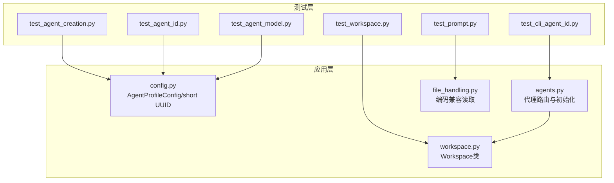
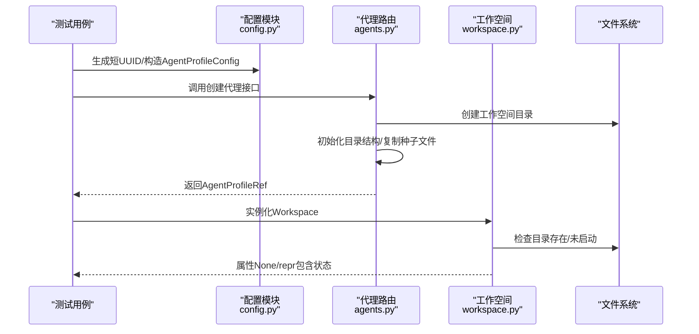
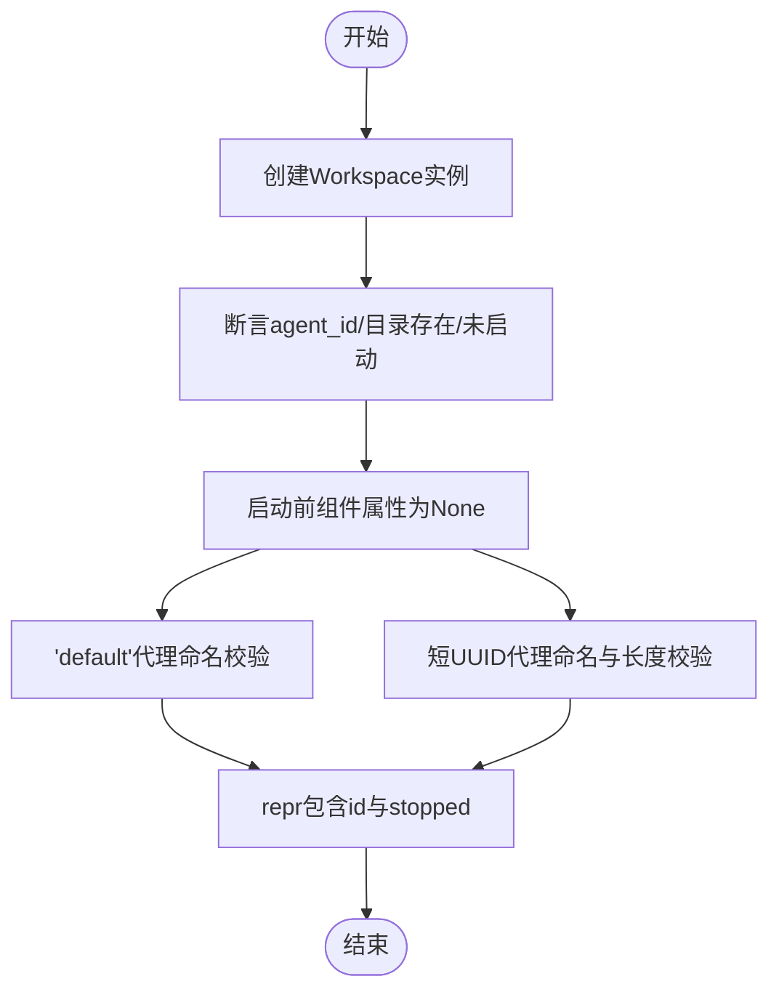
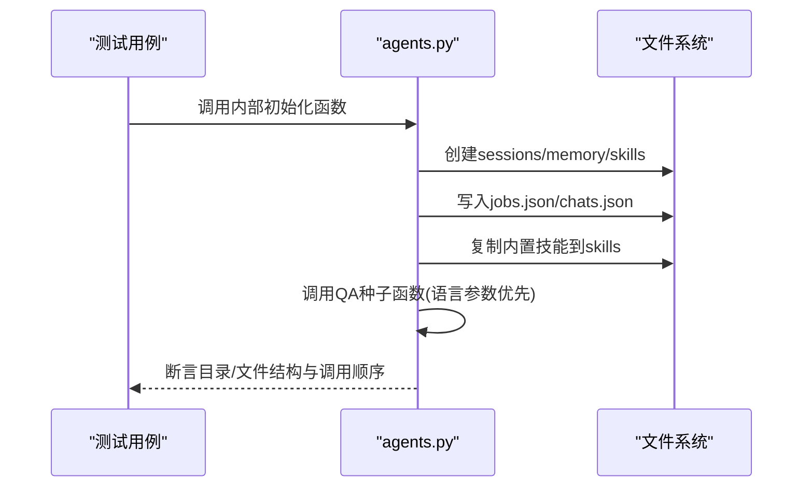
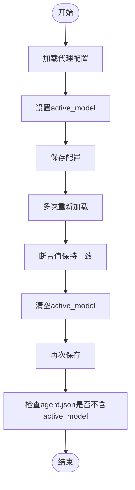
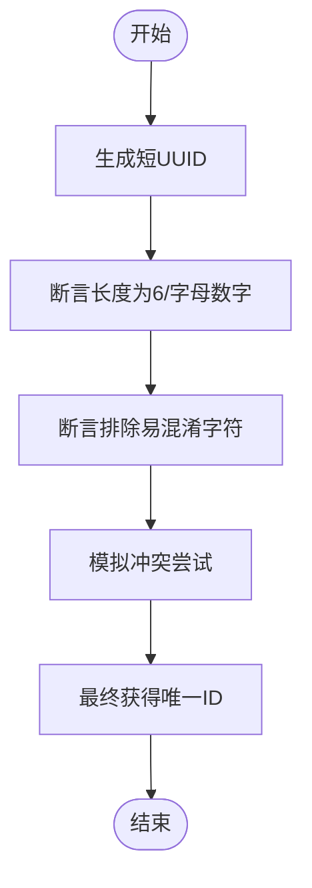
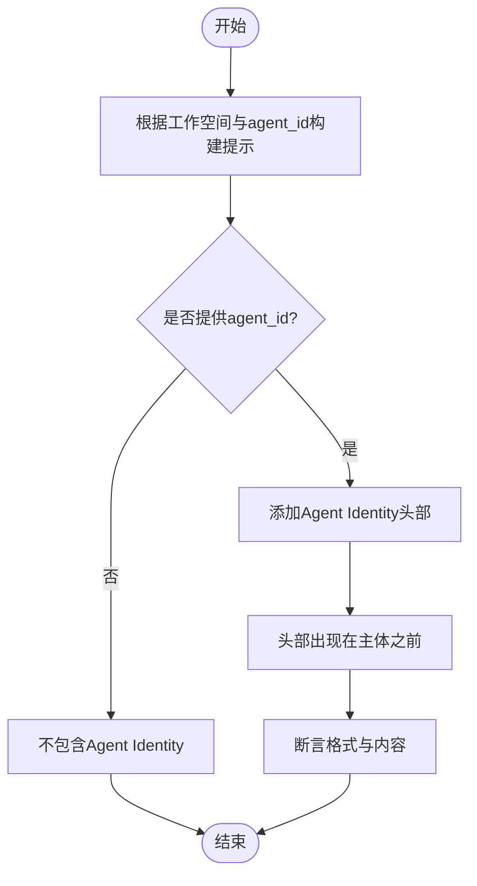
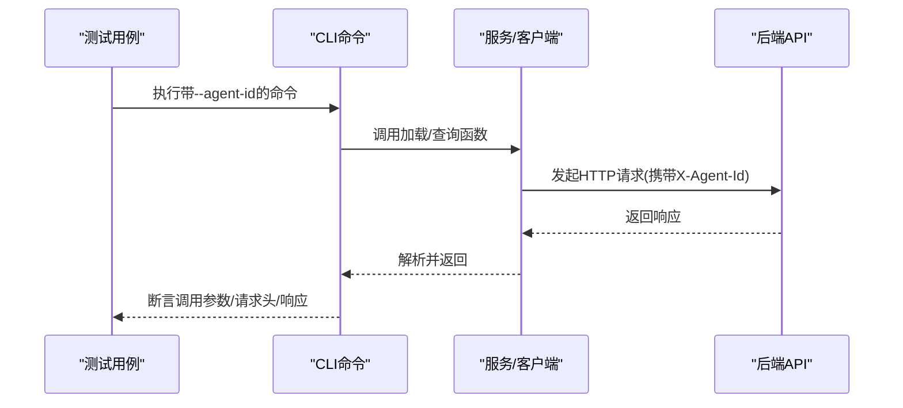
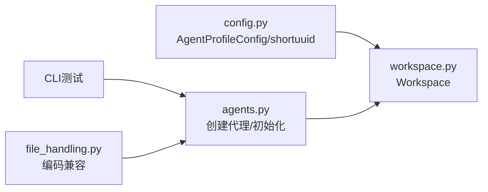

# 工作空间测试

<cite>
**本文引用的文件**
- [tests/unit/workspace/test_workspace.py](file://tests/unit/workspace/test_workspace.py)
- [tests/unit/workspace/test_agent_creation.py](file://tests/unit/workspace/test_agent_creation.py)
- [tests/unit/workspace/test_agent_id.py](file://tests/unit/workspace/test_agent_id.py)
- [tests/unit/workspace/test_agent_model.py](file://tests/unit/workspace/test_agent_model.py)
- [tests/unit/workspace/test_prompt.py](file://tests/unit/workspace/test_prompt.py)
- [tests/unit/workspace/test_cli_agent_id.py](file://tests/unit/workspace/test_cli_agent_id.py)
- [src/qwenpaw/app/workspace/workspace.py](file://src/qwenpaw/app/workspace/workspace.py)
- [src/qwenpaw/config/config.py](file://src/qwenpaw/config/config.py)
- [src/qwenpaw/app/routers/agents.py](file://src/qwenpaw/app/routers/agents.py)
- [src/qwenpaw/agents/utils/file_handling.py](file://src/qwenpaw/agents/utils/file_handling.py)
</cite>

## 目录
1. [简介](#简介)
2. [项目结构](#项目结构)
3. [核心组件](#核心组件)
4. [架构总览](#架构总览)
5. [详细组件分析](#详细组件分析)
6. [依赖分析](#依赖分析)
7. [性能考虑](#性能考虑)
8. [故障排查指南](#故障排查指南)
9. [结论](#结论)
10. [附录](#附录)

## 简介
本文件面向QwenPaw工作空间的单元测试，系统性梳理与工作空间创建、代理创建工作空间初始化、代理配置与数据持久化、CLI代理标识传递、系统提示构建与工作空间状态管理相关的测试方法与实践。文档通过逐项解析关键测试用例，给出可复用的测试步骤、断言策略与排障建议，帮助开发者在新增或修改工作空间相关功能时快速编写与维护高质量的单元测试。

## 项目结构
工作空间测试主要集中在tests/unit/workspace目录下，覆盖以下主题：
- 工作空间实例化与状态管理
- 代理短ID生成与冲突处理
- 代理模型配置与持久化
- 系统提示中代理身份注入
- CLI参数--agent-id对各子命令的影响
- 代理工作空间初始化（目录结构、种子文件）

图表来源
- [tests/unit/workspace/test_workspace.py:1-97](file://tests/unit/workspace/test_workspace.py#L1-L97)
- [tests/unit/workspace/test_agent_creation.py:1-87](file://tests/unit/workspace/test_agent_creation.py#L1-L87)
- [tests/unit/workspace/test_agent_id.py:1-27](file://tests/unit/workspace/test_agent_id.py#L1-L27)
- [tests/unit/workspace/test_agent_model.py:1-296](file://tests/unit/workspace/test_agent_model.py#L1-L296)
- [tests/unit/workspace/test_prompt.py:1-99](file://tests/unit/workspace/test_prompt.py#L1-L99)
- [tests/unit/workspace/test_cli_agent_id.py:1-247](file://tests/unit/workspace/test_cli_agent_id.py#L1-L247)
- [src/qwenpaw/app/workspace/workspace.py:1-389](file://src/qwenpaw/app/workspace/workspace.py#L1-L389)
- [src/qwenpaw/config/config.py:30-37](file://src/qwenpaw/config/config.py#L30-L37)
- [src/qwenpaw/app/routers/agents.py:254-318](file://src/qwenpaw/app/routers/agents.py#L254-L318)
- [src/qwenpaw/agents/utils/file_handling.py:31-102](file://src/qwenpaw/agents/utils/file_handling.py#L31-L102)

章节来源
- [tests/unit/workspace/test_workspace.py:1-97](file://tests/unit/workspace/test_workspace.py#L1-L97)
- [tests/unit/workspace/test_agent_creation.py:1-87](file://tests/unit/workspace/test_agent_creation.py#L1-L87)
- [tests/unit/workspace/test_agent_id.py:1-27](file://tests/unit/workspace/test_agent_id.py#L1-L27)
- [tests/unit/workspace/test_agent_model.py:1-296](file://tests/unit/workspace/test_agent_model.py#L1-L296)
- [tests/unit/workspace/test_prompt.py:1-99](file://tests/unit/workspace/test_prompt.py#L1-L99)
- [tests/unit/workspace/test_cli_agent_id.py:1-247](file://tests/unit/workspace/test_cli_agent_id.py#L1-L247)

## 核心组件
- 工作空间类：封装独立代理运行时，包含Runner、ChannelManager、MemoryManager、MCPClientManager、CronManager等服务；支持启动/停止、可重用组件设置、配置加载与状态表示。
- 代理配置模型：包含AgentProfileConfig、AgentsRunningConfig、ModelSlotConfig等，负责代理的运行行为、模型选择与持久化。
- 代理路由与初始化：提供创建代理、初始化工作空间目录结构、复制内置技能与QA种子文件等能力。
- 文件处理工具：提供跨平台文本文件读取的编码回退机制，保障提示构建与配置读取的稳定性。
- CLI代理ID支持：在多个CLI命令中支持--agent-id参数，确保请求头携带X-Agent-Id或按默认agent执行。

章节来源
- [src/qwenpaw/app/workspace/workspace.py:47-389](file://src/qwenpaw/app/workspace/workspace.py#L47-L389)
- [src/qwenpaw/config/config.py:653-712](file://src/qwenpaw/config/config.py#L653-L712)
- [src/qwenpaw/app/routers/agents.py:254-318](file://src/qwenpaw/app/routers/agents.py#L254-L318)
- [src/qwenpaw/agents/utils/file_handling.py:31-102](file://src/qwenpaw/agents/utils/file_handling.py#L31-L102)

## 架构总览
工作空间测试围绕“配置—初始化—运行—验证”闭环展开，测试覆盖从配置生成、工作空间目录创建、文件结构校验、配置持久化到CLI参数传递的关键路径。

图表来源
- [src/qwenpaw/config/config.py:30-37](file://src/qwenpaw/config/config.py#L30-L37)
- [src/qwenpaw/app/routers/agents.py:254-318](file://src/qwenpaw/app/routers/agents.py#L254-L318)
- [src/qwenpaw/app/workspace/workspace.py:60-86](file://src/qwenpaw/app/workspace/workspace.py#L60-L86)

## 详细组件分析

### 工作空间创建与状态管理测试
- 测试目标
  - 验证Workspace实例化后属性正确、目录存在且未启动
  - 验证启动前各组件属性为None
  - 验证'default'与短UUID代理ID的工作空间命名与长度约束
  - 验证repr字符串包含agent_id与stopped状态
- 关键断言
  - agent_id与workspace_dir一致性
  - 目录存在性与初始_started标志
  - 组件属性None（runner/channel/memory/mcp/cron/chat）
  - 'default'与6字符短UUID的命名规则
  - repr包含Workspace、agent_id与stopped
- 测试示例路径
  - [test_workspace_creation:9-24](file://tests/unit/workspace/test_workspace.py#L9-L24)
  - [test_workspace_components_none_before_start:27-44](file://tests/unit/workspace/test_workspace.py#L27-L44)
  - [test_workspace_default_agent:47-60](file://tests/unit/workspace/test_workspace.py#L47-L60)
  - [test_workspace_short_uuid_agent:63-80](file://tests/unit/workspace/test_workspace.py#L63-L80)
  - [test_workspace_repr:82-97](file://tests/unit/workspace/test_workspace.py#L82-L97)

图表来源
- [tests/unit/workspace/test_workspace.py:9-97](file://tests/unit/workspace/test_workspace.py#L9-L97)
- [src/qwenpaw/app/workspace/workspace.py:60-86](file://src/qwenpaw/app/workspace/workspace.py#L60-L86)

章节来源
- [tests/unit/workspace/test_workspace.py:1-97](file://tests/unit/workspace/test_workspace.py#L1-L97)
- [src/qwenpaw/app/workspace/workspace.py:60-130](file://src/qwenpaw/app/workspace/workspace.py#L60-L130)

### 代理创建工作空间初始化测试
- 测试目标
  - 新建工作空间应满足运行期文件契约：存在sessions/memory/skills目录，jobs.json/chats.json符合版本字段
  - 内置技能复制至skills目录
  - 语言参数优先级：QA种子函数调用时语言参数先于工作空间目录
- 关键断言
  - 目录存在性与不存在的旧目录（如active_skills/customized_skills）排除
  - jobs.json/chats.json结构与版本号
  - copytree目标父目录为skills
  - copy_builtin_qa_md_files调用顺序：language先于workspace_dir
- 测试示例路径
  - [test_initialize_agent_workspace_creates_runtime_compatible_files:35-73](file://tests/unit/app/test_agents_workspace_initialization.py#L35-L73)
  - [test_copy_builtin_skills_targets_unified_skills_dir:18-33](file://tests/unit/app/test_agents_workspace_initialization.py#L18-L33)
  - [test_initialize_agent_workspace_builtin_qa_seed_passes_language_first:75-109](file://tests/unit/app/test_agents_workspace_initialization.py#L75-L109)

图表来源
- [src/qwenpaw/app/routers/agents.py:298-303](file://src/qwenpaw/app/routers/agents.py#L298-L303)
- [tests/unit/app/test_agents_workspace_initialization.py:35-109](file://tests/unit/app/test_agents_workspace_initialization.py#L35-L109)

章节来源
- [tests/unit/app/test_agents_workspace_initialization.py:1-109](file://tests/unit/app/test_agents_workspace_initialization.py#L1-L109)
- [src/qwenpaw/app/routers/agents.py:298-303](file://src/qwenpaw/app/routers/agents.py#L298-L303)

### 代理配置与数据持久化测试
- 测试目标
  - 代理模型配置默认为None，可设置、持久化并跨多次读取保持一致
  - 不同代理可拥有独立的模型配置
  - active_model为None时不写入agent.json；设置后需包含对应字段
  - 运行配置中的LLM重试参数具备默认值且可持久化
  - backoff_cap必须不小于backoff_base，否则抛出配置异常
- 关键断言
  - 默认active_model为None
  - 设置后可reload并保持provider_id/model一致
  - 多次reload结果一致
  - 两个不同代理的模型配置相互独立
  - None时不包含active_model字段
  - 设置后包含字段且值正确
  - LLM重试默认值与持久化
  - backoff_cap < backoff_base触发配置异常
- 测试示例路径
  - [test_agent_model_config_defaults_to_none:67-73](file://tests/unit/workspace/test_agent_model.py#L67-L73)
  - [test_agent_model_config_can_be_set:75-93](file://tests/unit/workspace/test_agent_model.py#L75-L93)
  - [test_agent_model_config_persists_across_reloads:95-114](file://tests/unit/workspace/test_agent_model.py#L95-L114)
  - [test_agent_model_config_can_be_cleared:116-136](file://tests/unit/workspace/test_agent_model.py#L116-L136)
  - [test_different_agents_have_independent_models:138-211](file://tests/unit/workspace/test_agent_model.py#L138-L211)
  - [test_model_config_excluded_when_none:213-230](file://tests/unit/workspace/test_agent_model.py#L213-L230)
  - [test_model_config_included_when_set:232-254](file://tests/unit/workspace/test_agent_model.py#L232-L254)
  - [test_agent_running_config_has_llm_retry_defaults:256-266](file://tests/unit/workspace/test_agent_model.py#L256-L266)
  - [test_agent_running_config_llm_retry_persists:268-287](file://tests/unit/workspace/test_agent_model.py#L268-L287)
  - [test_agent_running_config_rejects_backoff_cap_below_base:289-296](file://tests/unit/workspace/test_agent_model.py#L289-L296)

图表来源
- [tests/unit/workspace/test_agent_model.py:67-296](file://tests/unit/workspace/test_agent_model.py#L67-L296)
- [src/qwenpaw/config/config.py:653-712](file://src/qwenpaw/config/config.py#L653-L712)

章节来源
- [tests/unit/workspace/test_agent_model.py:1-296](file://tests/unit/workspace/test_agent_model.py#L1-L296)
- [src/qwenpaw/config/config.py:653-712](file://src/qwenpaw/config/config.py#L653-L712)

### 代理短UUID生成与冲突处理测试
- 测试目标
  - 空ID场景下，API端点负责触发短UUID自动生成（测试前置条件）
  - 短UUID生成长度为6、仅字母数字、排除易混淆字符
  - 多次生成ID集合中高比例唯一性
  - 模拟前几次冲突后最终获得唯一ID
- 关键断言
  - 空字符串ID作为触发条件
  - 6字符长度与字母数字特性
  - 排除I/l/O/0等易混淆字符
  - 100次生成中唯一性阈值
  - 冲突模拟后最终得到新ID
- 测试示例路径
  - [test_agent_creation_auto_generates_short_id:11-25](file://tests/unit/workspace/test_agent_creation.py#L11-L25)
  - [test_generate_short_id_collision_handling:27-57](file://tests/unit/workspace/test_agent_creation.py#L27-L57)
  - [test_default_agent_preserved:59-69](file://tests/unit/workspace/test_agent_creation.py#L59-L69)
  - [test_short_uuid_properties:71-87](file://tests/unit/workspace/test_agent_creation.py#L71-L87)
  - [test_generate_short_agent_id_length:6-11](file://tests/unit/workspace/test_agent_id.py#L6-L11)
  - [test_generate_short_agent_id_unique:13-19](file://tests/unit/workspace/test_agent_id.py#L13-L19)
  - [test_generate_short_agent_id_alphanumeric:21-27](file://tests/unit/workspace/test_agent_id.py#L21-L27)

图表来源
- [tests/unit/workspace/test_agent_creation.py:27-57](file://tests/unit/workspace/test_agent_creation.py#L27-L57)
- [tests/unit/workspace/test_agent_id.py:6-27](file://tests/unit/workspace/test_agent_id.py#L6-L27)
- [src/qwenpaw/config/config.py:30-37](file://src/qwenpaw/config/config.py#L30-L37)

章节来源
- [tests/unit/workspace/test_agent_creation.py:1-87](file://tests/unit/workspace/test_agent_creation.py#L1-L87)
- [tests/unit/workspace/test_agent_id.py:1-27](file://tests/unit/workspace/test_agent_id.py#L1-L27)
- [src/qwenpaw/config/config.py:30-37](file://src/qwenpaw/config/config.py#L30-L37)

### 系统提示构建与代理身份注入测试
- 测试目标
  - 在工作空间中构建系统提示时，若提供agent_id，则在提示开头插入“Agent Identity”头部
  - 'default'与自定义ID均能正确注入身份信息
  - 空工作空间仍会注入身份头部
  - 身份头部格式固定
- 关键断言
  - 无agent_id时不包含Agent Identity
  - 'default'与自定义ID均包含Agent Identity与具体ID
  - 空工作空间仍包含Agent Identity
  - 身份头部出现位置早于主体提示
  - 身份头部格式与期望一致
- 测试示例路径
  - [test_prompt_without_agent_id:17-31](file://tests/unit/workspace/test_prompt.py#L17-L31)
  - [test_prompt_with_default_agent_id:33-50](file://tests/unit/workspace/test_prompt.py#L33-L50)
  - [test_prompt_with_custom_agent_id:52-70](file://tests/unit/workspace/test_prompt.py#L52-L70)
  - [test_prompt_with_empty_workspace:72-84](file://tests/unit/workspace/test_prompt.py#L72-L84)
  - [test_prompt_identity_format:86-99](file://tests/unit/workspace/test_prompt.py#L86-L99)

图表来源
- [tests/unit/workspace/test_prompt.py:17-99](file://tests/unit/workspace/test_prompt.py#L17-L99)
- [src/qwenpaw/agents/utils/file_handling.py:31-102](file://src/qwenpaw/agents/utils/file_handling.py#L31-L102)

章节来源
- [tests/unit/workspace/test_prompt.py:1-99](file://tests/unit/workspace/test_prompt.py#L1-L99)
- [src/qwenpaw/agents/utils/file_handling.py:31-102](file://src/qwenpaw/agents/utils/file_handling.py#L31-L102)

### CLI代理ID参数传递测试
- 测试目标
  - channels/list默认使用'default'代理；传入--agent-id时使用指定代理
  - cron/list、chats/list在HTTP请求头中携带X-Agent-Id
  - daemon/status默认使用'default'代理；传入--agent-id时使用指定代理
  - skills/list默认使用'default'代理；传入--agent-id时使用指定代理
  - chats/update仅发送必要的字段（最小payload）
- 关键断言
  - 各命令调用时load_agent_config/_get_agent_workspace使用正确的agent_id
  - HTTP请求头包含X-Agent-Id且值正确
  - chats/update的json payload仅包含被修改字段
- 测试示例路径
  - [test_channels_list_default_agent:37-63](file://tests/unit/workspace/test_cli_agent_id.py#L37-L63)
  - [test_channels_list_custom_agent:65-94](file://tests/unit/workspace/test_cli_agent_id.py#L65-L94)
  - [test_cron_list_with_agent_id:96-120](file://tests/unit/workspace/test_cli_agent_id.py#L96-L120)
  - [test_daemon_status_default_agent:122-135](file://tests/unit/workspace/test_cli_agent_id.py#L122-L135)
  - [test_daemon_status_custom_agent:137-153](file://tests/unit/workspace/test_cli_agent_id.py#L137-L153)
  - [test_skills_list_default_agent:155-172](file://tests/unit/workspace/test_cli_agent_id.py#L155-L172)
  - [test_skills_list_custom_agent:174-194](file://tests/unit/workspace/test_cli_agent_id.py#L174-L194)
  - [test_chats_list_with_agent_id:196-220](file://tests/unit/workspace/test_cli_agent_id.py#L196-L220)
  - [test_chats_update_uses_minimal_payload:222-247](file://tests/unit/workspace/test_cli_agent_id.py#L222-L247)

图表来源
- [tests/unit/workspace/test_cli_agent_id.py:96-247](file://tests/unit/workspace/test_cli_agent_id.py#L96-L247)
- [src/qwenpaw/app/routers/agents.py:254-318](file://src/qwenpaw/app/routers/agents.py#L254-L318)

章节来源
- [tests/unit/workspace/test_cli_agent_id.py:1-247](file://tests/unit/workspace/test_cli_agent_id.py#L1-L247)

## 依赖分析
- 工作空间类依赖配置模块加载AgentProfileConfig，依赖服务工厂创建Runner、MemoryManager、MCPClientManager、ChatManager、ChannelManager、CronManager等组件
- 代理路由在创建代理时调用工作空间初始化函数，确保目录结构与种子文件到位
- CLI测试通过patch方式模拟外部依赖（如HTTP客户端），保证测试隔离性
- 文件处理工具提供跨平台编码兼容读取，保障提示构建的稳定性

图表来源
- [src/qwenpaw/config/config.py:653-712](file://src/qwenpaw/config/config.py#L653-L712)
- [src/qwenpaw/app/workspace/workspace.py:142-288](file://src/qwenpaw/app/workspace/workspace.py#L142-L288)
- [src/qwenpaw/app/routers/agents.py:254-318](file://src/qwenpaw/app/routers/agents.py#L254-L318)
- [src/qwenpaw/agents/utils/file_handling.py:31-102](file://src/qwenpaw/agents/utils/file_handling.py#L31-L102)

章节来源
- [src/qwenpaw/app/workspace/workspace.py:142-288](file://src/qwenpaw/app/workspace/workspace.py#L142-L288)
- [src/qwenpaw/app/routers/agents.py:254-318](file://src/qwenpaw/app/routers/agents.py#L254-L318)
- [src/qwenpaw/config/config.py:653-712](file://src/qwenpaw/config/config.py#L653-L712)
- [src/qwenpaw/agents/utils/file_handling.py:31-102](file://src/qwenpaw/agents/utils/file_handling.py#L31-L102)

## 性能考虑
- 工作空间启动涉及多组件并发初始化与串行启动阶段，测试中应关注启动/停止耗时与资源清理
- 配置持久化测试应避免频繁磁盘IO，可在临时目录中进行批量读写以减少开销
- CLI测试通过patch外部依赖，避免真实网络请求带来的不稳定与耗时

## 故障排查指南
- 工作空间未启动或组件属性为None
  - 确认Workspace实例化后未调用start()
  - 检查服务注册与启动顺序
  - 参考：[test_workspace_components_none_before_start:27-44](file://tests/unit/workspace/test_workspace.py#L27-L44)
- 代理短UUID冲突导致ID重复
  - 检查生成逻辑与冲突模拟策略
  - 参考：[test_generate_short_id_collision_handling:27-57](file://tests/unit/workspace/test_agent_creation.py#L27-L57)
- 配置持久化失败或字段缺失
  - 确认save_agent_config与load_agent_config调用顺序
  - 检查active_model为None时是否正确排除字段
  - 参考：[test_model_config_excluded_when_none:213-230](file://tests/unit/workspace/test_agent_model.py#L213-L230)
- LLM重试配置异常
  - backoff_cap必须不小于backoff_base
  - 参考：[test_agent_running_config_rejects_backoff_cap_below_base:289-296](file://tests/unit/workspace/test_agent_model.py#L289-L296)
- CLI请求头未携带X-Agent-Id
  - 检查命令参数解析与HTTP客户端调用
  - 参考：[test_cron_list_with_agent_id:96-120](file://tests/unit/workspace/test_cli_agent_id.py#L96-L120)

章节来源
- [tests/unit/workspace/test_workspace.py:27-44](file://tests/unit/workspace/test_workspace.py#L27-L44)
- [tests/unit/workspace/test_agent_creation.py:27-57](file://tests/unit/workspace/test_agent_creation.py#L27-L57)
- [tests/unit/workspace/test_agent_model.py:213-296](file://tests/unit/workspace/test_agent_model.py#L213-L296)
- [tests/unit/workspace/test_cli_agent_id.py:96-120](file://tests/unit/workspace/test_cli_agent_id.py#L96-L120)

## 结论
通过对工作空间创建、代理配置与持久化、系统提示构建、CLI代理ID传递以及工作空间初始化的全面测试覆盖，可以有效保障多代理环境下工作空间的正确性与稳定性。建议在新增功能时遵循现有测试模式：明确前置条件、隔离外部依赖、断言关键契约、覆盖边界与异常场景。

## 附录
- 常用测试步骤模板
  - 工作空间创建：使用临时目录构造Workspace，断言agent_id、目录存在与未启动
  - 代理配置：构造AgentProfileConfig，设置/清除active_model，断言agent.json字段
  - 系统提示：在临时目录写入AGENTS.md，断言提示包含Agent Identity与格式
  - CLI参数：通过patch模拟外部依赖，断言请求头与调用参数
- 最佳实践
  - 使用临时目录与monkeypatch/patch隔离外部环境
  - 对关键配置进行默认值与边界值测试
  - 对持久化流程进行多次读写验证