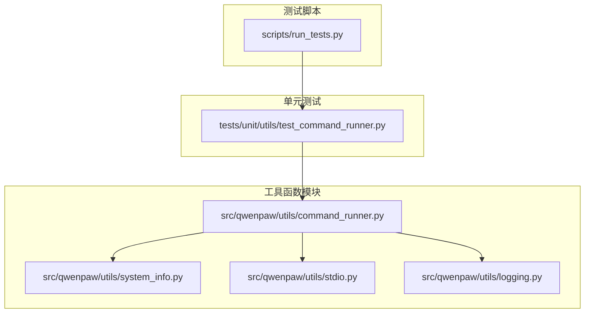
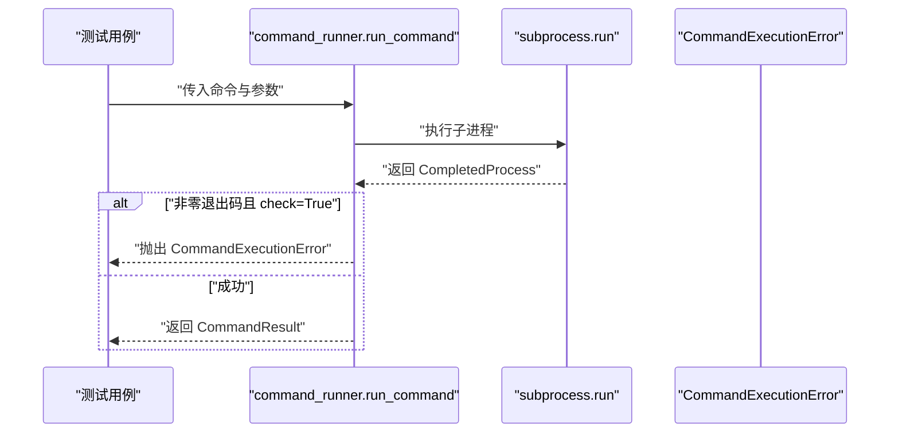
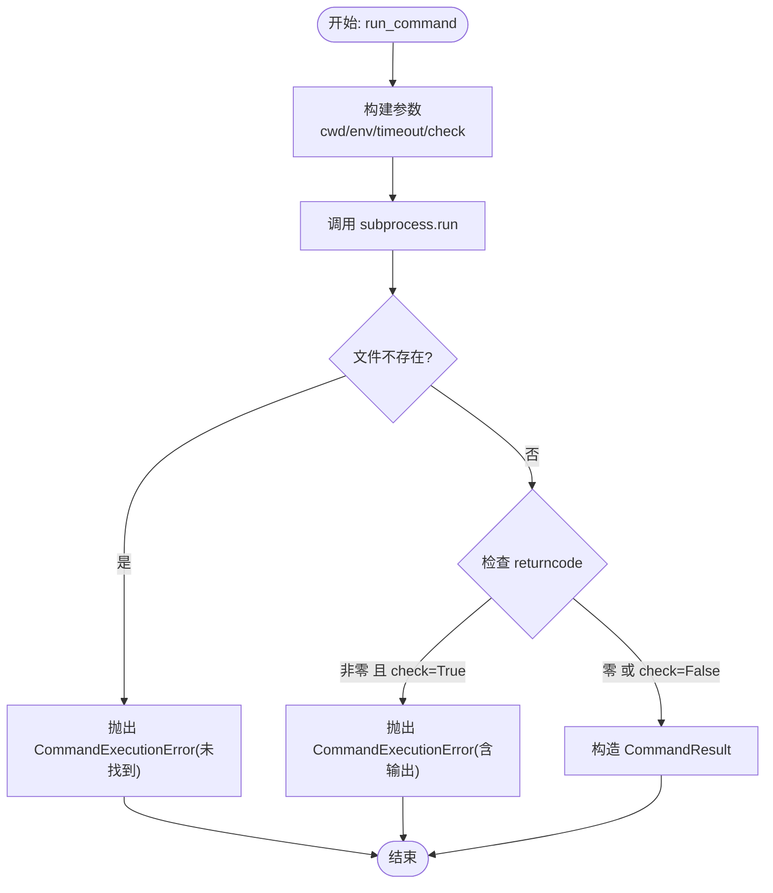
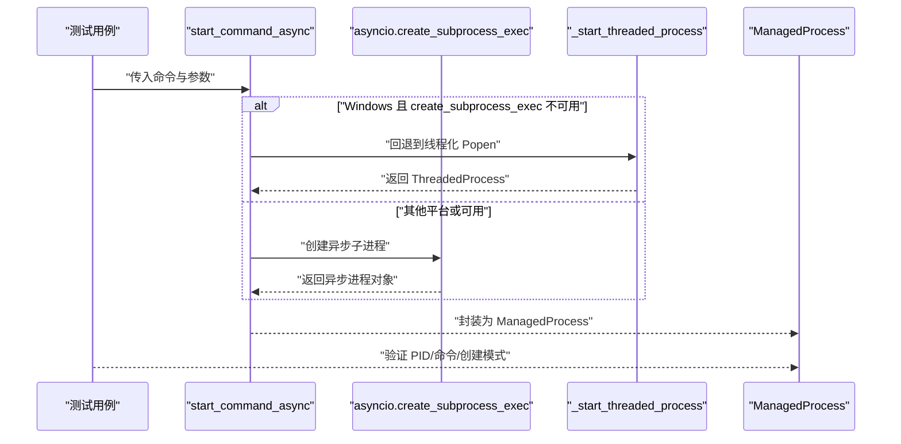
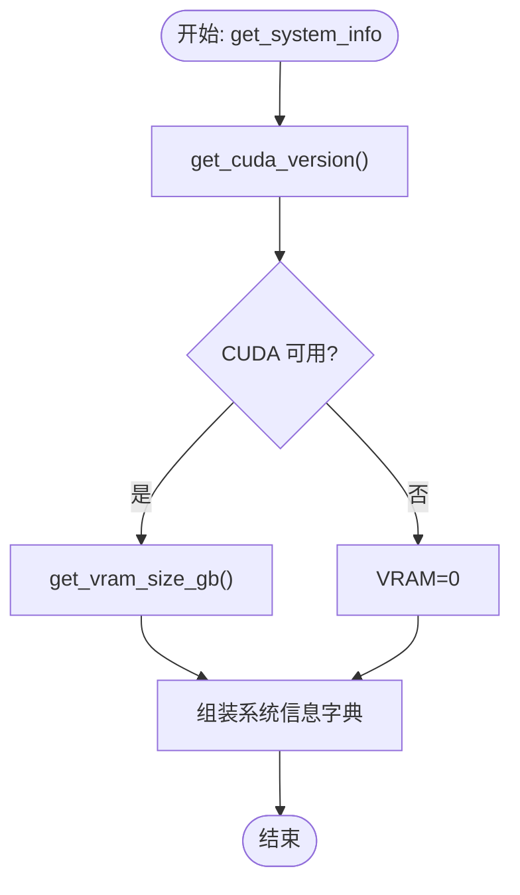
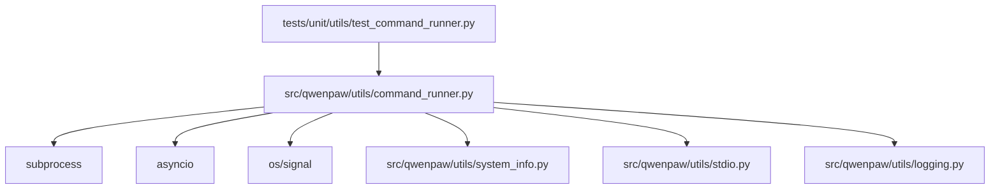

# 工具函数测试

<cite>
**本文引用的文件**
- [tests/unit/utils/test_command_runner.py](file://tests/unit/utils/test_command_runner.py)
- [src/qwenpaw/utils/command_runner.py](file://src/qwenpaw/utils/command_runner.py)
- [src/qwenpaw/utils/system_info.py](file://src/qwenpaw/utils/system_info.py)
- [src/qwenpaw/utils/stdio.py](file://src/qwenpaw/utils/stdio.py)
- [src/qwenpaw/utils/logging.py](file://src/qwenpaw/utils/logging.py)
- [scripts/run_tests.py](file://scripts/run_tests.py)
</cite>

## 目录
1. [简介](#简介)
2. [项目结构](#项目结构)
3. [核心组件](#核心组件)
4. [架构总览](#架构总览)
5. [详细组件分析](#详细组件分析)
6. [依赖分析](#依赖分析)
7. [性能考虑](#性能考虑)
8. [故障排查指南](#故障排查指南)
9. [结论](#结论)
10. [附录](#附录)

## 简介
本文件面向 QwenPaw 的工具函数测试，聚焦命令运行器（command_runner）与相关系统工具模块的单元测试实现。文档系统性阐述以下内容：
- 命令执行测试：包括同步命令执行、异步命令启动、进程生命周期管理与优雅关闭。
- 进程管理测试：涵盖跨平台进程组支持、Windows 回退路径、进程存活检测与等待策略。
- 系统调用测试：覆盖系统信息采集、标准流安全处理、日志格式化与文件处理器。
- 超时控制与错误处理：展示如何通过测试验证超时、异常传播与错误码处理。
- 模拟系统环境与跨平台兼容性：通过猴子补丁与平台变量模拟，验证不同平台行为。

## 项目结构
本节概览与测试相关的核心目录与文件：
- 测试入口与运行脚本：scripts/run_tests.py
- 工具函数模块：
  - 命令运行器：src/qwenpaw/utils/command_runner.py
  - 系统信息采集：src/qwenpaw/utils/system_info.py
  - 标准流安全处理：src/qwenpaw/utils/stdio.py
  - 日志配置：src/qwenpaw/utils/logging.py
- 单元测试：
  - 命令运行器测试：tests/unit/utils/test_command_runner.py

**图表来源**
- [scripts/run_tests.py:1-282](file://scripts/run_tests.py#L1-L282)
- [src/qwenpaw/utils/command_runner.py:1-578](file://src/qwenpaw/utils/command_runner.py#L1-L578)
- [src/qwenpaw/utils/system_info.py:1-229](file://src/qwenpaw/utils/system_info.py#L1-L229)
- [src/qwenpaw/utils/stdio.py:1-88](file://src/qwenpaw/utils/stdio.py#L1-L88)
- [src/qwenpaw/utils/logging.py:1-202](file://src/qwenpaw/utils/logging.py#L1-L202)
- [tests/unit/utils/test_command_runner.py:1-600](file://tests/unit/utils/test_command_runner.py#L1-L600)

**章节来源**
- [scripts/run_tests.py:1-282](file://scripts/run_tests.py#L1-L282)
- [src/qwenpaw/utils/command_runner.py:1-578](file://src/qwenpaw/utils/command_runner.py#L1-L578)
- [src/qwenpaw/utils/system_info.py:1-229](file://src/qwenpaw/utils/system_info.py#L1-L229)
- [src/qwenpaw/utils/stdio.py:1-88](file://src/qwenpaw/utils/stdio.py#L1-L88)
- [src/qwenpaw/utils/logging.py:1-202](file://src/qwenpaw/utils/logging.py#L1-L202)
- [tests/unit/utils/test_command_runner.py:1-600](file://tests/unit/utils/test_command_runner.py#L1-L600)

## 核心组件
- 命令运行器（command_runner）
  - 提供同步命令执行、异步命令启动、长生命周期进程封装、进程优雅关闭与强制终止、跨平台进程组支持与回退路径。
  - 关键类型：CommandResult、ManagedProcess、ShutdownResult；关键异常：CommandExecutionError、ProcessLaunchError。
- 系统信息采集（system_info）
  - 统一返回操作系统、架构、CUDA 版本、内存与显存信息，并对命令失败进行容错处理。
- 标准流安全处理（stdio）
  - 在不可用的标准流场景下提供安全回退，确保日志与输出稳定。
- 日志配置（logging）
  - 颜色化终端输出、跨平台路径显示、可选文件轮转处理器与访问日志过滤。

**章节来源**
- [src/qwenpaw/utils/command_runner.py:15-74](file://src/qwenpaw/utils/command_runner.py#L15-L74)
- [src/qwenpaw/utils/system_info.py:20-121](file://src/qwenpaw/utils/system_info.py#L20-L121)
- [src/qwenpaw/utils/stdio.py:16-88](file://src/qwenpaw/utils/stdio.py#L16-L88)
- [src/qwenpaw/utils/logging.py:121-202](file://src/qwenpaw/utils/logging.py#L121-L202)

## 架构总览
命令运行器测试围绕以下核心流程展开：
- 同步命令执行：run_command → subprocess.run → CommandResult；错误路径抛出 CommandExecutionError。
- 异步命令启动：start_command_async → asyncio.create_subprocess_exec；Windows 上回退到线程化 subprocess.Popen。
- 进程生命周期：ManagedProcess 封装不同启动模式（asyncio/threaded/multiprocessing），统一 wait/terminate/kill/is_alive/join/close。
- 优雅关闭：shutdown_process/shutdown_process_sync → 先 terminate，超时则 kill；支持 POSIX 进程组信号。
- 存活检测：_is_pid_running → Windows 使用 tasklist，POSIX 使用 os.kill(pid, 0)。

**图表来源**
- [src/qwenpaw/utils/command_runner.py:207-253](file://src/qwenpaw/utils/command_runner.py#L207-L253)
- [tests/unit/utils/test_command_runner.py:26-91](file://tests/unit/utils/test_command_runner.py#L26-L91)

**章节来源**
- [src/qwenpaw/utils/command_runner.py:207-253](file://src/qwenpaw/utils/command_runner.py#L207-L253)
- [tests/unit/utils/test_command_runner.py:26-91](file://tests/unit/utils/test_command_runner.py#L26-L91)

## 详细组件分析

### 命令执行测试
- 同步命令执行
  - 断言组合输出（stdout+stderr）与工作目录传递正确。
  - 非零退出码在 check=True 时抛出 CommandExecutionError，并携带 returncode、stdout、stderr。
  - 可执行文件缺失时抛出包含“未找到”提示的 CommandExecutionError。
- 异步命令执行
  - run_command_async 通过线程池调用同步 run_command，保证 Windows 事件循环下的可用性。
  - start_command_async 优先使用 asyncio.create_subprocess_exec；Windows 不支持时回退至线程化 subprocess.Popen。
- 路径与环境
  - _coerce_subprocess_path 支持通用 PathLike 对象转换，确保传入 subprocess 的路径类型一致。

**图表来源**
- [src/qwenpaw/utils/command_runner.py:207-253](file://src/qwenpaw/utils/command_runner.py#L207-L253)
- [tests/unit/utils/test_command_runner.py:26-91](file://tests/unit/utils/test_command_runner.py#L26-L91)

**章节来源**
- [tests/unit/utils/test_command_runner.py:26-91](file://tests/unit/utils/test_command_runner.py#L26-L91)
- [src/qwenpaw/utils/command_runner.py:207-253](file://src/qwenpaw/utils/command_runner.py#L207-L253)

### 进程管理测试
- 异步进程启动与回退
  - Windows 上 asyncio.create_subprocess_exec 不可用时，回退到 _start_threaded_process，使用线程化 subprocess.Popen。
  - 验证创建模式（asyncio/threaded）、PID、命令与等待行为。
- 进程封装与生命周期
  - ManagedProcess 统一封装 wait/terminate/kill/is_alive/join/close，适配不同底层实现。
  - start_multiprocessing_process 包装 multiprocessing.Process 并返回 ManagedProcess。
- 优雅关闭与强制终止
  - shutdown_process：先 terminate，等待 graceful_timeout；若未退出则 kill，再等待 kill_timeout；若仍不退出则标记超时。
  - shutdown_process_sync：同步版本，逻辑一致，适用于阻塞场景。
- 进程组支持（POSIX）
  - 若进程属于进程组，使用 os.killpg 发送 SIGTERM/SIGKILL；否则使用进程对象 terminate/kill。
- 存活检测
  - Windows 使用 tasklist 查询 PID；POSIX 使用 os.kill(pid, 0) 判断权限错误以判定存在性。

**图表来源**
- [src/qwenpaw/utils/command_runner.py:280-379](file://src/qwenpaw/utils/command_runner.py#L280-L379)
- [tests/unit/utils/test_command_runner.py:114-251](file://tests/unit/utils/test_command_runner.py#L114-L251)

**章节来源**
- [tests/unit/utils/test_command_runner.py:114-251](file://tests/unit/utils/test_command_runner.py#L114-L251)
- [src/qwenpaw/utils/command_runner.py:280-379](file://src/qwenpaw/utils/command_runner.py#L280-L379)

### 系统调用测试
- 系统信息采集
  - get_os_name/get_architecture：标准化操作系统与架构名称。
  - get_cuda_version：尝试 nvidia-smi/nvcc 获取 CUDA 版本，失败返回 None。
  - get_memory_size_gb/get_vram_size_gb：分别获取系统内存与显存大小，失败返回 0。
  - get_system_info：聚合上述信息并返回字典。
- 命令执行容错
  - _run_command：捕获 OSErrors/subprocess.SubprocessError，返回 None；合并 stdout 与 stderr 输出。
- 平台差异
  - 内存获取：优先 sysconf，其次 macOS sysctl，再 Linux proc_meminfo，最后 Windows API。
  - CUDA 版本：多命令尝试与正则匹配。

**图表来源**
- [src/qwenpaw/utils/system_info.py:111-121](file://src/qwenpaw/utils/system_info.py#L111-L121)
- [src/qwenpaw/utils/system_info.py:60-109](file://src/qwenpaw/utils/system_info.py#L60-L109)

**章节来源**
- [src/qwenpaw/utils/system_info.py:111-121](file://src/qwenpaw/utils/system_info.py#L111-L121)
- [src/qwenpaw/utils/system_info.py:60-109](file://src/qwenpaw/utils/system_info.py#L60-L109)

### 标准流与日志测试
- 标准流安全处理
  - ensure_standard_streams：替换不可用的 stdout/stderr 为安全回退流，避免测试期间输出异常。
  - _ensure_text_stream/_get_fallback_stream：按编码缓存回退流并在进程退出时清理。
- 日志配置
  - ColorFormatter/PlainFormatter：彩色与纯文本格式化，支持跨平台路径显示。
  - add_project_file_handler：根据平台选择 FileHandler/RotatingFileHandler，避免文件锁问题。

**章节来源**
- [src/qwenpaw/utils/stdio.py:16-88](file://src/qwenpaw/utils/stdio.py#L16-L88)
- [src/qwenpaw/utils/logging.py:121-202](file://src/qwenpaw/utils/logging.py#L121-L202)

## 依赖分析
- 测试与被测模块耦合
  - 测试通过 monkeypatch 替换 subprocess、asyncio、os 等外部依赖，隔离真实系统行为。
  - 测试覆盖同步/异步路径、Windows 回退路径、进程组信号、进程存活检测等分支。
- 外部依赖与集成点
  - subprocess：用于同步命令执行与部分平台命令查询（如 nvidia-smi/tasklist）。
  - asyncio：用于异步子进程创建与等待。
  - os/signal：用于进程组信号发送与平台判断。
- 循环依赖
  - 模块间无循环导入；测试仅依赖被测模块接口。

**图表来源**
- [tests/unit/utils/test_command_runner.py:1-600](file://tests/unit/utils/test_command_runner.py#L1-L600)
- [src/qwenpaw/utils/command_runner.py:1-578](file://src/qwenpaw/utils/command_runner.py#L1-L578)
- [src/qwenpaw/utils/system_info.py:1-229](file://src/qwenpaw/utils/system_info.py#L1-L229)
- [src/qwenpaw/utils/stdio.py:1-88](file://src/qwenpaw/utils/stdio.py#L1-L88)
- [src/qwenpaw/utils/logging.py:1-202](file://src/qwenpaw/utils/logging.py#L1-L202)

**章节来源**
- [tests/unit/utils/test_command_runner.py:1-600](file://tests/unit/utils/test_command_runner.py#L1-L600)
- [src/qwenpaw/utils/command_runner.py:1-578](file://src/qwenpaw/utils/command_runner.py#L1-L578)

## 性能考虑
- 异步与线程化回退
  - 异步路径优先，Windows 不可用时自动回退到线程化 subprocess.Popen，避免阻塞事件循环。
- 等待策略
  - _wait_for_process_exit_async/_wait_for_process_exit 使用超时与轮询，平衡响应性与资源占用。
- 资源清理
  - 标准流回退使用 atexit 注册清理，避免句柄泄漏。

[本节为通用指导，无需具体文件分析]

## 故障排查指南
- 常见错误与定位
  - CommandExecutionError：检查命令是否存在、工作目录是否正确、环境变量是否完整、超时设置是否合理。
  - ProcessLaunchError：确认可执行文件路径、权限、平台兼容性；Windows 下 asyncio.create_subprocess_exec 不可用时会触发回退。
  - 进程未退出：检查 graceful_timeout/kill_timeout 设置，确认进程组信号是否生效（POSIX）。
- 调试建议
  - 使用 monkeypatch 模拟失败场景（如 FileNotFoundError、TimeoutError）。
  - 在 Windows 上验证回退路径（线程化 Popen）行为一致性。
  - 通过断言返回码、PID、命令与创建模式，确保 ManagedProcess 行为符合预期。

**章节来源**
- [tests/unit/utils/test_command_runner.py:53-91](file://tests/unit/utils/test_command_runner.py#L53-L91)
- [tests/unit/utils/test_command_runner.py:254-273](file://tests/unit/utils/test_command_runner.py#L254-L273)
- [tests/unit/utils/test_command_runner.py:368-458](file://tests/unit/utils/test_command_runner.py#L368-L458)
- [tests/unit/utils/test_command_runner.py:518-562](file://tests/unit/utils/test_command_runner.py#L518-L562)

## 结论
本测试文档系统梳理了命令运行器与相关工具模块的测试策略与实现要点，强调通过猴子补丁与平台模拟实现跨平台验证，覆盖同步/异步命令执行、进程生命周期管理、优雅关闭与错误处理等关键场景。建议在新增功能时沿用现有测试模式，补充边界条件与异常路径，持续提升稳定性与可维护性。

[本节为总结性内容，无需具体文件分析]

## 附录
- 测试运行方式
  - 使用本地测试脚本一键运行单元测试，支持覆盖率与并行选项。
  - 示例命令：
    - 运行全部单元测试：python scripts/run_tests.py -u
    - 运行指定子目录：python scripts/run_tests.py -u providers
    - 生成覆盖率报告：python scripts/run_tests.py -a -c
    - 并行运行：python scripts/run_tests.py -p

**章节来源**
- [scripts/run_tests.py:76-173](file://scripts/run_tests.py#L76-L173)