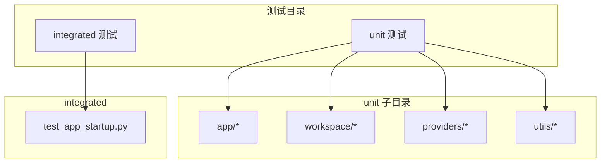
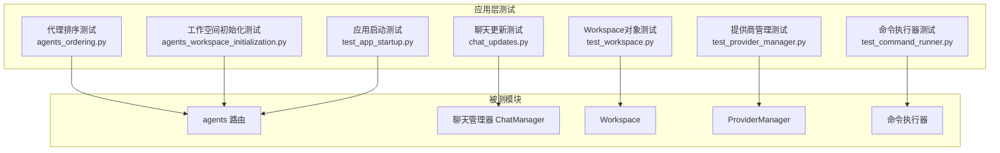
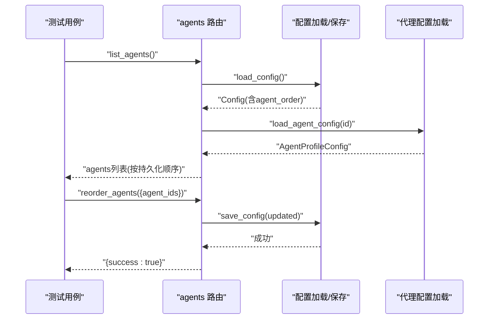
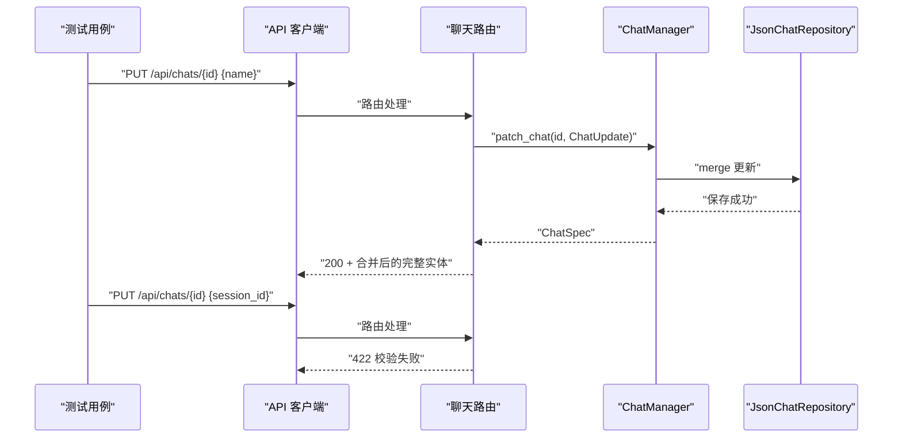
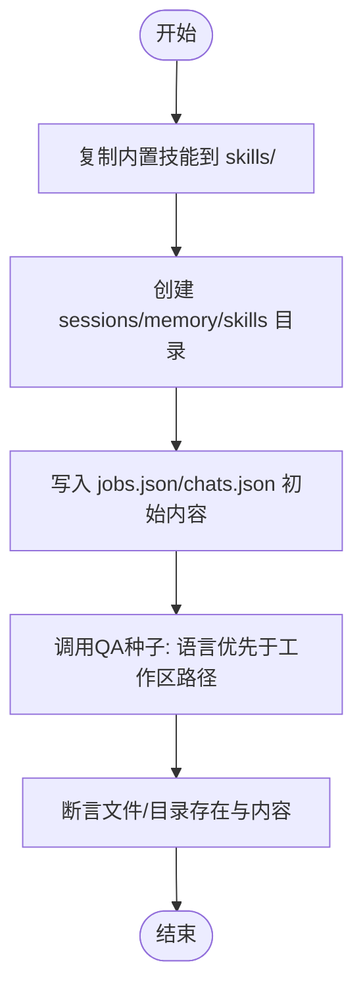
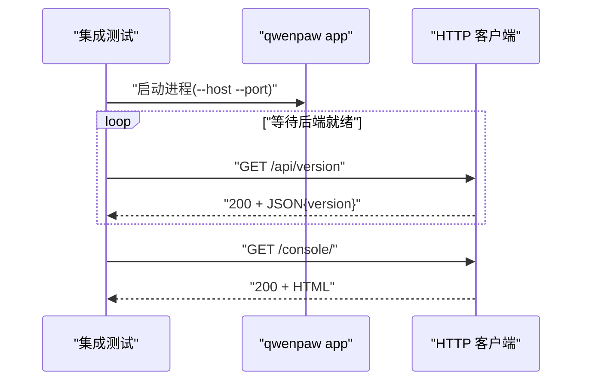
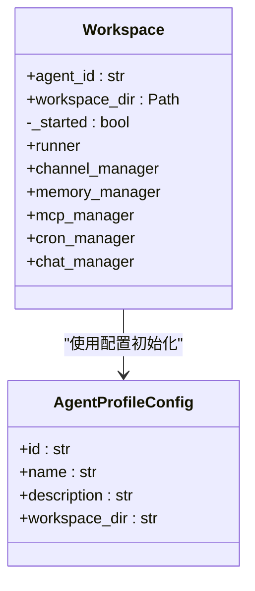
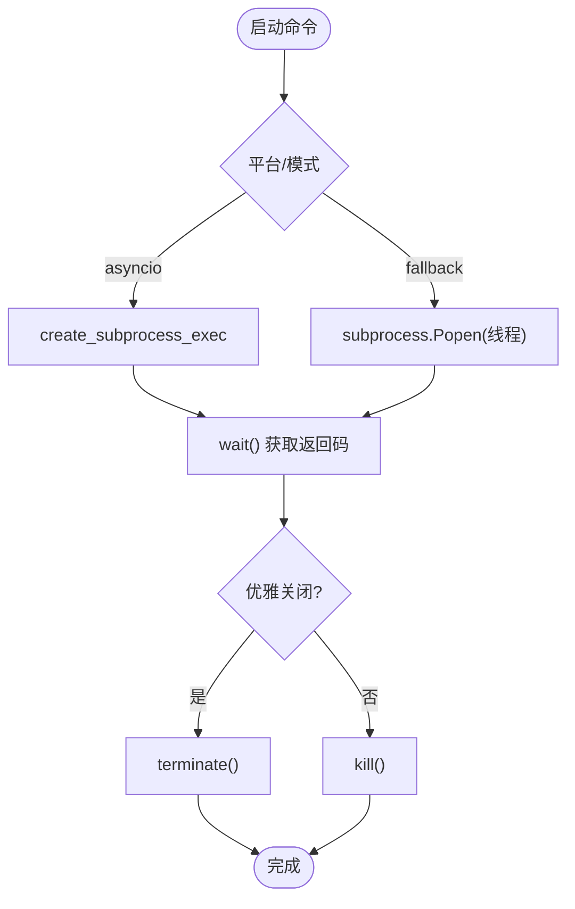
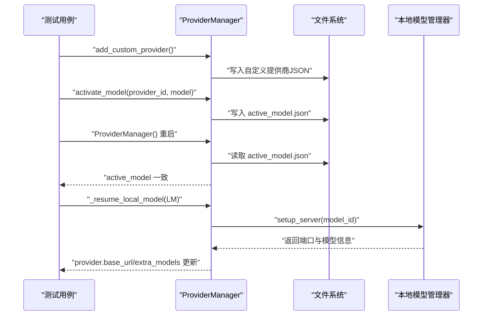
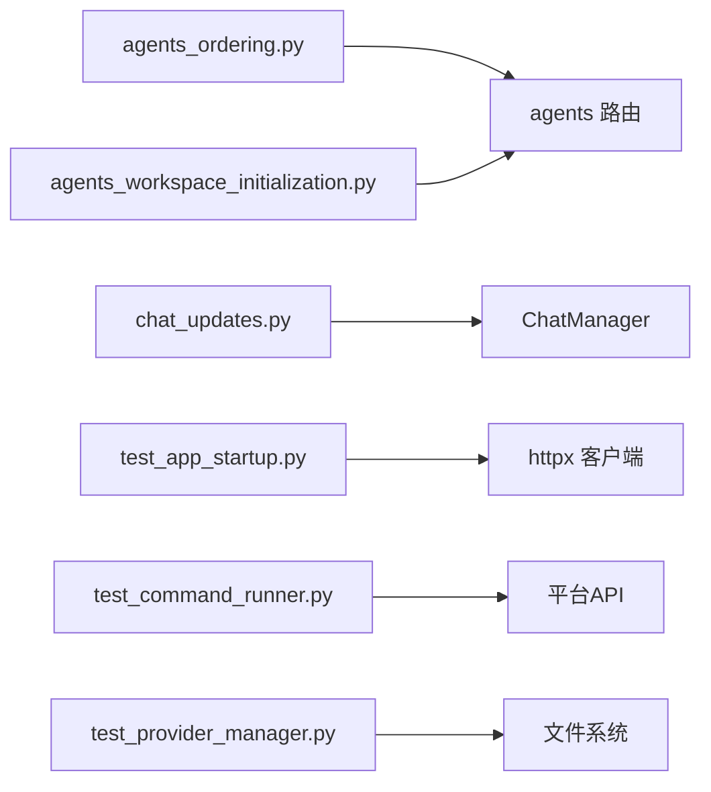

# 应用层测试

<cite>
**本文引用的文件**
- [tests/unit/app/test_agents_ordering.py](file://tests/unit/app/test_agents_ordering.py)
- [tests/unit/app/test_chat_updates.py](file://tests/unit/app/test_chat_updates.py)
- [tests/unit/app/test_agents_workspace_initialization.py](file://tests/unit/app/test_agents_workspace_initialization.py)
- [tests/integrated/test_app_startup.py](file://tests/integrated/test_app_startup.py)
- [tests/unit/workspace/test_workspace.py](file://tests/unit/workspace/test_workspace.py)
- [tests/unit/workspace/test_agent_creation.py](file://tests/unit/workspace/test_agent_creation.py)
- [tests/unit/workspace/test_agent_id.py](file://tests/unit/workspace/test_agent_id.py)
- [tests/unit/utils/test_command_runner.py](file://tests/unit/utils/test_command_runner.py)
- [tests/unit/providers/test_provider_manager.py](file://tests/unit/providers/test_provider_manager.py)
</cite>

## 目录
1. [引言](#引言)
2. [项目结构](#项目结构)
3. [核心组件](#核心组件)
4. [架构总览](#架构总览)
5. [详细组件分析](#详细组件分析)
6. [依赖分析](#依赖分析)
7. [性能考虑](#性能考虑)
8. [故障排查指南](#故障排查指南)
9. [结论](#结论)
10. [附录](#附录)

## 引言
本文件面向QwenPaw应用层的单元与集成测试，系统梳理代理排序测试、聊天更新测试、工作空间初始化测试等核心功能的测试实现与方法论；同时覆盖应用状态管理、事件处理与数据同步的测试策略，提供可复用的测试示例与最佳实践，帮助读者快速掌握如何验证应用启动流程、状态变更与异常恢复，以及组件间交互与数据一致性。

## 项目结构
- 测试按“功能域+类型”组织：
  - 单元测试：tests/unit 下按模块细分（如 app、workspace、providers、utils 等）
  - 集成测试：tests/integrated（如应用启动与控制台访问）
- 关键测试文件分布：
  - 应用层（app）：代理排序、聊天更新、工作空间初始化
  - 工作空间（workspace）：Workspace生命周期、代理ID生成与短UUID特性
  - 工具（utils）：命令执行器与进程管理
  - 提供商（providers）：提供商注册、激活、迁移与本地模型恢复
  - 集成：应用启动与控制台可用性

**章节来源**
- [tests/unit/app/test_agents_ordering.py:1-201](file://tests/unit/app/test_agents_ordering.py#L1-L201)
- [tests/unit/app/test_chat_updates.py:1-142](file://tests/unit/app/test_chat_updates.py#L1-L142)
- [tests/unit/app/test_agents_workspace_initialization.py:1-109](file://tests/unit/app/test_agents_workspace_initialization.py#L1-L109)
- [tests/integrated/test_app_startup.py:1-133](file://tests/integrated/test_app_startup.py#L1-L133)
- [tests/unit/workspace/test_workspace.py:1-97](file://tests/unit/workspace/test_workspace.py#L1-L97)
- [tests/unit/workspace/test_agent_creation.py:1-87](file://tests/unit/workspace/test_agent_creation.py#L1-L87)
- [tests/unit/workspace/test_agent_id.py:1-27](file://tests/unit/workspace/test_agent_id.py#L1-L27)
- [tests/unit/utils/test_command_runner.py:1-600](file://tests/unit/utils/test_command_runner.py#L1-L600)
- [tests/unit/providers/test_provider_manager.py:1-537](file://tests/unit/providers/test_provider_manager.py#L1-L537)

## 核心组件
- 代理排序与持久化：验证代理列表顺序、重排请求校验、新增/删除代理对顺序的影响
- 聊天更新语义：部分更新合并、只读字段拒绝、活动时间戳更新不覆盖标题
- 工作空间初始化：内置技能复制目标路径、运行时文件契约、QA种子语言参数传递顺序
- 应用启动与控制台：后端服务就绪探测、控制台HTML返回校验
- 工作空间对象：Workspace实例化、组件延迟加载、默认与短UUID代理ID
- 命令执行器：同步/异步命令执行、进程生命周期管理、跨平台兼容
- 提供商管理：内置提供商注册、自定义提供商冲突处理、激活模型持久化、遗留配置迁移、本地模型恢复

**章节来源**
- [tests/unit/app/test_agents_ordering.py:43-201](file://tests/unit/app/test_agents_ordering.py#L43-L201)
- [tests/unit/app/test_chat_updates.py:20-142](file://tests/unit/app/test_chat_updates.py#L20-L142)
- [tests/unit/app/test_agents_workspace_initialization.py:18-109](file://tests/unit/app/test_agents_workspace_initialization.py#L18-L109)
- [tests/integrated/test_app_startup.py:33-133](file://tests/integrated/test_app_startup.py#L33-L133)
- [tests/unit/workspace/test_workspace.py:8-97](file://tests/unit/workspace/test_workspace.py#L8-L97)
- [tests/unit/workspace/test_agent_creation.py:11-87](file://tests/unit/workspace/test_agent_creation.py#L11-L87)
- [tests/unit/workspace/test_agent_id.py:6-27](file://tests/unit/workspace/test_agent_id.py#L6-L27)
- [tests/unit/utils/test_command_runner.py:26-600](file://tests/unit/utils/test_command_runner.py#L26-L600)
- [tests/unit/providers/test_provider_manager.py:91-537](file://tests/unit/providers/test_provider_manager.py#L91-L537)

## 架构总览
下图展示了应用层测试所覆盖的关键模块与交互关系，体现从HTTP路由到业务管理器、再到存储与外部资源的调用链路。

**图表来源**
- [tests/unit/app/test_agents_ordering.py:43-201](file://tests/unit/app/test_agents_ordering.py#L43-L201)
- [tests/unit/app/test_chat_updates.py:20-142](file://tests/unit/app/test_chat_updates.py#L20-L142)
- [tests/unit/app/test_agents_workspace_initialization.py:18-109](file://tests/unit/app/test_agents_workspace_initialization.py#L18-L109)
- [tests/integrated/test_app_startup.py:33-133](file://tests/integrated/test_app_startup.py#L33-L133)
- [tests/unit/workspace/test_workspace.py:8-97](file://tests/unit/workspace/test_workspace.py#L8-L97)
- [tests/unit/utils/test_command_runner.py:26-600](file://tests/unit/utils/test_command_runner.py#L26-L600)
- [tests/unit/providers/test_provider_manager.py:91-537](file://tests/unit/providers/test_provider_manager.py#L91-L537)

## 详细组件分析

### 代理排序测试
- 测试目标
  - 列表接口遵循持久化的代理顺序
  - 旧配置缺失时仍返回全部代理并追加未指定项
  - 重排请求必须包含所有已配置代理ID，否则拒绝
  - 成功重排后持久化新顺序
  - 新建代理自动追加至顺序末尾
  - 删除代理后从顺序中移除
- 关键断言点
  - 响应顺序与期望一致
  - 保存函数被调用且参数正确
  - 配置对象中的agent_order被更新
- 测试技巧
  - 使用monkeypatch替换全局加载/保存函数以隔离外部依赖
  - 通过构造最小配置对象模拟真实场景

**图表来源**
- [tests/unit/app/test_agents_ordering.py:43-137](file://tests/unit/app/test_agents_ordering.py#L43-L137)

**章节来源**
- [tests/unit/app/test_agents_ordering.py:43-201](file://tests/unit/app/test_agents_ordering.py#L43-L201)

### 聊天更新测试
- 测试目标
  - PUT部分更新：仅传入name时应合并写入，不强制全量
  - 拒绝只读字段（如id、session_id）在更新请求中出现
  - touch操作仅更新时间戳，不覆盖标题
- 关键断言点
  - 部分更新后保留其他字段不变
  - 只读字段更新触发校验失败
  - 时间戳递增且标题保持原值
- 测试技巧
  - 使用ASGI客户端与依赖注入替换聊天管理器，确保测试隔离
  - 通过自定义时钟类固定时间推进，便于断言

**图表来源**
- [tests/unit/app/test_chat_updates.py:26-105](file://tests/unit/app/test_chat_updates.py#L26-L105)

**章节来源**
- [tests/unit/app/test_chat_updates.py:20-142](file://tests/unit/app/test_chat_updates.py#L20-L142)

### 工作空间初始化测试
- 测试目标
  - 内置技能复制到统一的skills目录
  - 初始化后的工作区满足运行时文件契约（目录/文件存在性与初始内容）
  - QA种子函数调用时优先传递语言参数
- 关键断言点
  - copytree目标均位于workspace/skills
  - jobs.json/chats.json版本与空数组结构
  - QA种子调用参数顺序为(language, workspace_dir)
- 测试技巧
  - 使用monkeypatch替换shutil.copytree与配置加载
  - 通过临时目录隔离文件系统副作用

**图表来源**
- [tests/unit/app/test_agents_workspace_initialization.py:18-109](file://tests/unit/app/test_agents_workspace_initialization.py#L18-L109)

**章节来源**
- [tests/unit/app/test_agents_workspace_initialization.py:18-109](file://tests/unit/app/test_agents_workspace_initialization.py#L18-L109)

### 应用启动与控制台测试
- 测试目标
  - 后端服务启动并监听指定端口
  - /api/version 返回版本信息
  - 控制台页面可访问且返回HTML
- 关键断言点
  - 连接成功后解析JSON并校验字段
  - 控制台响应头包含text/html
  - HTML内容非空且包含基本标签
- 测试技巧
  - 自动寻找可用端口避免冲突
  - 实时转储子进程输出便于定位问题

**图表来源**
- [tests/integrated/test_app_startup.py:33-122](file://tests/integrated/test_app_startup.py#L33-L122)

**章节来源**
- [tests/integrated/test_app_startup.py:33-133](file://tests/integrated/test_app_startup.py#L33-L133)

### 工作空间对象与代理ID测试
- Workspace对象
  - 实例化后目录存在、组件属性为None
  - 默认代理ID与短UUID代理ID的边界条件
  - 字符串表示包含状态信息
- 代理ID生成
  - 短UUID长度、字母数字字符集、避免歧义字符
  - 冲突处理：多次尝试直至唯一
  - 特殊ID“default”不被替换

**图表来源**
- [tests/unit/workspace/test_workspace.py:8-97](file://tests/unit/workspace/test_workspace.py#L8-L97)
- [tests/unit/workspace/test_agent_creation.py:11-87](file://tests/unit/workspace/test_agent_creation.py#L11-L87)
- [tests/unit/workspace/test_agent_id.py:6-27](file://tests/unit/workspace/test_agent_id.py#L6-L27)

**章节来源**
- [tests/unit/workspace/test_workspace.py:8-97](file://tests/unit/workspace/test_workspace.py#L8-L97)
- [tests/unit/workspace/test_agent_creation.py:11-87](file://tests/unit/workspace/test_agent_creation.py#L11-L87)
- [tests/unit/workspace/test_agent_id.py:6-27](file://tests/unit/workspace/test_agent_id.py#L6-L27)

### 命令执行器与进程管理测试
- 测试目标
  - 同步命令执行返回组合输出、错误处理与路径转换
  - 异步命令启动与参数透传（cwd/env/stdout/stderr）
  - 跨平台兼容：Windows回退线程Popen
  - 进程优雅关闭与超时升级为强杀
  - 进程组信号处理（POSIX）
- 关键断言点
  - ManagedProcess封装生命周期与返回码
  - 超时策略：graceful_timeout -> kill_timeout
  - Windows使用Popen，POSIX使用进程组信号

**图表来源**
- [tests/unit/utils/test_command_runner.py:93-273](file://tests/unit/utils/test_command_runner.py#L93-L273)
- [tests/unit/utils/test_command_runner.py:368-458](file://tests/unit/utils/test_command_runner.py#L368-L458)
- [tests/unit/utils/test_command_runner.py:460-562](file://tests/unit/utils/test_command_runner.py#L460-L562)

**章节来源**
- [tests/unit/utils/test_command_runner.py:26-600](file://tests/unit/utils/test_command_runner.py#L26-L600)

### 提供商管理测试
- 测试目标
  - 内置提供商注册与能力校验
  - 自定义提供商添加、冲突重命名与持久化
  - 激活模型持久化与重启后恢复
  - 遗留配置迁移与Active模型落盘
  - 本地模型恢复：服务器端口与模型能力探测
- 关键断言点
  - ProviderManager能加载/保存自定义提供商
  - 激活模型后可重新加载并一致
  - 迁移后Active模型文件存在
  - 本地模型恢复后provider.base_url与extra_models更新

**图表来源**
- [tests/unit/providers/test_provider_manager.py:132-203](file://tests/unit/providers/test_provider_manager.py#L132-L203)
- [tests/unit/providers/test_provider_manager.py:301-339](file://tests/unit/providers/test_provider_manager.py#L301-L339)
- [tests/unit/providers/test_provider_manager.py:205-269](file://tests/unit/providers/test_provider_manager.py#L205-L269)

**章节来源**
- [tests/unit/providers/test_provider_manager.py:91-537](file://tests/unit/providers/test_provider_manager.py#L91-L537)

## 依赖分析
- 组件耦合
  - 代理排序测试依赖agents路由与配置加载/保存
  - 聊天更新测试依赖ChatManager与JsonChatRepository
  - 工作空间初始化测试依赖shutil与配置加载
  - 应用启动测试依赖HTTP客户端与子进程
  - 命令执行器测试覆盖多平台差异
  - 提供商管理测试覆盖文件系统与外部模型服务
- 外部依赖
  - HTTP客户端（httpx）、ASGI传输
  - 文件系统（临时目录、JSON文件）
  - 平台API（os.kill、进程组信号、Windows任务列表）

**图表来源**
- [tests/unit/app/test_agents_ordering.py:43-201](file://tests/unit/app/test_agents_ordering.py#L43-L201)
- [tests/unit/app/test_chat_updates.py:26-105](file://tests/unit/app/test_chat_updates.py#L26-L105)
- [tests/unit/app/test_agents_workspace_initialization.py:18-109](file://tests/unit/app/test_agents_workspace_initialization.py#L18-L109)
- [tests/integrated/test_app_startup.py:33-122](file://tests/integrated/test_app_startup.py#L33-L122)
- [tests/unit/utils/test_command_runner.py:93-273](file://tests/unit/utils/test_command_runner.py#L93-L273)
- [tests/unit/providers/test_provider_manager.py:132-203](file://tests/unit/providers/test_provider_manager.py#L132-L203)

**章节来源**
- [tests/unit/app/test_agents_ordering.py:43-201](file://tests/unit/app/test_agents_ordering.py#L43-L201)
- [tests/unit/app/test_chat_updates.py:20-142](file://tests/unit/app/test_chat_updates.py#L20-L142)
- [tests/unit/app/test_agents_workspace_initialization.py:18-109](file://tests/unit/app/test_agents_workspace_initialization.py#L18-L109)
- [tests/integrated/test_app_startup.py:33-133](file://tests/integrated/test_app_startup.py#L33-L133)
- [tests/unit/utils/test_command_runner.py:26-600](file://tests/unit/utils/test_command_runner.py#L26-L600)
- [tests/unit/providers/test_provider_manager.py:91-537](file://tests/unit/providers/test_provider_manager.py#L91-L537)

## 性能考虑
- 测试隔离与副作用控制
  - 使用临时目录与依赖注入减少I/O与全局状态影响
  - 通过monkeypatch替换耗时或不可控外部调用
- 并发与异步
  - 异步命令执行与进程等待采用超时策略，避免阻塞
  - 聊天更新测试使用固定时钟类，降低时间相关断言的不确定性
- 资源清理
  - 集成测试结束后终止子进程并等待退出，防止僵尸进程

[本节为通用指导，无需特定文件引用]

## 故障排查指南
- 启动失败
  - 检查日志中是否存在ImportError/ModuleNotFoundError
  - 确认端口未被占用，使用自动寻址端口
- 控制台无法访问
  - 校验Content-Type是否为text/html
  - 确认HTML包含基本标签
- 聊天更新失败
  - 只读字段（id/session_id）不应出现在PATCH/PUT负载中
  - 部分更新需仅包含允许字段
- 代理排序异常
  - 确保重排请求包含所有已配置代理ID
  - 检查持久化顺序是否被正确写入
- 命令执行异常
  - 检查可执行文件是否存在
  - 跨平台差异：Windows可能回退到线程Popen
  - 优雅关闭超时后会升级为强杀，确认进程组信号策略

**章节来源**
- [tests/integrated/test_app_startup.py:73-122](file://tests/integrated/test_app_startup.py#L73-L122)
- [tests/unit/app/test_chat_updates.py:86-105](file://tests/unit/app/test_chat_updates.py#L86-L105)
- [tests/unit/app/test_agents_ordering.py:92-108](file://tests/unit/app/test_agents_ordering.py#L92-L108)
- [tests/unit/utils/test_command_runner.py:255-273](file://tests/unit/utils/test_command_runner.py#L255-L273)

## 结论
本文档系统化总结了QwenPaw应用层测试的核心实现与方法论，覆盖代理排序、聊天更新、工作空间初始化、应用启动、Workspace对象、命令执行器与提供商管理等关键领域。通过依赖注入、临时文件系统与跨平台兼容策略，测试具备高隔离性与稳定性；结合明确的断言点与序列/流程图，有助于快速定位问题并保障组件间交互与数据一致性。

[本节为总结性内容，无需特定文件引用]

## 附录
- 测试示例索引
  - 代理排序：[tests/unit/app/test_agents_ordering.py:43-137](file://tests/unit/app/test_agents_ordering.py#L43-L137)
  - 聊天更新：[tests/unit/app/test_chat_updates.py:26-105](file://tests/unit/app/test_chat_updates.py#L26-L105)
  - 工作空间初始化：[tests/unit/app/test_agents_workspace_initialization.py:18-109](file://tests/unit/app/test_agents_workspace_initialization.py#L18-L109)
  - 应用启动：[tests/integrated/test_app_startup.py:33-122](file://tests/integrated/test_app_startup.py#L33-L122)
  - Workspace对象：[tests/unit/workspace/test_workspace.py:8-97](file://tests/unit/workspace/test_workspace.py#L8-L97)
  - 命令执行器：[tests/unit/utils/test_command_runner.py:93-273](file://tests/unit/utils/test_command_runner.py#L93-L273)
  - 提供商管理：[tests/unit/providers/test_provider_manager.py:132-203](file://tests/unit/providers/test_provider_manager.py#L132-L203)

[本节为补充索引，无需特定文件引用]