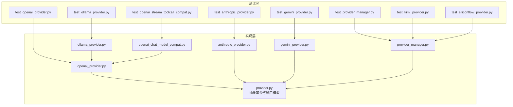
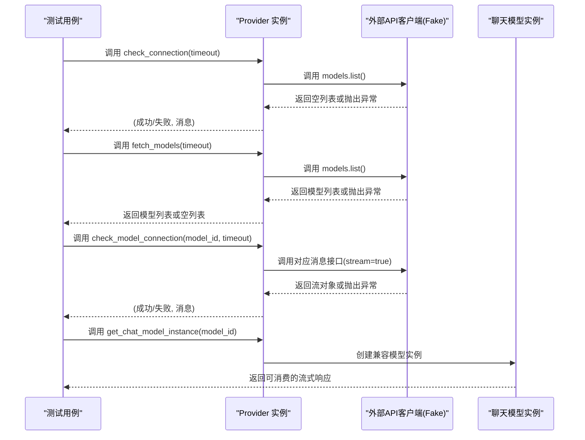
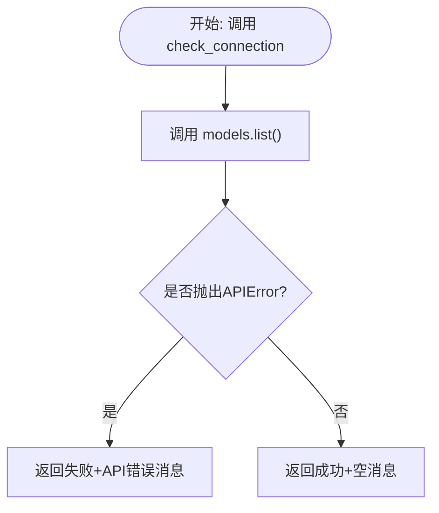
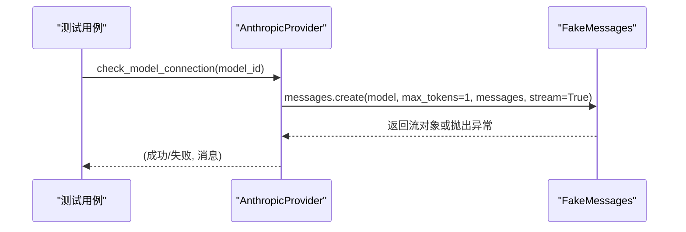
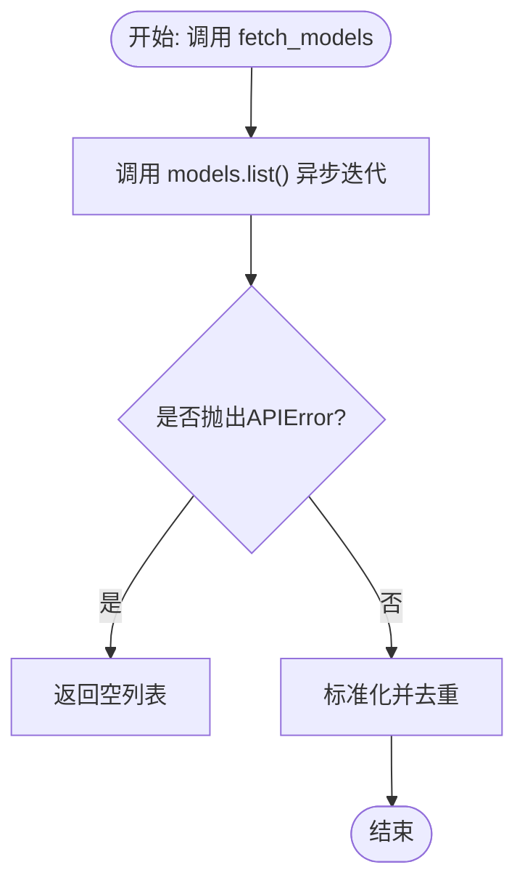
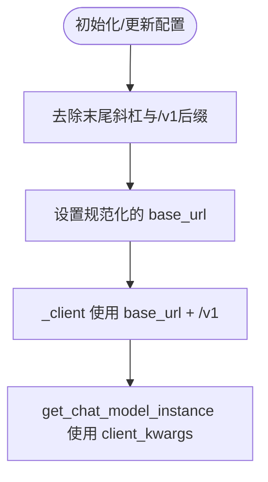
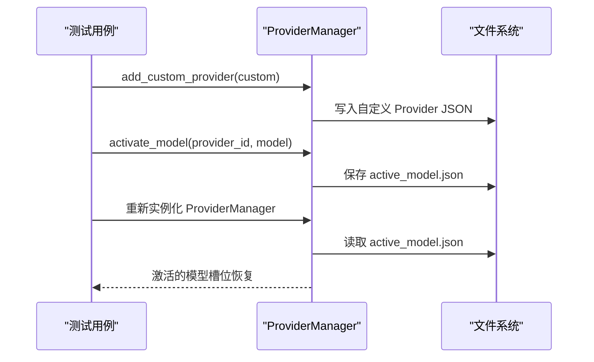
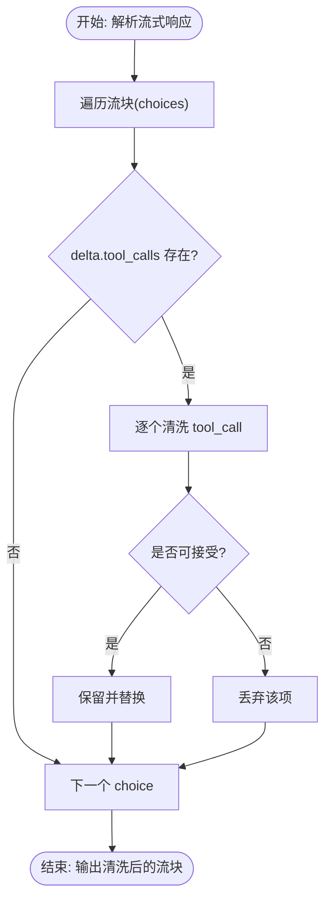
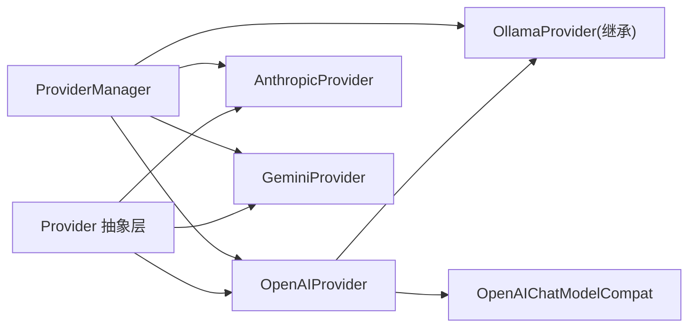

# 提供商测试

<cite>
**本文引用的文件**
- [tests/unit/providers/test_openai_provider.py](file://tests/unit/providers/test_openai_provider.py)
- [tests/unit/providers/test_anthropic_provider.py](file://tests/unit/providers/test_anthropic_provider.py)
- [tests/unit/providers/test_gemini_provider.py](file://tests/unit/providers/test_gemini_provider.py)
- [tests/unit/providers/test_ollama_provider.py](file://tests/unit/providers/test_ollama_provider.py)
- [tests/unit/providers/test_provider_manager.py](file://tests/unit/providers/test_provider_manager.py)
- [tests/unit/providers/test_openai_stream_toolcall_compat.py](file://tests/unit/providers/test_openai_stream_toolcall_compat.py)
- [tests/unit/providers/test_kimi_provider.py](file://tests/unit/providers/test_kimi_provider.py)
- [tests/unit/providers/test_siliconflow_provider.py](file://tests/unit/providers/test_siliconflow_provider.py)
- [src/qwenpaw/providers/provider.py](file://src/qwenpaw/providers/provider.py)
- [src/qwenpaw/providers/openai_provider.py](file://src/qwenpaw/providers/openai_provider.py)
- [src/qwenpaw/providers/anthropic_provider.py](file://src/qwenpaw/providers/anthropic_provider.py)
- [src/qwenpaw/providers/gemini_provider.py](file://src/qwenpaw/providers/gemini_provider.py)
- [src/qwenpaw/providers/ollama_provider.py](file://src/qwenpaw/providers/ollama_provider.py)
- [src/qwenpaw/providers/openai_chat_model_compat.py](file://src/qwenpaw/providers/openai_chat_model_compat.py)
- [src/qwenpaw/providers/provider_manager.py](file://src/qwenpaw/providers/provider_manager.py)
</cite>

## 目录
1. [简介](#简介)
2. [项目结构](#项目结构)
3. [核心组件](#核心组件)
4. [架构总览](#架构总览)
5. [详细组件分析](#详细组件分析)
6. [依赖分析](#依赖分析)
7. [性能考虑](#性能考虑)
8. [故障排查指南](#故障排查指南)
9. [结论](#结论)
10. [附录](#附录)

## 简介
本文件面向 QwenPaw 的“提供商（Provider）系统”单元测试，系统性梳理 OpenAI、Anthropic、Gemini、Ollama 等多家 AI 服务提供商的测试实现与最佳实践，覆盖提供商管理器、流式工具调用兼容性、API 连接检查、模型可用性验证、错误处理与配置更新等关键测试场景。同时给出模拟外部 API 响应的方法、测试数据准备策略以及可复用的测试示例路径，帮助开发者快速编写与维护高质量的提供商相关测试。

## 项目结构
提供商测试主要位于 tests/unit/providers 下，按提供商类型拆分测试文件；提供商实现位于 src/qwenpaw/providers 下，包含抽象基类 Provider、各厂商具体 Provider 实现、兼容层与管理器 ProviderManager。

图示来源
- [tests/unit/providers/test_openai_provider.py:1-269](file://tests/unit/providers/test_openai_provider.py#L1-L269)
- [tests/unit/providers/test_anthropic_provider.py:1-189](file://tests/unit/providers/test_anthropic_provider.py#L1-L189)
- [tests/unit/providers/test_gemini_provider.py:1-341](file://tests/unit/providers/test_gemini_provider.py#L1-L341)
- [tests/unit/providers/test_ollama_provider.py:1-141](file://tests/unit/providers/test_ollama_provider.py#L1-L141)
- [tests/unit/providers/test_provider_manager.py:1-537](file://tests/unit/providers/test_provider_manager.py#L1-L537)
- [tests/unit/providers/test_openai_stream_toolcall_compat.py:1-172](file://tests/unit/providers/test_openai_stream_toolcall_compat.py#L1-L172)
- [tests/unit/providers/test_kimi_provider.py:1-132](file://tests/unit/providers/test_kimi_provider.py#L1-L132)
- [tests/unit/providers/test_siliconflow_provider.py:1-95](file://tests/unit/providers/test_siliconflow_provider.py#L1-L95)
- [src/qwenpaw/providers/provider.py:1-200](file://src/qwenpaw/providers/provider.py#L1-L200)
- [src/qwenpaw/providers/openai_provider.py:1-200](file://src/qwenpaw/providers/openai_provider.py#L1-L200)
- [src/qwenpaw/providers/anthropic_provider.py:1-200](file://src/qwenpaw/providers/anthropic_provider.py#L1-L200)
- [src/qwenpaw/providers/gemini_provider.py:1-200](file://src/qwenpaw/providers/gemini_provider.py#L1-L200)
- [src/qwenpaw/providers/ollama_provider.py:1-86](file://src/qwenpaw/providers/ollama_provider.py#L1-L86)
- [src/qwenpaw/providers/openai_chat_model_compat.py:1-200](file://src/qwenpaw/providers/openai_chat_model_compat.py#L1-L200)
- [src/qwenpaw/providers/provider_manager.py:1-200](file://src/qwenpaw/providers/provider_manager.py#L1-L200)

章节来源
- [tests/unit/providers/test_openai_provider.py:1-269](file://tests/unit/providers/test_openai_provider.py#L1-L269)
- [tests/unit/providers/test_anthropic_provider.py:1-189](file://tests/unit/providers/test_anthropic_provider.py#L1-L189)
- [tests/unit/providers/test_gemini_provider.py:1-341](file://tests/unit/providers/test_gemini_provider.py#L1-L341)
- [tests/unit/providers/test_ollama_provider.py:1-141](file://tests/unit/providers/test_ollama_provider.py#L1-L141)
- [tests/unit/providers/test_provider_manager.py:1-537](file://tests/unit/providers/test_provider_manager.py#L1-L537)
- [tests/unit/providers/test_openai_stream_toolcall_compat.py:1-172](file://tests/unit/providers/test_openai_stream_toolcall_compat.py#L1-L172)
- [tests/unit/providers/test_kimi_provider.py:1-132](file://tests/unit/providers/test_kimi_provider.py#L1-L132)
- [tests/unit/providers/test_siliconflow_provider.py:1-95](file://tests/unit/providers/test_siliconflow_provider.py#L1-L95)
- [src/qwenpaw/providers/provider.py:1-200](file://src/qwenpaw/providers/provider.py#L1-L200)
- [src/qwenpaw/providers/openai_provider.py:1-200](file://src/qwenpaw/providers/openai_provider.py#L1-L200)
- [src/qwenpaw/providers/anthropic_provider.py:1-200](file://src/qwenpaw/providers/anthropic_provider.py#L1-L200)
- [src/qwenpaw/providers/gemini_provider.py:1-200](file://src/qwenpaw/providers/gemini_provider.py#L1-L200)
- [src/qwenpaw/providers/ollama_provider.py:1-86](file://src/qwenpaw/providers/ollama_provider.py#L1-L86)
- [src/qwenpaw/providers/openai_chat_model_compat.py:1-200](file://src/qwenpaw/providers/openai_chat_model_compat.py#L1-L200)
- [src/qwenpaw/providers/provider_manager.py:1-200](file://src/qwenpaw/providers/provider_manager.py#L1-L200)

## 核心组件
- 抽象基类 Provider：定义统一接口（连接检查、模型发现、模型连通性检查、配置更新、聊天模型实例化等），并提供通用的数据模型 ModelInfo、ProviderInfo。
- 各厂商 Provider 实现：
  - OpenAIProvider：支持模型列表标准化、连通性检查、模型连通性检查、多模态探测、兼容 OpenAI 兼容端点。
  - AnthropicProvider：基于 Messages API 的连通性与模型连通性检查，多模态探测。
  - GeminiProvider：使用 Google GenAI 异步客户端，支持模型列表标准化、连通性检查、模型连通性检查、多模态探测。
  - OllamaProvider：继承 OpenAIProvider，对 base_url 进行规范化与 /v1 兼容，适配本地推理平台。
- 兼容层 OpenAIChatModelCompat：增强流式响应解析，修复工具调用字段异常，透传额外内容（如 Gemini 思维签名）。
- ProviderManager：内置多家厂商 Provider 注册、自定义 Provider 添加/移除/持久化、激活模型、迁移旧配置、恢复本地模型等。

章节来源
- [src/qwenpaw/providers/provider.py:1-200](file://src/qwenpaw/providers/provider.py#L1-L200)
- [src/qwenpaw/providers/openai_provider.py:1-200](file://src/qwenpaw/providers/openai_provider.py#L1-L200)
- [src/qwenpaw/providers/anthropic_provider.py:1-200](file://src/qwenpaw/providers/anthropic_provider.py#L1-L200)
- [src/qwenpaw/providers/gemini_provider.py:1-200](file://src/qwenpaw/providers/gemini_provider.py#L1-L200)
- [src/qwenpaw/providers/ollama_provider.py:1-86](file://src/qwenpaw/providers/ollama_provider.py#L1-L86)
- [src/qwenpaw/providers/openai_chat_model_compat.py:1-200](file://src/qwenpaw/providers/openai_chat_model_compat.py#L1-L200)
- [src/qwenpaw/providers/provider_manager.py:1-200](file://src/qwenpaw/providers/provider_manager.py#L1-L200)

## 架构总览
提供商测试围绕“模拟外部 API 客户端 + 断言行为”的模式展开，通过 monkeypatch 注入 Fake 客户端或替换异常类型，验证 Provider 的连接检查、模型发现、模型连通性检查、配置更新与错误处理逻辑。ProviderManager 测试则覆盖注册、持久化、迁移、激活模型等流程。

图示来源
- [tests/unit/providers/test_openai_provider.py:21-127](file://tests/unit/providers/test_openai_provider.py#L21-L127)
- [tests/unit/providers/test_anthropic_provider.py:21-123](file://tests/unit/providers/test_anthropic_provider.py#L21-L123)
- [tests/unit/providers/test_gemini_provider.py:41-199](file://tests/unit/providers/test_gemini_provider.py#L41-L199)
- [src/qwenpaw/providers/openai_provider.py:57-125](file://src/qwenpaw/providers/openai_provider.py#L57-L125)
- [src/qwenpaw/providers/anthropic_provider.py:66-126](file://src/qwenpaw/providers/anthropic_provider.py#L66-L126)
- [src/qwenpaw/providers/gemini_provider.py:68-130](file://src/qwenpaw/providers/gemini_provider.py#L68-L130)

## 详细组件分析

### OpenAI 提供商测试
- 连接检查：构造 FakeModels.list，断言返回成功且超时参数传递正确；捕获 APIError 时返回失败消息。
- 模型发现：构造包含重复/无效条目的列表，断言去重与名称规范化；捕获 APIError 时返回空列表。
- 模型连通性检查：构造 FakeStream，断言调用 create 时携带 model、timeout、max_tokens、stream 参数；捕获 APIError 时返回失败消息。
- 配置更新：仅更新非 None 字段；禁止更新 chat_model（非自定义）；冻结 base_url 时禁止更新；敏感信息脱敏显示。
- 错误处理：区分 APIError 与未知异常，返回明确提示。

图示来源
- [tests/unit/providers/test_openai_provider.py:21-55](file://tests/unit/providers/test_openai_provider.py#L21-L55)
- [src/qwenpaw/providers/openai_provider.py:57-71](file://src/qwenpaw/providers/openai_provider.py#L57-L71)

章节来源
- [tests/unit/providers/test_openai_provider.py:1-269](file://tests/unit/providers/test_openai_provider.py#L1-L269)
- [src/qwenpaw/providers/openai_provider.py:1-200](file://src/qwenpaw/providers/openai_provider.py#L1-L200)

### Anthropic 提供商测试
- 连接检查：构造 FakeModels.list，断言调用次数与返回成功；捕获 APIError 时返回特定失败消息。
- 模型发现：构造包含重复/无效条目的列表，断言去重与 display_name 规范化；返回 Provider.models 不被污染。
- 模型连通性检查：构造 FakeMessages.create，断言调用 create 时携带 model、max_tokens、messages、stream；空模型 ID 返回失败；捕获 APIError 时返回失败消息。
- 配置更新：仅更新非 None 字段；自定义 Provider 支持更新 chat_model。

图示来源
- [tests/unit/providers/test_anthropic_provider.py:90-123](file://tests/unit/providers/test_anthropic_provider.py#L90-L123)
- [src/qwenpaw/providers/anthropic_provider.py:87-126](file://src/qwenpaw/providers/anthropic_provider.py#L87-L126)

章节来源
- [tests/unit/providers/test_anthropic_provider.py:1-189](file://tests/unit/providers/test_anthropic_provider.py#L1-L189)
- [src/qwenpaw/providers/anthropic_provider.py:1-200](file://src/qwenpaw/providers/anthropic_provider.py#L1-L200)

### Gemini 提供商测试
- 连接检查：构造异步迭代器 FakeModels.list，断言成功；捕获 APIError 返回特定失败消息；捕获通用异常返回未知异常消息。
- 模型发现：构造包含重复/无效条目的列表，断言去重与前缀剥离（models/）；捕获 APIError 或通用异常返回空列表。
- 模型连通性检查：构造 FakeModels.generate_content_stream，断言调用 generate_content_stream 时携带 model 与 contents；空模型 ID 返回失败；捕获 APIError 返回不可达消息；捕获通用异常返回未知异常消息。
- 模型标准化：断言 _normalize_models_payload 对前缀与 display_name 的处理；空输入与 None 输入返回空列表。
- 配置更新：仅更新非 None 字段；保留敏感信息脱敏显示。

图示来源
- [tests/unit/providers/test_gemini_provider.py:102-170](file://tests/unit/providers/test_gemini_provider.py#L102-L170)
- [src/qwenpaw/providers/gemini_provider.py:88-100](file://src/qwenpaw/providers/gemini_provider.py#L88-L100)

章节来源
- [tests/unit/providers/test_gemini_provider.py:1-341](file://tests/unit/providers/test_gemini_provider.py#L1-L341)
- [src/qwenpaw/providers/gemini_provider.py:1-200](file://src/qwenpaw/providers/gemini_provider.py#L1-L200)

### Ollama 提供商测试
- URL 规范化：初始化与 update_config 时均进行 base_url 规范化；支持从环境变量 OLLAMA_HOST 自动加载。
- 客户端与聊天模型：_client 使用单斜杠 /v1 兼容端点；get_chat_model_instance 传入 client_kwargs 为 /v1。
- 行为限制：add_model/delete_model 在 OllamaProvider 中不支持（需通过 Ollama 本地命令管理模型）。

图示来源
- [tests/unit/providers/test_ollama_provider.py:19-141](file://tests/unit/providers/test_ollama_provider.py#L19-L141)
- [src/qwenpaw/providers/ollama_provider.py:19-86](file://src/qwenpaw/providers/ollama_provider.py#L19-L86)

章节来源
- [tests/unit/providers/test_ollama_provider.py:1-141](file://tests/unit/providers/test_ollama_provider.py#L1-L141)
- [src/qwenpaw/providers/ollama_provider.py:1-86](file://src/qwenpaw/providers/ollama_provider.py#L1-L86)

### ProviderManager 测试
- 内置 Provider 注册：校验 zhipu 系列、Kimi、SiliconFlow 等内置 Provider 的默认配置、模型列表与冻结 URL。
- 自定义 Provider：添加自定义 Provider 并持久化；冲突时自动重命名；从存储重新加载；移除不存在文件的安全性。
- 激活模型：保存并重新加载激活的模型槽位；迁移旧 providers.json；不同 Provider 类型的回退策略（如 MiniMax 迁移到 Anthropic）。
- 本地模型恢复：恢复本地 LlamaCpp 服务器状态与模型元数据。
- 更新 Provider：内置 Provider 更新时仅影响运行态（不写回内置路径）；未知 Provider 返回失败。

图示来源
- [tests/unit/providers/test_provider_manager.py:132-203](file://tests/unit/providers/test_provider_manager.py#L132-L203)
- [src/qwenpaw/providers/provider_manager.py:1-200](file://src/qwenpaw/providers/provider_manager.py#L1-L200)

章节来源
- [tests/unit/providers/test_provider_manager.py:1-537](file://tests/unit/providers/test_provider_manager.py#L1-L537)
- [src/qwenpaw/providers/provider_manager.py:1-200](file://src/qwenpaw/providers/provider_manager.py#L1-L200)

### 流式工具调用兼容性测试
- 解析健壮性：当工具调用缺失 function 或 arguments 为 None 时，进行安全归一化；确保 arguments 为字符串并可 JSON 反序列化。
- 流式响应清洗：对 choices 中的 tool_calls 进行逐项清洗，丢弃不可用项并替换为安全版本；记录额外内容（如 Gemini 思维签名）以供后续使用。
- 单测策略：构造包含多种异常工具调用的流块，断言最终只保留有效工具调用块，参数格式正确。

图示来源
- [tests/unit/providers/test_openai_stream_toolcall_compat.py:15-110](file://tests/unit/providers/test_openai_stream_toolcall_compat.py#L15-L110)
- [src/qwenpaw/providers/openai_chat_model_compat.py:28-136](file://src/qwenpaw/providers/openai_chat_model_compat.py#L28-L136)

章节来源
- [tests/unit/providers/test_openai_stream_toolcall_compat.py:1-172](file://tests/unit/providers/test_openai_stream_toolcall_compat.py#L1-L172)
- [src/qwenpaw/providers/openai_chat_model_compat.py:1-200](file://src/qwenpaw/providers/openai_chat_model_compat.py#L1-L200)

### Kimi 与 SiliconFlow 内置提供商测试
- Kimi：作为 OpenAIProvider 兼容实现，注册内置 Provider，校验模型列表与激活能力。
- SiliconFlow：作为 OpenAIProvider 兼容实现，注册内置 Provider，校验支持模型发现与连接检查。

章节来源
- [tests/unit/providers/test_kimi_provider.py:1-132](file://tests/unit/providers/test_kimi_provider.py#L1-L132)
- [tests/unit/providers/test_siliconflow_provider.py:1-95](file://tests/unit/providers/test_siliconflow_provider.py#L1-L95)
- [src/qwenpaw/providers/provider_manager.py:1-200](file://src/qwenpaw/providers/provider_manager.py#L1-L200)

## 依赖分析
- Provider 抽象层：统一接口与数据模型，降低各厂商差异带来的测试复杂度。
- 兼容层：OpenAIChatModelCompat 为流式响应提供统一解析与清洗能力，减少各厂商流式差异对测试的影响。
- ProviderManager：集中管理 Provider 生命周期与持久化，测试中通过 monkeypatch 与临时目录隔离敏感操作。

图示来源
- [src/qwenpaw/providers/provider.py:111-200](file://src/qwenpaw/providers/provider.py#L111-L200)
- [src/qwenpaw/providers/openai_provider.py:25-163](file://src/qwenpaw/providers/openai_provider.py#L25-L163)
- [src/qwenpaw/providers/anthropic_provider.py:27-164](file://src/qwenpaw/providers/anthropic_provider.py#L27-L164)
- [src/qwenpaw/providers/gemini_provider.py:27-140](file://src/qwenpaw/providers/gemini_provider.py#L27-L140)
- [src/qwenpaw/providers/ollama_provider.py:16-86](file://src/qwenpaw/providers/ollama_provider.py#L16-L86)
- [src/qwenpaw/providers/openai_chat_model_compat.py:191-200](file://src/qwenpaw/providers/openai_chat_model_compat.py#L191-L200)
- [src/qwenpaw/providers/provider_manager.py:1-200](file://src/qwenpaw/providers/provider_manager.py#L1-L200)

章节来源
- [src/qwenpaw/providers/provider.py:1-200](file://src/qwenpaw/providers/provider.py#L1-L200)
- [src/qwenpaw/providers/openai_provider.py:1-200](file://src/qwenpaw/providers/openai_provider.py#L1-L200)
- [src/qwenpaw/providers/anthropic_provider.py:1-200](file://src/qwenpaw/providers/anthropic_provider.py#L1-L200)
- [src/qwenpaw/providers/gemini_provider.py:1-200](file://src/qwenpaw/providers/gemini_provider.py#L1-L200)
- [src/qwenpaw/providers/ollama_provider.py:1-86](file://src/qwenpaw/providers/ollama_provider.py#L1-L86)
- [src/qwenpaw/providers/openai_chat_model_compat.py:1-200](file://src/qwenpaw/providers/openai_chat_model_compat.py#L1-L200)
- [src/qwenpaw/providers/provider_manager.py:1-200](file://src/qwenpaw/providers/provider_manager.py#L1-L200)

## 性能考虑
- 超时控制：所有连接检查与模型连通性检查均支持 timeout 参数，测试中通过参数注入验证行为一致性。
- 流式消费：模型连通性检查会消费一次流以确保可用性，避免假阳性；测试中通过 FakeStream 实现最小化开销。
- 多模态探测：图像/视频探测采用最小负载请求，避免对真实模型造成压力；探测失败时短路视频探测以减少无效尝试。
- 配置更新：仅更新非 None 字段，避免不必要的持久化与重启；冻结 URL 时跳过更新，提升稳定性。

## 故障排查指南
- API 连接失败：检查 base_url 与 api_key 是否正确；确认网络可达性；查看 Provider 返回的错误消息（区分 APIError 与未知异常）。
- 模型不可用：确认模型 ID 是否为空；检查模型是否在目标 Provider 上存在；验证流式响应是否可正常消费。
- 配置更新未生效：确认 Provider 是否为自定义；冻结 URL 的 Provider 不允许更新 base_url；敏感字段会被脱敏显示。
- ProviderManager 激活失败：检查 Provider 是否存在；检查模型是否在 Provider 的模型列表中；查看持久化文件是否存在与可读。
- 流式工具调用解析异常：关注工具调用缺失 function 或 arguments 为 None 的情况；确保 arguments 为字符串并可 JSON 反序列化。

章节来源
- [tests/unit/providers/test_openai_provider.py:40-55](file://tests/unit/providers/test_openai_provider.py#L40-L55)
- [tests/unit/providers/test_anthropic_provider.py:134-158](file://tests/unit/providers/test_anthropic_provider.py#L134-L158)
- [tests/unit/providers/test_gemini_provider.py:210-253](file://tests/unit/providers/test_gemini_provider.py#L210-L253)
- [tests/unit/providers/test_provider_manager.py:407-423](file://tests/unit/providers/test_provider_manager.py#L407-L423)
- [src/qwenpaw/providers/openai_chat_model_compat.py:28-136](file://src/qwenpaw/providers/openai_chat_model_compat.py#L28-L136)

## 结论
通过对 OpenAI、Anthropic、Gemini、Ollama 等提供商的系统化测试覆盖，结合 ProviderManager 的生命周期与持久化测试，以及 OpenAIChatModelCompat 的流式工具调用兼容性测试，QwenPaw 的提供商体系具备良好的可测试性与可维护性。建议在新增或变更提供商时，遵循现有测试模式：使用 monkeypatch 构造最小化 Fake 客户端、覆盖异常分支、断言关键参数与行为，并通过 ProviderManager 的持久化与迁移测试确保配置兼容性。

## 附录
- 测试示例路径参考：
  - OpenAI 连接检查与模型发现：[tests/unit/providers/test_openai_provider.py:21-95](file://tests/unit/providers/test_openai_provider.py#L21-L95)
  - Anthropic 模型连通性检查：[tests/unit/providers/test_anthropic_provider.py:90-123](file://tests/unit/providers/test_anthropic_provider.py#L90-L123)
  - Gemini 模型发现与标准化：[tests/unit/providers/test_gemini_provider.py:102-170](file://tests/unit/providers/test_gemini_provider.py#L102-L170)
  - Ollama URL 规范化与客户端参数：[tests/unit/providers/test_ollama_provider.py:19-104](file://tests/unit/providers/test_ollama_provider.py#L19-L104)
  - ProviderManager 自定义 Provider 添加与持久化：[tests/unit/providers/test_provider_manager.py:132-171](file://tests/unit/providers/test_provider_manager.py#L132-L171)
  - 流式工具调用清洗与解析：[tests/unit/providers/test_openai_stream_toolcall_compat.py:63-110](file://tests/unit/providers/test_openai_stream_toolcall_compat.py#L63-L110)
  - 内置 Kimi/SiliconFlow Provider 注册与激活：[tests/unit/providers/test_kimi_provider.py:58-132](file://tests/unit/providers/test_kimi_provider.py#L58-L132), [tests/unit/providers/test_siliconflow_provider.py:57-95](file://tests/unit/providers/test_siliconflow_provider.py#L57-L95)