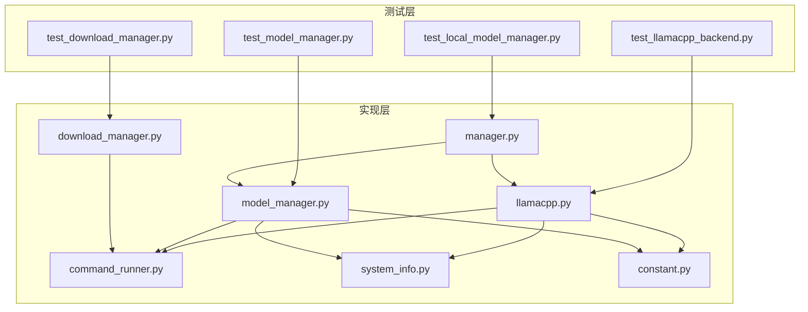
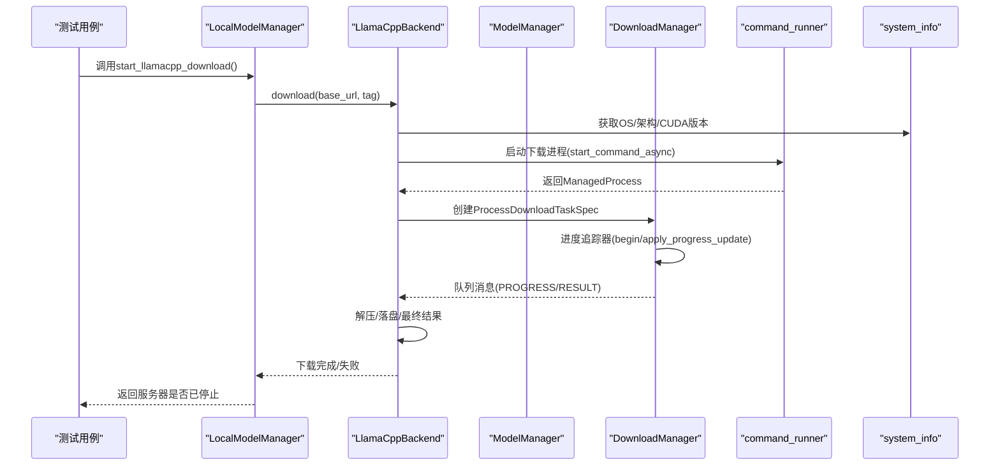
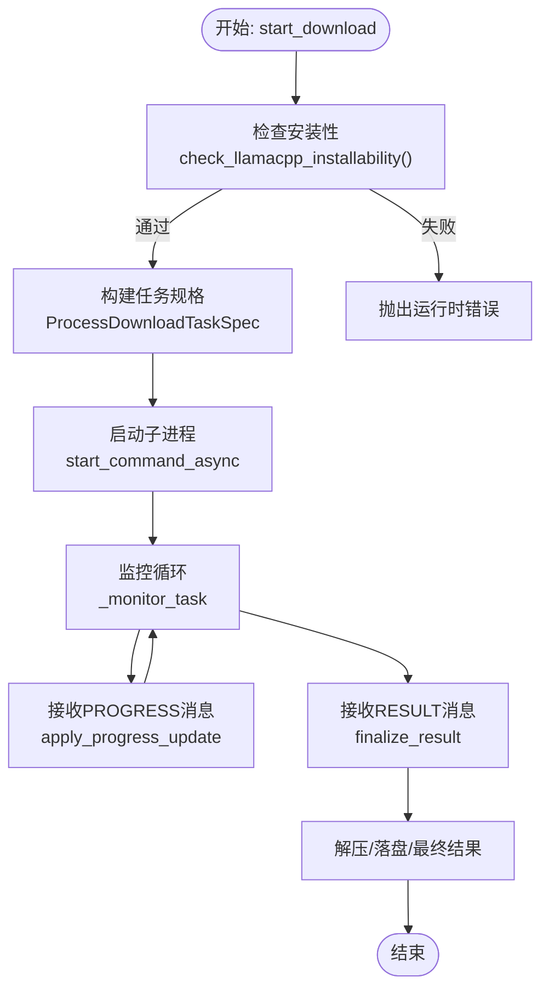
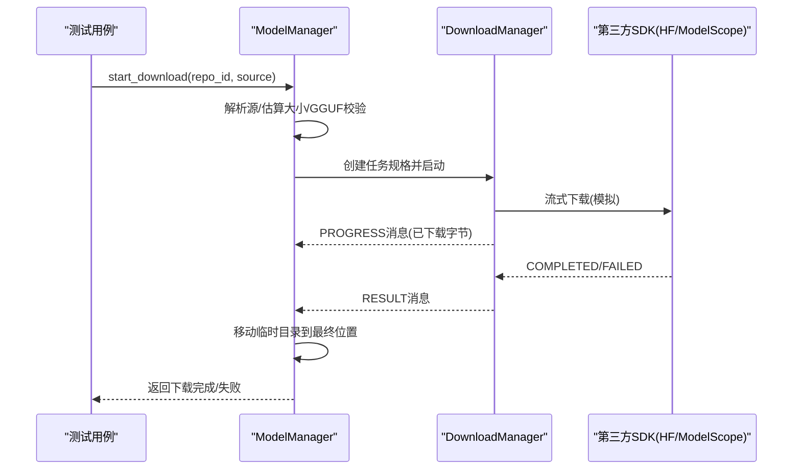
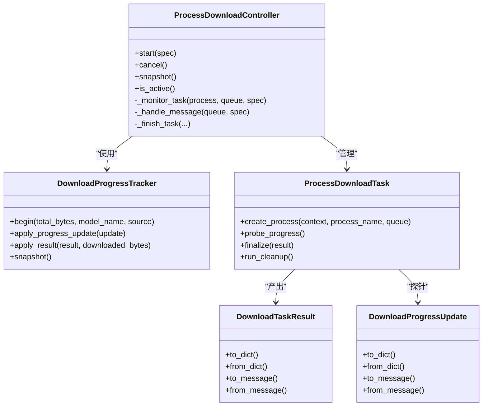
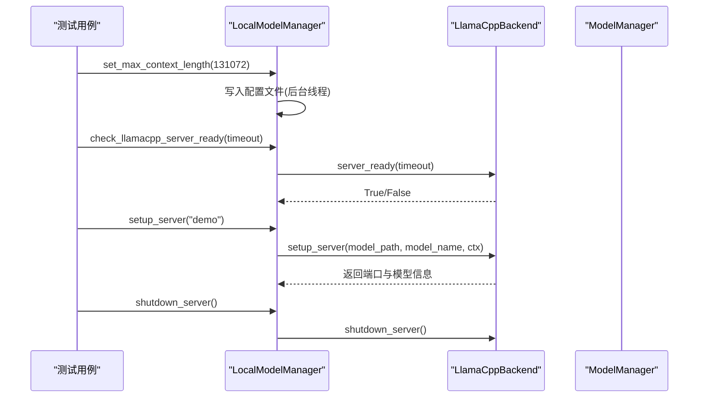
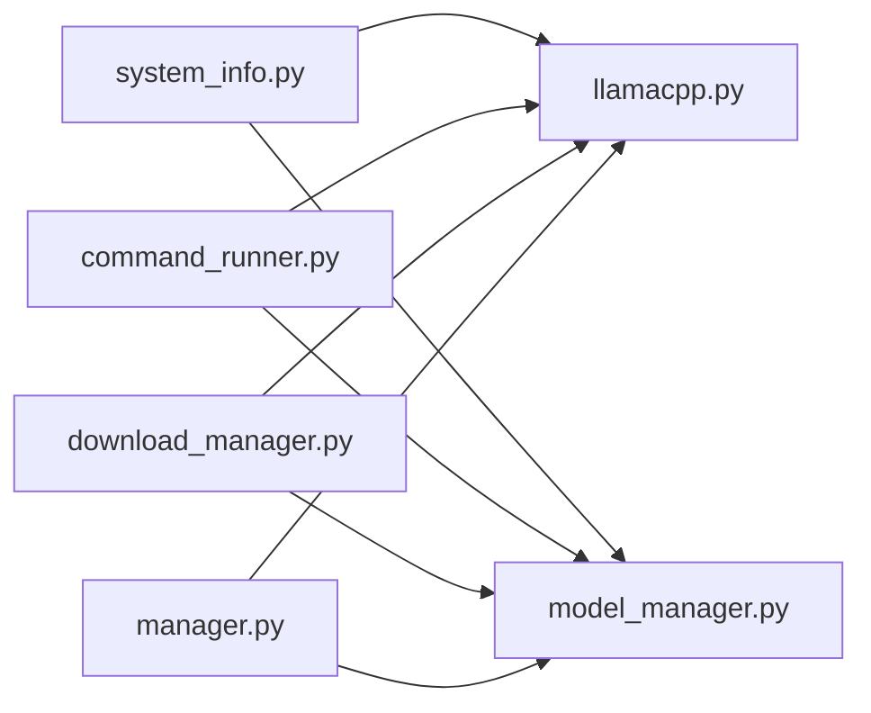

# 本地模型测试

<cite>
**本文档引用的文件**
- [tests/unit/local_models/test_llamacpp_backend.py](file://tests/unit/local_models/test_llamacpp_backend.py)
- [tests/unit/local_models/test_local_model_manager.py](file://tests/unit/local_models/test_local_model_manager.py)
- [tests/unit/local_models/test_download_manager.py](file://tests/unit/local_models/test_download_manager.py)
- [tests/unit/local_models/test_model_manager.py](file://tests/unit/local_models/test_model_manager.py)
- [src/qwenpaw/local_models/llamacpp.py](file://src/qwenpaw/local_models/llamacpp.py)
- [src/qwenpaw/local_models/manager.py](file://src/qwenpaw/local_models/manager.py)
- [src/qwenpaw/local_models/download_manager.py](file://src/qwenpaw/local_models/download_manager.py)
- [src/qwenpaw/local_models/model_manager.py](file://src/qwenpaw/local_models/model_manager.py)
- [src/qwenpaw/utils/command_runner.py](file://src/qwenpaw/utils/command_runner.py)
- [src/qwenpaw/utils/system_info.py](file://src/qwenpaw/utils/system_info.py)
- [src/qwenpaw/constant.py](file://src/qwenpaw/constant.py)
</cite>

## 目录
1. [简介](#简介)
2. [项目结构](#项目结构)
3. [核心组件](#核心组件)
4. [架构总览](#架构总览)
5. [详细组件分析](#详细组件分析)
6. [依赖分析](#依赖分析)
7. [性能考虑](#性能考虑)
8. [故障排查指南](#故障排查指南)
9. [结论](#结论)
10. [附录](#附录)

## 简介
本文件面向QwenPaw本地模型管理系统的单元测试，聚焦以下核心功能的测试设计与实现：
- llama.cpp后端测试：覆盖安装性校验、版本查询、设备枚举、下载流程、服务器启动与健康检查、错误处理与取消机制。
- 模型管理器测试：覆盖推荐模型、下载进度、源解析、GGUF校验、下载任务生命周期、临时目录清理与最终落盘。
- 下载管理器测试：覆盖进度追踪、消息序列化、进程控制器、终端结果处理、异常归因与资源回收。

测试通过pytest框架执行，广泛使用monkeypatch进行外部依赖（如系统信息、网络请求、命令执行）的模拟，确保测试在无外部环境依赖的情况下稳定运行。

## 项目结构
本地模型相关代码位于src/qwenpaw/local_models目录，测试位于tests/unit/local_models目录。核心模块包括：
- LlamaCppBackend：负责llama.cpp二进制下载、解压、服务器启动、健康检查与关闭。
- ModelManager：负责本地模型仓库下载、进度追踪、源选择与最终落盘。
- LocalModelManager：统一入口，协调llama.cpp与模型下载，并持久化本地运行配置。
- DownloadManager：提供下载任务的状态、进度、消息队列与进程控制能力。
- 工具与常量：command_runner用于进程与命令封装；system_info用于系统信息探测；constant提供默认工作目录等常量。

图表来源
- [tests/unit/local_models/test_llamacpp_backend.py:1-1143](file://tests/unit/local_models/test_llamacpp_backend.py#L1-L1143)
- [tests/unit/local_models/test_model_manager.py:1-414](file://tests/unit/local_models/test_model_manager.py#L1-L414)
- [tests/unit/local_models/test_download_manager.py:1-260](file://tests/unit/local_models/test_download_manager.py#L1-L260)
- [tests/unit/local_models/test_local_model_manager.py:1-267](file://tests/unit/local_models/test_local_model_manager.py#L1-L267)
- [src/qwenpaw/local_models/llamacpp.py:1-887](file://src/qwenpaw/local_models/llamacpp.py#L1-L887)
- [src/qwenpaw/local_models/model_manager.py:1-654](file://src/qwenpaw/local_models/model_manager.py#L1-L654)
- [src/qwenpaw/local_models/download_manager.py:1-599](file://src/qwenpaw/local_models/download_manager.py#L1-L599)
- [src/qwenpaw/local_models/manager.py:1-229](file://src/qwenpaw/local_models/manager.py#L1-L229)
- [src/qwenpaw/utils/command_runner.py:1-578](file://src/qwenpaw/utils/command_runner.py#L1-L578)
- [src/qwenpaw/utils/system_info.py:1-229](file://src/qwenpaw/utils/system_info.py#L1-L229)
- [src/qwenpaw/constant.py:1-307](file://src/qwenpaw/constant.py#L1-L307)

章节来源
- [tests/unit/local_models/test_llamacpp_backend.py:1-1143](file://tests/unit/local_models/test_llamacpp_backend.py#L1-L1143)
- [tests/unit/local_models/test_model_manager.py:1-414](file://tests/unit/local_models/test_model_manager.py#L1-L414)
- [tests/unit/local_models/test_download_manager.py:1-260](file://tests/unit/local_models/test_download_manager.py#L1-L260)
- [tests/unit/local_models/test_local_model_manager.py:1-267](file://tests/unit/local_models/test_local_model_manager.py#L1-L267)

## 核心组件
- LlamaCppBackend
  - 安装性校验：根据操作系统、架构与CUDA版本判断是否可安装。
  - 版本查询与设备列表：通过命令行工具读取版本与设备信息。
  - 下载流程：支持分块下载、进度上报、解压合并、最终落盘。
  - 服务器控制：启动/关闭/健康检查，支持多模态模型参数。
  - 错误映射：对HTTP状态码与连接错误进行用户友好提示。
- ModelManager
  - 推荐模型：基于内存容量返回适合的模型清单。
  - 下载源解析：优先Hugging Face，不可达时回退至ModelScope。
  - GGUF校验：确保仓库包含可用的GGUF文件。
  - 进度追踪：通过子进程与队列传递进度与结果。
  - 最终落盘：将临时目录移动到最终位置并清理临时文件。
- DownloadManager
  - 进度追踪器：线程安全地记录状态、速度与元数据。
  - 进程控制器：管理子进程生命周期、监控线程与消息队列。
  - 消息协议：统一的进度与结果消息格式，便于跨进程通信。
  - 终止与清理：优雅关闭与强制终止，确保资源释放。
- LocalModelManager
  - 单一入口：封装llama.cpp与模型下载的协调逻辑。
  - 配置持久化：最大上下文长度等本地运行配置写入磁盘。
  - 服务器生命周期锁：避免并发启动/关闭导致的竞争条件。

章节来源
- [src/qwenpaw/local_models/llamacpp.py:51-887](file://src/qwenpaw/local_models/llamacpp.py#L51-L887)
- [src/qwenpaw/local_models/model_manager.py:63-654](file://src/qwenpaw/local_models/model_manager.py#L63-L654)
- [src/qwenpaw/local_models/download_manager.py:25-599](file://src/qwenpaw/local_models/download_manager.py#L25-L599)
- [src/qwenpaw/local_models/manager.py:33-229](file://src/qwenpaw/local_models/manager.py#L33-L229)

## 架构总览
下图展示了本地模型测试所覆盖的关键交互路径：测试通过monkeypatch替换系统信息、网络客户端与命令执行，从而在不依赖真实外部服务的情况下验证核心逻辑。

图表来源
- [tests/unit/local_models/test_local_model_manager.py:128-217](file://tests/unit/local_models/test_local_model_manager.py#L128-L217)
- [src/qwenpaw/local_models/manager.py:119-135](file://src/qwenpaw/local_models/manager.py#L119-L135)
- [src/qwenpaw/local_models/llamacpp.py:159-214](file://src/qwenpaw/local_models/llamacpp.py#L159-L214)
- [src/qwenpaw/local_models/download_manager.py:368-599](file://src/qwenpaw/local_models/download_manager.py#L368-L599)
- [src/qwenpaw/utils/command_runner.py:280-351](file://src/qwenpaw/utils/command_runner.py#L280-L351)
- [src/qwenpaw/utils/system_info.py:20-70](file://src/qwenpaw/utils/system_info.py#L20-L70)

## 详细组件分析

### llama.cpp后端测试
- 安装性与平台支持
  - macOS版本限制：低于13.3的版本会被拒绝安装。
  - Windows CUDA版本映射：仅支持特定主次版本组合。
  - 其他平台：CPU后端可用。
- 设备与版本查询
  - list_devices：解析命令输出，过滤无关行，返回可用设备列表。
  - get_version：从stderr中提取版本号，失败时抛出异常。
- 下载流程与错误映射
  - start_download：构建任务规格，启动子进程，实时上报进度。
  - _download_worker：流式下载、进度消息、解压与最终结果。
  - _format_download_error：将HTTP状态码映射为用户可读提示。
- 服务器生命周期与健康检查
  - setup_server：解析模型文件、启动进程、等待健康检查、记录日志。
  - server_ready：轮询/health接口，超时或异常时清理并抛错。
  - shutdown_server：优雅关闭与强制终止，重置状态。
- 取消与资源回收
  - 进程控制器在取消时设置状态并触发清理。
  - 日志任务在关闭前被取消，避免悬挂。

图表来源
- [src/qwenpaw/local_models/llamacpp.py:159-214](file://src/qwenpaw/local_models/llamacpp.py#L159-L214)
- [src/qwenpaw/local_models/download_manager.py:449-537](file://src/qwenpaw/local_models/download_manager.py#L449-L537)

章节来源
- [tests/unit/local_models/test_llamacpp_backend.py:235-500](file://tests/unit/local_models/test_llamacpp_backend.py#L235-L500)
- [tests/unit/local_models/test_llamacpp_backend.py:502-800](file://tests/unit/local_models/test_llamacpp_backend.py#L502-L800)
- [src/qwenpaw/local_models/llamacpp.py:89-144](file://src/qwenpaw/local_models/llamacpp.py#L89-L144)
- [src/qwenpaw/local_models/llamacpp.py:216-308](file://src/qwenpaw/local_models/llamacpp.py#L216-L308)
- [src/qwenpaw/local_models/llamacpp.py:656-692](file://src/qwenpaw/local_models/llamacpp.py#L656-L692)

### 模型管理器测试
- 推荐模型与内存检测
  - 基于VRAM或系统内存选择合适的模型集合。
- 下载源解析与大小估算
  - 自动探测Hugging Face可达性，否则回退至ModelScope。
  - 通过SDK接口估算总字节数，用于进度条显示。
- GGUF校验与错误提示
  - 在开始下载前检查仓库是否包含至少一个GGUF文件。
- 下载任务生命周期
  - start_download：准备临时目录、构建任务规格、启动控制器。
  - 进度探针：周期性计算已下载字节，更新速度。
  - 最终落盘：将临时目录移动到最终位置，删除临时文件。
- 临时目录与模型根目录识别
  - 忽略以点开头或以.downloading结尾的目录。
  - 递归去重，避免重复报告同一模型树。

图表来源
- [tests/unit/local_models/test_model_manager.py:49-113](file://tests/unit/local_models/test_model_manager.py#L49-L113)
- [tests/unit/local_models/test_model_manager.py:155-197](file://tests/unit/local_models/test_model_manager.py#L155-L197)
- [src/qwenpaw/local_models/model_manager.py:181-244](file://src/qwenpaw/local_models/model_manager.py#L181-L244)
- [src/qwenpaw/local_models/download_manager.py:368-448](file://src/qwenpaw/local_models/download_manager.py#L368-L448)

章节来源
- [tests/unit/local_models/test_model_manager.py:1-414](file://tests/unit/local_models/test_model_manager.py#L1-L414)
- [src/qwenpaw/local_models/model_manager.py:63-654](file://src/qwenpaw/local_models/model_manager.py#L63-L654)

### 下载管理器测试
- 数据结构与序列化
  - DownloadTaskResult/DownloadProgressUpdate：提供to_dict/from_dict与消息格式转换。
- 进度追踪器
  - begin：初始化状态与采样时间。
  - apply_progress_update：计算瞬时速度，更新下载进度。
  - apply_result：根据状态设置最终结果与错误信息。
- 进程控制器
  - start：创建队列与子进程，启动监控线程。
  - cancel：请求取消并优雅终止，清理资源。
  - _handle_message：处理PROGRESS/RESULT消息，调用finalize并结束任务。
- 异常处理与清理
  - 终止阶段异常：捕获并标记为FAILED，触发清理。
  - 资源回收：关闭队列、等待线程、关闭进程句柄。

图表来源
- [src/qwenpaw/local_models/download_manager.py:198-366](file://src/qwenpaw/local_models/download_manager.py#L198-L366)
- [src/qwenpaw/local_models/download_manager.py:368-599](file://src/qwenpaw/local_models/download_manager.py#L368-L599)

章节来源
- [tests/unit/local_models/test_download_manager.py:1-260](file://tests/unit/local_models/test_download_manager.py#L1-L260)
- [src/qwenpaw/local_models/download_manager.py:1-599](file://src/qwenpaw/local_models/download_manager.py#L1-L599)

### 本地模型管理器测试
- 协调与转发
  - 将llama.cpp与模型下载的同步/异步调用转发给对应后端。
  - 在启动llama.cpp下载前，若服务器正在运行则先关闭。
- 配置持久化
  - set_max_context_length：更新内存配置并在后台线程写入磁盘。
  - 读取与加载：JSON反序列化，异常时回退默认值。
- 服务器生命周期
  - setup_server：解析模型路径、构建命令、启动进程、健康检查。
  - shutdown_server：加锁保证并发安全，优雅关闭。

图表来源
- [tests/unit/local_models/test_local_model_manager.py:220-242](file://tests/unit/local_models/test_local_model_manager.py#L220-L242)
- [tests/unit/local_models/test_local_model_manager.py:244-267](file://tests/unit/local_models/test_local_model_manager.py#L244-L267)
- [src/qwenpaw/local_models/manager.py:105-110](file://src/qwenpaw/local_models/manager.py#L105-L110)
- [src/qwenpaw/local_models/manager.py:200-220](file://src/qwenpaw/local_models/manager.py#L200-L220)

章节来源
- [tests/unit/local_models/test_local_model_manager.py:1-267](file://tests/unit/local_models/test_local_model_manager.py#L1-L267)
- [src/qwenpaw/local_models/manager.py:1-229](file://src/qwenpaw/local_models/manager.py#L1-L229)

## 依赖分析
- 外部依赖模拟
  - system_info：通过monkeypatch替换get_os_name/get_architecture/get_cuda_version/get_macos_version，确保测试在不同平台/架构下稳定。
  - httpx.Client：通过自定义FakeClient/FakeStreamResponse模拟网络响应、状态码与异常。
  - command_runner：通过替换run_command_async/start_command_async，模拟命令执行与进程生命周期。
- 内部耦合
  - LlamaCppBackend与DownloadManager紧密耦合：前者使用后者提供的进度追踪与进程控制。
  - LocalModelManager同时依赖LlamaCppBackend与ModelManager，作为门面协调两者。
  - ModelManager依赖system_info与第三方SDK，用于源探测与下载。

图表来源
- [src/qwenpaw/utils/system_info.py:20-70](file://src/qwenpaw/utils/system_info.py#L20-L70)
- [src/qwenpaw/utils/command_runner.py:256-351](file://src/qwenpaw/utils/command_runner.py#L256-L351)
- [src/qwenpaw/local_models/llamacpp.py:22-40](file://src/qwenpaw/local_models/llamacpp.py#L22-L40)
- [src/qwenpaw/local_models/model_manager.py:22-34](file://src/qwenpaw/local_models/model_manager.py#L22-L34)
- [src/qwenpaw/local_models/download_manager.py:15-20](file://src/qwenpaw/local_models/download_manager.py#L15-L20)
- [src/qwenpaw/local_models/manager.py:15-17](file://src/qwenpaw/local_models/manager.py#L15-L17)

章节来源
- [tests/unit/local_models/test_llamacpp_backend.py:502-522](file://tests/unit/local_models/test_llamacpp_backend.py#L502-L522)
- [tests/unit/local_models/test_model_manager.py:335-370](file://tests/unit/local_models/test_model_manager.py#L335-L370)
- [src/qwenpaw/utils/system_info.py:1-229](file://src/qwenpaw/utils/system_info.py#L1-L229)
- [src/qwenpaw/utils/command_runner.py:1-578](file://src/qwenpaw/utils/command_runner.py#L1-L578)

## 性能考虑
- 进度计算
  - 通过时间戳差值计算瞬时速度，避免频繁I/O与高精度浮点运算。
- 进程与队列
  - 使用队列进行异步消息传递，减少阻塞；监控线程按固定间隔轮询，降低CPU占用。
- 文件操作
  - 最终落盘采用移动而非复制，减少磁盘写入开销；临时目录清理在异常路径与成功路径均执行。
- 并发控制
  - LocalModelManager使用互斥锁保护服务器生命周期，避免竞态条件导致的资源冲突。

## 故障排查指南
- llama.cpp下载失败
  - 检查HTTP状态码映射：403/404/5xx分别对应权限、包不存在与服务器错误。
  - 确认目标平台与架构匹配：Windows CUDA仅支持x64且版本映射。
  - 校验目标目录为目录而非文件：防止写入失败。
- 服务器启动失败
  - 健康检查超时：确认端口未被占用，日志中是否有致命错误。
  - 模型路径无效：确保GGUF文件存在且未被损坏。
- 进度停滞
  - 检查监控线程是否仍在运行，队列消息是否持续推送。
  - 确认子进程未提前退出，必要时查看日志任务输出。
- 取消无效
  - 确保调用cancel后等待监控线程结束，检查清理回调是否执行。

章节来源
- [src/qwenpaw/local_models/llamacpp.py:614-647](file://src/qwenpaw/local_models/llamacpp.py#L614-L647)
- [src/qwenpaw/local_models/llamacpp.py:656-692](file://src/qwenpaw/local_models/llamacpp.py#L656-L692)
- [src/qwenpaw/local_models/download_manager.py:449-537](file://src/qwenpaw/local_models/download_manager.py#L449-L537)

## 结论
本测试文档系统梳理了QwenPaw本地模型管理系统的单元测试设计与实现要点，重点覆盖llama.cpp后端、模型管理器与下载管理器三大模块。通过精心设计的模拟策略与边界场景覆盖，测试能够在无外部依赖的环境中稳定验证核心功能，包括安装性校验、下载流程、服务器生命周期与健康检查、配置持久化与错误处理。建议在后续迭代中继续扩展对多模态模型、复杂网络环境与极端资源场景的测试覆盖。

## 附录
- 测试环境配置
  - 使用pytest与monkeypatch进行依赖注入与外部服务模拟。
  - 通过DEFAULT_LOCAL_PROVIDER_DIR隔离测试产生的文件，避免污染用户环境。
- 测试用例示例路径
  - llama.cpp后端：[tests/unit/local_models/test_llamacpp_backend.py:296-444](file://tests/unit/local_models/test_llamacpp_backend.py#L296-L444)
  - 模型管理器：[tests/unit/local_models/test_model_manager.py:115-197](file://tests/unit/local_models/test_model_manager.py#L115-L197)
  - 下载管理器：[tests/unit/local_models/test_download_manager.py:98-141](file://tests/unit/local_models/test_download_manager.py#L98-L141)
  - 本地模型管理器：[tests/unit/local_models/test_local_model_manager.py:128-217](file://tests/unit/local_models/test_local_model_manager.py#L128-L217)