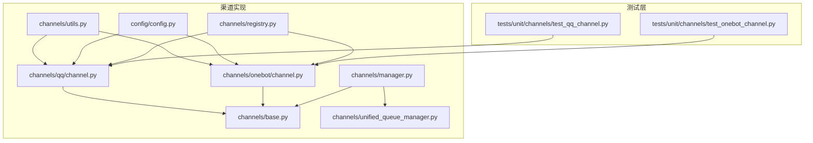
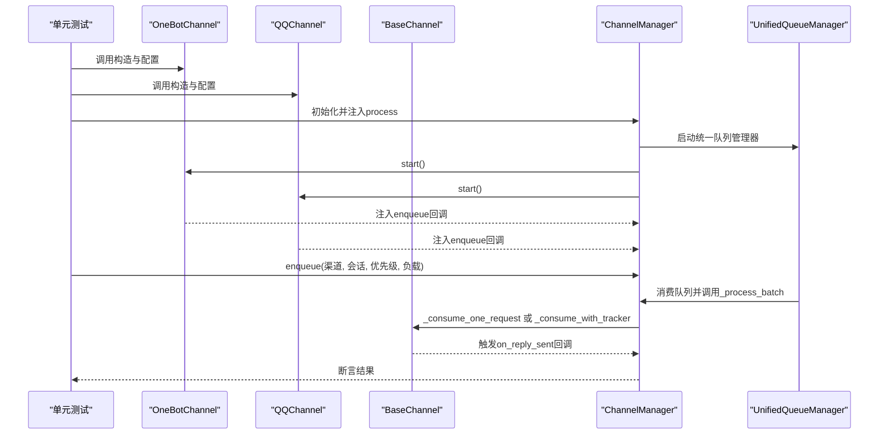
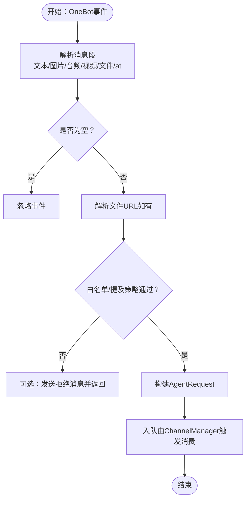
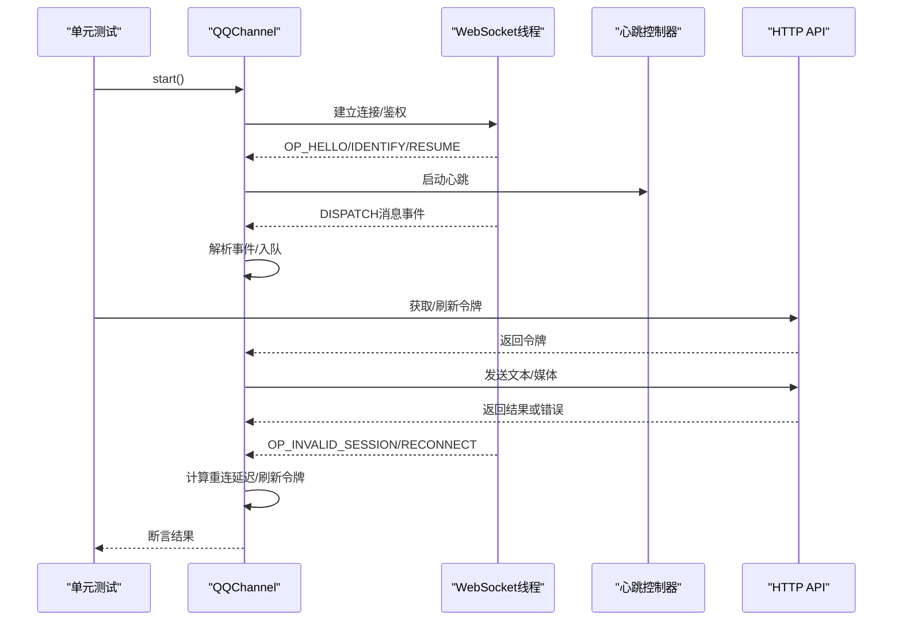
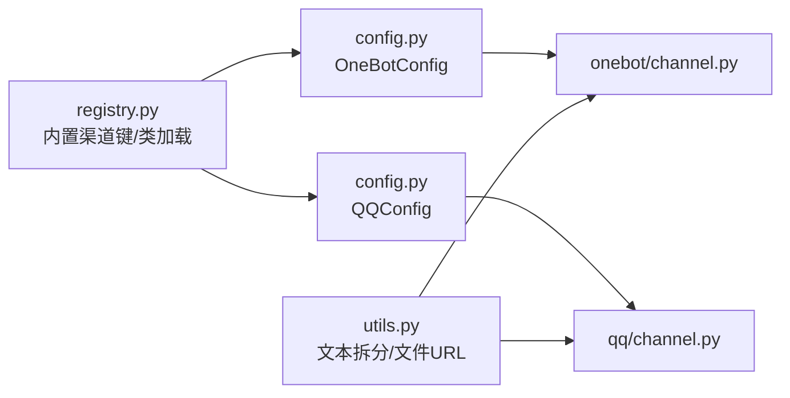

# 渠道测试

<cite>
**本文引用的文件**
- [tests/unit/channels/test_onebot_channel.py](file://tests/unit/channels/test_onebot_channel.py)
- [tests/unit/channels/test_qq_channel.py](file://tests/unit/channels/test_qq_channel.py)
- [src/qwenpaw/app/channels/onebot/channel.py](file://src/qwenpaw/app/channels/onebot/channel.py)
- [src/qwenpaw/app/channels/qq/channel.py](file://src/qwenpaw/app/channels/qq/channel.py)
- [src/qwenpaw/app/channels/base.py](file://src/qwenpaw/app/channels/base.py)
- [src/qwenpaw/app/channels/manager.py](file://src/qwenpaw/app/channels/manager.py)
- [src/qwenpaw/app/channels/unified_queue_manager.py](file://src/qwenpaw/app/channels/unified_queue_manager.py)
- [src/qwenpaw/app/channels/utils.py](file://src/qwenpaw/app/channels/utils.py)
- [src/qwenpaw/config/config.py](file://src/qwenpaw/config/config.py)
- [src/qwenpaw/app/channels/registry.py](file://src/qwenpaw/app/channels/registry.py)
</cite>

## 目录
1. [引言](#引言)
2. [项目结构](#项目结构)
3. [核心组件](#核心组件)
4. [架构总览](#架构总览)
5. [详细组件分析](#详细组件分析)
6. [依赖分析](#依赖分析)
7. [性能考虑](#性能考虑)
8. [故障排查指南](#故障排查指南)
9. [结论](#结论)
10. [附录](#附录)

## 引言
本文件面向QwenPaw渠道系统的单元测试，聚焦OneBot渠道与QQ渠道的测试实现，系统性阐述消息路由测试、会话管理测试与平台适配器测试方法，并提供可直接参考的测试代码路径与断言策略。文档同时说明如何通过测试模拟不同平台的消息格式与协议差异（如OneBot v11的事件模型、QQ的WebSocket事件与HTTP API），帮助开发者在不依赖真实外部服务的情况下完成高质量的渠道测试。

## 项目结构
- 测试位于 tests/unit/channels 下，分别覆盖 OneBot 与 QQ 渠道。
- 渠道实现位于 src/qwenpaw/app/channels 下，包含通用基类、队列管理、统一队列管理器、工具函数与配置模型。
- 注册表负责加载内置与自定义渠道类，供运行时按需实例化。

图表来源
- [tests/unit/channels/test_onebot_channel.py:1-757](file://tests/unit/channels/test_onebot_channel.py#L1-L757)
- [tests/unit/channels/test_qq_channel.py:1-1028](file://tests/unit/channels/test_qq_channel.py#L1-L1028)
- [src/qwenpaw/app/channels/base.py:1-1171](file://src/qwenpaw/app/channels/base.py#L1-L1171)
- [src/qwenpaw/app/channels/onebot/channel.py:1-791](file://src/qwenpaw/app/channels/onebot/channel.py#L1-L791)
- [src/qwenpaw/app/channels/qq/channel.py:1-1978](file://src/qwenpaw/app/channels/qq/channel.py#L1-L1978)
- [src/qwenpaw/app/channels/manager.py:1-711](file://src/qwenpaw/app/channels/manager.py#L1-L711)
- [src/qwenpaw/app/channels/unified_queue_manager.py:1-498](file://src/qwenpaw/app/channels/unified_queue_manager.py#L1-L498)
- [src/qwenpaw/app/channels/utils.py:1-134](file://src/qwenpaw/app/channels/utils.py#L1-L134)
- [src/qwenpaw/config/config.py:1-1439](file://src/qwenpaw/config/config.py#L1-L1439)
- [src/qwenpaw/app/channels/registry.py:1-195](file://src/qwenpaw/app/channels/registry.py#L1-L195)

章节来源
- [tests/unit/channels/test_onebot_channel.py:1-757](file://tests/unit/channels/test_onebot_channel.py#L1-L757)
- [tests/unit/channels/test_qq_channel.py:1-1028](file://tests/unit/channels/test_qq_channel.py#L1-L1028)
- [src/qwenpaw/app/channels/base.py:1-1171](file://src/qwenpaw/app/channels/base.py#L1-L1171)
- [src/qwenpaw/app/channels/onebot/channel.py:1-791](file://src/qwenpaw/app/channels/onebot/channel.py#L1-L791)
- [src/qwenpaw/app/channels/qq/channel.py:1-1978](file://src/qwenpaw/app/channels/qq/channel.py#L1-L1978)
- [src/qwenpaw/app/channels/manager.py:1-711](file://src/qwenpaw/app/channels/manager.py#L1-L711)
- [src/qwenpaw/app/channels/unified_queue_manager.py:1-498](file://src/qwenpaw/app/channels/unified_queue_manager.py#L1-L498)
- [src/qwenpaw/app/channels/utils.py:1-134](file://src/qwenpaw/app/channels/utils.py#L1-L134)
- [src/qwenpaw/config/config.py:1-1439](file://src/qwenpaw/config/config.py#L1-L1439)
- [src/qwenpaw/app/channels/registry.py:1-195](file://src/qwenpaw/app/channels/registry.py#L1-L195)

## 核心组件
- OneBotChannel：基于反向WebSocket的OneBot v11渠道，负责解析OneBot事件、构建AgentRequest、发送消息与调用API。
- QQChannel：基于WebSocket事件与HTTP API的QQ渠道，负责事件分发、心跳控制、媒体上传与消息发送。
- BaseChannel：所有渠道的抽象基类，提供统一的请求构建、会话管理、去抖合并与错误处理框架。
- ChannelManager：统一的渠道管理器，负责启动/停止渠道、注入队列回调、调度消费。
- UnifiedQueueManager：按（渠道、会话、优先级）三元组维护的统一队列管理器，支持动态消费者创建与空闲清理。
- 工具与配置：文本拆分、本地文件URL转换、渠道配置模型、渠道注册表。

章节来源
- [src/qwenpaw/app/channels/onebot/channel.py:1-791](file://src/qwenpaw/app/channels/onebot/channel.py#L1-L791)
- [src/qwenpaw/app/channels/qq/channel.py:1-1978](file://src/qwenpaw/app/channels/qq/channel.py#L1-L1978)
- [src/qwenpaw/app/channels/base.py:1-1171](file://src/qwenpaw/app/channels/base.py#L1-L1171)
- [src/qwenpaw/app/channels/manager.py:1-711](file://src/qwenpaw/app/channels/manager.py#L1-L711)
- [src/qwenpaw/app/channels/unified_queue_manager.py:1-498](file://src/qwenpaw/app/channels/unified_queue_manager.py#L1-L498)
- [src/qwenpaw/app/channels/utils.py:1-134](file://src/qwenpaw/app/channels/utils.py#L1-L134)
- [src/qwenpaw/config/config.py:1-1439](file://src/qwenpaw/config/config.py#L1-L1439)
- [src/qwenpaw/app/channels/registry.py:1-195](file://src/qwenpaw/app/channels/registry.py#L1-L195)

## 架构总览
下图展示了从测试到渠道实现、再到统一队列与消费流程的关键交互：

图表来源
- [tests/unit/channels/test_onebot_channel.py:1-757](file://tests/unit/channels/test_onebot_channel.py#L1-L757)
- [tests/unit/channels/test_qq_channel.py:1-1028](file://tests/unit/channels/test_qq_channel.py#L1-L1028)
- [src/qwenpaw/app/channels/manager.py:1-711](file://src/qwenpaw/app/channels/manager.py#L1-L711)
- [src/qwenpaw/app/channels/unified_queue_manager.py:1-498](file://src/qwenpaw/app/channels/unified_queue_manager.py#L1-L498)
- [src/qwenpaw/app/channels/base.py:1-1171](file://src/qwenpaw/app/channels/base.py#L1-L1171)

## 详细组件分析

### OneBot渠道测试
本节围绕OneBot v11渠道的测试要点展开，包括消息段解析、事件处理、会话ID解析、发送接口、API调用与响应、元事件处理、生命周期管理与预览文本等。

- 消息段解析
  - 验证纯文本、图片、音频(record)、视频(video)、文件(file)等段落的解析行为；验证at机器人检测与忽略未知段类型。
  - 参考路径：[tests/unit/channels/test_onebot_channel.py:71-200](file://tests/unit/channels/test_onebot_channel.py#L71-L200)

- 事件处理
  - 私聊/群聊消息入队、空消息忽略、字符串消息包装、白名单策略、@要求策略等。
  - 参考路径：[tests/unit/channels/test_onebot_channel.py:207-317](file://tests/unit/channels/test_onebot_channel.py#L207-L317)

- 会话ID解析与目标句柄
  - 私聊、群内共享会话、群内按用户隔离等场景下的session_id生成规则；目标句柄group:xxx解析。
  - 参考路径：[tests/unit/channels/test_onebot_channel.py:324-364](file://tests/unit/channels/test_onebot_channel.py#L324-L364)

- 发送接口
  - 禁用/空文本保护、私聊/群聊发送、媒体发送（图片/音频/视频/文件）、文件上传路径选择。
  - 参考路径：[tests/unit/channels/test_onebot_channel.py:371-547](file://tests/unit/channels/test_onebot_channel.py#L371-L547)

- API调用与响应
  - 无连接返回空、成功调用、超时返回空；echo匹配与future完成。
  - 参考路径：[tests/unit/channels/test_onebot_channel.py:554-614](file://tests/unit/channels/test_onebot_channel.py#L554-L614)

- 元事件与生命周期
  - 连接建立设置self_id、心跳事件不崩溃。
  - 参考路径：[tests/unit/channels/test_onebot_channel.py:621-643](file://tests/unit/channels/test_onebot_channel.py#L621-L643)

- 事件分发
  - meta事件/消息事件分发、notice事件忽略。
  - 参考路径：[tests/unit/channels/test_onebot_channel.py:650-680](file://tests/unit/channels/test_onebot_channel.py#L650-L680)

- 请求构建
  - 从原生负载构建AgentRequest，校验session_id、user_id、内容类型。
  - 参考路径：[tests/unit/channels/test_onebot_channel.py:687-704](file://tests/unit/channels/test_onebot_channel.py#L687-L704)

- 生命周期
  - 禁用时start不创建服务器；正常start创建并stop释放资源。
  - 参考路径：[tests/unit/channels/test_onebot_channel.py:711-730](file://tests/unit/channels/test_onebot_channel.py#L711-L730)

- 预览文本
  - 文本内容返回原文，非文本返回占位符。
  - 参考路径：[tests/unit/channels/test_onebot_channel.py:737-757](file://tests/unit/channels/test_onebot_channel.py#L737-L757)

图表来源
- [src/qwenpaw/app/channels/onebot/channel.py:304-377](file://src/qwenpaw/app/channels/onebot/channel.py#L304-L377)
- [src/qwenpaw/app/channels/base.py:569-618](file://src/qwenpaw/app/channels/base.py#L569-L618)
- [src/qwenpaw/app/channels/manager.py:39-66](file://src/qwenpaw/app/channels/manager.py#L39-L66)

章节来源
- [tests/unit/channels/test_onebot_channel.py:1-757](file://tests/unit/channels/test_onebot_channel.py#L1-L757)
- [src/qwenpaw/app/channels/onebot/channel.py:1-791](file://src/qwenpaw/app/channels/onebot/channel.py#L1-L791)
- [src/qwenpaw/app/channels/base.py:1-1171](file://src/qwenpaw/app/channels/base.py#L1-L1171)
- [src/qwenpaw/app/channels/manager.py:1-711](file://src/qwenpaw/app/channels/manager.py#L1-L711)

### QQ渠道测试
本节围绕QQ渠道的测试要点展开，包括文本清洗、布尔值转换、Markdown回退判断、消息序号、媒体路径、WS状态与心跳控制器、重连延迟计算、WS负载处理、消息事件处理、发送路径解析、附件类型解析、内容部件构建、发送接口与回退策略等。

- 模块级工具函数
  - 文本URL清洗、布尔值转换、Markdown回退判断、消息序号递增、媒体路径映射、API基础地址、令牌获取、媒体上传与发送、下载与本地缓存等。
  - 参考路径：[tests/unit/channels/test_qq_channel.py:73-177](file://tests/unit/channels/test_qq_channel.py#L73-L177)

- WS状态与心跳
  - 默认值、可变字段、心跳控制器启停、定时器调度与取消。
  - 参考路径：[tests/unit/channels/test_qq_channel.py:184-264](file://tests/unit/channels/test_qq_channel.py#L184-L264)

- 重连延迟计算
  - 初始尝试、递增延迟、最大延迟上限、快速断开触发限流与令牌刷新。
  - 参考路径：[tests/unit/channels/test_qq_channel.py:271-309](file://tests/unit/channels/test_qq_channel.py#L271-L309)

- WS负载处理
  - HELLO识别、IDENTIFY/RESUME发送、READY/RESUMED处理、消息分发、心跳确认、重连/无效会话处理、序列号更新、未知OP忽略。
  - 参考路径：[tests/unit/channels/test_qq_channel.py:316-450](file://tests/unit/channels/test_qq_channel.py#L316-L450)

- 消息事件处理
  - C2C/Guild/Group消息入队、空文本/前缀过滤、未知事件忽略、发送者回退键、群内@解析等。
  - 参考路径：[tests/unit/channels/test_qq_channel.py:457-556](file://tests/unit/channels/test_qq_channel.py#L457-L556)

- 发送路径解析
  - c2c/group/guild路径选择、是否使用消息序号、键名映射。
  - 参考路径：[tests/unit/channels/test_qq_channel.py:563-609](file://tests/unit/channels/test_qq_channel.py#L563-L609)

- 附件类型解析
  - 扩展名/MIME/显式类型映射、语音映射为音频、未知类型处理。
  - 参考路径：[tests/unit/channels/test_qq_channel.py:616-656](file://tests/unit/channels/test_qq_channel.py#L616-L656)

- 内容部件构建
  - 图片/视频/音频/文件部件创建、未知类型返回None。
  - 参考路径：[tests/unit/channels/test_qq_channel.py:663-687](file://tests/unit/channels/test_qq_channel.py#L663-L687)

- 发送接口与回退
  - 禁用/空文本保护、目标句柄group:/channel:解析、图像标签提取、令牌失败处理、Markdown回退策略（验证错误码/消息关键字）。
  - 参考路径：[tests/unit/channels/test_qq_channel.py:694-800](file://tests/unit/channels/test_qq_channel.py#L694-L800)

图表来源
- [src/qwenpaw/app/channels/qq/channel.py:145-530](file://src/qwenpaw/app/channels/qq/channel.py#L145-L530)
- [src/qwenpaw/app/channels/manager.py:447-526](file://src/qwenpaw/app/channels/manager.py#L447-L526)

章节来源
- [tests/unit/channels/test_qq_channel.py:1-1028](file://tests/unit/channels/test_qq_channel.py#L1-L1028)
- [src/qwenpaw/app/channels/qq/channel.py:1-1978](file://src/qwenpaw/app/channels/qq/channel.py#L1-L1978)
- [src/qwenpaw/app/channels/manager.py:1-711](file://src/qwenpaw/app/channels/manager.py#L1-L711)

### 消息路由测试
- 统一队列与消费
  - ChannelManager通过UnifiedQueueManager按（渠道、会话、优先级）三元组进行队列化与消费，支持批量合并与去抖。
  - 参考路径：[src/qwenpaw/app/channels/manager.py:39-66](file://src/qwenpaw/app/channels/manager.py#L39-L66)、[src/qwenpaw/app/channels/unified_queue_manager.py:119-164](file://src/qwenpaw/app/channels/unified_queue_manager.py#L119-L164)

- 会话管理
  - BaseChannel提供resolve_session_id与get_debounce_key，确保同一会话内的消息有序处理；去抖逻辑避免无文本消息阻塞。
  - 参考路径：[src/qwenpaw/app/channels/base.py:557-567](file://src/qwenpaw/app/channels/base.py#L557-L567)、[src/qwenpaw/app/channels/base.py:669-695](file://src/qwenpaw/app/channels/base.py#L669-L695)

- 控制命令与任务跟踪
  - 命令注册表识别控制命令，绕过队列直接处理；TaskTracker用于任务取消与追踪。
  - 参考路径：[src/qwenpaw/app/channels/manager.py:78-81](file://src/qwenpaw/app/channels/manager.py#L78-L81)、[src/qwenpaw/app/channels/base.py:374-536](file://src/qwenpaw/app/channels/base.py#L374-L536)

章节来源
- [src/qwenpaw/app/channels/manager.py:1-711](file://src/qwenpaw/app/channels/manager.py#L1-L711)
- [src/qwenpaw/app/channels/unified_queue_manager.py:1-498](file://src/qwenpaw/app/channels/unified_queue_manager.py#L1-L498)
- [src/qwenpaw/app/channels/base.py:1-1171](file://src/qwenpaw/app/channels/base.py#L1-L1171)

### 平台适配器测试方法
- OneBot v11适配
  - 使用测试辅助函数构造事件负载，覆盖消息段类型、元事件、API调用与响应、会话解析与发送路径。
  - 参考路径：[tests/unit/channels/test_onebot_channel.py:22-63](file://tests/unit/channels/test_onebot_channel.py#L22-L63)

- QQ适配
  - 使用测试辅助函数构造WS负载、令牌、媒体上传与发送、错误码与回退策略，覆盖多种消息类型与事件场景。
  - 参考路径：[tests/unit/channels/test_qq_channel.py:48-66](file://tests/unit/channels/test_qq_channel.py#L48-L66)

- 配置与环境变量
  - 通过from_env/from_config加载渠道配置，验证策略（白名单/提及要求/会话共享）对路由的影响。
  - 参考路径：[src/qwenpaw/config/config.py:94-108](file://src/qwenpaw/config/config.py#L94-L108)、[src/qwenpaw/app/channels/onebot/channel.py:111-170](file://src/qwenpaw/app/channels/onebot/channel.py#L111-L170)、[src/qwenpaw/app/channels/qq/channel.py:757-800](file://src/qwenpaw/app/channels/qq/channel.py#L757-L800)

章节来源
- [tests/unit/channels/test_onebot_channel.py:1-757](file://tests/unit/channels/test_onebot_channel.py#L1-L757)
- [tests/unit/channels/test_qq_channel.py:1-1028](file://tests/unit/channels/test_qq_channel.py#L1-L1028)
- [src/qwenpaw/config/config.py:1-1439](file://src/qwenpaw/config/config.py#L1-L1439)
- [src/qwenpaw/app/channels/onebot/channel.py:1-791](file://src/qwenpaw/app/channels/onebot/channel.py#L1-L791)
- [src/qwenpaw/app/channels/qq/channel.py:1-1978](file://src/qwenpaw/app/channels/qq/channel.py#L1-L1978)

## 依赖分析
- 渠道注册表
  - 内置渠道键集合与类加载缓存，支持自定义渠道发现与路由注册。
  - 参考路径：[src/qwenpaw/app/channels/registry.py:20-78](file://src/qwenpaw/app/channels/registry.py#L20-L78)、[src/qwenpaw/app/channels/registry.py:97-129](file://src/qwenpaw/app/channels/registry.py#L97-L129)

- 渠道配置
  - OneBotConfig/QQConfig等模型定义渠道参数，供from_config/from_env读取。
  - 参考路径：[src/qwenpaw/config/config.py:94-108](file://src/qwenpaw/config/config.py#L94-L108)、[src/qwenpaw/config/config.py:39-51](file://src/qwenpaw/config/config.py#L39-L51)

- 工具函数
  - 文本拆分、本地文件URL转换，支撑渠道消息长度控制与本地资源处理。
  - 参考路径：[src/qwenpaw/app/channels/utils.py:18-76](file://src/qwenpaw/app/channels/utils.py#L18-L76)、[src/qwenpaw/app/channels/utils.py:78-118](file://src/qwenpaw/app/channels/utils.py#L78-L118)

图表来源
- [src/qwenpaw/app/channels/registry.py:1-195](file://src/qwenpaw/app/channels/registry.py#L1-L195)
- [src/qwenpaw/config/config.py:1-1439](file://src/qwenpaw/config/config.py#L1-L1439)
- [src/qwenpaw/app/channels/onebot/channel.py:1-791](file://src/qwenpaw/app/channels/onebot/channel.py#L1-L791)
- [src/qwenpaw/app/channels/qq/channel.py:1-1978](file://src/qwenpaw/app/channels/qq/channel.py#L1-L1978)
- [src/qwenpaw/app/channels/utils.py:1-134](file://src/qwenpaw/app/channels/utils.py#L1-L134)

章节来源
- [src/qwenpaw/app/channels/registry.py:1-195](file://src/qwenpaw/app/channels/registry.py#L1-L195)
- [src/qwenpaw/config/config.py:1-1439](file://src/qwenpaw/config/config.py#L1-L1439)
- [src/qwenpaw/app/channels/utils.py:1-134](file://src/qwenpaw/app/channels/utils.py#L1-L134)

## 性能考虑
- 去抖与批量合并
  - BaseChannel的去抖机制与UnifiedQueueManager的批量合并减少重复处理与网络调用，提升吞吐。
  - 参考路径：[src/qwenpaw/app/channels/base.py:249-282](file://src/qwenpaw/app/channels/base.py#L249-L282)、[src/qwenpaw/app/channels/unified_queue_manager.py:119-164](file://src/qwenpaw/app/channels/unified_queue_manager.py#L119-L164)

- 心跳与重连
  - QQChannel的心跳控制器与指数退避重连策略降低连接抖动与API压力。
  - 参考路径：[src/qwenpaw/app/channels/qq/channel.py:145-193](file://src/qwenpaw/app/channels/qq/channel.py#L145-L193)、[src/qwenpaw/app/channels/qq/channel.py:271-289](file://src/qwenpaw/app/channels/qq/channel.py#L271-L289)

- 文本拆分
  - split_text按最大长度拆分，保持代码块完整性，避免平台限制。
  - 参考路径：[src/qwenpaw/app/channels/utils.py:18-76](file://src/qwenpaw/app/channels/utils.py#L18-L76)

## 故障排查指南
- OneBot API调用超时
  - 现象：_call_api返回空字典；原因：无可用连接或等待超时。
  - 排查：检查连接数、echo映射、Future清理。
  - 参考路径：[tests/unit/channels/test_onebot_channel.py:579-594](file://tests/unit/channels/test_onebot_channel.py#L579-L594)、[src/qwenpaw/app/channels/onebot/channel.py:713-770](file://src/qwenpaw/app/channels/onebot/channel.py#L713-L770)

- QQ令牌失效或过期
  - 现象：发送失败抛出ChannelError；原因：令牌获取失败或缓存过期。
  - 排查：检查app_id/client_secret、缓存锁、过期时间。
  - 参考路径：[src/qwenpaw/app/channels/qq/channel.py:675-751](file://src/qwenpaw/app/channels/qq/channel.py#L675-L751)

- QQ消息含URL被拒
  - 现象：API返回URL相关内容错误；回退：启用Markdown回退或二次URL清洗。
  - 参考路径：[tests/unit/channels/test_qq_channel.py:117-145](file://tests/unit/channels/test_qq_channel.py#L117-L145)、[src/qwenpaw/app/channels/qq/channel.py:251-272](file://src/qwenpaw/app/channels/qq/channel.py#L251-L272)

- 会话冲突或消息乱序
  - 现象：同会话消息错乱；原因：未正确设置session_id或去抖未生效。
  - 排查：核对resolve_session_id与get_debounce_key一致性。
  - 参考路径：[src/qwenpaw/app/channels/base.py:557-567](file://src/qwenpaw/app/channels/base.py#L557-L567)、[src/qwenpaw/app/channels/base.py:669-695](file://src/qwenpaw/app/channels/base.py#L669-L695)

章节来源
- [tests/unit/channels/test_onebot_channel.py:554-594](file://tests/unit/channels/test_onebot_channel.py#L554-L594)
- [src/qwenpaw/app/channels/onebot/channel.py:713-770](file://src/qwenpaw/app/channels/onebot/channel.py#L713-L770)
- [tests/unit/channels/test_qq_channel.py:117-145](file://tests/unit/channels/test_qq_channel.py#L117-L145)
- [src/qwenpaw/app/channels/qq/channel.py:675-751](file://src/qwenpaw/app/channels/qq/channel.py#L675-L751)
- [src/qwenpaw/app/channels/base.py:557-567](file://src/qwenpaw/app/channels/base.py#L557-L567)
- [src/qwenpaw/app/channels/base.py:669-695](file://src/qwenpaw/app/channels/base.py#L669-L695)

## 结论
通过对OneBot与QQ渠道的单元测试分析，可以看出：
- 测试覆盖了消息段解析、事件分发、会话管理、发送路径与回退策略、API调用与错误处理、生命周期与连接状态管理等关键环节。
- 借助BaseChannel与ChannelManager/UnifiedQueueManager，测试可以稳定地模拟真实消息流转，验证不同平台的消息格式差异与协议特性。
- 在不依赖真实外部服务的前提下，可通过mock与辅助函数精确控制输入输出，确保测试的可重复性与可维护性。

## 附录
- 测试代码示例路径（仅列出路径，不展示具体代码）
  - OneBot消息段解析测试：[tests/unit/channels/test_onebot_channel.py:71-200](file://tests/unit/channels/test_onebot_channel.py#L71-L200)
  - OneBot事件处理测试：[tests/unit/channels/test_onebot_channel.py:207-317](file://tests/unit/channels/test_onebot_channel.py#L207-L317)
  - OneBot发送接口测试：[tests/unit/channels/test_onebot_channel.py:371-547](file://tests/unit/channels/test_onebot_channel.py#L371-L547)
  - OneBot API调用与响应测试：[tests/unit/channels/test_onebot_channel.py:554-614](file://tests/unit/channels/test_onebot_channel.py#L554-L614)
  - QQ文本清洗与回退测试：[tests/unit/channels/test_qq_channel.py:73-145](file://tests/unit/channels/test_qq_channel.py#L73-L145)
  - QQ WS负载处理测试：[tests/unit/channels/test_qq_channel.py:316-450](file://tests/unit/channels/test_qq_channel.py#L316-L450)
  - QQ发送接口与回退测试：[tests/unit/channels/test_qq_channel.py:694-800](file://tests/unit/channels/test_qq_channel.py#L694-L800)
- 关键实现路径（仅列出路径，不展示具体代码）
  - OneBotChannel实现：[src/qwenpaw/app/channels/onebot/channel.py:1-791](file://src/qwenpaw/app/channels/onebot/channel.py#L1-L791)
  - QQChannel实现：[src/qwenpaw/app/channels/qq/channel.py:1-1978](file://src/qwenpaw/app/channels/qq/channel.py#L1-L1978)
  - BaseChannel与队列管理：[src/qwenpaw/app/channels/base.py:1-1171](file://src/qwenpaw/app/channels/base.py#L1-L1171)、[src/qwenpaw/app/channels/manager.py:1-711](file://src/qwenpaw/app/channels/manager.py#L1-L711)、[src/qwenpaw/app/channels/unified_queue_manager.py:1-498](file://src/qwenpaw/app/channels/unified_queue_manager.py#L1-L498)
  - 工具与配置：[src/qwenpaw/app/channels/utils.py:1-134](file://src/qwenpaw/app/channels/utils.py#L1-L134)、[src/qwenpaw/config/config.py:1-1439](file://src/qwenpaw/config/config.py#L1-L1439)
  - 渠道注册表：[src/qwenpaw/app/channels/registry.py:1-195](file://src/qwenpaw/app/channels/registry.py#L1-L195)