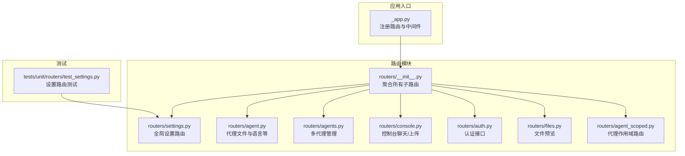
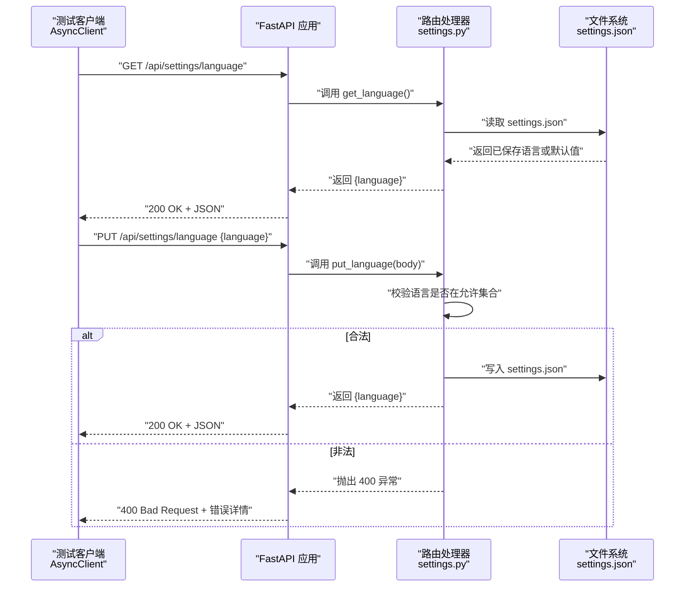
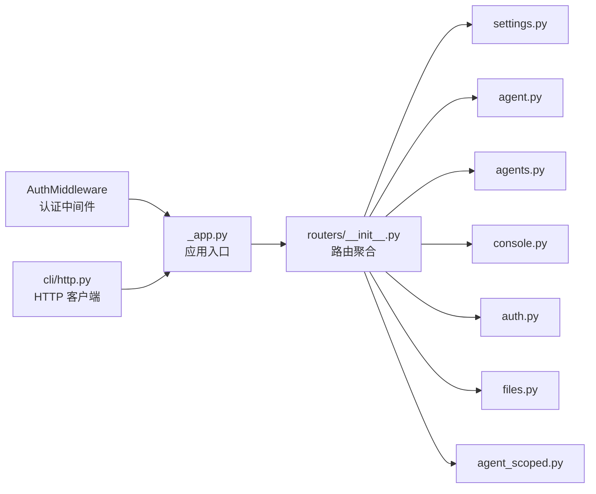

# 路由测试

<cite>
**本文引用的文件**
- [src/qwenpaw/app/routers/settings.py](file://src/qwenpaw/app/routers/settings.py)
- [tests/unit/routers/test_settings.py](file://tests/unit/routers/test_settings.py)
- [src/qwenpaw/app/routers/__init__.py](file://src/qwenpaw/app/routers/__init__.py)
- [src/qwenpaw/app/routers/agent.py](file://src/qwenpaw/app/routers/agent.py)
- [src/qwenpaw/app/routers/agents.py](file://src/qwenpaw/app/routers/agents.py)
- [src/qwenpaw/app/routers/console.py](file://src/qwenpaw/app/routers/console.py)
- [src/qwenpaw/app/routers/auth.py](file://src/qwenpaw/app/routers/auth.py)
- [src/qwenpaw/app/routers/files.py](file://src/qwenpaw/app/routers/files.py)
- [src/qwenpaw/app/routers/agent_scoped.py](file://src/qwenpaw/app/routers/agent_scoped.py)
- [src/qwenpaw/app/_app.py](file://src/qwenpaw/app/_app.py)
- [src/qwenpaw/app/auth.py](file://src/qwenpaw/app/auth.py)
- [src/qwenpaw/cli/http.py](file://src/qwenpaw/cli/http.py)
</cite>

## 目录
1. [简介](#简介)
2. [项目结构](#项目结构)
3. [核心组件](#核心组件)
4. [架构总览](#架构总览)
5. [详细组件分析](#详细组件分析)
6. [依赖分析](#依赖分析)
7. [性能考虑](#性能考虑)
8. [故障排查指南](#故障排查指南)
9. [结论](#结论)
10. [附录](#附录)

## 简介
本文件面向 QwenPaw 路由层的单元测试，系统化阐述如何为路由层编写与维护高质量的单元测试，覆盖以下关键目标：
- 设置路由测试环境：包括应用实例、ASGI 客户端、临时配置与文件隔离。
- 测试 HTTP 请求处理：验证 GET/PUT 等方法在不同路径下的行为。
- 参数验证测试：覆盖合法/非法输入、缺失字段、空值等边界条件。
- 响应格式测试：断言状态码与 JSON 结构一致性。
- 模拟 HTTP 请求与 API 版本兼容性：通过 ASGI 客户端与参数化策略确保接口稳定性。

本指南以全局设置路由（语言）为例，扩展到多类路由场景，并提供可直接参考的测试用例路径与图示。

## 项目结构
路由层位于后端服务的 API 层，采用 FastAPI 组织各子路由模块，并在应用入口统一挂载。单元测试集中于 tests/unit/routers 下，按路由模块划分文件，便于定位与维护。

图表来源
- [src/qwenpaw/app/_app.py:558-568](file://src/qwenpaw/app/_app.py#L558-L568)
- [src/qwenpaw/app/routers/__init__.py:25-46](file://src/qwenpaw/app/routers/__init__.py#L25-L46)
- [src/qwenpaw/app/routers/settings.py:15-59](file://src/qwenpaw/app/routers/settings.py#L15-L59)
- [tests/unit/routers/test_settings.py:16-33](file://tests/unit/routers/test_settings.py#L16-L33)

章节来源
- [src/qwenpaw/app/routers/__init__.py:25-46](file://src/qwenpaw/app/routers/__init__.py#L25-L46)
- [src/qwenpaw/app/routers/settings.py:15-59](file://src/qwenpaw/app/routers/settings.py#L15-L59)
- [tests/unit/routers/test_settings.py:16-33](file://tests/unit/routers/test_settings.py#L16-L33)

## 核心组件
- 全局设置路由（语言）
  - 提供 GET /api/settings/language 与 PUT /api/settings/language 接口，支持默认值、持久化与参数校验。
  - 使用工作目录下的 settings.json 文件进行读写，支持多种语言枚举。
- 多代理管理路由
  - 提供列表、创建、更新、删除、启用/禁用、文件读写等完整 RESTful 能力。
- 控制台路由
  - 支持聊天流式输出、停止会话、文件上传等。
- 认证路由
  - 登录、注册、状态查询、令牌校验与更新资料。
- 文件路由
  - 预览任意文件（受路径安全限制）。
- 代理作用域路由
  - 通过中间件注入 agentId，实现对特定代理的资源访问隔离。
- 应用入口与 SPA 回退
  - 在 API 路由之后注册回退路由，避免前端路由冲突。

章节来源
- [src/qwenpaw/app/routers/settings.py:39-59](file://src/qwenpaw/app/routers/settings.py#L39-L59)
- [src/qwenpaw/app/routers/agents.py:152-387](file://src/qwenpaw/app/routers/agents.py#L152-L387)
- [src/qwenpaw/app/routers/console.py:68-216](file://src/qwenpaw/app/routers/console.py#L68-L216)
- [src/qwenpaw/app/routers/auth.py:41-174](file://src/qwenpaw/app/routers/auth.py#L41-L174)
- [src/qwenpaw/app/routers/files.py:9-24](file://src/qwenpaw/app/routers/files.py#L9-L24)
- [src/qwenpaw/app/routers/agent_scoped.py:53-92](file://src/qwenpaw/app/routers/agent_scoped.py#L53-L92)
- [src/qwenpaw/app/_app.py:558-568](file://src/qwenpaw/app/_app.py#L558-L568)

## 架构总览
下图展示了路由层与测试客户端之间的交互关系，以及关键的错误处理与参数校验流程。

图表来源
- [tests/unit/routers/test_settings.py:38-137](file://tests/unit/routers/test_settings.py#L38-L137)
- [src/qwenpaw/app/routers/settings.py:39-59](file://src/qwenpaw/app/routers/settings.py#L39-L59)

章节来源
- [tests/unit/routers/test_settings.py:38-137](file://tests/unit/routers/test_settings.py#L38-L137)
- [src/qwenpaw/app/routers/settings.py:39-59](file://src/qwenpaw/app/routers/settings.py#L39-L59)

## 详细组件分析

### 全局设置路由（语言）测试
- 测试要点
  - 默认语言返回：当未存在设置文件时，返回默认语言。
  - 持久化语言读取：从 settings.json 中读取已保存的语言值。
  - PUT 有效语言：接受合法语言并持久化。
  - PUT 非法语言：拒绝无效语言并返回 400。
  - PUT 缺失键/空值：拒绝缺少键或空字符串。
  - PUT 后 GET 一致性：PUT 成功后再次 GET 返回最新值。
  - 保留其他设置：仅更新 language 字段，不覆盖其他键。
- 测试实现模式
  - 使用临时目录隔离 settings.json，避免污染真实环境。
  - 通过 ASGI 传输与异步客户端发起请求，断言状态码与响应体。
  - 使用参数化测试覆盖多种语言值。
- 参考测试用例路径
  - [tests/unit/routers/test_settings.py:38-137](file://tests/unit/routers/test_settings.py#L38-L137)

章节来源
- [tests/unit/routers/test_settings.py:38-137](file://tests/unit/routers/test_settings.py#L38-L137)
- [src/qwenpaw/app/routers/settings.py:39-59](file://src/qwenpaw/app/routers/settings.py#L39-L59)

### 多代理管理路由（RESTful 端点）
- 测试要点
  - 列表与排序：验证返回顺序遵循持久化顺序，缺失项自动补齐。
  - 创建代理：生成唯一 ID、初始化工作区、复制模板文件。
  - 更新代理：部分字段更新并触发热重载。
  - 删除代理：禁止删除默认代理；清理配置与顺序。
  - 启用/禁用：切换状态并处理启动失败场景。
  - 文件读写：代理工作区与内存目录的文件 CRUD。
- 实现要点
  - 使用 Pydantic 模型进行请求/响应建模与校验。
  - 对外部依赖（如技能池、工作区）进行桩函数替换。
- 参考实现路径
  - [src/qwenpaw/app/routers/agents.py:152-387](file://src/qwenpaw/app/routers/agents.py#L152-L387)
  - [src/qwenpaw/app/routers/agent.py:38-178](file://src/qwenpaw/app/routers/agent.py#L38-L178)

章节来源
- [src/qwenpaw/app/routers/agents.py:152-387](file://src/qwenpaw/app/routers/agents.py#L152-L387)
- [src/qwenpaw/app/routers/agent.py:38-178](file://src/qwenpaw/app/routers/agent.py#L38-L178)

### 控制台路由（聊天与上传）
- 测试要点
  - 聊天流式输出：支持重连、停止、事件流格式。
  - 文件上传：大小限制、安全命名、存储路径。
  - 推送消息：按会话或全局获取待消费消息。
- 实现要点
  - 使用 SSE 流式响应，结合任务跟踪器管理生命周期。
  - 对上传文件进行安全校验与路径解析。
- 参考实现路径
  - [src/qwenpaw/app/routers/console.py:68-216](file://src/qwenpaw/app/routers/console.py#L68-L216)

章节来源
- [src/qwenpaw/app/routers/console.py:68-216](file://src/qwenpaw/app/routers/console.py#L68-L216)

### 认证路由（登录/注册/校验）
- 测试要点
  - 登录：用户名密码校验，返回令牌或 401。
  - 注册：仅允许一次注册，校验启用标志与用户存在性。
  - 状态：查询认证开关与是否存在用户。
  - 校验：校验 Bearer 令牌有效性。
  - 更新资料：当前密码校验与新凭据更新。
- 实现要点
  - 与全局认证中间件配合，区分公共/私有路径。
- 参考实现路径
  - [src/qwenpaw/app/routers/auth.py:41-174](file://src/qwenpaw/app/routers/auth.py#L41-L174)
  - [src/qwenpaw/app/auth.py:371-440](file://src/qwenpaw/app/auth.py#L371-L440)

章节来源
- [src/qwenpaw/app/routers/auth.py:41-174](file://src/qwenpaw/app/routers/auth.py#L41-L174)
- [src/qwenpaw/app/auth.py:371-440](file://src/qwenpaw/app/auth.py#L371-L440)

### 文件路由（预览）
- 测试要点
  - 预览文件：支持 HEAD/GET，绝对/相对路径解析，非文件返回 404。
- 实现要点
  - 严格路径解析与文件存在性检查。
- 参考实现路径
  - [src/qwenpaw/app/routers/files.py:9-24](file://src/qwenpaw/app/routers/files.py#L9-L24)

章节来源
- [src/qwenpaw/app/routers/files.py:9-24](file://src/qwenpaw/app/routers/files.py#L9-L24)

### 代理作用域路由（上下文注入）
- 测试要点
  - 中间件优先级：路径 > 头部 X-Agent-Id，注入 request.state.agent_id。
  - 子路由继承：在 /agents/{agentId}/ 下挂载多个子路由。
- 实现要点
  - 通过中间件将 agentId 注入上下文，下游 API 可据此访问正确代理。
- 参考实现路径
  - [src/qwenpaw/app/routers/agent_scoped.py:15-92](file://src/qwenpaw/app/routers/agent_scoped.py#L15-L92)

章节来源
- [src/qwenpaw/app/routers/agent_scoped.py:15-92](file://src/qwenpaw/app/routers/agent_scoped.py#L15-L92)

## 依赖分析
- 路由聚合
  - 应用入口通过 routers/__init__.py 将各子路由挂载至根路由，形成统一的 /api 命名空间。
- 中间件与认证
  - 全局认证中间件根据路径白名单与本地回环地址决定是否跳过鉴权。
- SPA 回退
  - 在所有 API 路由之后注册回退路由，避免前端路由冲突。
- CLI 与 HTTP 客户端
  - CLI 提供统一的 HTTP 客户端封装，自动拼接 /api 前缀，便于集成测试与手动调试。

图表来源
- [src/qwenpaw/app/routers/__init__.py:25-46](file://src/qwenpaw/app/routers/__init__.py#L25-L46)
- [src/qwenpaw/app/_app.py:558-568](file://src/qwenpaw/app/_app.py#L558-L568)
- [src/qwenpaw/app/auth.py:371-440](file://src/qwenpaw/app/auth.py#L371-L440)
- [src/qwenpaw/cli/http.py:14-21](file://src/qwenpaw/cli/http.py#L14-L21)

章节来源
- [src/qwenpaw/app/routers/__init__.py:25-46](file://src/qwenpaw/app/routers/__init__.py#L25-L46)
- [src/qwenpaw/app/_app.py:558-568](file://src/qwenpaw/app/_app.py#L558-L568)
- [src/qwenpaw/app/auth.py:371-440](file://src/qwenpaw/app/auth.py#L371-L440)
- [src/qwenpaw/cli/http.py:14-21](file://src/qwenpaw/cli/http.py#L14-L21)

## 性能考虑
- 测试并发与超时
  - 使用异步客户端发起并发请求，避免阻塞；合理设置超时时间，防止测试执行时间过长。
- 文件操作与 I/O
  - 对文件读写与工作区初始化进行桩函数替换，减少磁盘 I/O 对测试的影响。
- 流式响应
  - 对 SSE/流式响应的测试应关注事件序列完整性与异常恢复，避免资源泄漏。

## 故障排查指南
- 常见问题
  - 400 参数错误：检查请求体字段是否包含必需键、值是否在允许集合内。
  - 401 未认证：确认令牌格式与有效期，或是否命中本地回环豁免。
  - 404 资源不存在：检查路径参数与文件系统路径解析逻辑。
  - 500 内部错误：关注异常捕获与错误信息返回，必要时开启日志。
- 排查步骤
  - 使用 CLI HTTP 客户端快速复现问题。
  - 在测试中打印请求与响应细节，定位参数与响应差异。
  - 对外部依赖（如工作区、技能池）进行桩替换，隔离问题范围。

章节来源
- [src/qwenpaw/app/routers/settings.py:49-54](file://src/qwenpaw/app/routers/settings.py#L49-L54)
- [src/qwenpaw/app/auth.py:371-440](file://src/qwenpaw/app/auth.py#L371-L440)
- [src/qwenpaw/cli/http.py:14-21](file://src/qwenpaw/cli/http.py#L14-L21)

## 结论
通过对路由层的系统化测试设计，可以有效保障 RESTful 接口的正确性、健壮性与可维护性。建议在新增路由时同步补充单元测试，采用参数化与桩函数策略提升测试覆盖率，并结合 CLI 工具与 ASGI 客户端构建端到端验证链路。

## 附录
- 快速开始：为新路由添加单元测试
  - 在 tests/unit/routers 下新建对应模块文件，使用 ASGI 传输与异步客户端发起请求。
  - 使用临时目录隔离持久化文件，确保测试互不干扰。
  - 对关键分支（合法/非法输入、缺失键、异常场景）编写断言。
- API 版本兼容性建议
  - 保持路径前缀稳定（如 /api），通过查询参数或请求体字段承载版本信息。
  - 对废弃字段与错误码进行明确标注，逐步迁移而非一次性变更。