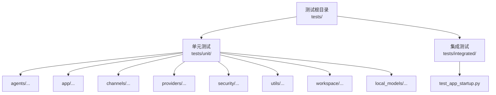
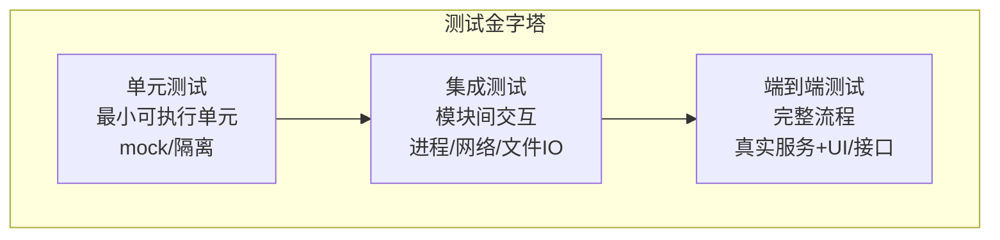
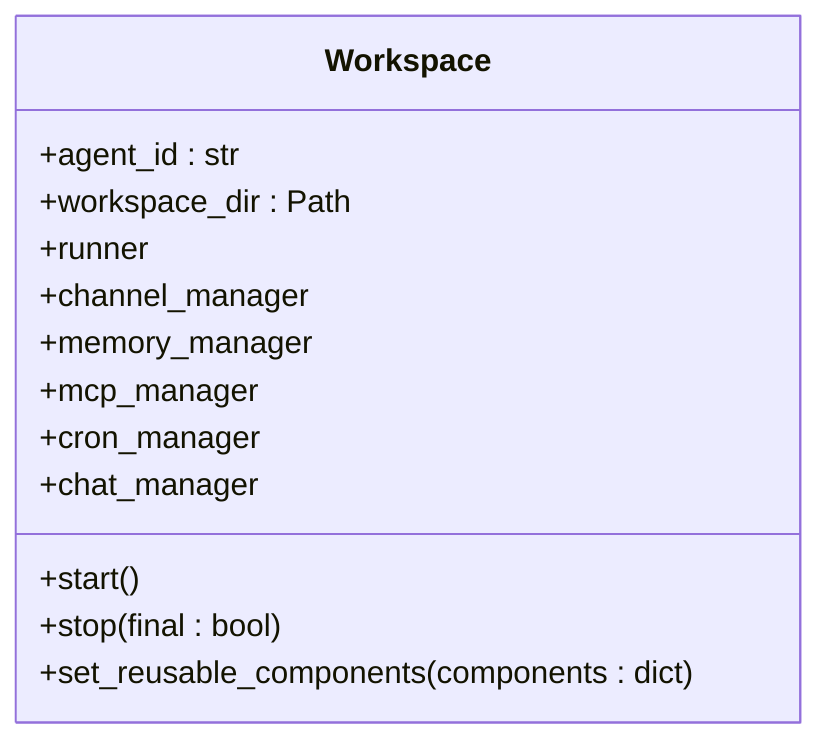
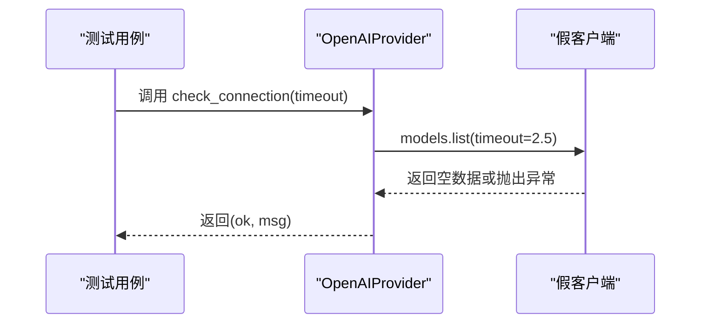
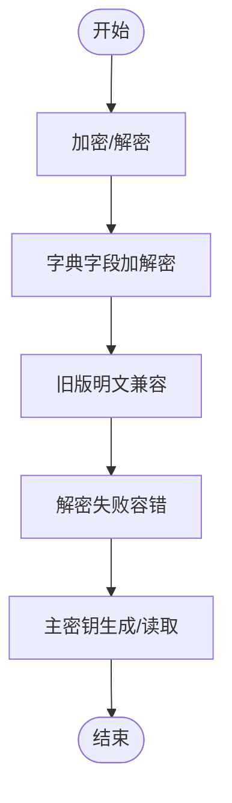
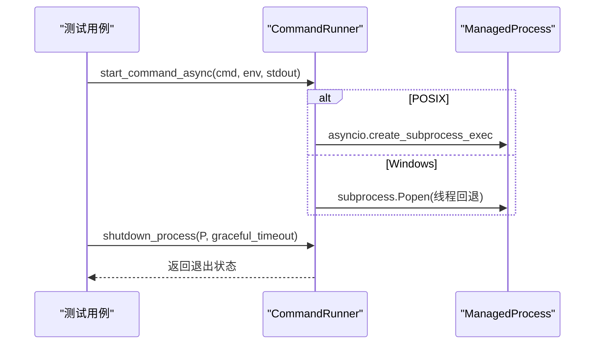
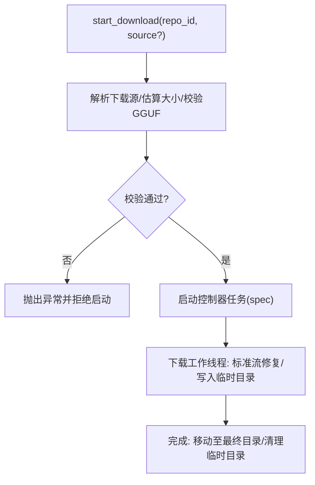
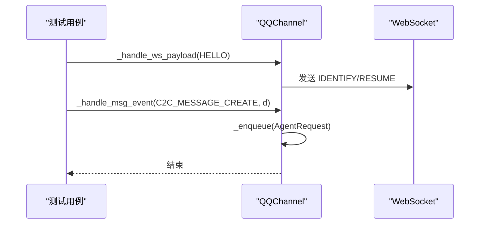
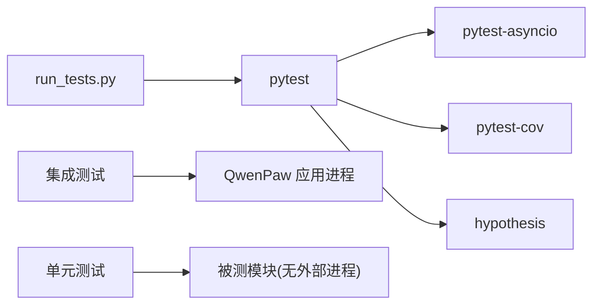

# 测试文档

<cite>
**本文引用的文件**
- [pyproject.toml](file://pyproject.toml)
- [scripts/run_tests.py](file://scripts/run_tests.py)
- [tests/integrated/test_app_startup.py](file://tests/integrated/test_app_startup.py)
- [tests/unit/workspace/test_workspace.py](file://tests/unit/workspace/test_workspace.py)
- [tests/unit/providers/test_openai_provider.py](file://tests/unit/providers/test_openai_provider.py)
- [tests/unit/security/test_secret_store.py](file://tests/unit/security/test_secret_store.py)
- [tests/unit/utils/test_command_runner.py](file://tests/unit/utils/test_command_runner.py)
- [tests/unit/local_models/test_model_manager.py](file://tests/unit/local_models/test_model_manager.py)
- [tests/unit/channels/test_qq_channel.py](file://tests/unit/channels/test_qq_channel.py)
- [src/qwenpaw/app/workspace/workspace.py](file://src/qwenpaw/app/workspace/workspace.py)
- [src/qwenpaw/security/__init__.py](file://src/qwenpaw/security/__init__.py)
- [src/qwenpaw/agents/tools/file_search.py](file://src/qwenpaw/agents/tools/file_search.py)
- [CONTRIBUTING.md](file://CONTRIBUTING.md)
</cite>

## 目录
1. [引言](#引言)
2. [项目结构](#项目结构)
3. [核心组件](#核心组件)
4. [架构总览](#架构总览)
5. [详细组件分析](#详细组件分析)
6. [依赖分析](#依赖分析)
7. [性能考虑](#性能考虑)
8. [故障排查指南](#故障排查指南)
9. [结论](#结论)
10. [附录](#附录)

## 引言
本测试文档面向 QwenPaw 的测试体系与实践，围绕测试金字塔（单元测试、集成测试、端到端测试）进行系统化梳理，明确测试策略、框架选择与配置、关键功能测试设计、边界与错误场景覆盖、回归与持续集成、性能与压力测试、测试数据管理、覆盖率与质量指标、以及测试调试与自动化最佳实践。目标是帮助开发者与测试工程师高效落地高质量测试，保障平台在多渠道、多模型、多技能场景下的稳定性与安全性。

## 项目结构
QwenPaw 的测试目录采用分层组织：
- tests/unit：按模块/子系统划分的单元测试，覆盖工具、通道、模型提供方、本地模型、工作区、安全等。
- tests/integrated：端到端/集成测试，如应用启动与控制台可用性验证。

测试运行器脚本提供统一入口，支持并行、覆盖率生成与子目录粒度运行。

图示来源
- [tests/integrated/test_app_startup.py:1-133](file://tests/integrated/test_app_startup.py#L1-L133)
- [tests/unit/workspace/test_workspace.py:1-97](file://tests/unit/workspace/test_workspace.py#L1-L97)

章节来源
- [pyproject.toml:105-111](file://pyproject.toml#L105-L111)
- [scripts/run_tests.py:1-282](file://scripts/run_tests.py#L1-L282)

## 核心组件
- 测试框架与配置
  - 使用 pytest，启用 asyncio 自动模式与函数级默认作用域标记，支持慢速测试标记。
  - 开发依赖包含 pytest、pytest-asyncio、pytest-cov、hypothesis 等，满足异步、覆盖率与属性测试需求。
- 测试运行器
  - scripts/run_tests.py 提供统一入口，支持运行单元/集成/全部测试、覆盖率报告、并行执行（需 pytest-xdist）。
- 覆盖率与质量
  - 覆盖率目标：以模块为单位，确保关键路径与异常分支被覆盖；结合 CI 做阈值约束与报告输出。

章节来源
- [pyproject.toml:75-111](file://pyproject.toml#L75-L111)
- [scripts/run_tests.py:148-173](file://scripts/run_tests.py#L148-L173)

## 架构总览
测试架构遵循金字塔分层，自底向上逐步扩大覆盖面与真实度：

章节来源
- [tests/integrated/test_app_startup.py:33-133](file://tests/integrated/test_app_startup.py#L33-L133)
- [scripts/run_tests.py:76-146](file://scripts/run_tests.py#L76-L146)

## 详细组件分析

### 工作区（Workspace）测试
- 测试要点
  - 实例创建与初始化参数校验、目录存在性、初始状态（未启动）。
  - 启动前组件为空（runner、channel_manager、memory_manager、mcp_manager、cron_manager、chat_manager）。
  - 特殊 agent ID（default、短UUID）行为验证。
  - 字符串表示与状态展示。
- 设计思路
  - 使用临时目录隔离，避免磁盘污染；断言对象属性与状态字符串。
  - 验证异步生命周期（start/stop）前后状态一致性。

图示来源
- [src/qwenpaw/app/workspace/workspace.py:47-389](file://src/qwenpaw/app/workspace/workspace.py#L47-L389)

章节来源
- [tests/unit/workspace/test_workspace.py:8-97](file://tests/unit/workspace/test_workspace.py#L8-L97)
- [src/qwenpaw/app/workspace/workspace.py:60-130](file://src/qwenpaw/app/workspace/workspace.py#L60-L130)

### 提供方（Provider）测试（以 OpenAI 为例）
- 测试要点
  - 连接检查：成功/失败路径、超时参数传递。
  - 模型列表拉取：去重与规范化、异常处理。
  - 单模型连接检查：参数构造（timeout、max_tokens、stream）。
  - 配置更新：非空字段更新、chat_model 冻结规则、自定义提供方允许变更。
- 设计思路
  - 使用 monkeypatch 注入假客户端与异常，覆盖正常/异常分支。
  - 断言外部调用参数与返回值，确保行为符合预期。

图示来源
- [tests/unit/providers/test_openai_provider.py:21-55](file://tests/unit/providers/test_openai_provider.py#L21-L55)

章节来源
- [tests/unit/providers/test_openai_provider.py:21-269](file://tests/unit/providers/test_openai_provider.py#L21-L269)

### 安全模块（Secret Store）测试
- 测试要点
  - 加密/解密往返、空值透传、Unicode 支持。
  - 字典字段批量加解密、空字段不加密、兼容旧明文。
  - 解密失败容错：损坏密文回退原始值。
  - 主密钥生成与读取（文件/系统钥匙串后备）。
- 设计思路
  - 通过 fixture 注入确定性主密钥与隔离密钥目录，保证可重复性。
  - 对异常输入与边界条件进行健壮性验证。

图示来源
- [tests/unit/security/test_secret_store.py:36-176](file://tests/unit/security/test_secret_store.py#L36-L176)
- [src/qwenpaw/security/__init__.py:1-21](file://src/qwenpaw/security/__init__.py#L1-L21)

章节来源
- [tests/unit/security/test_secret_store.py:1-176](file://tests/unit/security/test_secret_store.py#L1-L176)
- [src/qwenpaw/security/__init__.py:1-21](file://src/qwenpaw/security/__init__.py#L1-L21)

### 工具与命令运行（Command Runner）测试
- 测试要点
  - 同步命令执行：组合 stdout/stderr、非零退出码异常、缺失可执行文件。
  - 异步命令启动：跨平台差异（Windows 回退线程 Popen）、进程生命周期管理。
  - 进程关闭：优雅终止与强制杀死、进程组信号（POSIX）。
  - PID 可达性检测：Windows 使用任务列表、POSIX 使用信号探测。
- 设计思路
  - 使用 monkeypatch 替换 subprocess/asyncio/os 行为，模拟不同平台与异常路径。
  - 验证 ManagedProcess 生命周期与返回结果。

图示来源
- [tests/unit/utils/test_command_runner.py:113-273](file://tests/unit/utils/test_command_runner.py#L113-L273)

章节来源
- [tests/unit/utils/test_command_runner.py:1-600](file://tests/unit/utils/test_command_runner.py#L1-L600)

### 本地模型下载（Model Manager）测试
- 测试要点
  - 下载源解析与显式源优先策略、大小估算、GGUF 文件存在性校验。
  - 进度查询默认状态、取消下载委托控制器、最终落盘移动。
  - 列表与删除：仓库布局、临时目录忽略、标准流修复。
- 设计思路
  - 使用假控制器与临时目录，断言命令参数、进度快照与文件落盘。
  - 验证异常路径（无 GGUF 文件）与标准流异常修复逻辑。

图示来源
- [tests/unit/local_models/test_model_manager.py:49-371](file://tests/unit/local_models/test_model_manager.py#L49-L371)

章节来源
- [tests/unit/local_models/test_model_manager.py:1-414](file://tests/unit/local_models/test_model_manager.py#L1-L414)

### 渠道（Channel）测试（以 QQ 为例）
- 测试要点
  - 文本清洗、布尔转换、Markdown 回退策略、消息序列号递增。
  - WebSocket 状态机：心跳控制器、重连延迟、快速断开限流、会话恢复。
  - 消息事件解析：C2C/Guild/Group 等类型元信息提取、空内容/前缀过滤。
  - 发送路径解析、附件类型推断、图片标签抽取与独立发送。
  - 发送文本回退：Markdown 校验错误自动降级为纯文本。
- 设计思路
  - 使用 MagicMock/AsyncMock 构造依赖，覆盖协议常量与内部状态变化。
  - 针对网络错误、速率限制、无效会话等异常路径进行断言。

图示来源
- [tests/unit/channels/test_qq_channel.py:316-450](file://tests/unit/channels/test_qq_channel.py#L316-L450)

章节来源
- [tests/unit/channels/test_qq_channel.py:1-800](file://tests/unit/channels/test_qq_channel.py#L1-L800)

### 工具函数（文件搜索）边界与错误场景
- 测试要点
  - 路径解析与权限：不存在/非目录返回错误响应。
  - 正则表达式：非法正则抛出错误提示。
  - 超时与截断：grep/glob 超时、匹配数/输出大小上限、文件扫描上限。
  - 二进制与大文件跳过、目录黑名单过滤。
- 设计思路
  - 通过同步 worker 在线程池中执行 IO 与正则扫描，配合取消事件与滑动窗口输出。
  - 断言状态字符串与截断提示，确保用户可感知的边界行为。

章节来源
- [src/qwenpaw/agents/tools/file_search.py:274-629](file://src/qwenpaw/agents/tools/file_search.py#L274-L629)

## 依赖分析
- 测试框架与插件
  - pytest、pytest-asyncio、pytest-cov、hypothesis。
- 运行器与并行
  - run_tests.py 通过子进程调用 pytest，并支持并行（pytest-xdist）与覆盖率报告。
- 关键依赖与耦合
  - 单元测试高度隔离，依赖注入与 monkeypatch 降低耦合。
  - 集成测试依赖外部进程与网络（如应用启动、HTTP 接口），耦合度较高但更贴近真实。

图示来源
- [pyproject.toml:75-111](file://pyproject.toml#L75-L111)
- [scripts/run_tests.py:148-173](file://scripts/run_tests.py#L148-L173)
- [tests/integrated/test_app_startup.py:33-133](file://tests/integrated/test_app_startup.py#L33-L133)

章节来源
- [pyproject.toml:75-111](file://pyproject.toml#L75-L111)
- [scripts/run_tests.py:148-173](file://scripts/run_tests.py#L148-L173)
- [tests/integrated/test_app_startup.py:33-133](file://tests/integrated/test_app_startup.py#L33-L133)

## 性能考虑
- 单元测试
  - 优先使用内存替身与同步断言，避免 IO 与网络开销；对耗时逻辑（如文件扫描）设置合理超时与上限。
- 集成测试
  - 控制并发与资源占用，避免多个进程同时启动造成资源争用；必要时拆分套件或使用并行标记。
- 覆盖率
  - 以模块为单位设定阈值，关注热点路径与异常分支；对高风险模块（安全、通道、下载）提高覆盖率要求。
- 压力测试建议
  - 针对文件搜索、模型下载、通道消息吞吐等场景，设计批量与并发脚本，结合日志与指标监控评估瓶颈。

## 故障排查指南
- 常见问题
  - 依赖缺失导致 ImportError/ModuleNotFoundError：集成测试会捕获并输出日志，便于定位。
  - 进程提前退出：检查启动参数、端口占用与依赖安装。
  - 平台差异：Windows 回退线程 Popen，POSIX 使用进程组信号；注意信号与权限差异。
  - 密钥/密文异常：确认主密钥生成与读取、损坏密文回退策略。
- 调试技巧
  - 使用 pytest 的 -s/-v/-k 等选项增强输出与筛选。
  - 在 run_tests.py 中开启并行与覆盖率，结合 html 报告定位热点。
  - 对异步代码使用 asyncio.run/capture_exceptions，确保异常栈可见。

章节来源
- [tests/integrated/test_app_startup.py:73-104](file://tests/integrated/test_app_startup.py#L73-L104)
- [tests/unit/utils/test_command_runner.py:564-600](file://tests/unit/utils/test_command_runner.py#L564-L600)
- [tests/unit/security/test_secret_store.py:114-139](file://tests/unit/security/test_secret_store.py#L114-L139)

## 结论
QwenPaw 的测试体系以 pytest 为核心，通过单元测试打地基、集成测试验证真实交互、端到端测试保障整体可用性，辅以覆盖率与质量指标，形成完整的质量闭环。针对代理管理、渠道集成、技能系统与安全模块的关键路径与边界条件均提供了系统化的测试覆盖。建议在 CI 中固定覆盖率阈值与慢测试标记，持续优化测试执行效率与稳定性。

## 附录

### 测试策略与金字塔结构
- 单元测试（优先）
  - 覆盖核心算法、边界条件、异常路径；使用 mock 与隔离。
- 集成测试（中层）
  - 覆盖模块间协作、外部进程/网络/文件系统；控制并发与资源。
- 端到端测试（顶层）
  - 覆盖真实启动流程、控制台可用性、关键业务链路。

章节来源
- [tests/integrated/test_app_startup.py:33-133](file://tests/integrated/test_app_startup.py#L33-L133)

### 测试框架与配置
- pytest 配置
  - asyncio_mode: auto
  - asyncio_default_fixture_loop_scope: function
  - 标记：slow
- 开发依赖
  - pytest、pytest-asyncio、pytest-cov、hypothesis

章节来源
- [pyproject.toml:105-111](file://pyproject.toml#L105-L111)

### 测试运行器与 CI 集成
- 运行器能力
  - 子目录粒度运行、并行执行、覆盖率报告、帮助信息。
- CI 建议
  - 安装开发依赖后执行 run_tests.py；在 PR 中固定覆盖率阈值与慢测试排除；对关键模块增加并行度。

章节来源
- [scripts/run_tests.py:175-282](file://scripts/run_tests.py#L175-L282)
- [CONTRIBUTING.md:68-86](file://CONTRIBUTING.md#L68-L86)

### 核心功能测试清单
- 代理管理
  - Workspace 创建、启动/停止、组件状态、repr 展示。
- 渠道集成
  - 文本清洗、事件解析、发送路径、回退策略、重连与限流。
- 技能系统
  - 工具函数（文件搜索）：路径解析、正则、超时与截断、二进制/大文件过滤。
- 安全模块
  - 加密/解密、字典字段批量处理、兼容旧明文、主密钥生成与读取、解密失败容错。

章节来源
- [tests/unit/workspace/test_workspace.py:8-97](file://tests/unit/workspace/test_workspace.py#L8-L97)
- [tests/unit/channels/test_qq_channel.py:1-800](file://tests/unit/channels/test_qq_channel.py#L1-L800)
- [src/qwenpaw/agents/tools/file_search.py:274-629](file://src/qwenpaw/agents/tools/file_search.py#L274-L629)
- [tests/unit/security/test_secret_store.py:1-176](file://tests/unit/security/test_secret_store.py#L1-L176)

### 边界条件与错误场景
- 文件搜索
  - 不存在路径、非目录、非法正则、超时、匹配/输出/文件数上限。
- 命令运行
  - 缺失可执行文件、非零退出码、Windows 回退、PID 可达性检测。
- 下载管理
  - 无 GGUF 文件、标准流异常修复、临时目录忽略。
- 通道
  - 无效会话、速率限制、Markdown 校验错误回退。

章节来源
- [src/qwenpaw/agents/tools/file_search.py:505-576](file://src/qwenpaw/agents/tools/file_search.py#L505-L576)
- [tests/unit/utils/test_command_runner.py:564-600](file://tests/unit/utils/test_command_runner.py#L564-L600)
- [tests/unit/local_models/test_model_manager.py:155-197](file://tests/unit/local_models/test_model_manager.py#L155-L197)
- [tests/unit/channels/test_qq_channel.py:117-145](file://tests/unit/channels/test_qq_channel.py#L117-L145)

### 回归测试与持续集成
- 回归测试
  - 将历史缺陷对应的用例纳入单元/集成套件，确保修复不复现。
- CI 配置
  - 安装开发依赖、运行 run_tests.py、生成覆盖率报告、失败即停。

章节来源
- [CONTRIBUTING.md:68-86](file://CONTRIBUTING.md#L68-L86)
- [scripts/run_tests.py:221-228](file://scripts/run_tests.py#L221-L228)

### 性能与压力测试
- 建议场景
  - 大规模文件扫描、并发通道消息、多模型下载队列、长文本处理。
- 执行流程
  - 设定负载参数与时间窗口，采集 CPU/内存/网络指标，结合日志分析瓶颈。

[本节为通用指导，无需特定文件引用]

### 测试数据准备与管理
- 临时目录与隔离
  - 使用临时目录作为工作区与模型下载目录，避免持久化污染。
- 密钥与敏感数据
  - 通过 fixture 注入确定性主密钥与隔离密钥目录，确保可重复性与安全性。
- 数据一致性
  - 对字典字段批量加解密，确保明文与密文混合场景的一致性。

章节来源
- [tests/unit/security/test_secret_store.py:22-34](file://tests/unit/security/test_secret_store.py#L22-L34)
- [tests/unit/local_models/test_model_manager.py:50-113](file://tests/unit/local_models/test_model_manager.py#L50-L113)

### 覆盖率要求与质量指标
- 覆盖率
  - 以模块为单位设定阈值，重点关注高风险模块（安全、通道、下载、工具）。
- 质量指标
  - 失败用例数、慢测试占比、覆盖率报告、CI 成功率。

章节来源
- [pyproject.toml:75-82](file://pyproject.toml#L75-L82)
- [scripts/run_tests.py:156-163](file://scripts/run_tests.py#L156-L163)

### 测试调试与问题定位
- 调试方法
  - 使用 -s/-v/-k 精确定位；对异步代码捕获异常栈；在 run_tests.py 中启用并行与覆盖率。
- 问题定位
  - 集成测试捕获进程日志与最后错误；通道测试关注协议常量与状态机；安全模块关注密钥与密文。

章节来源
- [tests/integrated/test_app_startup.py:73-104](file://tests/integrated/test_app_startup.py#L73-L104)
- [tests/unit/channels/test_qq_channel.py:240-310](file://tests/unit/channels/test_qq_channel.py#L240-L310)
- [tests/unit/security/test_secret_store.py:114-139](file://tests/unit/security/test_secret_store.py#L114-L139)

### 测试自动化与 CI/CD 最佳实践
- 自动化
  - run_tests.py 统一入口，支持子目录与并行；覆盖率报告便于持续改进。
- CI 最佳实践
  - 固定覆盖率阈值、慢测试排除、失败即停、并行度与资源配额平衡。

章节来源
- [scripts/run_tests.py:175-282](file://scripts/run_tests.py#L175-L282)
- [CONTRIBUTING.md:68-86](file://CONTRIBUTING.md#L68-L86)