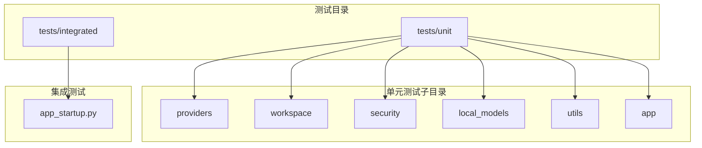
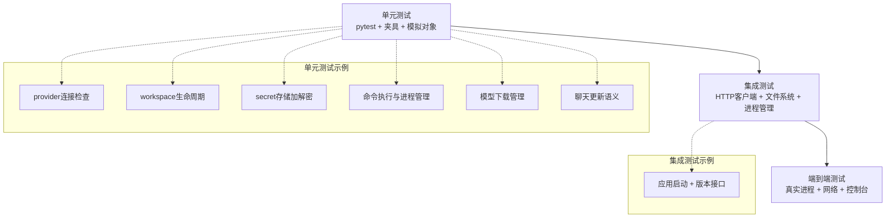
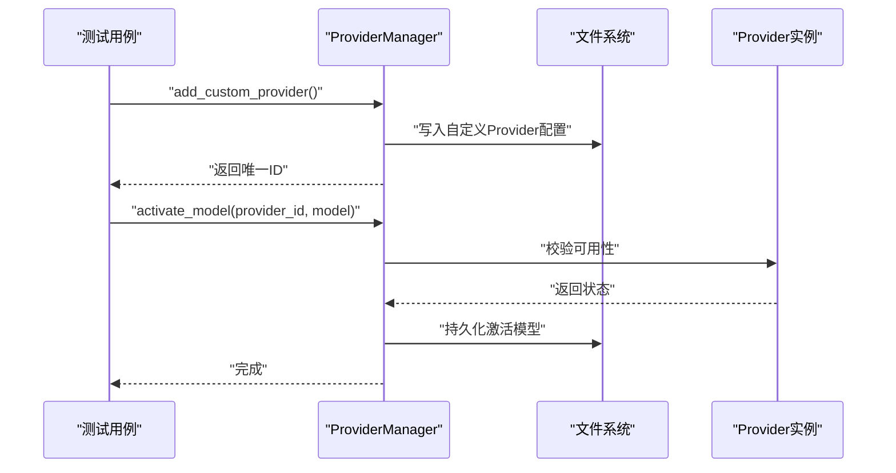
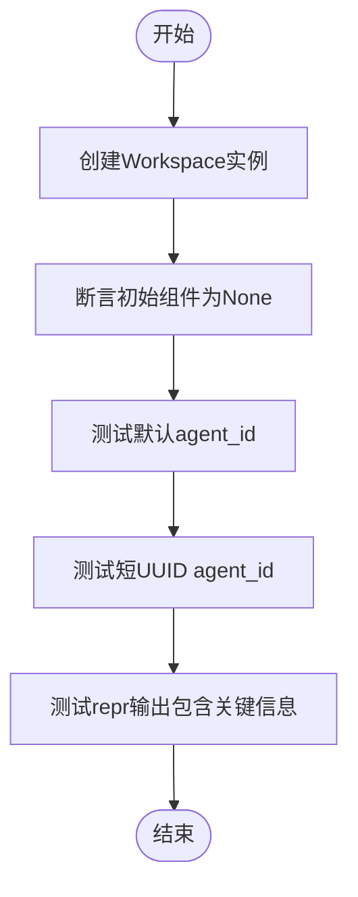
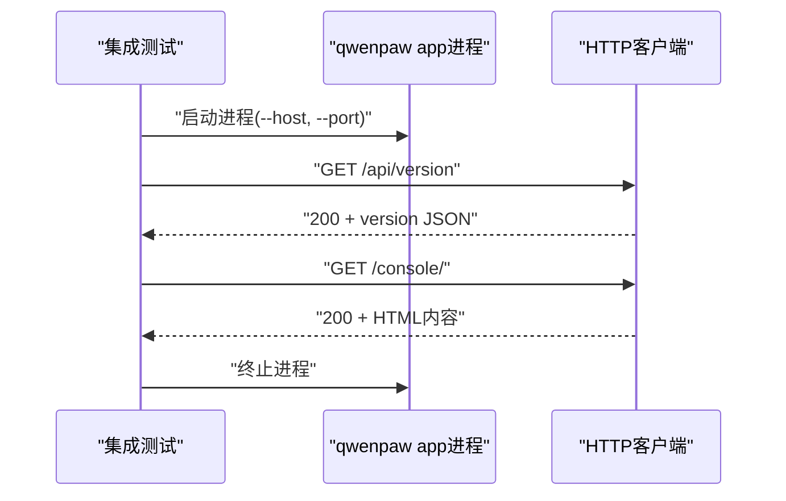
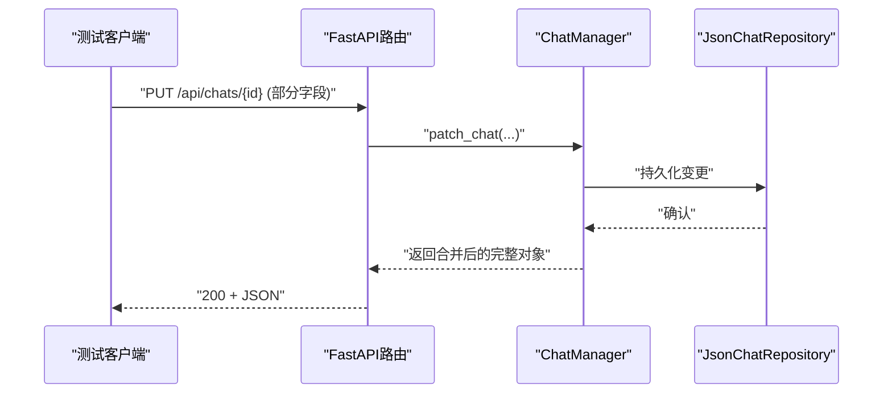
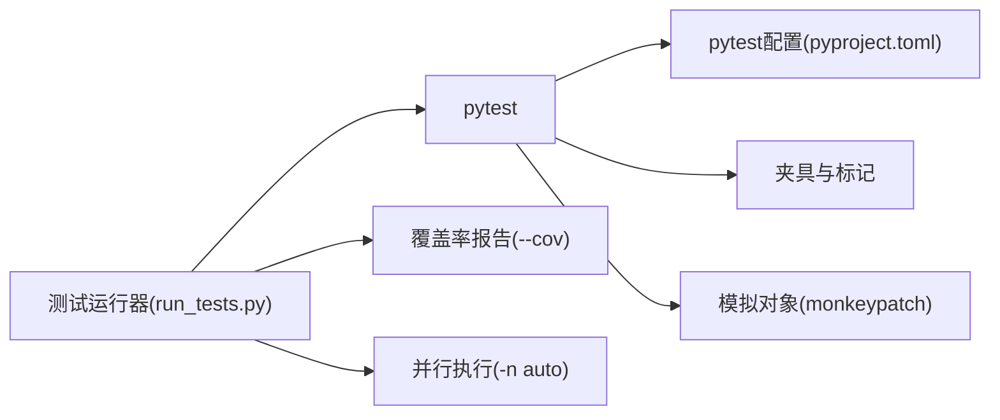

# 测试策略

<cite>
**本文引用的文件**
- [scripts/run_tests.py](file://scripts/run_tests.py)
- [pyproject.toml](file://pyproject.toml)
- [tests/unit/providers/test_openai_provider.py](file://tests/unit/providers/test_openai_provider.py)
- [tests/unit/workspace/test_workspace.py](file://tests/unit/workspace/test_workspace.py)
- [tests/integrated/test_app_startup.py](file://tests/integrated/test_app_startup.py)
- [tests/unit/utils/test_command_runner.py](file://tests/unit/utils/test_command_runner.py)
- [tests/unit/security/test_secret_store.py](file://tests/unit/security/test_secret_store.py)
- [tests/unit/providers/test_provider_manager.py](file://tests/unit/providers/test_provider_manager.py)
- [tests/unit/local_models/test_model_manager.py](file://tests/unit/local_models/test_model_manager.py)
- [tests/unit/app/test_chat_updates.py](file://tests/unit/app/test_chat_updates.py)
</cite>

## 目录
1. [引言](#引言)
2. [项目结构](#项目结构)
3. [核心组件](#核心组件)
4. [架构总览](#架构总览)
5. [详细组件分析](#详细组件分析)
6. [依赖分析](#依赖分析)
7. [性能考虑](#性能考虑)
8. [故障排查指南](#故障排查指南)
9. [结论](#结论)
10. [附录](#附录)

## 引言
本测试策略文档面向QwenPaw项目，系统化阐述测试金字塔与分层测试方法（单元测试、集成测试、端到端测试），解释pytest框架选择与配置，给出测试数据准备与隔离策略，明确覆盖率与质量指标，提供测试执行流程与持续集成建议，并说明测试分类与优先级划分方法。目标是帮助开发者在保证质量的前提下高效推进迭代。

## 项目结构
QwenPaw仓库包含Python后端代码与前端控制台，测试主要集中在tests目录下，分为unit与integrated两个层级：
- tests/unit：按功能模块组织的单元测试，覆盖provider、workspace、security、local_models、utils、app等子模块。
- tests/integrated：集成/端到端测试，如应用启动与控制台访问验证。

**图表来源**
- [tests/unit/providers/test_openai_provider.py:1-269](file://tests/unit/providers/test_openai_provider.py#L1-L269)
- [tests/unit/workspace/test_workspace.py:1-97](file://tests/unit/workspace/test_workspace.py#L1-L97)
- [tests/integrated/test_app_startup.py:1-133](file://tests/integrated/test_app_startup.py#L1-L133)

**章节来源**
- [scripts/run_tests.py:1-282](file://scripts/run_tests.py#L1-L282)
- [pyproject.toml:1-111](file://pyproject.toml#L1-L111)

## 核心组件
- 测试运行器：本地测试脚本支持按层级运行、并行执行、覆盖率报告生成。
- 测试框架：pytest，配合asyncio模式、自定义标记与夹具。
- 测试类型：
  - 单元测试：针对函数、类或小范围逻辑，强调隔离与可重复性。
  - 集成测试：跨模块协作、外部依赖（如HTTP、文件系统）交互。
  - 端到端测试：真实进程启动、网络请求、UI渲染等完整链路验证。

**章节来源**
- [scripts/run_tests.py:76-173](file://scripts/run_tests.py#L76-L173)
- [pyproject.toml:105-111](file://pyproject.toml#L105-L111)

## 架构总览
下图展示测试金字塔与各层职责、典型用例与测试工具的关系。

**图表来源**
- [tests/unit/providers/test_openai_provider.py:1-269](file://tests/unit/providers/test_openai_provider.py#L1-L269)
- [tests/unit/workspace/test_workspace.py:1-97](file://tests/unit/workspace/test_workspace.py#L1-L97)
- [tests/unit/security/test_secret_store.py:1-176](file://tests/unit/security/test_secret_store.py#L1-L176)
- [tests/unit/utils/test_command_runner.py:1-600](file://tests/unit/utils/test_command_runner.py#L1-L600)
- [tests/unit/local_models/test_model_manager.py:1-414](file://tests/unit/local_models/test_model_manager.py#L1-L414)
- [tests/unit/app/test_chat_updates.py:1-142](file://tests/unit/app/test_chat_updates.py#L1-L142)
- [tests/integrated/test_app_startup.py:1-133](file://tests/integrated/test_app_startup.py#L1-L133)

## 详细组件分析

### 单元测试：Provider与模型管理
- OpenAI Provider连接与模型列表处理：通过monkeypatch替换内部客户端，断言连接检查、错误处理、模型规范化与去重逻辑。
- ProviderManager：自定义Provider注册、持久化、冲突解决、迁移兼容、激活模型等。
- LocalModel Manager：下载源解析、进度与取消、GGUF校验、临时目录清理与最终落盘。
- 命令执行与进程管理：同步/异步命令执行、进程生命周期管理、跨平台兼容与信号处理。
- 安全与机密存储：对称加密/解密、字段级加解密、向后兼容与容错。

**图表来源**
- [tests/unit/providers/test_provider_manager.py:132-171](file://tests/unit/providers/test_provider_manager.py#L132-L171)

**章节来源**
- [tests/unit/providers/test_openai_provider.py:21-149](file://tests/unit/providers/test_openai_provider.py#L21-L149)
- [tests/unit/providers/test_provider_manager.py:132-203](file://tests/unit/providers/test_provider_manager.py#L132-L203)
- [tests/unit/local_models/test_model_manager.py:49-113](file://tests/unit/local_models/test_model_manager.py#L49-L113)
- [tests/unit/utils/test_command_runner.py:26-91](file://tests/unit/utils/test_command_runner.py#L26-L91)
- [tests/unit/security/test_secret_store.py:36-96](file://tests/unit/security/test_secret_store.py#L36-L96)

### 单元测试：Workspace与应用API
- Workspace：实例创建、组件初始化状态、默认与短ID命名规则、字符串表示。
- 聊天更新语义：部分更新合并、只读字段保护、时间戳触达不覆盖名称。

**图表来源**
- [tests/unit/workspace/test_workspace.py:8-97](file://tests/unit/workspace/test_workspace.py#L8-L97)

**章节来源**
- [tests/unit/workspace/test_workspace.py:8-97](file://tests/unit/workspace/test_workspace.py#L8-L97)
- [tests/unit/app/test_chat_updates.py:49-101](file://tests/unit/app/test_chat_updates.py#L49-L101)

### 集成测试：应用启动与控制台
- 启动后端进程，探测版本接口；随后访问控制台页面，断言HTML内容与响应头。

**图表来源**
- [tests/integrated/test_app_startup.py:33-133](file://tests/integrated/test_app_startup.py#L33-L133)

**章节来源**
- [tests/integrated/test_app_startup.py:33-133](file://tests/integrated/test_app_startup.py#L33-L133)

### 端到端测试：控制台与会话管理
- 使用FastAPI ASGI客户端与内存仓库，验证PATCH/PUT对聊天记录的部分更新、只读字段拒绝与时间戳触达行为。

**图表来源**
- [tests/unit/app/test_chat_updates.py:26-77](file://tests/unit/app/test_chat_updates.py#L26-L77)

**章节来源**
- [tests/unit/app/test_chat_updates.py:26-142](file://tests/unit/app/test_chat_updates.py#L26-L142)

## 依赖分析
- 测试运行器依赖pytest及其插件（覆盖率、并行、asyncio），通过子进程调用pytest执行不同测试路径。
- pytest配置位于pyproject中，启用asyncio模式与自定义标记，便于慢速测试筛选。
- 测试数据与隔离：
  - 使用临时目录与夹具隔离文件系统。
  - 使用monkeypatch替换外部依赖（HTTP客户端、系统调用）。
  - 使用fixture注入确定性主密钥与隔离密钥存储目录。

**图表来源**
- [scripts/run_tests.py:148-173](file://scripts/run_tests.py#L148-L173)
- [pyproject.toml:105-111](file://pyproject.toml#L105-L111)

**章节来源**
- [scripts/run_tests.py:148-173](file://scripts/run_tests.py#L148-L173)
- [pyproject.toml:105-111](file://pyproject.toml#L105-L111)
- [tests/unit/security/test_secret_store.py:22-34](file://tests/unit/security/test_secret_store.py#L22-L34)

## 性能考虑
- 并行执行：通过pytest-xdist实现多进程并行，缩短整体测试时长。
- 异步测试：使用pytest-asyncio自动模式，避免手动事件循环管理。
- 覆盖率：仅对src/qwenpaw包生成覆盖率报告，聚焦核心业务代码。
- 优化建议：
  - 将昂贵的外部依赖（网络、下载）尽量通过模拟或本地镜像替代。
  - 对I/O密集型测试（文件系统、网络）采用超时与重试策略。
  - 将慢测试标记为“slow”，CI中可按需排除。

**章节来源**
- [scripts/run_tests.py:165-166](file://scripts/run_tests.py#L165-L166)
- [pyproject.toml:108-110](file://pyproject.toml#L108-L110)

## 故障排查指南
- pytest未安装：运行器检测到pytest缺失时会提示安装开发依赖。
- 单元测试失败定位：
  - 检查夹具与临时目录是否正确清理。
  - 确认模拟对象是否覆盖了所有分支路径。
- 集成测试失败：
  - 查看进程日志与退出码，确认依赖安装与端口占用。
  - 校验HTTP超时与重试参数。
- 端到端测试失败：
  - 确认路由挂载与依赖注入是否生效。
  - 检查只读字段保护与部分更新合并逻辑。

**章节来源**
- [scripts/run_tests.py:222-227](file://scripts/run_tests.py#L222-L227)
- [tests/integrated/test_app_startup.py:73-104](file://tests/integrated/test_app_startup.py#L73-L104)

## 结论
QwenPaw的测试体系以pytest为核心，结合单元、集成与端到端三层测试，辅以覆盖率与并行执行，形成稳定高效的测试金字塔。通过夹具与模拟对象确保测试隔离与可重复性，通过明确的质量指标与CI策略保障交付质量。建议持续完善慢测试标记与覆盖率阈值，逐步扩展端到端测试覆盖面。

## 附录

### 测试金字塔与分层测试方法
- 单元测试：快速、稳定、可重复，覆盖核心算法与边界条件。
- 集成测试：验证模块间协作与外部依赖交互。
- 端到端测试：覆盖真实用户路径与关键业务闭环。

### pytest选择与配置要点
- 自动asyncio模式与夹具作用域，简化异步与资源管理。
- 自定义标记用于慢测试筛选。
- 通过命令行参数控制覆盖率与并行。

**章节来源**
- [pyproject.toml:105-111](file://pyproject.toml#L105-L111)

### 测试数据准备与隔离
- 临时目录与文件系统隔离，避免污染。
- 夹具提供确定性输入（如主密钥、随机数种子）。
- 模拟对象替换外部服务与系统调用。

**章节来源**
- [tests/unit/security/test_secret_store.py:22-34](file://tests/unit/security/test_secret_store.py#L22-L34)
- [tests/unit/utils/test_command_runner.py:26-51](file://tests/unit/utils/test_command_runner.py#L26-L51)

### 测试覆盖率与质量指标
- 覆盖率目标：建议对核心模块设置最小覆盖率阈值（如>80%），并逐步提升。
- 关键指标：分支覆盖率、行覆盖率、函数覆盖率；关注热点区域与回归风险点。
- 报告生成：通过运行器开启覆盖率并生成HTML报告。

**章节来源**
- [scripts/run_tests.py:156-163](file://scripts/run_tests.py#L156-L163)

### 测试执行流程与持续集成
- 本地执行：使用测试运行器按层级选择执行，支持并行与覆盖率。
- CI建议：在PR中执行单元与集成测试，发布前执行端到端测试与覆盖率检查。

**章节来源**
- [scripts/run_tests.py:175-277](file://scripts/run_tests.py#L175-L277)

### 测试分类与优先级
- 分类：功能测试、边界测试、异常测试、安全测试、兼容性测试。
- 优先级：高优先级（核心路径、安全敏感）、中优先级（常用功能）、低优先级（边缘场景）。
- 标记：使用“slow”标记慢测试，便于CI选择性跳过。

**章节来源**
- [pyproject.toml:108-110](file://pyproject.toml#L108-L110)