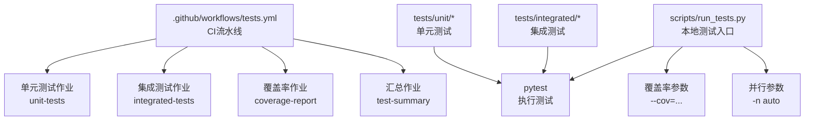
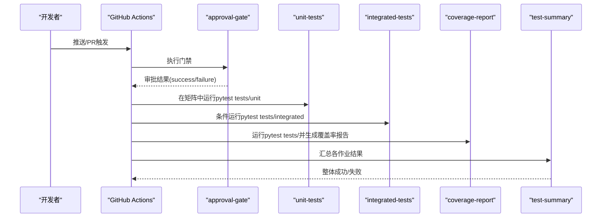
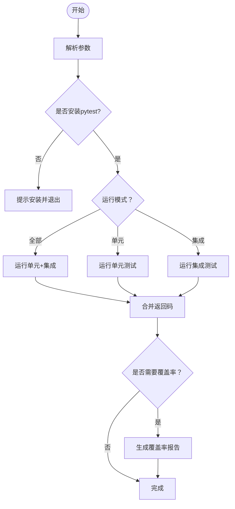
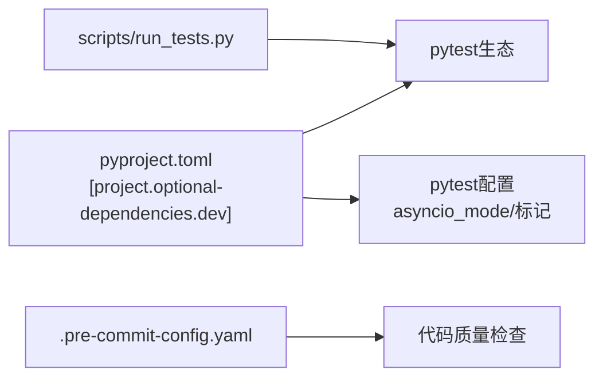

# 测试自动化

<cite>
**本文引用的文件**
- [.github/workflows/tests.yml](file://.github/workflows/tests.yml)
- [scripts/run_tests.py](file://scripts/run_tests.py)
- [scripts/README.md](file://scripts/README.md)
- [pyproject.toml](file://pyproject.toml)
- [tests/unit/providers/test_openai_provider.py](file://tests/unit/providers/test_openai_provider.py)
- [tests/unit/local_models/test_model_manager.py](file://tests/unit/local_models/test_model_manager.py)
- [tests/integrated/test_app_startup.py](file://tests/integrated/test_app_startup.py)
- [tests/unit/utils/test_command_runner.py](file://tests/unit/utils/test_command_runner.py)
- [tests/unit/workspace/test_workspace.py](file://tests/unit/workspace/test_workspace.py)
- [tests/unit/app/test_chat_updates.py](file://tests/unit/app/test_chat_updates.py)
- [tests/unit/cli/test_cli_version.py](file://tests/unit/cli/test_cli_version.py)
- [CONTRIBUTING.md](file://CONTRIBUTING.md)
- [.pre-commit-config.yaml](file://.pre-commit-config.yaml)
</cite>

## 目录
1. [简介](#简介)
2. [项目结构](#项目结构)
3. [核心组件](#核心组件)
4. [架构总览](#架构总览)
5. [详细组件分析](#详细组件分析)
6. [依赖关系分析](#依赖关系分析)
7. [性能考量](#性能考量)
8. [故障排查指南](#故障排查指南)
9. [结论](#结论)
10. [附录](#附录)

## 简介
本文件面向QwenPaw项目的测试自动化，系统性说明CI/CD流水线中的测试执行配置（GitHub Actions）、测试脚本与报告生成、测试环境与数据准备、覆盖率收集与报告、失败通知与回滚策略、性能监控与效率优化，以及测试环境容器化与并行执行策略。目标是帮助贡献者与维护者高效理解并维护测试体系。

## 项目结构
QwenPaw的测试体系由以下部分组成：
- CI流水线：位于 .github/workflows/tests.yml，定义单元测试、集成测试与覆盖率报告作业，并通过“维护者审批门禁”控制运行。
- 本地测试脚本：scripts/run_tests.py 提供统一入口，支持按模块运行、并行执行与覆盖率生成。
- 测试用例：tests/unit 与 tests/integrated 下覆盖核心模块（如providers、local_models、app、utils、workspace等）。
- 依赖与配置：pyproject.toml 定义pytest与覆盖率参数；.pre-commit-config.yaml 规范提交前检查。

图表来源
- [.github/workflows/tests.yml:31-94](file://.github/workflows/tests.yml#L31-L94)
- [.github/workflows/tests.yml:95-168](file://.github/workflows/tests.yml#L95-L168)
- [.github/workflows/tests.yml:170-223](file://.github/workflows/tests.yml#L170-L223)
- [scripts/run_tests.py:148-173](file://scripts/run_tests.py#L148-L173)

章节来源
- [.github/workflows/tests.yml:1-259](file://.github/workflows/tests.yml#L1-L259)
- [scripts/run_tests.py:1-282](file://scripts/run_tests.py#L1-L282)
- [pyproject.toml:105-111](file://pyproject.toml#L105-L111)

## 核心组件
- CI流水线（GitHub Actions）
  - 维护者审批门禁：approval-gate 需要批准后才继续后续作业。
  - 单元测试作业：在多平台矩阵中运行 tests/unit，构建前端并复制到包内资源。
  - 集成测试作业：条件执行 tests/integrated，同样构建前端。
  - 覆盖率作业：在Ubuntu + Python 3.12上运行全量测试并生成XML/HTML报告，PR中生成覆盖率评论。
  - 汇总作业：汇总各作业结果，任一失败即标记整体失败。
- 本地测试脚本
  - 支持 -u/--unit、-i/--integrated、-a/--all、-c/--coverage、-p/--parallel 等选项。
  - 自动检测pytest安装，调用pytest执行并处理返回码。
  - 并行执行通过pytest-xdist的-n auto实现；覆盖率通过--cov与报告格式参数启用。
- 测试用例
  - 单元测试：覆盖provider、local_models、utils、workspace、app、cli等模块。
  - 集成测试：端到端启动应用与控制台，验证HTTP接口与静态页面可用性。

章节来源
- [.github/workflows/tests.yml:22-30](file://.github/workflows/tests.yml#L22-L30)
- [.github/workflows/tests.yml:31-94](file://.github/workflows/tests.yml#L31-L94)
- [.github/workflows/tests.yml:95-168](file://.github/workflows/tests.yml#L95-L168)
- [.github/workflows/tests.yml:170-223](file://.github/workflows/tests.yml#L170-L223)
- [scripts/run_tests.py:76-121](file://scripts/run_tests.py#L76-L121)
- [scripts/run_tests.py:123-146](file://scripts/run_tests.py#L123-L146)
- [scripts/run_tests.py:148-173](file://scripts/run_tests.py#L148-L173)
- [scripts/run_tests.py:175-277](file://scripts/run_tests.py#L175-L277)

## 架构总览
下图展示CI流水线中测试作业的依赖与执行顺序，以及本地测试脚本与pytest的关系。

图表来源
- [.github/workflows/tests.yml:22-30](file://.github/workflows/tests.yml#L22-L30)
- [.github/workflows/tests.yml:31-94](file://.github/workflows/tests.yml#L31-L94)
- [.github/workflows/tests.yml:95-168](file://.github/workflows/tests.yml#L95-L168)
- [.github/workflows/tests.yml:170-223](file://.github/workflows/tests.yml#L170-L223)
- [.github/workflows/tests.yml:234-259](file://.github/workflows/tests.yml#L234-L259)

## 详细组件分析

### CI流水线配置与测试调度
- 触发条件：push到主分支或PR，且涉及 src、tests、pyproject.toml、setup.py 或工作流文件。
- 门禁：approval-gate 需要“maintainer-approved”环境批准，否则直接失败。
- 单元测试与集成测试：均使用矩阵策略，覆盖ubuntu-latest、macos-latest、windows-latest与Python版本矩阵；安装依赖时根据平台选择不同可选依赖集合。
- 覆盖率：在Ubuntu + Python 3.12上运行，生成XML/HTML/缺失行报告；PR中通过orgoro/coverage插件生成评论。
- 汇总：test-summary 检查门禁与各作业结果，任一失败则整体失败。

章节来源
- [.github/workflows/tests.yml:3-21](file://.github/workflows/tests.yml#L3-L21)
- [.github/workflows/tests.yml:22-30](file://.github/workflows/tests.yml#L22-L30)
- [.github/workflows/tests.yml:31-94](file://.github/workflows/tests.yml#L31-L94)
- [.github/workflows/tests.yml:95-168](file://.github/workflows/tests.yml#L95-L168)
- [.github/workflows/tests.yml:170-223](file://.github/workflows/tests.yml#L170-L223)
- [.github/workflows/tests.yml:234-259](file://.github/workflows/tests.yml#L234-L259)

### 本地测试脚本与测试执行
- 功能特性
  - 子目录运行：支持 -u providers 等子目录参数。
  - 全量运行：默认 -a/-u/-i 三者至少一个被指定。
  - 并行执行：-p 使用pytest-xdist的-n auto。
  - 覆盖率：-c 启用 --cov=src/qwenpaw 及报告格式。
  - 返回码：综合单元与集成测试返回码，最终返回非零表示失败。
- 错误处理
  - 未安装pytest时提示安装命令并退出。
  - 各子流程返回码用于最终状态判定。

图表来源
- [scripts/run_tests.py:175-277](file://scripts/run_tests.py#L175-L277)
- [scripts/run_tests.py:148-173](file://scripts/run_tests.py#L148-L173)

章节来源
- [scripts/run_tests.py:1-282](file://scripts/run_tests.py#L1-L282)
- [scripts/README.md:30-53](file://scripts/README.md#L30-L53)

### 测试报告生成与分析
- CI覆盖率
  - 生成XML/HTML/缺失行报告，PR中通过orgoro/coverage插件生成评论。
- 本地覆盖率
  - 通过 -c 自动生成htmlcov/index.html，便于本地分析。
- 报告解读建议
  - 关注缺失行（term-missing）定位未覆盖路径。
  - 结合PR评论快速评估变更对覆盖率的影响。

章节来源
- [.github/workflows/tests.yml:214-233](file://.github/workflows/tests.yml#L214-L233)
- [scripts/run_tests.py:156-163](file://scripts/run_tests.py#L156-L163)

### 测试环境自动化配置与测试数据准备
- 前端构建与打包
  - 单元/集成/覆盖率作业均先安装Node.js并执行npm ci && npm run build，再将console/dist复制到src/qwenpaw/console，确保测试期间前端资源可用。
- 依赖安装策略
  - macOS：优先安装本地/ollama相关依赖，并尝试安装mlx-lm与llama-cpp-python二进制包。
  - 其他平台：安装完整开发依赖集合。
- 测试数据
  - 大多数测试通过pytest fixtures与monkeypatch构造模拟对象，避免外部依赖。
  - 集成测试通过子进程启动应用并访问HTTP接口，不依赖外部数据库或服务。

章节来源
- [.github/workflows/tests.yml:52-70](file://.github/workflows/tests.yml#L52-L70)
- [.github/workflows/tests.yml:116-134](file://.github/workflows/tests.yml#L116-L134)
- [.github/workflows/tests.yml:183-201](file://.github/workflows/tests.yml#L183-L201)
- [tests/integrated/test_app_startup.py:33-133](file://tests/integrated/test_app_startup.py#L33-L133)

### 测试失败通知与回滚策略
- 失败通知
  - 汇总作业在test-summary中输出各作业结果并以非零返回码标识失败，便于CI系统捕获。
  - 覆盖率作业在PR中生成覆盖率评论，便于快速定位问题。
- 回滚策略
  - 当前流水线未配置自动回滚；建议在PR合并后通过发布流程进行版本回退，或在CI中增加“回滚保护”步骤（例如仅允许特定分支或标签触发回滚）。

章节来源
- [.github/workflows/tests.yml:234-259](file://.github/workflows/tests.yml#L234-L259)
- [.github/workflows/tests.yml:224-233](file://.github/workflows/tests.yml#L224-L233)

### 测试性能监控与效率优化
- 并行执行
  - 本地脚本通过 -p 使用pytest-xdist的-n auto实现并行；CI中未显式启用并行，可在满足稳定性前提下考虑开启以缩短耗时。
- 依赖缓存
  - pip与node缓存已在作业中启用，有助于减少重复安装时间。
- 选择性运行
  - 本地脚本支持按子目录运行单元测试，便于快速验证局部修改。
- 建议
  - 引入pytest分片（如pytest-shard）或基于文件大小/模块的并行策略，进一步提升吞吐。
  - 对慢测试添加“slow”标记并在CI中按需排除。

章节来源
- [scripts/run_tests.py:208-213](file://scripts/run_tests.py#L208-L213)
- [.github/workflows/tests.yml:38-47](file://.github/workflows/tests.yml#L38-L47)
- [pyproject.toml:108-111](file://pyproject.toml#L108-L111)

### 测试环境容器化与并行执行策略
- 容器化
  - 仓库提供Dockerfile与docker-compose配置，可用于构建镜像与编排服务；可将测试作业迁移至容器中执行，以获得更一致的环境。
- 并行策略
  - 本地脚本已支持并行；CI层面可通过矩阵扩展更多平台组合，但需平衡并发度与资源占用。
  - 建议结合“维护者审批门禁”与“慢测试标记”，在PR中优先运行快测，主分支再运行全量。

章节来源
- [.github/workflows/tests.yml:38-47](file://.github/workflows/tests.yml#L38-L47)
- [scripts/run_tests.py:208-213](file://scripts/run_tests.py#L208-L213)

## 依赖关系分析
- 测试框架与工具
  - pytest、pytest-asyncio、pytest-cov、hypothesis等作为dev依赖。
  - pytest配置通过pyproject.toml集中管理，包括异步模式与标记。
- 提交前检查
  - .pre-commit-config.yaml 配置了语法检查、格式化与类型检查，降低CI失败概率。
- 依赖安装差异
  - CI按平台选择不同可选依赖集，本地脚本通过pip安装完整开发依赖集合。

图表来源
- [pyproject.toml:75-82](file://pyproject.toml#L75-L82)
- [pyproject.toml:105-111](file://pyproject.toml#L105-L111)
- [.pre-commit-config.yaml:1-121](file://.pre-commit-config.yaml#L1-L121)
- [scripts/run_tests.py:221-228](file://scripts/run_tests.py#L221-L228)

章节来源
- [pyproject.toml:75-111](file://pyproject.toml#L75-L111)
- [.pre-commit-config.yaml:1-121](file://.pre-commit-config.yaml#L1-L121)
- [scripts/run_tests.py:221-228](file://scripts/run_tests.py#L221-L228)

## 性能考量
- 本地测试脚本
  - -p 并行执行可显著缩短耗时；-c 生成覆盖率报告会增加IO开销。
- CI测试
  - macOS平台安装mlx-lm与llama-cpp-python可能较慢，建议在PR中按需跳过或使用缓存。
  - 前端构建在所有作业中重复执行，可考虑缓存dist产物以减少时间。
- 建议
  - 将慢测试标记为“slow”，在CI中按需排除。
  - 使用pytest分片或自定义分组策略，提升吞吐。

章节来源
- [scripts/run_tests.py:208-213](file://scripts/run_tests.py#L208-L213)
- [.github/workflows/tests.yml:81-88](file://.github/workflows/tests.yml#L81-L88)
- [pyproject.toml:108-111](file://pyproject.toml#L108-L111)

## 故障排查指南
- pytest未安装
  - 现象：本地运行报错提示未安装pytest。
  - 处理：按照提示安装开发依赖集合。
- 集成测试失败
  - 现象：应用启动超时或控制台无法访问。
  - 处理：检查日志输出与端口占用；确认前端构建产物已复制到包内资源。
- 覆盖率报告为空
  - 现象：htmlcov目录不存在或报告缺失。
  - 处理：确认 -c 参数已启用；检查pytest版本与覆盖率插件兼容性。
- PR覆盖率评论未出现
  - 现象：PR中未显示覆盖率评论。
  - 处理：确认coverage.xml存在且token权限正确；检查orgoro/coverage插件配置。

章节来源
- [scripts/run_tests.py:221-228](file://scripts/run_tests.py#L221-L228)
- [scripts/run_tests.py:269-275](file://scripts/run_tests.py#L269-L275)
- [.github/workflows/tests.yml:224-233](file://.github/workflows/tests.yml#L224-L233)
- [tests/integrated/test_app_startup.py:67-104](file://tests/integrated/test_app_startup.py#L67-L104)

## 结论
QwenPaw的测试自动化以GitHub Actions为核心，辅以本地测试脚本与覆盖率报告，形成从PR到主分支的完整质量保障闭环。通过维护者审批门禁、多平台矩阵与前端构建集成，确保测试的稳定性与一致性。建议在CI中引入并行与分片策略、完善慢测试标记与排除机制，并在必要时启用容器化与缓存优化，持续提升测试效率与可靠性。

## 附录
- 本地测试命令参考
  - 运行全部测试：python scripts/run_tests.py
  - 仅运行单元测试：python scripts/run_tests.py -u
  - 指定子目录：python scripts/run_tests.py -u providers
  - 运行集成测试：python scripts/run_tests.py -i
  - 生成覆盖率：python scripts/run_tests.py -a -c
  - 并行执行：python scripts/run_tests.py -p
- 贡献与本地门禁
  - 贡献者需在本地通过pre-commit与pytest门禁后再提交PR。

章节来源
- [scripts/README.md:30-53](file://scripts/README.md#L30-L53)
- [CONTRIBUTING.md:70-79](file://CONTRIBUTING.md#L70-L79)