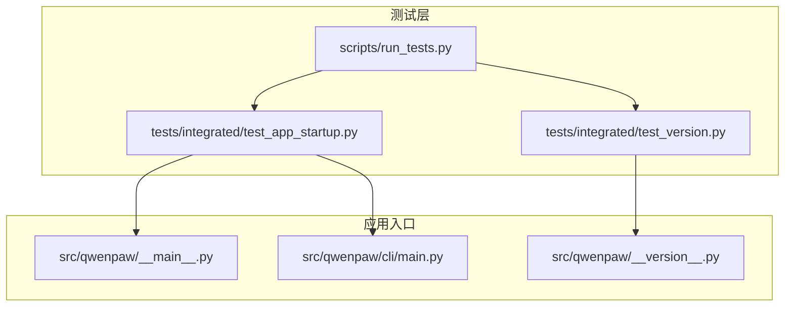
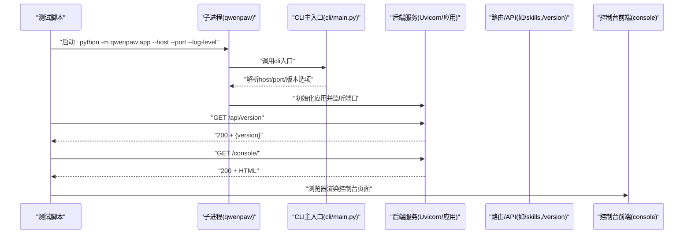
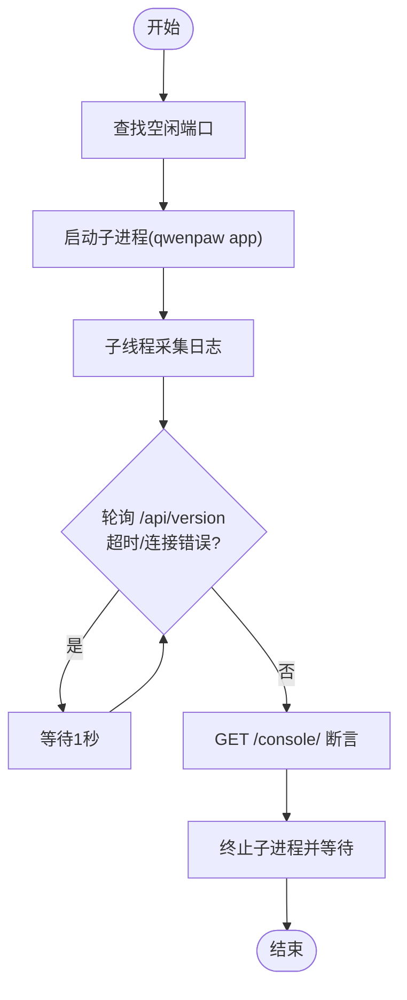
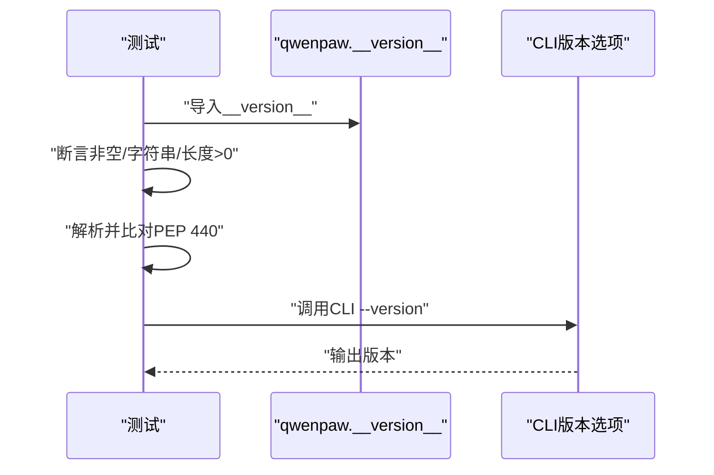
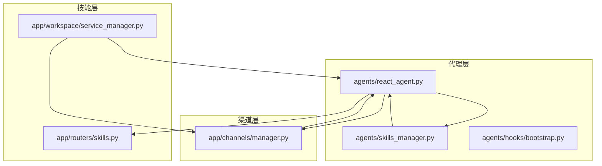
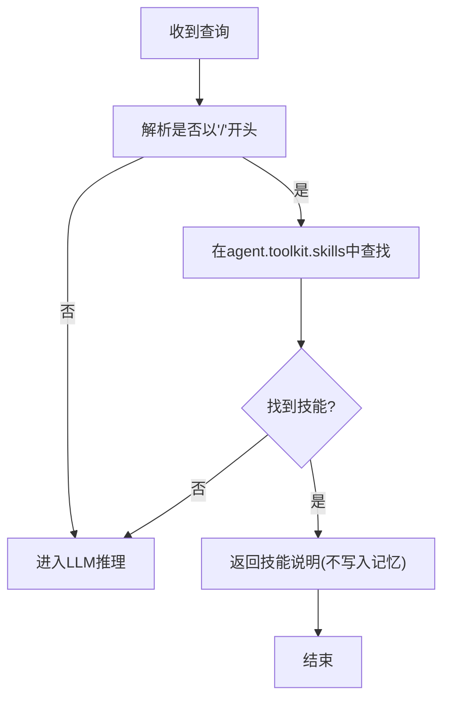
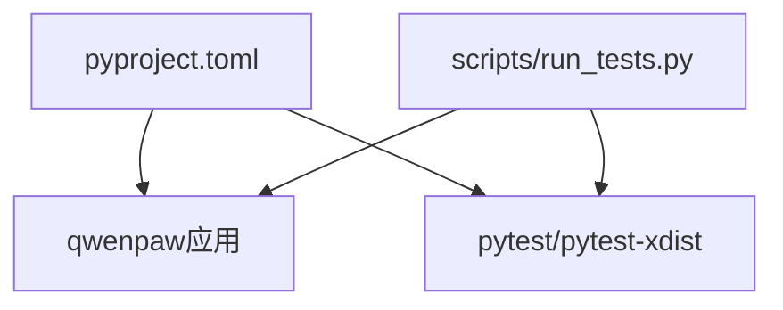

# 集成测试

<cite>
**本文引用的文件**
- [tests/integrated/test_app_startup.py](file://tests/integrated/test_app_startup.py)
- [tests/integrated/test_version.py](file://tests/integrated/test_version.py)
- [scripts/run_tests.py](file://scripts/run_tests.py)
- [src/qwenpaw/__main__.py](file://src/qwenpaw/__main__.py)
- [src/qwenpaw/__version__.py](file://src/qwenpaw/__version__.py)
- [src/qwenpaw/cli/main.py](file://src/qwenpaw/cli/main.py)
- [src/qwenpaw/app/channels/manager.py](file://src/qwenpaw/app/channels/manager.py)
- [src/qwenpaw/agents/react_agent.py](file://src/qwenpaw/agents/react_agent.py)
- [src/qwenpaw/app/routers/skills.py](file://src/qwenpaw/app/routers/skills.py)
- [src/qwenpaw/app/workspace/service_manager.py](file://src/qwenpaw/app/workspace/service_manager.py)
- [src/qwenpaw/agents/hooks/bootstrap.py](file://src/qwenpaw/agents/hooks/bootstrap.py)
- [src/qwenpaw/agents/skills_manager.py](file://src/qwenpaw/agents/skills_manager.py)
- [src/qwenpaw/app/runner/runner.py](file://src/qwenpaw/app/runner/runner.py)
- [pyproject.toml](file://pyproject.toml)
</cite>

## 目录
1. [引言](#引言)
2. [项目结构](#项目结构)
3. [核心组件](#核心组件)
4. [架构总览](#架构总览)
5. [详细组件分析](#详细组件分析)
6. [依赖分析](#依赖分析)
7. [性能考虑](#性能考虑)
8. [故障排查指南](#故障排查指南)
9. [结论](#结论)
10. [附录](#附录)

## 引言
本文件面向QwenPaw项目的集成测试，聚焦以下目标：
- 应用启动与控制台可用性测试：验证后端进程启动、健康检查、控制台页面返回等端到端行为。
- 版本验证测试：确保版本号可导入、遵循PEP 440规范，并可通过子进程读取。
- 模块间交互测试设计：围绕“代理管理（Agent）—渠道集成（Channel）—技能系统（Skill）”协同路径进行测试策略设计。
- 测试环境与依赖准备：明确运行集成测试所需的Python环境、依赖安装与并发执行方式。
- 测试用例设计模式与最佳实践：统一断言风格、超时与重试策略、日志采集与失败诊断。
- 跨模块测试数据与状态管理：如何在不同模块间共享状态、隔离副作用并保证可重复性。
- 失败诊断与调试：结合日志采集、进程退出码、网络连通性与HTML内容校验定位问题。
- 在持续集成中的角色与执行时机：与单元测试、覆盖率、发布流程的协作关系。

## 项目结构
集成测试位于tests/integrated目录，当前包含两条核心测试：
- 应用启动与控制台测试：通过子进程启动后端，轮询健康接口，随后访问控制台页面并断言响应头与HTML内容。
- 版本测试：验证版本号可导入、符合PEP 440格式，并能通过子进程命令输出。

本地测试运行器提供统一入口，支持并行执行与覆盖率生成。

图表来源
- [tests/integrated/test_app_startup.py:1-133](file://tests/integrated/test_app_startup.py#L1-L133)
- [tests/integrated/test_version.py:1-49](file://tests/integrated/test_version.py#L1-L49)
- [scripts/run_tests.py:123-145](file://scripts/run_tests.py#L123-L145)
- [src/qwenpaw/__main__.py:1-7](file://src/qwenpaw/__main__.py#L1-L7)
- [src/qwenpaw/cli/main.py:146-171](file://src/qwenpaw/cli/main.py#L146-L171)
- [src/qwenpaw/__version__.py:1-3](file://src/qwenpaw/__version__.py#L1-L3)

章节来源
- [tests/integrated/test_app_startup.py:1-133](file://tests/integrated/test_app_startup.py#L1-L133)
- [tests/integrated/test_version.py:1-49](file://tests/integrated/test_version.py#L1-L49)
- [scripts/run_tests.py:123-145](file://scripts/run_tests.py#L123-L145)
- [src/qwenpaw/__main__.py:1-7](file://src/qwenpaw/__main__.py#L1-L7)
- [src/qwenpaw/cli/main.py:146-171](file://src/qwenpaw/cli/main.py#L146-L171)
- [src/qwenpaw/__version__.py:1-3](file://src/qwenpaw/__version__.py#L1-L3)

## 核心组件
- 启动与控制台测试
  - 子进程启动后端：使用Python模块入口启动qwenpaw应用，绑定随机空闲端口，捕获标准输出并实时打印。
  - 健康检查：循环请求/api/version，成功即记录版本信息并继续。
  - 控制台访问：GET /console/，断言状态码200、Content-Type含text/html、HTML片段存在且包含<html或<!doctype html>。
  - 进程清理：终止子进程并等待，避免僵尸进程影响后续测试。
- 版本测试
  - 导入测试：从qwenpaw.__version__导入__version__，断言非空、字符串、长度>0。
  - PEP 440合规：使用packaging.version.Version解析并比对原始字符串。
  - 子进程读取：通过sys.executable -c命令输出版本，断言返回码为0且输出包含点号分隔的版本号。

章节来源
- [tests/integrated/test_app_startup.py:33-133](file://tests/integrated/test_app_startup.py#L33-L133)
- [tests/integrated/test_version.py:12-49](file://tests/integrated/test_version.py#L12-L49)

## 架构总览
下图展示从测试到应用启动、路由处理与前端控制台的关键交互路径，以及与CLI参数解析的关系。

图表来源
- [tests/integrated/test_app_startup.py:39-121](file://tests/integrated/test_app_startup.py#L39-L121)
- [src/qwenpaw/cli/main.py:146-171](file://src/qwenpaw/cli/main.py#L146-L171)
- [src/qwenpaw/__main__.py:1-7](file://src/qwenpaw/__main__.py#L1-L7)

## 详细组件分析

### 组件A：应用启动与控制台可用性测试
- 设计要点
  - 端口选择：自动寻找空闲端口，避免冲突。
  - 日志采集：子线程读取stdout，实时打印并缓存最近日志，便于失败时诊断。
  - 健康检查：以HTTP客户端轮询/api/version，超时与连接错误分别处理。
  - 控制台断言：除状态码外，还断言Content-Type与HTML骨架关键字。
  - 进程回收：无论成功与否，均终止子进程并等待，防止资源泄漏。
- 关键路径
  - 子进程启动与参数传递：见测试中对sys.executable与-m qwenpaw app的调用。
  - CLI参数回退逻辑：当未指定host/port时回退到默认值。
  - 版本路由：/api/version由后端提供，供测试确认后端已就绪。
  - 控制台路由：/console/返回静态HTML，用于验证前端打包与服务部署。

图表来源
- [tests/integrated/test_app_startup.py:33-133](file://tests/integrated/test_app_startup.py#L33-L133)
- [src/qwenpaw/cli/main.py:158-171](file://src/qwenpaw/cli/main.py#L158-L171)

章节来源
- [tests/integrated/test_app_startup.py:33-133](file://tests/integrated/test_app_startup.py#L33-L133)
- [src/qwenpaw/cli/main.py:158-171](file://src/qwenpaw/cli/main.py#L158-L171)

### 组件B：版本验证测试
- 设计要点
  - 导入路径：直接从qwenpaw.__version__导入__version__，确保包内版本一致。
  - 规范校验：使用packaging.version.Version解析并比对字符串，确保PEP 440格式。
  - 子进程读取：通过命令行输出版本，验证可被外部工具读取。
- 关键路径
  - 版本常量定义：src/qwenpaw/__version__.py提供__version__。
  - CLI版本选项：cli/main.py注册@click.version_option，便于命令行查看版本。

图表来源
- [tests/integrated/test_version.py:12-49](file://tests/integrated/test_version.py#L12-L49)
- [src/qwenpaw/__version__.py:1-3](file://src/qwenpaw/__version__.py#L1-L3)
- [src/qwenpaw/cli/main.py:146](file://src/qwenpaw/cli/main.py#L146)

章节来源
- [tests/integrated/test_version.py:12-49](file://tests/integrated/test_version.py#L12-L49)
- [src/qwenpaw/__version__.py:1-3](file://src/qwenpaw/__version__.py#L1-L3)
- [src/qwenpaw/cli/main.py:146](file://src/qwenpaw/cli/main.py#L146)

### 组件C：模块间交互测试设计（代理—渠道—技能）
- 设计思路
  - 代理管理：Agent在推理前会初始化技能集合，基于工作区与通道上下文解析有效技能列表，并注册到工具包。
  - 渠道集成：ChannelManager从注册表与配置加载启用的渠道，统一入队与消费；不同渠道可能有不同的消息合并与过滤策略。
  - 技能系统：技能清单与配置通过路由暴露，支持更新技能通道与标签；技能配置可注入环境变量以影响运行期行为。
- 协同测试关注点
  - 通道上下文：代理根据请求上下文中的channel决定有效技能集。
  - 技能注册：代理在每次查询前重新解析并注册技能，确保热重载安全。
  - 环境变量注入：技能配置中的require_envs会被注入到进程环境，需注意并发与释放。
  - 工作区服务生命周期：ServiceManager负责服务注册、依赖与优先级，保障重启与重用场景的一致性。
- 关键路径
  - 代理技能注册：react_agent在构建工具包时解析有效技能并注册。
  - 渠道管理：manager从环境与配置创建渠道实例，统一处理批量与单条消息。
  - 技能路由：routers/skills提供技能保存、通道与标签更新、配置读取等端点。
  - 技能配置注入：skills_manager在上下文期间注入/释放环境变量。
  - 工作区服务：service_manager按优先级启动/停止服务，支持可复用组件。

图表来源
- [src/qwenpaw/agents/react_agent.py:309-343](file://src/qwenpaw/agents/react_agent.py#L309-L343)
- [src/qwenpaw/agents/skills_manager.py:673-717](file://src/qwenpaw/agents/skills_manager.py#L673-L717)
- [src/qwenpaw/app/channels/manager.py:68-200](file://src/qwenpaw/app/channels/manager.py#L68-L200)
- [src/qwenpaw/app/routers/skills.py:1300-1372](file://src/qwenpaw/app/routers/skills.py#L1300-L1372)
- [src/qwenpaw/app/workspace/service_manager.py:74-200](file://src/qwenpaw/app/workspace/service_manager.py#L74-L200)
- [src/qwenpaw/agents/hooks/bootstrap.py:42-104](file://src/qwenpaw/agents/hooks/bootstrap.py#L42-L104)

章节来源
- [src/qwenpaw/agents/react_agent.py:309-343](file://src/qwenpaw/agents/react_agent.py#L309-L343)
- [src/qwenpaw/agents/skills_manager.py:673-717](file://src/qwenpaw/agents/skills_manager.py#L673-L717)
- [src/qwenpaw/app/channels/manager.py:68-200](file://src/qwenpaw/app/channels/manager.py#L68-L200)
- [src/qwenpaw/app/routers/skills.py:1300-1372](file://src/qwenpaw/app/routers/skills.py#L1300-L1372)
- [src/qwenpaw/app/workspace/service_manager.py:74-200](file://src/qwenpaw/app/workspace/service_manager.py#L74-L200)
- [src/qwenpaw/agents/hooks/bootstrap.py:42-104](file://src/qwenpaw/agents/hooks/bootstrap.py#L42-L104)

### 组件D：运行器与技能触发
- 关注点
  - 以“/技能名”形式的快捷查询：运行器解析用户输入，若命中已注册技能则直接返回技能说明，不进入LLM推理。
  - 聊天管理：在有聊天管理器时，自动为会话注册聊天对象，便于历史与状态管理。
- 测试建议
  - 构造包含“/技能名”的查询消息，断言返回为技能说明且不写入记忆。
  - 在多通道场景下验证该行为一致。

图表来源
- [src/qwenpaw/app/runner/runner.py:147-520](file://src/qwenpaw/app/runner/runner.py#L147-L520)

章节来源
- [src/qwenpaw/app/runner/runner.py:147-520](file://src/qwenpaw/app/runner/runner.py#L147-L520)

## 依赖分析
- Python与包管理
  - 项目使用setuptools构建，动态版本来自qwenpaw.__version__。
  - 可选依赖涵盖本地模型、Ollama、Whisper等，集成测试通常无需全部安装，但需满足基础依赖。
- 测试运行器
  - 支持并行执行（需要pytest-xdist），支持覆盖率报告（--cov）。
  - 提供单元测试与集成测试的独立入口与组合执行。
- 关键依赖
  - httpx：用于健康检查与控制台访问。
  - uvicorn：后端ASGI服务器，与CLI参数配合启动。
  - pytest：测试框架，支持异步模式与标记。

图表来源
- [pyproject.toml:1-111](file://pyproject.toml#L1-L111)
- [scripts/run_tests.py:148-173](file://scripts/run_tests.py#L148-L173)

章节来源
- [pyproject.toml:1-111](file://pyproject.toml#L1-L111)
- [scripts/run_tests.py:148-173](file://scripts/run_tests.py#L148-L173)

## 性能考虑
- 并发与并行
  - 使用pytest-xdist并行执行测试，缩短整体耗时；注意测试间共享资源的隔离。
- 超时与重试
  - 健康检查设置固定超时，避免长时间阻塞；对网络异常采用指数退避更稳健（当前为固定间隔）。
- 日志与诊断
  - 子线程采集日志并截取最后若干行，便于快速定位错误；建议在CI中将完整日志作为Artifacts保存。
- 资源回收
  - 明确终止子进程并等待，防止端口占用与僵尸进程。

## 故障排查指南
- 启动失败
  - 检查依赖安装：确保基础依赖与可选依赖满足需求。
  - 查看日志：测试中截取的最近日志包含ImportError/ModuleNotFoundError等关键线索。
  - 端口冲突：确认随机端口可用，必要时手动指定端口。
- 健康检查失败
  - 确认后端已监听到端口，/api/version可达。
  - 检查CLI参数：host/port回退逻辑与传参是否正确。
- 控制台不可用
  - 断言Content-Type与HTML骨架，确认静态资源已打包至后端。
- 版本异常
  - 导入失败：检查包安装与路径。
  - PEP 440不合规：修正版本格式或构建流程。
- 并发与竞态
  - 技能环境变量注入/释放：确保在上下文结束后正确释放，避免跨测试污染。

章节来源
- [tests/integrated/test_app_startup.py:67-104](file://tests/integrated/test_app_startup.py#L67-L104)
- [tests/integrated/test_version.py:25-29](file://tests/integrated/test_version.py#L25-L29)
- [src/qwenpaw/agents/skills_manager.py:673-717](file://src/qwenpaw/agents/skills_manager.py#L673-L717)

## 结论
本集成测试文档梳理了QwenPaw的启动与版本验证测试实现，给出了模块间交互测试的设计思路与最佳实践。通过统一的测试运行器、清晰的断言策略与完善的失败诊断机制，可在本地与CI环境中稳定地验证端到端功能。建议在CI中结合单元测试、覆盖率与发布流程，形成完整的质量保障闭环。

## 附录
- 测试执行建议
  - 本地执行：使用scripts/run_tests.py -i运行集成测试；如需并行，添加-p；如需覆盖率，添加-c。
  - CI集成：在PR与发布流程中加入集成测试步骤，失败时输出详细日志与Artifacts。
- 数据与状态管理
  - 使用临时工作区与随机端口，避免持久化状态干扰。
  - 对于技能配置注入的环境变量，确保在上下文结束后释放。
- 持续集成中的角色
  - 集成测试在PR审查与发布前执行，作为“批准门”之外的第二道防线，确保关键路径稳定。