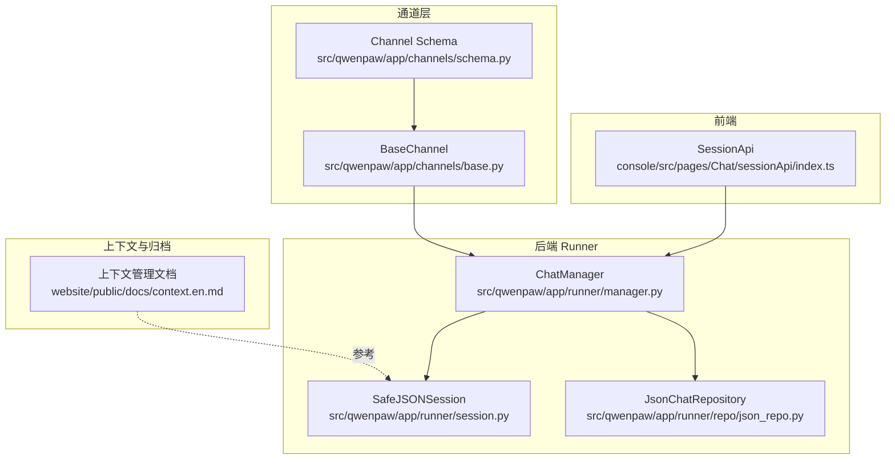
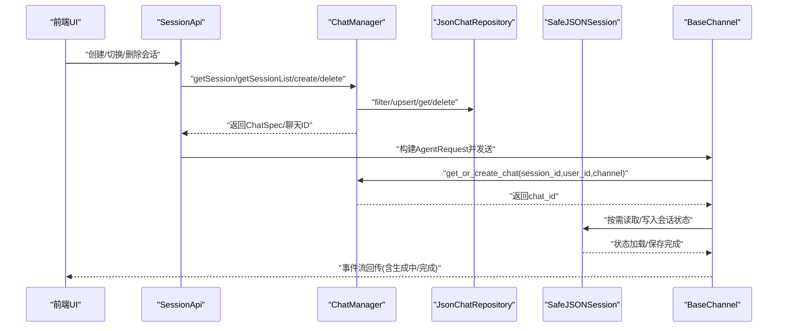
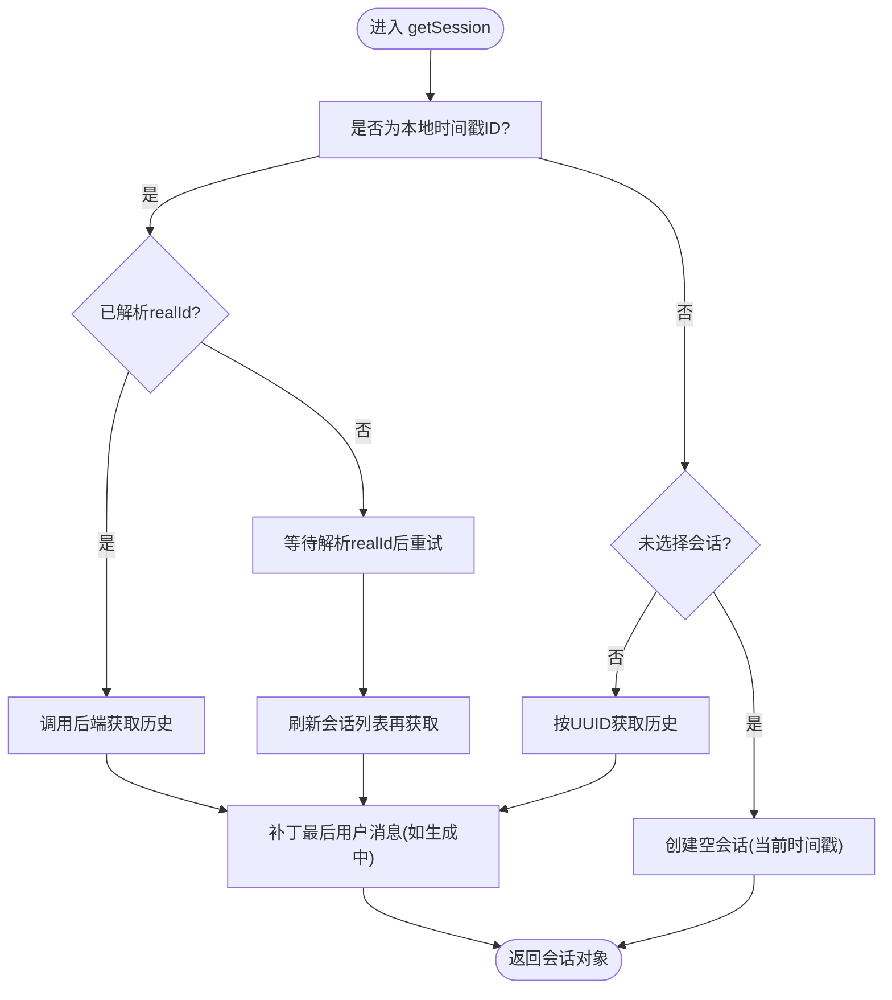
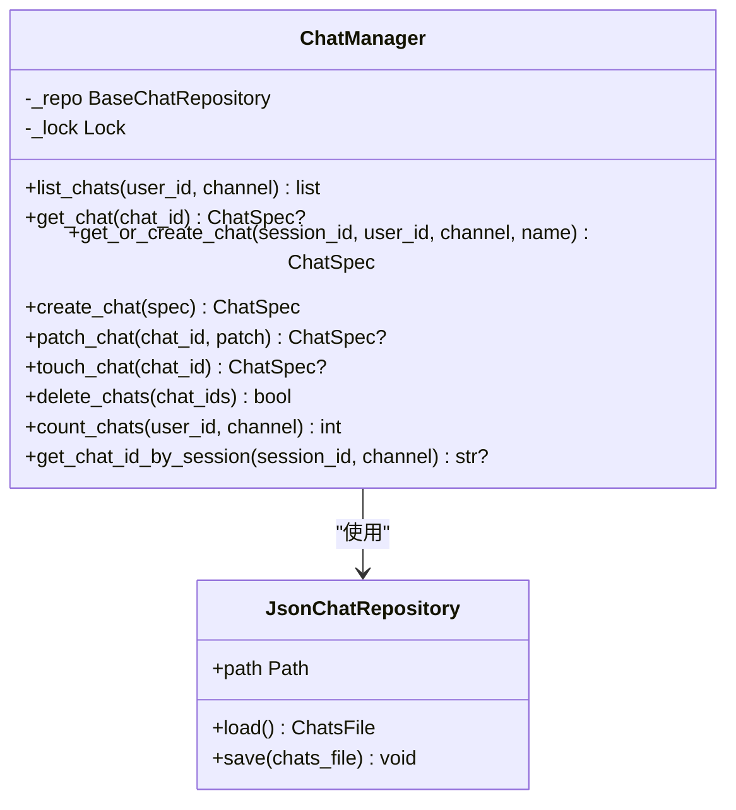
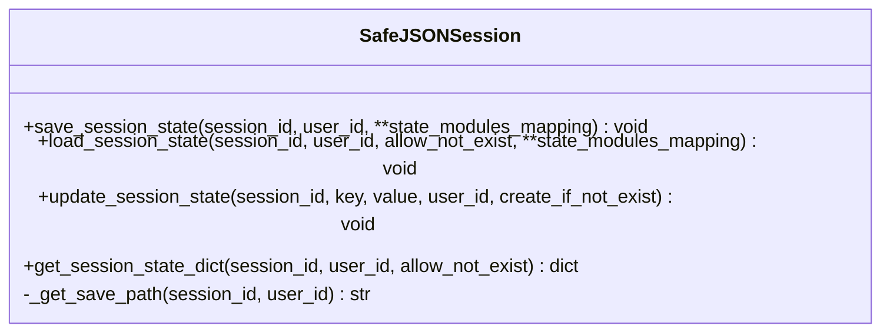
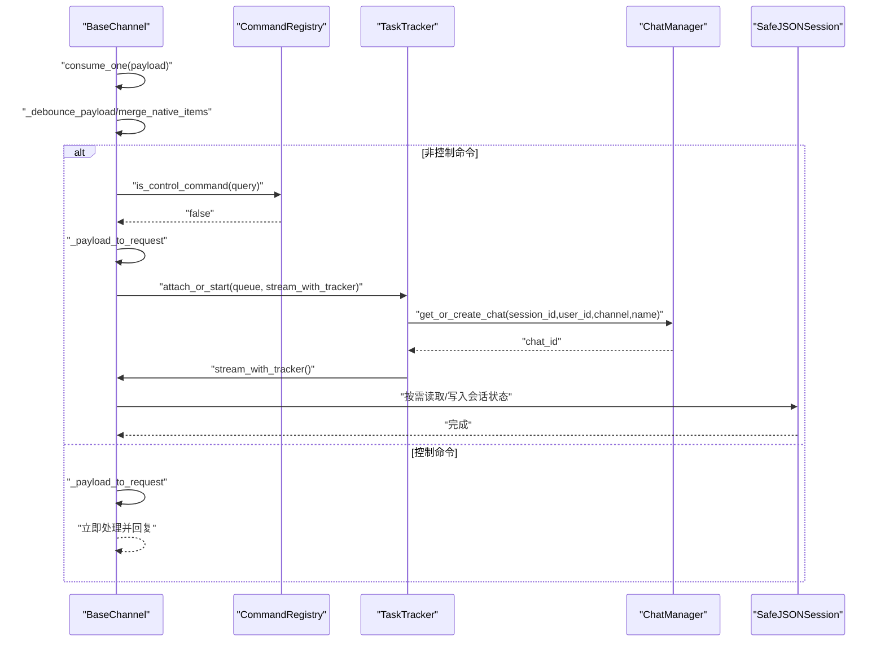
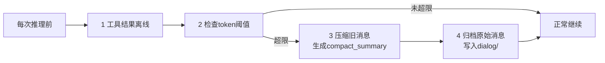
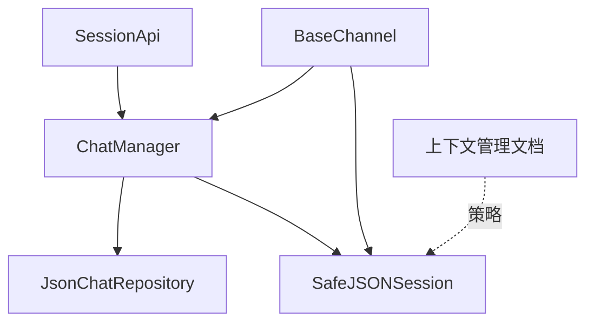

# 会话管理

<cite>
**本文引用的文件**
- [console/src/pages/Chat/sessionApi/index.ts](file://console/src/pages/Chat/sessionApi/index.ts)
- [src/qwenpaw/app/runner/session.py](file://src/qwenpaw/app/runner/session.py)
- [src/qwenpaw/app/runner/manager.py](file://src/qwenpaw/app/runner/manager.py)
- [src/qwenpaw/app/channels/base.py](file://src/qwenpaw/app/channels/base.py)
- [src/qwenpaw/app/channels/schema.py](file://src/qwenpaw/app/channels/schema.py)
- [src/qwenpaw/app/runner/repo/json_repo.py](file://src/qwenpaw/app/runner/repo/json_repo.py)
- [website/public/docs/context.en.md](file://website/public/docs/context.en.md)
- [src/qwenpaw/app/crons/heartbeat.py](file://src/qwenpaw/app/crons/heartbeat.py)
</cite>

## 目录
1. [简介](#简介)
2. [项目结构](#项目结构)
3. [核心组件](#核心组件)
4. [架构总览](#架构总览)
5. [详细组件分析](#详细组件分析)
6. [依赖分析](#依赖分析)
7. [性能考虑](#性能考虑)
8. [故障排查指南](#故障排查指南)
9. [结论](#结论)
10. [附录](#附录)

## 简介
本技术文档围绕 QwenPaw 的会话管理系统，系统性阐述会话的概念、生命周期管理（创建、状态跟踪、销毁）、跨平台用户标识符标准化、会话状态的持久化与恢复、上下文管理（消息历史、上下文窗口与记忆保持）、并发控制与锁机制，以及性能优化与监控方案。文档面向不同技术背景的读者，既提供高层架构视图，也给出代码级细节与可视化图示。

## 项目结构
会话管理涉及前端 Web UI 侧的会话 API、后端 Runner 的聊天管理器与仓库、通道层的会话标识解析、以及上下文压缩与归档等模块。下图展示与会话管理直接相关的模块与交互：

**图表来源**
- [console/src/pages/Chat/sessionApi/index.ts:1-735](file://console/src/pages/Chat/sessionApi/index.ts#L1-L735)
- [src/qwenpaw/app/runner/manager.py:1-252](file://src/qwenpaw/app/runner/manager.py#L1-L252)
- [src/qwenpaw/app/runner/session.py:1-248](file://src/qwenpaw/app/runner/session.py#L1-L248)
- [src/qwenpaw/app/runner/repo/json_repo.py:1-71](file://src/qwenpaw/app/runner/repo/json_repo.py#L1-L71)
- [src/qwenpaw/app/channels/base.py:1-800](file://src/qwenpaw/app/channels/base.py#L1-L800)
- [src/qwenpaw/app/channels/schema.py:1-71](file://src/qwenpaw/app/channels/schema.py#L1-L71)
- [website/public/docs/context.en.md:1-103](file://website/public/docs/context.en.md#L1-L103)

**章节来源**
- [console/src/pages/Chat/sessionApi/index.ts:1-735](file://console/src/pages/Chat/sessionApi/index.ts#L1-L735)
- [src/qwenpaw/app/runner/manager.py:1-252](file://src/qwenpaw/app/runner/manager.py#L1-L252)
- [src/qwenpaw/app/runner/session.py:1-248](file://src/qwenpaw/app/runner/session.py#L1-L248)
- [src/qwenpaw/app/runner/repo/json_repo.py:1-71](file://src/qwenpaw/app/runner/repo/json_repo.py#L1-L71)
- [src/qwenpaw/app/channels/base.py:1-800](file://src/qwenpaw/app/channels/base.py#L1-L800)
- [src/qwenpaw/app/channels/schema.py:1-71](file://src/qwenpaw/app/channels/schema.py#L1-L71)
- [website/public/docs/context.en.md:1-103](file://website/public/docs/context.en.md#L1-L103)

## 核心组件
- 前端会话 API：负责会话列表、会话详情、消息转换、本地临时会话与真实 UUID 的映射、生成中状态检测与补丁、页面刷新后的用户消息持久化等。
- 后端聊天管理器：提供聊天规范的增删改查、按会话查找聊天 ID、自动注册聊天、并发安全的锁保护。
- 安全 JSON 会话：对会话状态进行跨平台文件名安全的异步持久化，支持保存、加载、增量更新与状态字典读取。
- JSON 聊天仓库：单文件 JSON 存储聊天规范映射，原子写入与替换，适合单机场景。
- 通道层：统一消息请求构建、会话 ID 解析、去抖与合并、错误处理与回调。
- 上下文管理：基于 ReMeLight 的上下文窗口压缩与归档策略，保留关键区域，定期归档旧对话。

**章节来源**
- [console/src/pages/Chat/sessionApi/index.ts:339-735](file://console/src/pages/Chat/sessionApi/index.ts#L339-L735)
- [src/qwenpaw/app/runner/manager.py:17-252](file://src/qwenpaw/app/runner/manager.py#L17-L252)
- [src/qwenpaw/app/runner/session.py:39-248](file://src/qwenpaw/app/runner/session.py#L39-L248)
- [src/qwenpaw/app/runner/repo/json_repo.py:13-71](file://src/qwenpaw/app/runner/repo/json_repo.py#L13-L71)
- [src/qwenpaw/app/channels/base.py:70-800](file://src/qwenpaw/app/channels/base.py#L70-L800)
- [website/public/docs/context.en.md:1-103](file://website/public/docs/context.en.md#L1-L103)

## 架构总览
下图展示从前端到后端、再到通道与上下文管理的整体流程：

**图表来源**
- [console/src/pages/Chat/sessionApi/index.ts:522-735](file://console/src/pages/Chat/sessionApi/index.ts#L522-L735)
- [src/qwenpaw/app/runner/manager.py:44-252](file://src/qwenpaw/app/runner/manager.py#L44-L252)
- [src/qwenpaw/app/runner/repo/json_repo.py:39-71](file://src/qwenpaw/app/runner/repo/json_repo.py#L39-L71)
- [src/qwenpaw/app/runner/session.py:73-248](file://src/qwenpaw/app/runner/session.py#L73-L248)
- [src/qwenpaw/app/channels/base.py:374-536](file://src/qwenpaw/app/channels/base.py#L374-L536)

## 详细组件分析

### 前端会话 API（SessionApi）
- 会话生命周期
  - 创建：生成本地时间戳作为会话 id，并设置默认用户与通道；随后在更新时解析真实 UUID 并触发 URL 更新。
  - 获取：支持本地临时 id 与真实 UUID；当处于“生成中”状态时，从 sessionStorage 补丁最后一条用户消息，确保刷新后不丢失。
  - 列表：去重并发请求，合并 realId 与 generating 状态，优先选择偏好会话。
  - 删除：根据是否存在 realId 决定是否调用后端删除；移除后触发回调清理 URL。
- 用户标识符标准化
  - 使用扩展会话类型携带 sessionId、userId、channel、meta 等字段，便于跨平台映射与持久化。
  - 本地临时 id 与真实 UUID 的映射通过 resolveRealId 实现，保持内部 currentSessionId 不变。
- 消息转换与 UI 卡片
  - 将后端扁平消息转换为 UI 卡片格式，区分用户请求与助手响应，支持多内容块与媒体资源链接转换。
- 生成中状态与补丁
  - isGenerating 依据状态与最后一条消息角色判断；补丁逻辑在 reconnect 时从 sessionStorage 读取并注入到消息列表。

**图表来源**
- [console/src/pages/Chat/sessionApi/index.ts:562-661](file://console/src/pages/Chat/sessionApi/index.ts#L562-L661)
- [console/src/pages/Chat/sessionApi/index.ts:410-442](file://console/src/pages/Chat/sessionApi/index.ts#L410-L442)

**章节来源**
- [console/src/pages/Chat/sessionApi/index.ts:339-735](file://console/src/pages/Chat/sessionApi/index.ts#L339-L735)

### 后端聊天管理器（ChatManager）与仓库（JsonChatRepository）
- 并发与锁
  - 所有读写操作均使用 asyncio.Lock 包裹，确保同一进程内的线程安全。
- 会话查找与创建
  - 支持按 user_id/channel/session_id 查找或自动创建；提供 get_chat_id_by_session 快速定位最新聊天。
- 原子写入
  - JSON 仓库采用临时文件写入后再替换的方式，保证写入原子性，避免部分写入导致的数据损坏。

**图表来源**
- [src/qwenpaw/app/runner/manager.py:17-252](file://src/qwenpaw/app/runner/manager.py#L17-L252)
- [src/qwenpaw/app/runner/repo/json_repo.py:13-71](file://src/qwenpaw/app/runner/repo/json_repo.py#L13-L71)

**章节来源**
- [src/qwenpaw/app/runner/manager.py:17-252](file://src/qwenpaw/app/runner/manager.py#L17-L252)
- [src/qwenpaw/app/runner/repo/json_repo.py:13-71](file://src/qwenpaw/app/runner/repo/json_repo.py#L13-L71)

### 安全 JSON 会话（SafeJSONSession）
- 文件名安全
  - 对 session_id 与 user_id 进行非法字符替换，确保在 Windows/macOS/Linux 下均可正确保存。
- 异步 I/O
  - 使用 aiofiles 异步读写，避免阻塞事件循环。
- 状态管理
  - 支持保存、加载、增量更新指定键路径、读取完整状态字典；允许不存在时跳过或抛错。

**图表来源**
- [src/qwenpaw/app/runner/session.py:39-248](file://src/qwenpaw/app/runner/session.py#L39-L248)

**章节来源**
- [src/qwenpaw/app/runner/session.py:1-248](file://src/qwenpaw/app/runner/session.py#L1-L248)

### 通道层与会话标识解析（BaseChannel）
- 会话标识解析
  - 默认以 “channel:sender_id” 组合形成 session_id，子类可覆盖以适配特定通道规则。
- 请求构建与去抖
  - 将通道原生负载解析为运行时内容块，构建 AgentRequest；支持按会话聚合与时间去抖，提升吞吐与稳定性。
- 错误处理与回调
  - 在事件完成、错误、取消等节点触发回调，便于上层记录与追踪。

**图表来源**
- [src/qwenpaw/app/channels/base.py:597-631](file://src/qwenpaw/app/channels/base.py#L597-L631)
- [src/qwenpaw/app/channels/base.py:659-795](file://src/qwenpaw/app/channels/base.py#L659-L795)
- [src/qwenpaw/app/channels/base.py:374-536](file://src/qwenpaw/app/channels/base.py#L374-L536)

**章节来源**
- [src/qwenpaw/app/channels/base.py:1-800](file://src/qwenpaw/app/channels/base.py#L1-L800)
- [src/qwenpaw/app/channels/schema.py:1-71](file://src/qwenpaw/app/channels/schema.py#L1-L71)

### 上下文管理与记忆保持
- 机制概述
  - 使用 ReMeLight 进行上下文压缩与归档：工具结果超阈值时离线到文件，对话超过阈值时压缩并归档到日志文件，保留系统提示与最近消息。
- 文件缓存
  - 归档到 dialog/YYYY-MM-DD.jsonl，工具结果离线到 tool_result/{uuid}.txt，具备自动清理策略。
- 区域划分
  - 系统提示固定保留；可压缩区在超过阈值时压缩为摘要；保留区始终保留最近若干条消息。

**图表来源**
- [website/public/docs/context.en.md:20-30](file://website/public/docs/context.en.md#L20-L30)
- [website/public/docs/context.en.md:57-65](file://website/public/docs/context.en.md#L57-L65)
- [website/public/docs/context.en.md:66-80](file://website/public/docs/context.en.md#L66-L80)

**章节来源**
- [website/public/docs/context.en.md:1-103](file://website/public/docs/context.en.md#L1-L103)

## 依赖分析
- 前端 SessionApi 依赖后端 ChatManager 提供的聊天规范查询与更新能力；同时与通道层协作构建请求与发送响应。
- ChatManager 依赖 JsonChatRepository 进行持久化；依赖 SafeJSONSession 进行会话状态的跨平台安全存储。
- BaseChannel 依赖 ChatManager 自动注册与路由，依赖 SafeJSONSession 进行状态读写。
- 上下文管理策略由网站文档定义，Runner 层通过 SafeJSONSession 实现状态落盘与恢复。

**图表来源**
- [console/src/pages/Chat/sessionApi/index.ts:522-735](file://console/src/pages/Chat/sessionApi/index.ts#L522-L735)
- [src/qwenpaw/app/runner/manager.py:44-252](file://src/qwenpaw/app/runner/manager.py#L44-L252)
- [src/qwenpaw/app/runner/repo/json_repo.py:39-71](file://src/qwenpaw/app/runner/repo/json_repo.py#L39-L71)
- [src/qwenpaw/app/runner/session.py:73-248](file://src/qwenpaw/app/runner/session.py#L73-L248)
- [src/qwenpaw/app/channels/base.py:374-536](file://src/qwenpaw/app/channels/base.py#L374-L536)
- [website/public/docs/context.en.md:1-103](file://website/public/docs/context.en.md#L1-L103)

**章节来源**
- [console/src/pages/Chat/sessionApi/index.ts:1-735](file://console/src/pages/Chat/sessionApi/index.ts#L1-L735)
- [src/qwenpaw/app/runner/manager.py:1-252](file://src/qwenpaw/app/runner/manager.py#L1-L252)
- [src/qwenpaw/app/runner/session.py:1-248](file://src/qwenpaw/app/runner/session.py#L1-L248)
- [src/qwenpaw/app/runner/repo/json_repo.py:1-71](file://src/qwenpaw/app/runner/repo/json_repo.py#L1-L71)
- [src/qwenpaw/app/channels/base.py:1-800](file://src/qwenpaw/app/channels/base.py#L1-L800)
- [website/public/docs/context.en.md:1-103](file://website/public/docs/context.en.md#L1-L103)

## 性能考虑
- 前端
  - 会话列表与单个会话获取请求去重，避免重复网络请求；生成中状态补丁使用 sessionStorage，减少后端压力。
  - 消息转换与卡片构建在内存中完成，建议在长对话中启用上下文压缩与归档，降低前端渲染与传输成本。
- 后端
  - ChatManager 使用 asyncio.Lock 串行化关键路径，避免竞态；JSON 仓库采用原子写入，减少数据损坏风险。
  - SafeJSONSession 使用异步 I/O，避免阻塞事件循环；文件名安全处理确保跨平台稳定性。
- 通道层
  - 时间去抖与内容块合并减少重复事件与网络开销；控制命令绕过队列直接处理，降低延迟。
- 上下文管理
  - 工具结果离线与对话压缩显著降低上下文长度，提高推理效率与稳定性。

[本节为通用性能指导，无需列出具体文件来源]

## 故障排查指南
- 会话无法切换或 URL 不更新
  - 检查 SessionApi 的 onSessionSelected 回调是否被正确注册；确认 realId 是否成功解析。
- 生成中消息丢失
  - 确认 isGenerating 判断逻辑与 sessionStorage 中 pending 用户消息是否正确补丁。
- 会话删除后仍存在
  - 检查删除时是否传入了 realId；若为本地临时 id，后端不会删除。
- 并发写入异常
  - ChatManager 的所有写操作均受锁保护；检查是否存在跨进程共享状态导致的竞态。
- 会话状态读写失败
  - SafeJSONSession 在文件不存在时可选择跳过或抛错；检查保存目录权限与磁盘空间。
- 通道消息堆积或乱序
  - 检查 BaseChannel 的去抖配置与合并逻辑；确认队列消费顺序与任务追踪状态。

**章节来源**
- [console/src/pages/Chat/sessionApi/index.ts:537-560](file://console/src/pages/Chat/sessionApi/index.ts#L537-L560)
- [console/src/pages/Chat/sessionApi/index.ts:410-442](file://console/src/pages/Chat/sessionApi/index.ts#L410-L442)
- [src/qwenpaw/app/runner/manager.py:174-191](file://src/qwenpaw/app/runner/manager.py#L174-L191)
- [src/qwenpaw/app/runner/session.py:124-138](file://src/qwenpaw/app/runner/session.py#L124-L138)
- [src/qwenpaw/app/channels/base.py:659-795](file://src/qwenpaw/app/channels/base.py#L659-L795)

## 结论
QwenPaw 的会话管理通过前后端协同、通道抽象与上下文压缩策略，实现了跨平台、高可用且高性能的会话生命周期管理。前端 SessionApi 负责用户体验与状态补丁，后端 ChatManager 与仓库保障数据一致性，SafeJSONSession 提供跨平台安全持久化，通道层实现请求路由与去抖优化。结合上下文压缩与归档，系统在长对话场景下仍能保持稳定与高效。

[本节为总结性内容，无需列出具体文件来源]

## 附录
- 相关参考文档
  - 上下文管理策略与归档路径说明：[上下文管理文档:1-103](file://website/public/docs/context.en.md#L1-L103)
  - 心跳机制（用于周期性触发与监控）：[心跳执行流程:119-213](file://src/qwenpaw/app/crons/heartbeat.py#L119-L213)

**章节来源**
- [website/public/docs/context.en.md:1-103](file://website/public/docs/context.en.md#L1-L103)
- [src/qwenpaw/app/crons/heartbeat.py:119-213](file://src/qwenpaw/app/crons/heartbeat.py#L119-L213)