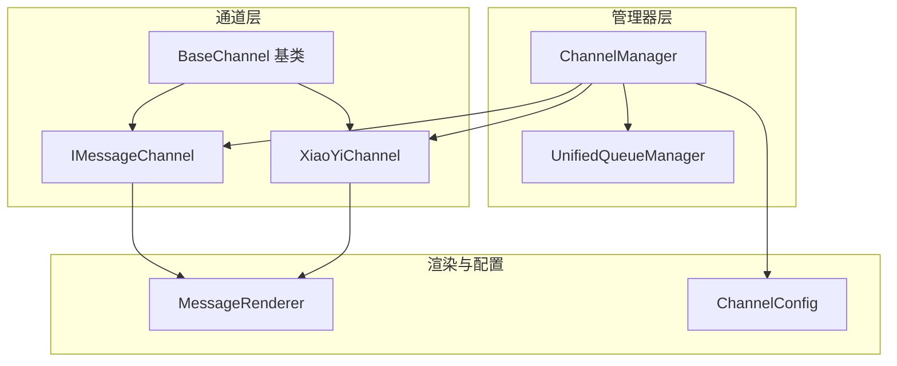
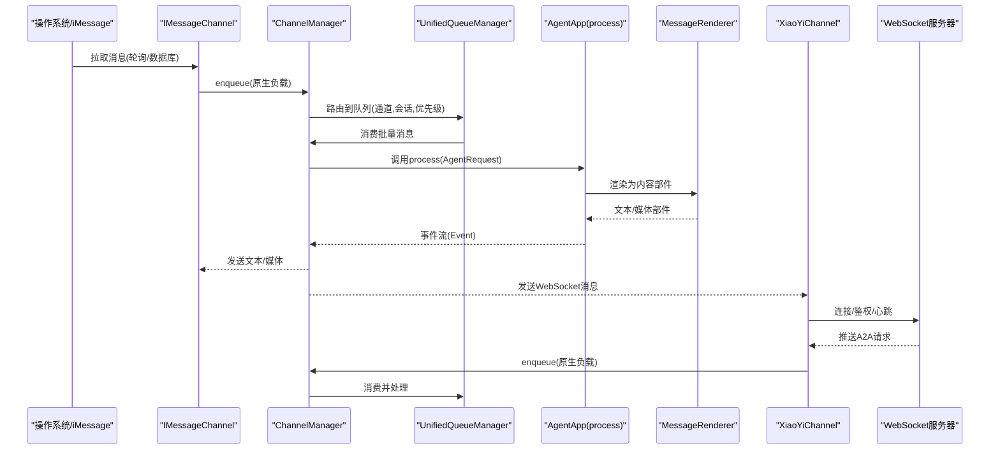
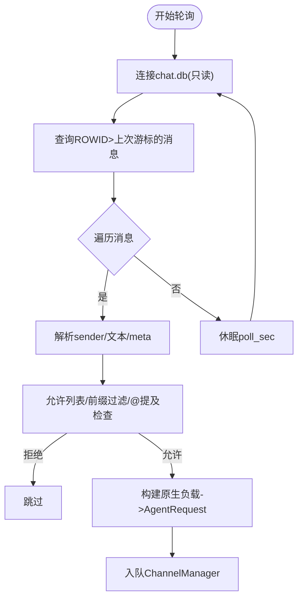
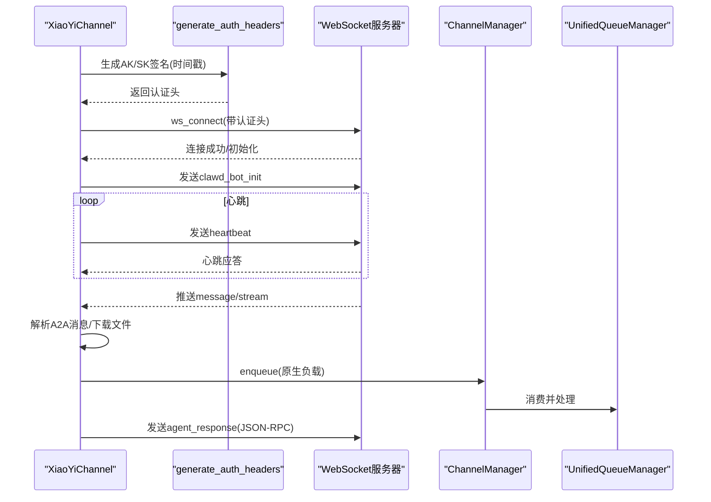
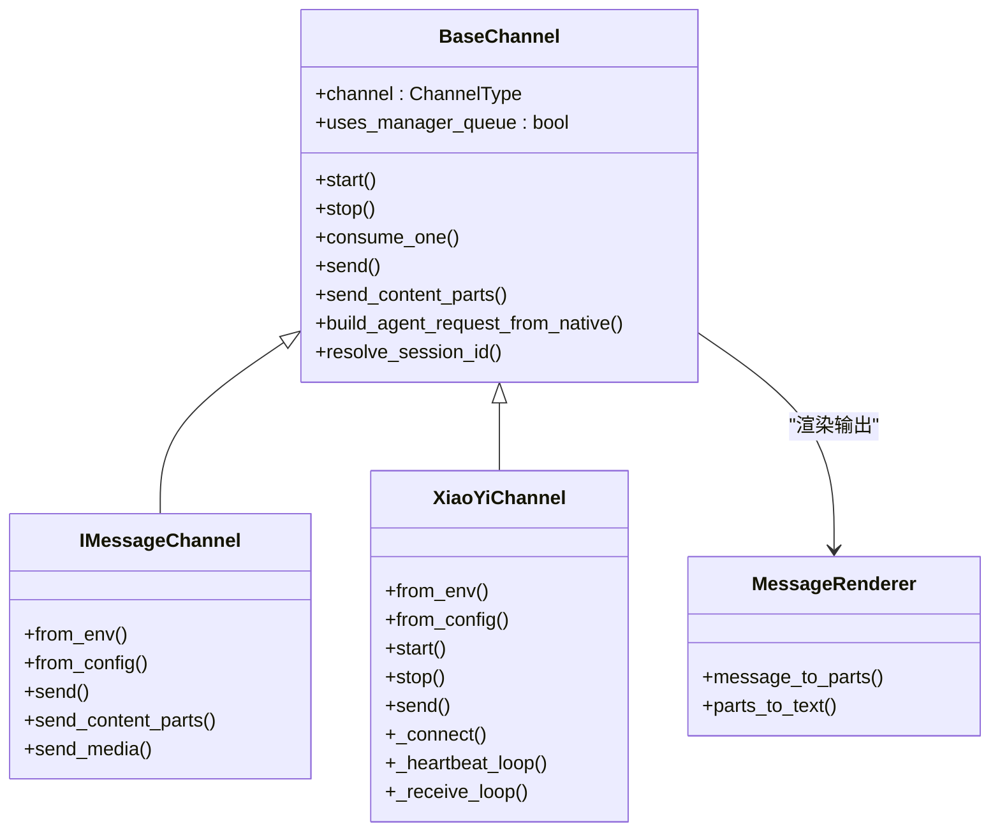
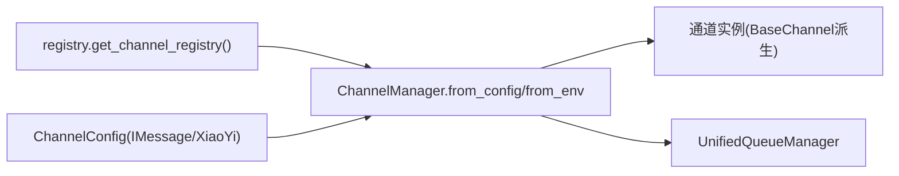

# 专用平台集成

<cite>
**本文档引用的文件**
- [imessage/channel.py](file://src/qwenpaw/app/channels/imessage/channel.py)
- [xiaoyi/channel.py](file://src/qwenpaw/app/channels/xiaoyi/channel.py)
- [xiaoyi/auth.py](file://src/qwenpaw/app/channels/xiaoyi/auth.py)
- [xiaoyi/constants.py](file://src/qwenpaw/app/channels/xiaoyi/constants.py)
- [xiaoyi/utils.py](file://src/qwenpaw/app/channels/xiaoyi/utils.py)
- [base.py](file://src/qwenpaw/app/channels/base.py)
- [manager.py](file://src/qwenpaw/app/channels/manager.py)
- [registry.py](file://src/qwenpaw/app/channels/registry.py)
- [config.py](file://src/qwenpaw/config/config.py)
- [unified_queue_manager.py](file://src/qwenpaw/app/channels/unified_queue_manager.py)
- [renderer.py](file://src/qwenpaw/app/channels/renderer.py)
- [channels_cmd.py](file://src/qwenpaw/cli/channels_cmd.py)
</cite>

## 目录
1. [简介](#简介)
2. [项目结构](#项目结构)
3. [核心组件](#核心组件)
4. [架构总览](#架构总览)
5. [详细组件分析](#详细组件分析)
6. [依赖关系分析](#依赖关系分析)
7. [性能考虑](#性能考虑)
8. [故障排除指南](#故障排除指南)
9. [结论](#结论)
10. [附录](#附录)

## 简介
本指南面向需要在QwenPaw中集成专用通讯平台（以iMessage与小艺XiaoYi为例）的开发者，系统阐述平台适配器设计、认证机制、消息格式与转换逻辑、配置方式以及兼容性与限制。文档基于仓库中的实际实现进行分析，并提供可操作的集成步骤与最佳实践。

## 项目结构
QwenPaw采用“通道（Channel）+ 管理器（ChannelManager）+ 统一队列管理（UnifiedQueueManager）”的解耦架构：
- 通道层：每个平台实现一个继承自BaseChannel的类，负责从平台拉取消息、发送消息、会话解析与内容转换。
- 管理器层：ChannelManager统一调度各通道，注入统一的处理流程（process），并通过队列管理并发与去抖。
- 队列层：UnifiedQueueManager按（通道, 会话, 优先级）三元组维护独立队列，支持动态消费者创建与空闲清理。

图示来源
- [base.py:70-120](file://src/qwenpaw/app/channels/base.py#L70-L120)
- [manager.py:68-106](file://src/qwenpaw/app/channels/manager.py#L68-L106)
- [unified_queue_manager.py:60-118](file://src/qwenpaw/app/channels/unified_queue_manager.py#L60-L118)
- [renderer.py:78-86](file://src/qwenpaw/app/channels/renderer.py#L78-L86)
- [config.py:208-228](file://src/qwenpaw/config/config.py#L208-L228)

章节来源
- [base.py:70-120](file://src/qwenpaw/app/channels/base.py#L70-L120)
- [manager.py:68-106](file://src/qwenpaw/app/channels/manager.py#L68-L106)
- [unified_queue_manager.py:60-118](file://src/qwenpaw/app/channels/unified_queue_manager.py#L60-L118)
- [renderer.py:78-86](file://src/qwenpaw/app/channels/renderer.py#L78-L86)
- [config.py:208-228](file://src/qwenpaw/config/config.py#L208-L228)

## 核心组件
- BaseChannel：定义通道通用接口（启动/停止、消息消费、请求构建、渲染风格等），并提供去抖、合并、允许列表等通用能力。
- ChannelManager：从环境或配置加载通道，注入统一process，通过队列管理器分发消息。
- UnifiedQueueManager：按（通道, 会话, 优先级）创建队列与消费者，支持动态创建、空闲清理与指标统计。
- MessageRenderer：将Agent消息转换为平台可发送的内容部件（文本/图片/音频/视频/文件/拒绝），并支持过滤工具输出与思考内容。

章节来源
- [base.py:70-120](file://src/qwenpaw/app/channels/base.py#L70-L120)
- [manager.py:68-106](file://src/qwenpaw/app/channels/manager.py#L68-L106)
- [unified_queue_manager.py:60-118](file://src/qwenpaw/app/channels/unified_queue_manager.py#L60-L118)
- [renderer.py:78-86](file://src/qwenpaw/app/channels/renderer.py#L78-L86)

## 架构总览
下图展示从平台到Agent再到平台的完整链路，包括iMessage与XiaoYi的关键节点。

图示来源
- [imessage/channel.py:231-306](file://src/qwenpaw/app/channels/imessage/channel.py#L231-L306)
- [xiaoyi/channel.py:350-448](file://src/qwenpaw/app/channels/xiaoyi/channel.py#L350-L448)
- [manager.py:39-66](file://src/qwenpaw/app/channels/manager.py#L39-L66)
- [unified_queue_manager.py:119-164](file://src/qwenpaw/app/channels/unified_queue_manager.py#L119-L164)
- [renderer.py:87-165](file://src/qwenpaw/app/channels/renderer.py#L87-L165)

## 详细组件分析

### iMessage 适配器
- 认证与运行机制
  - 依赖外部命令行工具 imsg，启动时校验二进制是否存在；发送消息通过子进程调用 imsg 的 send 子命令。
  - 通过轮询 macOS 系统 Messages 数据库（chat.db）读取新消息，使用只读连接避免写冲突。
- 消息格式与转换
  - 将数据库记录转换为原生负载（包含 sender、内容部件、meta），再构建 AgentRequest。
  - 发送时支持文本与媒体分离发送；媒体支持本地路径、HTTP/HTTPS URL与data URL（含base64），并进行大小限制与安全清洗。
- 安全与策略
  - 支持允许列表/拒绝消息策略、私聊/群聊策略、@提及策略。
  - 文件名清洗防止路径穿越；base64数据先做近似解码长度估算，再严格验证与解码。
- 关键配置项（环境变量）
  - IMESSAGE_CHANNEL_ENABLED、IMESSAGE_DB_PATH、IMESSAGE_POLL_SEC、IMESSAGE_BOT_PREFIX、IMESSAGE_MEDIA_DIR、IMESSAGE_MAX_DECODED_SIZE、IMESSAGE_DM_POLICY、IMESSAGE_GROUP_POLICY、IMESSAGE_ALLOW_FROM、IMESSAGE_DENY_MESSAGE、IMESSAGE_REQUIRE_MENTION。

图示来源
- [imessage/channel.py:231-306](file://src/qwenpaw/app/channels/imessage/channel.py#L231-L306)
- [imessage/channel.py:308-324](file://src/qwenpaw/app/channels/imessage/channel.py#L308-L324)
- [imessage/channel.py:354-443](file://src/qwenpaw/app/channels/imessage/channel.py#L354-L443)

章节来源
- [imessage/channel.py:94-159](file://src/qwenpaw/app/channels/imessage/channel.py#L94-L159)
- [imessage/channel.py:161-206](file://src/qwenpaw/app/channels/imessage/channel.py#L161-L206)
- [imessage/channel.py:231-306](file://src/qwenpaw/app/channels/imessage/channel.py#L231-L306)
- [imessage/channel.py:308-324](file://src/qwenpaw/app/channels/imessage/channel.py#L308-L324)
- [imessage/channel.py:354-443](file://src/qwenpaw/app/channels/imessage/channel.py#L354-L443)
- [imessage/channel.py:444-697](file://src/qwenpaw/app/channels/imessage/channel.py#L444-L697)

### 小艺XiaoYi 适配器
- 认证机制
  - 使用AK/SK生成签名，通过WebSocket头部传递：x-access-key、x-sign、x-ts、x-agent-id。
  - 时间戳精确到毫秒，签名算法为HMAC-SHA256后Base64编码。
- 协议与消息模型
  - A2A（Agent-to-Agent）协议，服务端推送message/stream，客户端需返回JSON-RPC响应（agent_response）。
  - 支持任务取消（tasks/cancel）、上下文清理（clearContext）等控制消息。
  - 大文本按TEXT_CHUNK_LIMIT切片发送，避免WebSocket断开。
- 媒体处理
  - 下载远端文件到本地媒体目录，自动推断扩展名；支持图片与非图片类型分别映射为ImageContent/FileContent。
- 连接与容错
  - 心跳保活（HEARTBEAT_INTERVAL），失败重连（RECONNECT_DELAYS），最大重试次数限制。
  - 同一agent_id复用已有连接，动态更新渲染策略设置。
- 关键配置项（环境变量/配置对象）
  - XIAOYI_CHANNEL_ENABLED、XIAOYI_AK、XIAOYI_SK、XIAOYI_AGENT_ID、XIAOYI_WS_URL、XIAOYI_MEDIA_DIR。

图示来源
- [xiaoyi/auth.py:15-51](file://src/qwenpaw/app/channels/xiaoyi/auth.py#L15-L51)
- [xiaoyi/channel.py:350-448](file://src/qwenpaw/app/channels/xiaoyi/channel.py#L350-L448)
- [xiaoyi/channel.py:449-556](file://src/qwenpaw/app/channels/xiaoyi/channel.py#L449-L556)
- [xiaoyi/channel.py:686-720](file://src/qwenpaw/app/channels/xiaoyi/channel.py#L686-L720)
- [xiaoyi/constants.py:7-23](file://src/qwenpaw/app/channels/xiaoyi/constants.py#L7-L23)

章节来源
- [xiaoyi/auth.py:15-51](file://src/qwenpaw/app/channels/xiaoyi/auth.py#L15-L51)
- [xiaoyi/channel.py:128-202](file://src/qwenpaw/app/channels/xiaoyi/channel.py#L128-L202)
- [xiaoyi/channel.py:212-287](file://src/qwenpaw/app/channels/xiaoyi/channel.py#L212-L287)
- [xiaoyi/channel.py:350-448](file://src/qwenpaw/app/channels/xiaoyi/channel.py#L350-L448)
- [xiaoyi/channel.py:449-556](file://src/qwenpaw/app/channels/xiaoyi/channel.py#L449-L556)
- [xiaoyi/channel.py:686-720](file://src/qwenpaw/app/channels/xiaoyi/channel.py#L686-L720)
- [xiaoyi/constants.py:7-23](file://src/qwenpaw/app/channels/xiaoyi/constants.py#L7-L23)
- [xiaoyi/utils.py:11-54](file://src/qwenpaw/app/channels/xiaoyi/utils.py#L11-L54)

### 通用适配器设计与消息转换
- 会话解析与去抖
  - BaseChannel提供resolve_session_id默认策略（channel:user_id），并支持按会话合并原生负载、按时间窗口去抖。
- 内容部件与渲染
  - Renderer将消息内容转换为Text/Image/Video/Audio/File/Refusal等部件，支持过滤工具输出与思考块。
- 允许列表与策略
  - 支持私聊/群聊策略、允许列表、拒绝消息、@提及要求等。

图示来源
- [base.py:70-120](file://src/qwenpaw/app/channels/base.py#L70-L120)
- [base.py:557-618](file://src/qwenpaw/app/channels/base.py#L557-L618)
- [imessage/channel.py:39-93](file://src/qwenpaw/app/channels/imessage/channel.py#L39-L93)
- [xiaoyi/channel.py:55-88](file://src/qwenpaw/app/channels/xiaoyi/channel.py#L55-L88)
- [renderer.py:78-86](file://src/qwenpaw/app/channels/renderer.py#L78-L86)

章节来源
- [base.py:283-318](file://src/qwenpaw/app/channels/base.py#L283-L318)
- [base.py:557-618](file://src/qwenpaw/app/channels/base.py#L557-L618)
- [renderer.py:87-165](file://src/qwenpaw/app/channels/renderer.py#L87-L165)

## 依赖关系分析
- 注册与发现
  - 通道注册表将内置通道键映射到具体类，支持自定义通道目录扫描。
- 管理器装配
  - ChannelManager根据可用通道与配置实例化通道，注入统一process与工作区，设置队列回调。
- 配置体系
  - ChannelConfig集中定义各通道配置模型，IMessageChannelConfig与XiaoYiConfig分别对应iMessage与XiaoYi。

图示来源
- [registry.py:190-195](file://src/qwenpaw/app/channels/registry.py#L190-L195)
- [manager.py:108-213](file://src/qwenpaw/app/channels/manager.py#L108-L213)
- [config.py:208-228](file://src/qwenpaw/config/config.py#L208-L228)

章节来源
- [registry.py:190-195](file://src/qwenpaw/app/channels/registry.py#L190-L195)
- [manager.py:108-213](file://src/qwenpaw/app/channels/manager.py#L108-L213)
- [config.py:208-228](file://src/qwenpaw/config/config.py#L208-L228)

## 性能考虑
- 去抖与批处理
  - BaseChannel对无文本内容进行缓冲合并，减少重复处理；UnifiedQueueManager按会话+优先级隔离，避免串扰。
- 并发与清理
  - 动态消费者创建，空闲队列定时清理，降低资源占用。
- iMessage媒体传输
  - 对base64数据先做近似长度估算，再严格解码，避免内存峰值；文件名清洗与扩展名推断提升稳定性。
- XiaoYi大消息拆分
  - 文本超过TEXT_CHUNK_LIMIT自动切片，避免连接断开。

章节来源
- [base.py:249-282](file://src/qwenpaw/app/channels/base.py#L249-L282)
- [unified_queue_manager.py:119-164](file://src/qwenpaw/app/channels/unified_queue_manager.py#L119-L164)
- [imessage/channel.py:588-645](file://src/qwenpaw/app/channels/imessage/channel.py#L588-L645)
- [xiaoyi/constants.py:20-23](file://src/qwenpaw/app/channels/xiaoyi/constants.py#L20-L23)

## 故障排除指南
- iMessage
  - 缺少 imsg 可执行文件：安装后通过 which 验证路径。
  - 数据库权限：确保应用有访问 ~/Library/Messages/chat.db 的权限。
  - 媒体发送失败：检查媒体目录可写、URL可达、base64大小限制。
- XiaoYi
  - 认证失败：核对AK/SK是否正确、时间戳精度、签名算法。
  - 连接断开：关注心跳与重连日志，确认网络与服务器地址。
  - 大消息异常：检查TEXT_CHUNK_LIMIT与服务端限制。
- 通用
  - 允许列表/策略不生效：检查DM/群组策略、允许列表、@提及配置。
  - 队列堆积：查看UnifiedQueueManager指标，调整优先级或清理空闲队列。

章节来源
- [imessage/channel.py:161-172](file://src/qwenpaw/app/channels/imessage/channel.py#L161-L172)
- [xiaoyi/auth.py:15-51](file://src/qwenpaw/app/channels/xiaoyi/auth.py#L15-L51)
- [xiaoyi/channel.py:686-720](file://src/qwenpaw/app/channels/xiaoyi/channel.py#L686-L720)
- [base.py:283-318](file://src/qwenpaw/app/channels/base.py#L283-L318)
- [unified_queue_manager.py:430-472](file://src/qwenpaw/app/channels/unified_queue_manager.py#L430-L472)

## 结论
QwenPaw通过标准化的通道接口与统一的队列管理，实现了对iMessage与XiaoYi等专用平台的高效适配。iMessage侧重于本地数据库轮询与系统命令交互，XiaoYi则采用WebSocket+AK/SK认证与A2A协议。借助渲染器与策略系统，平台间的消息格式差异被有效屏蔽，便于扩展更多专用平台。

## 附录

### 配置示例与平台要求
- iMessage
  - 环境变量：IMESSAGE_CHANNEL_ENABLED、IMESSAGE_DB_PATH、IMESSAGE_POLL_SEC、IMESSAGE_BOT_PREFIX、IMESSAGE_MEDIA_DIR、IMESSAGE_MAX_DECODED_SIZE、IMESSAGE_DM_POLICY、IMESSAGE_GROUP_POLICY、IMESSAGE_ALLOW_FROM、IMESSAGE_DENY_MESSAGE、IMESSAGE_REQUIRE_MENTION。
  - CLI交互式配置入口：configure_imessage。
- XiaoYi
  - 环境变量：XIAOYI_CHANNEL_ENABLED、XIAOYI_AK、XIAOYI_SK、XIAOYI_AGENT_ID、XIAOYI_WS_URL、XIAOYI_MEDIA_DIR。
  - 配置对象：XiaoYiConfig。
- 通用通道配置
  - BaseChannelConfig：enabled、bot_prefix、filter_tool_messages、filter_thinking、dm_policy、group_policy、allow_from、deny_message、require_mention。

章节来源
- [imessage/channel.py:94-159](file://src/qwenpaw/app/channels/imessage/channel.py#L94-L159)
- [channels_cmd.py:194-633](file://src/qwenpaw/cli/channels_cmd.py#L194-L633)
- [config.py:39-51](file://src/qwenpaw/config/config.py#L39-L51)
- [config.py:53-60](file://src/qwenpaw/config/config.py#L53-L60)
- [config.py:182-190](file://src/qwenpaw/config/config.py#L182-L190)

### 平台兼容性与替代方案
- 兼容性
  - iMessage：依赖macOS系统Messages数据库与imsg命令行工具，适合Mac用户场景。
  - XiaoYi：依赖WebSocket与华为云服务，适合企业内部平台。
- 替代方案
  - 若iMessage不可用，可考虑通过第三方IM SDK或Webhook桥接。
  - 若XiaoYi不可用，可参考其认证与A2A协议模式，对接其他WebSocket+AK/SK平台。

章节来源
- [imessage/channel.py:161-172](file://src/qwenpaw/app/channels/imessage/channel.py#L161-L172)
- [xiaoyi/auth.py:15-51](file://src/qwenpaw/app/channels/xiaoyi/auth.py#L15-L51)
- [xiaoyi/channel.py:350-448](file://src/qwenpaw/app/channels/xiaoyi/channel.py#L350-L448)