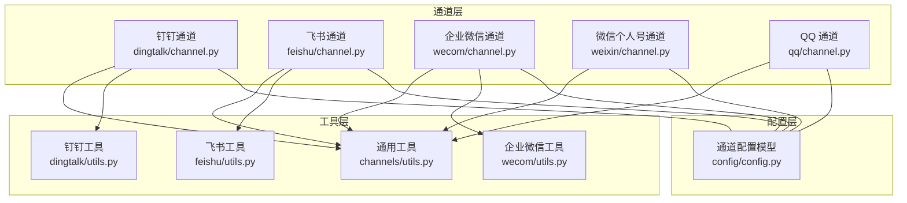
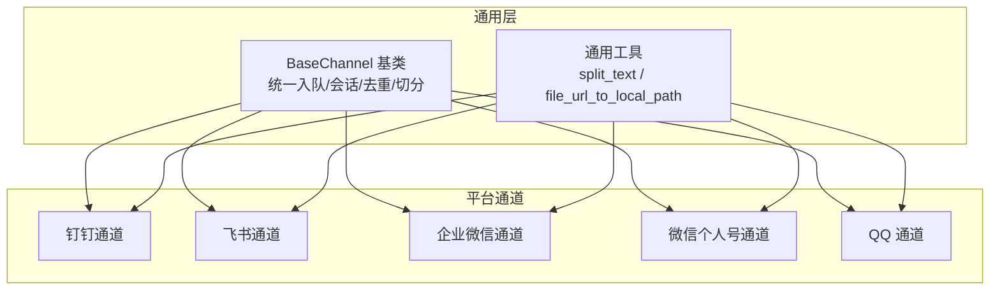
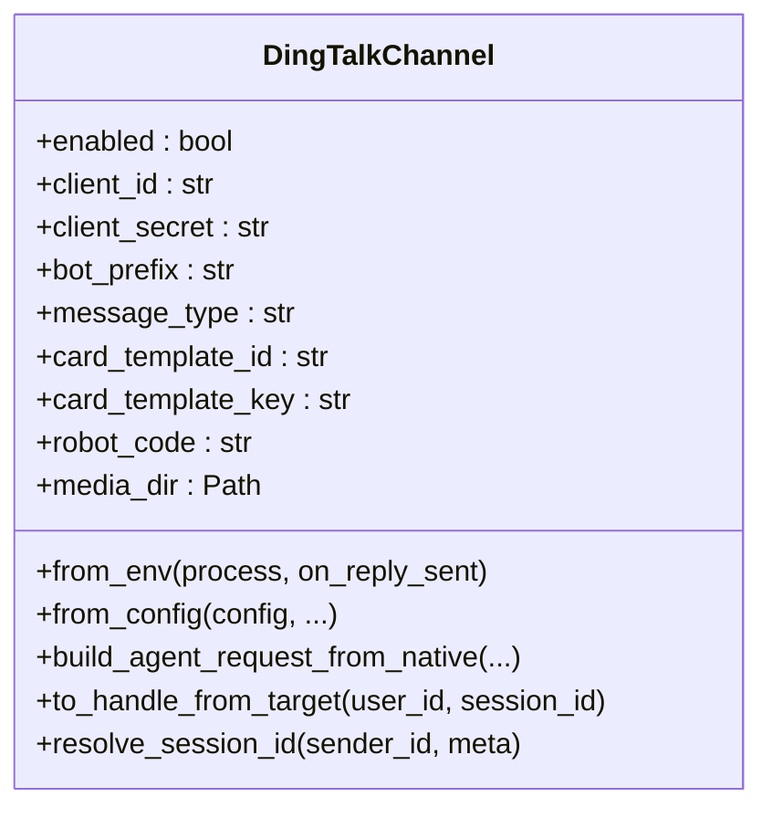
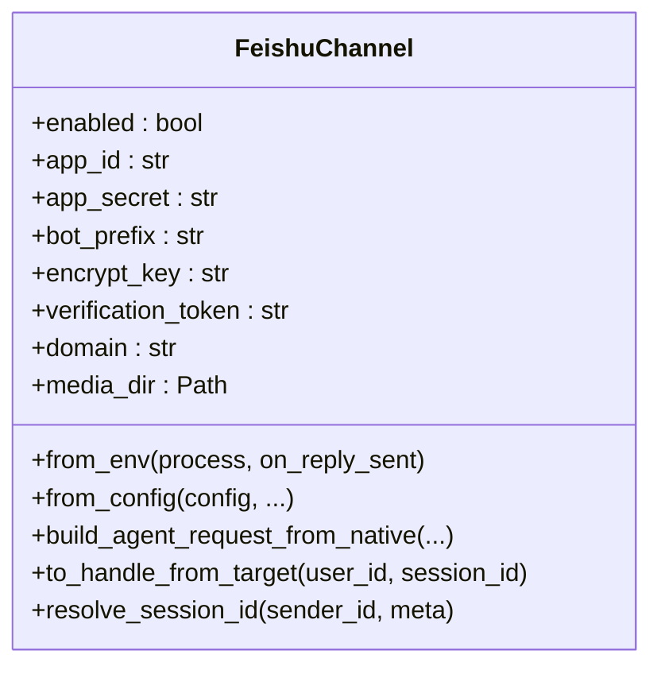
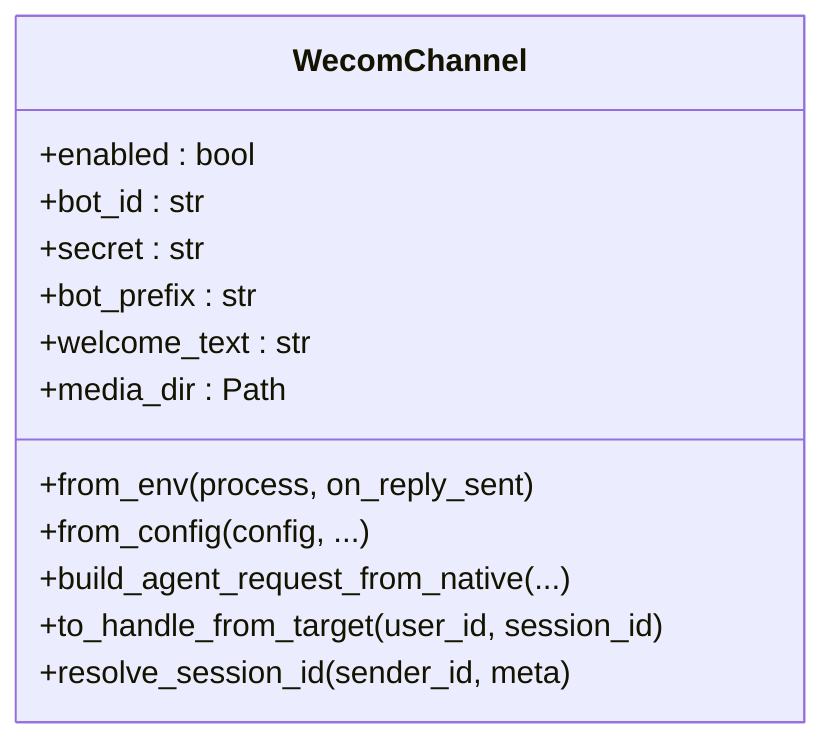
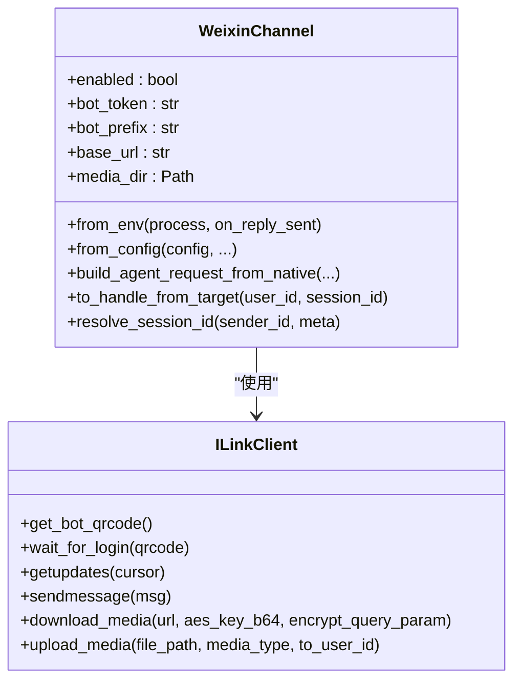
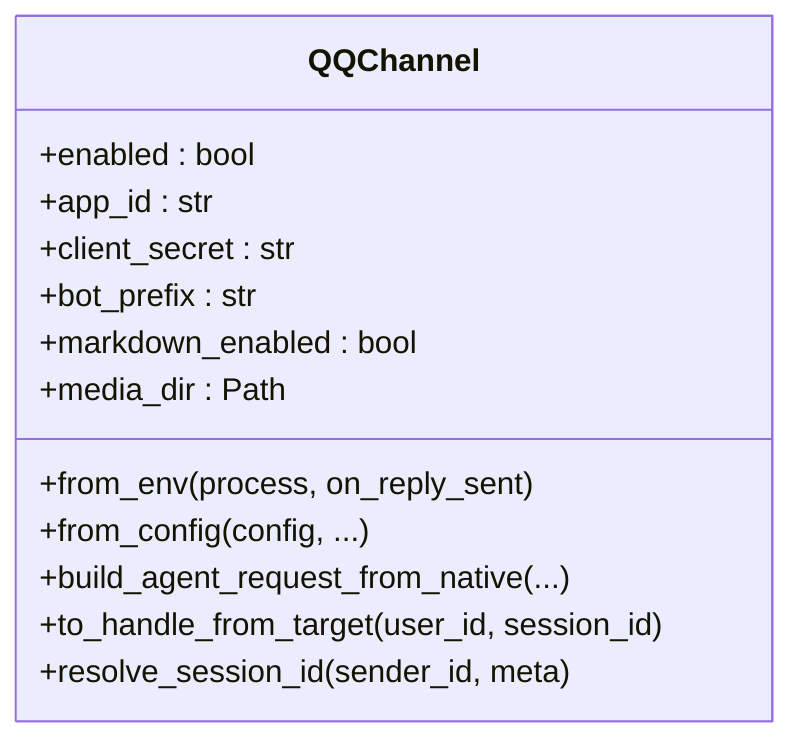
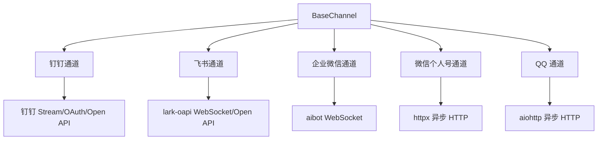

# 主流平台集成

<cite>
**本文引用的文件**
- [src/qwenpaw/app/channels/dingtalk/channel.py](file://src/qwenpaw/app/channels/dingtalk/channel.py)
- [src/qwenpaw/app/channels/dingtalk/constants.py](file://src/qwenpaw/app/channels/dingtalk/constants.py)
- [src/qwenpaw/app/channels/dingtalk/utils.py](file://src/qwenpaw/app/channels/dingtalk/utils.py)
- [src/qwenpaw/app/channels/feishu/channel.py](file://src/qwenpaw/app/channels/feishu/channel.py)
- [src/qwenpaw/app/channels/feishu/constants.py](file://src/qwenpaw/app/channels/feishu/constants.py)
- [src/qwenpaw/app/channels/feishu/utils.py](file://src/qwenpaw/app/channels/feishu/utils.py)
- [src/qwenpaw/app/channels/wecom/channel.py](file://src/qwenpaw/app/channels/wecom/channel.py)
- [src/qwenpaw/app/channels/wecom/utils.py](file://src/qwenpaw/app/channels/wecom/utils.py)
- [src/qwenpaw/app/channels/weixin/channel.py](file://src/qwenpaw/app/channels/weixin/channel.py)
- [src/qwenpaw/app/channels/weixin/client.py](file://src/qwenpaw/app/channels/weixin/client.py)
- [src/qwenpaw/app/channels/qq/channel.py](file://src/qwenpaw/app/channels/qq/channel.py)
- [src/qwenpaw/app/channels/utils.py](file://src/qwenpaw/app/channels/utils.py)
- [src/qwenpaw/config/config.py](file://src/qwenpaw/config/config.py)
</cite>

## 目录
1. [简介](#简介)
2. [项目结构](#项目结构)
3. [核心组件](#核心组件)
4. [架构总览](#架构总览)
5. [详细组件分析](#详细组件分析)
6. [依赖分析](#依赖分析)
7. [性能考虑](#性能考虑)
8. [故障排查指南](#故障排查指南)
9. [结论](#结论)
10. [附录](#附录)

## 简介
本指南面向希望在 QwenPaw 中集成主流中文通讯平台（钉钉、飞书、企业微信、微信个人号、QQ）的开发者与运维人员。文档聚焦以下方面：
- 平台认证流程与接入要点
- API 调用方式与权限配置
- 平台特有能力：消息推送、用户身份校验、群组管理、文件传输
- 配置项与环境变量参考
- 兼容性与最佳实践

## 项目结构
QwenPaw 将各平台通道抽象为独立模块，统一通过基类与通用工具进行编排：
- 通道层：各平台通道实现（钉钉、飞书、企业微信、微信个人号、QQ）
- 工具层：文本切分、本地文件路径解析等通用工具
- 配置层：Pydantic 模型定义各通道的配置字段

图表来源
- [src/qwenpaw/app/channels/dingtalk/channel.py](file://src/qwenpaw/app/channels/dingtalk/channel.py)
- [src/qwenpaw/app/channels/feishu/channel.py](file://src/qwenpaw/app/channels/feishu/channel.py)
- [src/qwenpaw/app/channels/wecom/channel.py](file://src/qwenpaw/app/channels/wecom/channel.py)
- [src/qwenpaw/app/channels/weixin/channel.py](file://src/qwenpaw/app/channels/weixin/channel.py)
- [src/qwenpaw/app/channels/qq/channel.py](file://src/qwenpaw/app/channels/qq/channel.py)
- [src/qwenpaw/app/channels/utils.py](file://src/qwenpaw/app/channels/utils.py)
- [src/qwenpaw/app/channels/dingtalk/utils.py](file://src/qwenpaw/app/channels/dingtalk/utils.py)
- [src/qwenpaw/app/channels/feishu/utils.py](file://src/qwenpaw/app/channels/feishu/utils.py)
- [src/qwenpaw/app/channels/wecom/utils.py](file://src/qwenpaw/app/channels/wecom/utils.py)
- [src/qwenpaw/config/config.py](file://src/qwenpaw/config/config.py)

章节来源
- [src/qwenpaw/app/channels/dingtalk/channel.py](file://src/qwenpaw/app/channels/dingtalk/channel.py)
- [src/qwenpaw/app/channels/feishu/channel.py](file://src/qwenpaw/app/channels/feishu/channel.py)
- [src/qwenpaw/app/channels/wecom/channel.py](file://src/qwenpaw/app/channels/wecom/channel.py)
- [src/qwenpaw/app/channels/weixin/channel.py](file://src/qwenpaw/app/channels/weixin/channel.py)
- [src/qwenpaw/app/channels/qq/channel.py](file://src/qwenpaw/app/channels/qq/channel.py)
- [src/qwenpaw/app/channels/utils.py](file://src/qwenpaw/app/channels/utils.py)
- [src/qwenpaw/config/config.py](file://src/qwenpaw/config/config.py)

## 核心组件
- 通道基类与通用能力
  - 统一的消息入队、会话标识、去重、媒体下载、文本切分等
- 各平台通道
  - 钉钉：事件流 + Webhook 回推；卡片与富文本支持
  - 飞书：WebSocket 接收 + Open API 发送；富文本卡片
  - 企业微信：WebSocket 接收 + 流式回推；媒体上传
  - 微信个人号：长轮询接收 + HTTP 发送；加密媒体下载
  - QQ：WebSocket 接收 + HTTP 发送；富媒体上传
- 配置模型
  - Pydantic 定义各通道的配置字段与默认值

章节来源
- [src/qwenpaw/app/channels/utils.py](file://src/qwenpaw/app/channels/utils.py)
- [src/qwenpaw/config/config.py](file://src/qwenpaw/config/config.py)

## 架构总览
下图展示通道层与通用工具层的关系，以及各平台通道的典型数据流。

图表来源
- [src/qwenpaw/app/channels/utils.py](file://src/qwenpaw/app/channels/utils.py)
- [src/qwenpaw/app/channels/dingtalk/channel.py](file://src/qwenpaw/app/channels/dingtalk/channel.py)
- [src/qwenpaw/app/channels/feishu/channel.py](file://src/qwenpaw/app/channels/feishu/channel.py)
- [src/qwenpaw/app/channels/wecom/channel.py](file://src/qwenpaw/app/channels/wecom/channel.py)
- [src/qwenpaw/app/channels/weixin/channel.py](file://src/qwenpaw/app/channels/weixin/channel.py)
- [src/qwenpaw/app/channels/qq/channel.py](file://src/qwenpaw/app/channels/qq/channel.py)

## 详细组件分析

### 钉钉通道（DingTalk）
- 认证与接入
  - 使用客户端凭据与机器人凭据；支持卡片模板与自动布局
  - 支持通过会话 Webhook 进行主动推送
- 能力特性
  - 文本、图片、语音、文件消息；AI 卡片流式更新
  - 会话去重、消息合并、会话 Webhook 存储与持久化
- 关键配置
  - 应用 ID、应用密钥、机器人编码、消息类型、卡片模板、媒体目录、策略开关等
- 环境变量
  - DINGTALK_CHANNEL_ENABLED、DINGTALK_CLIENT_ID、DINGTALK_CLIENT_SECRET、DINGTALK_BOT_PREFIX、DINGTALK_MESSAGE_TYPE、DINGTALK_CARD_TEMPLATE_ID、DINGTALK_CARD_TEMPLATE_KEY、DINGTALK_ROBOT_CODE、DINGTALK_MEDIA_DIR、DINGTALK_DM_POLICY、DINGTALK_GROUP_POLICY、DINGTALK_ALLOW_FROM、DINGTALK_DENY_MESSAGE、DINGTALK_REQUIRE_MENTION、DINGTALK_CARD_AUTO_LAYOUT

图表来源
- [src/qwenpaw/app/channels/dingtalk/channel.py](file://src/qwenpaw/app/channels/dingtalk/channel.py)
- [src/qwenpaw/config/config.py](file://src/qwenpaw/config/config.py)

章节来源
- [src/qwenpaw/app/channels/dingtalk/channel.py](file://src/qwenpaw/app/channels/dingtalk/channel.py)
- [src/qwenpaw/app/channels/dingtalk/constants.py](file://src/qwenpaw/app/channels/dingtalk/constants.py)
- [src/qwenpaw/app/channels/dingtalk/utils.py](file://src/qwenpaw/app/channels/dingtalk/utils.py)
- [src/qwenpaw/config/config.py](file://src/qwenpaw/config/config.py)

### 飞书通道（Feishu/Lark）
- 认证与接入
  - 使用应用 ID/Secret；可选加密密钥与验证令牌；支持国际版域名
- 能力特性
  - WebSocket 接收 + Open API 发送；富文本与交互卡片
  - 用户昵称缓存、消息去重、会话短 ID、时钟偏移修正
- 关键配置
  - app_id、app_secret、encrypt_key、verification_token、domain、media_dir、策略开关等
- 环境变量
  - FEISHU_CHANNEL_ENABLED、FEISHU_APP_ID、FEISHU_APP_SECRET、FEISHU_BOT_PREFIX、FEISHU_ENCRYPT_KEY、FEISHU_VERIFICATION_TOKEN、FEISHU_MEDIA_DIR、FEISHU_DM_POLICY、FEISHU_GROUP_POLICY、FEISHU_ALLOW_FROM、FEISHU_DENY_MESSAGE、FEISHU_REQUIRE_MENTION、FEISHU_DOMAIN

图表来源
- [src/qwenpaw/app/channels/feishu/channel.py](file://src/qwenpaw/app/channels/feishu/channel.py)
- [src/qwenpaw/config/config.py](file://src/qwenpaw/config/config.py)

章节来源
- [src/qwenpaw/app/channels/feishu/channel.py](file://src/qwenpaw/app/channels/feishu/channel.py)
- [src/qwenpaw/app/channels/feishu/constants.py](file://src/qwenpaw/app/channels/feishu/constants.py)
- [src/qwenpaw/app/channels/feishu/utils.py](file://src/qwenpaw/app/channels/feishu/utils.py)
- [src/qwenpaw/config/config.py](file://src/qwenpaw/config/config.py)

### 企业微信通道（WeCom）
- 认证与接入
  - 使用 bot_id/secret；通过 WebSocket 接收与流式回推
- 能力特性
  - 文本、图片、语音、视频、文件；混合消息；媒体压缩与分块上传
  - 欢迎语、进入群聊事件、会话去重
- 关键配置
  - bot_id、secret、welcome_text、media_dir、策略开关、重连次数等
- 环境变量
  - WECOM_CHANNEL_ENABLED、WECOM_BOT_ID、WECOM_SECRET、WECOM_BOT_PREFIX、WECOM_MEDIA_DIR、WECOM_DM_POLICY、WECOM_GROUP_POLICY、WECOM_ALLOW_FROM、WECOM_DENY_MESSAGE、WECOM_MAX_RECONNECT_ATTEMPTS

图表来源
- [src/qwenpaw/app/channels/wecom/channel.py](file://src/qwenpaw/app/channels/wecom/channel.py)
- [src/qwenpaw/config/config.py](file://src/qwenpaw/config/config.py)

章节来源
- [src/qwenpaw/app/channels/wecom/channel.py](file://src/qwenpaw/app/channels/wecom/channel.py)
- [src/qwenpaw/app/channels/wecom/utils.py](file://src/qwenpaw/app/channels/wecom/utils.py)
- [src/qwenpaw/config/config.py](file://src/qwenpaw/config/config.py)

### 微信个人号通道（WeChat iLink Bot）
- 认证与接入
  - 支持直传令牌或二维码登录；登录成功后持久化令牌
- 能力特性
  - 长轮询接收 + HTTP 发送；文本、图片、语音（ASR）、文件；打字指示器
  - 加密媒体下载与上传参数生成
- 关键配置
  - bot_token、bot_token_file、base_url、media_dir、策略开关等
- 环境变量
  - WEIXIN_CHANNEL_ENABLED、WEIXIN_BOT_TOKEN、WEIXIN_BOT_TOKEN_FILE、WEIXIN_BASE_URL、WEIXIN_BOT_PREFIX、WEIXIN_MEDIA_DIR、WEIXIN_DM_POLICY、WEIXIN_GROUP_POLICY、WEIXIN_ALLOW_FROM、WEIXIN_DENY_MESSAGE

图表来源
- [src/qwenpaw/app/channels/weixin/channel.py](file://src/qwenpaw/app/channels/weixin/channel.py)
- [src/qwenpaw/app/channels/weixin/client.py](file://src/qwenpaw/app/channels/weixin/client.py)
- [src/qwenpaw/config/config.py](file://src/qwenpaw/config/config.py)

章节来源
- [src/qwenpaw/app/channels/weixin/channel.py](file://src/qwenpaw/app/channels/weixin/channel.py)
- [src/qwenpaw/app/channels/weixin/client.py](file://src/qwenpaw/app/channels/weixin/client.py)
- [src/qwenpaw/config/config.py](file://src/qwenpaw/config/config.py)

### QQ 通道
- 认证与接入
  - 使用 app_id/client_secret 获取访问令牌；WebSocket 接收 + HTTP 发送
- 能力特性
  - 文本、图片、视频、音频、文件；富媒体上传；URL 过滤与回退策略
  - 心跳控制、断线重连、消息序号、速率限制
- 关键配置
  - app_id、client_secret、markdown_enabled、media_dir、策略开关、最大重连次数等
- 环境变量
  - QQ_CHANNEL_ENABLED、QQ_APP_ID、QQ_CLIENT_SECRET、QQ_BOT_PREFIX、QQ_MARKDOWN_ENABLED、QQ_API_BASE、QQ_MEDIA_DIR、QQ_MAX_RECONNECT_ATTEMPTS

图表来源
- [src/qwenpaw/app/channels/qq/channel.py](file://src/qwenpaw/app/channels/qq/channel.py)
- [src/qwenpaw/config/config.py](file://src/qwenpaw/config/config.py)

章节来源
- [src/qwenpaw/app/channels/qq/channel.py](file://src/qwenpaw/app/channels/qq/channel.py)
- [src/qwenpaw/config/config.py](file://src/qwenpaw/config/config.py)

## 依赖分析
- 通道间耦合
  - 各通道均继承自统一基类，共享入队、会话、去重、文本切分等通用逻辑
- 外部依赖
  - 钉钉：Stream SDK、OAuth/Open API 客户端
  - 飞书：WebSocket SDK（lark-oapi）、Open API 客户端
  - 企业微信：aibot WebSocket SDK
  - 微信个人号：HTTP 客户端与 iLink API
  - QQ：aiohttp、WebSocket 与 HTTP API
- 依赖可视化

图表来源
- [src/qwenpaw/app/channels/dingtalk/channel.py](file://src/qwenpaw/app/channels/dingtalk/channel.py)
- [src/qwenpaw/app/channels/feishu/channel.py](file://src/qwenpaw/app/channels/feishu/channel.py)
- [src/qwenpaw/app/channels/wecom/channel.py](file://src/qwenpaw/app/channels/wecom/channel.py)
- [src/qwenpaw/app/channels/weixin/channel.py](file://src/qwenpaw/app/channels/weixin/channel.py)
- [src/qwenpaw/app/channels/qq/channel.py](file://src/qwenpaw/app/channels/qq/channel.py)

章节来源
- [src/qwenpaw/app/channels/dingtalk/channel.py](file://src/qwenpaw/app/channels/dingtalk/channel.py)
- [src/qwenpaw/app/channels/feishu/channel.py](file://src/qwenpaw/app/channels/feishu/channel.py)
- [src/qwenpaw/app/channels/wecom/channel.py](file://src/qwenpaw/app/channels/wecom/channel.py)
- [src/qwenpaw/app/channels/weixin/channel.py](file://src/qwenpaw/app/channels/weixin/channel.py)
- [src/qwenpaw/app/channels/qq/channel.py](file://src/qwenpaw/app/channels/qq/channel.py)

## 性能考虑
- 消息去重与合并
  - 钉钉：基于消息 ID 的去重集合，避免重复处理
  - 飞书：维护已处理消息 ID 队列，超限自动淘汰
  - 企业微信：同机制，结合会话去重
- 文本切分
  - 通用工具按长度切分，保留代码块完整性
- 媒体处理
  - 企业微信对图片进行压缩以满足大小限制
  - 微信个人号对媒体进行 AES 解密与落盘
- WebSocket 心跳与重连
  - QQ 提供心跳控制器与指数退避重连策略
- 速率限制与并发
  - 配置层提供全局 LLM 并发与 QPM 控制，通道侧遵循

章节来源
- [src/qwenpaw/app/channels/dingtalk/channel.py](file://src/qwenpaw/app/channels/dingtalk/channel.py)
- [src/qwenpaw/app/channels/feishu/channel.py](file://src/qwenpaw/app/channels/feishu/channel.py)
- [src/qwenpaw/app/channels/wecom/channel.py](file://src/qwenpaw/app/channels/wecom/channel.py)
- [src/qwenpaw/app/channels/weixin/channel.py](file://src/qwenpaw/app/channels/weixin/channel.py)
- [src/qwenpaw/app/channels/qq/channel.py](file://src/qwenpaw/app/channels/qq/channel.py)
- [src/qwenpaw/app/channels/utils.py](file://src/qwenpaw/app/channels/utils.py)
- [src/qwenpaw/config/config.py](file://src/qwenpaw/config/config.py)

## 故障排查指南
- 钉钉
  - 会话 Webhook 失效：通道提供失效清理与磁盘持久化恢复
  - AI 卡片流式更新：最小间隔与预刷新策略保障体验
- 飞书
  - 事件重复：基于时间戳与时钟偏移修正丢弃过期重试
  - 富文本渲染：提供 Markdown 规范化与表格转换
- 企业微信
  - 图片过大：自动压缩；上传采用分块协议
  - 断线重连：可配置最大重连次数
- 微信个人号
  - 二维码登录：轮询状态直至确认或过期
  - 加密媒体：缺失解密参数会导致发送失败，需检查上传流程
- QQ
  - URL 内容被拒：提供 URL 清洗与回退策略；Markdown 类错误进行降级
  - 速率限制：统一 60 秒冷却

章节来源
- [src/qwenpaw/app/channels/dingtalk/channel.py](file://src/qwenpaw/app/channels/dingtalk/channel.py)
- [src/qwenpaw/app/channels/feishu/channel.py](file://src/qwenpaw/app/channels/feishu/channel.py)
- [src/qwenpaw/app/channels/wecom/channel.py](file://src/qwenpaw/app/channels/wecom/channel.py)
- [src/qwenpaw/app/channels/weixin/channel.py](file://src/qwenpaw/app/channels/weixin/channel.py)
- [src/qwenpaw/app/channels/qq/channel.py](file://src/qwenpaw/app/channels/qq/channel.py)

## 结论
QwenPaw 对主流中文通讯平台提供了统一的通道抽象与通用工具，既保证了平台差异化的适配（如飞书卡片、企业微信媒体上传、微信加密媒体、QQ 富媒体），又通过配置模型与环境变量实现了灵活部署。建议在生产环境中结合各平台的速率限制、消息去重与媒体处理策略，合理配置通道参数与运行时并发，确保稳定性与用户体验。

## 附录
- 配置模型字段概览（节选）
  - 钉钉：client_id、client_secret、message_type、card_template_id、card_template_key、robot_code、media_dir、card_auto_layout
  - 飞书：app_id、app_secret、encrypt_key、verification_token、domain、media_dir
  - 企业微信：bot_id、secret、welcome_text、media_dir、max_reconnect_attempts
  - 微信个人号：bot_token、bot_token_file、base_url、media_dir
  - QQ：app_id、client_secret、markdown_enabled、max_reconnect_attempts、media_dir
- 环境变量一览（按通道）
  - 钉钉：DINGTALK_*（见上文）
  - 飞书：FEISHU_*（见上文）
  - 企业微信：WECOM_*（见上文）
  - 微信个人号：WEIXIN_*（见上文）
  - QQ：QQ_*（见上文）

章节来源
- [src/qwenpaw/config/config.py](file://src/qwenpaw/config/config.py)