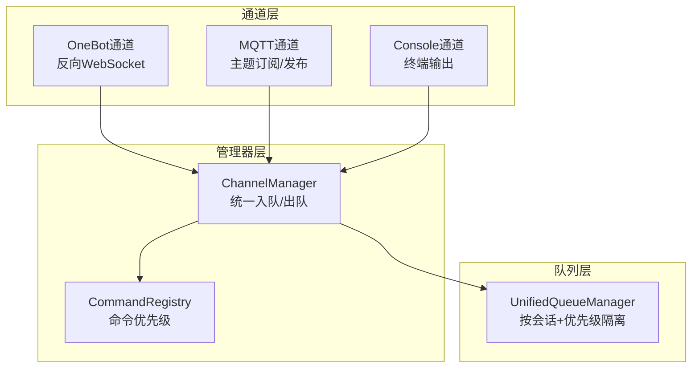
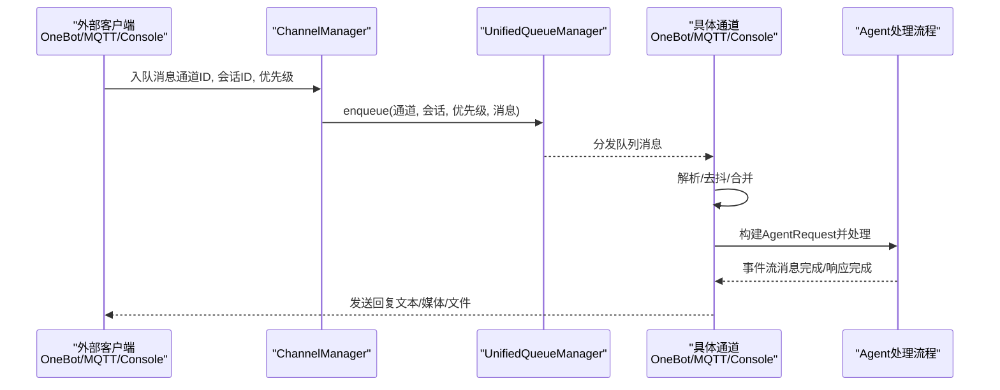
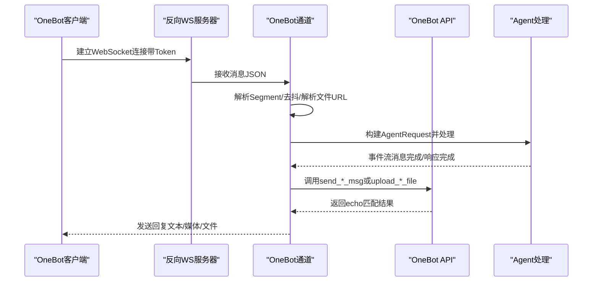
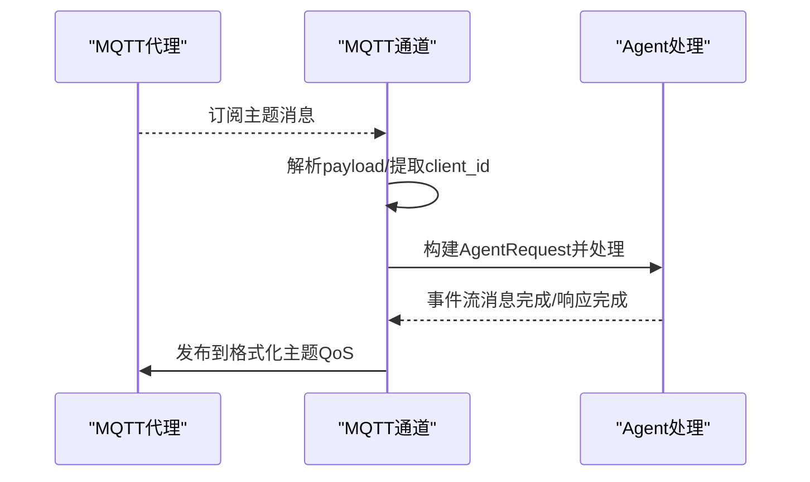
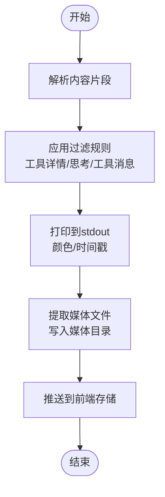
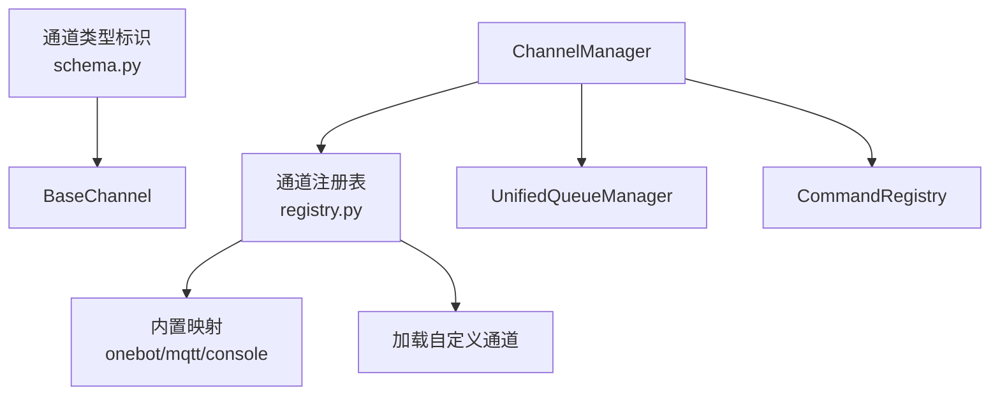

# 协议类平台集成

<cite>
**本文档引用的文件**
- [src/qwenpaw/app/channels/onebot/channel.py](file://src/qwenpaw/app/channels/onebot/channel.py)
- [src/qwenpaw/app/channels/mqtt/channel.py](file://src/qwenpaw/app/channels/mqtt/channel.py)
- [src/qwenpaw/app/channels/console/channel.py](file://src/qwenpaw/app/channels/console/channel.py)
- [src/qwenpaw/app/channels/base.py](file://src/qwenpaw/app/channels/base.py)
- [src/qwenpaw/app/channels/manager.py](file://src/qwenpaw/app/channels/manager.py)
- [src/qwenpaw/config/config.py](file://src/qwenpaw/config/config.py)
- [src/qwenpaw/app/channels/schema.py](file://src/qwenpaw/app/channels/schema.py)
- [src/qwenpaw/app/channels/registry.py](file://src/qwenpaw/app/channels/registry.py)
- [src/qwenpaw/app/channels/unified_queue_manager.py](file://src/qwenpaw/app/channels/unified_queue_manager.py)
- [src/qwenpaw/app/channels/command_registry.py](file://src/qwenpaw/app/channels/command_registry.py)
- [tests/unit/channels/test_onebot_channel.py](file://tests/unit/channels/test_onebot_channel.py)
</cite>

## 目录
1. [简介](#简介)
2. [项目结构](#项目结构)
3. [核心组件](#核心组件)
4. [架构总览](#架构总览)
5. [详细组件分析](#详细组件分析)
6. [依赖关系分析](#依赖关系分析)
7. [性能考虑](#性能考虑)
8. [故障排查指南](#故障排查指南)
9. [结论](#结论)
10. [附录](#附录)

## 简介
本指南面向需要在QwenPaw中集成协议类通讯平台的开发者，重点覆盖以下三类通道的完整集成方案：
- OneBot v11协议通道：通过反向WebSocket与NapCat/go-cqhttp/Lagrange等客户端互通，支持消息分段解析、媒体文件上传下载、提及策略与会话路由。
- MQTT消息队列通道：基于paho-mqtt的轻量级物联网/机器人消息通道，支持TLS、QoS、主题订阅与发布。
- Console控制台通道：面向终端输出的轻量通道，负责将Agent响应以人类可读形式打印到stdout，并支持媒体内容提取与推送。

本指南将从协议规范、消息格式、连接管理、适配器模式与消息路由机制、主题订阅与发布流程、配置示例、协议兼容性、错误处理与性能优化等方面进行系统化阐述。

## 项目结构
QwenPaw采用“通道（Channel）+ 管理器（Manager）+ 统一队列（UnifiedQueueManager）”的解耦架构：
- 通道层：每个协议对应一个通道类，统一继承自BaseChannel，负责消息解析、发送、会话ID解析与路由。
- 管理器层：ChannelManager负责通道生命周期、统一入队与消费、优先级与批合并。
- 队列层：UnifiedQueueManager按（通道, 会话, 优先级）三元组维护独立队列，动态创建消费者任务，自动清理空闲队列。

图表来源
- [src/qwenpaw/app/channels/manager.py:68-116](file://src/qwenpaw/app/channels/manager.py#L68-L116)
- [src/qwenpaw/app/channels/unified_queue_manager.py:60-117](file://src/qwenpaw/app/channels/unified_queue_manager.py#L60-L117)
- [src/qwenpaw/app/channels/command_registry.py:23-62](file://src/qwenpaw/app/channels/command_registry.py#L23-L62)

章节来源
- [src/qwenpaw/app/channels/manager.py:68-116](file://src/qwenpaw/app/channels/manager.py#L68-L116)
- [src/qwenpaw/app/channels/unified_queue_manager.py:60-117](file://src/qwenpaw/app/channels/unified_queue_manager.py#L60-L117)
- [src/qwenpaw/app/channels/command_registry.py:23-62](file://src/qwenpaw/app/channels/command_registry.py#L23-L62)

## 核心组件
- BaseChannel：所有通道的抽象基类，定义统一的消息构建、会话解析、时间去抖、批量合并、事件流处理与错误回调。
- ChannelManager：通道生命周期管理、统一入队、按会话+优先级合并、调用通道consume_one或合并后的请求处理。
- UnifiedQueueManager：按（通道, 会话, 优先级）三元组维护队列与消费者任务，支持动态创建、自动清理与监控指标。
- CommandRegistry：命令前缀注册与优先级映射，用于区分控制命令与普通消息的调度优先级。
- 通道实现：OneBot、MQTT、Console分别实现各自的连接、认证、消息解析与发送逻辑。

章节来源
- [src/qwenpaw/app/channels/base.py:70-127](file://src/qwenpaw/app/channels/base.py#L70-L127)
- [src/qwenpaw/app/channels/manager.py:68-116](file://src/qwenpaw/app/channels/manager.py#L68-L116)
- [src/qwenpaw/app/channels/unified_queue_manager.py:60-117](file://src/qwenpaw/app/channels/unified_queue_manager.py#L60-L117)
- [src/qwenpaw/app/channels/command_registry.py:23-62](file://src/qwenpaw/app/channels/command_registry.py#L23-L62)

## 架构总览
下图展示从外部协议到Agent处理再到通道输出的端到端数据流：

图表来源
- [src/qwenpaw/app/channels/manager.py:39-65](file://src/qwenpaw/app/channels/manager.py#L39-L65)
- [src/qwenpaw/app/channels/unified_queue_manager.py:119-163](file://src/qwenpaw/app/channels/unified_queue_manager.py#L119-L163)
- [src/qwenpaw/app/channels/base.py:446-535](file://src/qwenpaw/app/channels/base.py#L446-L535)

## 详细组件分析

### OneBot v11 通道集成
- 协议规范与消息格式
  - 反向WebSocket：作为服务器监听指定端口，客户端以ws://host:port/ws连接；支持Authorization头或查询参数access_token鉴权。
  - 消息类型：post_type=message时解析message_type（private/group）、user_id、group_id、message_id与sender信息；message字段支持字符串或Segment数组。
  - Segment类型：text、image、record（音频）、video、file、at等；其中file需通过API解析真实URL后才能下载。
- 连接管理
  - 启动：创建aiohttp应用与路由，绑定/ws路径；停止：关闭所有连接、清理Future集合。
  - 鉴权：支持Bearer Token或Query Token两种方式；未通过鉴权直接拒绝。
- 适配器模式与消息路由
  - 适配器：OneBotChannel将OneBot事件转换为内部ContentParts，再构建AgentRequest；发送时将AgentResponse转换回OneBot API调用。
  - 路由：resolve_session_id根据是否群聊与是否共享群会话生成会话ID；get_to_handle_from_request决定回复目标（私聊用户或群组）。
- 去抖与媒体处理
  - 对仅含媒体（不含文本）的消息立即处理，避免等待文本到达导致延迟。
  - 文件URL解析：私聊使用get_private_file_url，群聊使用get_group_file_url，失败则保留原始文件名。
- API调用（Echo模式）
  - 使用echo字段进行请求-响应匹配；超时15秒；任一连接失败自动切换到其他可用连接。
- 配置项
  - 环境变量：ONEBOT_CHANNEL_ENABLED、ONEBOT_WS_HOST、ONEBOT_WS_PORT、ONEBOT_ACCESS_TOKEN、ONEBOT_BOT_PREFIX、ONEBOT_DM_POLICY、ONEBOT_GROUP_POLICY、ONEBOT_ALLOW_FROM、ONEBOT_DENY_MESSAGE、ONEBOT_REQUIRE_MENTION、ONEBOT_SHARE_SESSION_IN_GROUP。
  - 配置对象：OneBotConfig包含ws_host、ws_port、access_token、share_session_in_group等字段。
- 错误处理
  - 无效JSON：记录警告并跳过。
  - API调用失败：记录retcode与msg；超时返回空结果。
  - 连接断开：清理连接集合与待处理Future。

图表来源
- [src/qwenpaw/app/channels/onebot/channel.py:220-275](file://src/qwenpaw/app/channels/onebot/channel.py#L220-L275)
- [src/qwenpaw/app/channels/onebot/channel.py:304-377](file://src/qwenpaw/app/channels/onebot/channel.py#L304-L377)
- [src/qwenpaw/app/channels/onebot/channel.py:713-778](file://src/qwenpaw/app/channels/onebot/channel.py#L713-L778)

章节来源
- [src/qwenpaw/app/channels/onebot/channel.py:47-170](file://src/qwenpaw/app/channels/onebot/channel.py#L47-L170)
- [src/qwenpaw/app/channels/onebot/channel.py:176-214](file://src/qwenpaw/app/channels/onebot/channel.py#L176-L214)
- [src/qwenpaw/app/channels/onebot/channel.py:220-275](file://src/qwenpaw/app/channels/onebot/channel.py#L220-L275)
- [src/qwenpaw/app/channels/onebot/channel.py:304-377](file://src/qwenpaw/app/channels/onebot/channel.py#L304-L377)
- [src/qwenpaw/app/channels/onebot/channel.py:453-523](file://src/qwenpaw/app/channels/onebot/channel.py#L453-L523)
- [src/qwenpaw/app/channels/onebot/channel.py:529-567](file://src/qwenpaw/app/channels/onebot/channel.py#L529-L567)
- [src/qwenpaw/app/channels/onebot/channel.py:599-682](file://src/qwenpaw/app/channels/onebot/channel.py#L599-L682)
- [src/qwenpaw/app/channels/onebot/channel.py:713-778](file://src/qwenpaw/app/channels/onebot/channel.py#L713-L778)
- [src/qwenpaw/config/config.py:101-108](file://src/qwenpaw/config/config.py#L101-L108)
- [tests/unit/channels/test_onebot_channel.py:22-37](file://tests/unit/channels/test_onebot_channel.py#L22-L37)

### MQTT 通道集成
- 协议规范与消息格式
  - 订阅主题：接收来自IoT设备/机器人的消息，payload可为纯文本或JSON（含text字段），若非JSON则按纯文本处理。
  - 发布主题：根据to_handle与模板格式化发布主题，支持client_id占位符。
- 连接管理
  - 支持TCP与Websocket传输；可配置用户名密码与TLS证书链；自动重连与QoS级别设置。
  - 连接成功后订阅指定主题，断开时记录原因码。
- 主题订阅与发布流程
  - 订阅：收到消息后解析payload，提取client_id（优先payload.redirect_client_id，其次topic路径段，最后默认值）。
  - 发布：将文本或媒体内容封装为字符串或特定标记后发布到格式化主题。
- 配置项
  - 环境变量：MQTT_CHANNEL_ENABLED、MQTT_HOST、MQTT_PORT、MQTT_TRANSPORT、MQTT_USERNAME、MQTT_PASSWORD、MQTT_SUBSCRIBE_TOPIC、MQTT_PUBLISH_TOPIC、MQTT_BOT_PREFIX、MQTT_CLEAN_SESSION、MQTT_QOS、MQTT_TLS_ENABLED、MQTT_TLS_CA_CERTS、MQTT_TLS_CERTFILE、MQTT_TLS_KEYFILE。
  - 配置对象：MQTTConfig包含host/port/transport/clean_session/qos/username/password/subscribe_topic/publish_topic/tls_*等字段。
- 错误处理
  - 配置校验失败：抛出异常并记录错误。
  - 连接失败：捕获MQTTException并记录错误。
  - 消息处理异常：记录异常并忽略该条消息。

图表来源
- [src/qwenpaw/app/channels/mqtt/channel.py:236-285](file://src/qwenpaw/app/channels/mqtt/channel.py#L236-L285)
- [src/qwenpaw/app/channels/mqtt/channel.py:354-378](file://src/qwenpaw/app/channels/mqtt/channel.py#L354-L378)
- [src/qwenpaw/app/channels/mqtt/channel.py:379-429](file://src/qwenpaw/app/channels/mqtt/channel.py#L379-L429)

章节来源
- [src/qwenpaw/app/channels/mqtt/channel.py:30-195](file://src/qwenpaw/app/channels/mqtt/channel.py#L30-L195)
- [src/qwenpaw/app/channels/mqtt/channel.py:197-285](file://src/qwenpaw/app/channels/mqtt/channel.py#L197-L285)
- [src/qwenpaw/app/channels/mqtt/channel.py:287-352](file://src/qwenpaw/app/channels/mqtt/channel.py#L287-L352)
- [src/qwenpaw/app/channels/mqtt/channel.py:354-429](file://src/qwenpaw/app/channels/mqtt/channel.py#L354-L429)
- [src/qwenpaw/config/config.py:117-131](file://src/qwenpaw/config/config.py#L117-L131)

### Console 控制台通道集成
- 功能概述
  - 将Agent的响应以人类可读的形式打印到stdout；支持颜色、时间戳与错误输出。
  - 支持媒体内容提取（图片/视频/音频/文件）并写入工作区媒体目录。
  - 支持过滤工具详情、中间工具消息与思考过程。
- 生命周期与输出
  - start/stop：启动时记录日志；停止时记录日志。
  - send/send_content_parts：打印文本与内容片段；支持bot_prefix前缀。
  - stream_one/consume_one：处理单个payload，生成SSE事件流，最终打印媒体消息。
- 配置项
  - 环境变量：CONSOLE_CHANNEL_ENABLED、CONSOLE_BOT_PREFIX、CONSOLE_MEDIA_DIR。
  - 配置对象：ConsoleConfig包含enabled与media_dir字段。
- 错误处理
  - 打印异常：Windows平台编码问题降级处理；管道场景下的OSError进行回退编码。

图表来源
- [src/qwenpaw/app/channels/console/channel.py:332-448](file://src/qwenpaw/app/channels/console/channel.py#L332-L448)
- [src/qwenpaw/app/channels/console/channel.py:543-576](file://src/qwenpaw/app/channels/console/channel.py#L543-L576)

章节来源
- [src/qwenpaw/app/channels/console/channel.py:63-190](file://src/qwenpaw/app/channels/console/channel.py#L63-L190)
- [src/qwenpaw/app/channels/console/channel.py:192-276](file://src/qwenpaw/app/channels/console/channel.py#L192-L276)
- [src/qwenpaw/app/channels/console/channel.py:332-448](file://src/qwenpaw/app/channels/console/channel.py#L332-L448)
- [src/qwenpaw/app/channels/console/channel.py:543-576](file://src/qwenpaw/app/channels/console/channel.py#L543-L576)
- [src/qwenpaw/config/config.py:143-148](file://src/qwenpaw/config/config.py#L143-L148)

## 依赖关系分析
- 通道注册与发现
  - 内置通道键值表映射到模块与类名；支持自定义通道目录扫描与注册。
- 通道类型标识
  - ChannelType为字符串，内置通道类型集合包含console、mqtt、onebot等。
- 统一队列与优先级
  - ChannelManager通过CommandRegistry识别控制命令，将其映射到高优先级队列，确保紧急指令快速执行。

图表来源
- [src/qwenpaw/app/channels/registry.py:20-36](file://src/qwenpaw/app/channels/registry.py#L20-L36)
- [src/qwenpaw/app/channels/registry.py:190-195](file://src/qwenpaw/app/channels/registry.py#L190-L195)
- [src/qwenpaw/app/channels/schema.py:30-48](file://src/qwenpaw/app/channels/schema.py#L30-L48)
- [src/qwenpaw/app/channels/manager.py:86-106](file://src/qwenpaw/app/channels/manager.py#L86-L106)

章节来源
- [src/qwenpaw/app/channels/registry.py:20-36](file://src/qwenpaw/app/channels/registry.py#L20-L36)
- [src/qwenpaw/app/channels/registry.py:190-195](file://src/qwenpaw/app/channels/registry.py#L190-L195)
- [src/qwenpaw/app/channels/schema.py:30-48](file://src/qwenpaw/app/channels/schema.py#L30-L48)
- [src/qwenpaw/app/channels/manager.py:86-106](file://src/qwenpaw/app/channels/manager.py#L86-L106)

## 性能考虑
- 去抖与批合并
  - BaseChannel对无文本消息进行缓冲，待有文本时一次性合并处理，减少Agent处理压力。
  - ChannelManager在统一队列中按会话+优先级合并同批次消息，降低重复构建请求的开销。
- 动态消费者与空闲清理
  - UnifiedQueueManager按需创建消费者任务，空闲队列自动清理，避免固定线程池资源浪费。
- 并发与限速
  - CommandRegistry为控制命令分配更高优先级，确保紧急指令快速响应。
- I/O与网络
  - OneBot通道对媒体文件URL进行异步解析，避免阻塞主消息循环。
  - MQTT通道支持QoS与TLS，提升可靠性与安全性。

章节来源
- [src/qwenpaw/app/channels/base.py:249-281](file://src/qwenpaw/app/channels/base.py#L249-L281)
- [src/qwenpaw/app/channels/manager.py:39-65](file://src/qwenpaw/app/channels/manager.py#L39-L65)
- [src/qwenpaw/app/channels/unified_queue_manager.py:119-163](file://src/qwenpaw/app/channels/unified_queue_manager.py#L119-L163)
- [src/qwenpaw/app/channels/command_registry.py:23-62](file://src/qwenpaw/app/channels/command_registry.py#L23-L62)

## 故障排查指南
- OneBot通道
  - 连接被拒：检查access_token是否正确传递（Header或Query）。
  - API调用失败：查看retcode与msg；确认客户端版本与动作名称一致。
  - 文件URL无法解析：确认file_id存在且客户端支持相应API。
- MQTT通道
  - 订阅失败：检查subscribe_topic与QoS；确认Broker可达。
  - 发布失败：检查publish_topic模板与client_id；确认Broker权限。
  - TLS失败：核对CA/Cert/Key路径与权限。
- Console通道
  - 打印异常：Windows平台编码问题，尝试reconfigure或回退编码。
  - 媒体文件缺失：确认media_dir存在且可写。

章节来源
- [src/qwenpaw/app/channels/onebot/channel.py:220-275](file://src/qwenpaw/app/channels/onebot/channel.py#L220-L275)
- [src/qwenpaw/app/channels/onebot/channel.py:713-778](file://src/qwenpaw/app/channels/onebot/channel.py#L713-L778)
- [src/qwenpaw/app/channels/mqtt/channel.py:197-285](file://src/qwenpaw/app/channels/mqtt/channel.py#L197-L285)
- [src/qwenpaw/app/channels/mqtt/channel.py:354-429](file://src/qwenpaw/app/channels/mqtt/channel.py#L354-L429)
- [src/qwenpaw/app/channels/console/channel.py:452-480](file://src/qwenpaw/app/channels/console/channel.py#L452-L480)

## 结论
通过统一的通道抽象与队列管理，QwenPaw实现了对OneBot、MQTT与Console等协议类平台的高效集成。通道层专注于协议细节，管理器层负责调度与合并，队列层提供并发与隔离保障。结合配置系统与命令优先级机制，系统在保证稳定性的同时具备良好的扩展性与可维护性。

## 附录
- 配置示例（环境变量）
  - OneBot
    - ONEBOT_CHANNEL_ENABLED=1
    - ONEBOT_WS_HOST=0.0.0.0
    - ONEBOT_WS_PORT=6199
    - ONEBOT_ACCESS_TOKEN=<your-token>
    - ONEBOT_DM_POLICY=open
    - ONEBOT_GROUP_POLICY=allowlist
    - ONEBOT_ALLOW_FROM=1001,1002
    - ONEBOT_DENY_MESSAGE=请先加白名单
    - ONEBOT_REQUIRE_MENTION=0
    - ONEBOT_SHARE_SESSION_IN_GROUP=0
  - MQTT
    - MQTT_CHANNEL_ENABLED=1
    - MQTT_HOST=<broker-host>
    - MQTT_PORT=1883
    - MQTT_TRANSPORT=tcp
    - MQTT_USERNAME=<username>
    - MQTT_PASSWORD=<password>
    - MQTT_SUBSCRIBE_TOPIC=device/+/messages
    - MQTT_PUBLISH_TOPIC=device/{client_id}/responses
    - MQTT_CLEAN_SESSION=1
    - MQTT_QOS=2
    - MQTT_TLS_ENABLED=0
  - Console
    - CONSOLE_CHANNEL_ENABLED=1
    - CONSOLE_BOT_PREFIX=Bot:
    - CONSOLE_MEDIA_DIR=/path/to/media
- 配置对象字段参考
  - OneBotConfig：ws_host, ws_port, access_token, share_session_in_group
  - MQTTConfig：host, port, transport, clean_session, qos, username, password, subscribe_topic, publish_topic, tls_enabled, tls_ca_certs, tls_certfile, tls_keyfile
  - ConsoleConfig：enabled, media_dir

章节来源
- [src/qwenpaw/config/config.py:101-108](file://src/qwenpaw/config/config.py#L101-L108)
- [src/qwenpaw/config/config.py:117-131](file://src/qwenpaw/config/config.py#L117-L131)
- [src/qwenpaw/config/config.py:143-148](file://src/qwenpaw/config/config.py#L143-L148)