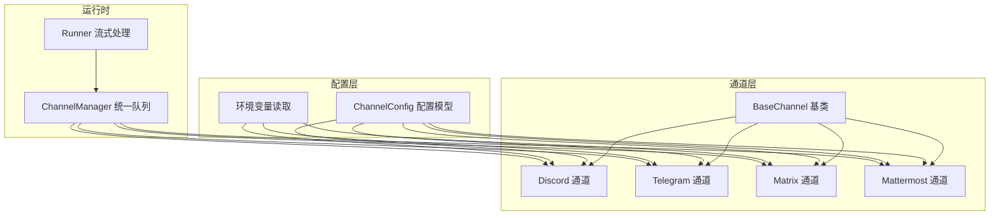
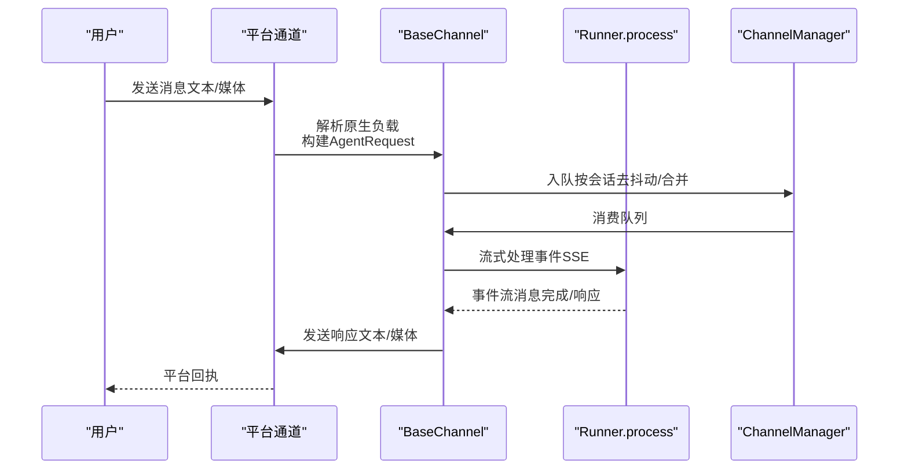
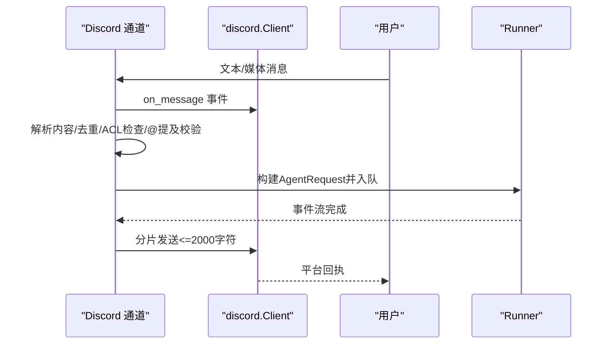
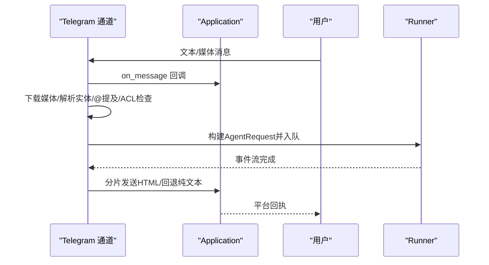
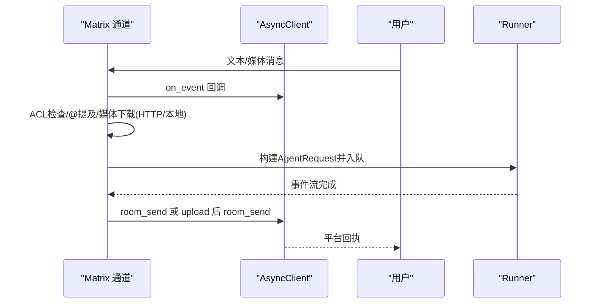
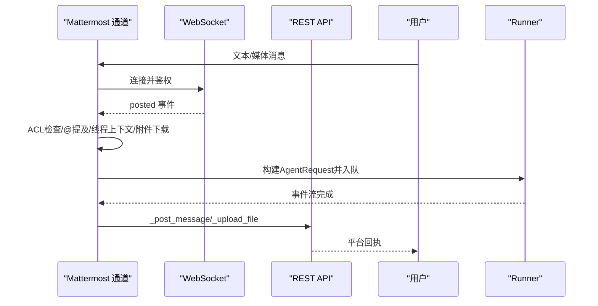
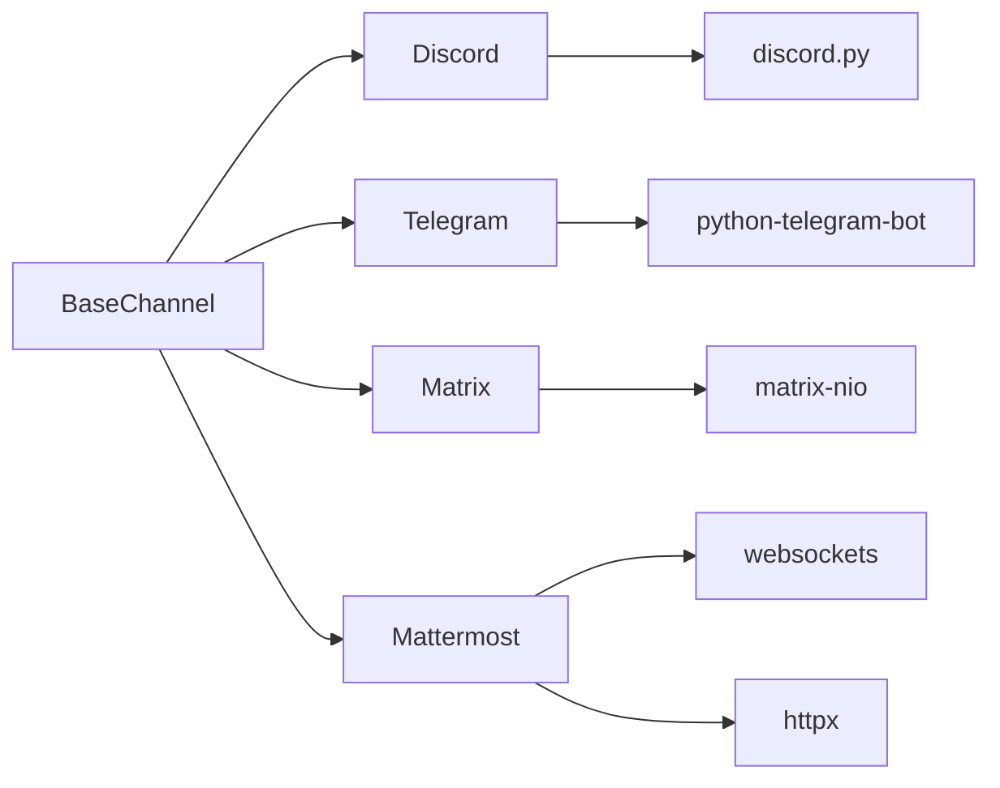

# 国际平台集成

<cite>
**本文档引用的文件**
- [src/qwenpaw/app/channels/discord_/channel.py](file://src/qwenpaw/app/channels/discord_/channel.py)
- [src/qwenpaw/app/channels/telegram/channel.py](file://src/qwenpaw/app/channels/telegram/channel.py)
- [src/qwenpaw/app/channels/matrix/channel.py](file://src/qwenpaw/app/channels/matrix/channel.py)
- [src/qwenpaw/app/channels/mattermost/channel.py](file://src/qwenpaw/app/channels/mattermost/channel.py)
- [src/qwenpaw/app/channels/base.py](file://src/qwenpaw/app/channels/base.py)
- [src/qwenpaw/config/config.py](file://src/qwenpaw/config/config.py)
- [src/qwenpaw/app/channels/utils.py](file://src/qwenpaw/app/channels/utils.py)
- [src/qwenpaw/exceptions.py](file://src/qwenpaw/exceptions.py)
- [src/qwenpaw/providers/rate_limiter.py](file://src/qwenpaw/providers/rate_limiter.py)
- [src/qwenpaw/providers/retry_chat_model.py](file://src/qwenpaw/providers/retry_chat_model.py)
</cite>

## 目录
1. [简介](#简介)
2. [项目结构](#项目结构)
3. [核心组件](#核心组件)
4. [架构总览](#架构总览)
5. [详细组件分析](#详细组件分析)
6. [依赖分析](#依赖分析)
7. [性能考虑](#性能考虑)
8. [故障排查指南](#故障排查指南)
9. [结论](#结论)
10. [附录：配置与环境变量](#附录配置与环境变量)

## 简介
本指南面向在QwenPaw中集成国际通讯平台（Discord、Telegram、Matrix、Mattermost）的开发者与运维人员，系统阐述各平台的认证机制、API调用方式、权限配置、功能特性（频道管理、用户权限控制、多媒体消息支持、机器人集成）、速率限制与错误处理最佳实践，并提供可直接落地的配置示例与环境变量清单。

## 项目结构
QwenPaw通过统一的通道基类抽象，为不同IM平台提供一致的消息收发与会话管理能力。各平台通道均继承自基础通道，复用统一的队列管理、去抖动合并、渲染与发送流程，并在各自通道内实现平台特有逻辑（如Discord的网关事件、Telegram的Bot API轮询、Matrix的同步循环与媒体上传、Mattermost的WebSocket事件与REST回复）。

图示来源
- [src/qwenpaw/app/channels/base.py:70-127](file://src/qwenpaw/app/channels/base.py#L70-L127)
- [src/qwenpaw/app/channels/discord_/channel.py:42-90](file://src/qwenpaw/app/channels/discord_/channel.py#L42-L90)
- [src/qwenpaw/app/channels/telegram/channel.py:264-337](file://src/qwenpaw/app/channels/telegram/channel.py#L264-L337)
- [src/qwenpaw/app/channels/matrix/channel.py:45-87](file://src/qwenpaw/app/channels/matrix/channel.py#L45-L87)
- [src/qwenpaw/app/channels/mattermost/channel.py:74-156](file://src/qwenpaw/app/channels/mattermost/channel.py#L74-L156)
- [src/qwenpaw/config/config.py:208-228](file://src/qwenpaw/config/config.py#L208-L228)

章节来源
- [src/qwenpaw/app/channels/base.py:70-127](file://src/qwenpaw/app/channels/base.py#L70-L127)
- [src/qwenpaw/config/config.py:208-228](file://src/qwenpaw/config/config.py#L208-L228)

## 核心组件
- 通道基类（BaseChannel）
  - 提供统一的会话解析、内容合并、去抖动、渲染与发送接口
  - 支持允许列表/拒绝策略、@提及要求、工具消息过滤、思考内容过滤
  - 定义统一的请求构建与发送目标解析方法
- 平台通道
  - Discord：基于discord.py网关事件，支持文本、图片、视频、音频、文件；消息分片与重复消息去重
  - Telegram：基于python-telegram-bot轮询，支持Markdown转HTML、媒体下载到本地、分片发送
  - Matrix：基于matrix-nio同步循环，支持mxc到HTTP转换、媒体上传与发送
  - Mattermost：基于WebSocket事件监听+REST API回复，支持线程上下文拉取、打字指示、附件下载
- 配置与环境变量
  - ChannelConfig集中定义各平台配置项，支持从配置文件或环境变量加载
- 工具与异常
  - 通用URL到本地路径转换、统一异常类型（ChannelError）

章节来源
- [src/qwenpaw/app/channels/base.py:283-318](file://src/qwenpaw/app/channels/base.py#L283-L318)
- [src/qwenpaw/app/channels/discord_/channel.py:42-90](file://src/qwenpaw/app/channels/discord_/channel.py#L42-L90)
- [src/qwenpaw/app/channels/telegram/channel.py:264-337](file://src/qwenpaw/app/channels/telegram/channel.py#L264-L337)
- [src/qwenpaw/app/channels/matrix/channel.py:45-87](file://src/qwenpaw/app/channels/matrix/channel.py#L45-L87)
- [src/qwenpaw/app/channels/mattermost/channel.py:74-156](file://src/qwenpaw/app/channels/mattermost/channel.py#L74-L156)
- [src/qwenpaw/config/config.py:62-67](file://src/qwenpaw/config/config.py#L62-L67)
- [src/qwenpaw/config/config.py:110-115](file://src/qwenpaw/config/config.py#L110-L115)
- [src/qwenpaw/config/config.py:160-166](file://src/qwenpaw/config/config.py#L160-L166)
- [src/qwenpaw/config/config.py:133-141](file://src/qwenpaw/config/config.py#L133-L141)
- [src/qwenpaw/app/channels/utils.py:78-118](file://src/qwenpaw/app/channels/utils.py#L78-L118)
- [src/qwenpaw/exceptions.py:54-75](file://src/qwenpaw/exceptions.py#L54-L75)

## 架构总览
下图展示通道层如何与运行时、配置层协作，以及各平台通道的关键交互点。

图示来源
- [src/qwenpaw/app/channels/base.py:446-535](file://src/qwenpaw/app/channels/base.py#L446-L535)
- [src/qwenpaw/app/channels/base.py:659-695](file://src/qwenpaw/app/channels/base.py#L659-L695)
- [src/qwenpaw/app/channels/discord_/channel.py:432-474](file://src/qwenpaw/app/channels/discord_/channel.py#L432-L474)
- [src/qwenpaw/app/channels/telegram/channel.py:599-652](file://src/qwenpaw/app/channels/telegram/channel.py#L599-L652)
- [src/qwenpaw/app/channels/matrix/channel.py:485-512](file://src/qwenpaw/app/channels/matrix/channel.py#L485-L512)
- [src/qwenpaw/app/channels/mattermost/channel.py:893-908](file://src/qwenpaw/app/channels/mattermost/channel.py#L893-L908)

## 详细组件分析

### Discord 通道
- 认证与连接
  - 使用discord.py客户端，启用消息内容意图与私信意图
  - 支持HTTP代理与代理鉴权
- 权限与策略
  - 支持开放策略与白名单策略；DM与群组分别配置
  - 可选要求@提及或命令触发
- 功能特性
  - 文本、图片、视频、音频、文件多类型内容解析
  - 消息长度超过2000字符自动分片，保留代码块闭合
  - 去重缓存（最多500条消息ID）
- 发送与媒体
  - 支持按频道ID或用户ID直发（私信）
  - 媒体支持file://与HTTP URL，自动下载并作为附件发送
- 错误处理
  - 初始化失败抛出ChannelError
  - 客户端未就绪时报错
- 速率限制
  - Discord官方速率限制由平台决定，应用侧避免重复消息与过度分片

图示来源
- [src/qwenpaw/app/channels/discord_/channel.py:110-274](file://src/qwenpaw/app/channels/discord_/channel.py#L110-L274)
- [src/qwenpaw/app/channels/discord_/channel.py:358-431](file://src/qwenpaw/app/channels/discord_/channel.py#L358-L431)
- [src/qwenpaw/app/channels/discord_/channel.py:432-474](file://src/qwenpaw/app/channels/discord_/channel.py#L432-L474)
- [src/qwenpaw/app/channels/discord_/channel.py:510-572](file://src/qwenpaw/app/channels/discord_/channel.py#L510-L572)

章节来源
- [src/qwenpaw/app/channels/discord_/channel.py:42-90](file://src/qwenpaw/app/channels/discord_/channel.py#L42-L90)
- [src/qwenpaw/app/channels/discord_/channel.py:110-274](file://src/qwenpaw/app/channels/discord_/channel.py#L110-L274)
- [src/qwenpaw/app/channels/discord_/channel.py:358-431](file://src/qwenpaw/app/channels/discord_/channel.py#L358-L431)
- [src/qwenpaw/app/channels/discord_/channel.py:432-474](file://src/qwenpaw/app/channels/discord_/channel.py#L432-L474)
- [src/qwenpaw/app/channels/discord_/channel.py:510-572](file://src/qwenpaw/app/channels/discord_/channel.py#L510-L572)
- [src/qwenpaw/exceptions.py:54-75](file://src/qwenpaw/exceptions.py#L54-L75)

### Telegram 通道
- 认证与连接
  - 使用python-telegram-bot Application，支持HTTP代理与代理鉴权
  - 轮询模式接收消息，支持编辑消息
- 权限与策略
  - 开放策略/白名单策略；DM与群组分别配置
  - 可选要求@提及或命令触发
- 功能特性
  - 文本解析支持实体（@提及、bot命令等），自动去除@前缀
  - 图片、视频、音频、文档等媒体下载到本地目录，使用file://URL传递
  - Markdown转HTML后以ParseMode.HTML发送，失败回退纯文本
  - 打字指示循环（约每4秒一次，最长180秒）
- 发送与媒体
  - 文本分片（默认4000字符），逐片发送
  - 媒体发送支持多种类型，内置大小限制（50MB）
- 错误处理
  - 对BadRequest、Forbidden、RetryAfter、TimedOut、NetworkError等进行分类处理与用户提示
  - 文件过大、不可用、网络错误等异常转换为用户可读提示

图示来源
- [src/qwenpaw/app/channels/telegram/channel.py:335-437](file://src/qwenpaw/app/channels/telegram/channel.py#L335-L437)
- [src/qwenpaw/app/channels/telegram/channel.py:140-237](file://src/qwenpaw/app/channels/telegram/channel.py#L140-L237)
- [src/qwenpaw/app/channels/telegram/channel.py:528-548](file://src/qwenpaw/app/channels/telegram/channel.py#L528-L548)
- [src/qwenpaw/app/channels/telegram/channel.py:654-770](file://src/qwenpaw/app/channels/telegram/channel.py#L654-L770)

章节来源
- [src/qwenpaw/app/channels/telegram/channel.py:264-337](file://src/qwenpaw/app/channels/telegram/channel.py#L264-L337)
- [src/qwenpaw/app/channels/telegram/channel.py:335-437](file://src/qwenpaw/app/channels/telegram/channel.py#L335-L437)
- [src/qwenpaw/app/channels/telegram/channel.py:528-548](file://src/qwenpaw/app/channels/telegram/channel.py#L528-L548)
- [src/qwenpaw/app/channels/telegram/channel.py:654-770](file://src/qwenpaw/app/channels/telegram/channel.py#L654-L770)

### Matrix 通道
- 认证与连接
  - 使用matrix-nio AsyncClient，基于homeserver登录
  - 支持mxc到HTTP URL转换（带access_token）
- 权限与策略
  - 开放策略/白名单策略；DM与群组分别配置
  - 可选要求@提及
- 功能特性
  - 文本消息与多种媒体消息回调（图片/视频/音频/文件）
  - 自动检测@提及与群组场景
- 发送与媒体
  - 文本直接room_send
  - 媒体先上传，再以消息形式发送；支持HTTP URL与本地file://两种输入
- 错误处理
  - 上传/发送错误记录日志，避免阻塞

图示来源
- [src/qwenpaw/app/channels/matrix/channel.py:182-280](file://src/qwenpaw/app/channels/matrix/channel.py#L182-L280)
- [src/qwenpaw/app/channels/matrix/channel.py:306-418](file://src/qwenpaw/app/channels/matrix/channel.py#L306-L418)
- [src/qwenpaw/app/channels/matrix/channel.py:419-483](file://src/qwenpaw/app/channels/matrix/channel.py#L419-L483)

章节来源
- [src/qwenpaw/app/channels/matrix/channel.py:45-87](file://src/qwenpaw/app/channels/matrix/channel.py#L45-L87)
- [src/qwenpaw/app/channels/matrix/channel.py:182-280](file://src/qwenpaw/app/channels/matrix/channel.py#L182-L280)
- [src/qwenpaw/app/channels/matrix/channel.py:306-418](file://src/qwenpaw/app/channels/matrix/channel.py#L306-L418)
- [src/qwenpaw/app/channels/matrix/channel.py:419-483](file://src/qwenpaw/app/channels/matrix/channel.py#L419-L483)

### Mattermost 通道
- 认证与连接
  - WebSocket监听事件，使用Bearer Token鉴权
  - REST API用于回复消息与打字指示
- 权限与策略
  - 开放策略/白名单策略；DM与群组分别配置
  - 可选“跟随线程无需@”策略
- 功能特性
  - @提及、DM、线程上下文智能拉取
  - 附件下载到本地，自动识别图片/音频/视频/其他文件
  - 打字指示循环（约每4秒一次，最长180秒）
- 发送与媒体
  - 文本分片（默认4000字符），按根ID（thread root）回复
  - 媒体上传后以附件形式发布
- 错误处理
  - WebSocket断连指数回退重连；对REST API错误记录日志

图示来源
- [src/qwenpaw/app/channels/mattermost/channel.py:298-357](file://src/qwenpaw/app/channels/mattermost/channel.py#L298-L357)
- [src/qwenpaw/app/channels/mattermost/channel.py:461-567](file://src/qwenpaw/app/channels/mattermost/channel.py#L461-L567)
- [src/qwenpaw/app/channels/mattermost/channel.py:828-857](file://src/qwenpaw/app/channels/mattermost/channel.py#L828-L857)
- [src/qwenpaw/app/channels/mattermost/channel.py:910-970](file://src/qwenpaw/app/channels/mattermost/channel.py#L910-L970)

章节来源
- [src/qwenpaw/app/channels/mattermost/channel.py:74-156](file://src/qwenpaw/app/channels/mattermost/channel.py#L74-L156)
- [src/qwenpaw/app/channels/mattermost/channel.py:298-357](file://src/qwenpaw/app/channels/mattermost/channel.py#L298-L357)
- [src/qwenpaw/app/channels/mattermost/channel.py:461-567](file://src/qwenpaw/app/channels/mattermost/channel.py#L461-L567)
- [src/qwenpaw/app/channels/mattermost/channel.py:828-857](file://src/qwenpaw/app/channels/mattermost/channel.py#L828-L857)
- [src/qwenpaw/app/channels/mattermost/channel.py:910-970](file://src/qwenpaw/app/channels/mattermost/channel.py#L910-L970)

## 依赖分析
- 通道间耦合
  - 各平台通道仅依赖BaseChannel提供的统一接口，内部实现解耦
- 外部依赖
  - Discord：discord.py（网关事件）
  - Telegram：python-telegram-bot（Application/Updater）
  - Matrix：matrix-nio（AsyncClient）
  - Mattermost：websockets（WebSocket）、httpx（REST）
- 统一队列与去抖动
  - BaseChannel提供时间去抖动与内容合并，降低重复与噪声

图示来源
- [src/qwenpaw/app/channels/discord_/channel.py:90-108](file://src/qwenpaw/app/channels/discord_/channel.py#L90-L108)
- [src/qwenpaw/app/channels/telegram/channel.py:335-361](file://src/qwenpaw/app/channels/telegram/channel.py#L335-L361)
- [src/qwenpaw/app/channels/matrix/channel.py:431-453](file://src/qwenpaw/app/channels/matrix/channel.py#L431-L453)
- [src/qwenpaw/app/channels/mattermost/channel.py:308-339](file://src/qwenpaw/app/channels/mattermost/channel.py#L308-L339)

章节来源
- [src/qwenpaw/app/channels/base.py:659-695](file://src/qwenpaw/app/channels/base.py#L659-L695)

## 性能考虑
- 去抖动与合并
  - BaseChannel对无文本消息进行缓冲合并，减少空请求与重复处理
- 分片发送
  - Discord（2000字符）、Telegram（4000字符）、Mattermost（4000字符）分片避免超限
- 媒体处理
  - Telegram/Matrix/Mattermost均将远端媒体下载至本地临时目录，避免长链路阻塞
- 速率限制与并发
  - 应用层通过统一的LLM速率限制器（并发、QPM、暂停与抖动）保障上游API稳定
  - 各平台通道自身遵循平台API限制，避免触发平台级429/限流

章节来源
- [src/qwenpaw/app/channels/base.py:249-282](file://src/qwenpaw/app/channels/base.py#L249-L282)
- [src/qwenpaw/app/channels/discord_/channel.py:358-431](file://src/qwenpaw/app/channels/discord_/channel.py#L358-L431)
- [src/qwenpaw/app/channels/telegram/channel.py:528-548](file://src/qwenpaw/app/channels/telegram/channel.py#L528-L548)
- [src/qwenpaw/app/channels/mattermost/channel.py:33-40](file://src/qwenpaw/app/channels/mattermost/channel.py#L33-L40)
- [src/qwenpaw/providers/rate_limiter.py:43-70](file://src/qwenpaw/providers/rate_limiter.py#L43-L70)
- [src/qwenpaw/providers/retry_chat_model.py:269-312](file://src/qwenpaw/providers/retry_chat_model.py#L269-L312)

## 故障排查指南
- 通道初始化失败
  - 检查令牌/密钥是否正确；查看ChannelError详情中的channel字段定位问题
- 平台连接异常
  - Discord：确认意图开启、代理配置；检查客户端是否ready
  - Telegram：确认bot_token、代理URL格式；关注BadRequest/Forbidden/RetryAfter
  - Matrix：确认homeserver、user_id、access_token；检查mxc到HTTP转换
  - Mattermost：确认url与bot_token；关注WebSocket断连与REST返回码
- 媒体发送失败
  - Telegram：超过50MB限制、网络错误、文件不可用；查看具体异常分支
  - Matrix：上传/发送错误；检查临时文件清理
  - Mattermost：上传失败、REST错误；检查文件下载与上传流程
- 速率限制
  - 平台级429：遵循平台限流策略；应用侧并发与QPM限制避免雪崩
  - LLM侧429：利用全局速率限制器暂停与抖动，等待窗口滑动

章节来源
- [src/qwenpaw/exceptions.py:54-75](file://src/qwenpaw/exceptions.py#L54-L75)
- [src/qwenpaw/app/channels/telegram/channel.py:718-770](file://src/qwenpaw/app/channels/telegram/channel.py#L718-L770)
- [src/qwenpaw/app/channels/matrix/channel.py:392-414](file://src/qwenpaw/app/channels/matrix/channel.py#L392-L414)
- [src/qwenpaw/app/channels/mattermost/channel.py:844-857](file://src/qwenpaw/app/channels/mattermost/channel.py#L844-L857)
- [src/qwenpaw/providers/rate_limiter.py:175-196](file://src/qwenpaw/providers/rate_limiter.py#L175-L196)

## 结论
QwenPaw通过统一的通道基类与平台特定实现，为Discord、Telegram、Matrix、Mattermost提供了高内聚、低耦合的集成方案。开发者只需关注配置与环境变量，即可快速启用多平台机器人服务。建议在生产环境中结合平台API限制、应用侧速率限制与错误处理策略，确保稳定性与用户体验。

## 附录：配置与环境变量

### 通用通道配置项
- enabled：是否启用
- bot_prefix：回复前缀
- filter_tool_messages/filter_thinking：过滤工具消息与思考内容
- dm_policy/group_policy：DM/群组策略（open/allowlist）
- allow_from：允许列表（白名单）
- deny_message：拒绝消息提示
- require_mention：群组需@或命令触发

章节来源
- [src/qwenpaw/config/config.py:39-51](file://src/qwenpaw/config/config.py#L39-L51)

### Discord 配置
- bot_token：机器人令牌
- http_proxy/http_proxy_auth：HTTP代理与鉴权
- accept_bot_messages：是否接受其他机器人消息

章节来源
- [src/qwenpaw/config/config.py:62-67](file://src/qwenpaw/config/config.py#L62-L67)
- [src/qwenpaw/app/channels/discord_/channel.py:276-308](file://src/qwenpaw/app/channels/discord_/channel.py#L276-L308)

### Telegram 配置
- bot_token：机器人令牌
- http_proxy/http_proxy_auth：HTTP代理与鉴权
- show_typing：是否显示打字指示

章节来源
- [src/qwenpaw/config/config.py:110-115](file://src/qwenpaw/config/config.py#L110-L115)
- [src/qwenpaw/app/channels/telegram/channel.py:456-483](file://src/qwenpaw/app/channels/telegram/channel.py#L456-L483)

### Matrix 配置
- homeserver：Matrix服务器地址
- user_id：机器人用户ID
- access_token：访问令牌

章节来源
- [src/qwenpaw/config/config.py:160-166](file://src/qwenpaw/config/config.py#L160-L166)
- [src/qwenpaw/app/channels/matrix/channel.py:126-151](file://src/qwenpaw/app/channels/matrix/channel.py#L126-L151)

### Mattermost 配置
- url：服务器URL
- bot_token：机器人令牌
- media_dir：媒体下载目录
- show_typing：是否显示打字指示
- thread_follow_without_mention：跟随线程无需@提及

章节来源
- [src/qwenpaw/config/config.py:133-141](file://src/qwenpaw/config/config.py#L133-L141)
- [src/qwenpaw/app/channels/mattermost/channel.py:210-239](file://src/qwenpaw/app/channels/mattermost/channel.py#L210-L239)

### 环境变量（部分）
- DISCORD_CHANNEL_ENABLED/DISCORD_BOT_TOKEN/DISCORD_HTTP_PROXY/DISCORD_HTTP_PROXY_AUTH/DISCORD_ACCEPT_BOT_MESSAGES/DISCORD_DM_POLICY/DISCORD_GROUP_POLICY/DISCORD_ALLOW_FROM/DISCORD_DENY_MESSAGE/DISCORD_REQUIRE_MENTION
- TELEGRAM_CHANNEL_ENABLED/TELEGRAM_BOT_TOKEN/TELEGRAM_HTTP_PROXY/TELEGRAM_HTTP_PROXY_AUTH/TELEGRAM_SHOW_TYPING/TELEGRAM_DM_POLICY/TELEGRAM_GROUP_POLICY/TELEGRAM_ALLOW_FROM/TELEGRAM_DENY_MESSAGE/TELEGRAM_REQUIRE_MENTION
- MATTERMOST_CHANNEL_ENABLED/MATTERMOST_URL/MATTERMOST_BOT_TOKEN/MATTERMOST_MEDIA_DIR/MATTERMOST_SHOW_TYPING/MATTERMOST_THREAD_FOLLOW/MATTERMOST_DM_POLICY/MATTERMOST_GROUP_POLICY/MATTERMOST_ALLOW_FROM/MATTERMOST_DENY_MESSAGE

章节来源
- [src/qwenpaw/app/channels/discord_/channel.py:276-308](file://src/qwenpaw/app/channels/discord_/channel.py#L276-L308)
- [src/qwenpaw/app/channels/telegram/channel.py:456-483](file://src/qwenpaw/app/channels/telegram/channel.py#L456-L483)
- [src/qwenpaw/app/channels/mattermost/channel.py:210-239](file://src/qwenpaw/app/channels/mattermost/channel.py#L210-L239)