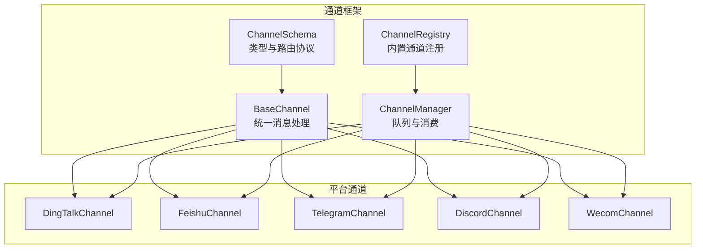
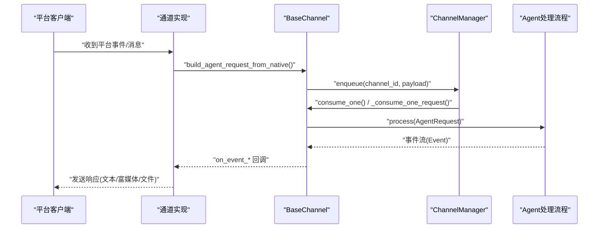
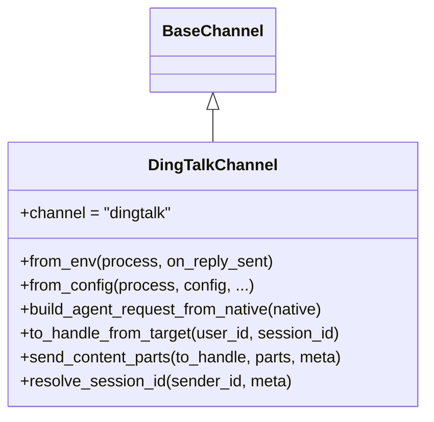
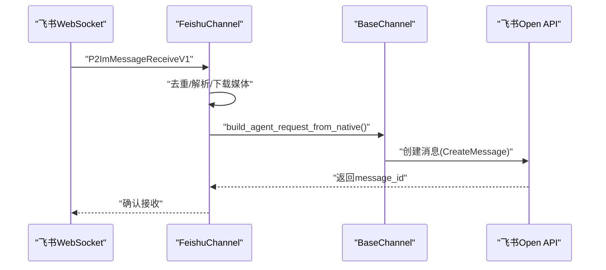
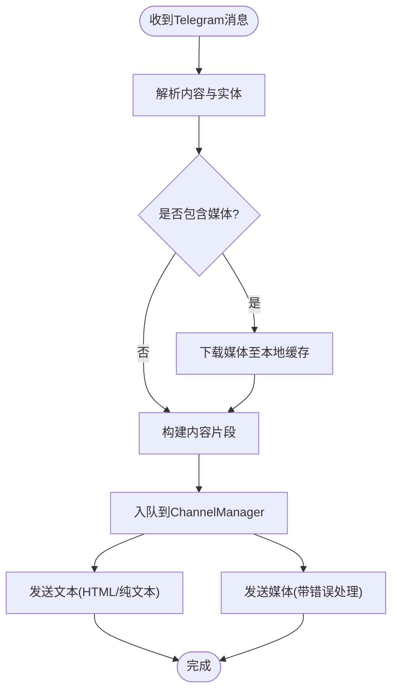
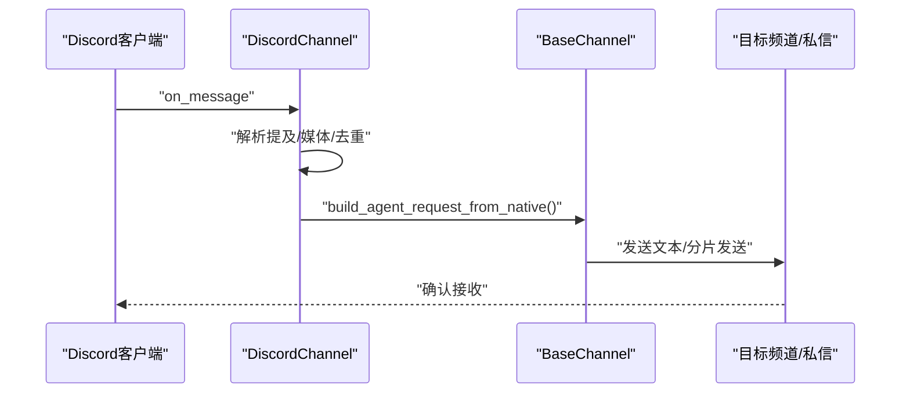
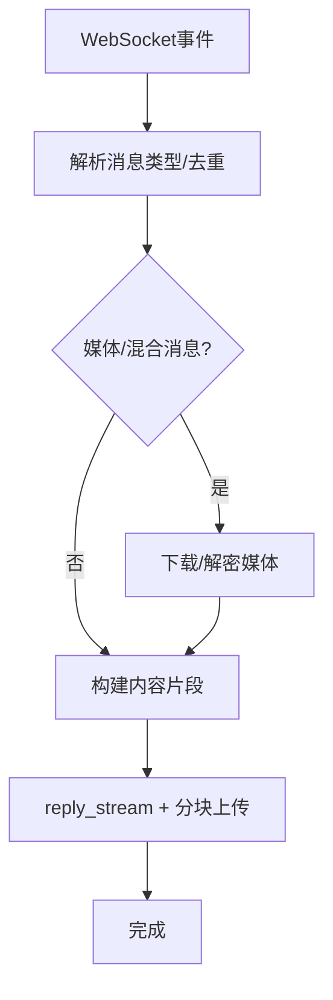
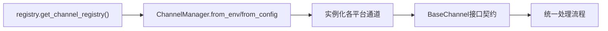

# 平台集成指南

<cite>
**本文档引用的文件**
- [src/qwenpaw/app/channels/base.py](file://src/qwenpaw/app/channels/base.py)
- [src/qwenpaw/app/channels/manager.py](file://src/qwenpaw/app/channels/manager.py)
- [src/qwenpaw/app/channels/registry.py](file://src/qwenpaw/app/channels/registry.py)
- [src/qwenpaw/app/channels/schema.py](file://src/qwenpaw/app/channels/schema.py)
- [src/qwenpaw/app/channels/dingtalk/channel.py](file://src/qwenpaw/app/channels/dingtalk/channel.py)
- [src/qwenpaw/app/channels/feishu/channel.py](file://src/qwenpaw/app/channels/feishu/channel.py)
- [src/qwenpaw/app/channels/telegram/channel.py](file://src/qwenpaw/app/channels/telegram/channel.py)
- [src/qwenpaw/app/channels/discord_/channel.py](file://src/qwenpaw/app/channels/discord_/channel.py)
- [src/qwenpaw/app/channels/wecom/channel.py](file://src/qwenpaw/app/channels/wecom/channel.py)
</cite>

## 目录
1. [简介](#简介)
2. [项目结构](#项目结构)
3. [核心组件](#核心组件)
4. [架构总览](#架构总览)
5. [详细组件分析](#详细组件分析)
6. [依赖关系分析](#依赖关系分析)
7. [性能考虑](#性能考虑)
8. [故障排除指南](#故障排除指南)
9. [结论](#结论)
10. [附录](#附录)

## 简介
本指南面向需要在QwenPaw中集成多种即时通讯平台（如钉钉、飞书、微信企业号、Discord、Telegram、WhatsApp、Slack等）的开发者与运维人员。文档基于仓库中的通道框架与各平台实现，系统阐述了以下内容：
- 通道抽象与统一处理流程
- 各平台的认证机制、API调用方式与权限配置
- 平台特定功能（富媒体消息、文件传输、群组管理、用户身份验证）
- 环境变量、回调URL、安全令牌管理的最佳实践
- 平台兼容性矩阵与功能对比表
- 常见问题排查与故障排除

## 项目结构
QwenPaw通过“通道（Channel）”抽象统一接入不同IM平台，所有平台共享同一套消息解析、会话管理、队列与发送逻辑。核心目录与职责如下：
- 通道基类与通用能力：src/qwenpaw/app/channels/base.py
- 通道注册与管理：src/qwenpaw/app/channels/registry.py、src/qwenpaw/app/channels/manager.py
- 通道类型与路由协议：src/qwenpaw/app/channels/schema.py
- 平台实现：src/qwenpaw/app/channels/{dingtalk, feishu, telegram, discord_, wecom}/channel.py

图表来源
- [src/qwenpaw/app/channels/base.py:70-127](file://src/qwenpaw/app/channels/base.py#L70-L127)
- [src/qwenpaw/app/channels/schema.py:12-50](file://src/qwenpaw/app/channels/schema.py#L12-L50)
- [src/qwenpaw/app/channels/registry.py:20-36](file://src/qwenpaw/app/channels/registry.py#L20-L36)
- [src/qwenpaw/app/channels/manager.py:68-106](file://src/qwenpaw/app/channels/manager.py#L68-L106)

章节来源
- [src/qwenpaw/app/channels/base.py:70-127](file://src/qwenpaw/app/channels/base.py#L70-L127)
- [src/qwenpaw/app/channels/registry.py:20-36](file://src/qwenpaw/app/channels/registry.py#L20-L36)
- [src/qwenpaw/app/channels/manager.py:68-106](file://src/qwenpaw/app/channels/manager.py#L68-L106)
- [src/qwenpaw/app/channels/schema.py:12-50](file://src/qwenpaw/app/channels/schema.py#L12-L50)

## 核心组件
- BaseChannel：定义统一的消息输入输出、会话解析、去重与合并策略、允许列表与提及策略、渲染风格与元数据传递等。
- ChannelManager：负责通道实例化、队列管理、批量合并、优先级调度与生命周期管理。
- ChannelRegistry：内置通道映射与自定义通道发现。
- ChannelSchema：通道类型标识、路由地址模型与消息转换协议。

章节来源
- [src/qwenpaw/app/channels/base.py:70-127](file://src/qwenpaw/app/channels/base.py#L70-L127)
- [src/qwenpaw/app/channels/manager.py:68-106](file://src/qwenpaw/app/channels/manager.py#L68-L106)
- [src/qwenpaw/app/channels/registry.py:20-36](file://src/qwenpaw/app/channels/registry.py#L20-L36)
- [src/qwenpaw/app/channels/schema.py:12-50](file://src/qwenpaw/app/channels/schema.py#L12-L50)

## 架构总览
下图展示了从平台事件到Agent处理再到回复发送的完整链路，以及各平台特有的认证与API路径。

图表来源
- [src/qwenpaw/app/channels/base.py:446-535](file://src/qwenpaw/app/channels/base.py#L446-L535)
- [src/qwenpaw/app/channels/manager.py:39-65](file://src/qwenpaw/app/channels/manager.py#L39-L65)
- [src/qwenpaw/app/channels/manager.py:362-446](file://src/qwenpaw/app/channels/manager.py#L362-L446)

章节来源
- [src/qwenpaw/app/channels/base.py:446-535](file://src/qwenpaw/app/channels/base.py#L446-L535)
- [src/qwenpaw/app/channels/manager.py:39-65](file://src/qwenpaw/app/channels/manager.py#L39-L65)
- [src/qwenpaw/app/channels/manager.py:362-446](file://src/qwenpaw/app/channels/manager.py#L362-L446)

## 详细组件分析

### 钉钉（DingTalk）集成
- 认证机制
  - 应用凭证：client_id/client_secret
  - 机器人配置：robot_code（可选，默认使用client_id）
  - 消息类型：markdown或卡片（card_template_id/key）
- API调用方式
  - 接收：Stream回调（线程+事件循环），支持去重与多Future合并
  - 发送：支持sessionWebhook（持久会话）与卡片流式更新；支持文件下载与本地缓存
- 权限配置
  - 允许列表、群聊/私聊策略、@提及要求
  - 支持预刷新token与卡片状态机
- 富媒体与文件
  - 图片/视频/音频/文件上传与本地缓存
  - 卡片模板与自动布局
- 环境变量与配置
  - DINGTALK_CHANNEL_ENABLED、DINGTALK_CLIENT_ID、DINGTALK_CLIENT_SECRET、DINGTALK_ROBOT_CODE、DINGTALK_MESSAGE_TYPE、DINGTALK_CARD_TEMPLATE_ID、DINGTALK_CARD_TEMPLATE_KEY、DINGTALK_MEDIA_DIR、DINGTALK_DM_POLICY、DINGTALK_GROUP_POLICY、DINGTALK_ALLOW_FROM、DINGTALK_DENY_MESSAGE、DINGTALK_REQUIRE_MENTION、DINGTALK_CARD_AUTO_LAYOUT
- 最佳实践
  - 使用sessionWebhook进行主动推送，注意过期时间
  - 合理设置去重与合并策略，避免重复回复
  - 通过卡片流提升用户体验

图表来源
- [src/qwenpaw/app/channels/dingtalk/channel.py:112-301](file://src/qwenpaw/app/channels/dingtalk/channel.py#L112-L301)
- [src/qwenpaw/app/channels/base.py:538-555](file://src/qwenpaw/app/channels/base.py#L538-L555)

章节来源
- [src/qwenpaw/app/channels/dingtalk/channel.py:112-301](file://src/qwenpaw/app/channels/dingtalk/channel.py#L112-L301)
- [src/qwenpaw/app/channels/dingtalk/channel.py:307-351](file://src/qwenpaw/app/channels/dingtalk/channel.py#L307-L351)
- [src/qwenpaw/app/channels/dingtalk/channel.py:348-407](file://src/qwenpaw/app/channels/dingtalk/channel.py#L348-L407)
- [src/qwenpaw/app/channels/dingtalk/channel.py:561-675](file://src/qwenpaw/app/channels/dingtalk/channel.py#L561-L675)

### 飞书（Feishu/Lark）集成
- 认证机制
  - 应用凭证：app_id/app_secret
  - 加解密与校验：encrypt_key、verification_token
  - 域名选择：feishu 或 lark
- API调用方式
  - 接收：WebSocket长连接（lark-oapi），带时钟偏移修正与消息去重
  - 发送：Open API（tenant_access_token）创建消息
- 权限配置
  - 允许列表、群聊/私聊策略、@提及要求
  - 用户昵称缓存与联系人API查询
- 富媒体与文件
  - 支持图片、文件、音视频等资源下载与本地缓存
  - 支持post富文本与媒体块解析
- 环境变量与配置
  - FEISHU_CHANNEL_ENABLED、FEISHU_APP_ID、FEISHU_APP_SECRET、FEISHU_ENCRYPT_KEY、FEISHU_VERIFICATION_TOKEN、FEISHU_MEDIA_DIR、FEISHU_DM_POLICY、FEISHU_GROUP_POLICY、FEISHU_ALLOW_FROM、FEISHU_DENY_MESSAGE、FEISHU_REQUIRE_MENTION、FEISHU_DOMAIN

图表来源
- [src/qwenpaw/app/channels/feishu/channel.py:547-610](file://src/qwenpaw/app/channels/feishu/channel.py#L547-L610)
- [src/qwenpaw/app/channels/feishu/channel.py:696-800](file://src/qwenpaw/app/channels/feishu/channel.py#L696-L800)

章节来源
- [src/qwenpaw/app/channels/feishu/channel.py:158-307](file://src/qwenpaw/app/channels/feishu/channel.py#L158-L307)
- [src/qwenpaw/app/channels/feishu/channel.py:309-366](file://src/qwenpaw/app/channels/feishu/channel.py#L309-L366)
- [src/qwenpaw/app/channels/feishu/channel.py:547-610](file://src/qwenpaw/app/channels/feishu/channel.py#L547-L610)
- [src/qwenpaw/app/channels/feishu/channel.py:696-800](file://src/qwenpaw/app/channels/feishu/channel.py#L696-L800)

### Telegram集成
- 认证机制
  - Bot令牌：bot_token
  - 可选代理：http_proxy、http_proxy_auth
- API调用方式
  - 轮询：Application轮询更新
  - 发送：按类型拆分（文本、图片、视频、音频、文件）
- 权限配置
  - 允许列表、群聊/私聊策略、@提及要求
  - 打字指示器与超时控制
- 富媒体与文件
  - 文件大小限制（50MB）、超限错误处理
  - 本地缓存与远程URL解析
- 环境变量与配置
  - TELEGRAM_CHANNEL_ENABLED、TELEGRAM_BOT_TOKEN、TELEGRAM_HTTP_PROXY、TELEGRAM_HTTP_PROXY_AUTH、TELEGRAM_BOT_PREFIX、TELEGRAM_SHOW_TYPING、TELEGRAM_DM_POLICY、TELEGRAM_GROUP_POLICY、TELEGRAM_ALLOW_FROM、TELEGRAM_DENY_MESSAGE、TELEGRAM_REQUIRE_MENTION

图表来源
- [src/qwenpaw/app/channels/telegram/channel.py:140-237](file://src/qwenpaw/app/channels/telegram/channel.py#L140-L237)
- [src/qwenpaw/app/channels/telegram/channel.py:528-548](file://src/qwenpaw/app/channels/telegram/channel.py#L528-L548)
- [src/qwenpaw/app/channels/telegram/channel.py:654-770](file://src/qwenpaw/app/channels/telegram/channel.py#L654-L770)

章节来源
- [src/qwenpaw/app/channels/telegram/channel.py:264-334](file://src/qwenpaw/app/channels/telegram/channel.py#L264-L334)
- [src/qwenpaw/app/channels/telegram/channel.py:335-437](file://src/qwenpaw/app/channels/telegram/channel.py#L335-L437)
- [src/qwenpaw/app/channels/telegram/channel.py:528-548](file://src/qwenpaw/app/channels/telegram/channel.py#L528-L548)
- [src/qwenpaw/app/channels/telegram/channel.py:654-770](file://src/qwenpaw/app/channels/telegram/channel.py#L654-L770)

### Discord集成
- 认证机制
  - Bot令牌：token
  - 可选代理与认证：http_proxy、http_proxy_auth
- API调用方式
  - 客户端事件：on_message监听
  - 发送：按目标（频道/私信）解析并发送
- 权限配置
  - 允许列表、群聊/私聊策略、@提及要求
  - 代码块分片发送，保留Markdown格式
- 富媒体与文件
  - 远程URL下载到临时文件后作为附件发送
- 环境变量与配置
  - DISCORD_CHANNEL_ENABLED、DISCORD_BOT_TOKEN、DISCORD_HTTP_PROXY、DISCORD_HTTP_PROXY_AUTH、DISCORD_BOT_PREFIX、DISCORD_DM_POLICY、DISCORD_GROUP_POLICY、DISCORD_ALLOW_FROM、DISCORD_DENY_MESSAGE、DISCORD_REQUIRE_MENTION、DISCORD_ACCEPT_BOT_MESSAGES

图表来源
- [src/qwenpaw/app/channels/discord_/channel.py:110-274](file://src/qwenpaw/app/channels/discord_/channel.py#L110-L274)
- [src/qwenpaw/app/channels/discord_/channel.py:432-473](file://src/qwenpaw/app/channels/discord_/channel.py#L432-L473)

章节来源
- [src/qwenpaw/app/channels/discord_/channel.py:42-90](file://src/qwenpaw/app/channels/discord_/channel.py#L42-L90)
- [src/qwenpaw/app/channels/discord_/channel.py:275-337](file://src/qwenpaw/app/channels/discord_/channel.py#L275-L337)
- [src/qwenpaw/app/channels/discord_/channel.py:432-473](file://src/qwenpaw/app/channels/discord_/channel.py#L432-L473)
- [src/qwenpaw/app/channels/discord_/channel.py:504-572](file://src/qwenpaw/app/channels/discord_/channel.py#L504-L572)

### 企业微信（WeCom）集成
- 认证机制
  - 机器人ID与密钥：bot_id/secret
  - WebSocket长连接：aibot SDK
- API调用方式
  - 接收：SDK事件回调，线程安全派发到事件循环
  - 发送：WebSocket流式回复（reply_stream），支持媒体分块上传
- 权限配置
  - 允许列表、群聊/私聊策略
  - 欢迎语配置
- 富媒体与文件
  - 图片压缩、语音转文本（ASR）、文件/视频下载与本地缓存
  - 分块上传（512KB/片），带ACK超时与去重
- 环境变量与配置
  - WECOM_CHANNEL_ENABLED、WECOM_BOT_ID、WECOM_SECRET、WECOM_BOT_PREFIX、WECOM_MEDIA_DIR、WECOM_DM_POLICY、WECOM_GROUP_POLICY、WECOM_ALLOW_FROM、WECOM_DENY_MESSAGE、WECOM_MAX_RECONNECT_ATTEMPTS、WECOM_WELCOME_TEXT

图表来源
- [src/qwenpaw/app/channels/wecom/channel.py:346-423](file://src/qwenpaw/app/channels/wecom/channel.py#L346-L423)
- [src/qwenpaw/app/channels/wecom/channel.py:706-800](file://src/qwenpaw/app/channels/wecom/channel.py#L706-L800)

章节来源
- [src/qwenpaw/app/channels/wecom/channel.py:89-151](file://src/qwenpaw/app/channels/wecom/channel.py#L89-L151)
- [src/qwenpaw/app/channels/wecom/channel.py:216-256](file://src/qwenpaw/app/channels/wecom/channel.py#L216-L256)
- [src/qwenpaw/app/channels/wecom/channel.py:346-423](file://src/qwenpaw/app/channels/wecom/channel.py#L346-L423)
- [src/qwenpaw/app/channels/wecom/channel.py:706-800](file://src/qwenpaw/app/channels/wecom/channel.py#L706-L800)

### WhatsApp与Slack集成（概念说明）
- 认证机制
  - WhatsApp Business API：通过官方Webhook与令牌
  - Slack：OAuth2授权与Bot令牌，支持事件订阅
- API调用方式
  - Webhook接收消息，解析为统一内容片段
  - 使用平台Open API发送富媒体与交互式消息
- 权限配置
  - 允许列表、群组策略、@提及要求
- 富媒体与文件
  - 支持图片、视频、音频、文件上传与预览
- 环境变量与配置
  - 示例：WHATSAPP_CHANNEL_ENABLED、WHATSAPP_ACCESS_TOKEN、SLACK_BOT_TOKEN、SLACK_SIGNING_SECRET、SLACK_DM_POLICY、SLACK_GROUP_POLICY、SLACK_ALLOW_FROM、SLACK_DENY_MESSAGE、SLACK_REQUIRE_MENTION

章节来源
- [src/qwenpaw/app/channels/registry.py:20-36](file://src/qwenpaw/app/channels/registry.py#L20-L36)

## 依赖关系分析
- 通道注册与加载
  - 内置通道映射：registry.py中定义
  - 自定义通道：从CUSTOM_CHANNELS_DIR动态导入
- 通道管理
  - ChannelManager统一创建、启动、停止通道
  - 统一队列与批处理合并逻辑
- 通道实现
  - 各平台继承BaseChannel，覆盖build_agent_request_from_native与发送方法

图表来源
- [src/qwenpaw/app/channels/registry.py:190-195](file://src/qwenpaw/app/channels/registry.py#L190-L195)
- [src/qwenpaw/app/channels/manager.py:86-106](file://src/qwenpaw/app/channels/manager.py#L86-L106)
- [src/qwenpaw/app/channels/base.py:538-555](file://src/qwenpaw/app/channels/base.py#L538-L555)

章节来源
- [src/qwenpaw/app/channels/registry.py:190-195](file://src/qwenpaw/app/channels/registry.py#L190-L195)
- [src/qwenpaw/app/channels/manager.py:86-106](file://src/qwenpaw/app/channels/manager.py#L86-L106)
- [src/qwenpaw/app/channels/base.py:538-555](file://src/qwenpaw/app/channels/base.py#L538-L555)

## 性能考虑
- 去重与合并
  - 基于message_id或去重窗口（Feishu/DingTalk）降低重复处理
  - native payload合并（同一会话内批量合并，减少往返）
- 会话与队列
  - ChannelManager使用统一队列与消费者循环，支持优先级与批处理
- 媒体处理
  - 本地缓存与分块上传，避免大文件阻塞
  - 代理与超时控制（Telegram/Discord）
- 渲染与过滤
  - 可配置工具消息过滤、思考内容过滤与细节展示开关

章节来源
- [src/qwenpaw/app/channels/base.py:283-318](file://src/qwenpaw/app/channels/base.py#L283-L318)
- [src/qwenpaw/app/channels/manager.py:39-65](file://src/qwenpaw/app/channels/manager.py#L39-L65)
- [src/qwenpaw/app/channels/telegram/channel.py:528-548](file://src/qwenpaw/app/channels/telegram/channel.py#L528-L548)
- [src/qwenpaw/app/channels/wecom/channel.py:706-800](file://src/qwenpaw/app/channels/wecom/channel.py#L706-L800)

## 故障排除指南
- 通用问题
  - 通道未启用：检查ENABLED环境变量或配置项
  - 令牌无效：核对client_id/secret、bot_token、access_token
  - 代理问题：确认http_proxy与http_proxy_auth格式正确
- 平台特定问题
  - 钉钉：sessionWebhook过期需重新存储；卡片流状态机异常需重试
  - 飞书：WebSocket重连与时钟偏移修正；消息去重阈值过大导致遗漏
  - Telegram：文件超过50MB、网络超时、速率限制；打字指示器异常
  - Discord：目标不可达（频道/私信）；媒体下载失败
  - 企业微信：上传ACK超时、媒体分块失败、ASR为空
- 建议排查步骤
  - 查看日志级别与通道初始化状态
  - 核对允许列表与提及策略
  - 检查网络连通性与代理设置
  - 验证回调URL与签名（如适用）

章节来源
- [src/qwenpaw/app/channels/dingtalk/channel.py:488-513](file://src/qwenpaw/app/channels/dingtalk/channel.py#L488-L513)
- [src/qwenpaw/app/channels/feishu/channel.py:570-579](file://src/qwenpaw/app/channels/feishu/channel.py#L570-L579)
- [src/qwenpaw/app/channels/telegram/channel.py:718-770](file://src/qwenpaw/app/channels/telegram/channel.py#L718-L770)
- [src/qwenpaw/app/channels/discord_/channel.py:567-572](file://src/qwenpaw/app/channels/discord_/channel.py#L567-L572)
- [src/qwenpaw/app/channels/wecom/channel.py:686-704](file://src/qwenpaw/app/channels/wecom/channel.py#L686-L704)

## 结论
QwenPaw通过统一的通道框架实现了对多平台的标准化接入，开发者只需关注平台特有部分（认证、接收与发送），即可快速扩展新平台。建议在生产环境中：
- 明确各平台的回调URL与安全令牌管理策略
- 合理配置允许列表与提及策略
- 关注媒体缓存与上传性能
- 建立完善的日志与监控体系

## 附录

### 平台兼容性矩阵与功能对比
- 支持平台：钉钉、飞书、Telegram、Discord、企业微信
- 待支持平台：WhatsApp、Slack（概念说明）
- 功能维度：认证方式、接收模式、发送模式、富媒体支持、文件大小限制、提及策略、允许列表、WebSocket/轮询

章节来源
- [src/qwenpaw/app/channels/registry.py:20-36](file://src/qwenpaw/app/channels/registry.py#L20-L36)