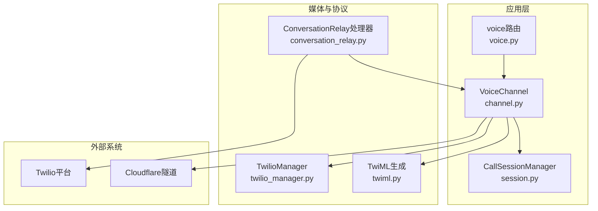
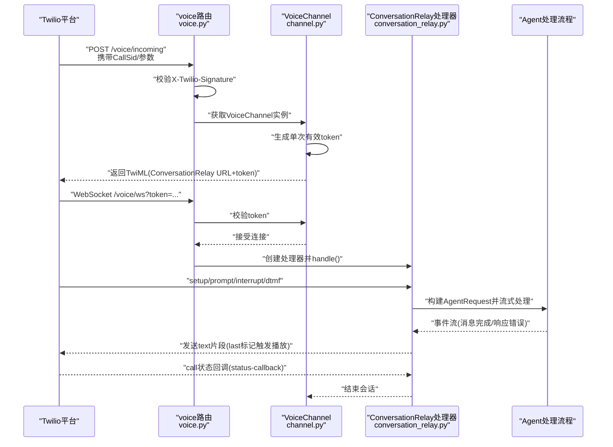
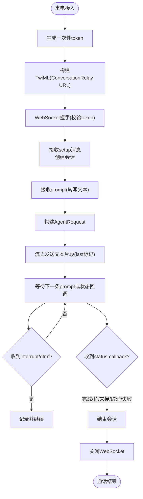
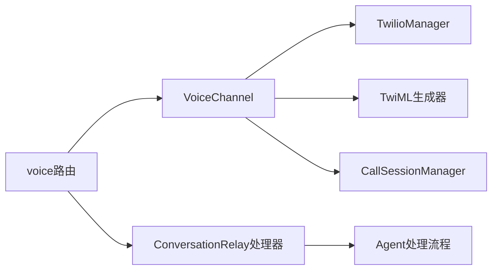

# 音视频平台集成

<cite>
**本文引用的文件**
- [src/qwenpaw/app/routers/voice.py](file://src/qwenpaw/app/routers/voice.py)
- [src/qwenpaw/app/channels/voice/channel.py](file://src/qwenpaw/app/channels/voice/channel.py)
- [src/qwenpaw/app/channels/voice/conversation_relay.py](file://src/qwenpaw/app/channels/voice/conversation_relay.py)
- [src/qwenpaw/app/channels/voice/twiml.py](file://src/qwenpaw/app/channels/voice/twiml.py)
- [src/qwenpaw/app/channels/voice/twilio_manager.py](file://src/qwenpaw/app/channels/voice/twilio_manager.py)
- [src/qwenpaw/app/channels/voice/session.py](file://src/qwenpaw/app/channels/voice/session.py)
- [src/qwenpaw/cli/channels_cmd.py](file://src/qwenpaw/cli/channels_cmd.py)
- [website/public/docs/channels.en.md](file://website/public/docs/channels.en.md)
- [src/qwenpaw/agents/utils/message_processing.py](file://src/qwenpaw/agents/utils/message_processing.py)
- [console/src/pages/Control/Channels/components/ChannelDrawer.tsx](file://console/src/pages/Control/Channels/components/ChannelDrawer.tsx)
</cite>

## 目录
1. [简介](#简介)
2. [项目结构](#项目结构)
3. [核心组件](#核心组件)
4. [架构总览](#架构总览)
5. [详细组件分析](#详细组件分析)
6. [依赖分析](#依赖分析)
7. [性能考虑](#性能考虑)
8. [故障排查指南](#故障排查指南)
9. [结论](#结论)
10. [附录](#附录)

## 简介
本指南面向在QwenPaw中集成音视频通讯平台（以Twilio为例）的开发者，覆盖电话语音通话、视频会议与音视频消息的集成实现。内容包括：
- 会话建立：Twilio来电接入、Webhook校验、WebSocket连接与令牌验证
- 媒体流处理：语音转写（STT）、文本转语音（TTS）、实时音频播放与中断处理
- 通话管理：会话生命周期、状态回调、错误恢复
- 音视频消息：格式转换、质量控制与带宽管理
- 完整配置示例：账户认证、号码配置、媒体服务器设置
- 质量优化与延迟控制、故障恢复策略

## 项目结构
QwenPaw通过“通道（Channel）+ 路由器（Router）+ 会话管理（Session）+ 外部服务适配器（Twilio/Twiml）”的分层设计，实现对Twilio等音视频平台的统一接入。

图表来源
- [src/qwenpaw/app/routers/voice.py:1-184](file://src/qwenpaw/app/routers/voice.py#L1-L184)
- [src/qwenpaw/app/channels/voice/channel.py:1-240](file://src/qwenpaw/app/channels/voice/channel.py#L1-L240)
- [src/qwenpaw/app/channels/voice/conversation_relay.py:1-289](file://src/qwenpaw/app/channels/voice/conversation_relay.py#L1-L289)
- [src/qwenpaw/app/channels/voice/twilio_manager.py:1-58](file://src/qwenpaw/app/channels/voice/twilio_manager.py#L1-L58)
- [src/qwenpaw/app/channels/voice/twiml.py:1-62](file://src/qwenpaw/app/channels/voice/twiml.py#L1-L62)
- [src/qwenpaw/app/channels/voice/session.py:1-73](file://src/qwenpaw/app/channels/voice/session.py#L1-L73)

章节来源
- [src/qwenpaw/app/routers/voice.py:1-184](file://src/qwenpaw/app/routers/voice.py#L1-L184)
- [src/qwenpaw/app/channels/voice/channel.py:1-240](file://src/qwenpaw/app/channels/voice/channel.py#L1-L240)

## 核心组件
- Twilio路由器（voice_router）
  - 提供Twilio调用入口、WebSocket端点与状态回调接口，并进行签名验证。
- VoiceChannel
  - 负责启动/停止通道、配置Webhook、生成单次有效WebSocket令牌、与会话管理器协作。
- TwilioManager
  - 异步封装Twilio SDK，用于更新电话号码的Webhook配置。
- TwiML生成器
  - 构建ConversationRelay所需的TwiML，指定TTS/STT提供商、语言与欢迎词。
- 会话管理器（CallSessionManager）
  - 维护活跃会话，记录开始时间、主被叫号码与状态；支持结束会话。
- ConversationRelay处理器
  - 处理来自Twilio的WebSocket消息（setup/prompt/interrupt/dtmf），构建Agent请求并流式回传文本片段给Twilio。

章节来源
- [src/qwenpaw/app/routers/voice.py:28-184](file://src/qwenpaw/app/routers/voice.py#L28-L184)
- [src/qwenpaw/app/channels/voice/channel.py:17-240](file://src/qwenpaw/app/channels/voice/channel.py#L17-L240)
- [src/qwenpaw/app/channels/voice/twilio_manager.py:12-58](file://src/qwenpaw/app/channels/voice/twilio_manager.py#L12-L58)
- [src/qwenpaw/app/channels/voice/twiml.py:8-62](file://src/qwenpaw/app/channels/voice/twiml.py#L8-L62)
- [src/qwenpaw/app/channels/voice/session.py:16-73](file://src/qwenpaw/app/channels/voice/session.py#L16-L73)
- [src/qwenpaw/app/channels/voice/conversation_relay.py:29-289](file://src/qwenpaw/app/channels/voice/conversation_relay.py#L29-L289)

## 架构总览
下图展示从Twilio到QwenPaw再到Agent的完整链路，以及会话管理与错误处理的关键节点。

图表来源
- [src/qwenpaw/app/routers/voice.py:42-184](file://src/qwenpaw/app/routers/voice.py#L42-L184)
- [src/qwenpaw/app/channels/voice/channel.py:100-160](file://src/qwenpaw/app/channels/voice/channel.py#L100-L160)
- [src/qwenpaw/app/channels/voice/conversation_relay.py:60-101](file://src/qwenpaw/app/channels/voice/conversation_relay.py#L60-L101)

章节来源
- [src/qwenpaw/app/routers/voice.py:84-184](file://src/qwenpaw/app/routers/voice.py#L84-L184)
- [src/qwenpaw/app/channels/voice/channel.py:81-160](file://src/qwenpaw/app/channels/voice/channel.py#L81-L160)

## 详细组件分析

### 语音通话集成（电话）
- 会话建立
  - Twilio来电触发voice路由的“incoming”端点，生成WSS URL与一次性token，返回TwiML指向ConversationRelay。
  - WebSocket端点接收连接前校验token，随后交由ConversationRelay处理器接管。
- 媒体流处理
  - 处理器解析setup消息获取CallSid与主被叫号码，创建会话。
  - 接收prompt消息（转写文本），构建AgentRequest，流式发送文本片段至Twilio，最后标记触发播放。
  - 支持interrupt（打断）与dtmf（按键）消息，便于交互控制。
- 通话管理
  - 会话管理器维护活跃会话，状态回调触发时结束会话。
  - 通道启动时自动配置Twilio Webhook与状态回调URL，使用Cloudflare隧道暴露本地服务。

图表来源
- [src/qwenpaw/app/channels/voice/conversation_relay.py:60-101](file://src/qwenpaw/app/channels/voice/conversation_relay.py#L60-L101)
- [src/qwenpaw/app/channels/voice/conversation_relay.py:185-226](file://src/qwenpaw/app/channels/voice/conversation_relay.py#L185-L226)
- [src/qwenpaw/app/channels/voice/session.py:59-63](file://src/qwenpaw/app/channels/voice/session.py#L59-L63)

章节来源
- [src/qwenpaw/app/routers/voice.py:84-184](file://src/qwenpaw/app/routers/voice.py#L84-L184)
- [src/qwenpaw/app/channels/voice/conversation_relay.py:103-183](file://src/qwenpaw/app/channels/voice/conversation_relay.py#L103-L183)
- [src/qwenpaw/app/channels/voice/session.py:34-73](file://src/qwenpaw/app/channels/voice/session.py#L34-L73)

### 视频会议集成（概念性说明）
- 平台选择
  - 可基于现有通道框架扩展，例如引入WebRTC或第三方视频SDK（如Twilio Video、Agora、Daily等）。
- 关键点
  - 会话管理：维护多方参与者的加入/离开、媒体权限与混音策略。
  - 媒体处理：采集、编码、传输与解码，结合AI能力（如字幕、降噪、美声）。
  - 控制面：主持人权限、静音/解除静音、录制开关、屏幕共享等。
- 与现有语音通道的关系
  - 可复用会话管理与消息路由机制，仅替换媒体栈与UI交互层。

[本节为概念性说明，不直接分析具体源码文件]

### 音视频消息集成（格式转换、质量与带宽）
- 格式转换
  - 自动模式：优先尝试转写（ASR），成功后以文本形式呈现；失败则提示安装依赖。
  - 原生模式：将音频转换为WAV并作为媒体块发送，若转换失败则显示占位提示。
- 质量控制
  - 通过配置项选择ASR/TTS提供商与语言，确保转写/合成质量。
  - 对于视频消息，可参考多模态探测与压缩策略，平衡清晰度与体积。
- 带宽管理
  - 在网络受限场景，建议降低采样率/码率或启用自适应码率。
  - 对长音频采用分段上传与断点续传，避免超时与丢包。

章节来源
- [src/qwenpaw/agents/utils/message_processing.py:239-296](file://src/qwenpaw/agents/utils/message_processing.py#L239-L296)

### 配置与部署（Twilio）
- CLI交互式配置
  - 支持逐项输入Twilio账号SID、认证令牌、电话号码、号码SID、TTS/STT提供商、语言与欢迎词等。
- 控制台配置
  - 在“控制 → 渠道 → 语音”页面启用并填写相应字段，支持即时保存与生效。
- 文档化配置
  - 提供手动编辑agent.json的示例，包含所有语音通道字段及默认值说明。
- Webhook与隧道
  - 启动通道时自动配置Twilio电话号码的Webhook与状态回调URL，使用Cloudflare隧道暴露本地端口。

章节来源
- [src/qwenpaw/cli/channels_cmd.py:512-608](file://src/qwenpaw/cli/channels_cmd.py#L512-L608)
- [console/src/pages/Control/Channels/components/ChannelDrawer.tsx:673-710](file://console/src/pages/Control/Channels/components/ChannelDrawer.tsx#L673-L710)
- [website/public/docs/channels.en.md:968-1046](file://website/public/docs/channels.en.md#L968-L1046)
- [src/qwenpaw/app/channels/voice/channel.py:114-130](file://src/qwenpaw/app/channels/voice/channel.py#L114-L130)

## 依赖分析
- 组件耦合
  - voice路由依赖VoiceChannel与TwiML生成器；VoiceChannel依赖TwilioManager与会话管理器；ConversationRelay处理器依赖FastAPI WebSocket与Agent事件流。
- 外部依赖
  - Twilio SDK（同步封装为异步）、Cloudflare隧道驱动、XML生成（ETree）。
- 潜在风险
  - 签名验证失败导致拒绝请求；Webhook配置失败导致无法接收来电；WebSocket令牌过期或重复使用导致连接被拒；会话未正确结束造成资源泄漏。

图表来源
- [src/qwenpaw/app/routers/voice.py:28-184](file://src/qwenpaw/app/routers/voice.py#L28-L184)
- [src/qwenpaw/app/channels/voice/channel.py:17-240](file://src/qwenpaw/app/channels/voice/channel.py#L17-L240)
- [src/qwenpaw/app/channels/voice/conversation_relay.py:29-289](file://src/qwenpaw/app/channels/voice/conversation_relay.py#L29-L289)

章节来源
- [src/qwenpaw/app/channels/voice/twilio_manager.py:12-58](file://src/qwenpaw/app/channels/voice/twilio_manager.py#L12-L58)
- [src/qwenpaw/app/channels/voice/twiml.py:8-37](file://src/qwenpaw/app/channels/voice/twiml.py#L8-L37)

## 性能考虑
- 延迟控制
  - 使用“每条消息完成后立即发送last标记”的策略，使Twilio尽早开始TTS播放，减少首包延迟。
  - WebSocket消息尽量短小、按块发送，避免一次性大包阻塞。
- 带宽与CPU
  - STT/TTS提供商的选择直接影响延迟与成本，建议在测试环境对比不同提供商的延迟与准确率。
  - 对于高并发场景，建议部署多实例并通过负载均衡分发请求。
- 重试与退避
  - 对外网调用（Webhook配置、TTS/STT）增加指数退避与超时控制，避免雪崩效应。

[本节为通用指导，不直接分析具体源码文件]

## 故障排查指南
- 签名验证失败
  - 确认已配置Twilio认证令牌；检查请求头X-Twilio-Signature是否随反向代理转发；必要时在开发环境允许跳过校验。
- Webhook未生效
  - 检查Cloudflare隧道是否正常运行且返回公共URL；确认Twilio电话号码的Voice配置URL与方法。
- WebSocket连接被拒
  - 核对一次性token是否正确传递与消费；检查token是否过期或重复使用。
- 通话未结束
  - 确认status-callback是否到达；查看会话管理器日志，确保结束会话逻辑执行。
- 转写/合成异常
  - 切换到原生模式并安装ffmpeg；检查ASR/TTS提供商可用性与网络连通性。

章节来源
- [src/qwenpaw/app/routers/voice.py:42-82](file://src/qwenpaw/app/routers/voice.py#L42-L82)
- [src/qwenpaw/app/channels/voice/channel.py:114-130](file://src/qwenpaw/app/channels/voice/channel.py#L114-L130)
- [src/qwenpaw/app/channels/voice/conversation_relay.py:247-267](file://src/qwenpaw/app/channels/voice/conversation_relay.py#L247-L267)
- [src/qwenpaw/app/channels/voice/session.py:59-63](file://src/qwenpaw/app/channels/voice/session.py#L59-L63)
- [src/qwenpaw/agents/utils/message_processing.py:239-296](file://src/qwenpaw/agents/utils/message_processing.py#L239-L296)

## 结论
QwenPaw通过模块化的通道架构与清晰的生命周期管理，为Twilio等音视频平台提供了稳定、可扩展的集成方案。语音通话路径已完整实现，视频会议与音视频消息可在现有框架上快速扩展。配合完善的配置与监控手段，可满足生产级的延迟、质量与可靠性要求。

[本节为总结性内容，不直接分析具体源码文件]

## 附录

### 配置字段清单（语音通道）
- 必填项
  - enabled：是否启用
  - twilio_account_sid：Twilio账号SID
  - twilio_auth_token：Twilio认证令牌
  - phone_number：已购买的电话号码
  - phone_number_sid：电话号码的SID
- 可选项
  - tts_provider：TTS提供商（默认google）
  - tts_voice：TTS声音模型（默认en-US-Journey-D）
  - stt_provider：STT提供商（默认deepgram）
  - language：语言代码（默认en-US）
  - welcome_greeting：来电欢迎语

章节来源
- [website/public/docs/channels.en.md:1029-1042](file://website/public/docs/channels.en.md#L1029-L1042)
- [console/src/pages/Control/Channels/components/ChannelDrawer.tsx:673-710](file://console/src/pages/Control/Channels/components/ChannelDrawer.tsx#L673-L710)