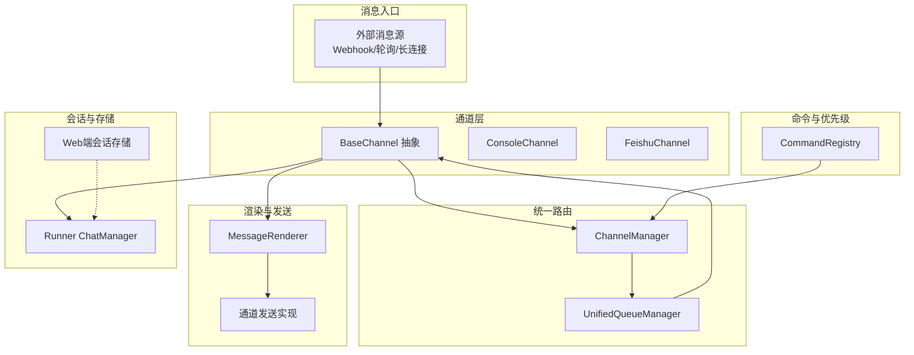
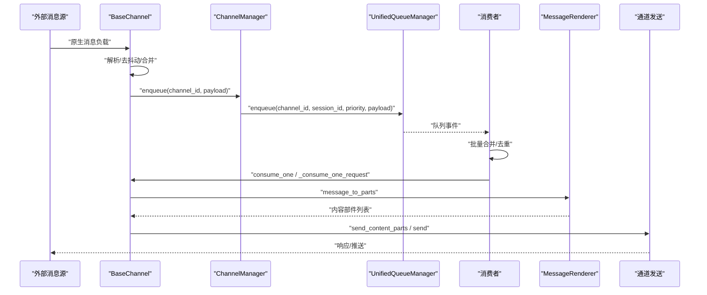
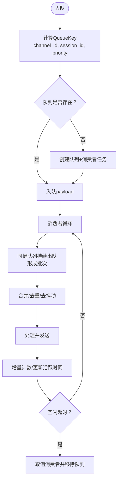
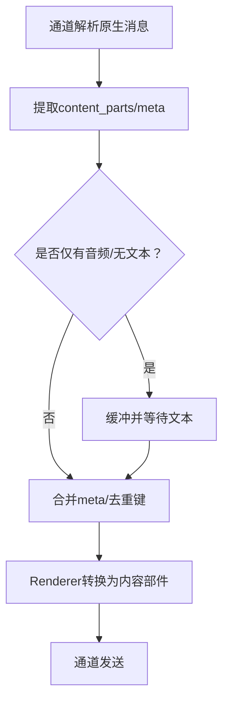
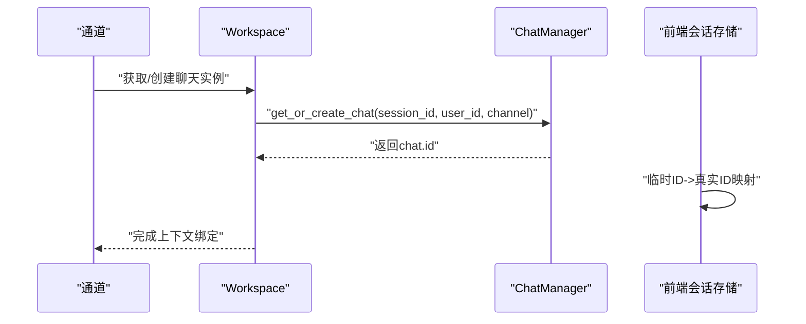
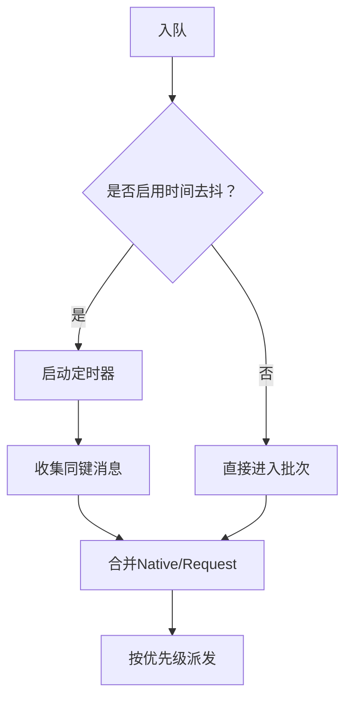
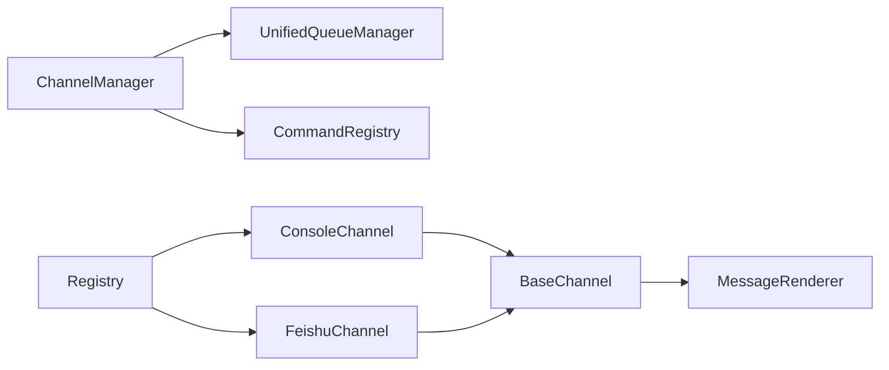

# 消息路由机制

<cite>
**本文档引用的文件**
- [unified_queue_manager.py](file://src/qwenpaw/app/channels/unified_queue_manager.py)
- [manager.py](file://src/qwenpaw/app/channels/manager.py)
- [base.py](file://src/qwenpaw/app/channels/base.py)
- [command_registry.py](file://src/qwenpaw/app/channels/command_registry.py)
- [renderer.py](file://src/qwenpaw/app/channels/renderer.py)
- [schema.py](file://src/qwenpaw/app/channels/schema.py)
- [registry.py](file://src/qwenpaw/app/channels/registry.py)
- [console/channel.py](file://src/qwenpaw/app/channels/console/channel.py)
- [feishu/channel.py](file://src/qwenpaw/app/channels/feishu/channel.py)
- [message_processing.py](file://src/qwenpaw/agents/utils/message_processing.py)
- [manager.py](file://src/qwenpaw/app/runner/manager.py)
- [index.ts](file://console/src/pages/Chat/sessionApi/index.ts)
</cite>

## 目录
1. [简介](#简介)
2. [项目结构](#项目结构)
3. [核心组件](#核心组件)
4. [架构总览](#架构总览)
5. [详细组件分析](#详细组件分析)
6. [依赖关系分析](#依赖关系分析)
7. [性能考虑](#性能考虑)
8. [故障排查指南](#故障排查指南)
9. [结论](#结论)
10. [附录](#附录)

## 简介
本文件系统性阐述 QwenPaw 的消息路由机制，覆盖从消息接收、解析、标准化、路由到发送的完整链路；深入分析消息格式标准化（内容类型转换、元数据提取与去重）、会话标识符生成与管理（用户ID映射、会话状态维护、上下文保持策略）、消息批处理与合并算法（时间窗口、数量阈值、优先级排序）、性能优化策略（缓存、并发控制、资源限制），以及监控指标与调试工具使用方法。

## 项目结构
消息路由相关代码主要集中在以下模块：
- 统一队列与路由：unified_queue_manager.py、manager.py
- 通道基类与渲染：base.py、renderer.py、schema.py
- 命令与优先级：command_registry.py
- 通道注册与发现：registry.py
- 具体通道实现：console/channel.py、feishu/channel.py
- 消息处理与媒体下载：agents/utils/message_processing.py
- 会话管理：app/runner/manager.py
- Web端会话持久化：console/src/pages/Chat/sessionApi/index.ts

图表来源
- [manager.py:68-110](file://src/qwenpaw/app/channels/manager.py#L68-L110)
- [unified_queue_manager.py:60-118](file://src/qwenpaw/app/channels/unified_queue_manager.py#L60-L118)
- [base.py:70-118](file://src/qwenpaw/app/channels/base.py#L70-L118)
- [command_registry.py:23-62](file://src/qwenpaw/app/channels/command_registry.py#L23-L62)
- [renderer.py:78-86](file://src/qwenpaw/app/channels/renderer.py#L78-L86)
- [console/channel.py:63-110](file://src/qwenpaw/app/channels/console/channel.py#L63-L110)
- [feishu/channel.py:158-221](file://src/qwenpaw/app/channels/feishu/channel.py#L158-L221)
- [manager.py:17-41](file://src/qwenpaw/app/runner/manager.py#L17-L41)
- [index.ts:281-303](file://console/src/pages/Chat/sessionApi/index.ts#L281-L303)

章节来源
- [manager.py:68-110](file://src/qwenpaw/app/channels/manager.py#L68-L110)
- [unified_queue_manager.py:60-118](file://src/qwenpaw/app/channels/unified_queue_manager.py#L60-L118)
- [base.py:70-118](file://src/qwenpaw/app/channels/base.py#L70-L118)
- [command_registry.py:23-62](file://src/qwenpaw/app/channels/command_registry.py#L23-L62)
- [renderer.py:78-86](file://src/qwenpaw/app/channels/renderer.py#L78-L86)
- [console/channel.py:63-110](file://src/qwenpaw/app/channels/console/channel.py#L63-L110)
- [feishu/channel.py:158-221](file://src/qwenpaw/app/channels/feishu/channel.py#L158-L221)
- [manager.py:17-41](file://src/qwenpaw/app/runner/manager.py#L17-L41)
- [index.ts:281-303](file://console/src/pages/Chat/sessionApi/index.ts#L281-L303)

## 核心组件
- 统一队列管理器（UnifiedQueueManager）
  - 以三元组键（channel_id, session_id, priority_level）为维度的动态队列与消费者管理，支持按会话与优先级隔离、自动清理空闲队列、统计与监控。
- 通道管理器（ChannelManager）
  - 负责将消息路由到统一队列，基于命令前缀计算优先级，执行批量合并与去抖动处理。
- 通道基类（BaseChannel）
  - 定义消息解析、请求构建、去抖动、工具调用过滤、渲染样式等通用能力；各通道实现具体解析与发送逻辑。
- 命令注册表（CommandRegistry）
  - 将命令前缀映射到优先级级别，支持“紧急/高/正常/低”等预定义级别与自定义扩展。
- 渲染器（MessageRenderer）
  - 将内部消息对象转换为可发送的内容部件（文本/图片/音频/视频/文件/拒绝），并支持工具消息过滤与思考内容过滤。
- 通道注册表（registry.py）
  - 内置通道与自定义通道的加载与发现，支持插件式扩展。
- 会话管理（Runner ChatManager）
  - 负责聊天规格的持久化与查询，配合前端会话存储实现会话状态维护。

章节来源
- [unified_queue_manager.py:60-118](file://src/qwenpaw/app/channels/unified_queue_manager.py#L60-L118)
- [manager.py:68-110](file://src/qwenpaw/app/channels/manager.py#L68-L110)
- [base.py:70-118](file://src/qwenpaw/app/channels/base.py#L70-L118)
- [command_registry.py:23-62](file://src/qwenpaw/app/channels/command_registry.py#L23-L62)
- [renderer.py:78-86](file://src/qwenpaw/app/channels/renderer.py#L78-L86)
- [registry.py:190-195](file://src/qwenpaw/app/channels/registry.py#L190-L195)
- [manager.py:17-41](file://src/qwenpaw/app/runner/manager.py#L17-L41)

## 架构总览
消息从外部进入后，经由通道解析为统一的 AgentRequest，随后通过 ChannelManager 进入 UnifiedQueueManager 的队列系统。队列按（通道, 会话, 优先级）隔离，消费者按批次拉取并合并快速到达的消息，再交由通道进行渲染与发送。

图表来源
- [manager.py:255-301](file://src/qwenpaw/app/channels/manager.py#L255-L301)
- [unified_queue_manager.py:119-164](file://src/qwenpaw/app/channels/unified_queue_manager.py#L119-L164)
- [base.py:659-758](file://src/qwenpaw/app/channels/base.py#L659-L758)
- [renderer.py:87-165](file://src/qwenpaw/app/channels/renderer.py#L87-L165)

章节来源
- [manager.py:255-301](file://src/qwenpaw/app/channels/manager.py#L255-L301)
- [unified_queue_manager.py:119-164](file://src/qwenpaw/app/channels/unified_queue_manager.py#L119-L164)
- [base.py:659-758](file://src/qwenpaw/app/channels/base.py#L659-L758)
- [renderer.py:87-165](file://src/qwenpaw/app/channels/renderer.py#L87-L165)

## 详细组件分析

### 统一队列与路由（UnifiedQueueManager 与 ChannelManager）
- 队列键设计：（channel_id, session_id, priority_level），确保同一会话与优先级内的严格串行，不同会话与优先级并发执行。
- 动态消费者：首次入队时创建消费者任务，空闲超时自动清理，避免固定工作池带来的资源浪费。
- 批量合并：消费者在单次循环中持续出队同键队列，形成批次，用于合并快速到达的消息（如多张图片）。
- 处理计数与监控：每批处理完成后更新 processed_count，并提供 get_metrics 接口供监控采集。

图表来源
- [unified_queue_manager.py:119-164](file://src/qwenpaw/app/channels/unified_queue_manager.py#L119-L164)
- [unified_queue_manager.py:214-273](file://src/qwenpaw/app/channels/unified_queue_manager.py#L214-L273)
- [unified_queue_manager.py:376-428](file://src/qwenpaw/app/channels/unified_queue_manager.py#L376-L428)
- [manager.py:396-431](file://src/qwenpaw/app/channels/manager.py#L396-L431)

章节来源
- [unified_queue_manager.py:60-118](file://src/qwenpaw/app/channels/unified_queue_manager.py#L60-L118)
- [unified_queue_manager.py:119-164](file://src/qwenpaw/app/channels/unified_queue_manager.py#L119-L164)
- [unified_queue_manager.py:214-273](file://src/qwenpaw/app/channels/unified_queue_manager.py#L214-L273)
- [unified_queue_manager.py:376-428](file://src/qwenpaw/app/channels/unified_queue_manager.py#L376-L428)
- [manager.py:396-431](file://src/qwenpaw/app/channels/manager.py#L396-L431)

### 消息格式标准化与去重
- 内容类型转换：Renderer 将内部消息对象转换为运行时内容部件（Text/Image/Audio/Video/File/Refusal），并支持工具消息与思考内容的过滤。
- 元数据提取：通道在解析原生消息时提取 sender_id、meta、会话上下文等信息，用于后续去重与路由。
- 去抖动与缓冲：BaseChannel 提供“无文本缓冲”机制，当消息仅含音频或无文本时先缓冲，待出现文本后再合并发送，避免半成品输入被提前处理。
- 媒体下载与本地化：message_processing 模块负责文件/音频/图片等媒体块的下载、格式转换与本地路径替换，保证下游发送稳定可靠。

图表来源
- [base.py:147-176](file://src/qwenpaw/app/channels/base.py#L147-L176)
- [base.py:249-281](file://src/qwenpaw/app/channels/base.py#L249-L281)
- [renderer.py:87-165](file://src/qwenpaw/app/channels/renderer.py#L87-L165)
- [message_processing.py:306-386](file://src/qwenpaw/agents/utils/message_processing.py#L306-L386)

章节来源
- [base.py:147-176](file://src/qwenpaw/app/channels/base.py#L147-L176)
- [base.py:249-281](file://src/qwenpaw/app/channels/base.py#L249-L281)
- [renderer.py:87-165](file://src/qwenpaw/app/channels/renderer.py#L87-L165)
- [message_processing.py:306-386](file://src/qwenpaw/agents/utils/message_processing.py#L306-L386)

### 会话标识符生成与管理
- 会话键生成：BaseChannel 默认以“channel:sender_id”作为 session_id；部分通道（如 Feishu）根据 chat_id/open_id 等上下文生成短会话键，便于定时任务查找。
- 用户ID映射：通道可从 meta 中提取真实 user_id（如 Feishu 的 open_id），确保 to_handle 与 user_id 一致。
- 上下文保持：通道在消费前从 workspace 获取/创建聊天实例，保证消息序列化与上下文一致性。
- Web端会话持久化：前端通过 sessionStorage 存储临时会话，后端解析真实ID并与前端回调同步，确保页面刷新不丢失会话状态。

图表来源
- [base.py:374-430](file://src/qwenpaw/app/channels/base.py#L374-L430)
- [manager.py:17-41](file://src/qwenpaw/app/runner/manager.py#L17-L41)
- [index.ts:281-303](file://console/src/pages/Chat/sessionApi/index.ts#L281-L303)

章节来源
- [base.py:374-430](file://src/qwenpaw/app/channels/base.py#L374-L430)
- [manager.py:17-41](file://src/qwenpaw/app/runner/manager.py#L17-L41)
- [index.ts:281-303](file://console/src/pages/Chat/sessionApi/index.ts#L281-L303)

### 消息批处理与合并算法
- 时间窗口：通道可设置 _debounce_seconds，在该窗口内对同一会话的多个原生消息进行合并，减少重复处理。
- 数量阈值：消费者在单次循环中持续出队同键队列，形成批次，用于合并快速到达的消息（如连续图片）。
- 优先级排序：ChannelManager 基于命令前缀识别控制命令，分配“紧急/高/正常/低”等优先级，确保关键命令优先处理。
- 合并策略：Native 消息按 content_parts 合并，AgentRequest 按 input 合并，保持语义连贯。

图表来源
- [base.py:659-758](file://src/qwenpaw/app/channels/base.py#L659-L758)
- [manager.py:39-66](file://src/qwenpaw/app/channels/manager.py#L39-L66)
- [command_registry.py:175-218](file://src/qwenpaw/app/channels/command_registry.py#L175-L218)

章节来源
- [base.py:659-758](file://src/qwenpaw/app/channels/base.py#L659-L758)
- [manager.py:39-66](file://src/qwenpaw/app/channels/manager.py#L39-L66)
- [command_registry.py:175-218](file://src/qwenpaw/app/channels/command_registry.py#L175-L218)

### 具体通道实现要点
- ConsoleChannel
  - 输出到终端，支持工具细节显示、思考内容过滤、媒体目录解析与本地化。
  - 支持显式 session_id 解析，便于 HTTP API 直接注入。
- FeishuChannel
  - WebSocket 接收、Open API 发送；支持去重（message_id）、昵称缓存、时钟偏移校正、媒体下载与本地化。
  - 会话键短化，便于定时任务查找；支持群聊/私聊场景。

章节来源
- [console/channel.py:63-110](file://src/qwenpaw/app/channels/console/channel.py#L63-L110)
- [console/channel.py:192-204](file://src/qwenpaw/app/channels/console/channel.py#L192-L204)
- [console/channel.py:332-448](file://src/qwenpaw/app/channels/console/channel.py#L332-L448)
- [feishu/channel.py:158-221](file://src/qwenpaw/app/channels/feishu/channel.py#L158-L221)
- [feishu/channel.py:309-329](file://src/qwenpaw/app/channels/feishu/channel.py#L309-L329)
- [feishu/channel.py:592-610](file://src/qwenpaw/app/channels/feishu/channel.py#L592-L610)

## 依赖关系分析
- 组件耦合
  - ChannelManager 依赖 UnifiedQueueManager 实现队列与消费者生命周期管理。
  - BaseChannel 依赖 Renderer 控制输出样式与内容部件生成。
  - CommandRegistry 为 ChannelManager 提供命令优先级决策。
  - 通道实现依赖 registry 加载与发现机制。
- 外部依赖
  - 通道实现可能依赖第三方 SDK（如 Feishu 的 lark-oapi）与 HTTP 客户端。
  - 媒体处理依赖 ffmpeg（可选）与本地文件系统。

图表来源
- [manager.py:68-110](file://src/qwenpaw/app/channels/manager.py#L68-L110)
- [unified_queue_manager.py:60-118](file://src/qwenpaw/app/channels/unified_queue_manager.py#L60-L118)
- [base.py:70-118](file://src/qwenpaw/app/channels/base.py#L70-L118)
- [renderer.py:78-86](file://src/qwenpaw/app/channels/renderer.py#L78-L86)
- [registry.py:190-195](file://src/qwenpaw/app/channels/registry.py#L190-L195)

章节来源
- [manager.py:68-110](file://src/qwenpaw/app/channels/manager.py#L68-L110)
- [unified_queue_manager.py:60-118](file://src/qwenpaw/app/channels/unified_queue_manager.py#L60-L118)
- [base.py:70-118](file://src/qwenpaw/app/channels/base.py#L70-L118)
- [renderer.py:78-86](file://src/qwenpaw/app/channels/renderer.py#L78-L86)
- [registry.py:190-195](file://src/qwenpaw/app/channels/registry.py#L190-L195)

## 性能考虑
- 缓存机制
  - 媒体下载与昵称缓存：FeishuChannel 使用内存缓存 message_id 与用户昵称，降低重复请求与 API 调用开销。
  - 工具内部结果过滤：Renderer 可过滤内部工具产生的媒体，减少不必要的用户侧展示。
- 并发控制
  - 动态消费者模型：按需创建消费者，避免固定线程池造成的资源浪费；空闲队列自动清理，释放资源。
  - 优先级调度：控制命令优先级更高，保障关键操作及时响应。
- 资源限制
  - 队列容量上限：统一队列最大长度限制，防止内存膨胀。
  - QPM 限流：在上游提供速率限制能力（参考 providers/rate_limiter.py），避免下游过载。
- 去抖与合并
  - 时间去抖与批量合并显著降低重复处理与网络往返次数，提升吞吐。

章节来源
- [unified_queue_manager.py:80-118](file://src/qwenpaw/app/channels/unified_queue_manager.py#L80-L118)
- [unified_queue_manager.py:376-428](file://src/qwenpaw/app/channels/unified_queue_manager.py#L376-L428)
- [base.py:249-281](file://src/qwenpaw/app/channels/base.py#L249-L281)
- [feishu/channel.py:235-243](file://src/qwenpaw/app/channels/feishu/channel.py#L235-L243)
- [rate_limiter.py:103-136](file://src/qwenpaw/providers/rate_limiter.py#L103-L136)

## 故障排查指南
- 日志定位
  - 统一队列：入队/出队/消费者启动/停止/清理日志，便于定位阻塞与资源泄漏。
  - 通道消费：去抖动触发、批量合并、错误处理与异常堆栈记录。
- 常见问题
  - 消息未送达：检查通道是否正确 set_enqueue，确认队列键是否一致（channel_id/session_id/priority）。
  - 重复消息：检查去重键（如 Feishu 的 message_id）与去抖动配置。
  - 会话错乱：核对 resolve_session_id 与 to_handle 映射，确保 user_id 与 session_id 一致。
  - 媒体无法播放：确认 ffmpeg 是否可用与格式转换是否成功，检查本地路径与 URL 替换。
- 监控与诊断
  - 使用 get_metrics 获取队列总数、每个队列的 qsize/processed_count/age/idle 等指标。
  - 前端会话存储：临时ID与真实ID映射失败时，检查 resolveRealId 流程与 onSessionIdResolved 回调。

章节来源
- [unified_queue_manager.py:430-471](file://src/qwenpaw/app/channels/unified_queue_manager.py#L430-L471)
- [manager.py:362-446](file://src/qwenpaw/app/channels/manager.py#L362-L446)
- [base.py:659-758](file://src/qwenpaw/app/channels/base.py#L659-L758)
- [feishu/channel.py:592-610](file://src/qwenpaw/app/channels/feishu/channel.py#L592-L610)
- [index.ts:281-303](file://console/src/pages/Chat/sessionApi/index.ts#L281-L303)

## 结论
QwenPaw 的消息路由机制通过“统一队列 + 通道抽象 + 命令优先级”的组合，实现了高并发、可扩展、可观测的消息处理体系。其去抖动、批量合并与媒体本地化等特性有效提升了用户体验与系统稳定性；动态消费者与资源清理策略则确保了长期运行的健壮性。结合完善的监控与调试手段，可在生产环境中实现高效运维与快速问题定位。

## 附录
- 关键接口与职责
  - UnifiedQueueManager：队列创建/消费者管理/空闲清理/监控指标
  - ChannelManager：消息入队/优先级计算/批量合并/通道生命周期
  - BaseChannel：消息解析/去抖动/请求构建/渲染/发送
  - CommandRegistry：命令前缀到优先级的映射
  - MessageRenderer：消息到内容部件的转换与样式控制
  - Runner ChatManager：聊天规格的持久化与查询
  - Web端 SessionApi：临时ID与真实ID映射、会话持久化

章节来源
- [unified_queue_manager.py:60-118](file://src/qwenpaw/app/channels/unified_queue_manager.py#L60-L118)
- [manager.py:68-110](file://src/qwenpaw/app/channels/manager.py#L68-L110)
- [base.py:70-118](file://src/qwenpaw/app/channels/base.py#L70-L118)
- [command_registry.py:23-62](file://src/qwenpaw/app/channels/command_registry.py#L23-L62)
- [renderer.py:78-86](file://src/qwenpaw/app/channels/renderer.py#L78-L86)
- [manager.py:17-41](file://src/qwenpaw/app/runner/manager.py#L17-L41)
- [index.ts:281-303](file://console/src/pages/Chat/sessionApi/index.ts#L281-L303)