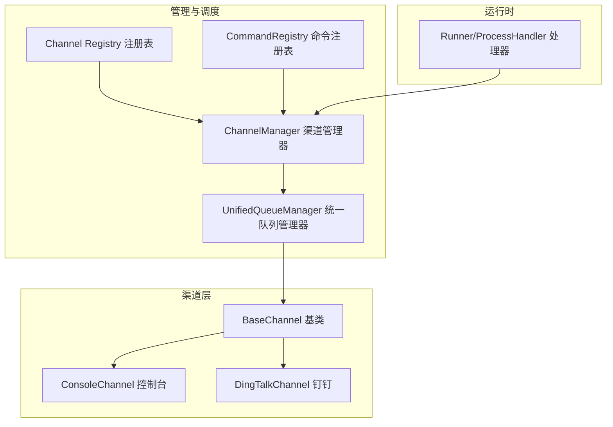
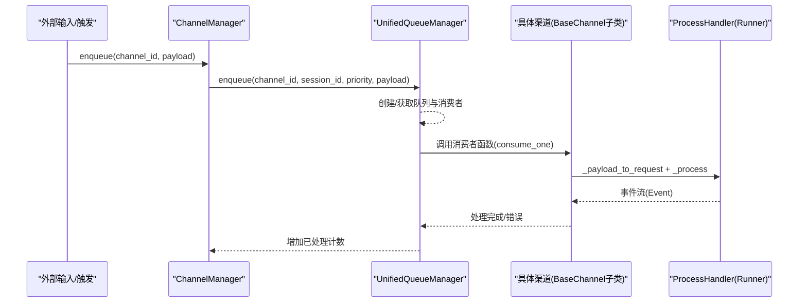
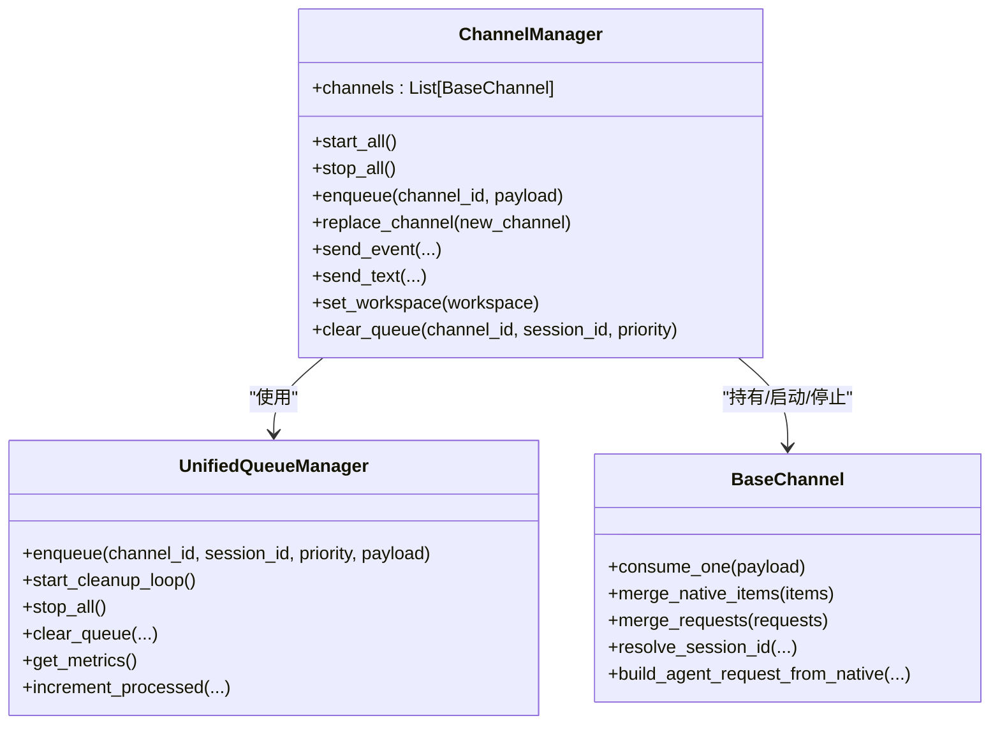
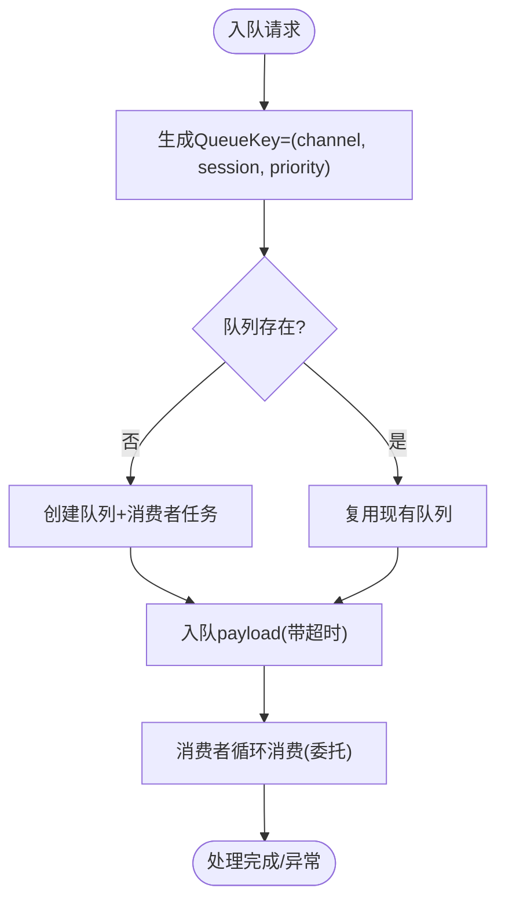
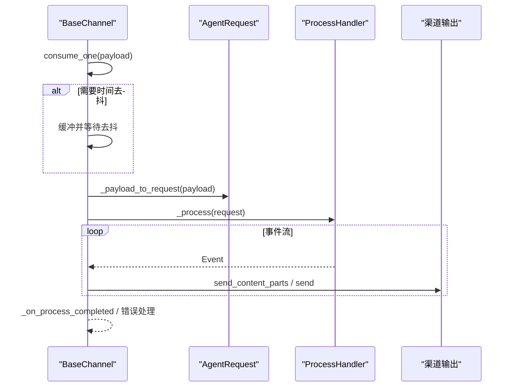
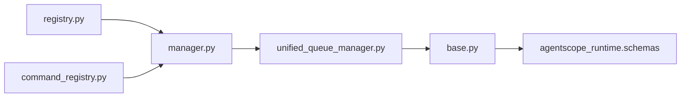

# 渠道管理器

<cite>
**本文引用的文件**
- [manager.py](file://src/qwenpaw/app/channels/manager.py)
- [unified_queue_manager.py](file://src/qwenpaw/app/channels/unified_queue_manager.py)
- [base.py](file://src/qwenpaw/app/channels/base.py)
- [command_registry.py](file://src/qwenpaw/app/channels/command_registry.py)
- [registry.py](file://src/qwenpaw/app/channels/registry.py)
- [schema.py](file://src/qwenpaw/app/channels/schema.py)
- [utils.py](file://src/qwenpaw/app/channels/utils.py)
- [console/channel.py](file://src/qwenpaw/app/channels/console/channel.py)
- [dingtalk/channel.py](file://src/qwenpaw/app/channels/dingtalk/channel.py)
</cite>

## 目录
1. [简介](#简介)
2. [项目结构](#项目结构)
3. [核心组件](#核心组件)
4. [架构总览](#架构总览)
5. [详细组件分析](#详细组件分析)
6. [依赖分析](#依赖分析)
7. [性能考量](#性能考量)
8. [故障排查指南](#故障排查指南)
9. [结论](#结论)
10. [附录](#附录)

## 简介
本文件为 QwenPaw 的 ChannelManager 技术文档，聚焦于渠道管理器的职责边界与实现细节，涵盖：
- 渠道实例化与生命周期管理
- 统一队列管理机制（任务调度、优先级处理、批量合并）
- 消息入队/出队与线程安全、异步处理流程
- 渠道替换与热更新（无缝切换与状态迁移）
- 监控与故障恢复（健康检查、超时处理、重试策略）
- 性能优化技巧与最佳实践

## 项目结构
ChannelManager 所在模块位于 src/qwenpaw/app/channels，核心文件如下：
- manager.py：ChannelManager 实现，负责渠道实例化、统一队列路由、生命周期管理、替换与热更新
- unified_queue_manager.py：统一队列管理器，按 (渠道, 会话, 优先级) 维度隔离与并发控制
- base.py：所有渠道的基础抽象，定义消费接口、时间去抖、内容合并等通用能力
- command_registry.py：命令注册表，用于根据用户查询提取优先级
- registry.py：渠道注册表，内置与自定义渠道发现与加载
- schema.py：渠道类型与路由协议
- utils.py：通道与 Runner 的桥接工具与文本分片等辅助函数
- console/channel.py：控制台渠道示例，展示输出侧行为
- dingtalk/channel.py：钉钉渠道示例，展示复杂会话与 Webhook 存储逻辑

图表来源
- [manager.py:1-711](file://src/qwenpaw/app/channels/manager.py#L1-L711)
- [unified_queue_manager.py:1-498](file://src/qwenpaw/app/channels/unified_queue_manager.py#L1-L498)
- [base.py:1-800](file://src/qwenpaw/app/channels/base.py#L1-L800)
- [command_registry.py:1-267](file://src/qwenpaw/app/channels/command_registry.py#L1-L267)
- [registry.py:1-195](file://src/qwenpaw/app/channels/registry.py#L1-L195)
- [console/channel.py:1-590](file://src/qwenpaw/app/channels/console/channel.py#L1-L590)
- [dingtalk/channel.py:1-800](file://src/qwenpaw/app/channels/dingtalk/channel.py#L1-L800)

章节来源
- [manager.py:1-711](file://src/qwenpaw/app/channels/manager.py#L1-L711)
- [unified_queue_manager.py:1-498](file://src/qwenpaw/app/channels/unified_queue_manager.py#L1-L498)
- [base.py:1-800](file://src/qwenpaw/app/channels/base.py#L1-L800)
- [command_registry.py:1-267](file://src/qwenpaw/app/channels/command_registry.py#L1-L267)
- [registry.py:1-195](file://src/qwenpaw/app/channels/registry.py#L1-L195)
- [console/channel.py:1-590](file://src/qwenpaw/app/channels/console/channel.py#L1-L590)
- [dingtalk/channel.py:1-800](file://src/qwenpaw/app/channels/dingtalk/channel.py#L1-L800)

## 核心组件
- ChannelManager：框架内拥有各渠道实例与统一队列系统，负责从环境或配置创建渠道、设置回调、启动/停止、替换与热更新、发送事件与文本等
- UnifiedQueueManager：按 (channel_id, session_id, priority_level) 三元键隔离的动态队列与消费者，支持自动清理空闲队列、统计指标、增量计数
- BaseChannel：渠道抽象基类，定义 consume_one/_consume_one_request、时间去抖、内容合并、请求构建、发送接口等
- CommandRegistry：命令到优先级映射，支持“紧急/高/普通/低”等预设级别与扩展级别
- Channel Registry：内置与自定义渠道的发现与加载
- Schema：渠道类型标识与路由协议
- Utils：文本分片、URL 到本地路径转换、ProcessHandler 构造等

章节来源
- [manager.py:68-711](file://src/qwenpaw/app/channels/manager.py#L68-L711)
- [unified_queue_manager.py:60-498](file://src/qwenpaw/app/channels/unified_queue_manager.py#L60-L498)
- [base.py:70-800](file://src/qwenpaw/app/channels/base.py#L70-L800)
- [command_registry.py:23-267](file://src/qwenpaw/app/channels/command_registry.py#L23-L267)
- [registry.py:190-195](file://src/qwenpaw/app/channels/registry.py#L190-L195)
- [schema.py:12-71](file://src/qwenpaw/app/channels/schema.py#L12-L71)
- [utils.py:18-134](file://src/qwenpaw/app/channels/utils.py#L18-L134)

## 架构总览
ChannelManager 作为统一入口，通过 Channel Registry 发现并实例化渠道；每个渠道通过 set_enqueue 将消息回传给 ChannelManager；ChannelManager 将消息交给 UnifiedQueueManager，后者按三元键创建队列与消费者，并在消费者内部调用渠道的 consume_one/_consume_one_request 完成实际处理。

图表来源
- [manager.py:349-446](file://src/qwenpaw/app/channels/manager.py#L349-L446)
- [unified_queue_manager.py:119-273](file://src/qwenpaw/app/channels/unified_queue_manager.py#L119-L273)
- [base.py:659-800](file://src/qwenpaw/app/channels/base.py#L659-L800)

## 详细组件分析

### ChannelManager：渠道实例化、生命周期与统一队列
- 实例化
  - from_env：从环境变量创建渠道集合
  - from_config：从配置对象创建渠道集合，支持启用开关、过滤选项、工作区目录注入
- 生命周期
  - start_all：初始化 UnifiedQueueManager、启动清理循环、为使用队列的渠道设置 enqueue 回调、逐个启动渠道
  - stop_all：取消待处理入队任务、停止队列管理器、停止各渠道
- 统一队列路由
  - enqueue：线程安全地将 payload 投递到事件循环中，提取查询文本进行优先级分类，计算 session_id 并以任务形式入队，带超时保护
  - _enqueue_with_timeout：对入队操作设置超时，避免阻塞
  - _consume_queue：消费者循环，从队列取出一批 payload，进行批量合并（native 或 request），调用 _process_batch，更新已处理计数
  - _process_batch：根据是否为原生负载与合并策略，决定调用 _consume_one_request 或 consume_one
- 替换与热更新
  - replace_channel：先设置 enqueue 回调并启动新渠道（可能耗时，如钉钉），再在锁内交换旧渠道并停止旧渠道，实现无缝切换
- 其他能力
  - send_event/send_text：向指定渠道发送事件或纯文本
  - set_workspace：向渠道注入工作区与命令注册表
  - clear_queue：清空指定队列

图表来源
- [manager.py:68-711](file://src/qwenpaw/app/channels/manager.py#L68-L711)
- [unified_queue_manager.py:60-498](file://src/qwenpaw/app/channels/unified_queue_manager.py#L60-L498)
- [base.py:70-800](file://src/qwenpaw/app/channels/base.py#L70-L800)

章节来源
- [manager.py:68-711](file://src/qwenpaw/app/channels/manager.py#L68-L711)

### UnifiedQueueManager：统一队列管理机制
- 关键特性
  - 动态消费者：按需创建队列与消费者，无固定工作池
  - 三元键隔离：(channel_id, session_id, priority_level)，同一键严格串行，不同键并发
  - 自动清理：空闲队列定时清理，释放资源
  - 指标统计：可获取队列总数、每个队列的大小、处理计数、年龄与空闲时长
- 核心方法
  - enqueue：创建/获取队列，入队并带超时保护
  - _get_or_create_queue：创建队列与消费者任务
  - _run_consumer：消费者循环委托给外部 consumer_fn
  - start_cleanup_loop/stop_all：后台清理循环启停
  - clear_queue/get_metrics/increment_processed：队列清理、监控与计数

图表来源
- [unified_queue_manager.py:119-273](file://src/qwenpaw/app/channels/unified_queue_manager.py#L119-L273)
- [unified_queue_manager.py:376-428](file://src/qwenpaw/app/channels/unified_queue_manager.py#L376-L428)

章节来源
- [unified_queue_manager.py:60-498](file://src/qwenpaw/app/channels/unified_queue_manager.py#L60-L498)

### BaseChannel：渠道抽象与消息处理
- 消费流程
  - consume_one：支持时间去抖（native payload）与无文本缓冲，最终调用 _consume_one_request
  - _consume_one_request：解析 payload 为 AgentRequest，必要时通过 TaskTracker 与命令注册表判断是否为控制命令，然后走 _process 流程并发送响应
- 合并与去抖
  - merge_native_items/merge_requests：对同会话多条消息进行合并，native 合并 meta 与 content_parts，request 合并 input 内容
  - 时间去抖：_apply_no_text_debounce/_content_has_text 等，避免无文本消息过早发送
- 请求构建与发送
  - build_agent_request_from_native：将渠道原生负载转为 AgentRequest
  - send_content_parts/send：发送内容部件或纯文本
- 会话与目标
  - resolve_session_id：将 sender_id 与 meta 映射为 session_id
  - get_to_handle_from_request/to_handle_from_target：发送目标解析

图表来源
- [base.py:659-800](file://src/qwenpaw/app/channels/base.py#L659-L800)

章节来源
- [base.py:70-800](file://src/qwenpaw/app/channels/base.py#L70-L800)

### 命令注册与优先级处理
- CommandRegistry：提供命令前缀到优先级的映射，默认包含“紧急/高/普通/低”，支持直接指定级别或使用名称
- ChannelManager 在入队时提取查询文本，通过 CommandRegistry 获取优先级，从而影响队列键与调度顺序

章节来源
- [command_registry.py:23-267](file://src/qwenpaw/app/channels/command_registry.py#L23-L267)
- [manager.py:284-284](file://src/qwenpaw/app/channels/manager.py#L284-L284)

### 渠道注册与发现
- registry.py：内置渠道清单与加载逻辑，支持自定义渠道目录扫描与缓存，失败不影响启动（除必需渠道）

章节来源
- [registry.py:190-195](file://src/qwenpaw/app/channels/registry.py#L190-L195)

### 渠道替换与热更新
- replace_channel：先设置 enqueue 回调并启动新渠道（可能较慢），再在锁内交换旧渠道并停止旧渠道，确保队列与消费者由 UnifiedQueueManager 管理，无需额外同步
- 适用场景：在线升级、配置变更、故障切换

章节来源
- [manager.py:571-630](file://src/qwenpaw/app/channels/manager.py#L571-L630)

### 渠道消息的入队/出队机制与线程安全
- 入队
  - ChannelManager.enqueue 使用事件循环的 call_soon_threadsafe 将 _enqueue_one 调度到事件循环，避免跨线程共享状态
  - _enqueue_one 提取优先级与 session_id，封装为任务并加入 _enqueue_tasks，带超时保护
- 出队
  - UnifiedQueueManager.enqueue 对入队本身也做超时保护，防止阻塞
  - 消费者循环在 _consume_queue 中 drain 同键队列，批量合并后调用 _process_batch
- 线程安全
  - UnifiedQueueManager 内部使用 asyncio.Lock 保护队列字典
  - ChannelManager 使用 asyncio.Lock 保护渠道列表交换

章节来源
- [manager.py:349-446](file://src/qwenpaw/app/channels/manager.py#L349-L446)
- [unified_queue_manager.py:119-273](file://src/qwenpaw/app/channels/unified_queue_manager.py#L119-L273)

### 渠道监控与故障恢复
- 监控
  - UnifiedQueueManager.get_metrics：返回队列总数、每个队列的 qsize、processed_count、age_seconds、idle_seconds
- 故障恢复
  - 入队/出队超时保护：统一超时上限，避免无限阻塞
  - 清理循环：空闲队列自动取消消费者并移除，降低资源占用
  - stop_all：优雅关闭，取消待处理任务并等待消费者退出

章节来源
- [unified_queue_manager.py:430-471](file://src/qwenpaw/app/channels/unified_queue_manager.py#L430-L471)
- [unified_queue_manager.py:376-428](file://src/qwenpaw/app/channels/unified_queue_manager.py#L376-L428)
- [manager.py:479-526](file://src/qwenpaw/app/channels/manager.py#L479-L526)

### 示例：控制台与钉钉渠道
- ConsoleChannel：终端输出，支持媒体文件解析与推送前端存储
- DingTalkChannel：复杂会话与 Webhook 存储，支持 AI 卡片、去重、早期确认与批量回复

章节来源
- [console/channel.py:63-590](file://src/qwenpaw/app/channels/console/channel.py#L63-L590)
- [dingtalk/channel.py:112-800](file://src/qwenpaw/app/channels/dingtalk/channel.py#L112-L800)

## 依赖分析
- ChannelManager 依赖
  - Channel Registry：发现与加载渠道类
  - CommandRegistry：命令到优先级映射
  - UnifiedQueueManager：统一队列与消费者管理
  - BaseChannel：渠道抽象与消费接口
- UnifiedQueueManager 依赖
  - asyncio.Queue/Task：异步队列与消费者任务
  - asyncio.Lock：并发安全
- BaseChannel 依赖
  - agentscope_runtime 引擎的 Message/Content 类型
  - 渲染器与消息渲染样式

图表来源
- [registry.py:190-195](file://src/qwenpaw/app/channels/registry.py#L190-L195)
- [manager.py:68-711](file://src/qwenpaw/app/channels/manager.py#L68-L711)
- [unified_queue_manager.py:60-498](file://src/qwenpaw/app/channels/unified_queue_manager.py#L60-L498)
- [base.py:24-38](file://src/qwenpaw/app/channels/base.py#L24-L38)

章节来源
- [registry.py:190-195](file://src/qwenpaw/app/channels/registry.py#L190-L195)
- [manager.py:68-711](file://src/qwenpaw/app/channels/manager.py#L68-L711)
- [unified_queue_manager.py:60-498](file://src/qwenpaw/app/channels/unified_queue_manager.py#L60-L498)
- [base.py:24-38](file://src/qwenpaw/app/channels/base.py#L24-L38)

## 性能考量
- 队列隔离与并发
  - 通过三元键隔离，同一会话与优先级严格串行，不同会话/优先级并发，最大化吞吐
- 批量合并
  - 消费者 drain 同键队列，合并 native/request 消息，减少重复处理成本
- 超时与背压
  - 入队/出队均设置超时，避免阻塞；队列有最大长度限制
- 自动清理
  - 空闲队列定期清理，释放消费者任务与内存
- 文本分片
  - 工具函数 split_text 支持按换行与代码块边界分片，避免超长消息导致平台限制
- 去抖与缓冲
  - 无文本消息缓冲与音频直通，减少无效往返

章节来源
- [unified_queue_manager.py:119-164](file://src/qwenpaw/app/channels/unified_queue_manager.py#L119-L164)
- [base.py:147-209](file://src/qwenpaw/app/channels/base.py#L147-L209)
- [base.py:242-282](file://src/qwenpaw/app/channels/base.py#L242-L282)
- [utils.py:18-76](file://src/qwenpaw/app/channels/utils.py#L18-L76)

## 故障排查指南
- 入队失败/超时
  - 现象：日志出现“Queue full timeout”或“Enqueue failed”
  - 排查：检查队列最大长度、消费者处理速度、是否有大量同键消息堆积
- 消费者异常
  - 现象：日志出现“Consumer failed/cancelled”
  - 排查：查看渠道实现中的 _process 与发送逻辑，确认网络/鉴权/权限问题
- 清理循环异常
  - 现象：队列未被清理或清理报错
  - 排查：确认 start_cleanup_loop 是否调用、运行标志与锁状态
- 替换失败
  - 现象：新渠道无法启动或旧渠道未停止
  - 排查：检查 replace_channel 的回调设置、启动顺序与锁范围
- 会话/目标解析
  - 现象：消息未正确路由或发送目标不正确
  - 排查：核对 resolve_session_id 与 get_to_handle_from_request 的实现

章节来源
- [unified_queue_manager.py:146-157](file://src/qwenpaw/app/channels/unified_queue_manager.py#L146-L157)
- [unified_queue_manager.py:256-263](file://src/qwenpaw/app/channels/unified_queue_manager.py#L256-L263)
- [manager.py:595-606](file://src/qwenpaw/app/channels/manager.py#L595-L606)
- [base.py:557-567](file://src/qwenpaw/app/channels/base.py#L557-L567)

## 结论
ChannelManager 通过统一队列管理器实现了对多渠道的高效、隔离与并发调度，结合命令优先级与批量合并策略，在保证消息有序性的同时提升了整体吞吐。其替换与热更新机制确保了运行时的平滑演进。配合监控与超时保护，系统具备良好的可观测性与稳定性。

## 附录
- 最佳实践
  - 合理设置队列最大长度与清理间隔，平衡延迟与资源占用
  - 使用 CommandRegistry 为关键命令分配更高优先级，保障紧急指令及时响应
  - 在渠道实现中充分利用 merge_native_items/merge_requests，减少重复处理
  - 对外发消息进行分片与去抖，提升平台兼容性与用户体验
  - 在替换渠道时遵循“先设置回调+启动新渠道，再锁内交换并停止旧渠道”的流程