# 渠道适配器架构

<cite>
**本文档引用的文件**
- [base.py](file://src/qwenpaw/app/channels/base.py)
- [command_registry.py](file://src/qwenpaw/app/channels/command_registry.py)
- [manager.py](file://src/qwenpaw/app/channels/manager.py)
- [registry.py](file://src/qwenpaw/app/channels/registry.py)
- [schema.py](file://src/qwenpaw/app/channels/schema.py)
- [unified_queue_manager.py](file://src/qwenpaw/app/channels/unified_queue_manager.py)
- [console/channel.py](file://src/qwenpaw/app/channels/console/channel.py)
- [dingtalk/channel.py](file://src/qwenpaw/app/channels/dingtalk/channel.py)
- [telegram/channel.py](file://src/qwenpaw/app/channels/telegram/channel.py)
- [feishu/channel.py](file://src/qwenpaw/app/channels/feishu/channel.py)
- [renderer.py](file://src/qwenpaw/app/channels/renderer.py)
- [utils.py](file://src/qwenpaw/app/channels/utils.py)
- [config.py](file://src/qwenpaw/config/config.py)
</cite>

## 目录
1. [简介](#简介)
2. [项目结构](#项目结构)
3. [核心组件](#核心组件)
4. [架构概览](#架构概览)
5. [详细组件分析](#详细组件分析)
6. [依赖关系分析](#依赖关系分析)
7. [性能考虑](#性能考虑)
8. [故障排除指南](#故障排除指南)
9. [结论](#结论)

## 简介

QwenPaw的渠道适配器架构是一个高度模块化、可扩展的消息通道系统，支持多种即时通讯平台（如微信、钉钉、Telegram、飞书等）与AI代理的集成。该架构采用统一的BaseChannel基类设计，通过抽象接口和多态实现，为不同平台提供一致的开发体验和运行时行为。

该系统的核心设计理念是：
- **统一抽象**：所有渠道都继承自BaseChannel基类，遵循相同的接口规范
- **异步处理**：基于asyncio的异步消息处理模型，支持高并发场景
- **队列管理**：内置统一队列管理系统，支持优先级调度和会话隔离
- **插件化架构**：支持内置渠道和自定义渠道的动态加载
- **消息渲染**：可插拔的消息渲染器，支持不同渠道的内容格式化

## 项目结构

渠道适配器架构主要分布在以下目录中：

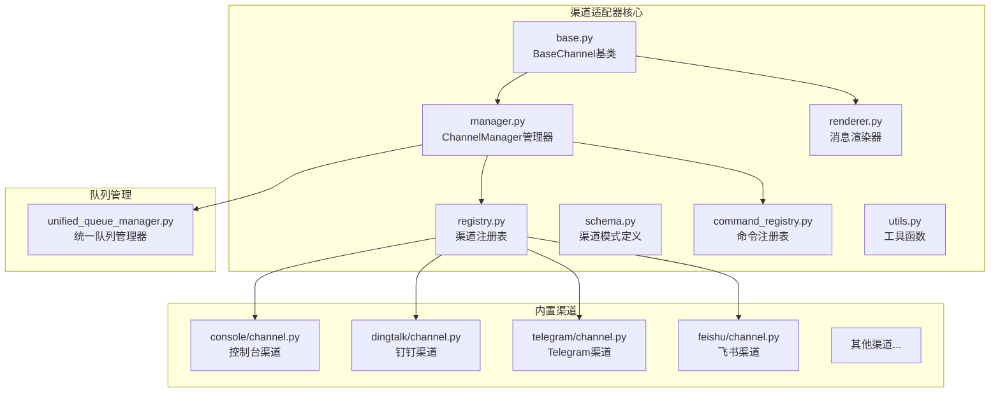

**图表来源**
- [base.py:1-1171](file://src/qwenpaw/app/channels/base.py#L1-L1171)
- [manager.py:1-711](file://src/qwenpaw/app/channels/manager.py#L1-L711)
- [registry.py:1-195](file://src/qwenpaw/app/channels/registry.py#L1-L195)

**章节来源**
- [base.py:1-1171](file://src/qwenpaw/app/channels/base.py#L1-L1171)
- [manager.py:1-711](file://src/qwenpaw/app/channels/manager.py#L1-L711)
- [registry.py:1-195](file://src/qwenpaw/app/channels/registry.py#L1-L195)

## 核心组件

### BaseChannel基类设计

BaseChannel是整个渠道适配器架构的基石，提供了统一的抽象接口和通用功能：

#### 核心特性
- **消息处理抽象**：定义了`consume_one()`方法作为消息处理入口
- **请求构建**：提供`build_agent_request_from_native()`用于将原生消息转换为AgentRequest
- **会话管理**：通过`resolve_session_id()`方法管理会话标识符
- **内容类型定义**：使用agentscope_runtime的Content类型系统
- **生命周期管理**：支持start()和stop()生命周期方法

#### 关键接口
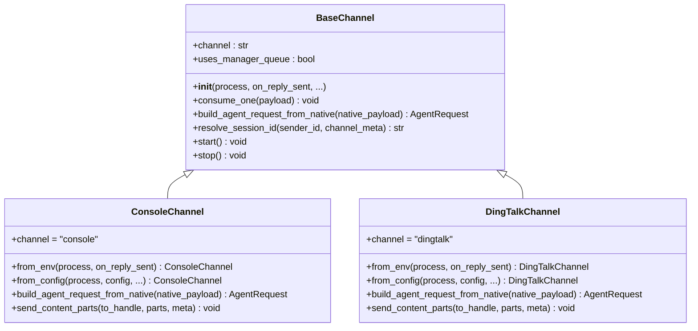

**图表来源**
- [base.py:70-120](file://src/qwenpaw/app/channels/base.py#L70-L120)
- [console/channel.py:63-100](file://src/qwenpaw/app/channels/console/channel.py#L63-L100)
- [dingtalk/channel.py:112-150](file://src/qwenpaw/app/channels/dingtalk/channel.py#L112-L150)

#### 内容类型系统

渠道适配器使用统一的内容类型系统，支持多种媒体格式：

| 内容类型 | 描述 | 使用场景 |
|---------|------|----------|
| TextContent | 文本内容 | 普通消息、思考过程 |
| ImageContent | 图像内容 | 图片分享、截图 |
| VideoContent | 视频内容 | 视频分享、演示 |
| AudioContent | 音频内容 | 语音消息、音频文件 |
| FileContent | 文件内容 | 文档、压缩包 |
| RefusalContent | 拒绝内容 | 模型拒绝回答 |

**章节来源**
- [base.py:59-67](file://src/qwenpaw/app/channels/base.py#L59-L67)
- [renderer.py:26-34](file://src/qwenpaw/app/channels/renderer.py#L26-L34)

### ChannelManager管理器

ChannelManager负责管理所有渠道实例，提供统一的入口点：

#### 主要职责
- **渠道生命周期管理**：启动、停止所有渠道
- **消息路由**：将消息分发到相应的渠道处理器
- **队列协调**：管理统一队列系统的消费者
- **工作空间集成**：注入工作空间上下文

#### 核心流程
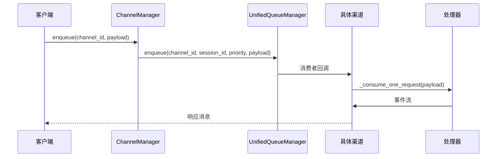

**图表来源**
- [manager.py:39-66](file://src/qwenpaw/app/channels/manager.py#L39-L66)
- [unified_queue_manager.py:119-164](file://src/qwenpaw/app/channels/unified_queue_manager.py#L119-L164)

**章节来源**
- [manager.py:68-214](file://src/qwenpaw/app/channels/manager.py#L68-L214)
- [unified_queue_manager.py:60-118](file://src/qwenpaw/app/channels/unified_queue_manager.py#L60-L118)

### CommandRegistry命令注册表

CommandRegistry实现了优先级驱动的命令识别系统：

#### 优先级级别
- **critical (0)**：紧急控制命令（如/stop）
- **high (10)**：高级查询命令（如/status）
- **normal (20)**：常规消息（默认级别）
- **low (30)**：批处理任务

#### 查询匹配算法
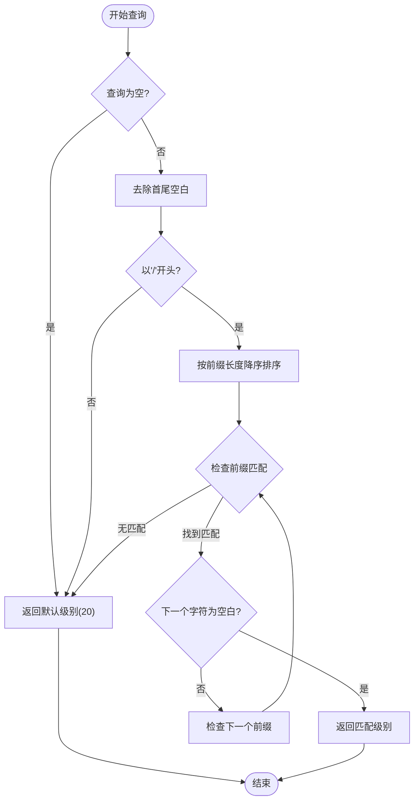

**图表来源**
- [command_registry.py:136-174](file://src/qwenpaw/app/channels/command_registry.py#L136-L174)
- [command_registry.py:175-218](file://src/qwenpaw/app/channels/command_registry.py#L175-L218)

**章节来源**
- [command_registry.py:23-62](file://src/qwenpaw/app/channels/command_registry.py#L23-L62)
- [command_registry.py:136-218](file://src/qwenpaw/app/channels/command_registry.py#L136-L218)

### 渠道注册机制

渠道注册机制支持内置渠道和自定义渠道的动态发现和加载：

#### 注册表结构
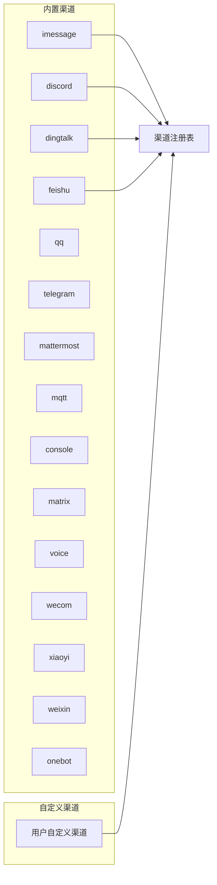

**图表来源**
- [registry.py:20-36](file://src/qwenpaw/app/channels/registry.py#L20-L36)
- [registry.py:190-195](file://src/qwenpaw/app/channels/registry.py#L190-L195)

**章节来源**
- [registry.py:45-78](file://src/qwenpaw/app/channels/registry.py#L45-L78)
- [registry.py:97-129](file://src/qwenpaw/app/channels/registry.py#L97-L129)

## 架构概览

渠道适配器架构采用分层设计，从底层的BaseChannel到上层的ChannelManager，形成了清晰的职责分离：

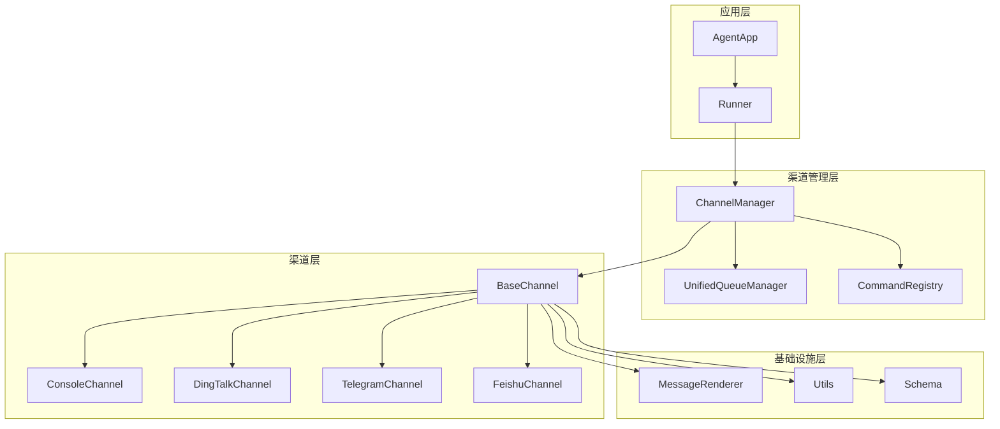

**图表来源**
- [manager.py:68-106](file://src/qwenpaw/app/channels/manager.py#L68-L106)
- [base.py:70-120](file://src/qwenpaw/app/channels/base.py#L70-L120)
- [renderer.py:78-86](file://src/qwenpaw/app/channels/renderer.py#L78-L86)

### 生命周期管理

渠道适配器的生命周期管理遵循严格的顺序：

1. **初始化阶段**：ChannelManager创建渠道实例
2. **配置阶段**：从环境变量或配置文件加载参数
3. **启动阶段**：各渠道执行start()方法建立连接
4. **运行阶段**：处理消息队列和事件循环
5. **停止阶段**：优雅关闭所有连接和资源

**章节来源**
- [manager.py:447-526](file://src/qwenpaw/app/channels/manager.py#L447-L526)
- [console/channel.py:580-590](file://src/qwenpaw/app/channels/console/channel.py#L580-L590)

## 详细组件分析

### BaseChannel类深度解析

BaseChannel类提供了完整的渠道抽象框架，包含以下核心功能：

#### 消息处理管道
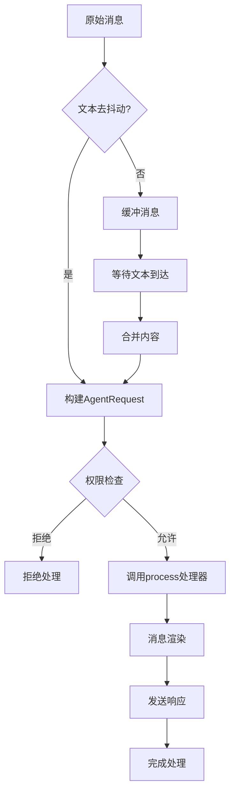

**图表来源**
- [base.py:249-282](file://src/qwenpaw/app/channels/base.py#L249-L282)
- [base.py:759-790](file://src/qwenpaw/app/channels/base.py#L759-L790)

#### 会话管理策略

每个渠道都可以实现自己的会话管理策略：

| 渠道类型 | 会话ID生成策略 | 特殊考虑 |
|---------|---------------|----------|
| Console | `console:<sender_id>` | 支持显式会话ID覆盖 |
| DingTalk | conversation_id短后缀 | 支持定时任务查找 |
| Feishu | chat_id或open_id | 支持群聊和私聊区分 |
| Telegram | user_id或chat_id | 支持私聊和群组 |

**章节来源**
- [base.py:557-567](file://src/qwenpaw/app/channels/base.py#L557-L567)
- [console/channel.py:192-203](file://src/qwenpaw/app/channels/console/channel.py#L192-L203)
- [dingtalk/channel.py:307-317](file://src/qwenpaw/app/channels/dingtalk/channel.py#L307-L317)
- [feishu/channel.py:158-165](file://src/qwenpaw/app/channels/feishu/channel.py#L158-L165)

### ChannelManager详细分析

ChannelManager是渠道系统的中枢控制器，负责协调所有渠道的运行：

#### 统一队列管理
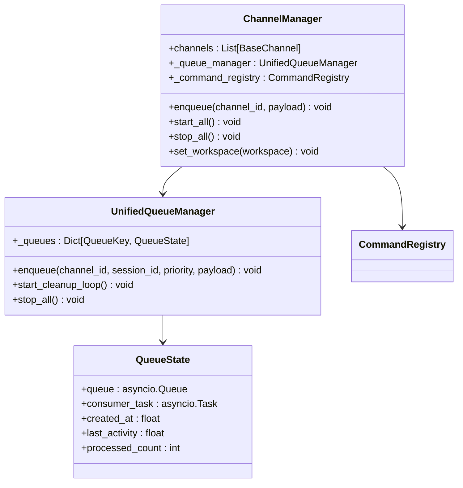

**图表来源**
- [manager.py:68-85](file://src/qwenpaw/app/channels/manager.py#L68-L85)
- [unified_queue_manager.py:60-118](file://src/qwenpaw/app/channels/unified_queue_manager.py#L60-L118)

#### 优先级调度机制

ChannelManager使用CommandRegistry进行智能优先级调度：

1. **命令检测**：通过`is_control_command()`识别控制命令
2. **优先级计算**：使用`get_priority_level()`获取命令优先级
3. **队列路由**：根据优先级将消息路由到相应队列
4. **并发控制**：支持同一会话内不同优先级的并发处理

**章节来源**
- [manager.py:280-298](file://src/qwenpaw/app/channels/manager.py#L280-L298)
- [command_registry.py:136-218](file://src/qwenpaw/app/channels/command_registry.py#L136-L218)

### 具体渠道实现

#### ConsoleChannel控制台渠道

ConsoleChannel是最简单的渠道实现，主要用于开发和测试：

##### 核心特性
- **纯文本输出**：将AI响应打印到标准输出
- **ANSI颜色支持**：在支持的终端中显示彩色输出
- **媒体文件处理**：支持图片、视频、音频的本地路径解析
- **前端推送**：将消息推送到Web界面

##### 输出格式化
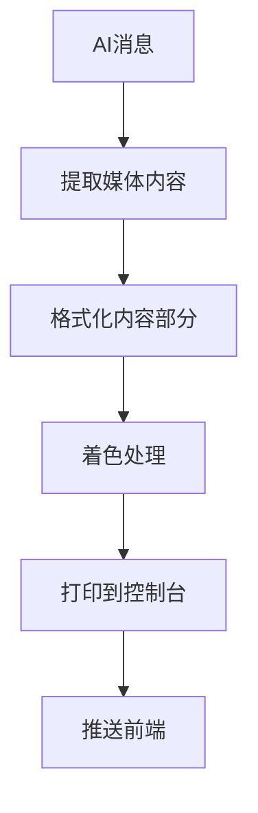

**图表来源**
- [console/channel.py:332-444](file://src/qwenpaw/app/channels/console/channel.py#L332-L444)

**章节来源**
- [console/channel.py:63-190](file://src/qwenpaw/app/channels/console/channel.py#L63-L190)
- [console/channel.py:445-590](file://src/qwenpaw/app/channels/console/channel.py#L445-L590)

#### DingTalkChannel钉钉渠道

DingTalkChannel是最复杂的渠道实现，支持多种交互模式：

##### 核心功能
- **双向通信**：支持WebSocket接收和Webhook发送
- **AI卡片**：支持富文本AI卡片的创建和更新
- **会话管理**：维护会话Webhook映射表
- **去重机制**：防止重复消息的处理
- **令牌管理**：自动刷新访问令牌

##### 会话Webhook存储
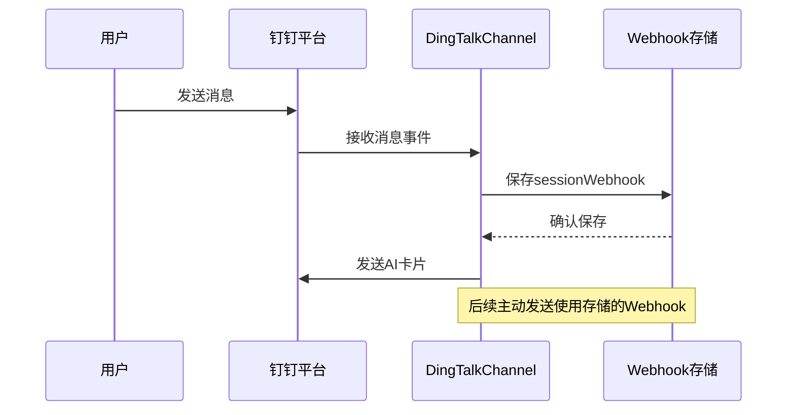

**图表来源**
- [dingtalk/channel.py:452-560](file://src/qwenpaw/app/channels/dingtalk/channel.py#L452-L560)

**章节来源**
- [dingtalk/channel.py:112-301](file://src/qwenpaw/app/channels/dingtalk/channel.py#L112-L301)
- [dingtalk/channel.py:452-560](file://src/qwenpaw/app/channels/dingtalk/channel.py#L452-L560)

#### TelegramChannel Telegram渠道

TelegramChannel实现了完整的Telegram Bot API集成：

##### 核心特性
- **长轮询**：使用长轮询方式接收消息
- **媒体处理**：支持照片、视频、音频、文件的上传下载
- **消息分割**：自动处理超长消息的分割发送
- **错误处理**：完善的异常处理和重试机制

##### 媒体文件处理流程
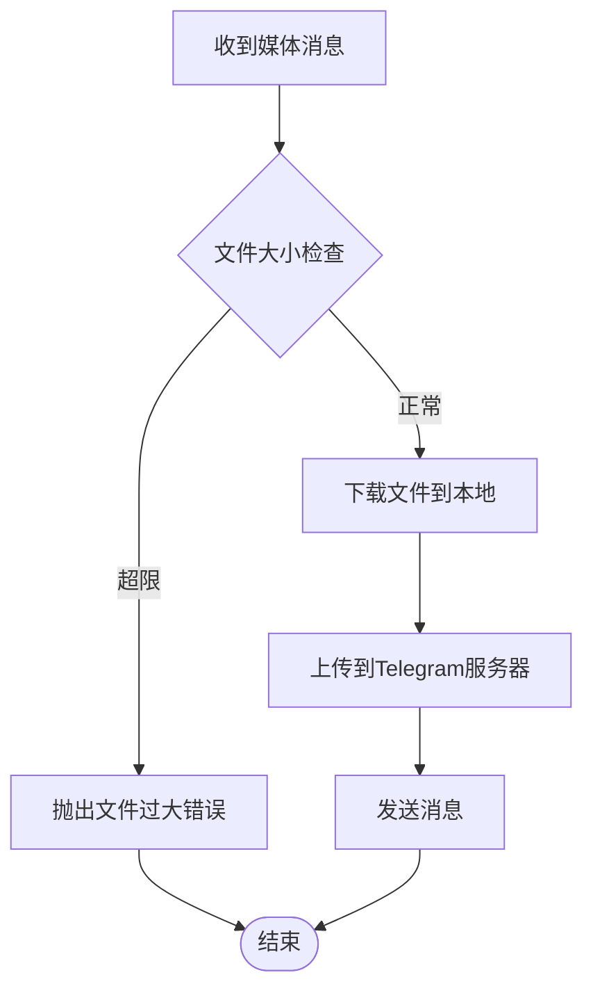

**图表来源**
- [telegram/channel.py:78-138](file://src/qwenpaw/app/channels/telegram/channel.py#L78-L138)

**章节来源**
- [telegram/channel.py:1-200](file://src/qwenpaw/app/channels/telegram/channel.py#L1-L200)

#### FeishuChannel飞书渠道

FeishuChannel提供了飞书/Lark的完整集成方案：

##### 技术特点
- **WebSocket连接**：使用WebSocket接收实时事件
- **Open API调用**：通过Open API发送消息
- **加密支持**：支持事件消息的加密解密
- **缓存机制**：实现用户昵称和处理消息ID的缓存

##### 连接管理
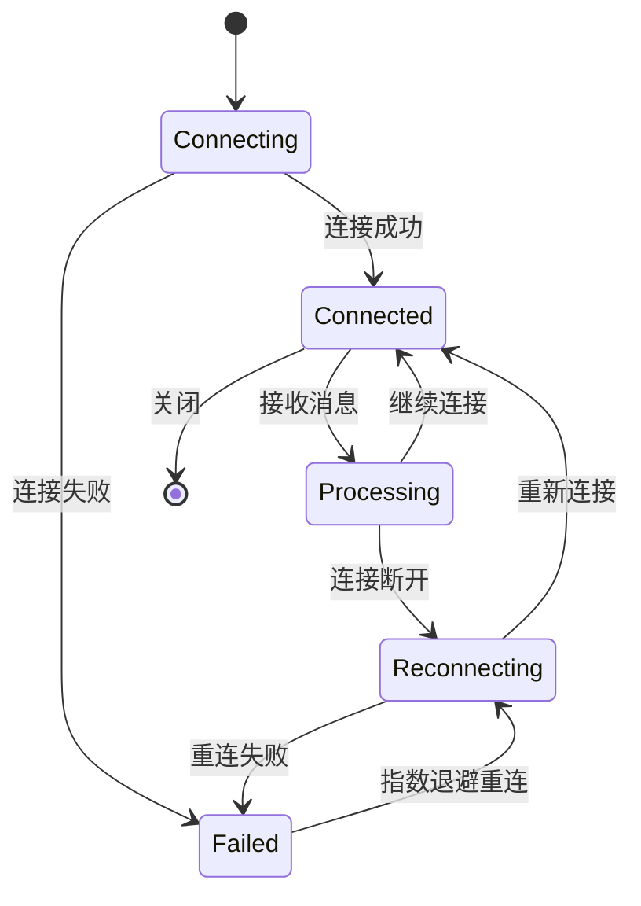

**图表来源**
- [feishu/channel.py:158-200](file://src/qwenpaw/app/channels/feishu/channel.py#L158-L200)

**章节来源**
- [feishu/channel.py:158-200](file://src/qwenpaw/app/channels/feishu/channel.py#L158-L200)

### 消息渲染系统

MessageRenderer提供了可插拔的消息渲染功能，支持不同渠道的内容格式化：

#### 渲染风格控制
- **Markdown支持**：控制是否支持Markdown格式
- **代码围栏**：控制代码块的显示格式
- **表情符号**：控制表情符号的使用
- **工具消息过滤**：控制工具调用和输出的显示

#### 内容类型转换
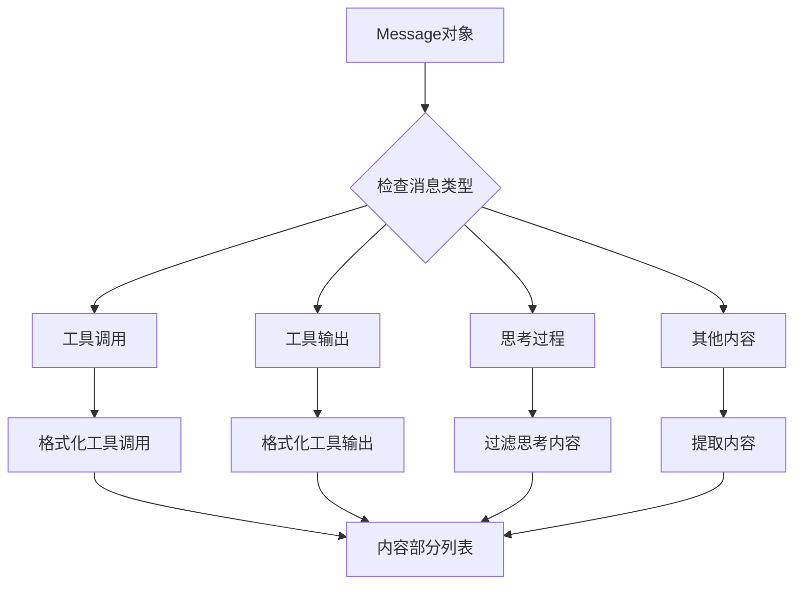

**图表来源**
- [renderer.py:78-86](file://src/qwenpaw/app/channels/renderer.py#L78-L86)
- [renderer.py:87-351](file://src/qwenpaw/app/channels/renderer.py#L87-L351)

**章节来源**
- [renderer.py:37-86](file://src/qwenpaw/app/channels/renderer.py#L37-L86)
- [renderer.py:87-351](file://src/qwenpaw/app/channels/renderer.py#L87-L351)

## 依赖关系分析

渠道适配器架构的依赖关系相对简单，遵循单一方向的依赖原则：

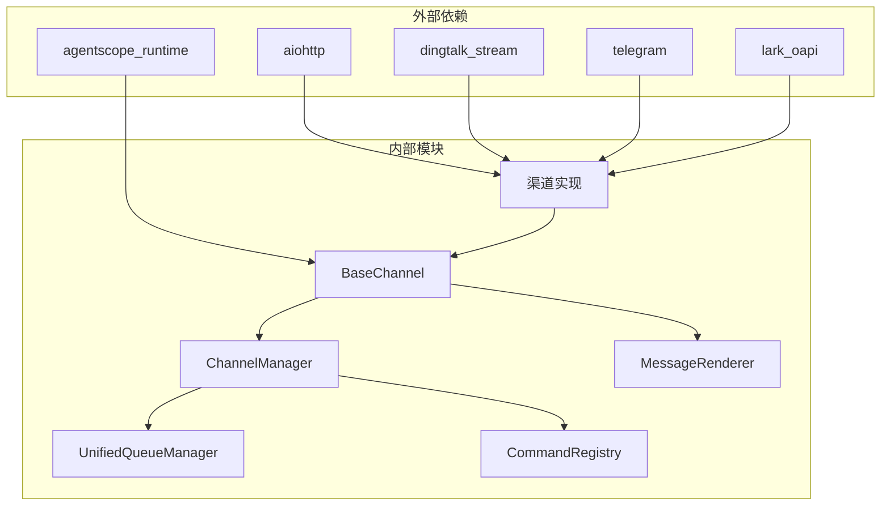

**图表来源**
- [base.py:24-38](file://src/qwenpaw/app/channels/base.py#L24-L38)
- [manager.py:21-25](file://src/qwenpaw/app/channels/manager.py#L21-L25)

### 耦合度分析

- **低耦合**：各渠道类之间没有直接依赖关系
- **向上依赖**：渠道实现依赖BaseChannel抽象
- **向下依赖**：ChannelManager依赖具体渠道实现
- **横向依赖**：ChannelManager与CommandRegistry相互依赖

**章节来源**
- [registry.py:190-195](file://src/qwenpaw/app/channels/registry.py#L190-L195)
- [manager.py:79-81](file://src/qwenpaw/app/channels/manager.py#L79-L81)

## 性能考虑

### 异步处理优化

渠道适配器架构充分利用了Python的asyncio特性：

#### 并发控制
- **队列隔离**：每个(渠道, 会话, 优先级)组合都有独立队列
- **消费者池**：按需创建消费者任务，避免固定工作池的资源浪费
- **内存管理**：自动清理空闲队列，防止内存泄漏

#### 缓存策略
- **令牌缓存**：DingTalkChannel缓存访问令牌
- **会话Webhook缓存**：持久化存储会话Webhook映射
- **用户信息缓存**：飞书渠道缓存用户昵称和处理ID

### 错误处理机制

#### 分层错误处理
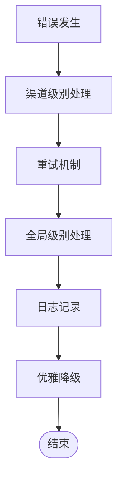

#### 超时控制
- **队列入队超时**：30秒超时保护
- **HTTP请求超时**：根据渠道特性设置合理超时
- **连接重试**：指数退避重试策略

**章节来源**
- [unified_queue_manager.py:146-156](file://src/qwenpaw/app/channels/unified_queue_manager.py#L146-L156)
- [dingtalk/channel.py:766-800](file://src/qwenpaw/app/channels/dingtalk/channel.py#L766-L800)

## 故障排除指南

### 常见问题诊断

#### 渠道启动失败
1. **检查配置**：确认渠道配置参数正确
2. **网络连接**：验证外网访问权限
3. **API密钥**：确认API密钥有效且未过期

#### 消息处理异常
1. **查看日志**：检查ChannelManager的日志输出
2. **队列状态**：使用`get_metrics()`检查队列状态
3. **重试机制**：观察自动重试是否生效

#### 性能问题
1. **队列积压**：检查队列长度和处理速度
2. **内存使用**：监控内存占用情况
3. **并发限制**：调整并发参数

### 调试工具

#### 监控指标
- **队列统计**：总队列数、每个队列的消息数量
- **处理统计**：每队列处理的消息总数
- **活跃状态**：队列的年龄和空闲时间

#### 日志配置
```python
# 设置调试级别
logging.getLogger('qwenpaw.app.channels').setLevel(logging.DEBUG)
```

**章节来源**
- [unified_queue_manager.py:430-471](file://src/qwenpaw/app/channels/unified_queue_manager.py#L430-L471)
- [manager.py:527-545](file://src/qwenpaw/app/channels/manager.py#L527-L545)

## 结论

QwenPaw的渠道适配器架构展现了现代消息通道系统的最佳实践：

### 设计优势
- **高度模块化**：每个渠道都是独立的模块，易于维护和扩展
- **统一抽象**：BaseChannel提供了清晰的接口契约
- **异步处理**：充分利用asyncio实现高性能并发
- **智能调度**：CommandRegistry实现优先级驱动的消息处理
- **可插拔架构**：支持内置和自定义渠道的动态加载

### 扩展性考虑
- **新渠道开发**：遵循BaseChannel接口即可快速集成
- **配置管理**：通过Pydantic模型实现强类型配置
- **消息渲染**：可插拔的渲染器支持不同渠道的格式需求
- **队列管理**：统一的队列系统简化了并发控制

### 最佳实践建议
1. **遵循接口契约**：严格实现BaseChannel的所有抽象方法
2. **错误处理**：提供完善的异常处理和重试机制
3. **资源管理**：确保正确释放网络连接和文件句柄
4. **性能优化**：合理设置并发参数和缓存策略
5. **监控告警**：实现完善的日志记录和性能监控

该架构为构建企业级AI消息平台提供了坚实的基础，既满足了当前的需求，也为未来的扩展预留了充足的空间。