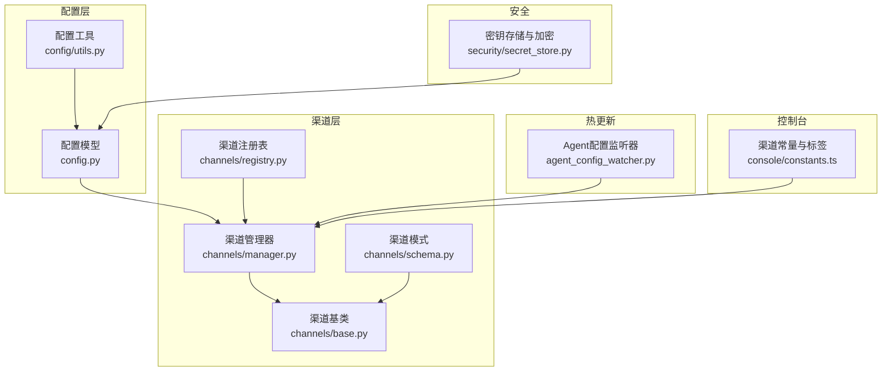
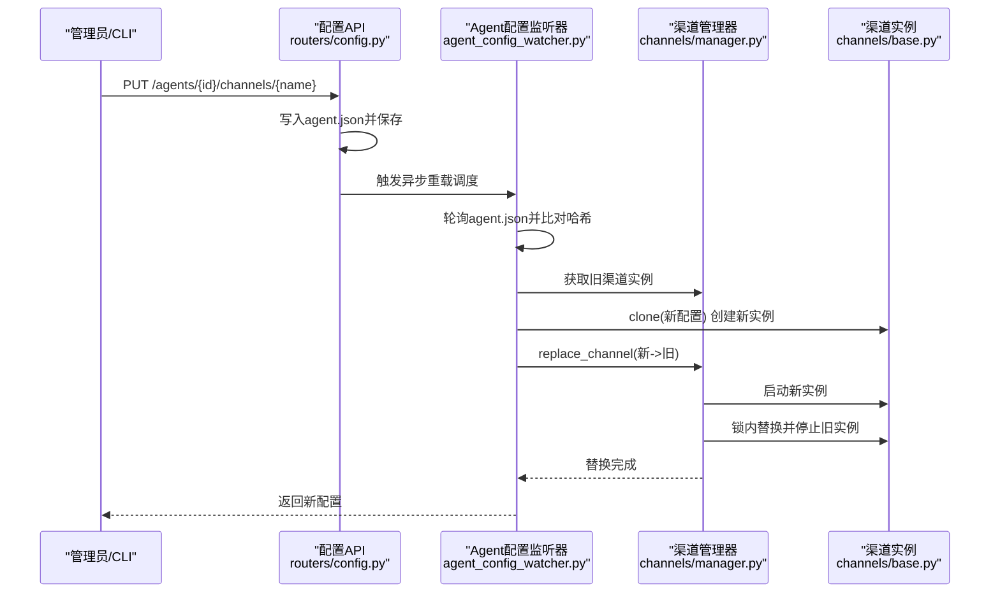
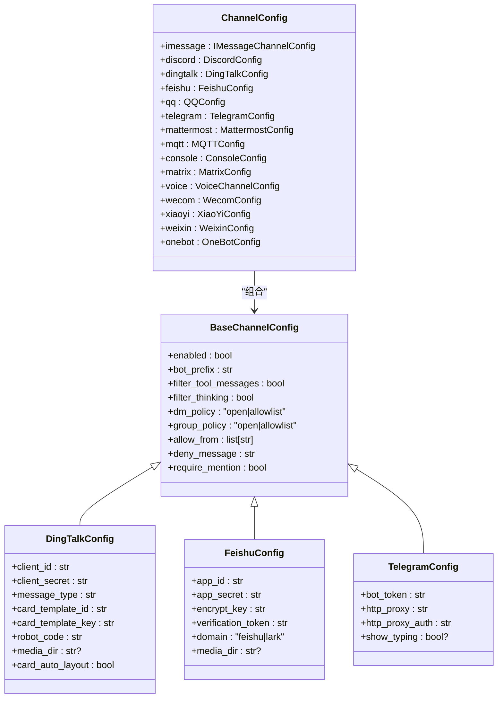
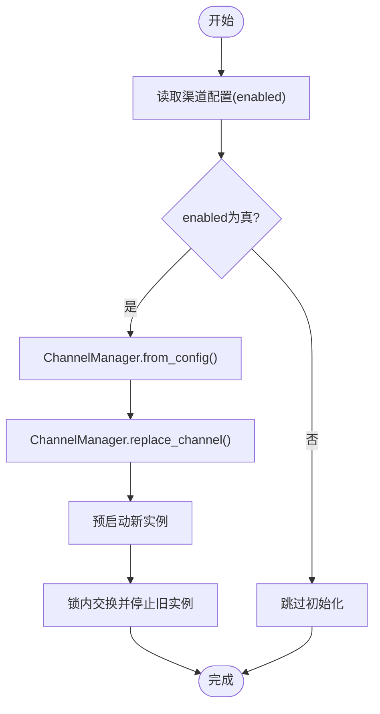
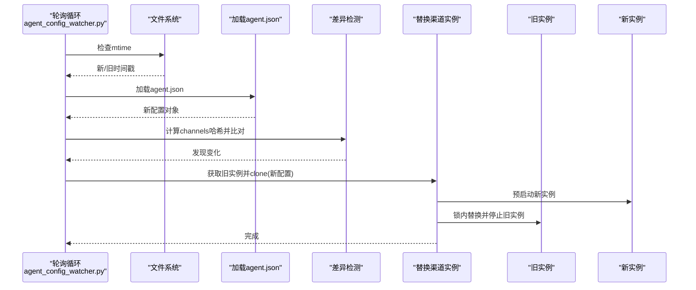
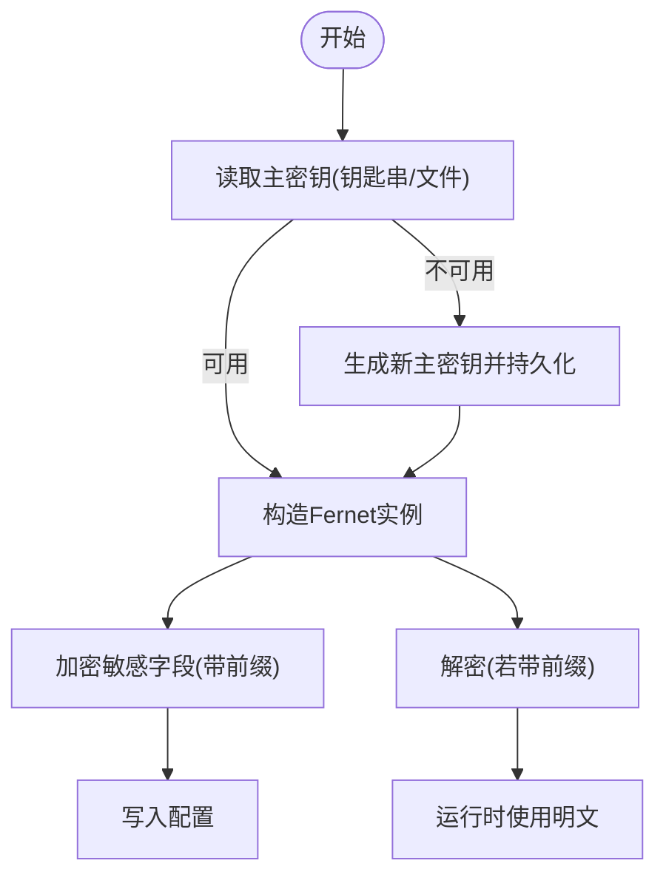
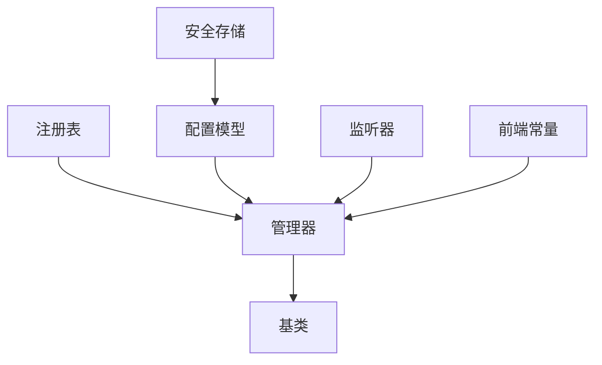

# 渠道配置管理

<cite>
**本文档引用的文件**
- [src/qwenpaw/app/channels/schema.py](file://src/qwenpaw/app/channels/schema.py)
- [src/qwenpaw/app/channels/manager.py](file://src/qwenpaw/app/channels/manager.py)
- [src/qwenpaw/app/channels/base.py](file://src/qwenpaw/app/channels/base.py)
- [src/qwenpaw/config/config.py](file://src/qwenpaw/config/config.py)
- [src/qwenpaw/config/utils.py](file://src/qwenpaw/config/utils.py)
- [src/qwenpaw/app/agent_config_watcher.py](file://src/qwenpaw/app/agent_config_watcher.py)
- [src/qwenpaw/app/channels/registry.py](file://src/qwenpaw/app/channels/registry.py)
- [src/qwenpaw/app/channels/dingtalk/channel.py](file://src/qwenpaw/app/channels/dingtalk/channel.py)
- [src/qwenpaw/app/channels/telegram/channel.py](file://src/qwenpaw/app/channels/telegram/channel.py)
- [src/qwenpaw/security/secret_store.py](file://src/qwenpaw/security/secret_store.py)
- [src/qwenpaw/cli/channels_cmd.py](file://src/qwenpaw/cli/channels_cmd.py)
- [src/qwenpaw/app/routers/config.py](file://src/qwenpaw/app/routers/config.py)
- [console/src/pages/Control/Channels/components/constants.ts](file://console/src/pages/Control/Channels/components/constants.ts)
</cite>

## 目录
1. [简介](#简介)
2. [项目结构](#项目结构)
3. [核心组件](#核心组件)
4. [架构总览](#架构总览)
5. [详细组件分析](#详细组件分析)
6. [依赖分析](#依赖分析)
7. [性能考虑](#性能考虑)
8. [故障排查指南](#故障排查指南)
9. [结论](#结论)
10. [附录](#附录)

## 简介
本指南面向QwenPaw的渠道配置管理，系统性阐述渠道配置的数据结构、验证与约束、启用/禁用与热更新机制、渠道特定参数（如API密钥、回调地址、权限策略、功能开关）、安全存储与加密、配置模板与最佳实践，以及配置验证与诊断工具的使用方法。目标是帮助运维与开发人员在不重启服务的前提下，安全、稳定地完成渠道配置的变更与运维。

## 项目结构
QwenPaw的渠道配置管理由“配置模型层”“渠道注册与管理”“热更新监听器”“安全存储”“前端控制台”等模块协同完成。关键目录与文件如下：
- 配置模型：定义渠道通用与各渠道专用配置项
- 渠道注册与管理：统一加载、初始化、启停与替换渠道实例
- 热更新：轮询agent.json并按需替换渠道实例
- 安全存储：对敏感字段进行透明加解密
- 前端控制台：可视化展示与编辑渠道配置

图表来源
- [src/qwenpaw/config/config.py:39-227](file://src/qwenpaw/config/config.py#L39-L227)
- [src/qwenpaw/config/utils.py:491-531](file://src/qwenpaw/config/utils.py#L491-L531)
- [src/qwenpaw/app/channels/registry.py:190-195](file://src/qwenpaw/app/channels/registry.py#L190-L195)
- [src/qwenpaw/app/channels/manager.py:68-213](file://src/qwenpaw/app/channels/manager.py#L68-L213)
- [src/qwenpaw/app/channels/base.py:70-118](file://src/qwenpaw/app/channels/base.py#L70-L118)
- [src/qwenpaw/app/channels/schema.py:12-48](file://src/qwenpaw/app/channels/schema.py#L12-L48)
- [src/qwenpaw/app/agent_config_watcher.py:35-95](file://src/qwenpaw/app/agent_config_watcher.py#L35-L95)
- [src/qwenpaw/security/secret_store.py:213-242](file://src/qwenpaw/security/secret_store.py#L213-L242)
- [console/src/pages/Control/Channels/components/constants.ts:7-23](file://console/src/pages/Control/Channels/components/constants.ts#L7-L23)

章节来源
- [src/qwenpaw/config/config.py:39-227](file://src/qwenpaw/config/config.py#L39-L227)
- [src/qwenpaw/app/channels/registry.py:190-195](file://src/qwenpaw/app/channels/registry.py#L190-L195)
- [src/qwenpaw/app/channels/manager.py:68-213](file://src/qwenpaw/app/channels/manager.py#L68-L213)
- [src/qwenpaw/app/agent_config_watcher.py:35-95](file://src/qwenpaw/app/agent_config_watcher.py#L35-L95)
- [src/qwenpaw/security/secret_store.py:213-242](file://src/qwenpaw/security/secret_store.py#L213-L242)
- [console/src/pages/Control/Channels/components/constants.ts:7-23](file://console/src/pages/Control/Channels/components/constants.ts#L7-L23)

## 核心组件
- 配置模型与校验
  - 通用渠道配置基类：定义通用字段（启用开关、前缀、过滤策略、权限策略、提及要求等）
  - 各渠道专用配置：如钉钉、飞书、Telegram等，覆盖API密钥、回调地址、媒体目录、域名等
  - 配置加载与修复：自动修复JSON语法问题、路径归一化、回退默认配置
- 渠道注册与管理
  - 注册表：内置渠道与自定义渠道发现与缓存
  - 管理器：从配置创建渠道实例、统一队列与消费、启停替换、发送事件/文本
- 热更新监听
  - 监听agent.json变更，差异比对后异步替换指定渠道实例，支持失败回滚
- 安全存储
  - 主密钥生成与持久化（系统钥匙串或文件），敏感字段透明加解密
- 前端控制台
  - 渠道标签与本地化、可视化配置卡片与抽屉

章节来源
- [src/qwenpaw/config/config.py:39-227](file://src/qwenpaw/config/config.py#L39-L227)
- [src/qwenpaw/config/utils.py:491-531](file://src/qwenpaw/config/utils.py#L491-L531)
- [src/qwenpaw/app/channels/registry.py:190-195](file://src/qwenpaw/app/channels/registry.py#L190-L195)
- [src/qwenpaw/app/channels/manager.py:68-213](file://src/qwenpaw/app/channels/manager.py#L68-L213)
- [src/qwenpaw/app/agent_config_watcher.py:149-216](file://src/qwenpaw/app/agent_config_watcher.py#L149-L216)
- [src/qwenpaw/security/secret_store.py:213-242](file://src/qwenpaw/security/secret_store.py#L213-L242)
- [console/src/pages/Control/Channels/components/constants.ts:7-23](file://console/src/pages/Control/Channels/components/constants.ts#L7-L23)

## 架构总览
下图展示了从配置到渠道实例、再到热更新替换的完整流程。

图表来源
- [src/qwenpaw/app/routers/config.py:264-282](file://src/qwenpaw/app/routers/config.py#L264-L282)
- [src/qwenpaw/app/agent_config_watcher.py:149-216](file://src/qwenpaw/app/agent_config_watcher.py#L149-L216)
- [src/qwenpaw/app/channels/manager.py:571-630](file://src/qwenpaw/app/channels/manager.py#L571-L630)

## 详细组件分析

### 配置数据结构与验证
- 通用渠道配置基类
  - 字段：启用开关、机器人前缀、工具消息过滤、思考内容过滤、私聊/群组策略、允许列表、拒绝文案、是否需要提及
  - 作用：作为所有渠道的默认配置骨架，确保一致性与可扩展性
- 各渠道专用配置
  - 钉钉：应用ID/Secret、消息类型、卡片模板、机器人编码、媒体目录、自动布局等
  - 飞书：应用ID/Secret、加密Key、校验Token、域名（国内/国际）、媒体目录
  - Telegram：Bot Token、HTTP代理、是否显示打字、媒体目录
  - 其他：MQTT、WeCom、WeChat、OneBot、Console、Voice、XiaoYi等
- 配置加载与修复
  - 自动修复JSON语法问题（逗号、注释、BOM等）
  - 路径归一化（兼容旧路径前缀）
  - 校验失败时备份原文件并回退默认配置

图表来源
- [src/qwenpaw/config/config.py:39-227](file://src/qwenpaw/config/config.py#L39-L227)

章节来源
- [src/qwenpaw/config/config.py:39-227](file://src/qwenpaw/config/config.py#L39-L227)
- [src/qwenpaw/config/utils.py:491-531](file://src/qwenpaw/config/utils.py#L491-L531)

### 渠道启用/禁用与运行时切换
- 启用/禁用
  - 通过通用配置中的enabled字段控制；管理器在from_config阶段读取并仅初始化enabled为真的渠道
- 运行时切换
  - 管理器支持replace_channel：先启动新实例，再在锁内替换旧实例并停止旧实例，保证平滑过渡
- 权限策略与功能开关
  - 私聊/群组策略、允许列表、拒绝文案、是否需要提及等在基类中统一处理

图表来源
- [src/qwenpaw/app/channels/manager.py:108-213](file://src/qwenpaw/app/channels/manager.py#L108-L213)
- [src/qwenpaw/app/channels/manager.py:571-630](file://src/qwenpaw/app/channels/manager.py#L571-L630)
- [src/qwenpaw/app/channels/base.py:283-318](file://src/qwenpaw/app/channels/base.py#L283-L318)

章节来源
- [src/qwenpaw/app/channels/manager.py:108-213](file://src/qwenpaw/app/channels/manager.py#L108-L213)
- [src/qwenpaw/app/channels/manager.py:571-630](file://src/qwenpaw/app/channels/manager.py#L571-L630)
- [src/qwenpaw/app/channels/base.py:283-318](file://src/qwenpaw/app/channels/base.py#L283-L318)

### 渠道特定配置参数
- API密钥管理
  - 通过各渠道配置类的字段存储（如钉钉的client_id/secret、飞书的app_id/secret、Telegram的bot_token）
  - 敏感字段采用安全存储进行透明加解密
- 回调地址设置
  - 钉钉：sessionWebhook用于主动发送；管理器会持久化并按会话恢复
  - Telegram：无需回调地址，基于Bot API轮询
- 权限范围配置
  - dm_policy/group_policy、allow_from、deny_message、require_mention
- 功能开关
  - 工具消息过滤、思考内容过滤、媒体目录、域名选择（飞书）、是否显示打字（Telegram）

章节来源
- [src/qwenpaw/config/config.py:62-206](file://src/qwenpaw/config/config.py#L62-L206)
- [src/qwenpaw/app/channels/dingtalk/channel.py:348-560](file://src/qwenpaw/app/channels/dingtalk/channel.py#L348-L560)
- [src/qwenpaw/app/channels/telegram/channel.py:264-334](file://src/qwenpaw/app/channels/telegram/channel.py#L264-L334)

### 配置热更新与运行时替换
- 监听与差异检测
  - 监听器轮询agent.json，计算channels部分哈希，发现变化后逐渠道比对
- 替换流程
  - clone旧实例+新配置创建新实例，预启动成功后再锁内替换并停止旧实例
  - 失败时回滚新配置对应字段为旧值
- 心跳与定时任务
  - 变更心跳配置时，监听器可触发心跳重新调度

图表来源
- [src/qwenpaw/app/agent_config_watcher.py:240-278](file://src/qwenpaw/app/agent_config_watcher.py#L240-L278)
- [src/qwenpaw/app/agent_config_watcher.py:178-216](file://src/qwenpaw/app/agent_config_watcher.py#L178-L216)
- [src/qwenpaw/app/channels/manager.py:571-630](file://src/qwenpaw/app/channels/manager.py#L571-L630)

章节来源
- [src/qwenpaw/app/agent_config_watcher.py:149-216](file://src/qwenpaw/app/agent_config_watcher.py#L149-L216)
- [src/qwenpaw/app/channels/manager.py:571-630](file://src/qwenpaw/app/channels/manager.py#L571-L630)

### 安全存储与加密
- 主密钥管理
  - 优先使用系统钥匙串存储主密钥；不可用时回退到工作目录下的只读文件
  - 支持容器/无桌面环境的降级策略
- 加密算法
  - 使用Fernet（AES-128-CBC + HMAC-SHA256）对敏感字段进行加解密
  - 密文以特定前缀标识，透明解密失败时回退明文
- 敏感字段
  - 提供者配置中的API Key、认证配置中的JWT Secret等

图表来源
- [src/qwenpaw/security/secret_store.py:154-242](file://src/qwenpaw/security/secret_store.py#L154-L242)

章节来源
- [src/qwenpaw/security/secret_store.py:154-242](file://src/qwenpaw/security/secret_store.py#L154-L242)

### 配置模板与示例
- 常见场景建议
  - 开发测试：启用Console通道，关闭生产敏感通道
  - 企业IM：启用钉钉/飞书/企业微信，配置回调地址与媒体目录
  - 公共平台：启用Telegram，配置Bot Token与代理
- 最佳实践
  - 将API密钥放入安全存储，避免明文写入配置
  - 使用允许列表与提及策略限制消息来源
  - 对媒体目录设置合理配额与清理策略
  - 通过热更新实现零停机变更

（本节为概念性指导，不直接分析具体文件）

### 配置验证与诊断工具
- 配置加载与修复
  - 自动修复JSON语法问题，记录警告并尝试回退默认配置
- CLI交互式配置
  - 交互式选择渠道并调用各渠道配置器，支持默认与插件配置器
- API接口
  - 提供获取/更新心跳配置的REST接口，便于前端控制台操作

章节来源
- [src/qwenpaw/config/utils.py:491-531](file://src/qwenpaw/config/utils.py#L491-L531)
- [src/qwenpaw/cli/channels_cmd.py:751-758](file://src/qwenpaw/cli/channels_cmd.py#L751-L758)
- [src/qwenpaw/app/routers/config.py:285-300](file://src/qwenpaw/app/routers/config.py#L285-L300)

## 依赖分析
- 组件耦合
  - 渠道管理器依赖注册表与配置模型；监听器依赖管理器与可用渠道集合
  - 安全存储独立于渠道实现，通过配置层间接影响敏感字段
- 外部依赖
  - 渠道SDK（如钉钉流式SDK、Telegram Python SDK）用于消息收发
  - 系统钥匙串库用于主密钥存储

图表来源
- [src/qwenpaw/app/channels/registry.py:190-195](file://src/qwenpaw/app/channels/registry.py#L190-L195)
- [src/qwenpaw/app/channels/manager.py:68-213](file://src/qwenpaw/app/channels/manager.py#L68-L213)
- [src/qwenpaw/app/agent_config_watcher.py:35-95](file://src/qwenpaw/app/agent_config_watcher.py#L35-L95)
- [src/qwenpaw/security/secret_store.py:213-242](file://src/qwenpaw/security/secret_store.py#L213-L242)
- [console/src/pages/Control/Channels/components/constants.ts:7-23](file://console/src/pages/Control/Channels/components/constants.ts#L7-L23)

章节来源
- [src/qwenpaw/app/channels/registry.py:190-195](file://src/qwenpaw/app/channels/registry.py#L190-L195)
- [src/qwenpaw/app/channels/manager.py:68-213](file://src/qwenpaw/app/channels/manager.py#L68-L213)
- [src/qwenpaw/app/agent_config_watcher.py:35-95](file://src/qwenpaw/app/agent_config_watcher.py#L35-L95)
- [src/qwenpaw/security/secret_store.py:213-242](file://src/qwenpaw/security/secret_store.py#L213-L242)
- [console/src/pages/Control/Channels/components/constants.ts:7-23](file://console/src/pages/Control/Channels/components/constants.ts#L7-L23)

## 性能考虑
- 队列与批处理
  - 统一队列管理器按会话与优先级聚合消息，减少重复处理
- 轮询间隔
  - 监听器默认轮询间隔可调，平衡及时性与资源消耗
- 超时与取消
  - 入队与消费过程设置超时与取消保护，避免阻塞

（本节为通用指导，不直接分析具体文件）

## 故障排查指南
- 配置加载失败
  - 检查JSON语法修复日志，确认是否已备份原文件并回退默认配置
- 渠道无法启动
  - 查看管理器启动异常日志；确认API密钥、回调地址、网络代理等参数正确
- 热更新失败
  - 监听器替换失败会回滚对应渠道配置；检查新配置克隆与预启动日志
- 安全存储异常
  - 主密钥读取失败或解密异常时会记录警告并回退明文；检查钥匙串可用性与文件权限

章节来源
- [src/qwenpaw/config/utils.py:436-454](file://src/qwenpaw/config/utils.py#L436-L454)
- [src/qwenpaw/app/channels/manager.py:593-605](file://src/qwenpaw/app/channels/manager.py#L593-L605)
- [src/qwenpaw/app/agent_config_watcher.py:171-176](file://src/qwenpaw/app/agent_config_watcher.py#L171-L176)
- [src/qwenpaw/security/secret_store.py:232-241](file://src/qwenpaw/security/secret_store.py#L232-L241)

## 结论
QwenPaw的渠道配置管理通过清晰的配置模型、灵活的渠道注册与管理、可靠的热更新机制与安全存储，实现了在不中断服务的情况下对渠道配置的动态调整。结合权限策略与功能开关，用户可以在多渠道环境中实现高可用、可审计、易维护的智能对话能力。

## 附录
- 前端渠道标签与本地化
  - 控制台侧提供渠道名称映射与本地化支持，便于用户识别与操作

章节来源
- [console/src/pages/Control/Channels/components/constants.ts:7-23](file://console/src/pages/Control/Channels/components/constants.ts#L7-L23)