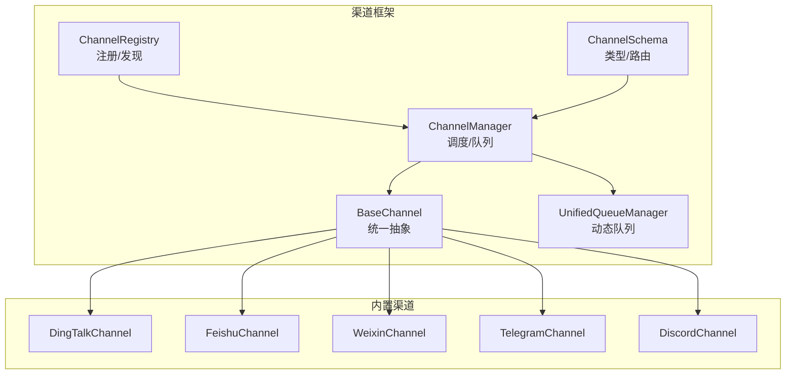
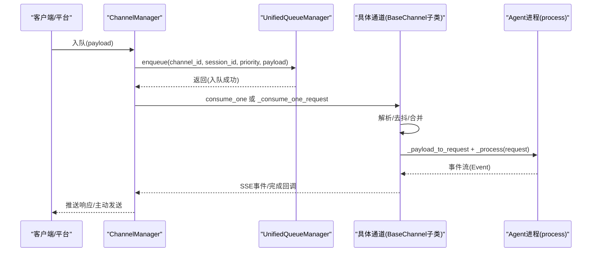
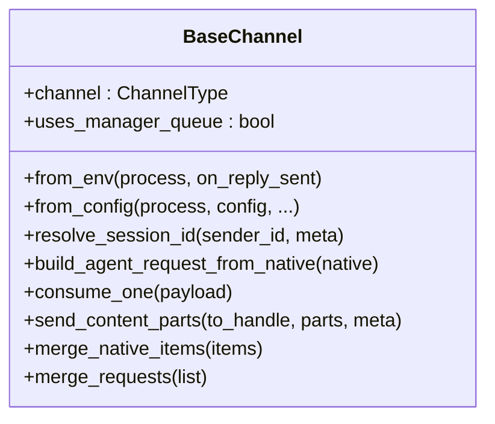
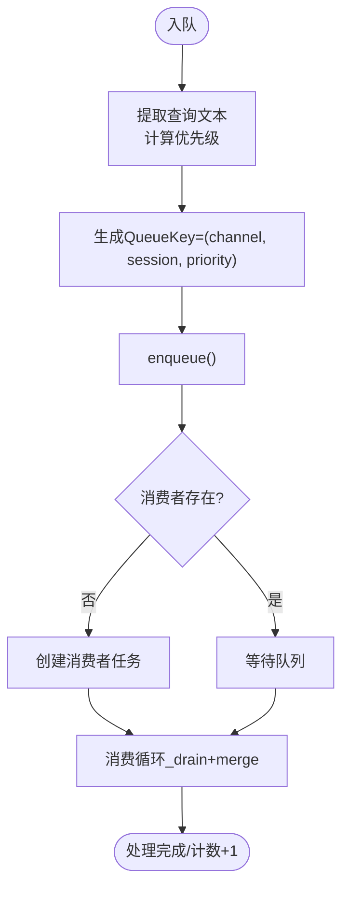
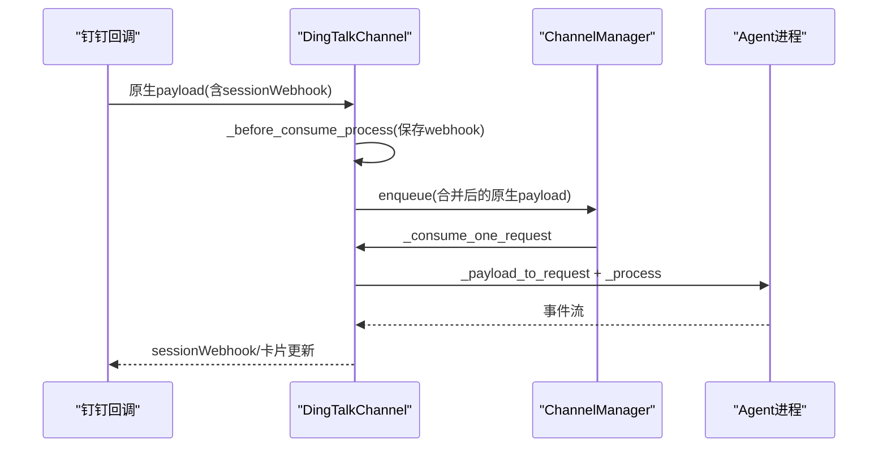
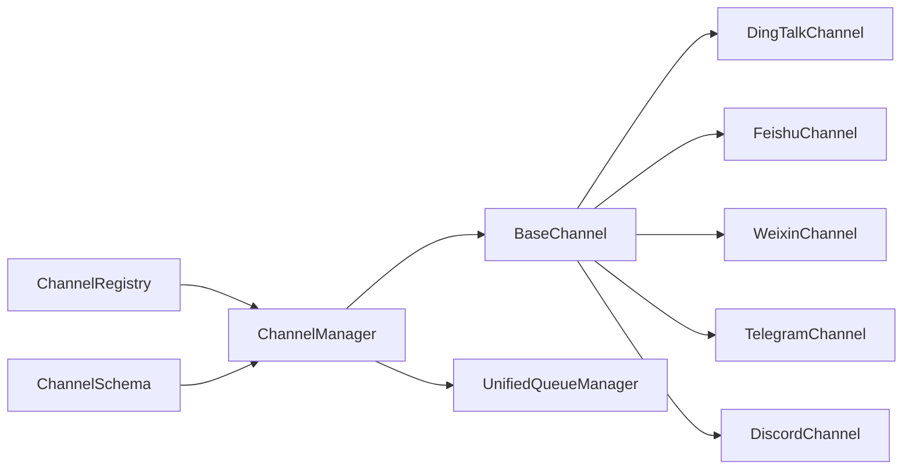

# 渠道集成系统

<cite>
**本文档引用的文件**
- [src/qwenpaw/app/channels/base.py](file://src/qwenpaw/app/channels/base.py)
- [src/qwenpaw/app/channels/manager.py](file://src/qwenpaw/app/channels/manager.py)
- [src/qwenpaw/app/channels/registry.py](file://src/qwenpaw/app/channels/registry.py)
- [src/qwenpaw/app/channels/schema.py](file://src/qwenpaw/app/channels/schema.py)
- [src/qwenpaw/app/channels/unified_queue_manager.py](file://src/qwenpaw/app/channels/unified_queue_manager.py)
- [src/qwenpaw/app/channels/dingtalk/channel.py](file://src/qwenpaw/app/channels/dingtalk/channel.py)
- [src/qwenpaw/app/channels/feishu/channel.py](file://src/qwenpaw/app/channels/feishu/channel.py)
- [src/qwenpaw/app/channels/weixin/channel.py](file://src/qwenpaw/app/channels/weixin/channel.py)
- [src/qwenpaw/app/channels/telegram/channel.py](file://src/qwenpaw/app/channels/telegram/channel.py)
- [src/qwenpaw/app/channels/discord_/channel.py](file://src/qwenpaw/app/channels/discord_/channel.py)
</cite>

## 目录
1. [简介](#简介)
2. [项目结构](#项目结构)
3. [核心组件](#核心组件)
4. [架构总览](#架构总览)
5. [详细组件分析](#详细组件分析)
6. [依赖关系分析](#依赖关系分析)
7. [性能考虑](#性能考虑)
8. [故障排除指南](#故障排除指南)
9. [结论](#结论)
10. [附录](#附录)

## 简介
本文件为 QwenPaw 的渠道集成系统技术文档，聚焦于多平台消息渠道（如钉钉、飞书、微信、Discord、Telegram 等）的统一接入与运行时处理。文档从架构设计、消息路由、会话管理、配置方法、渠道特性到自定义扩展进行全面说明，并提供故障排除与性能优化建议。

## 项目结构
渠道系统位于 src/qwenpaw/app/channels 目录下，采用“基类抽象 + 多平台适配器”的分层设计：
- 基类与通用能力：base.py 定义统一的消息请求/响应模型、渲染器、去抖动与合并策略、会话解析与任务跟踪。
- 调度与队列：manager.py 负责通道实例化、统一入队与消费、命令优先级与批处理；unified_queue_manager.py 提供按（通道, 会话, 优先级）隔离的动态队列。
- 注册与发现：registry.py 维护内置通道清单与自定义通道加载。
- 渠道实现：各平台在独立子目录中实现 from_env/from_config、消息解析、发送与回执逻辑。
- 模型与路由：schema.py 定义通道类型与地址路由协议。

**图表来源**
- [src/qwenpaw/app/channels/base.py:70-127](file://src/qwenpaw/app/channels/base.py#L70-L127)
- [src/qwenpaw/app/channels/manager.py:68-106](file://src/qwenpaw/app/channels/manager.py#L68-L106)
- [src/qwenpaw/app/channels/unified_queue_manager.py:60-117](file://src/qwenpaw/app/channels/unified_queue_manager.py#L60-L117)
- [src/qwenpaw/app/channels/registry.py:190-195](file://src/qwenpaw/app/channels/registry.py#L190-L195)
- [src/qwenpaw/app/channels/schema.py:12-48](file://src/qwenpaw/app/channels/schema.py#L12-L48)

**章节来源**
- [src/qwenpaw/app/channels/base.py:70-127](file://src/qwenpaw/app/channels/base.py#L70-L127)
- [src/qwenpaw/app/channels/manager.py:68-106](file://src/qwenpaw/app/channels/manager.py#L68-L106)
- [src/qwenpaw/app/channels/unified_queue_manager.py:60-117](file://src/qwenpaw/app/channels/unified_queue_manager.py#L60-L117)
- [src/qwenpaw/app/channels/registry.py:190-195](file://src/qwenpaw/app/channels/registry.py#L190-L195)
- [src/qwenpaw/app/channels/schema.py:12-48](file://src/qwenpaw/app/channels/schema.py#L12-L48)

## 核心组件
- BaseChannel 抽象基类
  - 统一 AgentRequest/AgentResponse 流程，定义 process 回调、渲染样式、内容去抖与合并、会话解析、任务跟踪与错误处理。
  - 支持时间去抖（按会话键合并）、批量合并（同一会话多条原生负载）、命令检测与直通。
- ChannelManager 统一调度
  - 从环境或配置创建通道实例，注入统一 process；通过 UnifiedQueueManager 实现按（通道, 会话, 优先级）的动态队列与消费者。
  - 提供 send_text/send_event 等主动发送接口。
- UnifiedQueueManager 动态队列
  - 以三元组（channel_id, session_id, priority_level）作为队列键，按需创建消费者任务，自动清理空闲队列，支持处理计数统计。
- ChannelRegistry 通道注册
  - 内置通道清单与自定义通道扫描，支持模块级钩子注册额外 HTTP 路由。
- ChannelSchema 类型与路由
  - 定义 ChannelType、ChannelAddress 与转换协议，统一发送目标字符串化与解析。

**章节来源**
- [src/qwenpaw/app/channels/base.py:70-127](file://src/qwenpaw/app/channels/base.py#L70-L127)
- [src/qwenpaw/app/channels/manager.py:68-106](file://src/qwenpaw/app/channels/manager.py#L68-L106)
- [src/qwenpaw/app/channels/unified_queue_manager.py:60-117](file://src/qwenpaw/app/channels/unified_queue_manager.py#L60-L117)
- [src/qwenpaw/app/channels/registry.py:190-195](file://src/qwenpaw/app/channels/registry.py#L190-L195)
- [src/qwenpaw/app/channels/schema.py:12-48](file://src/qwenpaw/app/channels/schema.py#L12-L48)

## 架构总览
渠道系统采用“通道适配器 + 统一调度 + 动态队列”的三层架构：
- 适配层：各平台通道实现 from_env/from_config、build_agent_request_from_native、send_content_parts 等。
- 调度层：ChannelManager 负责通道生命周期、入队与批处理、命令优先级与工作区注入。
- 队列层：UnifiedQueueManager 提供严格序列化、并发隔离与自动清理。

**图表来源**
- [src/qwenpaw/app/channels/manager.py:39-65](file://src/qwenpaw/app/channels/manager.py#L39-L65)
- [src/qwenpaw/app/channels/unified_queue_manager.py:119-163](file://src/qwenpaw/app/channels/unified_queue_manager.py#L119-L163)
- [src/qwenpaw/app/channels/base.py:659-757](file://src/qwenpaw/app/channels/base.py#L659-L757)

**章节来源**
- [src/qwenpaw/app/channels/manager.py:39-65](file://src/qwenpaw/app/channels/manager.py#L39-L65)
- [src/qwenpaw/app/channels/unified_queue_manager.py:119-163](file://src/qwenpaw/app/channels/unified_queue_manager.py#L119-L163)
- [src/qwenpaw/app/channels/base.py:659-757](file://src/qwenpaw/app/channels/base.py#L659-L757)

## 详细组件分析

### 基类与通用能力（BaseChannel）
- 统一消息模型：使用 agentscope_runtime 的 Message/Content 类型，避免中间包装。
- 去抖与合并：支持按会话键的时间去抖与原生负载合并，解决语音/图片等非文本输入的延迟问题。
- 会话解析：默认 channel:sender_id，部分通道可覆盖为短会话 ID（如钉钉、飞书）。
- 任务跟踪：与工作区 TaskTracker 集成，支持 /stop 取消与事件流输出。
- 权限与提及：支持开放/白名单策略、群聊@触发策略。

**图表来源**
- [src/qwenpaw/app/channels/base.py:70-127](file://src/qwenpaw/app/channels/base.py#L70-L127)
- [src/qwenpaw/app/channels/base.py:557-618](file://src/qwenpaw/app/channels/base.py#L557-L618)

**章节来源**
- [src/qwenpaw/app/channels/base.py:70-127](file://src/qwenpaw/app/channels/base.py#L70-L127)
- [src/qwenpaw/app/channels/base.py:557-618](file://src/qwenpaw/app/channels/base.py#L557-L618)

### 统一调度与队列（ChannelManager / UnifiedQueueManager）
- ChannelManager
  - 从环境/配置创建通道实例，注入统一 process 与 on_last_dispatch 回调。
  - 使用 CommandRegistry 对命令进行优先级分类，按查询文本提取优先级。
  - 通过 _enqueue_one 将 payload 路由到 UnifiedQueueManager，支持超时保护。
- UnifiedQueueManager
  - 以 (channel_id, session_id, priority_level) 为键的动态队列，消费者按需创建。
  - 自动清理空闲队列，提供处理计数与监控指标。

**图表来源**
- [src/qwenpaw/app/channels/manager.py:280-300](file://src/qwenpaw/app/channels/manager.py#L280-L300)
- [src/qwenpaw/app/channels/unified_queue_manager.py:119-163](file://src/qwenpaw/app/channels/unified_queue_manager.py#L119-L163)

**章节来源**
- [src/qwenpaw/app/channels/manager.py:280-300](file://src/qwenpaw/app/channels/manager.py#L280-L300)
- [src/qwenpaw/app/channels/unified_queue_manager.py:119-163](file://src/qwenpaw/app/channels/unified_queue_manager.py#L119-L163)

### 渠道注册与发现（ChannelRegistry）
- 内置通道清单：imessage、discord、dingtalk、feishu、qq、telegram、mattermost、mqtt、console、matrix、voice、wecom、xiaoyi、weixin、onebot。
- 自定义通道：扫描 CUSTOM_CHANNELS_DIR，导入模块并查找继承自 BaseChannel 的类，注册为可用通道。
- 路由钩子：支持自定义通道在模块级定义 register_app_routes(app)，挂载其 HTTP 路由（需以 /api/ 开头）。

**章节来源**
- [src/qwenpaw/app/channels/registry.py:190-195](file://src/qwenpaw/app/channels/registry.py#L190-L195)

### 渠道模型与路由（ChannelSchema）
- ChannelType：字符串类型，允许插件通道使用任意键。
- ChannelAddress：统一路由结构 kind/id/extra，支持 to_handle 字符串化与解析。
- 协议：ChannelMessageConverter 定义 build_agent_request_from_native 与 send_response 的转换协议。

**章节来源**
- [src/qwenpaw/app/channels/schema.py:12-48](file://src/qwenpaw/app/channels/schema.py#L12-L48)

### 钉钉（DingTalk）渠道
- 特性
  - 通过 DingTalk Stream 回调接收消息，支持 sessionWebhook 主动发送。
  - AI卡片与会话卡片状态管理，带去重与早期确认（_ack_early）降低重试风暴。
  - 会话 ID 采用 conversation_id 的短后缀，便于定时任务查找。
- 关键点
  - _debounce_seconds 设为 0，由管理器合并同会话负载。
  - 存储 sessionWebhook 映射，支持持久化与失效清理。
  - 支持多种消息类型（文本、Markdown、图片、文件、音频），统一转为 runtime Content。

**图表来源**
- [src/qwenpaw/app/channels/dingtalk/channel.py:307-351](file://src/qwenpaw/app/channels/dingtalk/channel.py#L307-L351)
- [src/qwenpaw/app/channels/dingtalk/channel.py:353-378](file://src/qwenpaw/app/channels/dingtalk/channel.py#L353-L378)

**章节来源**
- [src/qwenpaw/app/channels/dingtalk/channel.py:307-351](file://src/qwenpaw/app/channels/dingtalk/channel.py#L307-L351)
- [src/qwenpaw/app/channels/dingtalk/channel.py:353-378](file://src/qwenpaw/app/channels/dingtalk/channel.py#L353-L378)

### 飞书（Feishu）渠道
- 特性
  - WebSocket 接收事件，Open API 发送消息；支持文本、图片、文件、音视频等富媒体。
  - 会话 ID 采用 chat_id/open_id 的短后缀，存储 receive_id 用于后续主动发送。
  - 基于服务器时间校准的去重与过期消息过滤。
- 关键点
  - _on_message 同步线程安全地将消息投递到主事件循环。
  - 支持 post 文本与资源下载，统一转为 runtime Content。

**章节来源**
- [src/qwenpaw/app/channels/feishu/channel.py:592-610](file://src/qwenpaw/app/channels/feishu/channel.py#L592-L610)
- [src/qwenpaw/app/channels/feishu/channel.py:661-783](file://src/qwenpaw/app/channels/feishu/channel.py#L661-L783)

### 微信（WeChat iLink Bot）渠道
- 特性
  - HTTP API 长轮询接收消息，HTTP API 发送消息；支持文本、图片、语音（ASR）、文件。
  - 令牌持久化与二维码登录流程；上下文令牌缓存用于主动发送。
- 关键点
  - dedup 使用 context_token 或派生键，避免重复处理。
  - 支持 typing 指示器与停止函数管理。

**章节来源**
- [src/qwenpaw/app/channels/weixin/channel.py:491-517](file://src/qwenpaw/app/channels/weixin/channel.py#L491-L517)
- [src/qwenpaw/app/channels/weixin/channel.py:519-673](file://src/qwenpaw/app/channels/weixin/channel.py#L519-L673)

### Telegram 渠道
- 特性
  - Bot API 轮询接收消息；支持文本、图片、视频、音频、文件。
  - 消息长度超过限制时自动分片；支持 typing 指示器。
- 关键点
  - _apply_no_text_debounce 对纯媒体消息直接处理，不等待文本。
  - 支持 message_thread_id（话题）区分群组子会话。

**章节来源**
- [src/qwenpaw/app/channels/telegram/channel.py:439-453](file://src/qwenpaw/app/channels/telegram/channel.py#L439-L453)
- [src/qwenpaw/app/channels/telegram/channel.py:528-548](file://src/qwenpaw/app/channels/telegram/channel.py#L528-L548)

### Discord 渠道
- 特性
  - 使用 discord.py 客户端，启用 message_content、dm_messages、guilds 等意图。
  - 支持提及机器人触发、角色提及匹配；消息去重与代码块分片。
- 关键点
  - _resolve_target 支持按 channel_id 或 user_id 解析目标；DM 通道自动创建。
  - 文本按 2000 字符限制分片，保留代码块闭合。

**章节来源**
- [src/qwenpaw/app/channels/discord_/channel.py:110-133](file://src/qwenpaw/app/channels/discord_/channel.py#L110-L133)
- [src/qwenpaw/app/channels/discord_/channel.py:358-430](file://src/qwenpaw/app/channels/discord_/channel.py#L358-L430)

## 依赖关系分析
- 组件耦合
  - BaseChannel 与各平台通道强耦合于统一消息模型与渲染风格；弱耦合于 ChannelManager 的入队回调。
  - ChannelManager 与 UnifiedQueueManager 强耦合，通过 consumer_fn 与 QueueKey 解耦。
  - ChannelRegistry 仅依赖包路径与类名约定，低耦合。
- 外部依赖
  - 各平台 SDK（钉钉、飞书、Telegram、Discord、微信 iLink）在通道内部加载，失败不影响启动。
- 循环依赖
  - 未见循环依赖；通道通过回调注入，避免反向引用。

**图表来源**
- [src/qwenpaw/app/channels/registry.py:190-195](file://src/qwenpaw/app/channels/registry.py#L190-L195)
- [src/qwenpaw/app/channels/manager.py:68-106](file://src/qwenpaw/app/channels/manager.py#L68-L106)
- [src/qwenpaw/app/channels/unified_queue_manager.py:60-117](file://src/qwenpaw/app/channels/unified_queue_manager.py#L60-L117)

**章节来源**
- [src/qwenpaw/app/channels/registry.py:190-195](file://src/qwenpaw/app/channels/registry.py#L190-L195)
- [src/qwenpaw/app/channels/manager.py:68-106](file://src/qwenpaw/app/channels/manager.py#L68-L106)
- [src/qwenpaw/app/channels/unified_queue_manager.py:60-117](file://src/qwenpaw/app/channels/unified_queue_manager.py#L60-L117)

## 性能考虑
- 动态队列与隔离
  - 以 QueueKey 隔离不同会话与优先级，避免全局阻塞；空闲队列自动清理，降低内存占用。
- 批量合并
  - 同会话多条原生负载在队列层合并，减少通道侧解析与处理次数。
- 去抖与媒体直达
  - 非文本消息（语音/图片/视频）通过去抖合并或直接处理，减少往返。
- 平台限制
  - Telegram/飞书/Discord 等有消息长度与速率限制，通道内已做分片与降级处理。

[本节为通用指导，无需具体文件分析]

## 故障排除指南
- 通道无法启动
  - 检查 from_env/from_config 参数是否正确；部分通道依赖外部 SDK，缺失不会阻塞其他通道。
- 消息重复或丢失
  - 钉钉：检查 sessionWebhook 是否有效；失效时会清理并尝试 Open API 回退。
  - 飞书：检查 clock_offset 与 stale 消息阈值；确保 WebSocket 正常。
  - 微信：确认 context_token 缓存与去重集合大小。
- 主动发送失败
  - Discord：确保 meta 中包含 channel_id 或 user_id；客户端就绪后再发送。
  - 钉钉：检查 webhook 过期时间；必要时使用 Open API 批量发送。
- 速率限制
  - Telegram：文件过大（>50MB）会被拒绝；分片文本与媒体上传需遵守平台限制。
- 日志定位
  - 使用 ChannelManager 的日志级别查看入队/出队与处理计数；关注 _consume_one_request 的异常堆栈。

**章节来源**
- [src/qwenpaw/app/channels/manager.py:335-347](file://src/qwenpaw/app/channels/manager.py#L335-L347)
- [src/qwenpaw/app/channels/telegram/channel.py:718-770](file://src/qwenpaw/app/channels/telegram/channel.py#L718-L770)
- [src/qwenpaw/app/channels/discord_/channel.py:451-473](file://src/qwenpaw/app/channels/discord_/channel.py#L451-L473)

## 结论
QwenPaw 的渠道集成系统通过统一抽象与动态队列实现了对多平台消息渠道的一致接入与高效处理。基类提供通用能力，调度层保证吞吐与隔离，平台通道专注于各自生态的特有能力。该架构易于扩展新渠道、具备良好的可观测性与容错能力，适合企业级多渠道协同场景。

[本节为总结，无需具体文件分析]

## 附录

### 支持渠道一览（内置）
- imessage、discord、dingtalk、feishu、qq、telegram、mattermost、mqtt、console、matrix、voice、wecom、xiaoyi、weixin、onebot

**章节来源**
- [src/qwenpaw/app/channels/registry.py:20-36](file://src/qwenpaw/app/channels/registry.py#L20-L36)

### 渠道配置要点（通用）
- 通用参数
  - enabled、bot_prefix、dm_policy/group_policy、allow_from、deny_message、require_mention、show_tool_details、filter_tool_messages、filter_thinking。
- 平台差异
  - 钉钉：client_id/client_secret、message_type、card_template、robot_code、media_dir、card_auto_layout。
  - 飞书：app_id/app_secret、encrypt_key、verification_token、domain。
  - 微信：bot_token/bot_token_file/base_url、media_dir。
  - Telegram：bot_token、http_proxy、http_proxy_auth、show_typing、media_dir。
  - Discord：bot_token、http_proxy、http_proxy_auth、accept_bot_messages。

**章节来源**
- [src/qwenpaw/app/channels/dingtalk/channel.py:266-301](file://src/qwenpaw/app/channels/dingtalk/channel.py#L266-L301)
- [src/qwenpaw/app/channels/feishu/channel.py:276-307](file://src/qwenpaw/app/channels/feishu/channel.py#L276-L307)
- [src/qwenpaw/app/channels/weixin/channel.py:175-201](file://src/qwenpaw/app/channels/weixin/channel.py#L175-L201)
- [src/qwenpaw/app/channels/telegram/channel.py:485-526](file://src/qwenpaw/app/channels/telegram/channel.py#L485-L526)
- [src/qwenpaw/app/channels/discord_/channel.py:310-337](file://src/qwenpaw/app/channels/discord_/channel.py#L310-L337)

### 自定义渠道适配器开发指南
- 必备步骤
  - 继承 BaseChannel，实现 from_env/from_config、build_agent_request_from_native、send_content_parts。
  - 在 CUSTOM_CHANNELS_DIR 下创建模块，导出继承自 BaseChannel 的类，设置 channel 属性。
  - 如需 HTTP 路由，在模块定义 register_app_routes(app) 并确保路径以 /api/ 开头。
- 最佳实践
  - 明确 resolve_session_id 与 to_handle_from_target 的映射规则，确保主动发送与会话关联。
  - 对平台限制（长度、速率、文件大小）进行预处理与降级。
  - 使用 _debounce_seconds 与 merge_native_items 优化多负载合并与去抖。
  - 记录关键日志（入队、去重、错误、清理），便于排障与监控。

**章节来源**
- [src/qwenpaw/app/channels/registry.py:97-130](file://src/qwenpaw/app/channels/registry.py#L97-L130)
- [src/qwenpaw/app/channels/registry.py:135-188](file://src/qwenpaw/app/channels/registry.py#L135-L188)
- [src/qwenpaw/app/channels/base.py:557-618](file://src/qwenpaw/app/channels/base.py#L557-L618)