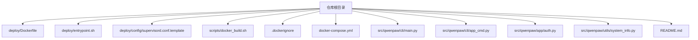
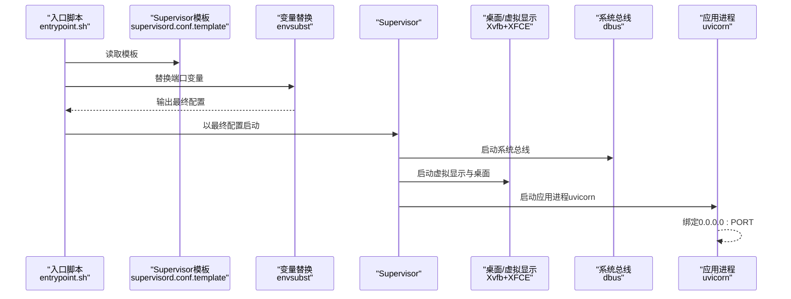
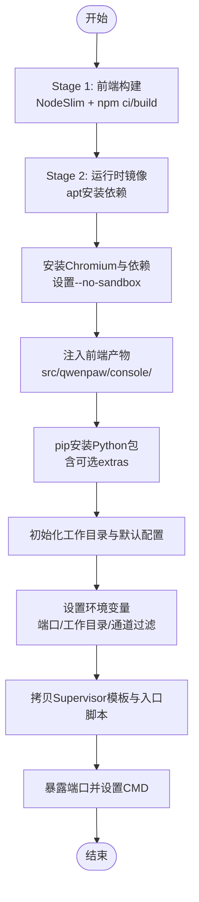
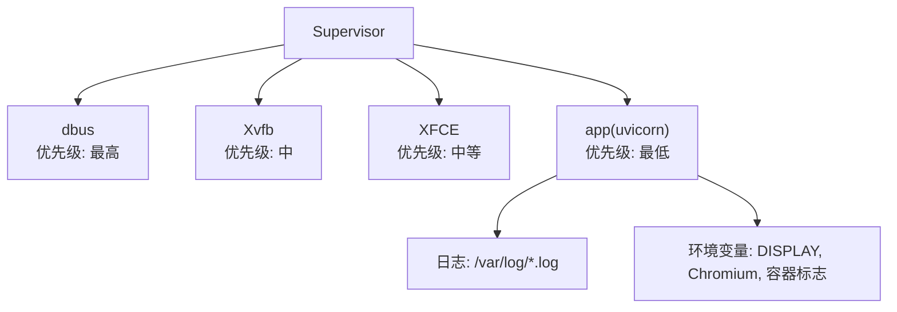
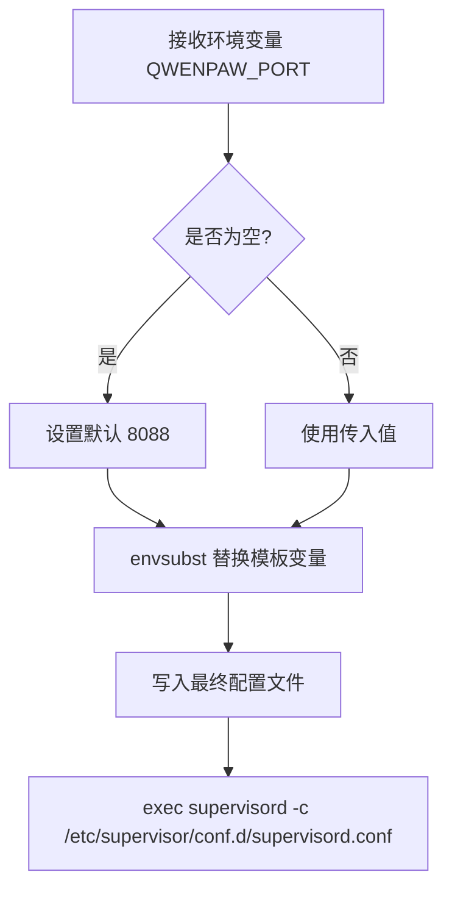
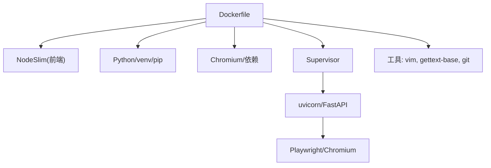

# Docker容器化

<cite>
**本文引用的文件**
- [deploy/Dockerfile](file://deploy/Dockerfile)
- [deploy/entrypoint.sh](file://deploy/entrypoint.sh)
- [deploy/config/supervisord.conf.template](file://deploy/config/supervisord.conf.template)
- [scripts/docker_build.sh](file://scripts/docker_build.sh)
- [.dockerignore](file://.dockerignore)
- [docker-compose.yml](file://docker-compose.yml)
- [src/qwenpaw/cli/main.py](file://src/qwenpaw/cli/main.py)
- [src/qwenpaw/cli/app_cmd.py](file://src/qwenpaw/cli/app_cmd.py)
- [src/qwenpaw/app/auth.py](file://src/qwenpaw/app/auth.py)
- [src/qwenpaw/utils/system_info.py](file://src/qwenpaw/utils/system_info.py)
- [README.md](file://README.md)
</cite>

## 目录
1. [简介](#简介)
2. [项目结构](#项目结构)
3. [核心组件](#核心组件)
4. [架构总览](#架构总览)
5. [详细组件分析](#详细组件分析)
6. [依赖分析](#依赖分析)
7. [性能考虑](#性能考虑)
8. [故障排查指南](#故障排查指南)
9. [结论](#结论)
10. [附录](#附录)

## 简介
本文件面向运维与开发工程师，系统性解读 QwenPaw 的 Docker 容器化方案，覆盖多阶段构建流程（前端构建阶段、运行时镜像与依赖管理）、容器环境变量配置（工作目录、通道过滤、端口映射）、Supervisor 进程管理（主进程启动、子进程监控与自动重启）、容器启动脚本（环境初始化、配置验证与健康检查建议），并提供镜像优化、资源限制与安全配置的最佳实践，以及调试技巧与常见问题排查方法。

## 项目结构
与容器化直接相关的文件集中在 deploy、scripts 与根目录配置中：
- 多阶段 Dockerfile：前端构建与运行时打包
- 启动脚本：入口点替换模板并启动 Supervisor
- Supervisor 配置模板：定义 dbus、Xvfb、XFCE 桌面与应用进程
- 构建脚本：封装镜像构建参数（通道白/黑名单）
- 容器编排：docker-compose 示例
- .dockerignore：排除构建无关文件与缓存
- CLI 入口与应用命令：默认绑定地址与端口来源

图表来源
- [deploy/Dockerfile:1-103](file://deploy/Dockerfile#L1-L103)
- [deploy/entrypoint.sh:1-10](file://deploy/entrypoint.sh#L1-L10)
- [deploy/config/supervisord.conf.template:1-40](file://deploy/config/supervisord.conf.template#L1-L40)
- [scripts/docker_build.sh:1-32](file://scripts/docker_build.sh#L1-L32)
- [.dockerignore:1-59](file://.dockerignore#L1-L59)
- [docker-compose.yml:1-23](file://docker-compose.yml#L1-L23)
- [src/qwenpaw/cli/main.py:1-171](file://src/qwenpaw/cli/main.py#L1-L171)
- [src/qwenpaw/cli/app_cmd.py:1-112](file://src/qwenpaw/cli/app_cmd.py#L1-L112)
- [src/qwenpaw/app/auth.py:1-300](file://src/qwenpaw/app/auth.py#L1-L300)
- [src/qwenpaw/utils/system_info.py:1-229](file://src/qwenpaw/utils/system_info.py#L1-L229)
- [README.md:230-272](file://README.md#L230-L272)

章节来源
- [deploy/Dockerfile:1-103](file://deploy/Dockerfile#L1-L103)
- [scripts/docker_build.sh:1-32](file://scripts/docker_build.sh#L1-L32)
- [docker-compose.yml:1-23](file://docker-compose.yml#L1-L23)
- [.dockerignore:1-59](file://.dockerignore#L1-L59)
- [README.md:230-272](file://README.md#L230-L272)

## 核心组件
- 多阶段 Dockerfile
  - 前端构建阶段：使用 NodeSlim 基础镜像构建 console 前端产物
  - 运行时阶段：安装 Python、Chromium、Supervisor 等依赖；注入前端产物；安装 Python 包；初始化工作目录与默认配置
- 启动脚本
  - 使用 envsubst 将模板中的端口变量替换为运行时环境变量，再启动 Supervisor
- Supervisor 配置
  - dbus、Xvfb、XFCE 桌面会话与应用进程（uvicorn）统一由 Supervisor 管理，具备 autostart/autorestart 策略
- 构建脚本
  - 支持通过构建参数控制通道白/黑名单，便于裁剪镜像能力
- 容器编排
  - 提供 docker-compose 示例，挂载工作目录与密钥目录，暴露默认端口
- CLI 默认绑定
  - CLI 层面默认绑定地址与端口，与容器内 Supervisor 绑定保持一致

章节来源
- [deploy/Dockerfile:1-103](file://deploy/Dockerfile#L1-L103)
- [deploy/entrypoint.sh:1-10](file://deploy/entrypoint.sh#L1-L10)
- [deploy/config/supervisord.conf.template:1-40](file://deploy/config/supervisord.conf.template#L1-L40)
- [scripts/docker_build.sh:1-32](file://scripts/docker_build.sh#L1-L32)
- [docker-compose.yml:1-23](file://docker-compose.yml#L1-L23)
- [src/qwenpaw/cli/main.py:147-171](file://src/qwenpaw/cli/main.py#L147-L171)
- [src/qwenpaw/cli/app_cmd.py:15-112](file://src/qwenpaw/cli/app_cmd.py#L15-L112)

## 架构总览
下图展示容器启动到服务可用的关键路径：入口脚本替换模板变量、Supervisor 启动桌面与应用、应用监听端口对外提供服务。

图表来源
- [deploy/entrypoint.sh:1-10](file://deploy/entrypoint.sh#L1-L10)
- [deploy/config/supervisord.conf.template:1-40](file://deploy/config/supervisord.conf.template#L1-L40)

章节来源
- [deploy/entrypoint.sh:1-10](file://deploy/entrypoint.sh#L1-L10)
- [deploy/config/supervisord.conf.template:1-40](file://deploy/config/supervisord.conf.template#L1-L40)

## 详细组件分析

### 多阶段 Dockerfile 解析
- 前端构建阶段
  - 基于 NodeSlim 镜像，复制 console 源码，执行依赖安装与构建，生成 dist
  - 该阶段不提交 dist，避免污染基础镜像层
- 运行时阶段
  - 安装 Python、pip、venv、build-essential、git、supervisor、vim、gettext-base 等
  - 安装 Chromium 及其依赖，并设置 --no-sandbox 以适配容器环境
  - 注入前端产物至 Python 包内的 console 目录
  - 安装 Python 包（含可选 extras），初始化工作目录与默认配置
  - 设置默认端口与暴露端口，拷贝 Supervisor 模板与入口脚本，设置 CMD

图表来源
- [deploy/Dockerfile:1-103](file://deploy/Dockerfile#L1-L103)

章节来源
- [deploy/Dockerfile:1-103](file://deploy/Dockerfile#L1-L103)

### 容器环境变量与端口映射
- 工作目录与密钥目录
  - WORKSPACE_DIR：工作空间根目录
  - QWENPAW_WORKING_DIR：工作目录（持久化数据）
  - QWENPAW_SECRET_DIR：密钥目录（持久化密钥）
- 通道过滤
  - QWENPAW_DISABLED_CHANNELS：排除列表（默认包含 imessage）
  - QWENPAW_ENABLED_CHANNELS：白名单（空表示不限制）
- 运行时端口
  - QWENPAW_PORT：默认 8088，可通过 -e 覆盖
- Playwright 与容器标志
  - PLAYWRIGHT_CHROMIUM_EXECUTABLE_PATH：指向系统 Chromium
  - PLAYWRIGHT_SKIP_BROWSER_DOWNLOAD：禁用下载浏览器
  - QWENPAW_RUNNING_IN_CONTAINER：标记容器运行环境
- CLI 默认绑定
  - CLI 层面默认绑定地址与端口，确保与容器内 Supervisor 一致

章节来源
- [deploy/Dockerfile:14-96](file://deploy/Dockerfile#L14-L96)
- [src/qwenpaw/cli/main.py:147-171](file://src/qwenpaw/cli/main.py#L147-L171)
- [src/qwenpaw/cli/app_cmd.py:15-112](file://src/qwenpaw/cli/app_cmd.py#L15-L112)

### Supervisor 进程管理机制
- 进程分层与优先级
  - dbus：系统总线，优先级最高
  - Xvfb：虚拟显示，优先级次之
  - XFCE：桌面会话，优先级再次
  - app：uvicorn 应用进程，优先级最低但受 autorestart 保护
- 自动重启策略
  - 所有程序均启用 autostart/autorestart，提升容器稳定性
- 日志与环境
  - 各进程输出重定向至 /var/log 下对应日志文件
  - app 进程注入 DISPLAY、Chromium 路径与容器标志

图表来源
- [deploy/config/supervisord.conf.template:1-40](file://deploy/config/supervisord.conf.template#L1-L40)

章节来源
- [deploy/config/supervisord.conf.template:1-40](file://deploy/config/supervisord.conf.template#L1-L40)

### 容器启动脚本实现原理
- 功能要点
  - 设置默认端口（若未提供则使用 8088）
  - 使用 envsubst 将模板中的端口变量替换为实际值
  - 写入最终配置文件并启动 Supervisor
- 与 Supervisor 的衔接
  - 模板中 app 进程绑定 0.0.0.0:PORT，与 CLI 默认绑定一致

图表来源
- [deploy/entrypoint.sh:1-10](file://deploy/entrypoint.sh#L1-L10)
- [deploy/config/supervisord.conf.template:14-21](file://deploy/config/supervisord.conf.template#L14-L21)

章节来源
- [deploy/entrypoint.sh:1-10](file://deploy/entrypoint.sh#L1-L10)
- [deploy/config/supervisord.conf.template:14-21](file://deploy/config/supervisord.conf.template#L14-L21)

### 构建脚本与通道过滤
- 构建脚本
  - 支持通过 QWENPAW_DISABLED_CHANNELS 与 QWENPAW_ENABLED_CHANNELS 控制通道裁剪
  - 默认排除 imessage（macOS 独占）
  - 支持 --no-cache 等额外参数透传给 docker build
- 通道过滤在镜像层面生效
  - 通过构建参数影响运行时行为，减少不必要的依赖与功能

章节来源
- [scripts/docker_build.sh:1-32](file://scripts/docker_build.sh#L1-L32)
- [deploy/Dockerfile:20-25](file://deploy/Dockerfile#L20-L25)

### 容器编排与持久化
- docker-compose 示例
  - 暴露默认端口 8088
  - 挂载两个命名卷：工作目录与密钥目录
  - 使用 restart: always 提升可用性
- README 中提供了更丰富的网络与主机访问说明（如 host.docker.internal）

章节来源
- [docker-compose.yml:1-23](file://docker-compose.yml#L1-L23)
- [README.md:230-272](file://README.md#L230-L272)

### 环境初始化与默认配置
- 初始化命令
  - 在镜像构建阶段调用 qwenpaw init --defaults --accept-security，生成默认配置与心跳文件
- 默认配置
  - 保证首次启动无需交互即可进入控制台

章节来源
- [deploy/Dockerfile:91-93](file://deploy/Dockerfile#L91-L93)

### 认证与安全相关环境变量
- Web 登录认证
  - QWENPAW_AUTH_ENABLED：启用/禁用控制台登录
  - QWENPAW_AUTH_USERNAME / QWENPAW_AUTH_PASSWORD：用户名与密码
- README 提供了示例与注意事项

章节来源
- [src/qwenpaw/app/auth.py:1-300](file://src/qwenpaw/app/auth.py#L1-L300)
- [README.md:380-392](file://README.md#L380-L392)

## 依赖分析
- 构建期依赖
  - NodeSlim：前端构建
  - Python 生态：pip、venv、build-essential
  - Chromium 与桌面运行时：Xvfb、XFCE、dbus
- 运行期依赖
  - Supervisor：统一管理多个进程
  - uvicorn：FastAPI 应用服务器
  - Playwright + Chromium：用于浏览器类能力（容器内无沙箱）
- 体积与安全
  - .dockerignore 排除大量开发与测试产物，避免进入运行时镜像
  - 仅安装必要工具（vim、gettext-base、git）以便容器内排障与配置注入

图表来源
- [deploy/Dockerfile:1-103](file://deploy/Dockerfile#L1-L103)
- [.dockerignore:1-59](file://.dockerignore#L1-L59)

章节来源
- [deploy/Dockerfile:1-103](file://deploy/Dockerfile#L1-L103)
- [.dockerignore:1-59](file://.dockerignore#L1-L59)

## 性能考虑
- 前端构建分离
  - 前端在独立阶段完成，避免将 node_modules 与构建产物带入运行时镜像
- 运行时最小化
  - 仅安装必要系统库与工具，减少镜像体积与攻击面
- 显示栈轻量化
  - 使用 Xvfb 提供虚拟显示，避免完整 GUI 开销
- 进程稳定性
  - Supervisor 的 autorestart 保障关键进程持续可用
- 端口与绑定
  - 默认绑定 0.0.0.0:8088，便于容器网络访问；可通过环境变量调整

章节来源
- [deploy/Dockerfile:1-103](file://deploy/Dockerfile#L1-L103)
- [deploy/config/supervisord.conf.template:1-40](file://deploy/config/supervisord.conf.template#L1-L40)
- [src/qwenpaw/cli/main.py:147-171](file://src/qwenpaw/cli/main.py#L147-L171)

## 故障排查指南
- 启动后无法访问控制台
  - 检查端口映射与绑定：容器内绑定 0.0.0.0:8088，确认 docker run -p 或 compose 端口映射正确
  - 查看应用日志：/var/log/app.out.log 与 /var/log/app.err.log
- 浏览器类能力异常
  - 确认 Chromium 已安装且 --no-sandbox 已设置
  - 检查 PLAYWRIGHT_CHROMIUM_EXECUTABLE_PATH 与 QWENPAW_RUNNING_IN_CONTAINER
- 进程频繁退出
  - 检查 Supervisor 日志与 autorestart 行为
  - 关注 dbus、Xvfb、XFCE 的启动状态与日志
- 通道不可用或报错
  - 检查通道过滤环境变量（白/黑名单）是否符合预期
  - 如需裁剪通道，使用构建脚本的构建参数进行控制
- 主机服务连通性
  - 容器内 localhost 指向容器自身，连接宿主机服务请使用 host.docker.internal 或 host-gateway
  - Linux 可考虑 host 网络模式（注意端口冲突风险）

章节来源
- [deploy/config/supervisord.conf.template:1-40](file://deploy/config/supervisord.conf.template#L1-L40)
- [deploy/Dockerfile:70-79](file://deploy/Dockerfile#L70-L79)
- [README.md:246-268](file://README.md#L246-L268)

## 结论
QwenPaw 的 Docker 方案通过多阶段构建将前端产物与运行时隔离，结合 Supervisor 对桌面与应用进程进行统一管理，既满足容器内浏览器类能力需求，又保持镜像精简与启动稳定。配合通道过滤、默认端口与持久化卷，可在生产环境中快速落地。建议在生产中进一步完善资源限制、网络隔离与密钥管理策略，以增强安全性与可观测性。

## 附录
- 最佳实践清单
  - 镜像优化：使用 .dockerignore 排除无关文件；按需裁剪通道；合并 apt 清理步骤
  - 资源限制：在 docker run/compose 中设置 CPU/内存限制，避免资源争用
  - 安全配置：启用 Web 登录认证；最小权限原则挂载卷；避免在镜像中硬编码密钥
  - 网络访问：容器内服务通过 host.docker.internal 访问宿主机；Linux 可考虑 host 网络模式
  - 可观测性：开启应用日志与访问日志过滤；定期查看 Supervisor 日志
- 常见问题速查
  - 控制台无法打开：核对端口映射与绑定
  - 浏览器能力异常：核对 Chromium 路径与容器标志
  - 进程反复重启：检查 dbus/Xvfb/XFCE 启动日志
  - 通道不可用：核对白/黑名单环境变量与构建参数