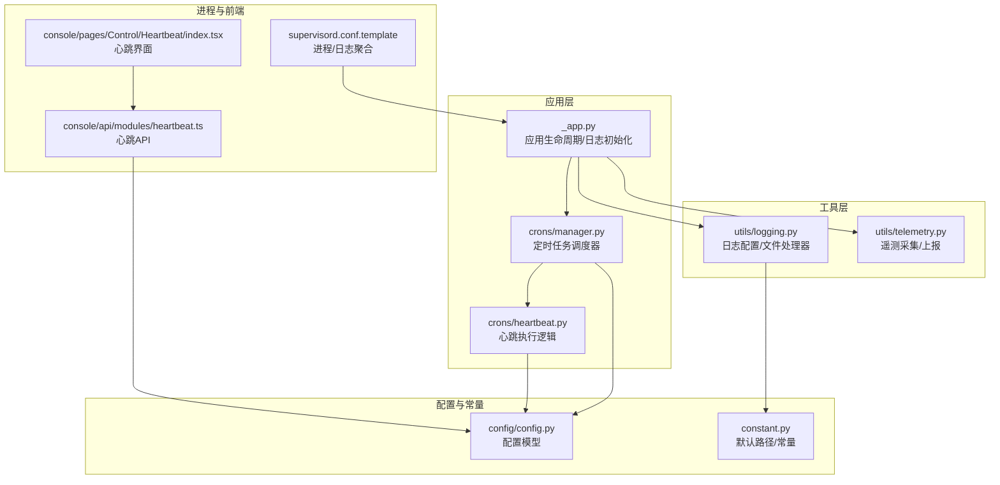
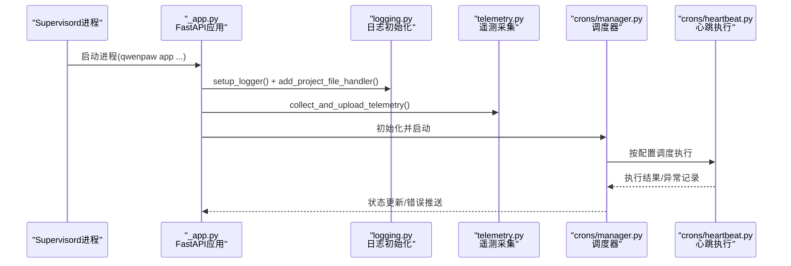
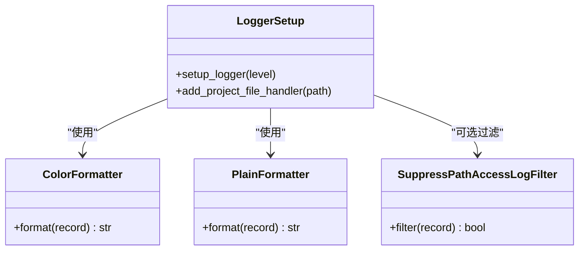
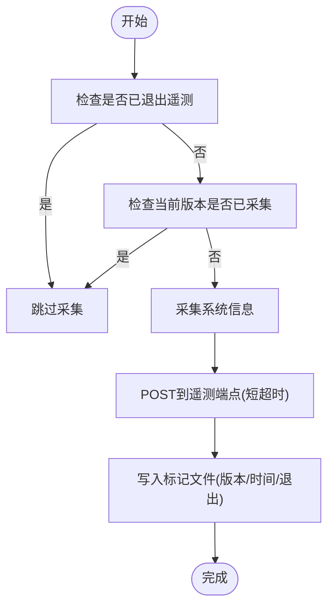
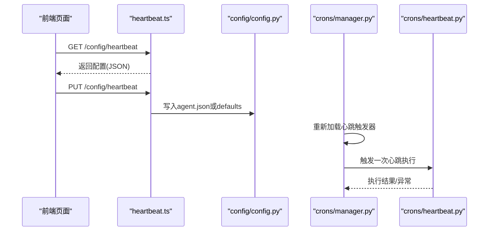
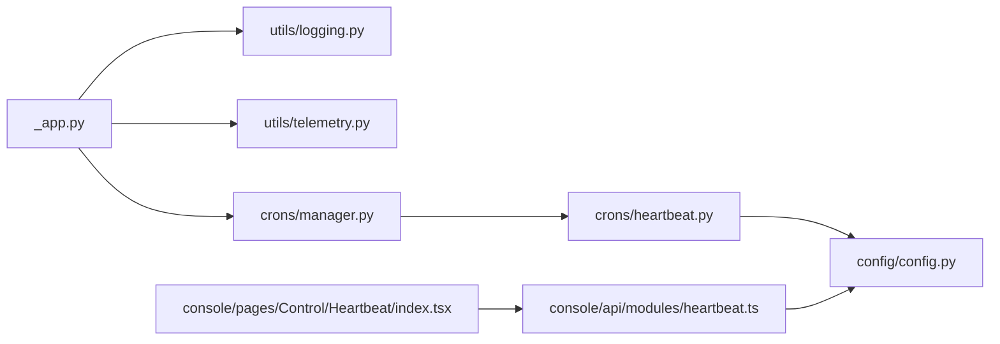

# 监控日志

<cite>
**本文引用的文件**
- [src/qwenpaw/utils/logging.py](file://src/qwenpaw/utils/logging.py)
- [src/qwenpaw/utils/telemetry.py](file://src/qwenpaw/utils/telemetry.py)
- [src/qwenpaw/app/_app.py](file://src/qwenpaw/app/_app.py)
- [src/qwenpaw/app/crons/heartbeat.py](file://src/qwenpaw/app/crons/heartbeat.py)
- [src/qwenpaw/app/crons/manager.py](file://src/qwenpaw/app/crons/manager.py)
- [src/qwenpaw/config/config.py](file://src/qwenpaw/config/config.py)
- [src/qwenpaw/constant.py](file://src/qwenpaw/constant.py)
- [deploy/config/supervisord.conf.template](file://deploy/config/supervisord.conf.template)
- [console/src/api/modules/heartbeat.ts](file://console/src/api/modules/heartbeat.ts)
- [console/src/api/types/heartbeat.ts](file://console/src/api/types/heartbeat.ts)
- [console/src/pages/Control/Heartbeat/index.tsx](file://console/src/pages/Control/Heartbeat/index.tsx)
- [src/qwenpaw/app/runner/daemon_commands.py](file://src/qwenpaw/app/runner/daemon_commands.py)
- [src/qwenpaw/app/runner/runner.py](file://src/qwenpaw/app/runner/runner.py)
</cite>

## 目录
1. [简介](#简介)
2. [项目结构](#项目结构)
3. [核心组件](#核心组件)
4. [架构总览](#架构总览)
5. [组件详解](#组件详解)
6. [依赖关系分析](#依赖关系分析)
7. [性能与稳定性](#性能与稳定性)
8. [故障排查指南](#故障排查指南)
9. [结论](#结论)
10. [附录：监控仪表板与告警配置](#附录监控仪表板与告警配置)

## 简介
本文件面向QwenPaw的监控与日志体系，系统性阐述以下主题：
- 日志系统：日志级别、输出格式、文件处理器与轮转策略
- 遥测（Telemetry）：安装与环境信息采集、上报机制与隐私策略
- 心跳监控：调度与执行、健康检查、异常检测与前端控制
- Supervisor监控：进程管理、自动重启、日志聚合
- 日志分析与故障诊断：关键指标、瓶颈定位、根因分析方法
- 仪表板与告警：搭建思路与规则建议
- 日志轮转与清理：跨平台策略与长期运行保障

## 项目结构
围绕监控与日志的关键目录与文件如下：
- 日志与遥测：src/qwenpaw/utils/logging.py、src/qwenpaw/utils/telemetry.py
- 应用生命周期与启动日志：src/qwenpaw/app/_app.py
- 心跳与定时任务：src/qwenpaw/app/crons/heartbeat.py、src/qwenpaw/app/crons/manager.py
- 配置模型：src/qwenpaw/config/config.py、src/qwenpaw/constant.py
- 进程与日志聚合：deploy/config/supervisord.conf.template
- 前端心跳配置接口：console/src/api/modules/heartbeat.ts、console/src/api/types/heartbeat.ts、console/src/pages/Control/Heartbeat/index.tsx
- 守护命令与错误转储：src/qwenpaw/app/runner/daemon_commands.py、src/qwenpaw/app/runner/runner.py

图表来源
- [src/qwenpaw/app/_app.py:166-194](file://src/qwenpaw/app/_app.py#L166-L194)
- [src/qwenpaw/utils/logging.py:121-201](file://src/qwenpaw/utils/logging.py#L121-L201)
- [src/qwenpaw/utils/telemetry.py:286-305](file://src/qwenpaw/utils/telemetry.py#L286-L305)
- [src/qwenpaw/app/crons/manager.py:38-110](file://src/qwenpaw/app/crons/manager.py#L38-L110)
- [src/qwenpaw/app/crons/heartbeat.py:119-213](file://src/qwenpaw/app/crons/heartbeat.py#L119-L213)
- [src/qwenpaw/config/config.py:242-254](file://src/qwenpaw/config/config.py#L242-L254)
- [src/qwenpaw/constant.py:147-151](file://src/qwenpaw/constant.py#L147-L151)
- [deploy/config/supervisord.conf.template:1-40](file://deploy/config/supervisord.conf.template#L1-L40)
- [console/src/api/modules/heartbeat.ts:1-12](file://console/src/api/modules/heartbeat.ts#L1-L12)
- [console/src/pages/Control/Heartbeat/index.tsx:71-138](file://console/src/pages/Control/Heartbeat/index.tsx#L71-L138)

章节来源
- [src/qwenpaw/app/_app.py:166-194](file://src/qwenpaw/app/_app.py#L166-L194)
- [src/qwenpaw/utils/logging.py:121-201](file://src/qwenpaw/utils/logging.py#L121-L201)
- [src/qwenpaw/utils/telemetry.py:286-305](file://src/qwenpaw/utils/telemetry.py#L286-L305)
- [src/qwenpaw/app/crons/manager.py:38-110](file://src/qwenpaw/app/crons/manager.py#L38-L110)
- [src/qwenpaw/app/crons/heartbeat.py:119-213](file://src/qwenpaw/app/crons/heartbeat.py#L119-L213)
- [src/qwenpaw/config/config.py:242-254](file://src/qwenpaw/config/config.py#L242-L254)
- [src/qwenpaw/constant.py:147-151](file://src/qwenpaw/constant.py#L147-L151)
- [deploy/config/supervisord.conf.template:1-40](file://deploy/config/supervisord.conf.template#L1-L40)
- [console/src/api/modules/heartbeat.ts:1-12](file://console/src/api/modules/heartbeat.ts#L1-L12)
- [console/src/pages/Control/Heartbeat/index.tsx:71-138](file://console/src/pages/Control/Heartbeat/index.tsx#L71-L138)

## 核心组件
- 日志系统
  - 控制台彩色/纯文本格式化器
  - 根日志器级别抑制第三方库噪音
  - 项目命名空间隔离
  - 文件处理器：Windows/Linux直写；macOS旋转写入
  - 访问日志过滤器（可选）
- 遥测系统
  - 安装与环境信息采集（版本、安装方式、系统、GPU等）
  - 上报端点与失败静默策略
  - 版本标记与“已采集/已退出”持久化
- 心跳系统
  - 支持间隔与Cron两种调度
  - 活跃时段限制
  - 目标选择：主会话或上次分发通道
  - 超时保护与异常记录
- 进程与日志聚合
  - Supervisord管理应用、Xvfb、桌面会话
  - 自动重启与标准输出/错误日志文件
- 前端控制
  - 获取/更新心跳配置
  - 表单解析与序列化

章节来源
- [src/qwenpaw/utils/logging.py:121-201](file://src/qwenpaw/utils/logging.py#L121-L201)
- [src/qwenpaw/utils/telemetry.py:286-305](file://src/qwenpaw/utils/telemetry.py#L286-L305)
- [src/qwenpaw/app/crons/heartbeat.py:119-213](file://src/qwenpaw/app/crons/heartbeat.py#L119-L213)
- [deploy/config/supervisord.conf.template:14-21](file://deploy/config/supervisord.conf.template#L14-L21)
- [console/src/api/modules/heartbeat.ts:4-12](file://console/src/api/modules/heartbeat.ts#L4-L12)
- [console/src/pages/Control/Heartbeat/index.tsx:71-138](file://console/src/pages/Control/Heartbeat/index.tsx#L71-L138)

## 架构总览
下图展示从应用启动到心跳执行、日志落盘与进程管理的整体流程。

图表来源
- [deploy/config/supervisord.conf.template:14-21](file://deploy/config/supervisord.conf.template#L14-L21)
- [src/qwenpaw/app/_app.py:166-194](file://src/qwenpaw/app/_app.py#L166-L194)
- [src/qwenpaw/utils/logging.py:121-201](file://src/qwenpaw/utils/logging.py#L121-L201)
- [src/qwenpaw/utils/telemetry.py:286-305](file://src/qwenpaw/utils/telemetry.py#L286-L305)
- [src/qwenpaw/app/crons/manager.py:38-110](file://src/qwenpaw/app/crons/manager.py#L38-L110)
- [src/qwenpaw/app/crons/heartbeat.py:119-213](file://src/qwenpaw/app/crons/heartbeat.py#L119-L213)

## 组件详解

### 日志系统
- 日志级别映射与控制台输出
  - 支持critical/error/warning/info/debug映射
  - 彩色/纯文本格式化器，终端自动降级
- 根日志器抑制策略
  - 将非项目包的日志处理器提升至警告级别，避免噪声
- 项目命名空间隔离
  - 仅输出项目包内的日志，避免第三方库污染
- 文件处理器策略
  - Windows/Linux：FileHandler，避免锁冲突
  - macOS：RotatingFileHandler，按大小轮转
  - 备份数与单文件上限在模块内定义
- 访问日志过滤
  - 可配置路径子串过滤，隐藏特定访问日志行
- 输出格式
  - 时间戳、级别、文件路径与行号、消息体
  - 统一日期格式与分隔符

图表来源
- [src/qwenpaw/utils/logging.py:51-201](file://src/qwenpaw/utils/logging.py#L51-L201)

章节来源
- [src/qwenpaw/utils/logging.py:121-201](file://src/qwenpaw/utils/logging.py#L121-L201)

### 遥测系统
- 数据采集
  - 安装ID（随机）、版本、安装方式（容器/桌面/Pip）、操作系统、Python版本、架构、GPU可用性
- 上报机制
  - 同步POST到固定端点，超时短路，失败静默
- 标记与去重
  - 工作目录下的标记文件记录已采集版本列表与用户退出状态
  - 升级/降级版本会重新触发采集
- 隐私策略
  - 采集失败不中断安装流程；用户可永久退出

图表来源
- [src/qwenpaw/utils/telemetry.py:188-305](file://src/qwenpaw/utils/telemetry.py#L188-L305)

章节来源
- [src/qwenpaw/utils/telemetry.py:286-305](file://src/qwenpaw/utils/telemetry.py#L286-L305)

### 心跳监控
- 配置模型
  - enabled/every/target/activeHours
  - 默认每6小时，目标main或last
- 调度与执行
  - CronManager根据配置构建Cron或Interval触发器
  - run_heartbeat_once读取HEARTBEAT.md，构造请求，按目标执行
  - 支持活跃时段判断与超时保护
- 前端控制
  - API获取/更新心跳配置
  - 表单支持间隔单位与活跃时段开关

图表来源
- [console/src/pages/Control/Heartbeat/index.tsx:71-138](file://console/src/pages/Control/Heartbeat/index.tsx#L71-L138)
- [console/src/api/modules/heartbeat.ts:4-12](file://console/src/api/modules/heartbeat.ts#L4-L12)
- [src/qwenpaw/config/config.py:242-254](file://src/qwenpaw/config/config.py#L242-L254)
- [src/qwenpaw/app/crons/manager.py:154-189](file://src/qwenpaw/app/crons/manager.py#L154-L189)
- [src/qwenpaw/app/crons/heartbeat.py:119-213](file://src/qwenpaw/app/crons/heartbeat.py#L119-L213)

章节来源
- [src/qwenpaw/config/config.py:242-254](file://src/qwenpaw/config/config.py#L242-L254)
- [src/qwenpaw/app/crons/manager.py:154-189](file://src/qwenpaw/app/crons/manager.py#L154-L189)
- [src/qwenpaw/app/crons/heartbeat.py:119-213](file://src/qwenpaw/app/crons/heartbeat.py#L119-L213)
- [console/src/api/modules/heartbeat.ts:4-12](file://console/src/api/modules/heartbeat.ts#L4-L12)
- [console/src/pages/Control/Heartbeat/index.tsx:71-138](file://console/src/pages/Control/Heartbeat/index.tsx#L71-L138)

### 进程与日志聚合（Supervisor）
- 进程定义
  - app：监听0.0.0.0:PORT，自动重启，优先级可控
  - xvfb/xfce4：虚拟显示与桌面会话
  - dbus：系统总线
- 日志文件
  - app.err.log / app.out.log
  - 其他进程对应err/out日志
- 环境变量
  - 显示器、Chromium路径、容器标志等

章节来源
- [deploy/config/supervisord.conf.template:1-40](file://deploy/config/supervisord.conf.template#L1-L40)

### 守护命令与错误转储
- 守护命令
  - /daemon status/restart/logs等
  - 读取最后N行日志（带内存上限）
- 错误转储
  - 请求处理异常时生成调试转储文件，附加路径提示

章节来源
- [src/qwenpaw/app/runner/daemon_commands.py:47-97](file://src/qwenpaw/app/runner/daemon_commands.py#L47-L97)
- [src/qwenpaw/app/runner/runner.py:559-594](file://src/qwenpaw/app/runner/runner.py#L559-L594)

## 依赖关系分析
- 日志与应用生命周期
  - 应用启动时调用日志初始化，并添加项目专用文件处理器
- 遥测与应用生命周期
  - 应用启动阶段尝试采集并上报遥测，失败静默
- 心跳与配置
  - CronManager读取配置构建触发器；心跳执行受活跃时段与目标控制
- 前后端联动
  - 前端通过API读写心跳配置，后端写入配置文件并重载调度

图表来源
- [src/qwenpaw/app/_app.py:166-194](file://src/qwenpaw/app/_app.py#L166-L194)
- [src/qwenpaw/utils/logging.py:121-201](file://src/qwenpaw/utils/logging.py#L121-L201)
- [src/qwenpaw/utils/telemetry.py:286-305](file://src/qwenpaw/utils/telemetry.py#L286-L305)
- [src/qwenpaw/app/crons/manager.py:38-110](file://src/qwenpaw/app/crons/manager.py#L38-L110)
- [src/qwenpaw/app/crons/heartbeat.py:119-213](file://src/qwenpaw/app/crons/heartbeat.py#L119-L213)
- [src/qwenpaw/config/config.py:242-254](file://src/qwenpaw/config/config.py#L242-L254)
- [console/src/api/modules/heartbeat.ts:4-12](file://console/src/api/modules/heartbeat.ts#L4-L12)
- [console/src/pages/Control/Heartbeat/index.tsx:71-138](file://console/src/pages/Control/Heartbeat/index.tsx#L71-L138)

章节来源
- [src/qwenpaw/app/_app.py:166-194](file://src/qwenpaw/app/_app.py#L166-L194)
- [src/qwenpaw/app/crons/manager.py:38-110](file://src/qwenpaw/app/crons/manager.py#L38-L110)
- [src/qwenpaw/app/crons/heartbeat.py:119-213](file://src/qwenpaw/app/crons/heartbeat.py#L119-L213)
- [src/qwenpaw/config/config.py:242-254](file://src/qwenpaw/config/config.py#L242-L254)
- [console/src/api/modules/heartbeat.ts:4-12](file://console/src/api/modules/heartbeat.ts#L4-L12)
- [console/src/pages/Control/Heartbeat/index.tsx:71-138](file://console/src/pages/Control/Heartbeat/index.tsx#L71-L138)

## 性能与稳定性
- 日志性能
  - 控制台输出采用轻量格式，避免高开销
  - 文件写入策略按平台优化，减少锁竞争
- 遥测性能
  - 短超时同步上传，失败静默，不影响启动
- 心跳稳定性
  - 超时保护与异常捕获，避免阻塞调度器
  - Cron表达式与间隔解析严格校验，无效配置自动禁用
- 进程稳定性
  - Supervisord自动重启，日志分离，便于定位问题

[本节为通用指导，无需具体文件引用]

## 故障排查指南
- 查看应用日志
  - 使用守护命令查看最近日志（带内存上限）
  - 关注应用启动阶段的初始化与插件加载日志
- 定位心跳问题
  - 检查配置文件中的enabled/every/target/activeHours
  - 确认调度器是否已注册心跳作业
  - 关注心跳执行过程中的超时与异常
- 错误转储
  - 出错时生成调试转储文件，记录请求与上下文
  - 在异常对象上附加调试路径提示
- 常见问题
  - Cron格式错误：会被自动禁用并记录警告
  - 活跃时段不匹配：心跳被跳过
  - GPU检测失败：返回未知，不影响功能

章节来源
- [src/qwenpaw/app/runner/daemon_commands.py:47-97](file://src/qwenpaw/app/runner/daemon_commands.py#L47-L97)
- [src/qwenpaw/app/runner/runner.py:559-594](file://src/qwenpaw/app/runner/runner.py#L559-L594)
- [src/qwenpaw/app/crons/manager.py:72-93](file://src/qwenpaw/app/crons/manager.py#L72-L93)
- [src/qwenpaw/app/crons/heartbeat.py:139-141](file://src/qwenpaw/app/crons/heartbeat.py#L139-L141)

## 结论
QwenPaw的监控日志体系以“清晰、稳定、可诊断”为目标：
- 日志系统通过命名空间隔离与平台化文件处理器，兼顾可读性与性能
- 遥测以最小侵入方式采集安装与环境信息，尊重用户隐私
- 心跳监控提供灵活的调度与目标控制，配合前端可视化配置
- Supervisor统一管理进程与日志，保障长期稳定运行
- 错误转储与守护命令为快速定位问题提供支撑

[本节为总结，无需具体文件引用]

## 附录：监控仪表板与告警配置
- 仪表板搭建建议
  - 指标来源
    - 应用日志：错误/警告计数、启动耗时、插件加载耗时
    - 心跳：成功/失败次数、执行时长、活跃时段命中率
    - 进程：进程存活、重启次数、CPU/内存占用
  - 可视化
    - 日志趋势图、错误热力图、心跳成功率与延迟
    - 进程状态面板与容器资源监控
- 告警规则示例
  - 日志级别阈值：近10分钟ERROR计数超过阈值
  - 心跳失败：连续失败次数或成功率低于阈值
  - 进程异常：进程退出、重启频率过高、超时重启
  - 建议结合Supervisord日志与应用日志进行关联分析

[本节为概念性内容，无需具体文件引用]