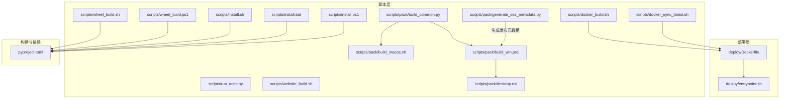
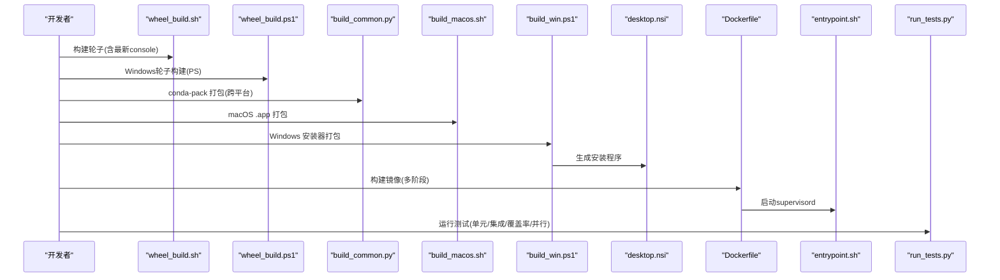
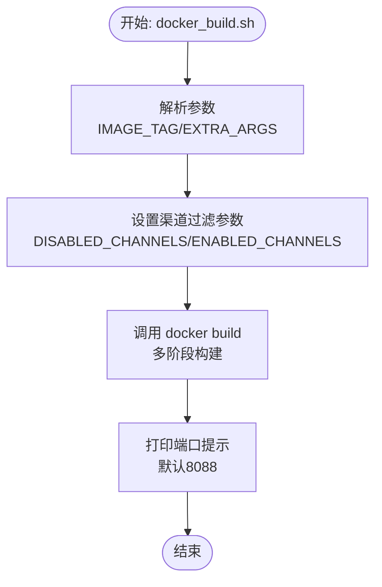
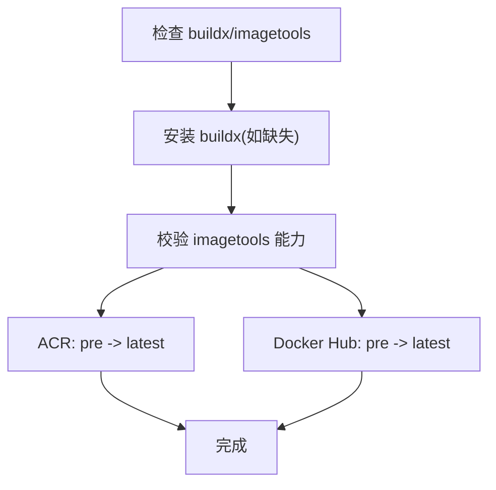
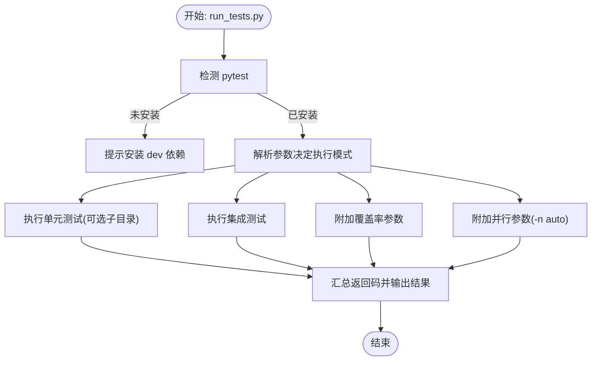
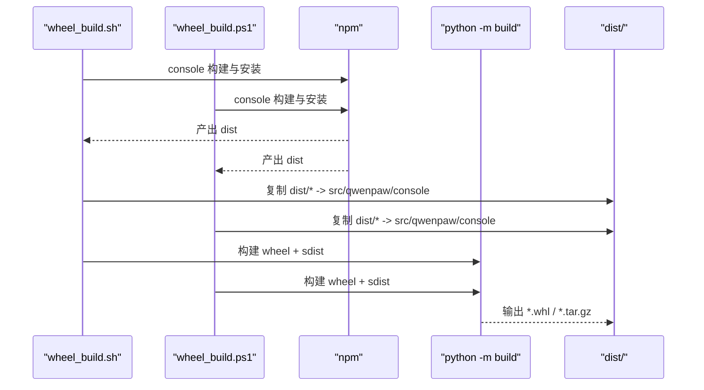
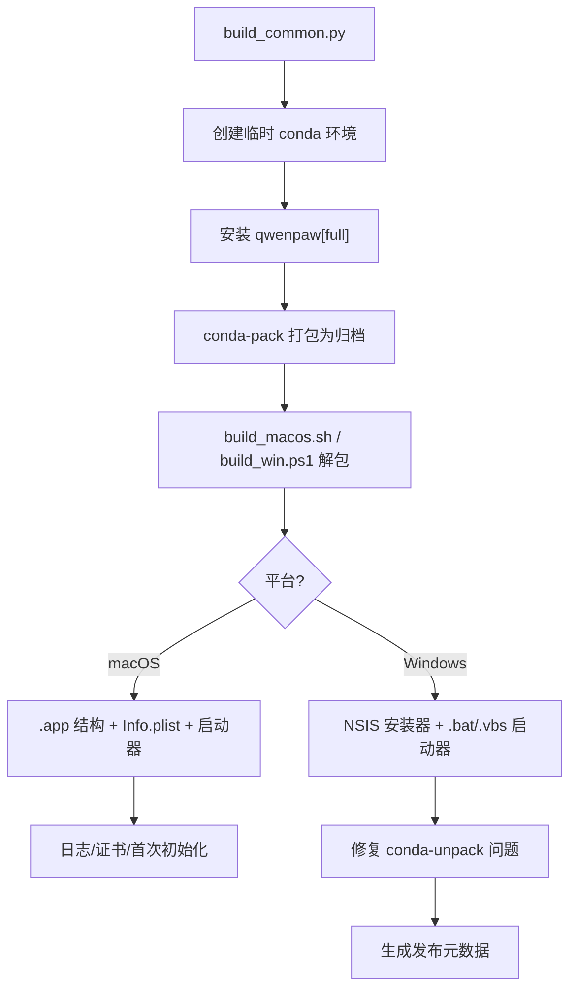
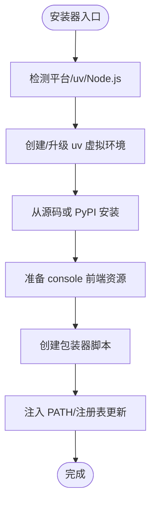
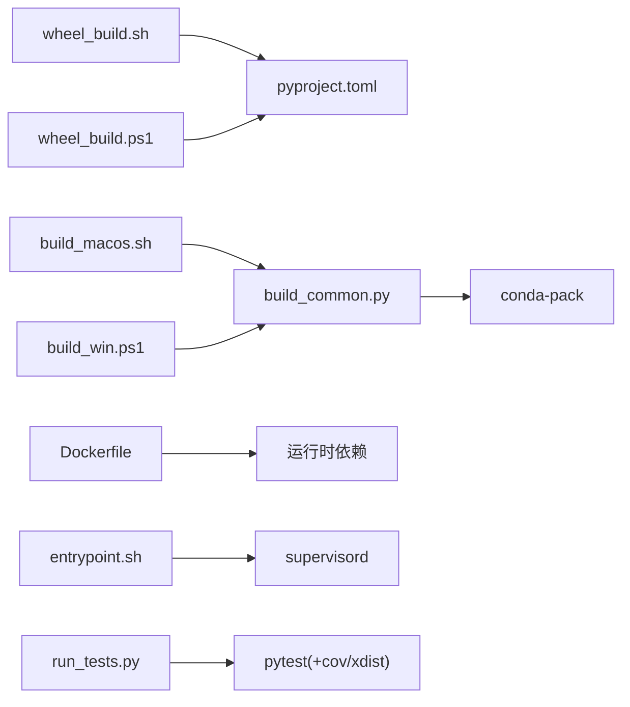

# 运维脚本

<cite>
**本文引用的文件**
- [scripts/README.md](file://scripts/README.md)
- [scripts/docker_build.sh](file://scripts/docker_build.sh)
- [scripts/docker_sync_latest.sh](file://scripts/docker_sync_latest.sh)
- [scripts/run_tests.py](file://scripts/run_tests.py)
- [scripts/website_build.sh](file://scripts/website_build.sh)
- [scripts/wheel_build.sh](file://scripts/wheel_build.sh)
- [scripts/wheel_build.ps1](file://scripts/wheel_build.ps1)
- [scripts/pack/build_common.py](file://scripts/pack/build_common.py)
- [scripts/pack/build_macos.sh](file://scripts/pack/build_macos.sh)
- [scripts/pack/build_win.ps1](file://scripts/pack/build_win.ps1)
- [scripts/pack/desktop.nsi](file://scripts/pack/desktop.nsi)
- [scripts/pack/generate_oss_metadata.py](file://scripts/pack/generate_oss_metadata.py)
- [scripts/install.sh](file://scripts/install.sh)
- [scripts/install.bat](file://scripts/install.bat)
- [scripts/install.ps1](file://scripts/install.ps1)
- [deploy/Dockerfile](file://deploy/Dockerfile)
- [deploy/entrypoint.sh](file://deploy/entrypoint.sh)
- [pyproject.toml](file://pyproject.toml)
</cite>

## 目录
1. [简介](#简介)
2. [项目结构](#项目结构)
3. [核心组件](#核心组件)
4. [架构总览](#架构总览)
5. [详细组件分析](#详细组件分析)
6. [依赖关系分析](#依赖关系分析)
7. [性能考虑](#性能考虑)
8. [故障排查指南](#故障排查指南)
9. [结论](#结论)
10. [附录](#附录)

## 简介
本指南面向运维与开发工程师，系统讲解 QwenPaw 的运维脚本体系，覆盖以下方面：
- Docker 构建脚本：镜像构建参数、版本标签、通道过滤、容器端口与入口点。
- 测试运行脚本：单元测试、集成测试、覆盖率与并行执行的自动化流程。
- 打包脚本：桌面应用打包、conda-pack 使用、Windows/ macOS 平台差异与修复。
- 网站构建脚本：前端依赖安装与构建、输出目录与产物位置。
- 安装器脚本：跨平台安装流程、uv 环境管理、可选特性与路径注入。
- CI/CD 集成：镜像同步、版本元数据生成、发布流程建议。

## 项目结构
运维相关脚本主要位于仓库根目录下的 scripts 及其子目录 scripts/pack 中，配合 deploy 目录的 Dockerfile 与入口脚本，以及 pyproject.toml 的构建与依赖定义。

图表来源
- [scripts/docker_build.sh:1-32](file://scripts/docker_build.sh#L1-L32)
- [scripts/docker_sync_latest.sh:1-77](file://scripts/docker_sync_latest.sh#L1-L77)
- [deploy/Dockerfile:1-103](file://deploy/Dockerfile#L1-L103)
- [deploy/entrypoint.sh:1-10](file://deploy/entrypoint.sh#L1-L10)
- [scripts/wheel_build.sh:1-28](file://scripts/wheel_build.sh#L1-L28)
- [scripts/wheel_build.ps1:1-41](file://scripts/wheel_build.ps1#L1-L41)
- [scripts/pack/build_common.py:1-321](file://scripts/pack/build_common.py#L1-L321)
- [scripts/pack/build_macos.sh:1-184](file://scripts/pack/build_macos.sh#L1-L184)
- [scripts/pack/build_win.ps1:1-325](file://scripts/pack/build_win.ps1#L1-L325)
- [scripts/pack/desktop.nsi:1-57](file://scripts/pack/desktop.nsi#L1-L57)
- [scripts/pack/generate_oss_metadata.py:1-211](file://scripts/pack/generate_oss_metadata.py#L1-L211)
- [scripts/run_tests.py:1-282](file://scripts/run_tests.py#L1-L282)
- [scripts/website_build.sh:1-28](file://scripts/website_build.sh#L1-L28)
- [scripts/install.sh:1-340](file://scripts/install.sh#L1-L340)
- [scripts/install.bat:1-557](file://scripts/install.bat#L1-L557)
- [scripts/install.ps1:1-477](file://scripts/install.ps1#L1-L477)
- [pyproject.toml:1-111](file://pyproject.toml#L1-L111)

章节来源
- [scripts/README.md:1-53](file://scripts/README.md#L1-L53)

## 核心组件
- Docker 构建与分发
  - 多阶段构建：先构建前端 console，再复制到 Python 应用中，最终安装可选依赖并初始化工作区。
  - 通道过滤：通过构建参数控制启用/禁用渠道，便于按需裁剪镜像。
  - 入口脚本：替换 supervisord 模板并启动服务，支持端口覆盖。
- 测试运行器
  - 支持单元测试、集成测试、覆盖率与并行执行；自动检测 pytest 并给出安装指引。
- 轮子构建
  - 前端构建后复制到 Python 包内，统一构建 wheel 与 sdist。
- 打包脚本
  - 通用打包逻辑（build_common.py）：创建临时 conda 环境、安装 wheel、conda-pack 打包。
  - macOS：.app 打包、Info.plist、图标、日志与启动器。
  - Windows：NSIS 安装器、.bat/.vbs 启动器、字节码预编译、conda-unpack 修复。
- 网站构建
  - 自动选择 pnpm 或 npm，执行构建，输出至 website/dist。
- 安装器
  - 跨平台 uv 环境管理，支持从源码或 PyPI 安装，自动准备 console 前端资源，注入 PATH。

章节来源
- [deploy/Dockerfile:1-103](file://deploy/Dockerfile#L1-L103)
- [deploy/entrypoint.sh:1-10](file://deploy/entrypoint.sh#L1-L10)
- [scripts/run_tests.py:1-282](file://scripts/run_tests.py#L1-L282)
- [scripts/wheel_build.sh:1-28](file://scripts/wheel_build.sh#L1-L28)
- [scripts/wheel_build.ps1:1-41](file://scripts/wheel_build.ps1#L1-L41)
- [scripts/pack/build_common.py:1-321](file://scripts/pack/build_common.py#L1-L321)
- [scripts/pack/build_macos.sh:1-184](file://scripts/pack/build_macos.sh#L1-L184)
- [scripts/pack/build_win.ps1:1-325](file://scripts/pack/build_win.ps1#L1-L325)
- [scripts/pack/desktop.nsi:1-57](file://scripts/pack/desktop.nsi#L1-L57)
- [scripts/website_build.sh:1-28](file://scripts/website_build.sh#L1-L28)
- [scripts/install.sh:1-340](file://scripts/install.sh#L1-L340)
- [scripts/install.bat:1-557](file://scripts/install.bat#L1-L557)
- [scripts/install.ps1:1-477](file://scripts/install.ps1#L1-L477)

## 架构总览
下图展示从本地构建到容器运行的关键流程，以及测试与打包在不同平台的协作方式。

图表来源
- [scripts/wheel_build.sh:1-28](file://scripts/wheel_build.sh#L1-L28)
- [scripts/wheel_build.ps1:1-41](file://scripts/wheel_build.ps1#L1-L41)
- [scripts/pack/build_common.py:1-321](file://scripts/pack/build_common.py#L1-L321)
- [scripts/pack/build_macos.sh:1-184](file://scripts/pack/build_macos.sh#L1-L184)
- [scripts/pack/build_win.ps1:1-325](file://scripts/pack/build_win.ps1#L1-L325)
- [scripts/pack/desktop.nsi:1-57](file://scripts/pack/desktop.nsi#L1-L57)
- [deploy/Dockerfile:1-103](file://deploy/Dockerfile#L1-L103)
- [deploy/entrypoint.sh:1-10](file://deploy/entrypoint.sh#L1-L10)
- [scripts/run_tests.py:1-282](file://scripts/run_tests.py#L1-L282)

## 详细组件分析

### Docker 构建脚本
- 功能要点
  - 默认镜像标签：qwenpaw:latest；可通过传参覆盖。
  - 渠道过滤：通过 QWENPAW_DISABLED_CHANNELS 排除渠道，或 QWENPAW_ENABLED_CHANNELS 白名单控制。
  - 多阶段构建：前端 console 在独立阶段构建，再注入 Python 应用。
  - 容器运行：默认端口 8088，可通过环境变量覆盖；入口脚本替换模板并启动 supervisord。
- 关键参数
  - IMAGE_TAG：镜像名与标签。
  - EXTRA_ARGS：透传给 docker build 的其他参数（如 --no-cache）。
  - QWENPAW_DISABLED_CHANNELS / QWENPAW_ENABLED_CHANNELS：渠道过滤。
  - QWENPAW_PORT：容器暴露端口。
- 最佳实践
  - 生产镜像建议显式指定标签，避免使用 latest。
  - 使用白名单或黑名单二选一，避免冲突。
  - 通过环境变量注入端口与密钥目录，确保容器安全隔离。

图表来源
- [scripts/docker_build.sh:1-32](file://scripts/docker_build.sh#L1-L32)
- [deploy/Dockerfile:1-103](file://deploy/Dockerfile#L1-L103)
- [deploy/entrypoint.sh:1-10](file://deploy/entrypoint.sh#L1-L10)

章节来源
- [scripts/docker_build.sh:1-32](file://scripts/docker_build.sh#L1-L32)
- [deploy/Dockerfile:1-103](file://deploy/Dockerfile#L1-L103)
- [deploy/entrypoint.sh:1-10](file://deploy/entrypoint.sh#L1-L10)

### Docker 镜像同步脚本
- 功能要点
  - 自动安装 docker buildx 插件与校验 imagetools 能力。
  - 将 pre 标签镜像推送到 latest 标签（阿里云镜像仓与 Docker Hub）。
- 适用场景
  - CI/CD 流水线中完成镜像构建后，自动将 pre 标签提升为 latest，便于快速拉取。

图表来源
- [scripts/docker_sync_latest.sh:1-77](file://scripts/docker_sync_latest.sh#L1-L77)

章节来源
- [scripts/docker_sync_latest.sh:1-77](file://scripts/docker_sync_latest.sh#L1-L77)

### 测试运行脚本
- 功能要点
  - 子命令：-u/--unit、-i/--integrated、-a/--all、-c/--coverage、-p/--parallel。
  - 自动检测 pytest 是否安装，未安装时提示安装开发依赖。
  - 单元测试按子目录遍历执行；集成测试扫描 tests/integrated。
  - 覆盖率报告：HTML 与缺失行报告；并行执行需 pytest-xdist。
- 使用示例
  - 运行全部测试并生成覆盖率报告。
  - 指定模块运行单元测试。
  - 并行执行以缩短时间。

图表来源
- [scripts/run_tests.py:1-282](file://scripts/run_tests.py#L1-L282)

章节来源
- [scripts/run_tests.py:1-282](file://scripts/run_tests.py#L1-L282)

### 网站构建脚本
- 功能要点
  - 自动检测 pnpm 或 npm，优先使用 pnpm 并尝试 frozen lockfile。
  - 执行构建命令，输出至 website/dist。
- 注意事项
  - 若 pnpm 不可用则回退 npm。
  - 构建前确保 Node.js 已安装。

章节来源
- [scripts/website_build.sh:1-28](file://scripts/website_build.sh#L1-L28)

### 轮子构建脚本
- 功能要点
  - 前端构建：在 console 目录执行 npm ci 与 npm run build。
  - 资源复制：将 console/dist 复制到 src/qwenpaw/console。
  - 构建轮子：清理 dist、安装 build 后执行构建，产物位于 dist。
- 平台差异
  - Unix：使用 bash 脚本。
  - Windows：提供 PowerShell 脚本，行为一致。

图表来源
- [scripts/wheel_build.sh:1-28](file://scripts/wheel_build.sh#L1-L28)
- [scripts/wheel_build.ps1:1-41](file://scripts/wheel_build.ps1#L1-L41)
- [pyproject.toml:1-111](file://pyproject.toml#L1-L111)

章节来源
- [scripts/wheel_build.sh:1-28](file://scripts/wheel_build.sh#L1-L28)
- [scripts/wheel_build.ps1:1-41](file://scripts/wheel_build.ps1#L1-L41)
- [pyproject.toml:1-111](file://pyproject.toml#L1-L111)

### 打包脚本（桌面应用）
- 通用逻辑（build_common.py）
  - 创建临时 conda 环境，安装 qwenpaw[full]，下载并安装 llama-cpp-python 预编译轮子（按平台选择索引）。
  - 使用 conda-pack 打包为归档文件，支持指定格式（zip/tar.gz）。
  - 可选缓存受影响包的 wheel，用于后续修复。
- macOS 打包（build_macos.sh）
  - 若 dist 缺少对应版本轮子则先构建。
  - 调用 build_common.py 打包 conda 环境为 tar.gz。
  - 生成 .app 结构，解压环境、执行 conda-unpack、生成 Info.plist 与启动器。
  - 日志记录与证书路径设置，首次运行自动初始化配置。
- Windows 打包（build_win.ps1）
  - 类似 macOS，但针对 Windows 的路径与可执行文件布局进行适配。
  - 使用 NSIS desktop.nsi 生成安装器，包含图标、快捷方式与卸载项。
  - 修复 conda-unpack 引起的字符串转义问题，重装受影响包。
  - 预编译 Python 字节码加速启动。
- 发布元数据（generate_oss_metadata.py）
  - 计算文件大小与 SHA256，生成多语言名称与描述，合并到 desktop/index.json。

图表来源
- [scripts/pack/build_common.py:1-321](file://scripts/pack/build_common.py#L1-L321)
- [scripts/pack/build_macos.sh:1-184](file://scripts/pack/build_macos.sh#L1-L184)
- [scripts/pack/build_win.ps1:1-325](file://scripts/pack/build_win.ps1#L1-L325)
- [scripts/pack/desktop.nsi:1-57](file://scripts/pack/desktop.nsi#L1-L57)
- [scripts/pack/generate_oss_metadata.py:1-211](file://scripts/pack/generate_oss_metadata.py#L1-L211)

章节来源
- [scripts/pack/build_common.py:1-321](file://scripts/pack/build_common.py#L1-L321)
- [scripts/pack/build_macos.sh:1-184](file://scripts/pack/build_macos.sh#L1-L184)
- [scripts/pack/build_win.ps1:1-325](file://scripts/pack/build_win.ps1#L1-L325)
- [scripts/pack/desktop.nsi:1-57](file://scripts/pack/desktop.nsi#L1-L57)
- [scripts/pack/generate_oss_metadata.py:1-211](file://scripts/pack/generate_oss_metadata.py#L1-L211)

### 安装器脚本
- install.sh（macOS/Linux）
  - 自动选择 PyPI 镜像（国内/海外），使用 uv 创建虚拟环境。
  - 从源码或 PyPI 安装，自动准备 console 前端资源，创建包装器脚本并注入 PATH。
- install.bat / install.ps1（Windows）
  - 自动检测/安装 uv，支持从源码或 GitHub 克隆安装。
  - 生成 PowerShell 与 CMD 包装器，更新用户环境变量 PATH。
  - 安全输入校验，防止命令注入。

图表来源
- [scripts/install.sh:1-340](file://scripts/install.sh#L1-L340)
- [scripts/install.bat:1-557](file://scripts/install.bat#L1-L557)
- [scripts/install.ps1:1-477](file://scripts/install.ps1#L1-L477)

章节来源
- [scripts/install.sh:1-340](file://scripts/install.sh#L1-L340)
- [scripts/install.bat:1-557](file://scripts/install.bat#L1-L557)
- [scripts/install.ps1:1-477](file://scripts/install.ps1#L1-L477)

## 依赖关系分析
- 构建与打包
  - wheel_build 依赖前端构建与 Python 构建工具链。
  - 打包脚本依赖 conda-pack、llama-cpp-python 预编译轮子与平台特定工具。
- 运行时
  - Dockerfile 安装 Python、pip、supervisor、Chromium 等运行时依赖。
  - entrypoint.sh 注入端口并启动 supervisord。
- 测试
  - run_tests.py 依赖 pytest、pytest-cov、pytest-xdist（可选）。

图表来源
- [scripts/wheel_build.sh:1-28](file://scripts/wheel_build.sh#L1-L28)
- [scripts/wheel_build.ps1:1-41](file://scripts/wheel_build.ps1#L1-L41)
- [scripts/pack/build_common.py:1-321](file://scripts/pack/build_common.py#L1-L321)
- [scripts/pack/build_macos.sh:1-184](file://scripts/pack/build_macos.sh#L1-L184)
- [scripts/pack/build_win.ps1:1-325](file://scripts/pack/build_win.ps1#L1-L325)
- [deploy/Dockerfile:1-103](file://deploy/Dockerfile#L1-L103)
- [deploy/entrypoint.sh:1-10](file://deploy/entrypoint.sh#L1-L10)
- [scripts/run_tests.py:1-282](file://scripts/run_tests.py#L1-L282)
- [pyproject.toml:1-111](file://pyproject.toml#L1-L111)

章节来源
- [pyproject.toml:1-111](file://pyproject.toml#L1-L111)
- [deploy/Dockerfile:1-103](file://deploy/Dockerfile#L1-L103)

## 性能考虑
- 并行测试：使用 -p 参数启用 pytest-xdist，显著缩短测试时间。
- 覆盖率：仅在需要时开启 --cov，避免不必要的 IO 开销。
- 前端构建：pnpm 优先于 npm，且支持 frozen lockfile，减少依赖解析时间。
- 打包优化：Windows 预编译字节码加速启动；macOS 使用 tar.gz 减少压缩开销。
- Docker 层缓存：多阶段构建与依赖安装顺序影响缓存命中率，建议保持稳定。

## 故障排查指南
- Docker 构建失败
  - 检查网络与代理，确保阿里云镜像仓可达；必要时使用 --no-cache。
  - 确认 QWENPAW_DISABLED_CHANNELS / QWENPAW_ENABLED_CHANNELS 设置正确。
- 测试失败
  - 未安装 pytest：根据提示安装开发依赖；确认 Python 版本满足要求。
  - 并行执行失败：安装 pytest-xdist；检查 CPU 核数与共享资源。
- 打包失败
  - Windows conda-unpack 修复：确保缓存了受影响包的 wheel 并执行重装。
  - macOS 启动器日志：查看 ~/.qwenpaw/desktop.log 获取详细信息。
- 安装器问题
  - uv 安装失败：手动安装或使用 -UvPath 指定路径；检查执行策略（Windows）。
  - PATH 未更新：按提示手动添加路径或重新打开终端。

章节来源
- [scripts/docker_build.sh:1-32](file://scripts/docker_build.sh#L1-L32)
- [scripts/run_tests.py:1-282](file://scripts/run_tests.py#L1-L282)
- [scripts/pack/build_win.ps1:1-325](file://scripts/pack/build_win.ps1#L1-L325)
- [scripts/pack/build_macos.sh:1-184](file://scripts/pack/build_macos.sh#L1-L184)
- [scripts/install.bat:1-557](file://scripts/install.bat#L1-L557)
- [scripts/install.ps1:1-477](file://scripts/install.ps1#L1-L477)

## 结论
QwenPaw 的运维脚本体系覆盖了从本地开发、测试、打包到容器化与发布的完整生命周期。通过模块化的脚本设计与平台适配，团队可以高效地进行版本迭代与发布管理。建议在 CI/CD 中结合镜像同步与元数据生成，形成标准化的发布流程。

## 附录
- 常用命令速查
  - 构建镜像：bash scripts/docker_build.sh [镜像标签] [额外参数]
  - 同步 latest：bash scripts/docker_sync_latest.sh
  - 运行测试：python scripts/run_tests.py [选项]
  - 构建轮子：bash scripts/wheel_build.sh 或 pwsh -File scripts/wheel_build.ps1
  - 构建网站：bash scripts/website_build.sh
  - 打包桌面：bash scripts/pack/build_macos.sh 或 pwsh -File scripts/pack/build_win.ps1
  - 生成发布元数据：python scripts/pack/generate_oss_metadata.py ...
  - 安装器：curl -fsSL <url>/install.sh | bash 或 irm <url>/install.ps1 | iex